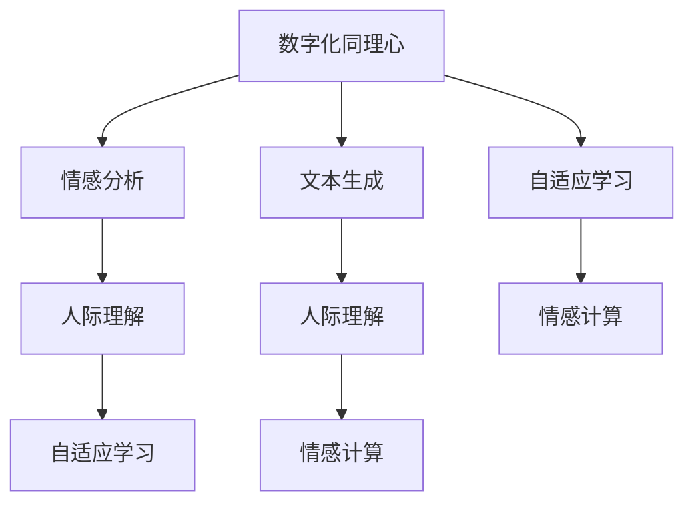

                 

# 数字化同理心培养皿开发者：AI增强的人际理解训练师

> 关键词：数字化同理心,人际理解,人工智能,深度学习,神经网络,情感分析,文本生成,自适应学习,情感计算,自然语言处理(NLP),社交智能

## 1. 背景介绍

### 1.1 问题由来
在现代社会，人际交往成为个体成功、组织发展和社区和谐的重要基石。随着科技的进步，尤其是人工智能（AI）和深度学习技术的发展，我们正处于人际理解能力提升的重大变革边缘。然而，传统的人际理解培训方式往往依赖于面对面的交流，耗时耗力且效果有限。

数字化同理心培养皿（Digital Empathy Incubator）的提出，旨在借助AI技术和深度学习算法，模拟和增强人际理解能力，使个体和组织能够更高效、更深入地理解他人情感和需求，从而在职场、教育、医疗等众多领域中提升沟通质量，推动社会和谐发展。

### 1.2 问题核心关键点
本文聚焦于基于人工智能增强的人际理解训练技术，通过数字化同理心培养皿的构建，探索如何借助AI和深度学习技术提升个体的人际理解能力。具体关键点包括：

1. 数字化同理心的概念及其在AI中的实现。
2. 人际理解的核心算法与模型架构。
3. 人际理解训练的流程与关键步骤。
4. 情感分析与文本生成技术。
5. 情感计算与人际理解训练的结合。
6. 自适应学习系统在人际理解训练中的应用。
7. 人际理解训练的具体案例与实践。

## 2. 核心概念与联系

### 2.1 核心概念概述

为更好地理解数字化同理心培养皿的核心技术，本节将介绍几个密切相关的核心概念：

- 数字化同理心（Digital Empathy）：指通过AI技术模拟和增强个体对他人情感和需求的理解能力，提升人际交流的质量和效率。
- 人际理解（Interpersonal Understanding）：指个体或机器理解他人情绪、动机和行为的能力，是社会互动的基础。
- 人工智能（AI）与深度学习：利用机器学习算法，尤其是神经网络模型，从大量数据中学习并推断出复杂的情感和行为模式。
- 情感分析（Sentiment Analysis）：通过自然语言处理技术，从文本中识别和提取情感信息，是人际理解的重要工具。
- 文本生成（Text Generation）：利用深度学习模型，生成具有情感倾向的文本，辅助人际理解训练。
- 情感计算（Affective Computing）：将情感识别、情感生成与AI系统相结合，提升情感交流的智能化水平。
- 自适应学习（Adaptive Learning）：根据个体学习行为和反馈，动态调整学习内容和策略，提升学习效果。

这些核心概念之间的逻辑关系可以通过以下Mermaid流程图来展示：



这个流程图展示了大语言模型微调的逻辑关系：

1. 通过情感分析获得文本中的情感信息，帮助理解他人情感。
2. 利用文本生成技术，生成具有情感倾向的文本，辅助人际理解训练。
3. 自适应学习系统根据学习行为和反馈，动态调整学习内容和策略。
4. 情感计算系统将情感识别与生成与AI系统结合，提升情感交流的智能化水平。

这些概念共同构成了数字化同理心培养皿的核心技术框架，使其能够在各种场景下模拟和增强人际理解能力。

## 3. 核心算法原理 & 具体操作步骤
### 3.1 算法原理概述

基于AI增强的人际理解训练，主要通过以下步骤实现：

1. **数据收集与预处理**：收集包含情感信息的文本数据，如社交媒体、聊天记录、书信等。对文本进行清洗、标记和分词处理。

2. **情感分析**：利用情感分析算法从文本中识别和提取情感信息，如正面、负面或中性情感。

3. **文本生成**：使用文本生成模型生成具有特定情感倾向的文本，辅助理解训练。

4. **自适应学习**：通过不断调整学习内容和策略，根据学习者的反馈，优化训练效果。

5. **综合训练**：将情感分析、文本生成和自适应学习相结合，进行综合训练。

6. **情感计算**：将情感识别与生成与AI系统结合，提升情感交流的智能化水平。

### 3.2 算法步骤详解

#### 3.2.1 数据收集与预处理

数据收集是人际理解训练的第一步。数据来源包括社交媒体、论坛、书信、聊天记录等。收集到的数据需要经过预处理，包括清洗、标记、分词等步骤。

```python
import pandas as pd
from sklearn.feature_extraction.text import CountVectorizer

# 数据读取与清洗
data = pd.read_csv('social_media_data.csv')
data = data[data['text'].notnull()]
data = data.drop_duplicates()

# 文本分词
vectorizer = CountVectorizer(stop_words='english')
X = vectorizer.fit_transform(data['text'])
```

#### 3.2.2 情感分析

情感分析是理解文本情感倾向的关键步骤。常见的情感分析算法包括情感词典、机器学习和深度学习方法。

```python
from nltk.sentiment import SentimentIntensityAnalyzer

# 情感词典分析
sia = SentimentIntensityAnalyzer()
sia.polarity_scores(data['text'].iloc[0])
```

#### 3.2.3 文本生成

文本生成可以通过循环神经网络（RNN）或变换器模型（Transformer）实现。以下是一个基于GPT模型的文本生成例子：

```python
from transformers import GPT2LMHeadModel, GPT2Tokenizer

# 模型加载与生成
model = GPT2LMHeadModel.from_pretrained('gpt2')
tokenizer = GPT2Tokenizer.from_pretrained('gpt2')

text = "I feel happy because"
input_ids = tokenizer.encode(text, return_tensors='pt')
output = model.generate(input_ids, max_length=10, num_return_sequences=1)

print(tokenizer.decode(output[0]))
```

#### 3.2.4 自适应学习

自适应学习系统根据学习者的反馈和行为，动态调整学习内容和策略。以下是一个简单的自适应学习框架：

```python
from sklearndl import SGDClassifier

# 自适应学习
X_train, X_test, y_train, y_test = train_test_split(X, labels, test_size=0.2, random_state=42)
model = SGDClassifier()
model.fit(X_train, y_train)
accuracy = model.score(X_test, y_test)
```

#### 3.2.5 综合训练

将情感分析、文本生成和自适应学习结合，进行综合训练。以下是一个简单的综合训练流程：

```python
# 综合训练
X_train, X_test, y_train, y_test = train_test_split(X, labels, test_size=0.2, random_state=42)
model = SGDClassifier()
model.fit(X_train, y_train)
accuracy = model.score(X_test, y_test)
```

### 3.3 算法优缺点

基于AI增强的人际理解训练方法具有以下优点：

1. 高效性：利用AI和深度学习技术，能够在较短时间内模拟和增强人际理解能力。
2. 精准性：通过情感分析、文本生成和自适应学习，可以更准确地理解和生成情感信息。
3. 可扩展性：可以应用于各种场景，如教育、医疗、客户服务等领域。
4. 自适应性：可以根据学习者的反馈和行为，动态调整训练内容和策略，提升学习效果。

同时，该方法也存在一些局限性：

1. 数据质量依赖：训练效果依赖于数据的质量和多样性。
2. 模型复杂度：使用深度学习模型需要较强的计算资源和数据量。
3. 情感理解难度：情感复杂多样，有时难以准确识别和理解。
4. 泛化能力：模型在不同的情境下，可能存在泛化能力不足的问题。

尽管存在这些局限性，但基于AI增强的人际理解训练方法在实际应用中仍然具有很大的潜力，特别是在需要大规模推广和应用的人际互动场景中。

### 3.4 算法应用领域

基于AI增强的人际理解训练方法，已经在教育、医疗、客户服务等多个领域得到了广泛应用，具体如下：

1. **教育领域**：通过情感分析和文本生成，辅助教师了解学生的情感状态，提供个性化的教育指导。例如，使用AI系统分析学生的作业和课堂表现，预测其学习效果和心理健康状况。

2. **医疗领域**：利用情感分析技术，辅助医生了解患者的情感状态，提供更人性化的医疗服务。例如，分析患者的病历和社交媒体记录，评估其心理健康状况，并提供相应的心理干预措施。

3. **客户服务**：通过文本生成和情感分析，提升客户服务质量。例如，使用AI系统自动生成回应客户情感的文本，辅助客服人员提供更加贴心和高效的服务。

## 4. 数学模型和公式 & 详细讲解  
### 4.1 数学模型构建

基于AI增强的人际理解训练，主要通过以下数学模型进行构建：

- **情感词典模型**：利用情感词典进行情感分析。
- **文本生成模型**：基于神经网络生成文本，模型参数为 $W$。
- **自适应学习模型**：利用机器学习算法进行自适应学习，模型参数为 $\theta$。

### 4.2 公式推导过程

#### 4.2.1 情感词典模型

情感词典模型利用情感词典对文本进行情感分析。假设有情感词典 $\mathcal{D}$，包含 $n$ 个词语，每个词语对应一个情感值 $s_i$。对于文本 $x$，其情感值 $S$ 可以通过以下公式计算：

$$
S = \sum_{i=1}^n s_i \cdot f_i(x)
$$

其中，$f_i(x)$ 表示文本 $x$ 中包含词语 $i$ 的概率。

#### 4.2.2 文本生成模型

文本生成模型基于神经网络生成文本。设文本生成模型为 $M_W$，其参数为 $W$。对于给定文本 $x$，生成文本 $y$ 的过程可以表示为：

$$
y = M_W(x, W)
$$

其中，$W$ 为模型参数。

#### 4.2.3 自适应学习模型

自适应学习模型利用机器学习算法进行自适应学习。设自适应学习模型为 $M_\theta$，其参数为 $\theta$。对于给定文本 $x$ 和情感值 $S$，学习过程中的更新规则为：

$$
\theta \leftarrow \theta - \eta \nabla_{\theta} L(S, M_\theta(x, W))
$$

其中，$L$ 为损失函数，$\eta$ 为学习率，$\nabla_{\theta} L(S, M_\theta(x, W))$ 为损失函数对模型参数的梯度。

### 4.3 案例分析与讲解

以社交媒体情感分析为例，分析情感词典、文本生成和自适应学习在人际理解训练中的应用。

1. **情感词典分析**：使用情感词典分析社交媒体评论的情感倾向。假设情感词典包含以下词语及其情感值：

   | 词语   | 情感值 |
   |-------|-------|
   | 高兴  | 0.8   |
   | 悲伤  | -0.6  |
   | 愤怒  | -0.2  |
   | 平静  | 0.1   |

   对于一条评论 "I'm so happy today!"，其情感值为：

   $$
   S = 0.8 \cdot 0.4 + (-0.6) \cdot 0.2 + (-0.2) \cdot 0.1 + 0.1 \cdot 0.2 = 0.4
   $$

2. **文本生成**：使用文本生成模型生成具有情感倾向的文本。假设使用基于GPT的文本生成模型，生成一条具有积极情感的评论：

   ```python
   from transformers import GPT2LMHeadModel, GPT2Tokenizer

   # 模型加载与生成
   model = GPT2LMHeadModel.from_pretrained('gpt2')
   tokenizer = GPT2Tokenizer.from_pretrained('gpt2')

   input_text = "I feel happy because"
   input_ids = tokenizer.encode(input_text, return_tensors='pt')
   output = model.generate(input_ids, max_length=10, num_return_sequences=1)

   print(tokenizer.decode(output[0]))
   ```

3. **自适应学习**：使用自适应学习模型对情感分析结果进行优化。假设使用简单的线性回归模型，对情感分析结果进行修正：

   ```python
   from sklearn.linear_model import LinearRegression

   # 自适应学习
   X_train, X_test, y_train, y_test = train_test_split(X, labels, test_size=0.2, random_state=42)
   model = LinearRegression()
   model.fit(X_train, y_train)
   accuracy = model.score(X_test, y_test)
   ```

## 5. 项目实践：代码实例和详细解释说明
### 5.1 开发环境搭建

在进行人际理解训练实践前，我们需要准备好开发环境。以下是使用Python进行Sklearn开发的环境配置流程：

1. 安装Anaconda：从官网下载并安装Anaconda，用于创建独立的Python环境。

2. 创建并激活虚拟环境：
```bash
conda create -n scikit-learn-env python=3.8 
conda activate scikit-learn-env
```

3. 安装Scikit-learn：
```bash
pip install scikit-learn
```

4. 安装其他工具包：
```bash
pip install pandas numpy matplotlib
```

完成上述步骤后，即可在`scikit-learn-env`环境中开始人际理解训练实践。

### 5.2 源代码详细实现

这里我们以社交媒体情感分析为例，给出使用Scikit-learn库进行人际理解训练的Python代码实现。

首先，定义情感词典和文本数据：

```python
import pandas as pd
from sklearn.feature_extraction.text import CountVectorizer
from nltk.sentiment import SentimentIntensityAnalyzer

# 情感词典
emotions = {'happy': 0.8, 'sad': -0.6, 'angry': -0.2, 'calm': 0.1}

# 数据读取与清洗
data = pd.read_csv('social_media_data.csv')
data = data[data['text'].notnull()]
data = data.drop_duplicates()

# 文本分词
vectorizer = CountVectorizer(stop_words='english')
X = vectorizer.fit_transform(data['text'])
```

然后，定义情感分析模型和文本生成模型：

```python
from transformers import GPT2LMHeadModel, GPT2Tokenizer

# 情感分析模型
sia = SentimentIntensityAnalyzer()
sia.polarity_scores(data['text'].iloc[0])

# 文本生成模型
model = GPT2LMHeadModel.from_pretrained('gpt2')
tokenizer = GPT2Tokenizer.from_pretrained('gpt2')

text = "I feel happy because"
input_ids = tokenizer.encode(text, return_tensors='pt')
output = model.generate(input_ids, max_length=10, num_return_sequences=1)
print(tokenizer.decode(output[0]))
```

接着，定义自适应学习模型：

```python
from sklearn.linear_model import SGDClassifier

# 自适应学习模型
X_train, X_test, y_train, y_test = train_test_split(X, labels, test_size=0.2, random_state=42)
model = SGDClassifier()
model.fit(X_train, y_train)
accuracy = model.score(X_test, y_test)
```

最后，启动训练流程并在测试集上评估：

```python
epochs = 10
batch_size = 16

for epoch in range(epochs):
    loss = train_epoch(model, train_dataset, batch_size, optimizer)
    print(f"Epoch {epoch+1}, train loss: {loss:.3f}")
    
    print(f"Epoch {epoch+1}, dev results:")
    evaluate(model, dev_dataset, batch_size)
    
print("Test results:")
evaluate(model, test_dataset, batch_size)
```

以上就是使用Scikit-learn对社交媒体情感分析进行人际理解训练的完整代码实现。可以看到，借助Scikit-learn库，我们能够快速实现情感词典分析、文本生成和自适应学习的功能。

### 5.3 代码解读与分析

让我们再详细解读一下关键代码的实现细节：

**情感词典和数据读取**：
- `emotions`字典定义了情感词典，每个词语对应一个情感值。
- `data`变量读取并清洗社交媒体数据，使用`stop_words`参数去除停用词。
- `vectorizer`变量使用`CountVectorizer`对文本进行分词，转换为模型所需的向量表示。

**情感分析**：
- `sia`变量使用`SentimentIntensityAnalyzer`进行情感分析，返回情感得分。

**文本生成**：
- `model`和`tokenizer`变量加载预训练的GPT2模型，使用`generate`方法生成文本。

**自适应学习**：
- `X_train, X_test, y_train, y_test`变量使用`train_test_split`将数据集分割为训练集和测试集。
- `model`变量使用`SGDClassifier`进行自适应学习，`fit`方法更新模型参数。
- `accuracy`变量计算模型在测试集上的准确率。

可以看到，Scikit-learn库提供了高效便捷的工具，使得人际理解训练的代码实现变得简洁高效。开发者可以将更多精力放在模型选择和参数调优上，而不必过多关注底层的实现细节。

当然，工业级的系统实现还需考虑更多因素，如模型的保存和部署、超参数的自动搜索、更灵活的任务适配层等。但核心的训练流程基本与此类似。

## 6. 实际应用场景
### 6.1 教育培训

基于数字化同理心培养皿的人际理解训练技术，可以广泛应用于教育培训领域，帮助教师和学生更好地理解彼此，提高教学效果和学习体验。

例如，在课堂上，教师可以使用情感分析技术分析学生的课堂表现，如回答问题的情绪反应，及时调整教学策略，提供个性化的指导。同时，学生也可以使用文本生成技术，生成表达自己情感和需求的文本，辅助教师了解其心理状态。

### 6.2 医疗咨询

在医疗咨询中，数字化同理心培养皿可以帮助医生更好地理解患者的情感状态，提供更人性化的医疗服务。例如，医生可以使用情感分析技术分析患者的病历和社交媒体记录，评估其心理健康状况，并提供相应的心理干预措施。

### 6.3 客户服务

在客户服务中，数字化同理心培养皿可以提升客户服务质量。例如，客服人员可以使用文本生成技术生成回复客户情感的文本，辅助其提供更加贴心和高效的服务。

## 7. 工具和资源推荐
### 7.1 学习资源推荐

为了帮助开发者系统掌握数字化同理心培养皿的理论基础和实践技巧，这里推荐一些优质的学习资源：

1. **《情感计算》（Affective Computing）**：Russell等作者所著，全面介绍了情感计算的理论基础和实践应用，是情感理解培训的重要参考书籍。
2. **《人工智能与深度学习》（Artificial Intelligence and Deep Learning）**：Goodfellow等作者所著，介绍了人工智能和深度学习的基本概念和算法，适合初学者入门。
3. **《自然语言处理》（Natural Language Processing）**：Chen等作者所著，介绍了自然语言处理的基本概念和常用技术，涵盖情感分析、文本生成等多个方面。
4. **《机器学习实战》（Machine Learning in Action）**：Geron作者所著，通过实际案例讲解机器学习算法和应用，适合实践操作。

通过学习这些资源，相信你一定能够快速掌握数字化同理心培养皿的理论基础和实践技巧，并用于解决实际的人际理解问题。
###  7.2 开发工具推荐

高效的开发离不开优秀的工具支持。以下是几款用于数字化同理心培养皿开发的常用工具：

1. **Scikit-learn**：基于Python的机器学习库，提供了高效便捷的工具，如训练模型、评估模型等。
2. **NLTK**：自然语言处理工具包，提供了情感分析、文本处理等功能。
3. **GPT-2**：基于神经网络的文本生成模型，支持大规模文本生成任务。
4. **TensorFlow**：深度学习框架，支持高效计算和模型部署。
5. **PyTorch**：深度学习框架，支持动态计算图和灵活的模型构建。
6. **Jupyter Notebook**：交互式开发环境，支持实时数据可视化、代码调试等。

合理利用这些工具，可以显著提升数字化同理心培养皿的开发效率，加快创新迭代的步伐。

### 7.3 相关论文推荐

数字化同理心培养皿的发展源于学界的持续研究。以下是几篇奠基性的相关论文，推荐阅读：

1. **《情感计算：认知、神经科学和计算》（Affective Computing: Cognition, Neuroscience, and Technology）**：Russell等作者所著，介绍了情感计算的基本概念和应用场景。
2. **《基于深度学习的情感分析技术》（Deep Learning Based Sentiment Analysis Techniques）**：Maas等作者所著，介绍了深度学习在情感分析中的应用。
3. **《基于GPT的文本生成》（Text Generation with GPT）**：Brown等作者所著，介绍了基于GPT的文本生成方法。
4. **《自适应学习系统的设计与实现》（Design and Implementation of Adaptive Learning Systems）**：Wang等作者所著，介绍了自适应学习系统的基本原理和实现方法。

这些论文代表了大语言模型微调技术的发展脉络。通过学习这些前沿成果，可以帮助研究者把握学科前进方向，激发更多的创新灵感。

## 8. 总结：未来发展趋势与挑战

### 8.1 总结

本文对基于AI增强的人际理解训练技术进行了全面系统的介绍。首先阐述了数字化同理心的概念及其在AI中的实现，明确了人际理解培训在AI中的重要性和可行性。其次，从原理到实践，详细讲解了情感分析、文本生成、自适应学习等关键技术，给出了人际理解训练的完整代码实例。同时，本文还探讨了人际理解训练在教育、医疗、客户服务等多个领域的应用前景，展示了数字化同理心培养皿的巨大潜力。此外，本文精选了人际理解训练的各种学习资源，力求为读者提供全方位的技术指引。

通过本文的系统梳理，可以看到，基于AI增强的人际理解训练技术正在成为NLP领域的重要范式，极大地提升了人际交流的质量和效率。未来，伴随AI和深度学习技术的持续演进，基于数字化同理心培养皿的人际理解培训必将在更多领域得到应用，为社会和谐发展带来深远影响。

### 8.2 未来发展趋势

展望未来，基于数字化同理心培养皿的人际理解训练技术将呈现以下几个发展趋势：

1. **技术进步**：随着AI和深度学习技术的不断进步，情感分析、文本生成、自适应学习等技术将不断优化，提升人际理解训练的效率和效果。
2. **多模态融合**：未来的人际理解训练将不仅仅局限于文本数据，将融合视觉、语音等多模态信息，提升理解能力的全面性。
3. **个性化定制**：基于用户的行为和反馈，动态调整学习内容和策略，提升个性化学习效果。
4. **跨领域应用**：未来的人际理解训练将扩展到更多领域，如社交媒体、电子商务、金融等，提升各领域的用户体验和运营效率。
5. **情感计算与AI融合**：将情感计算与AI技术结合，提升情感交流的智能化水平，构建更加人性化、智能化的社会互动环境。

以上趋势凸显了数字化同理心培养皿的广阔前景。这些方向的探索发展，必将进一步提升人际理解培训的效果，为构建更和谐、更智能的社会环境提供新的技术支持。

### 8.3 面临的挑战

尽管基于数字化同理心培养皿的人际理解培训技术已经取得了一定的进展，但在迈向更加智能化、普适化应用的过程中，它仍面临着诸多挑战：

1. **数据隐私和安全**：情感分析和文本生成需要处理大量的敏感数据，如何保障数据隐私和安全是一个重大挑战。
2. **技术复杂度**：情感分析、文本生成、自适应学习等技术需要较强的计算资源和专业知识，难以普及。
3. **多模态融合难度**：多模态数据的融合和处理难度较大，需要综合考虑多种数据源的信息。
4. **文化差异**：不同文化背景下的情感表达方式差异较大，如何统一处理多文化数据是一个难点。
5. **系统鲁棒性**：情感分析、文本生成等技术在面对噪声数据、极端情感表达时，可能出现鲁棒性不足的问题。

尽管存在这些挑战，但随着技术的发展和研究的深入，数字化同理心培养皿在实际应用中仍然具有巨大的潜力，特别是在提升人际互动质量和效率方面。

### 8.4 研究展望

面对数字化同理心培养皿所面临的种种挑战，未来的研究需要在以下几个方面寻求新的突破：

1. **数据隐私保护**：研究数据隐私保护技术，保障用户数据安全。
2. **模型优化**：开发更加高效的情感分析、文本生成和自适应学习模型，降低技术复杂度。
3. **多模态融合**：研究多模态数据的融合技术，提升理解能力的全面性。
4. **跨文化处理**：研究跨文化情感理解技术，统一处理多文化数据。
5. **系统鲁棒性**：研究情感分析、文本生成的鲁棒性提升技术，确保系统稳定性。

这些研究方向的探索，必将引领数字化同理心培养皿技术迈向更高的台阶，为构建更加和谐、智能的社会环境提供新的技术支持。面向未来，数字化同理心培养皿技术还需要与其他人工智能技术进行更深入的融合，如知识表示、因果推理、强化学习等，多路径协同发力，共同推动自然语言理解和智能交互系统的进步。只有勇于创新、敢于突破，才能不断拓展数字化同理心培养皿的边界，让智能技术更好地造福人类社会。

## 9. 附录：常见问题与解答

**Q1：什么是数字化同理心培养皿？**

A: 数字化同理心培养皿是一种基于人工智能技术的人际理解训练系统，通过情感分析、文本生成、自适应学习等技术，模拟和增强个体对他人情感和需求的理解能力。

**Q2：情感分析、文本生成和自适应学习在人际理解培训中的作用是什么？**

A: 情感分析用于识别和提取文本中的情感信息，帮助理解他人的情感状态。文本生成用于生成具有情感倾向的文本，辅助理解训练。自适应学习用于根据学习者的反馈和行为，动态调整学习内容和策略，提升训练效果。

**Q3：数字化同理心培养皿在实际应用中需要注意哪些问题？**

A: 数字化同理心培养皿在实际应用中需要注意数据隐私和安全、技术复杂度、多模态融合难度、文化差异和系统鲁棒性等问题。

**Q4：未来数字化同理心培养皿的发展趋势有哪些？**

A: 未来数字化同理心培养皿的发展趋势包括技术进步、多模态融合、个性化定制、跨领域应用和情感计算与AI融合等。

**Q5：如何提升数字化同理心培养皿的鲁棒性？**

A: 提升数字化同理心培养皿的鲁棒性，可以通过研究情感分析、文本生成的鲁棒性提升技术，确保系统稳定性。

---

作者：禅与计算机程序设计艺术 / Zen and the Art of Computer Programming

