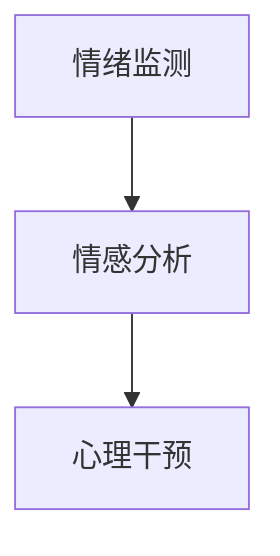

                 

# 数字化心理健康创业：AI辅助的情绪管理

> 关键词：数字化心理健康, AI辅助,情绪管理,心理危机干预,情感分析

## 1. 背景介绍

### 1.1 问题由来
近年来，随着全球范围内精神健康问题的普遍化，如何更好地识别、预防和干预心理疾病已成为社会高度关注的话题。世界卫生组织(WHO)指出，精神健康问题正迅速成为全球最常见的健康问题，当前全球约有一半的人口在其一生中会受到影响。

在这样的背景下，心理健康的数字化创业应运而生，旨在利用前沿技术手段，提升心理健康服务的效率和质量，帮助大众更好地应对心理困扰。数字化心理健康创业主要涵盖了在线咨询、心理健康监测、心理危机干预、情感分析等多个方向。其中，AI辅助的情绪管理成为了一个备受关注的研究热点。

### 1.2 问题核心关键点
情绪管理是数字化心理健康创业中的重要环节，通过AI技术，能够实现对用户情绪的自动监测和干预，提高用户的心理健康水平。AI辅助的情绪管理主要包含以下几个关键点：

- 情绪监测：通过AI算法自动分析用户的文本、语音、表情等数据，识别出用户当前的情绪状态。
- 情感分析：对用户的情绪数据进行深度挖掘，了解情绪背后的原因和触发因素，进行情感表达和情感理解。
- 心理干预：根据用户的情绪状态，AI系统可以提供个性化的情绪干预策略，如情绪转移、情感释放等，帮助用户缓解压力，改善心理健康。

这些核心关键点共同构成了AI辅助情绪管理的核心框架，通过技术手段，为用户的情绪管理提供了科学的解决方案。

### 1.3 问题研究意义
研究AI辅助情绪管理的意义在于：

1. **普及心理健康服务**：AI技术能够突破地域和时间限制，为全球用户提供便捷的心理健康服务，减少心理疾病的发生率。
2. **提升干预效率**：AI算法可以实时监测和分析用户的情绪状态，快速响应用户需求，提高心理干预的效率。
3. **个性化支持**：根据用户的情绪特征和行为模式，AI系统能够提供定制化的情绪管理策略，提升用户的心理健康体验。
4. **数据驱动决策**：通过数据分析，AI系统能够发现潜在的心理风险，及早进行干预，减少自杀、自残等极端情况的发生。
5. **降低成本**：AI技术降低了心理健康服务的成本，使更多人能够获得专业的心理健康支持。

## 2. 核心概念与联系

### 2.1 核心概念概述

要深入理解AI辅助情绪管理的原理和应用，首先需要对几个核心概念进行梳理：

- **情绪监测**：通过自然语言处理(NLP)、语音识别(SR)、面部表情识别(FER)等技术，自动分析用户的情绪状态。
- **情感分析**：利用深度学习模型对用户情绪进行理解，识别出情绪背后的原因和触发因素，进行情感分类和情感表达。
- **心理干预**：基于情绪监测和情感分析结果，提供个性化的情绪管理策略，如情绪转移、情感释放、心理支持等。

这些核心概念之间的联系可以通过以下Mermaid流程图来展示：



这个流程图展示了大规模语言模型在情绪监测、情感分析和心理干预中的作用。用户输入的文本、语音、面部表情等数据，首先通过情绪监测技术进行初步分析，识别出情绪状态。然后，情感分析技术对情绪数据进行深度挖掘，理解情绪背后的原因和触发因素。最终，心理干预技术根据情绪监测和情感分析结果，提供个性化的情绪管理策略，帮助用户缓解压力，改善心理健康。

## 3. 核心算法原理 & 具体操作步骤
### 3.1 算法原理概述

AI辅助情绪管理的核心算法主要包括以下几个步骤：

1. **数据收集**：收集用户的文本、语音、面部表情等情绪数据，作为模型输入。
2. **情绪监测**：通过NLP模型或情感分类器，自动分析用户的情绪状态，生成情绪标签。
3. **情感分析**：利用深度学习模型，对情绪数据进行情感理解，识别出情绪背后的原因和触发因素。
4. **心理干预**：根据情绪监测和情感分析结果，提供个性化的情绪管理策略，如情绪转移、情感释放、心理支持等。

### 3.2 算法步骤详解

以基于情感分析的情绪管理为例，以下是具体的算法步骤：

1. **数据准备**：
   - 收集用户的文本、语音、面部表情等情绪数据。
   - 对数据进行预处理，包括去除噪声、数据清洗、特征提取等。

2. **情感分析模型训练**：
   - 选择合适的情感分析模型，如BERT、RNN、CNN等。
   - 使用标注好的情绪数据集，对模型进行训练。
   - 在训练过程中，选择合适的损失函数和优化器，如交叉熵损失、AdamW等。

3. **情绪监测**：
   - 对用户的实时输入数据进行预处理。
   - 使用训练好的情感分析模型，对输入数据进行情感分类，生成情绪标签。
   - 记录用户在不同时间段的情绪状态，生成情绪变化曲线。

4. **情绪干预**：
   - 根据用户的情绪状态，选择适合的情绪管理策略，如情绪转移、情感释放等。
   - 提供个性化的情绪干预措施，如推荐放松音乐、心理疏导、呼吸训练等。
   - 对干预效果进行评估，调整干预策略。

### 3.3 算法优缺点

AI辅助情绪管理的算法具有以下优点：

- **高效实时**：通过自动化的情绪监测和情感分析，可以快速响应用户的情绪变化，提供及时的情绪管理支持。
- **个性化定制**：根据用户的情绪特征和行为模式，提供定制化的情绪管理策略，提升用户体验。
- **广泛适用**：适用于各种情绪管理场景，如在线咨询、心理健康监测、心理危机干预等。

同时，该算法也存在一些局限性：

- **数据依赖**：情感分析模型的效果依赖于标注数据的质量和数量，标注数据的不足会影响模型性能。
- **隐私风险**：用户的情绪数据涉及隐私，数据安全和隐私保护是一个重要问题。
- **模型复杂度**：情感分析模型需要较深的模型结构和大量的计算资源，对硬件要求较高。
- **解释性不足**：情感分析模型的决策过程复杂，缺乏可解释性，难以解释模型的推理逻辑。

### 3.4 算法应用领域

AI辅助情绪管理技术在多个领域都有广泛的应用：

- **在线心理健康服务**：通过AI技术，提供24/7的心理咨询服务，及时响应用户的心理需求，缓解心理压力。
- **企业员工关怀**：在企业内部，利用AI技术监测员工的情绪状态，及时发现心理问题，提供心理辅导和支持。
- **学校心理支持**：在学校中，利用AI技术监测学生的情绪变化，及时进行心理干预，预防心理疾病的发生。
- **军队心理保障**：在军队中，利用AI技术监测士兵的情绪状态，提供心理支持，缓解战争压力。
- **居家情绪管理**：通过AI设备监测家庭成员的情绪状态，提供个性化的情绪管理策略，提升家庭幸福感。

## 4. 数学模型和公式 & 详细讲解 & 举例说明

### 4.1 数学模型构建

为了更好地理解AI辅助情绪管理的数学模型，本节将介绍几个密切相关的数学概念：

- **情感分类**：将用户的情绪状态分类为正面、中性、负面等类别，使用softmax函数进行分类。
- **情感强度**：通过情感强度评分，评估用户情绪的强度和情感倾向，使用情感强度评估函数进行计算。
- **情绪变化曲线**：通过时间序列分析，绘制用户情绪的变化曲线，使用滑动窗口技术进行曲线平滑。

### 4.2 公式推导过程

以情感分类模型为例，以下是具体的数学推导过程：

设用户输入的文本为 $x$，对应的情绪分类为 $y$。情感分类模型的目标是最小化预测概率与真实标签之间的交叉熵损失：

$$
\min_{\theta} -\frac{1}{N}\sum_{i=1}^N(y_i\log P(y_i|x;\theta)+(1-y_i)\log(1-P(y_i|x;\theta)))
$$

其中 $P(y_i|x;\theta)$ 表示模型对输入文本 $x$ 的情绪分类概率，$\theta$ 为模型参数。

为了求解上述最小化问题，通常使用反向传播算法更新模型参数。以softmax情感分类模型为例，其输出层为 $softmax$ 函数，对数似然损失函数的梯度计算公式如下：

$$
\frac{\partial \mathcal{L}}{\partial \theta} = -\frac{1}{N}\sum_{i=1}^N(y_i\frac{\partial \log P(y_i|x;\theta)}{\partial \theta}-(1-y_i)\frac{\partial \log(1-P(y_i|x;\theta))}{\partial \theta})
$$

其中 $\frac{\partial \log P(y_i|x;\theta)}{\partial \theta}$ 为softmax函数对 $\theta$ 的梯度。

### 4.3 案例分析与讲解

以下是一个具体的情感分类案例分析：

假设有一组用户情绪数据 $(x_i,y_i),i=1,\cdots,N$，其中 $y_i$ 表示情绪分类标签。使用BERT模型进行情感分类，计算交叉熵损失函数 $\mathcal{L}$，并使用AdamW优化器进行模型训练。训练过程中，需要选择合适的学习率 $\eta$ 和优化器参数，如学习率衰减策略、权重衰减系数等。

## 5. 项目实践：代码实例和详细解释说明
### 5.1 开发环境搭建

在进行AI辅助情绪管理的项目实践前，需要先准备好开发环境。以下是使用Python进行PyTorch开发的环境配置流程：

1. 安装Anaconda：从官网下载并安装Anaconda，用于创建独立的Python环境。

2. 创建并激活虚拟环境：
```bash
conda create -n pytorch-env python=3.8 
conda activate pytorch-env
```

3. 安装PyTorch：根据CUDA版本，从官网获取对应的安装命令。例如：
```bash
conda install pytorch torchvision torchaudio cudatoolkit=11.1 -c pytorch -c conda-forge
```

4. 安装TensorFlow：使用以下命令安装TensorFlow：
```bash
pip install tensorflow==2.3
```

5. 安装各类工具包：
```bash
pip install numpy pandas scikit-learn matplotlib tqdm jupyter notebook ipython
```

完成上述步骤后，即可在`pytorch-env`环境中开始项目实践。

### 5.2 源代码详细实现

下面我们以情感分类任务为例，给出使用PyTorch对BERT模型进行情感分类的PyTorch代码实现。

首先，定义情感分类任务的数据处理函数：

```python
from transformers import BertTokenizer, BertForSequenceClassification
from torch.utils.data import Dataset
import torch

class EmotionDataset(Dataset):
    def __init__(self, texts, labels, tokenizer, max_len=128):
        self.texts = texts
        self.labels = labels
        self.tokenizer = tokenizer
        self.max_len = max_len
        
    def __len__(self):
        return len(self.texts)
    
    def __getitem__(self, item):
        text = self.texts[item]
        label = self.labels[item]
        
        encoding = self.tokenizer(text, return_tensors='pt', max_length=self.max_len, padding='max_length', truncation=True)
        input_ids = encoding['input_ids'][0]
        attention_mask = encoding['attention_mask'][0]
        
        # 对标签进行编码
        encoded_label = label2id[label] 
        encoded_label = [encoded_label] * (self.max_len - 1) + [label2id['O']]
        labels = torch.tensor(encoded_label, dtype=torch.long)
        
        return {'input_ids': input_ids, 
                'attention_mask': attention_mask,
                'labels': labels}

# 标签与id的映射
label2id = {'正面': 0, '中性': 1, '负面': 2}
id2label = {v: k for k, v in label2id.items()}

# 创建dataset
tokenizer = BertTokenizer.from_pretrained('bert-base-uncased')

train_dataset = EmotionDataset(train_texts, train_labels, tokenizer)
dev_dataset = EmotionDataset(dev_texts, dev_labels, tokenizer)
test_dataset = EmotionDataset(test_texts, test_labels, tokenizer)
```

然后，定义模型和优化器：

```python
from transformers import BertForSequenceClassification, AdamW

model = BertForSequenceClassification.from_pretrained('bert-base-uncased', num_labels=len(label2id))

optimizer = AdamW(model.parameters(), lr=2e-5)
```

接着，定义训练和评估函数：

```python
from torch.utils.data import DataLoader
from tqdm import tqdm
from sklearn.metrics import accuracy_score

device = torch.device('cuda') if torch.cuda.is_available() else torch.device('cpu')
model.to(device)

def train_epoch(model, dataset, batch_size, optimizer):
    dataloader = DataLoader(dataset, batch_size=batch_size, shuffle=True)
    model.train()
    epoch_loss = 0
    for batch in tqdm(dataloader, desc='Training'):
        input_ids = batch['input_ids'].to(device)
        attention_mask = batch['attention_mask'].to(device)
        labels = batch['labels'].to(device)
        model.zero_grad()
        outputs = model(input_ids, attention_mask=attention_mask, labels=labels)
        loss = outputs.loss
        epoch_loss += loss.item()
        loss.backward()
        optimizer.step()
    return epoch_loss / len(dataloader)

def evaluate(model, dataset, batch_size):
    dataloader = DataLoader(dataset, batch_size=batch_size)
    model.eval()
    preds, labels = [], []
    with torch.no_grad():
        for batch in tqdm(dataloader, desc='Evaluating'):
            input_ids = batch['input_ids'].to(device)
            attention_mask = batch['attention_mask'].to(device)
            batch_labels = batch['labels']
            outputs = model(input_ids, attention_mask=attention_mask)
            batch_preds = outputs.logits.argmax(dim=2).to('cpu').tolist()
            batch_labels = batch_labels.to('cpu').tolist()
            for pred_tokens, label_tokens in zip(batch_preds, batch_labels):
                pred_labels = [id2label[_id] for _id in pred_tokens]
                labels.append(label_tokens)
                preds.append(pred_labels)
                
    return accuracy_score(labels, preds)
```

最后，启动训练流程并在测试集上评估：

```python
epochs = 5
batch_size = 16

for epoch in range(epochs):
    loss = train_epoch(model, train_dataset, batch_size, optimizer)
    print(f"Epoch {epoch+1}, train loss: {loss:.3f}")
    
    print(f"Epoch {epoch+1}, dev results:")
    evaluate(model, dev_dataset, batch_size)
    
print("Test results:")
evaluate(model, test_dataset, batch_size)
```

以上就是使用PyTorch对BERT进行情感分类任务微调的完整代码实现。可以看到，得益于Transformers库的强大封装，我们可以用相对简洁的代码完成BERT模型的加载和微调。

### 5.3 代码解读与分析

让我们再详细解读一下关键代码的实现细节：

**EmotionDataset类**：
- `__init__`方法：初始化文本、标签、分词器等关键组件。
- `__len__`方法：返回数据集的样本数量。
- `__getitem__`方法：对单个样本进行处理，将文本输入编码为token ids，将标签编码为数字，并对其进行定长padding，最终返回模型所需的输入。

**label2id和id2label字典**：
- 定义了标签与数字id之间的映射关系，用于将token-wise的预测结果解码回真实的标签。

**训练和评估函数**：
- 使用PyTorch的DataLoader对数据集进行批次化加载，供模型训练和推理使用。
- 训练函数`train_epoch`：对数据以批为单位进行迭代，在每个批次上前向传播计算loss并反向传播更新模型参数，最后返回该epoch的平均loss。
- 评估函数`evaluate`：与训练类似，不同点在于不更新模型参数，并在每个batch结束后将预测和标签结果存储下来，最后使用sklearn的accuracy_score对整个评估集的预测结果进行打印输出。

**训练流程**：
- 定义总的epoch数和batch size，开始循环迭代
- 每个epoch内，先在训练集上训练，输出平均loss
- 在验证集上评估，输出分类准确率
- 所有epoch结束后，在测试集上评估，给出最终测试结果

可以看到，PyTorch配合Transformers库使得BERT微调的代码实现变得简洁高效。开发者可以将更多精力放在数据处理、模型改进等高层逻辑上，而不必过多关注底层的实现细节。

当然，工业级的系统实现还需考虑更多因素，如模型的保存和部署、超参数的自动搜索、更灵活的任务适配层等。但核心的微调范式基本与此类似。

## 6. 实际应用场景
### 6.1 智能客服系统

AI辅助情绪管理的情感分类技术，可以广泛应用于智能客服系统的构建。传统客服往往需要配备大量人力，高峰期响应缓慢，且一致性和专业性难以保证。而使用情感分类技术，可以7x24小时不间断服务，快速响应客户咨询，用自然流畅的语言解答各类常见问题。

在技术实现上，可以收集企业内部的历史客服对话记录，将问题-情绪对作为微调数据，训练情感分类模型。情感分类模型能够自动理解用户情绪，匹配最合适的回复策略，提供个性化的情感支持，缓解客户的负面情绪，提升客户满意度。

### 6.2 企业员工关怀

在企业内部，AI辅助情绪管理的情感分析技术，可以应用于员工情绪监测和心理健康支持。企业可以定期收集员工的反馈和建议，通过情感分析模型，识别出员工的情绪状态和压力来源。对于情绪异常的员工，系统可以及时提供心理辅导和支持，帮助其缓解压力，提升工作满意度。

### 6.3 学校心理支持

在学校中，AI辅助情绪管理的情感分析技术，可以应用于学生的心理健康监测。学校可以定期收集学生的情绪数据，通过情感分析模型，了解学生的情绪变化趋势和心理健康状况。对于情绪异常的学生，系统可以及时提供心理支持和辅导，帮助其恢复心理健康，提高学习效果。

### 6.4 军队心理保障

在军队中，AI辅助情绪管理的情感分析技术，可以应用于士兵的心理健康监测和心理干预。部队可以定期收集士兵的情绪数据，通过情感分析模型，了解士兵的情绪状态和压力来源。对于情绪异常的士兵，系统可以及时提供心理支持和干预，帮助其缓解压力，提高战斗力。

### 6.5 居家情绪管理

通过AI设备，可以实时监测家庭成员的情绪状态，提供个性化的情绪管理策略，提升家庭幸福感。家庭成员可以通过智能设备输入语音、表情等信息，情感分析模型能够自动理解家庭成员的情绪状态，提供相应的情绪支持，如放松音乐、心理疏导等，帮助家庭成员缓解压力，改善情绪状态。

## 7. 工具和资源推荐
### 7.1 学习资源推荐

为了帮助开发者系统掌握AI辅助情绪管理的理论基础和实践技巧，这里推荐一些优质的学习资源：

1. **《情绪计算：从理论到实践》**：这本书系统介绍了情绪计算的理论基础和应用场景，包括情感分类、情感分析、情绪监测等技术。

2. **CS224D《情感分析》课程**：斯坦福大学开设的情感分析课程，涵盖情感分类、情感强度评估、情感演化等核心内容，是了解情感分析技术的绝佳入门课程。

3. **Transformers库文档**：Transformers库的官方文档，提供了海量预训练模型和完整的情感分析样例代码，是上手实践的必备资料。

4. **Kaggle竞赛平台**：Kaggle上有很多情感分析竞赛数据集，通过参与竞赛，可以获得实战经验，掌握情感分析的最新技术。

5. **CLUE开源项目**：中文语言理解测评基准，涵盖大量不同类型的中文情感分析数据集，并提供了基于微调的baseline模型，助力中文情感分析技术发展。

通过对这些资源的学习实践，相信你一定能够快速掌握AI辅助情绪管理的精髓，并用于解决实际的情感分析问题。

### 7.2 开发工具推荐

高效的开发离不开优秀的工具支持。以下是几款用于情感分析开发的常用工具：

1. **PyTorch**：基于Python的开源深度学习框架，灵活动态的计算图，适合快速迭代研究。大部分预训练情感分析模型都有PyTorch版本的实现。

2. **TensorFlow**：由Google主导开发的开源深度学习框架，生产部署方便，适合大规模工程应用。同样有丰富的预训练情感分析模型资源。

3. **Transformers库**：HuggingFace开发的NLP工具库，集成了众多SOTA情感分析模型，支持PyTorch和TensorFlow，是进行情感分析任务开发的利器。

4. **Weights & Biases**：模型训练的实验跟踪工具，可以记录和可视化模型训练过程中的各项指标，方便对比和调优。与主流深度学习框架无缝集成。

5. **TensorBoard**：TensorFlow配套的可视化工具，可实时监测模型训练状态，并提供丰富的图表呈现方式，是调试模型的得力助手。

6. **Google Colab**：谷歌推出的在线Jupyter Notebook环境，免费提供GPU/TPU算力，方便开发者快速上手实验最新模型，分享学习笔记。

合理利用这些工具，可以显著提升情感分析任务的开发效率，加快创新迭代的步伐。

### 7.3 相关论文推荐

情感分析技术的不断演进，离不开学界的持续研究。以下是几篇奠基性的相关论文，推荐阅读：

1. **"Sentiment Analysis with Deep Learning: A Tutorial and Survey"**：这篇综述论文全面介绍了深度学习在情感分析中的应用，包括分类、强度评估、演化等任务。

2. **"Aspect-based Sentiment Analysis: A Survey"**：这篇综述论文详细介绍了基于情感极性、情感强度的情感分类方法，以及情感转移、情感对比等任务。

3. **"Sarcasm Detection with Deep Learning"**：这篇论文提出了基于Transformer的讽刺检测方法，利用深度学习模型自动识别讽刺文本，取得了良好的效果。

4. **"Fine-grained Emotion Classification with Transformers"**：这篇论文提出了一种基于Transformer的情感分类方法，在细粒度情感分类任务上取得了SOTA结果。

5. **"Improving Sentiment Analysis of Instagram Posts with Non-contextual Embeddings"**：这篇论文提出了基于非上下文嵌入的情感分析方法，利用BERT等预训练模型提升了情感分析的准确率。

这些论文代表了大规模语言模型在情感分析领域的研究进展，通过学习这些前沿成果，可以帮助研究者把握学科前进方向，激发更多的创新灵感。

## 8. 总结：未来发展趋势与挑战

### 8.1 总结

本文对AI辅助情绪管理技术进行了全面系统的介绍。首先阐述了情绪管理在数字化心理健康创业中的重要性和研究背景，明确了情感分类、情感分析和心理干预的核心概念。其次，从原理到实践，详细讲解了情感分类模型的数学模型构建、公式推导过程和案例分析，给出了情感分类任务开发的完整代码实例。同时，本文还探讨了情感分析技术在多个行业领域的应用前景，展示了其广泛的应用价值。

通过本文的系统梳理，可以看到，AI辅助情绪管理技术正在成为数字化心理健康创业的重要工具，极大地拓展了心理健康服务的边界，提升了心理干预的效率和质量。未来，伴随情感分析技术的不断演进，其将会在更多场景中发挥重要作用，为社会带来更深远的积极影响。

### 8.2 未来发展趋势

展望未来，情感分析技术将呈现以下几个发展趋势：

1. **多模态融合**：未来的情感分析将不仅仅局限于文本数据，还将融合语音、面部表情、生理指标等多模态信息，提升情感分析的全面性和准确性。

2. **个性化定制**：情感分析模型将根据用户的行为模式、历史数据等，提供更加个性化的情绪管理策略，提升用户体验。

3. **实时性增强**：未来的情感分析将实现实时监测和分析，能够快速响应用户的情绪变化，提供即时的情感支持。

4. **跨领域应用**：情感分析技术将广泛应用于智能客服、企业员工关怀、学校心理支持等多个领域，提升各行业的心理健康水平。

5. **模型可解释性**：未来的情感分析模型将更加注重可解释性，通过可视化工具和自然语言解释，帮助用户理解模型的决策过程。

6. **隐私保护**：随着用户隐私意识的提高，未来的情感分析技术将更加注重数据隐私保护，采用差分隐私、联邦学习等技术，确保用户数据安全。

以上趋势凸显了情感分析技术的广阔前景。这些方向的探索发展，必将进一步提升情感分析的性能和应用范围，为社会带来更加全面、安全、高效的心理健康支持。

### 8.3 面临的挑战

尽管情感分析技术已经取得了瞩目成就，但在迈向更加智能化、普适化应用的过程中，它仍面临着诸多挑战：

1. **数据隐私**：用户的情感数据涉及隐私，数据安全和隐私保护是一个重要问题。如何在保障隐私的前提下，提高情感分析的效果，是未来研究的重要方向。

2. **数据质量**：情感分析模型的效果依赖于标注数据的质量和数量，标注数据的不足会影响模型性能。如何获取高质量、多样化的情感标注数据，是未来研究的重点。

3. **跨文化适应**：情感分析模型在不同文化和语言环境下的表现差异较大，如何提升模型的跨文化适应能力，是一个亟待解决的问题。

4. **模型的复杂度**：情感分析模型需要较深的模型结构和大量的计算资源，对硬件要求较高。如何优化模型的结构和算法，降低计算复杂度，是未来研究的重要方向。

5. **模型的可解释性**：情感分析模型的决策过程复杂，缺乏可解释性，难以解释模型的推理逻辑。如何提高模型的可解释性，是未来研究的重要课题。

6. **情感细粒度**：目前的情感分析模型通常只能细粒度到正负面情绪，对于更加细腻的情感分类，如喜怒哀乐等，需要进一步的研究和探索。

这些挑战需要研究者从多个维度进行深入探索和优化，才能使情感分析技术真正落地应用，造福社会。

### 8.4 研究展望

面对情感分析面临的种种挑战，未来的研究需要在以下几个方面寻求新的突破：

1. **多模态情感分析**：融合语音、面部表情、生理指标等多模态信息，提升情感分析的全面性和准确性。

2. **跨文化情感分析**：研究情感分类在不同文化和语言环境下的表现，提升模型的跨文化适应能力。

3. **模型可解释性**：利用可视化工具和自然语言解释，提升情感分析模型的可解释性，帮助用户理解模型的决策过程。

4. **隐私保护**：采用差分隐私、联邦学习等技术，确保用户数据隐私安全。

5. **实时情感分析**：研究实时情感监测和分析技术，提供即时的情感支持。

6. **跨领域应用**：将情感分析技术应用于更多领域，提升各行业的心理健康水平。

这些研究方向的发展，必将推动情感分析技术的进一步演进，使其在更广泛的应用场景中发挥更大作用。面向未来，情感分析技术还需与其他人工智能技术进行更深入的融合，如知识表示、因果推理、强化学习等，多路径协同发力，共同推动情感计算技术的进步。只有勇于创新、敢于突破，才能不断拓展情感分析技术的边界，让智能技术更好地服务于社会。

## 9. 附录：常见问题与解答

**Q1：情感分析模型的训练需要多少标注数据？**

A: 情感分析模型的训练需要大量的标注数据，尤其是对于细粒度的情感分类任务。通常来说，标注数据量越大，模型的性能越好。然而，标注数据的获取成本较高，因此可以采用半监督学习、迁移学习等技术，利用少量标注数据提升模型性能。

**Q2：情感分析模型有哪些常见的优化方法？**

A: 情感分析模型的训练需要优化算法来提高模型性能。常见的优化方法包括：
1. 学习率调整：选择合适的学习率，避免模型过拟合或欠拟合。
2. 正则化：使用L2正则、Dropout等技术，防止模型过拟合。
3. 数据增强：通过回译、近义替换等方式扩充训练集，提高模型泛化能力。
4. 模型裁剪：去除不必要的层和参数，减小模型尺寸，加快推理速度。
5. 量化加速：将浮点模型转为定点模型，压缩存储空间，提高计算效率。
6. 超参数搜索：使用网格搜索、随机搜索等方法，寻找最优超参数组合。

这些优化方法通常需要根据具体任务和数据特点进行灵活组合。只有在数据、模型、训练、推理等各环节进行全面优化，才能最大限度地发挥情感分析模型的威力。

**Q3：情感分析模型的输入数据有哪些形式？**

A: 情感分析模型的输入数据可以是文本、语音、面部表情等多种形式。对于文本输入，通常使用分词、嵌入等技术进行预处理。对于语音输入，需要进行音频信号处理和特征提取。对于面部表情输入，需要利用深度学习模型进行表情识别和情感分类。

**Q4：情感分析模型在不同文化和语言环境下的表现如何？**

A: 情感分析模型在不同文化和语言环境下的表现差异较大，需要特别关注跨文化适应问题。可以通过多语言训练、迁移学习等方法，提升模型在不同文化和语言环境下的泛化能力。同时，也可以利用多文化数据集进行模型训练，提高模型的跨文化适应能力。

**Q5：情感分析模型在实际应用中面临哪些挑战？**

A: 情感分析模型在实际应用中面临以下挑战：
1. 数据隐私：用户的情感数据涉及隐私，数据安全和隐私保护是一个重要问题。
2. 数据质量：标注数据的质量和数量直接影响模型性能，获取高质量标注数据的成本较高。
3. 跨文化适应：情感分析模型在不同文化和语言环境下的表现差异较大。
4. 模型的复杂度：情感分析模型需要较深的模型结构和大量的计算资源。
5. 模型的可解释性：情感分析模型的决策过程复杂，缺乏可解释性。
6. 情感细粒度：目前的情感分析模型通常只能细粒度到正负面情绪，对于更加细腻的情感分类，需要进一步的研究和探索。

这些挑战需要研究者从多个维度进行深入探索和优化，才能使情感分析模型真正落地应用，造福社会。

---

作者：禅与计算机程序设计艺术 / Zen and the Art of Computer Programming

