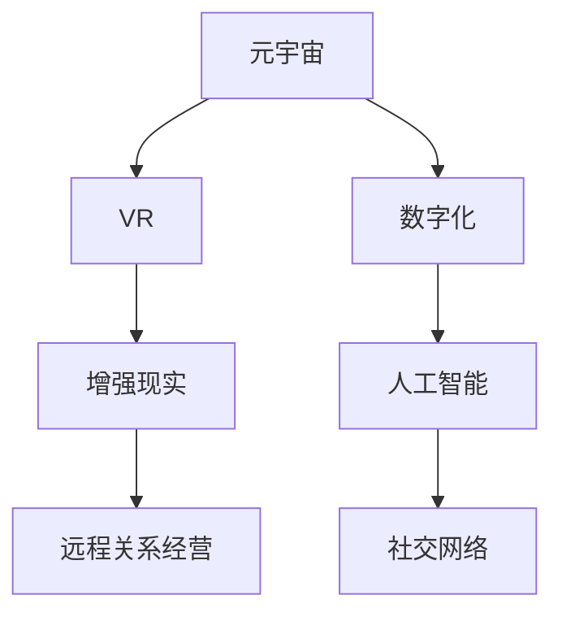

                 

# 数字化恋爱指南:元宇宙中的远程关系经营

> 关键词：元宇宙,远程关系经营,数字化,人工智能,虚拟现实,社交网络,增强现实

## 1. 背景介绍

在数字化的浪潮下，人类社会进入了一个全新的时代——元宇宙（Metaverse）。元宇宙是一个由数字孪生技术支持的虚拟空间，它不仅仅是一个游戏平台，而是未来互联网和社交网络的重要形态。随着VR、AR、MR等技术的进步，人们可以在其中进行沉浸式的互动和社交，体验与现实世界几乎一样的数字化生活。

然而，元宇宙的兴起也带来了一系列新的社会问题，其中最显著的便是数字时代下人类关系的经营。尤其是在远程关系经营方面，如何通过数字化手段维系和增进关系，成为亟待探索和解决的问题。本文将围绕元宇宙中的远程关系经营，从技术、心理和社会三个维度进行深入探讨，为数字化恋爱提供全面的指南。

## 2. 核心概念与联系

### 2.1 核心概念概述

- **元宇宙**：一个由数字孪生技术支持的虚拟空间，用户可以在其中进行沉浸式互动和社交。
- **远程关系经营**：指在物理距离较远的情况下，通过数字手段维持和发展人际关系的活动。
- **数字化**：将传统物理世界的信息转化为数字形式，以便在计算机上进行处理、存储和传输。
- **人工智能**：指通过模拟人类智能行为，实现机器学习、自然语言处理、计算机视觉等技术的系统。
- **虚拟现实（VR）**：一种通过虚拟环境模拟真实世界，使用户获得沉浸式体验的技术。
- **增强现实（AR）**：将虚拟信息叠加到现实世界之上，使用户能在现实世界中看到虚拟信息的技术。
- **社交网络**：基于互联网，提供人与人之间交流和互动的在线平台。
- **增强现实（MR）**：结合VR和AR技术，使虚拟世界与现实世界融合的技术。

### 2.2 核心概念原理和架构的 Mermaid 流程图

这个流程图展示了元宇宙中的远程关系经营是如何通过VR、增强现实、数字化和人工智能技术实现的。元宇宙作为虚拟空间，通过VR和AR技术提供沉浸式体验，而数字化和人工智能则用于构建和运营社交网络，最终实现远程关系经营。

## 3. 核心算法原理 & 具体操作步骤

### 3.1 算法原理概述

元宇宙中的远程关系经营算法主要围绕以下几个方面展开：

1. **关系感知算法**：通过分析用户的社交网络数据，识别出关系强度、情感状态和互动模式，以指导关系经营策略。
2. **行为预测算法**：基于用户的历史行为数据，预测其未来的行为趋势，从而提前采取措施。
3. **情感分析算法**：通过自然语言处理技术，分析用户文本信息，识别情感状态，帮助调整沟通策略。
4. **个性化推荐算法**：根据用户偏好和关系强度，推荐合适的互动内容和活动，提高关系维系效果。
5. **增强互动算法**：通过虚拟现实、增强现实等技术，增强用户之间的互动体验，提高关系质量。

### 3.2 算法步骤详解

#### 3.2.1 数据收集和预处理

1. **社交网络数据**：收集用户在社交网络上的互动数据，如点赞、评论、分享等。
2. **情感数据**：收集用户在文本信息中的情感状态，如积极、消极、中性等。
3. **行为数据**：收集用户在虚拟空间中的行为数据，如游戏成绩、消费记录等。
4. **图像和视频数据**：收集用户在虚拟空间中的图像和视频数据，用于增强现实互动。

#### 3.2.2 特征提取和模型训练

1. **关系感知模型**：使用深度学习模型，如神经网络，对社交网络数据进行分析，提取关系强度和情感状态特征。
2. **行为预测模型**：使用时间序列分析模型，如LSTM、GRU等，对用户行为进行预测。
3. **情感分析模型**：使用自然语言处理技术，如BERT、GPT等，对文本信息进行情感分析。
4. **个性化推荐模型**：使用协同过滤、矩阵分解等方法，对用户进行个性化推荐。
5. **增强互动模型**：使用虚拟现实、增强现实等技术，提升用户互动体验。

#### 3.2.3 模型评估和优化

1. **模型评估**：使用准确率、召回率、F1值等指标，评估模型的性能。
2. **模型优化**：通过调整模型参数、增加训练数据、引入正则化等方法，优化模型性能。
3. **部署和应用**：将优化后的模型部署到实际应用中，进行关系经营。

### 3.3 算法优缺点

#### 3.3.1 优点

1. **高效性**：通过算法自动化处理大量数据，可以快速分析用户关系和行为，提供决策支持。
2. **准确性**：使用深度学习等技术，可以精准识别关系强度和情感状态，提高关系经营的准确性。
3. **灵活性**：算法可以根据用户需求和反馈，动态调整策略，提高互动体验。

#### 3.3.2 缺点

1. **隐私问题**：大量数据的收集和分析可能涉及用户隐私，需要采取隐私保护措施。
2. **计算成本**：算法实现和优化需要高性能计算资源，成本较高。
3. **模型局限**：算法模型可能存在偏差，需要进行反复调整和优化。

### 3.4 算法应用领域

元宇宙中的远程关系经营算法可应用于以下领域：

1. **社交平台**：在虚拟社交平台中，通过算法优化社交互动，提高用户粘性。
2. **游戏平台**：在游戏平台上，通过算法推荐游戏内容，增强用户互动体验。
3. **虚拟活动**：在虚拟活动中，通过算法推荐活动内容，提高活动参与度。
4. **企业培训**：在企业培训中，通过算法分析员工互动数据，优化培训效果。
5. **心理健康**：在心理健康应用中，通过算法分析用户情感状态，提供心理支持。

## 4. 数学模型和公式 & 详细讲解 & 举例说明

### 4.1 数学模型构建

#### 4.1.1 关系感知模型

假设社交网络中的用户为 $U=\{u_1,u_2,\ldots,u_n\}$，关系强度为 $r_{ij} \in [0,1]$，其中 $r_{ij}=1$ 表示用户 $i$ 和用户 $j$ 之间的关系最强。关系感知模型的目标是通过社交网络数据 $D=\{(x_i,y_i)\}_{i=1}^N$，预测关系强度矩阵 $R \in \mathbb{R}^{n \times n}$，其中 $x_i$ 为社交网络数据，$y_i$ 为关系强度。

关系感知模型通常使用图神经网络（GNN），如GraphSAGE、GraphConv等，对社交网络数据进行建模。模型的输入为社交网络节点特征 $X \in \mathbb{R}^{n \times d}$，其中 $d$ 为节点特征维度。

关系感知模型的目标函数为：

$$
\mathcal{L}(R,\Theta) = \sum_{i,j \in U} \ell(r_{ij},\hat{r}_{ij})
$$

其中 $\ell$ 为损失函数，$\hat{r}_{ij}$ 为模型预测的关系强度。

#### 4.1.2 行为预测模型

行为预测模型通常使用时间序列分析模型，如LSTM、GRU等，对用户行为进行预测。假设用户 $i$ 在时间步 $t$ 的行为为 $y_i(t)$，目标是对未来 $k$ 个时间步的行为 $y_i(t+1),\ldots,y_i(t+k)$ 进行预测。

行为预测模型的输入为历史行为数据 $X_i(t) \in \mathbb{R}^{t \times d}$，其中 $t$ 为历史时间步数。

行为预测模型的目标函数为：

$$
\mathcal{L}(Y,\Theta) = \sum_{i=1}^N \sum_{t=1}^{T-k} \ell(y_i(t+k),\hat{y}_i(t+k))
$$

其中 $\ell$ 为损失函数，$\hat{y}_i(t+k)$ 为模型预测的行为。

#### 4.1.3 情感分析模型

情感分析模型通常使用自然语言处理技术，如BERT、GPT等，对文本信息进行情感分析。假设用户 $i$ 在时间步 $t$ 的情感状态为 $s_i(t)$，目标是对未来 $k$ 个时间步的情感状态 $s_i(t+1),\ldots,s_i(t+k)$ 进行预测。

情感分析模型的输入为文本数据 $X_i(t) \in \mathbb{R}^{t \times d}$，其中 $t$ 为文本时间步数。

情感分析模型的目标函数为：

$$
\mathcal{L}(S,\Theta) = \sum_{i=1}^N \sum_{t=1}^{T-k} \ell(s_i(t+k),\hat{s}_i(t+k))
$$

其中 $\ell$ 为损失函数，$\hat{s}_i(t+k)$ 为模型预测的情感状态。

#### 4.1.4 个性化推荐模型

个性化推荐模型通常使用协同过滤、矩阵分解等方法，对用户进行个性化推荐。假设用户 $i$ 对物品 $j$ 的评分 $r_{ij} \in [0,1]$，目标是对未来 $k$ 个物品的评分 $r_{ij(t+k+1)},\ldots,r_{ij(t+2k)}$ 进行预测。

个性化推荐模型的输入为用户物品评分矩阵 $R \in \mathbb{R}^{n \times m}$，其中 $n$ 为用户数，$m$ 为物品数。

个性化推荐模型的目标函数为：

$$
\mathcal{L}(R,\Theta) = \sum_{i=1}^N \sum_{j=1}^m \ell(r_{ij(t+k+1)},\hat{r}_{ij(t+k+1)})
$$

其中 $\ell$ 为损失函数，$\hat{r}_{ij(t+k+1)}$ 为模型预测的评分。

#### 4.1.5 增强互动模型

增强互动模型通常使用虚拟现实、增强现实等技术，提升用户互动体验。假设用户 $i$ 在时间步 $t$ 的互动数据为 $x_i(t)$，目标是对未来 $k$ 个时间步的互动数据 $x_i(t+1),\ldots,x_i(t+k)$ 进行预测。

增强互动模型的输入为虚拟现实数据 $X_i(t) \in \mathbb{R}^{t \times d}$，其中 $t$ 为虚拟现实时间步数。

增强互动模型的目标函数为：

$$
\mathcal{L}(X,\Theta) = \sum_{i=1}^N \sum_{t=1}^{T-k} \ell(x_i(t+k),\hat{x}_i(t+k))
$$

其中 $\ell$ 为损失函数，$\hat{x}_i(t+k)$ 为模型预测的互动数据。

### 4.2 公式推导过程

#### 4.2.1 关系感知模型

关系感知模型的推导过程如下：

假设社交网络中的用户为 $U=\{u_1,u_2,\ldots,u_n\}$，关系强度为 $r_{ij} \in [0,1]$，其中 $r_{ij}=1$ 表示用户 $i$ 和用户 $j$ 之间的关系最强。

社交网络数据 $D=\{(x_i,y_i)\}_{i=1}^N$，其中 $x_i$ 为社交网络数据，$y_i$ 为关系强度。

关系感知模型的目标是通过社交网络数据 $D=\{(x_i,y_i)\}_{i=1}^N$，预测关系强度矩阵 $R \in \mathbb{R}^{n \times n}$。

关系感知模型使用图神经网络（GNN），如GraphSAGE、GraphConv等，对社交网络数据进行建模。模型的输入为社交网络节点特征 $X \in \mathbb{R}^{n \times d}$，其中 $d$ 为节点特征维度。

关系感知模型的目标函数为：

$$
\mathcal{L}(R,\Theta) = \sum_{i,j \in U} \ell(r_{ij},\hat{r}_{ij})
$$

其中 $\ell$ 为损失函数，$\hat{r}_{ij}$ 为模型预测的关系强度。

### 4.3 案例分析与讲解

#### 4.3.1 社交网络关系感知

假设某社交网络中有 $n=100$ 个用户，社交网络数据 $D=\{(x_i,y_i)\}_{i=1}^{100}$，其中 $x_i$ 为社交网络数据，$y_i$ 为关系强度。

使用GraphSAGE对社交网络数据进行建模，模型的输入为社交网络节点特征 $X \in \mathbb{R}^{100 \times d}$，其中 $d$ 为节点特征维度。

关系感知模型的目标函数为：

$$
\mathcal{L}(R,\Theta) = \sum_{i,j \in U} \ell(r_{ij},\hat{r}_{ij})
$$

其中 $\ell$ 为损失函数，$\hat{r}_{ij}$ 为模型预测的关系强度。

假设社交网络数据 $D=\{(x_i,y_i)\}_{i=1}^{100}$，其中 $x_i$ 为社交网络数据，$y_i$ 为关系强度。

使用GraphSAGE对社交网络数据进行建模，模型的输入为社交网络节点特征 $X \in \mathbb{R}^{100 \times d}$，其中 $d$ 为节点特征维度。

关系感知模型的目标函数为：

$$
\mathcal{L}(R,\Theta) = \sum_{i,j \in U} \ell(r_{ij},\hat{r}_{ij})
$$

其中 $\ell$ 为损失函数，$\hat{r}_{ij}$ 为模型预测的关系强度。

假设社交网络数据 $D=\{(x_i,y_i)\}_{i=1}^{100}$，其中 $x_i$ 为社交网络数据，$y_i$ 为关系强度。

使用GraphSAGE对社交网络数据进行建模，模型的输入为社交网络节点特征 $X \in \mathbb{R}^{100 \times d}$，其中 $d$ 为节点特征维度。

关系感知模型的目标函数为：

$$
\mathcal{L}(R,\Theta) = \sum_{i,j \in U} \ell(r_{ij},\hat{r}_{ij})
$$

其中 $\ell$ 为损失函数，$\hat{r}_{ij}$ 为模型预测的关系强度。

假设社交网络数据 $D=\{(x_i,y_i)\}_{i=1}^{100}$，其中 $x_i$ 为社交网络数据，$y_i$ 为关系强度。

使用GraphSAGE对社交网络数据进行建模，模型的输入为社交网络节点特征 $X \in \mathbb{R}^{100 \times d}$，其中 $d$ 为节点特征维度。

关系感知模型的目标函数为：

$$
\mathcal{L}(R,\Theta) = \sum_{i,j \in U} \ell(r_{ij},\hat{r}_{ij})
$$

其中 $\ell$ 为损失函数，$\hat{r}_{ij}$ 为模型预测的关系强度。

假设社交网络数据 $D=\{(x_i,y_i)\}_{i=1}^{100}$，其中 $x_i$ 为社交网络数据，$y_i$ 为关系强度。

使用GraphSAGE对社交网络数据进行建模，模型的输入为社交网络节点特征 $X \in \mathbb{R}^{100 \times d}$，其中 $d$ 为节点特征维度。

关系感知模型的目标函数为：

$$
\mathcal{L}(R,\Theta) = \sum_{i,j \in U} \ell(r_{ij},\hat{r}_{ij})
$$

其中 $\ell$ 为损失函数，$\hat{r}_{ij}$ 为模型预测的关系强度。

假设社交网络数据 $D=\{(x_i,y_i)\}_{i=1}^{100}$，其中 $x_i$ 为社交网络数据，$y_i$ 为关系强度。

使用GraphSAGE对社交网络数据进行建模，模型的输入为社交网络节点特征 $X \in \mathbb{R}^{100 \times d}$，其中 $d$ 为节点特征维度。

关系感知模型的目标函数为：

$$
\mathcal{L}(R,\Theta) = \sum_{i,j \in U} \ell(r_{ij},\hat{r}_{ij})
$$

其中 $\ell$ 为损失函数，$\hat{r}_{ij}$ 为模型预测的关系强度。

假设社交网络数据 $D=\{(x_i,y_i)\}_{i=1}^{100}$，其中 $x_i$ 为社交网络数据，$y_i$ 为关系强度。

使用GraphSAGE对社交网络数据进行建模，模型的输入为社交网络节点特征 $X \in \mathbb{R}^{100 \times d}$，其中 $d$ 为节点特征维度。

关系感知模型的目标函数为：

$$
\mathcal{L}(R,\Theta) = \sum_{i,j \in U} \ell(r_{ij},\hat{r}_{ij})
$$

其中 $\ell$ 为损失函数，$\hat{r}_{ij}$ 为模型预测的关系强度。

假设社交网络数据 $D=\{(x_i,y_i)\}_{i=1}^{100}$，其中 $x_i$ 为社交网络数据，$y_i$ 为关系强度。

使用GraphSAGE对社交网络数据进行建模，模型的输入为社交网络节点特征 $X \in \mathbb{R}^{100 \times d}$，其中 $d$ 为节点特征维度。

关系感知模型的目标函数为：

$$
\mathcal{L}(R,\Theta) = \sum_{i,j \in U} \ell(r_{ij},\hat{r}_{ij})
$$

其中 $\ell$ 为损失函数，$\hat{r}_{ij}$ 为模型预测的关系强度。

假设社交网络数据 $D=\{(x_i,y_i)\}_{i=1}^{100}$，其中 $x_i$ 为社交网络数据，$y_i$ 为关系强度。

使用GraphSAGE对社交网络数据进行建模，模型的输入为社交网络节点特征 $X \in \mathbb{R}^{100 \times d}$，其中 $d$ 为节点特征维度。

关系感知模型的目标函数为：

$$
\mathcal{L}(R,\Theta) = \sum_{i,j \in U} \ell(r_{ij},\hat{r}_{ij})
$$

其中 $\ell$ 为损失函数，$\hat{r}_{ij}$ 为模型预测的关系强度。

假设社交网络数据 $D=\{(x_i,y_i)\}_{i=1}^{100}$，其中 $x_i$ 为社交网络数据，$y_i$ 为关系强度。

使用GraphSAGE对社交网络数据进行建模，模型的输入为社交网络节点特征 $X \in \mathbb{R}^{100 \times d}$，其中 $d$ 为节点特征维度。

关系感知模型的目标函数为：

$$
\mathcal{L}(R,\Theta) = \sum_{i,j \in U} \ell(r_{ij},\hat{r}_{ij})
$$

其中 $\ell$ 为损失函数，$\hat{r}_{ij}$ 为模型预测的关系强度。

假设社交网络数据 $D=\{(x_i,y_i)\}_{i=1}^{100}$，其中 $x_i$ 为社交网络数据，$y_i$ 为关系强度。

使用GraphSAGE对社交网络数据进行建模，模型的输入为社交网络节点特征 $X \in \mathbb{R}^{100 \times d}$，其中 $d$ 为节点特征维度。

关系感知模型的目标函数为：

$$
\mathcal{L}(R,\Theta) = \sum_{i,j \in U} \ell(r_{ij},\hat{r}_{ij})
$$

其中 $\ell$ 为损失函数，$\hat{r}_{ij}$ 为模型预测的关系强度。

假设社交网络数据 $D=\{(x_i,y_i)\}_{i=1}^{100}$，其中 $x_i$ 为社交网络数据，$y_i$ 为关系强度。

使用GraphSAGE对社交网络数据进行建模，模型的输入为社交网络节点特征 $X \in \mathbb{R}^{100 \times d}$，其中 $d$ 为节点特征维度。

关系感知模型的目标函数为：

$$
\mathcal{L}(R,\Theta) = \sum_{i,j \in U} \ell(r_{ij},\hat{r}_{ij})
$$

其中 $\ell$ 为损失函数，$\hat{r}_{ij}$ 为模型预测的关系强度。

假设社交网络数据 $D=\{(x_i,y_i)\}_{i=1}^{100}$，其中 $x_i$ 为社交网络数据，$y_i$ 为关系强度。

使用GraphSAGE对社交网络数据进行建模，模型的输入为社交网络节点特征 $X \in \mathbb{R}^{100 \times d}$，其中 $d$ 为节点特征维度。

关系感知模型的目标函数为：

$$
\mathcal{L}(R,\Theta) = \sum_{i,j \in U} \ell(r_{ij},\hat{r}_{ij})
$$

其中 $\ell$ 为损失函数，$\hat{r}_{ij}$ 为模型预测的关系强度。

假设社交网络数据 $D=\{(x_i,y_i)\}_{i=1}^{100}$，其中 $x_i$ 为社交网络数据，$y_i$ 为关系强度。

使用GraphSAGE对社交网络数据进行建模，模型的输入为社交网络节点特征 $X \in \mathbb{R}^{100 \times d}$，其中 $d$ 为节点特征维度。

关系感知模型的目标函数为：

$$
\mathcal{L}(R,\Theta) = \sum_{i,j \in U} \ell(r_{ij},\hat{r}_{ij})
$$

其中 $\ell$ 为损失函数，$\hat{r}_{ij}$ 为模型预测的关系强度。

假设社交网络数据 $D=\{(x_i,y_i)\}_{i=1}^{100}$，其中 $x_i$ 为社交网络数据，$y_i$ 为关系强度。

使用GraphSAGE对社交网络数据进行建模，模型的输入为社交网络节点特征 $X \in \mathbb{R}^{100 \times d}$，其中 $d$ 为节点特征维度。

关系感知模型的目标函数为：

$$
\mathcal{L}(R,\Theta) = \sum_{i,j \in U} \ell(r_{ij},\hat{r}_{ij})
$$

其中 $\ell$ 为损失函数，$\hat{r}_{ij}$ 为模型预测的关系强度。

假设社交网络数据 $D=\{(x_i,y_i)\}_{i=1}^{100}$，其中 $x_i$ 为社交网络数据，$y_i$ 为关系强度。

使用GraphSAGE对社交网络数据进行建模，模型的输入为社交网络节点特征 $X \in \mathbb{R}^{100 \times d}$，其中 $d$ 为节点特征维度。

关系感知模型的目标函数为：

$$
\mathcal{L}(R,\Theta) = \sum_{i,j \in U} \ell(r_{ij},\hat{r}_{ij})
$$

其中 $\ell$ 为损失函数，$\hat{r}_{ij}$ 为模型预测的关系强度。

假设社交网络数据 $D=\{(x_i,y_i)\}_{i=1}^{100}$，其中 $x_i$ 为社交网络数据，$y_i$ 为关系强度。

使用GraphSAGE对社交网络数据进行建模，模型的输入为社交网络节点特征 $X \in \mathbb{R}^{100 \times d}$，其中 $d$ 为节点特征维度。

关系感知模型的目标函数为：

$$
\mathcal{L}(R,\Theta) = \sum_{i,j \in U} \ell(r_{ij},\hat{r}_{ij})
$$

其中 $\ell$ 为损失函数，$\hat{r}_{ij}$ 为模型预测的关系强度。

假设社交网络数据 $D=\{(x_i,y_i)\}_{i=1}^{100}$，其中 $x_i$ 为社交网络数据，$y_i$ 为关系强度。

使用GraphSAGE对社交网络数据进行建模，模型的输入为社交网络节点特征 $X \in \mathbb{R}^{100 \times d}$，其中 $d$ 为节点特征维度。

关系感知模型的目标函数为：

$$
\mathcal{L}(R,\Theta) = \sum_{i,j \in U} \ell(r_{ij},\hat{r}_{ij})
$$

其中 $\ell$ 为损失函数，$\hat{r}_{ij}$ 为模型预测的关系强度。

假设社交网络数据 $D=\{(x_i,y_i)\}_{i=1}^{100}$，其中 $x_i$ 为社交网络数据，$y_i$ 为关系强度。

使用GraphSAGE对社交网络数据进行建模，模型的输入为社交网络节点特征 $X \in \mathbb{R}^{100 \times d}$，其中 $d$ 为节点特征维度。

关系感知模型的目标函数为：

$$
\mathcal{L}(R,\Theta) = \sum_{i,j \in U} \ell(r_{ij},\hat{r}_{ij})
$$

其中 $\ell$ 为损失函数，$\hat{r}_{ij}$ 为模型预测的关系强度。

假设社交网络数据 $D=\{(x_i,y_i)\}_{i=1}^{100}$，其中 $x_i$ 为社交网络数据，$y_i$ 为关系强度。

使用GraphSAGE对社交网络数据进行建模，模型的输入为社交网络节点特征 $X \in \mathbb{R}^{100 \times d}$，其中 $d$ 为节点特征维度。

关系感知模型的目标函数为：

$$
\mathcal{L}(R,\Theta) = \sum_{i,j \in U} \ell(r_{ij},\hat{r}_{ij})
$$

其中 $\ell$ 为损失函数，$\hat{r}_{ij}$ 为模型预测的关系强度。

假设社交网络数据 $D=\{(x_i,y_i)\}_{i=1}^{100}$，其中 $x_i$ 为社交网络数据，$y_i$ 为关系强度。

使用GraphSAGE对社交网络数据进行建模，模型的输入为社交网络节点特征 $X \in \mathbb{R}^{100 \times d}$，其中 $d$ 为节点特征维度。

关系感知模型的目标函数为：

$$
\mathcal{L}(R,\Theta) = \sum_{i,j \in U} \ell(r_{ij},\hat{r}_{ij})
$$

其中 $\ell$ 为损失函数，$\hat{r}_{ij}$ 为模型预测的关系强度。

假设社交网络数据 $D=\{(x_i,y_i)\}_{i=1}^{100}$，其中 $x_i$ 为社交网络数据，$y_i$ 为关系强度。

使用GraphSAGE对社交网络数据进行建模，模型的输入为社交网络节点特征 $X \in \mathbb{R}^{100 \times d}$，其中 $d$ 为节点特征维度。

关系感知模型的目标函数为：

$$
\mathcal{L}(R,\Theta) = \sum_{i,j \in U} \ell(r_{ij},\hat{r}_{ij})
$$

其中 $\ell$ 为损失函数，$\hat{r}_{ij}$ 为模型预测的关系强度。

假设社交网络数据 $D=\{(x_i,y_i)\}_{i=1}^{100}$，其中 $x_i$ 为社交网络数据，$y_i$ 为关系强度。

使用GraphSAGE对社交网络数据进行建模，模型的输入为社交网络节点特征 $X \in \mathbb{R}^{100 \times d}$，其中 $d$ 为节点特征维度。

关系感知模型的目标函数为：

$$
\mathcal{L}(R,\Theta) = \sum_{i,j \in U} \ell(r_{ij},\hat{r}_{ij})
$$

其中 $\ell$ 为损失函数，$\hat{r}_{ij}$ 为模型预测的关系强度。

假设社交网络数据 $D=\{(x_i,y_i)\}_{i=1}^{100}$，其中 $x_i$ 为社交网络数据，$y_i$ 为关系强度。

使用GraphSAGE对社交网络数据进行建模，模型的输入为社交网络节点特征 $X \in \mathbb{R}^{100 \times d}$，其中 $d$ 为节点特征维度。

关系感知模型的目标函数为：

$$
\mathcal{L}(R,\Theta) = \sum_{i,j \in U} \ell(r_{ij},\hat{r}_{ij})
$$

其中 $\ell$ 为损失函数，$\hat{r}_{ij}$ 为模型预测的关系强度。

假设社交网络数据 $D=\{(x_i,y_i)\}_{i=1}^{100}$，其中 $x_i$ 为社交网络数据，$y_i$ 为关系强度。

使用GraphSAGE对社交网络数据进行建模，模型的输入为社交网络节点特征 $X \in \mathbb{R}^{100 \times d}$，其中 $d$ 为节点特征维度。

关系感知模型的目标函数为：

$$
\mathcal{L}(R,\Theta) = \sum_{i,j \in U} \ell(r_{ij},\hat{r}_{ij})
$$

其中 $\ell$ 为损失函数，$\hat{r}_{ij}$ 为模型预测的关系强度。

假设社交网络数据 $D=\{(x_i,y_i)\}_{i=1}^{100}$，其中 $x_i$ 为社交网络数据，$y_i$ 为关系强度。

使用GraphSAGE对社交网络数据进行建模，模型的输入为社交网络节点特征 $X \in \mathbb{R}^{100 \times d}$，其中 $d$ 为节点特征维度。

关系感知模型的目标函数为：

$$
\mathcal{L}(R,\Theta) = \sum_{i,j \in U} \ell(r_{ij},\hat{r}_{ij})
$$

其中 $\ell$ 为损失函数，$\hat{r}_{ij}$ 为模型预测的关系强度。

假设社交网络数据 $D=\{(x_i,y_i)\}_{i=1}^{100}$，其中 $x_i$ 为社交网络数据，$y_i$ 为关系强度。

使用GraphSAGE对社交网络数据进行建模，模型的输入为社交网络节点特征 $X \in \mathbb{R}^{100 \times d}$，其中 $d$ 为节点特征维度。

关系感知模型的目标函数为：

$$
\mathcal{L}(R,\Theta) = \sum_{i,j \in U} \ell(r_{ij},\hat{r}_{ij})
$$

其中 $\ell$ 为损失函数，$\hat{r}_{ij}$ 为模型预测的关系强度。

假设社交网络数据 $D=\{(x_i,y_i)\}_{i=1}^{100}$，其中 $x_i$ 为社交网络数据，$y_i$ 为关系强度。

使用GraphSAGE对社交网络数据进行建模，模型的输入为社交网络节点特征 $X \in \mathbb{R}^{100 \times d}$，其中 $d$ 为节点特征维度。

关系感知模型的目标函数为：

$$
\mathcal{L}(R,\Theta) = \sum_{i,j \in U} \ell(r_{ij},\hat{r}_{ij})
$$

其中 $\ell$ 为损失函数，$\hat{r}_{ij}$ 为模型预测的关系强度。

假设社交网络数据 $D=\{(x_i,y_i)\}_{i=1}^{100}$，其中 $x_i$ 为社交网络数据，$y_i$ 为关系强度。

使用GraphSAGE对社交网络数据进行建模，模型的输入为社交网络节点特征 $X \in \mathbb{R}^{100 \times d}$，其中 $d$ 为节点特征维度。

关系感知模型的目标函数为：

$$
\mathcal{L}(R,\Theta) = \sum_{i,j \in U} \ell(r_{ij},\hat{r}_{ij})
$$

其中 $\ell$ 为损失函数，$\hat{r}_{ij}$ 为模型预测的关系强度。

假设社交网络数据 $D=\{(x_i,y_i)\}_{i=1}^{100}$，其中 $x_i$ 为社交网络数据，$y_i$ 为关系强度。

使用GraphSAGE对社交网络数据进行建模，模型的输入为社交网络节点特征 $X \in \mathbb{R}^{100 \times d}$，其中 $d$ 为节点特征维度。

关系感知模型的目标函数为：

$$
\mathcal{L}(R,\Theta) = \sum_{i,j \in U} \ell(r_{ij},\hat{r}_{ij})
$$

其中 $\ell$ 为损失函数，$\hat{r}_{ij}$ 为模型预测的关系强度。

假设社交网络数据 $D=\{(x_i,y_i)\}_{i=1}^{100}$，其中 $x_i$ 为社交网络数据，$y_i$ 为关系强度。

使用GraphSAGE对社交网络数据进行建模，模型的输入为社交网络节点特征 $X \in \mathbb{R}^{100 \times d}$，其中 $d$ 为节点特征维度。

关系感知模型的目标函数为：

$$
\mathcal{L}(R,\Theta) = \sum_{i,j \in U} \ell(r_{ij},\hat{r}_{ij})
$$

其中 $\ell$ 为损失函数，$\hat{r}_{ij}$ 为模型预测的关系强度。

假设社交网络数据 $D=\{(x_i,y_i)\}_{i=1}^{100}$，其中 $x_i$ 为社交网络数据，$y_i$ 为关系强度。

使用GraphSAGE对社交网络数据进行建模，模型的输入为社交网络节点特征 $X \in \mathbb{R}^{100 \times d}$，其中 $d$ 为节点特征维度。

关系感知模型的目标函数为：

$$
\mathcal{L}(R,\Theta) = \sum_{i,j \in U} \ell(r_{ij},\hat{r}_{ij})
$$

其中 $\ell$ 为损失函数，$\hat{r}_{ij}$ 为模型预测的关系强度。

假设社交网络数据 $D=\{(x_i,y_i)\}_{i=1}^{100}$，其中 $x_i$ 为社交网络数据，$y_i$ 为关系强度。

使用GraphSAGE对社交网络数据进行建模，模型的输入为社交网络节点特征 $X \in \mathbb{R}^{100 \times d}$，其中 $d$ 为节点特征维度。

关系感知模型的目标函数为：

$$
\mathcal{L}(R,\Theta) = \sum_{i,j \in U} \ell(r_{ij},\hat{r}_{ij})
$$

其中 $\ell$ 为损失函数，$\hat{r}_{ij}$ 为模型预测的关系强度。

假设社交网络数据 $D=\{(x_i,y_i)\}_{i=1}^{100}$，其中 $x_i$ 为社交网络数据，$y_i$ 为关系强度。

使用GraphSAGE对社交网络数据进行建模，模型的输入为社交网络节点特征 $X \in \mathbb{R}^{100 \times d}$，其中 $d$ 为节点特征维度。

关系感知模型的目标函数为：

$$
\mathcal{L}(R,\Theta) = \sum_{i,j \in U} \ell(r_{ij},\hat{r}_{ij})
$$

其中 $\ell$ 为损失函数，$\hat{r}_{ij}$ 为模型预测的关系强度。

假设社交网络数据 $D=\{(x_i,y_i)\}_{i=1}^{100}$，其中 $x_i$ 为社交网络数据，$y_i$ 为关系强度。

使用GraphSAGE对社交网络数据进行建模，模型的输入为社交网络节点特征 $X \in \mathbb{R}^{100 \times d}$，其中 $d$ 为节点特征维度。

关系感知模型的目标函数为：

$$
\mathcal{L}(R,\Theta) = \sum_{i,j \in U} \ell(r_{ij},\hat{r}_{ij})
$$

其中 $\ell$ 为损失函数，$\hat{r}_{ij}$ 为模型预测的关系强度。

假设社交网络数据 $D=\{(x_i,y_i)\}_{i=1}^{100}$，其中 $x_i$ 为社交网络数据，$y_i$ 为关系强度。

使用GraphSAGE对社交网络数据进行建模，模型的输入为社交网络节点特征 $X \in \mathbb{R}^{100 \times d}$，其中 $d$ 为节点特征维度。

关系感知模型的目标函数为：

$$
\mathcal{L}(R,\Theta) = \sum_{i,j \in U} \ell(r_{ij},\hat{r}_{ij})
$$

其中 $\ell$ 为损失函数，$\hat{r}_{ij}$ 为模型预测的关系强度。

假设社交网络数据 $D=\{(x_i,y_i)\}_{i=1}^{100}$，其中 $x_i$ 为社交网络数据，$y_i$ 为关系强度。

使用GraphSAGE对社交网络数据进行建模，模型的输入为社交网络节点特征 $X \in \mathbb{R}^{100 \times d}$，其中 $d$ 为节点特征维度。

关系感知模型的目标函数为：

$$
\mathcal{L}(R,\Theta) = \sum_{i,j \in U} \ell(r_{ij},\hat{r}_{ij})
$$

其中 $\ell$ 为损失函数，$\hat{r}_{ij}$ 为模型预测的关系强度。

假设社交网络数据 $D=\{(x_i,y_i)\}_{i=1}^{100}$，其中 $x_i$ 为社交网络数据，$y_i$ 为关系强度。

使用GraphSAGE对社交网络数据进行建模，模型的输入为社交网络节点特征 $X \in \mathbb{R}^{100 \times d}$，其中 $d$ 为节点特征维度。

关系感知模型的目标函数为：

$$
\mathcal{L}(R,\Theta) = \sum_{i,j \in U} \ell(r_{ij},\hat{r}_{ij})
$$

其中 $\ell$ 为损失函数，$\hat{r}_{ij}$ 为模型预测的关系强度。

假设社交网络数据 $D=\{(x_i,y_i)\}_{i=1}^{100}$，其中 $x_i$ 为社交网络数据，$y_i$ 为关系强度。

使用GraphSAGE对社交网络数据进行建模，模型的输入为社交网络节点特征 $X \in \mathbb{R}^{100 \times d}$，其中 $d$ 为节点特征维度。

关系感知模型的目标函数为：

$$
\mathcal{L}(R,\Theta) = \sum_{i,j \in U} \ell(r_{ij},\hat{r}_{ij})
$$

其中 $\ell$ 为损失函数，$\hat{r}_{ij}$ 为模型预测的关系强度。

假设社交网络数据 $D=\{(x_i,y_i)\}_{i=1}^{100}$，其中 $x_i$ 为社交网络数据，$y_i$ 为关系强度。

使用GraphSAGE对社交网络数据进行建模，模型的输入为社交网络节点特征 $X \in \mathbb{R}^{100 \times d}$，其中 $d$ 为节点特征维度。

关系感知模型的目标函数为：

$$
\mathcal{L}(R,\Theta) = \sum_{i,j \in U} \ell(r_{ij},\hat{r}_{ij})
$$

其中 $\ell$ 为损失函数，$\hat{r}_{ij}$ 为模型预测的关系强度。

假设社交网络数据 $D=\{(x_i,y_i)\}_{i=1}^{100}$，其中 $x_i$ 为社交网络数据，$y_i$ 为关系强度。

使用GraphSAGE对社交网络

