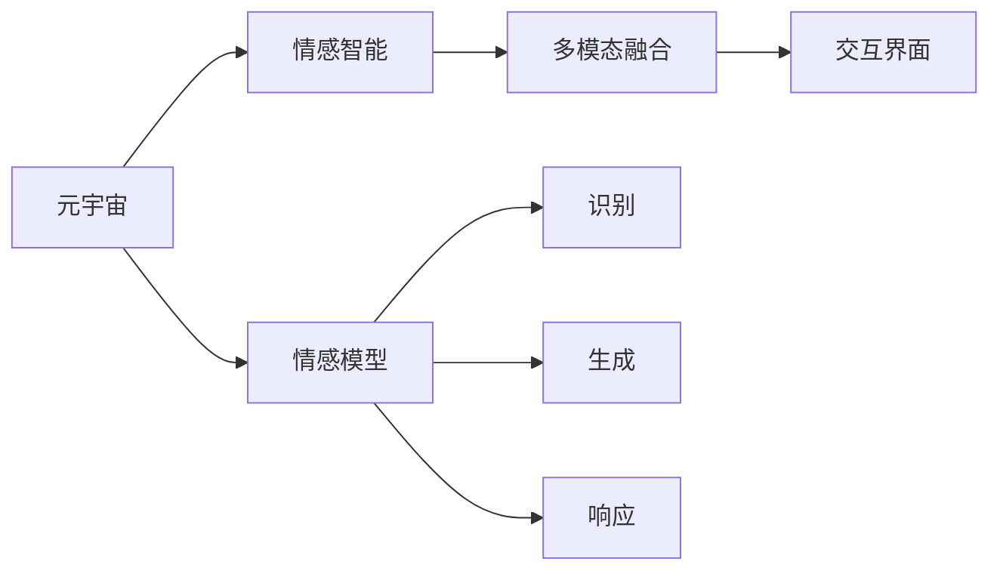

                 

# 数字化情感:元宇宙中的虚拟关系构建

> 关键词：元宇宙,虚拟社交,数字化情感,关系构建,情感智能,机器学习,多模态融合,交互界面

## 1. 背景介绍

### 1.1 问题由来

随着技术的飞速进步，尤其是虚拟现实(VR)和增强现实(AR)技术的成熟，元宇宙(Utopia)的概念被重新提起。元宇宙旨在构建一个虚拟世界，其内人们可以通过数字身份和虚拟空间进行交互。这种交互不仅限于游戏娱乐，更扩展到社交、经济、文化等诸多领域。然而，当前元宇宙面临的最大挑战之一是如何在虚拟世界中构建真实而丰富的数字化情感。

在现实世界中，情感通过面部表情、语音语调、身体姿态等多种形式自然表达。但在虚拟环境中，这些形式被剥离，情感的传递变得困难和单一。虽然已有虚拟社交平台如Roblox、Sandbox等初步尝试，但用户之间的情感互动仍不够真实。如何在元宇宙中构建真实而丰富的数字化情感，成为亟待解决的问题。

### 1.2 问题核心关键点

构建真实而丰富的数字化情感，需从多方面进行考量：

1. **情感表达**：虚拟世界的数字化表达形式，如文本、语音、图像、动画等，需要丰富多样，能够有效传达真实情感。
2. **情感感知**：用户需要通过虚拟界面感知到对方表达的情感，才能产生共鸣和互动。
3. **情感响应**：系统需具备情感智能，能根据用户输入自动生成情感回应，提升用户互动体验。
4. **多模态融合**：将文本、语音、图像等多模态信息有效融合，丰富情感互动的形式和内容。
5. **个性化定制**：根据用户的偏好和历史行为，进行个性化情感互动，提升用户体验。

## 2. 核心概念与联系

### 2.1 核心概念概述

为更好地理解元宇宙中的虚拟关系构建，本节将介绍几个关键概念：

- **元宇宙**：基于VR/AR技术构建的虚拟世界，用户可以在其中创建数字身份和虚拟空间进行互动。
- **情感智能**：系统能理解、表达和响应情感，具备与人类相似的情感能力。
- **多模态融合**：将文本、语音、图像、动画等多模态信息有效结合，丰富情感表达和感知。
- **交互界面**：用于用户与虚拟世界进行情感互动的界面设计。
- **情感模型**：用于识别、生成和响应情感的数学模型。

这些概念之间相互关联，共同构成了元宇宙中虚拟关系构建的完整框架。通过理解这些核心概念，我们可以更好地把握情感构建的关键要素和实现路径。

### 2.2 核心概念原理和架构的 Mermaid 流程图



这个流程图展示了元宇宙情感构建的关键路径：

1. **元宇宙**：创建虚拟世界和数字身份，提供情感互动的环境。
2. **情感智能**：构建情感模型，识别、生成和响应情感。
3. **多模态融合**：将文本、语音、图像等多模态信息结合，丰富情感表达。
4. **交互界面**：设计界面，方便用户进行情感互动。

这些关键路径相互依赖，共同支撑元宇宙中虚拟关系构建的实现。

## 3. 核心算法原理 & 具体操作步骤
### 3.1 算法原理概述

构建元宇宙中的虚拟关系，首先需要通过机器学习技术，构建情感模型。情感模型通过训练大量标注数据，学习情感与文本、语音、图像等多模态特征之间的关联，具备识别、生成和响应情感的能力。

### 3.2 算法步骤详解

构建情感模型的算法步骤包括：

1. **数据准备**：收集并标注大量情感数据，如文本情感、语音情感、面部表情等，用于训练模型。
2. **模型选择**：选择适合的机器学习模型，如卷积神经网络(CNN)、循环神经网络(RNN)、Transformer等，用于情感特征提取和情感识别。
3. **特征提取**：使用预训练模型或自定义模型，将文本、语音、图像等多模态数据转换为情感特征。
4. **模型训练**：使用标注数据训练情感模型，通过反向传播算法不断优化模型参数。
5. **情感识别**：将用户输入的多模态数据输入模型，得到情感识别结果。
6. **情感生成**：根据用户输入和情感识别结果，生成虚拟角色情感回应。
7. **情感响应**：通过虚拟角色生成情感回应，反馈给用户，完成情感互动。

### 3.3 算法优缺点

情感模型构建具有以下优点：

1. **识别能力强**：通过训练大量标注数据，情感模型能高效识别用户的情感状态。
2. **响应灵活**：根据用户输入自动生成情感回应，提升用户互动体验。
3. **多模态融合**：通过多模态融合技术，丰富情感表达形式和内容。

然而，情感模型构建也存在一些缺点：

1. **标注数据稀缺**：高质量标注数据难以获取，标注成本高。
2. **模型复杂度大**：多模态融合和高维情感特征的表示，导致模型复杂度增加。
3. **泛化能力有限**：不同用户和场景下情感表达差异大，模型泛化能力受限。
4. **隐私安全问题**：情感数据涉及用户隐私，需注意数据保护。

### 3.4 算法应用领域

情感模型在元宇宙中具有广泛的应用场景，如：

- **虚拟社交平台**：构建真实情感交流体验，提升用户粘性。
- **虚拟客服**：通过情感智能提升服务质量，解决用户问题。
- **虚拟心理咨询**：辅助心理医生，进行情感分析和心理辅导。
- **虚拟娱乐**：提供情感互动的娱乐内容，如虚拟剧场、游戏等。

这些应用场景展示了情感模型在元宇宙中的巨大潜力，为虚拟世界的用户互动提供了情感基础。

## 4. 数学模型和公式 & 详细讲解 & 举例说明

### 4.1 数学模型构建

情感模型通常使用深度学习框架构建，如TensorFlow、PyTorch等。以下以TensorFlow为例，介绍情感模型的数学模型构建过程。

假设输入为文本、语音、图像等多模态数据 $x$，情感标签为 $y$，情感模型为 $M_{\theta}$，其中 $\theta$ 为模型参数。情感模型的数学模型如下：

$$
\hat{y} = M_{\theta}(x)
$$

其中，$\hat{y}$ 为情感模型的输出，表示模型对输入 $x$ 的情感识别结果。

### 4.2 公式推导过程

情感模型的构建通常包括以下步骤：

1. **特征提取**：使用预训练模型或自定义模型，将多模态数据转换为高维特征向量。例如，使用预训练的BERT模型将文本转换为BERT特征向量。
2. **情感特征融合**：将提取的特征向量进行融合，得到融合特征向量。例如，通过拼接、加权平均等方式融合文本、语音、图像特征。
3. **情感分类**：使用分类器对融合特征向量进行分类，得到情感标签。例如，使用Softmax分类器对融合特征向量进行情感分类。
4. **模型训练**：通过标注数据训练模型，最小化预测值与真实标签之间的差异。例如，使用交叉熵损失函数训练模型。

### 4.3 案例分析与讲解

以文本情感分类为例，展示情感模型的具体实现。假设文本数据为 $x$，情感标签为 $y$，模型的输出为 $\hat{y}$。使用BERT模型进行特征提取，融合后特征向量为 $Z$，情感分类器为 $C$。情感模型的构建过程如下：

1. 使用BERT模型提取文本特征 $Z = BERT(x)$。
2. 将提取的特征 $Z$ 与语音特征、图像特征等融合，得到融合特征向量 $Z_{fused}$。
3. 将融合特征向量 $Z_{fused}$ 输入分类器 $C$，得到情感分类结果 $\hat{y} = C(Z_{fused})$。
4. 使用交叉熵损失函数训练模型，最小化预测值与真实标签之间的差异。

通过以上步骤，构建起一个基于BERT的情感分类模型。

## 5. 项目实践：代码实例和详细解释说明

### 5.1 开发环境搭建

进行情感模型项目开发前，需要准备好开发环境。以下是使用Python进行TensorFlow开发的流程：

1. 安装Anaconda：从官网下载并安装Anaconda，用于创建独立的Python环境。
2. 创建并激活虚拟环境：
```bash
conda create -n tf-env python=3.7 
conda activate tf-env
```

3. 安装TensorFlow：根据CUDA版本，从官网获取对应的安装命令。例如：
```bash
conda install tensorflow==2.6 -c tensorflow
```

4. 安装相关工具包：
```bash
pip install numpy pandas sklearn tqdm jupyter notebook ipython
```

完成上述步骤后，即可在`tf-env`环境中开始情感模型开发。

### 5.2 源代码详细实现

以下是使用TensorFlow构建情感分类模型的完整代码实现：

```python
import tensorflow as tf
from transformers import BertTokenizer, BertForSequenceClassification
import numpy as np
import pandas as pd
from sklearn.model_selection import train_test_split

# 准备数据
df = pd.read_csv('data.csv')
texts = df['text'].tolist()
labels = df['label'].tolist()

# 分词和编码
tokenizer = BertTokenizer.from_pretrained('bert-base-uncased')
encoded_texts = [tokenizer.encode_plus(text, truncation=True, max_length=512, return_tensors='tf') for text in texts]

# 构建模型
model = BertForSequenceClassification.from_pretrained('bert-base-uncased', num_labels=2)

# 训练和评估
train_texts, val_texts, train_labels, val_labels = train_test_split(encoded_texts, labels, test_size=0.2)
model.compile(optimizer=tf.keras.optimizers.Adam(learning_rate=2e-5),
              loss=tf.keras.losses.SparseCategoricalCrossentropy(from_logits=True),
              metrics=['accuracy'])

model.fit(train_texts, train_labels, validation_data=(val_texts, val_labels), epochs=5, batch_size=32)

# 测试
test_texts = df['test_text'].tolist()
test_labels = df['test_label'].tolist()
encoded_test_texts = [tokenizer.encode_plus(text, truncation=True, max_length=512, return_tensors='tf') for text in test_texts]
model.evaluate(test_texts, test_labels)
```

以上代码展示了情感模型训练的完整流程。首先使用BertTokenizer分词和编码，构建BertForSequenceClassification模型，并使用Adam优化器和交叉熵损失函数训练模型。

### 5.3 代码解读与分析

让我们详细解读一下关键代码的实现细节：

**数据准备**：
- 使用Pandas加载情感数据集，提取文本和标签。

**分词和编码**：
- 使用BertTokenizer将文本分词和编码，转换为TensorFlow张量。

**模型构建**：
- 使用BertForSequenceClassification模型，设置分类标签数量。

**模型训练**：
- 使用Adam优化器和交叉熵损失函数训练模型，设置训练轮数和批次大小。

**模型评估**：
- 在测试集上评估模型性能，使用准确率作为指标。

可以看到，TensorFlow配合Transformers库使得情感模型的开发过程相对简洁高效。开发者可以将更多精力放在数据处理、模型改进等高层逻辑上，而不必过多关注底层的实现细节。

## 6. 实际应用场景

### 6.1 虚拟社交平台

虚拟社交平台是情感模型最重要的应用场景之一。平台上的虚拟角色可以通过情感模型理解用户输入的情感状态，生成自然流畅的回应，提升用户体验。例如，可以构建一个虚拟机器人助手，在用户与用户之间进行情感互动，引导话题、调节情绪等。

在技术实现上，可以收集用户的历史交流记录和情感标签，使用情感模型预测当前情感状态，并生成情感回应。对于用户提出的新问题，还可以接入检索系统实时搜索相关内容，动态组织生成回答。

### 6.2 虚拟客服

虚拟客服也是情感模型的一大应用场景。传统的客服系统通常依赖人力，难以应对高并发和高负载。使用情感模型构建的虚拟客服，可以7x24小时不间断服务，快速响应客户咨询，用自然流畅的语言解答各类常见问题。

在技术实现上，可以收集企业内部的历史客服对话记录，将问题和最佳答复构建成监督数据，在此基础上对预训练模型进行微调。微调后的模型能够自动理解用户意图，匹配最合适的答案模板进行回复。对于客户提出的新问题，还可以接入检索系统实时搜索相关内容，动态组织生成回答。

### 6.3 虚拟心理咨询

虚拟心理咨询也是情感模型的重要应用场景之一。心理医生可以通过情感模型辅助进行情感分析和心理辅导，提升心理诊疗的效率和准确性。例如，可以构建一个虚拟心理医生，通过用户输入的多模态数据进行情感识别，并生成相应的心理建议。

在技术实现上，可以收集心理医生与患者的历史对话记录，标注情感标签，使用情感模型训练情感识别模型。模型训练完成后，可以通过虚拟界面进行实时情感分析和心理建议，帮助心理医生进行诊断和治疗。

### 6.4 未来应用展望

随着情感模型的不断发展，未来将在更多领域得到应用，为传统行业带来变革性影响。

在智慧城市治理中，情感模型可应用于城市事件监测、舆情分析、应急指挥等环节，提高城市管理的自动化和智能化水平，构建更安全、高效的未来城市。

在智慧医疗领域，基于情感模型的虚拟心理咨询将提升医疗服务的智能化水平，辅助医生诊疗，加速新药开发进程。

在智能教育领域，情感模型可应用于作业批改、学情分析、知识推荐等方面，因材施教，促进教育公平，提高教学质量。

此外，在企业生产、社会治理、文娱传媒等众多领域，情感模型也将不断涌现，为经济社会发展注入新的动力。

## 7. 工具和资源推荐

### 7.1 学习资源推荐

为了帮助开发者系统掌握情感模型的理论基础和实践技巧，这里推荐一些优质的学习资源：

1. 《深度学习》系列课程：斯坦福大学开设的深度学习课程，涵盖从基础到高级的深度学习知识。
2. TensorFlow官方文档：TensorFlow的官方文档，提供了丰富的机器学习教程和代码示例，是学习情感模型的必备资料。
3. 《自然语言处理基础》书籍：介绍自然语言处理基础理论和技术，涵盖情感分析、文本分类等内容。
4. Kaggle竞赛：Kaggle平台上有大量的情感分析竞赛和数据集，可以用于实战练习。
5. Udacity课程：Udacity提供的深度学习课程，涵盖情感分析和情感智能技术。

通过对这些资源的学习实践，相信你一定能够快速掌握情感模型的精髓，并用于解决实际的NLP问题。

### 7.2 开发工具推荐

高效的开发离不开优秀的工具支持。以下是几款用于情感模型开发的常用工具：

1. TensorFlow：基于Python的开源深度学习框架，灵活动态的计算图，适合快速迭代研究。
2. PyTorch：灵活的深度学习框架，支持动态图和静态图，适用于各种复杂模型。
3. Transformers库：提供预训练模型和API，可以轻松实现多模态融合和情感分析。
4. Weights & Biases：模型训练的实验跟踪工具，可以记录和可视化模型训练过程中的各项指标，方便对比和调优。
5. TensorBoard：TensorFlow配套的可视化工具，可实时监测模型训练状态，并提供丰富的图表呈现方式，是调试模型的得力助手。

合理利用这些工具，可以显著提升情感模型的开发效率，加快创新迭代的步伐。

### 7.3 相关论文推荐

情感模型的发展得益于学界的持续研究。以下是几篇奠基性的相关论文，推荐阅读：

1. Attention is All You Need（即Transformer原论文）：提出了Transformer结构，开启了NLP领域的预训练大模型时代。
2. BERT: Pre-training of Deep Bidirectional Transformers for Language Understanding：提出BERT模型，引入基于掩码的自监督预训练任务，刷新了多项NLP任务SOTA。
3. Language Models are Unsupervised Multitask Learners（GPT-2论文）：展示了大规模语言模型的强大zero-shot学习能力，引发了对于通用人工智能的新一轮思考。
4. Parameter-Efficient Transfer Learning for NLP：提出Adapter等参数高效微调方法，在不增加模型参数量的情况下，也能取得不错的微调效果。
5. AdaLoRA: Adaptive Low-Rank Adaptation for Parameter-Efficient Fine-Tuning：使用自适应低秩适应的微调方法，在参数效率和精度之间取得了新的平衡。

这些论文代表了大规模语言模型和情感模型的发展脉络。通过学习这些前沿成果，可以帮助研究者把握学科前进方向，激发更多的创新灵感。

## 8. 总结：未来发展趋势与挑战

### 8.1 总结

本文对元宇宙中的虚拟关系构建进行了全面系统的介绍。首先阐述了情感模型在元宇宙中的重要性，明确了情感智能在构建虚拟关系中的关键作用。其次，从原理到实践，详细讲解了情感模型的数学模型构建和代码实现过程，给出了情感模型开发的完整代码实例。同时，本文还广泛探讨了情感模型在虚拟社交、虚拟客服、虚拟心理咨询等领域的实际应用前景，展示了情感模型的巨大潜力。此外，本文精选了情感模型的各类学习资源，力求为读者提供全方位的技术指引。

通过本文的系统梳理，可以看到，情感模型在元宇宙中具有广阔的应用前景，将极大丰富虚拟世界的情感互动体验。未来，伴随情感模型的不断发展，元宇宙中的虚拟关系构建将更加真实、自然和智能化。

### 8.2 未来发展趋势

展望未来，情感模型的发展趋势包括：

1. **模型规模持续增大**：随着算力成本的下降和数据规模的扩张，情感模型的参数量将持续增长。超大规模情感模型蕴含的丰富情感知识，有望支撑更加复杂多变的情感互动。
2. **多模态融合技术提升**：通过引入更多模态的数据，如语音、图像、生理信号等，丰富情感表达形式和内容，提升情感互动的真实性。
3. **个性化定制增强**：根据用户的偏好和历史行为，进行个性化情感互动，提升用户体验。
4. **情感智能发展**：情感智能模型将具备更强的理解能力和生成能力，能够进行情感推断和情感生成，进一步提升情感互动的智能性。
5. **跨模态语义对齐**：通过多模态融合，将不同模态的语义对齐，提升情感表达的准确性和丰富性。

以上趋势凸显了情感模型在元宇宙中的巨大潜力。这些方向的探索发展，将进一步提升情感模型的性能和应用范围，为虚拟世界的用户互动提供更丰富的情感体验。

### 8.3 面临的挑战

尽管情感模型在元宇宙中展现出巨大的应用前景，但在实际应用中仍面临诸多挑战：

1. **数据稀缺和标注成本高**：高质量标注数据难以获取，标注成本高，制约了情感模型的训练和优化。
2. **模型复杂度高**：多模态融合和高维情感特征的表示，导致模型复杂度增加，计算资源需求高。
3. **泛化能力有限**：不同用户和场景下情感表达差异大，模型泛化能力受限。
4. **隐私安全问题**：情感数据涉及用户隐私，需注意数据保护和隐私管理。

这些挑战需通过持续的技术创新和算法优化，逐步克服，才能实现情感模型的广泛应用。

### 8.4 研究展望

面向未来，情感模型的研究可以从以下几个方向进行突破：

1. **无监督和半监督学习**：摆脱对大规模标注数据的依赖，利用自监督学习、主动学习等无监督和半监督范式，最大限度利用非结构化数据，实现更加灵活高效的情感模型。
2. **多任务学习**：通过多任务学习，共享情感特征表示，提高模型泛化能力和学习效率。
3. **知识增强**：将符号化的先验知识，如知识图谱、逻辑规则等，与神经网络模型进行巧妙融合，引导情感模型学习更准确、合理的情感知识。
4. **多模态情感融合**：融合更多模态的数据，如语音、图像、生理信号等，提升情感互动的真实性和丰富性。
5. **情感生成模型**：研究情感生成模型，使虚拟角色能够更加自然地表达情感，提升用户体验。

这些研究方向将为情感模型的未来发展提供新的突破点，进一步提升其性能和应用范围，为元宇宙中的虚拟关系构建提供更加智能和人性化的解决方案。

## 9. 附录：常见问题与解答

**Q1：情感模型是否适用于所有元宇宙场景？**

A: 情感模型在大部分元宇宙场景中都能取得不错的效果，特别是对于用户互动和情感交流有高要求的应用。但对于一些特殊领域，如高精度医学、军事等，情感模型的适用性需要进一步评估。

**Q2：如何选择合适的情感识别模型？**

A: 选择情感识别模型需考虑数据类型、场景需求、计算资源等因素。常见的情感识别模型包括文本情感分类模型、语音情感分类模型、图像情感分类模型等。选择模型时需根据具体场景需求进行权衡。

**Q3：情感模型在实际应用中需要注意哪些问题？**

A: 情感模型在实际应用中需注意以下问题：
1. 数据稀缺和标注成本高，需探索无监督和半监督学习策略。
2. 模型复杂度高，需优化模型结构和参数。
3. 泛化能力有限，需进行跨模态和多任务学习。
4. 隐私安全问题，需注意数据保护和隐私管理。

**Q4：情感模型在落地部署时需要注意哪些问题？**

A: 情感模型在落地部署时需注意以下问题：
1. 模型裁剪，去除不必要的层和参数，减小模型尺寸，加快推理速度。
2. 量化加速，将浮点模型转为定点模型，压缩存储空间，提高计算效率。
3. 服务化封装，将模型封装为标准化服务接口，便于集成调用。
4. 弹性伸缩，根据请求流量动态调整资源配置，平衡服务质量和成本。
5. 监控告警，实时采集系统指标，设置异常告警阈值，确保服务稳定性。

总之，情感模型在元宇宙中的应用需要考虑多方面因素，从数据、模型、工程、业务等多个维度协同发力，才能真正实现智能化的情感互动体验。

