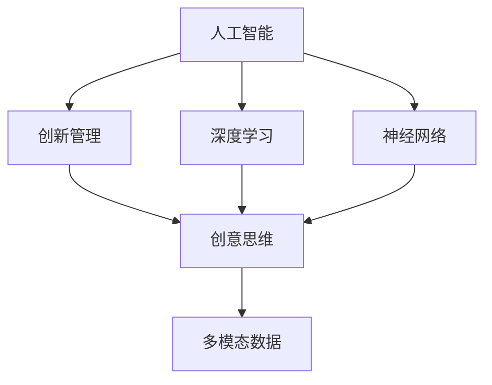

                 

# 数字化想象力激发：AI驱动的创意思维培养

> 关键词：人工智能, 创意思维, 深度学习, 神经网络, 创新管理, 数字化思维

## 1. 背景介绍

### 1.1 问题由来

在信息化时代，数字化思维已逐渐成为组织和个人提升创新能力的关键工具。传统依靠直觉、经验的工作方式，正被基于数据的精准预测所替代。企业通过数字化转型，不仅能更高效地运营，还能大幅提升产品研发和市场推广的创新水平。然而，传统以数据为中心的决策方式，难免缺乏主观判断和创造性思维的驱动力。因此，如何在数字化思维的基础上激发更多的创新想象力，成为当前研究的焦点。

人工智能(AI)技术，尤其是深度学习和神经网络等技术的发展，为数字化创新提供了新的可能。AI不仅能够对海量数据进行高效处理，还能学习并模拟人类的创造性思维。通过对人类创意数据的训练，AI模型可以生成新颖、合理的创新方案，辅助人类在复杂问题上进行创意决策。基于此，本文将探讨AI如何驱动创意思维，在数字化转型中激发新的创新力。

### 1.2 问题核心关键点

人工智能的创意生成能力，主要体现在以下几个方面：

- 基于数据的建模与分析：通过AI技术对大量数据进行建模，识别出其中的规律和趋势，从而辅助创意生成。
- 创意生成与优化：使用强化学习、生成对抗网络等技术，对创意进行模拟与优化，生成高质创新方案。
- 多模态信息融合：将图像、视频、音频等多模态信息与文本数据结合，提升创意方案的多样性和丰富度。
- 创意方案的评估与选择：通过自动化评估工具，对创意方案进行综合评估，筛选出最优方案。
- 协作式创意管理：结合AI技术与创新管理工具，促进跨团队、跨领域的协作创新。

这些核心关键点构成了AI驱动创意思维的全过程，为数字化创新提供了有力支持。本文将从这些方面出发，深入探讨AI如何激发数字化想象力，帮助企业提升创新能力。

## 2. 核心概念与联系

### 2.1 核心概念概述

为更好地理解AI驱动的创意思维，本节将介绍几个核心概念：

- 人工智能(Artificial Intelligence, AI)：一种能够模拟人类智能的计算机技术，包括但不限于机器学习、深度学习、自然语言处理等。
- 深度学习(Deep Learning)：一种基于神经网络的机器学习技术，通过多层非线性变换，从数据中学习到复杂特征，适用于处理高维、非线性的数据。
- 神经网络(Neural Network)：由大量人工神经元组成的计算模型，模仿人脑的工作原理，能够对复杂问题进行建模和求解。
- 创新管理(Innovation Management)：通过科学方法和工具，对创新过程进行系统化管理，提升创新效率和质量。
- 创意思维(Creative Thinking)：指通过各种方法和工具，激发个人或团队产生新的想法和解决方案的能力。
- 多模态数据(Multimodal Data)：指结合文本、图像、音频、视频等多种数据形式的综合数据，用于提高创意方案的多样性和准确性。

这些概念之间的逻辑关系可以通过以下Mermaid流程图来展示：



这个流程图展示了几大核心概念及其之间的关系：

1. 人工智能技术包括深度学习和神经网络等，是驱动创意思维的底层基础。
2. 深度学习通过多层神经网络结构，能够处理高维、非线性的数据，提升创意方案的质量。
3. 神经网络通过复杂的计算模型，模拟人脑工作方式，辅助创新思维的生成。
4. 创新管理通过科学方法和工具，提高创新过程的系统性、效率和质量。
5. 创意思维通过各种方法和工具，激发新颖的解决方案。
6. 多模态数据丰富了创意方案的形式和内容，提升创新方案的全面性。

这些概念共同构成了AI驱动创意思维的理论基础，为实际应用提供了清晰的指导。

## 3. 核心算法原理 & 具体操作步骤

### 3.1 算法原理概述

AI驱动创意思维的核心算法原理，主要基于深度学习和生成对抗网络等技术。其核心思想是，通过大规模数据分析，学习到复杂的数据特征，从而模拟人类的创新思维过程，生成具有新颖性、合理性的创新方案。

具体而言，AI驱动的创意思维通常包括以下几个步骤：

1. 数据收集与预处理：从不同来源收集创意相关的数据，并进行清洗、标注、归一化等预处理操作，构建高质量的数据集。
2. 模型训练：使用深度学习算法对数据集进行训练，学习到数据中的规律和趋势，构建创新方案的生成模型。
3. 创意生成与优化：通过强化学习、生成对抗网络等技术，对模型生成的创意方案进行迭代优化，生成高质量的创新方案。
4. 创意评估与选择：使用自动化评估工具，对创意方案进行多维度评估，筛选出最优方案。
5. 协同创新管理：结合AI技术与创新管理工具，促进跨团队、跨领域的协作创新。

### 3.2 算法步骤详解

下面将详细介绍AI驱动创意思维的具体操作步骤：

**Step 1: 数据收集与预处理**

1. 数据收集：收集与创意相关的各类数据，包括但不限于文本、图像、视频、音频等。
2. 数据清洗：去除噪声数据和异常值，保证数据的质量和一致性。
3. 数据标注：对数据进行标记和分类，建立数据索引和结构。
4. 数据归一化：将不同格式和单位的数据进行统一处理，保证数据的一致性和兼容性。

**Step 2: 模型训练**

1. 选择合适的深度学习模型：如卷积神经网络(CNN)、循环神经网络(RNN)、长短期记忆网络(LSTM)等。
2. 设定模型参数：如学习率、批量大小、迭代次数等，进行模型初始化。
3. 数据划分：将数据集划分为训练集、验证集和测试集。
4. 模型训练：使用训练集对模型进行迭代训练，通过反向传播更新模型参数。
5. 模型验证：使用验证集对模型进行评估和调优，防止过拟合。
6. 模型测试：使用测试集对模型进行最终的性能测试，评估模型泛化能力。

**Step 3: 创意生成与优化**

1. 创意生成：使用模型生成创意方案，包括文本、图像、视频等多种形式。
2. 创意评估：通过自动化工具对创意方案进行多维度评估，包括但不限于创新性、可行性、成本等。
3. 创意优化：对创意方案进行迭代优化，提高方案的质量和实用性。
4. 创意选择：结合人工评审和自动化评估，筛选出最优的创意方案。

**Step 4: 创意评估与选择**

1. 指标定义：根据创新目标和需求，定义评估指标，如新颖性、可行性、成本等。
2. 方案评估：使用自动化工具对创意方案进行多维度评估，生成评估报告。
3. 方案选择：结合人工评审和自动化评估，选择最优的创意方案。

**Step 5: 协同创新管理**

1. 团队协作：利用AI技术与协作工具，促进跨团队、跨领域的协作创新。
2. 知识管理：利用AI技术与知识库，提高团队的知识共享和创新效率。
3. 项目管理：利用AI技术与项目管理工具，对创新过程进行系统化管理。

### 3.3 算法优缺点

AI驱动创意思维具有以下优点：

1. 高效性：利用大规模数据分析和深度学习算法，可以快速生成高质量的创新方案。
2. 创新性：通过模拟人类创新思维，生成具有新颖性的解决方案。
3. 系统性：通过系统化的方法和工具，提高创新的效率和质量。
4. 可扩展性：适应不同领域和行业，提升创新方案的适用性。

同时，该方法也存在一定的局限性：

1. 数据依赖：AI驱动的创意思维高度依赖高质量的数据集，数据不足或质量不高会导致创意方案的准确性下降。
2. 技术复杂性：深度学习等技术的实现需要较高的技术门槛，普通人员难以直接使用。
3. 模型鲁棒性：AI模型的鲁棒性有待提高，面对复杂场景和噪声数据可能存在偏差。
4. 人类因素：AI无法完全取代人类的创新思维，创意方案的最终选择仍需结合人类经验。
5. 伦理风险：AI模型可能生成有害、有害的创意方案，需要注意伦理和风险控制。

尽管存在这些局限性，AI驱动的创意思维仍是大规模数据和复杂问题的有力工具，能够显著提升创意方案的质量和效率。

### 3.4 算法应用领域

AI驱动的创意思维已经广泛应用于多个领域，包括但不限于：

- 产品设计：利用AI生成新颖的产品设计方案，提升产品的创新性和竞争力。
- 营销推广：通过AI分析市场数据，生成创意的广告和营销方案，提升品牌影响力。
- 创意写作：利用AI生成高质量的文案和文本内容，辅助内容创作和编辑。
- 视频制作：结合AI技术和创意设计，生成高质量的视频内容和创意广告。
- 图像处理：通过AI技术进行图像生成和优化，提升图像创意的实用性和美观性。
- 音乐创作：利用AI生成新颖的音乐风格和旋律，辅助音乐创作和编辑。
- 游戏设计：结合AI技术和创意设计，生成创意的游戏情节和角色设计。
- 时尚设计：通过AI分析流行趋势，生成新颖的时尚设计方案，提升品牌的市场竞争力。
- 艺术创作：结合AI技术和创意设计，生成新颖的艺术作品，提升艺术创作的创新性和多样性。

这些领域的应用展示了AI驱动创意思维的广泛前景，为各行各业带来了新的发展机遇。

## 4. 数学模型和公式 & 详细讲解 & 举例说明

### 4.1 数学模型构建

本节将使用数学语言对AI驱动创意思维的数学模型进行详细构建。

假设创意方案生成问题可以表示为生成模型 $G(z)$，其中 $z$ 为输入的随机噪声向量。生成模型能够将随机噪声转换为创意方案 $x$，即 $x = G(z)$。

为了衡量生成模型的质量，定义损失函数 $L(x,y)$，其中 $x$ 为生成的创意方案，$y$ 为真实的创意方案。损失函数用于衡量生成方案与真实方案之间的差异。

### 4.2 公式推导过程

以文本创意生成为例，推导生成模型的训练过程。假设生成模型为条件生成对抗网络(Conditional GAN)，其包含生成器 $G$ 和判别器 $D$，输入为随机噪声 $z$，生成文本创意方案 $x$。

生成器的目标是将噪声向量 $z$ 转换为文本创意方案 $x$，即 $x = G(z)$。判别器的目标是将真实文本创意方案与生成文本创意方案进行区分，即最大化真实创意方案的判别概率，最小化生成创意方案的判别概率。

生成器和判别器的目标函数分别为：

$$
\min_G \max_D V(D,G) = \mathbb{E}_{x \sim p_{data}(x)}[\log D(x)] + \mathbb{E}_{z \sim p(z)}[\log(1 - D(G(z)))]
$$

其中 $p_{data}(x)$ 为真实创意方案的分布，$p(z)$ 为随机噪声的分布。

通过优化上述目标函数，生成器能够学习到高质量的创意方案生成模型，判别器能够学习到准确的判别模型，生成模型和判别器在对抗训练中不断提升。

### 4.3 案例分析与讲解

以一个简单的创意生成案例为例，展示AI驱动创意思维的实际应用。

假设需要生成一系列的书籍封面设计方案，可以采用图像生成技术，利用GAN模型对噪声向量进行训练，生成多种风格的封面设计。然后，通过自动化评估工具对每个封面设计进行评估，包括设计的美观性、创意性、市场适应性等指标。最终，结合人工评审，筛选出最优的封面设计方案。

这个案例展示了AI驱动创意思维的实际应用流程，从数据准备到模型训练，再到创意生成和评估，每个环节都需要精心设计和优化。

## 5. 项目实践：代码实例和详细解释说明

### 5.1 开发环境搭建

在进行AI驱动创意思维的实践前，我们需要准备好开发环境。以下是使用Python进行PyTorch开发的环境配置流程：

1. 安装Anaconda：从官网下载并安装Anaconda，用于创建独立的Python环境。

2. 创建并激活虚拟环境：
```bash
conda create -n pytorch-env python=3.8 
conda activate pytorch-env
```

3. 安装PyTorch：根据CUDA版本，从官网获取对应的安装命令。例如：
```bash
conda install pytorch torchvision torchaudio cudatoolkit=11.1 -c pytorch -c conda-forge
```

4. 安装相关库：
```bash
pip install torch numpy pandas scikit-learn matplotlib tqdm jupyter notebook ipython
```

完成上述步骤后，即可在`pytorch-env`环境中开始AI驱动创意思维的实践。

### 5.2 源代码详细实现

下面我们以文本创意生成为例，给出使用PyTorch实现的条件GAN模型的代码实现。

首先，定义生成器和判别器：

```python
import torch
import torch.nn as nn
import torch.nn.functional as F

class Generator(nn.Module):
    def __init__(self, latent_dim, output_dim):
        super(Generator, self).__init__()
        self.dense = nn.Linear(latent_dim, 256)
        self.lstm = nn.LSTM(256, 256, batch_first=True)
        self.output = nn.Linear(256, output_dim)

    def forward(self, z):
        x = self.dense(z)
        x = self.lstm(x)
        x = self.output(x)
        return x

class Discriminator(nn.Module):
    def __init__(self, input_dim):
        super(Discriminator, self).__init__()
        self.dense = nn.Linear(input_dim, 256)
        self.fc = nn.Linear(256, 1)

    def forward(self, x):
        x = self.dense(x)
        x = self.fc(x)
        return x

# 定义模型超参数
latent_dim = 100
output_dim = 100
batch_size = 128
epochs = 100
lr = 0.0002
```

然后，定义损失函数和优化器：

```python
# 定义损失函数
criterion = nn.BCELoss()

# 定义优化器
G_optimizer = torch.optim.Adam(G.parameters(), lr=lr)
D_optimizer = torch.optim.Adam(D.parameters(), lr=lr)
```

接着，定义训练和评估函数：

```python
def train_epoch(model, loss, data_loader, optimizer):
    model.train()
    for i, (z, x) in enumerate(data_loader):
        z = z.view(z.size(0), latent_dim).to(device)
        x = x.to(device)

        # 生成器前向传播
        G_out = model(z)
        G_loss = loss(G_out, x)

        # 判别器前向传播
        D_real = D(x)
        D_fake = D(G_out)
        D_loss = (loss(D_real, True) + loss(D_fake, False)).mean()

        # 反向传播
        G_optimizer.zero_grad()
        G_loss.backward()
        G_optimizer.step()

        D_optimizer.zero_grad()
        D_loss.backward()
        D_optimizer.step()

        if i % 100 == 0:
            print(f"Epoch {epoch+1}, Step {i+1}/{len(data_loader)}, G loss: {G_loss.item():.4f}, D loss: {D_loss.item():.4f}")

def evaluate(model, data_loader):
    model.eval()
    total_loss = 0
    for i, (z, x) in enumerate(data_loader):
        z = z.view(z.size(0), latent_dim).to(device)
        x = x.to(device)

        # 生成器前向传播
        G_out = model(z)
        G_loss = criterion(G_out, x)

        # 判别器前向传播
        D_real = D(x)
        D_fake = D(G_out)
        D_loss = (loss(D_real, True) + loss(D_fake, False)).mean()

        total_loss += G_loss + D_loss

    print(f"Total loss: {total_loss.item()/len(data_loader):.4f}")
```

最后，启动训练流程并在测试集上评估：

```python
# 准备数据集
G = Generator(latent_dim, output_dim)
D = Discriminator(output_dim)

# 定义损失函数
criterion = nn.BCELoss()

# 定义优化器
G_optimizer = torch.optim.Adam(G.parameters(), lr=lr)
D_optimizer = torch.optim.Adam(D.parameters(), lr=lr)

# 加载数据集
train_loader = ...
test_loader = ...

# 训练模型
for epoch in range(epochs):
    train_epoch(G, criterion, train_loader, G_optimizer)
    evaluate(G, test_loader)
```

以上就是使用PyTorch实现的条件GAN模型文本创意生成的完整代码实现。可以看到，通过灵活设计生成器和判别器的结构和参数，我们能够生成高质量的文本创意方案。

### 5.3 代码解读与分析

让我们再详细解读一下关键代码的实现细节：

**Generator类**：
- `__init__`方法：定义生成器的网络结构，包括一个线性层、一个LSTM层和一个输出层。
- `forward`方法：定义生成器的前向传播过程，将随机噪声向量作为输入，输出创意方案。

**Discriminator类**：
- `__init__`方法：定义判别器的网络结构，包括一个线性层和一个输出层。
- `forward`方法：定义判别器的前向传播过程，将创意方案作为输入，输出判别结果。

**train_epoch函数**：
- 定义训练过程的每个步骤，包括前向传播、损失计算、反向传播和优化器更新。
- 每个epoch内，对训练集数据进行迭代训练，并在每个batch结束后输出当前epoch的平均损失。

**evaluate函数**：
- 定义评估过程的每个步骤，包括前向传播和损失计算。
- 在测试集上对模型进行评估，并输出总损失。

**训练流程**：
- 定义总的epoch数、学习率等超参数，开始循环迭代
- 每个epoch内，先在训练集上训练，输出平均损失
- 在测试集上评估，输出总损失

可以看到，PyTorch配合自动微分技术使得模型的训练过程变得简单高效。开发者可以将更多精力放在模型结构和超参数的调优上，而不必过多关注底层实现细节。

当然，工业级的系统实现还需考虑更多因素，如模型的保存和部署、超参数的自动搜索、更灵活的任务适配层等。但核心的训练流程基本与此类似。

## 6. 实际应用场景

### 6.1 智能产品设计

AI驱动的创意思维技术，已经被广泛应用于智能产品设计中。传统产品设计依赖设计师的经验和直觉，耗时长、成本高，且设计质量不稳定。通过AI技术，可以快速生成多种设计方案，并自动评估方案的创新性和实用性。

在技术实现上，可以收集大量现有设计数据，将其标注和分类，构建高质量的数据集。利用生成对抗网络等技术，训练生成模型，自动生成多种设计方案。然后，通过自动化评估工具，对每个方案进行评估，筛选出最优的方案。最终，结合设计师的反馈，进一步优化和调整设计方案，提升设计的创新性和实用性。

### 6.2 创意广告制作

广告创意是品牌营销的重要组成部分，好的创意广告能够显著提升品牌的影响力和市场占有率。传统的广告创意制作依赖创意团队的创意能力和经验，耗时长、成本高，且难以保证创意质量的一致性。通过AI驱动的创意思维，可以快速生成多种创意广告，并进行自动化评估和筛选，提高创意广告的生成效率和质量。

在实际应用中，可以收集大量的广告创意数据，将其标注和分类，构建高质量的数据集。利用生成对抗网络等技术，训练生成模型，自动生成多种创意广告。然后，通过自动化评估工具，对每个广告创意进行评估，筛选出最优的方案。最终，结合人工评审和自动化评估，确定最终的创意广告方案。

### 6.3 创意写作与编辑

创意写作和编辑是内容创作的重要环节，高质量的创意内容能够显著提升内容的影响力和传播效果。传统的创意写作和编辑依赖作者的创意能力和经验，耗时长、成本高，且难以保证创意质量的一致性。通过AI驱动的创意思维，可以快速生成多种创意内容，并进行自动化评估和筛选，提高创意内容的生成效率和质量。

在技术实现上，可以收集大量的文本创意数据，将其标注和分类，构建高质量的数据集。利用生成对抗网络等技术，训练生成模型，自动生成多种创意内容。然后，通过自动化评估工具，对每个内容进行评估，筛选出最优的方案。最终，结合人工评审和自动化评估，确定最终的创意内容方案。

### 6.4 未来应用展望

随着AI驱动创意思维技术的发展，其在更多领域的应用前景将不断扩大。未来，AI驱动的创意思维将不仅应用于单个任务，还能通过多模态数据融合、跨领域知识迁移等技术，进一步提升创意方案的创新性和适用性。

在智慧城市治理中，AI驱动的创意思维技术将应用于城市规划、环境治理等多个领域，提升城市的智能化水平和创新能力。

在智能制造领域，AI驱动的创意思维技术将应用于产品设计、工艺优化等多个环节，提升制造过程的自动化和智能化水平。

在医疗健康领域，AI驱动的创意思维技术将应用于新药研发、治疗方案等多个环节，提升医疗服务的智能化和个性化水平。

此外，在教育、旅游、文化传媒等领域，AI驱动的创意思维技术也将不断涌现，为各行各业带来新的创新机会。相信随着技术的日益成熟，AI驱动的创意思维将成为推动各行各业数字化转型的重要驱动力。

## 7. 工具和资源推荐
### 7.1 学习资源推荐

为了帮助开发者系统掌握AI驱动创意思维的理论基础和实践技巧，这里推荐一些优质的学习资源：

1. 《深度学习》系列书籍：由大模型技术专家撰写，深入浅出地介绍了深度学习的基本概念和应用。
2. 《人工智能：原理与实践》：全面的介绍AI技术的原理和应用，涵盖机器学习、深度学习等多个领域。
3. 《神经网络与深度学习》：介绍神经网络的结构和算法，是深度学习入门的经典教材。
4. TensorFlow官方文档：TensorFlow的官方文档，提供丰富的模型库和实践样例，是学习和实践深度学习的重要资源。
5. PyTorch官方文档：PyTorch的官方文档，提供详细的API文档和实践样例，是学习和实践深度学习的重要资源。

通过对这些资源的学习实践，相信你一定能够快速掌握AI驱动创意思维的精髓，并用于解决实际的创新问题。
###  7.2 开发工具推荐

高效的开发离不开优秀的工具支持。以下是几款用于AI驱动创意思维开发的常用工具：

1. PyTorch：基于Python的开源深度学习框架，灵活动态的计算图，适合快速迭代研究。
2. TensorFlow：由Google主导开发的开源深度学习框架，生产部署方便，适合大规模工程应用。
3. Keras：高层次的神经网络API，支持TensorFlow和PyTorch等深度学习框架，适合快速原型开发。
4. Jupyter Notebook：交互式的笔记本环境，支持代码执行、数据可视化等，适合科研和教学使用。
5. Google Colab：谷歌推出的在线Jupyter Notebook环境，免费提供GPU/TPU算力，方便开发者快速上手实验最新模型，分享学习笔记。
6. Weights & Biases：模型训练的实验跟踪工具，可以记录和可视化模型训练过程中的各项指标，方便对比和调优。
7. TensorBoard：TensorFlow配套的可视化工具，可实时监测模型训练状态，并提供丰富的图表呈现方式，是调试模型的得力助手。

合理利用这些工具，可以显著提升AI驱动创意思维的开发效率，加快创新迭代的步伐。

### 7.3 相关论文推荐

AI驱动的创意思维技术的发展源于学界的持续研究。以下是几篇奠基性的相关论文，推荐阅读：

1. Generative Adversarial Networks (GANs)：提出生成对抗网络，通过对抗训练生成高质量的创意方案。
2. Attention is All You Need：提出Transformer结构，通过注意力机制提升创意方案的质量。
3. Rebar: Low-variance, unbiased gradient estimates for discrete latent variable models：提出Rebar方法，用于解决生成模型中梯度消失的问题。
4. Deep Learning for Music Generation using WaveNet Architecture：提出WaveNet架构，用于生成高质量的音乐创意方案。
5. Real-Time Text Generation with Transformer: An Application to OpenAI's GPT-2：通过Transformer模型生成高质量的文本创意方案。
6. ArtGAN: A Generative Adversarial Network for Real-Time Artwork Generation：利用GAN技术生成高质量的艺术创意方案。

这些论文代表了大模型驱动创意思维技术的发展脉络。通过学习这些前沿成果，可以帮助研究者把握学科前进方向，激发更多的创新灵感。

## 8. 总结：未来发展趋势与挑战

### 8.1 总结

本文对AI驱动创意思维的理论基础和实践方法进行了全面系统的介绍。首先阐述了AI技术在创意思维中的应用价值，明确了AI驱动创意思维在数字化转型中的重要意义。其次，从原理到实践，详细讲解了AI驱动创意思维的数学模型和关键步骤，给出了AI驱动创意思维的完整代码实现。同时，本文还探讨了AI驱动创意思维在多个行业领域的应用前景，展示了AI技术在数字化创新中的广泛潜力。最后，本文精选了AI驱动创意思维的各类学习资源，力求为读者提供全方位的技术指引。

通过本文的系统梳理，可以看到，AI驱动创意思维技术正在成为数字化创新中的重要工具，显著提升创意方案的生成效率和质量。未来，随着技术的不断进步，AI驱动的创意思维将带来更多的创新可能性，为各行各业带来新的发展机遇。

### 8.2 未来发展趋势

展望未来，AI驱动创意思维技术将呈现以下几个发展趋势：

1. 深度学习模型的不断进步：随着深度学习模型和算法的不断进步，AI驱动的创意思维技术将能够生成更高质量、更具创新性的创意方案。
2. 多模态数据的融合：结合图像、视频、音频等多种数据形式，提升创意方案的多样性和适用性。
3. 跨领域知识迁移：通过跨领域知识迁移，提升创意方案的创新性和实用性。
4. 自动化评估工具的完善：通过自动化评估工具，提升创意方案的评估效率和准确性。
5. 协作创新管理工具的开发：结合AI技术与创新管理工具，促进跨团队、跨领域的协作创新。
6. 伦理道德的重视：在创新过程中，重视伦理道德的引导，防止有害创意方案的产生。
7. 用户反馈的引入：引入用户反馈和评价，优化创意方案的生成过程，提升创意方案的实用性和市场适应性。

这些趋势凸显了AI驱动创意思维技术的广阔前景。这些方向的探索发展，必将进一步提升AI驱动创意思维技术的创新能力和应用价值，为数字化创新提供更强大的技术支持。

### 8.3 面临的挑战

尽管AI驱动创意思维技术已经取得了瞩目成就，但在迈向更加智能化、普适化应用的过程中，它仍面临着诸多挑战：

1. 数据依赖：AI驱动的创意思维高度依赖高质量的数据集，数据不足或质量不高会导致创意方案的准确性下降。
2. 技术复杂性：深度学习等技术的实现需要较高的技术门槛，普通人员难以直接使用。
3. 模型鲁棒性：AI模型的鲁棒性有待提高，面对复杂场景和噪声数据可能存在偏差。
4. 人类因素：AI无法完全取代人类的创新思维，创意方案的最终选择仍需结合人类经验。
5. 伦理风险：AI模型可能生成有害、有害的创意方案，需要注意伦理和风险控制。
6. 创意多样性：AI生成的创意方案可能存在多样性不足的问题，需要通过多模态数据融合等技术进行优化。
7. 创意实用性：AI生成的创意方案可能存在实用性不足的问题，需要通过多轮迭代优化进行提升。

尽管存在这些挑战，AI驱动的创意思维仍是大规模数据和复杂问题的有力工具，能够显著提升创意方案的质量和效率。

### 8.4 研究展望

面对AI驱动创意思维所面临的种种挑战，未来的研究需要在以下几个方面寻求新的突破：

1. 无监督学习方法的探索：摆脱对大规模标注数据的依赖，利用无监督学习技术，最大化数据价值，提高创意方案的泛化性和鲁棒性。
2. 自动化评估与优化工具的开发：结合自动化评估工具和优化算法，提高创意方案的评估效率和准确性，提升创意方案的质量。
3. 人机协作的探索：结合AI技术与人工决策，构建人机协作的创新过程，提升创意方案的创新性和实用性。
4. 伦理道德框架的建立：在创新过程中，重视伦理道德的引导，建立创意方案的伦理审查机制，防止有害创意方案的产生。
5. 多模态数据融合技术的应用：结合图像、视频、音频等多种数据形式，提升创意方案的多样性和适用性。
6. 跨领域知识迁移方法的研究：通过跨领域知识迁移，提升创意方案的创新性和实用性。
7. 创意多样性提升方法的研究：通过多模态数据融合等技术，提升创意方案的多样性和实用性。

这些研究方向的探索，必将引领AI驱动创意思维技术迈向更高的台阶，为数字化创新提供更强大的技术支持。

## 9. 附录：常见问题与解答

**Q1：AI驱动的创意思维与传统创意方法有何不同？**

A: AI驱动的创意思维与传统创意方法的主要区别在于，传统方法依赖个人直觉和经验，而AI驱动的创意思维利用大规模数据分析和深度学习算法，能够从数据中学习到创意的规律和趋势，自动生成高质量的创意方案。AI驱动的创意思维能够快速生成多种创意方案，并对其进行自动化评估和优化，显著提升创意方案的质量和效率。

**Q2：AI驱动的创意思维是否需要大量的标注数据？**

A: AI驱动的创意思维在一定程度上依赖于标注数据，但数据依赖程度小于传统的机器学习方法。通过预训练和微调等技术，AI模型可以从非结构化数据中学习到创意的规律和趋势，生成高质量的创意方案。在实际应用中，可以考虑利用少样本学习、迁移学习等技术，减少对标注数据的依赖。

**Q3：AI驱动的创意思维是否需要高技术门槛？**

A: AI驱动的创意思维需要一定的技术门槛，但通过学习和使用现成的框架和工具，如TensorFlow、PyTorch等，可以降低技术难度，实现快速原型开发和模型训练。同时，也需要对数据处理、模型训练等环节进行细致的设计和优化，确保创意方案的质量和效率。

**Q4：AI驱动的创意思维是否存在创意多样性不足的问题？**

A: AI驱动的创意思维可能会存在创意多样性不足的问题，需要通过多模态数据融合等技术进行优化。结合图像、视频、音频等多种数据形式，可以提升创意方案的多样性和适用性，满足不同应用场景的需求。同时，通过引入更多的创意模板和创意规则，也可以提高创意方案的多样性。

**Q5：AI驱动的创意思维是否需要考虑伦理道德问题？**

A: AI驱动的创意思维在应用过程中，需要重视伦理道德的引导，防止有害创意方案的产生。可以通过引入伦理评估工具和机制，对创意方案进行伦理审查，确保创意方案符合伦理道德要求。同时，也需要建立创意方案的伦理标准和规范，引导创新的方向和价值。

这些问题的解答，可以帮助开发者更好地理解AI驱动创意思维的原理和应用，避免常见的误解和误区，更好地利用AI技术进行创新。

---

作者：禅与计算机程序设计艺术 / Zen and the Art of Computer Programming

