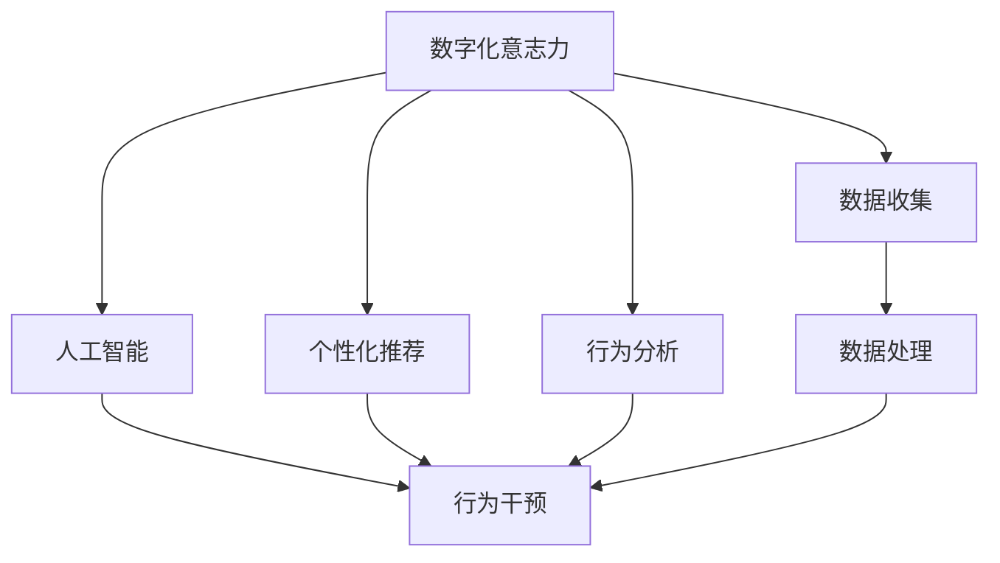

                 

# 数字化意志力：AI增强的自我控制

> 关键词：数字化意志力, AI增强, 自我控制, 行为分析, 人工智能, 数据科学, 个性化推荐, 行为干预

## 1. 背景介绍

### 1.1 问题由来
在数字化时代，个人信息充斥着我们的日常生活，从电子邮件到社交媒体，从在线购物到智能家居，数字化技术无所不在。然而，过度依赖数字设备和使用不当时，我们很容易沉迷于各种数字产品，导致注意力分散、工作效率低下、甚至损害身心健康。这些问题常常源于缺乏自我控制能力，即“数字化意志力”的缺失。

### 1.2 问题核心关键点
数字化意志力是指在数字世界中保持专注、抵制诱惑、合理使用数字设备的能力。面对信息过载，如何自我管理，提高效率，增强自律，成为了现代人的重要课题。人工智能(AI)和数据科学的发展，为提升数字化意志力提供了新的可能，使得个性化推荐、行为干预等技术得以应用。

### 1.3 问题研究意义
研究数字化意志力的提升方法，对于改善人们的数字生活习惯，提升生活质量和工作效率，增强心理韧性，具有重要意义。特别是对青少年、职场人士等容易受到数字产品干扰的人群，通过AI技术干预，可以帮助他们形成更好的数字使用习惯，提高工作效率，改善心理状态。

## 2. 核心概念与联系

### 2.1 核心概念概述

为更好地理解AI如何增强自我控制，本节将介绍几个密切相关的核心概念：

- 数字化意志力(Digital Discipline)：指个体在数字环境中管理时间和注意力，抵制诱惑的能力。
- 个性化推荐(Recommendation System)：通过用户行为数据，智能推荐相关内容，提高用户满意度。
- 行为分析(Behavioral Analysis)：通过数据分析理解用户行为模式，识别潜在问题。
- 人工智能(AI)：利用机器学习等技术，构建智能系统，辅助决策和行为干预。
- 行为干预(Behavioral Intervention)：通过技术手段引导用户改变不健康行为，增强自律性。

这些核心概念之间的逻辑关系可以通过以下Mermaid流程图来展示：



这个流程图展示了大语言模型的核心概念及其之间的关系：

1. 数字化意志力作为AI干预的初始目标，旨在通过技术手段提升个体在数字环境中的自律性。
2. 个性化推荐和行为分析是AI技术实现干预的基础，通过分析用户数据，实现精准推荐。
3. 人工智能作为技术工具，在个性化推荐和行为分析的基础上，进一步进行行为干预。
4. 数据收集和处理是实现AI干预的前提，需要收集用户行为数据，并进行预处理，以供后续分析和使用。

这些核心概念共同构成了数字化意志力提升的逻辑框架，为AI技术在实际应用中发挥作用提供了理论基础。

## 3. 核心算法原理 & 具体操作步骤
### 3.1 算法原理概述

AI增强数字化意志力的基本思想是通过数据分析和机器学习模型，构建个性化的推荐和干预系统，辅助个体进行自我管理。其核心算法包括：

- 个性化推荐算法：通过分析用户历史行为，预测用户未来可能感兴趣的内容，减少信息过载，避免过度使用。
- 行为分析算法：使用数据挖掘和机器学习技术，识别用户的不良数字使用习惯，找出潜在问题。
- 行为干预算法：基于行为分析的结果，设计有针对性的干预措施，引导用户改变行为，增强自律性。

### 3.2 算法步骤详解

AI增强数字化意志力的具体实施步骤如下：

**Step 1: 数据收集与预处理**
- 收集用户的数字使用数据，包括访问记录、使用时长、互动内容等。
- 对收集到的数据进行清洗、归一化等预处理，确保数据质量。

**Step 2: 个性化推荐系统设计**
- 基于用户的兴趣和行为历史，构建推荐模型，如协同过滤、内容推荐等。
- 设计推荐策略，平衡多样性和相关性，避免内容单一。

**Step 3: 行为分析系统建立**
- 使用统计分析或机器学习算法，识别异常使用行为，如过度使用某类应用、夜间长时间使用等。
- 设置行为指标和阈值，构建行为分析模型。

**Step 4: 行为干预机制设计**
- 设计干预措施，如定时提醒、内容过滤、使用限制等。
- 引入强化学习等技术，动态调整干预策略，增强用户适应性。

**Step 5: 反馈与调整**
- 收集用户对干预措施的反馈，进行效果评估。
- 根据反馈和评估结果，调整干预策略，优化模型。

### 3.3 算法优缺点

AI增强数字化意志力的方法具有以下优点：
1. 精准推荐：基于用户数据，个性化推荐相关内容，减少信息过载。
2. 行为监控：通过数据分析，识别不良使用行为，实时监控。
3. 动态干预：利用AI技术，动态调整干预策略，提高干预效果。
4. 用户适应：采用强化学习等技术，增强用户适应性，避免抵触。

同时，该方法也存在以下局限性：
1. 数据隐私：需要收集用户数据，可能引发隐私保护问题。
2. 干预过度：过度干预可能导致用户反感，反而降低数字化意志力。
3. 个性化不足：如果数据质量不高，个性化推荐可能失效。
4. 模型偏差：模型可能存在偏见，影响推荐和干预的公平性。

尽管存在这些局限性，但AI增强数字化意志力方法在提升个体自律性、改善数字使用习惯方面，具有显著的优势和潜力。

### 3.4 算法应用领域

AI增强数字化意志力的方法在多个领域具有广泛的应用前景：

- 教育：通过个性化推荐和行为分析，帮助学生高效利用数字学习资源，避免数字成瘾。
- 医疗：监测患者的数字健康行为，如智能提醒服药时间，预防过度使用电子设备。
- 电商：个性化推荐商品，减少无意义浏览，提升购物体验。
- 职场：监控员工工作时间，提醒休息，避免长时间不间断工作。
- 家庭：监控儿童数字使用时间，限制使用内容，保护儿童健康成长。

这些应用领域展示了AI技术在提升个体数字化意志力方面的巨大潜力。未来，随着技术的进一步发展，AI增强数字化意志力将会在更多场景中得到应用，为提升人类生活质量提供更多可能性。

## 4. 数学模型和公式 & 详细讲解  
### 4.1 数学模型构建

本节将使用数学语言对AI增强数字化意志力的方法进行更加严格的刻画。

记用户的数字使用行为为 $x_i$，其中 $i=1,2,\ldots,N$。行为特征 $x_i$ 可以表示为：

$$
x_i = [x_{i1}, x_{i2}, \ldots, x_{im}]
$$

其中 $x_{ij}$ 为第 $i$ 用户第 $j$ 个行为特征。假设用户行为 $x_i$ 与推荐内容 $y_j$ 之间的关系可以用矩阵形式表示为：

$$
X\Theta = Y
$$

其中 $X$ 为行为特征矩阵，$\Theta$ 为推荐模型参数，$Y$ 为推荐内容矩阵。通过对矩阵 $X$ 和 $Y$ 进行奇异值分解(SVD)，可以得到推荐模型参数 $\Theta$ 的解：

$$
\Theta = UDV^T
$$

其中 $U$ 和 $V$ 分别为行为特征矩阵 $X$ 和推荐内容矩阵 $Y$ 的左、右奇异矩阵，$D$ 为奇异矩阵 $U$ 和 $V$ 的奇异值。

### 4.2 公式推导过程

基于上述数学模型，推荐内容 $y_j$ 可以表示为：

$$
y_j = X\Theta_j = UDV^TY_j
$$

其中 $\Theta_j$ 为行为特征矩阵 $X$ 和推荐内容矩阵 $Y_j$ 的交互矩阵。

通过上述公式，可以计算出用户对推荐内容的评分，从而构建推荐列表。例如，使用协同过滤方法，可以计算用户 $i$ 对推荐内容 $j$ 的评分：

$$
r_{ij} = \hat{y}_i = UDV^TJ_i
$$

其中 $J_i$ 为第 $i$ 用户的历史评分向量。通过计算推荐列表 $R_i$ 中推荐内容 $j$ 的评分 $r_{ij}$，可以确定推荐顺序。

### 4.3 案例分析与讲解

以智能电商为例，可以使用协同过滤方法，为用户推荐可能感兴趣的商品。具体步骤如下：

1. 收集用户浏览、点击、购买行为数据，将其转换为行为特征矩阵 $X$。
2. 对行为特征矩阵 $X$ 进行奇异值分解，得到推荐模型参数 $\Theta$。
3. 收集商品评分数据，构建推荐内容矩阵 $Y$。
4. 计算推荐列表 $R_i$ 中每个商品的评分 $r_{ij}$，并排序，得到推荐商品列表。

## 5. 项目实践：代码实例和详细解释说明
### 5.1 开发环境搭建

在进行AI增强数字化意志力项目的开发前，我们需要准备好开发环境。以下是使用Python进行TensorFlow开发的环境配置流程：

1. 安装Anaconda：从官网下载并安装Anaconda，用于创建独立的Python环境。

2. 创建并激活虚拟环境：
```bash
conda create -n pytensor-env python=3.8 
conda activate pytensor-env
```

3. 安装TensorFlow：根据CUDA版本，从官网获取对应的安装命令。例如：
```bash
conda install tensorflow -c tensorflow -c conda-forge
```

4. 安装相关库：
```bash
pip install pandas numpy scikit-learn matplotlib tqdm
```

完成上述步骤后，即可在`pytensor-env`环境中开始AI增强数字化意志力的实践。

### 5.2 源代码详细实现

这里我们以电商个性化推荐系统为例，给出使用TensorFlow构建推荐模型的PyTorch代码实现。

首先，定义推荐系统的行为特征提取函数：

```python
import tensorflow as tf
from tensorflow.keras.layers import Input, Embedding, Dot, Dense

def feature_extraction(X, n_features, n_embedding):
    user_features = Embedding(n_features, n_embedding)(X[:, 0:1])
    item_features = Embedding(n_features, n_embedding)(X[:, 1:2])
    return Dot(axes=1)([user_features, item_features])

# 构建推荐模型
def recommendation_model(n_embedding):
    user_input = Input(shape=(1,))
    item_input = Input(shape=(1,))
    embedding_user = Embedding(n_features, n_embedding)(user_input)
    embedding_item = Embedding(n_features, n_embedding)(item_input)
    dot_product = Dot(axes=1)([embedding_user, embedding_item])
    output = Dense(1, activation='sigmoid')(dot_product)
    model = tf.keras.Model(inputs=[user_input, item_input], outputs=output)
    return model
```

然后，构建推荐系统：

```python
n_embedding = 8
X = np.random.randint(0, n_features, size=(n_samples, 2))
Y = np.random.rand(n_samples)
n_samples = X.shape[0]
model = recommendation_model(n_embedding)
model.compile(optimizer='adam', loss='binary_crossentropy', metrics=['accuracy'])
model.fit([X[:, 0], X[:, 1]], Y, epochs=10, batch_size=8)
```

接着，评估推荐系统的性能：

```python
def evaluate(model, X_test, Y_test):
    Y_pred = model.predict([X_test[:, 0], X_test[:, 1]])
    accuracy = np.mean((Y_pred > 0.5) == Y_test)
    return accuracy

X_test = np.random.randint(0, n_features, size=(n_test_samples, 2))
Y_test = np.random.rand(n_test_samples)
n_test_samples = X_test.shape[0]
accuracy = evaluate(model, X_test, Y_test)
print(f'Test accuracy: {accuracy:.2f}')
```

### 5.3 代码解读与分析

让我们再详细解读一下关键代码的实现细节：

**feature_extraction函数**：
- 定义了特征提取函数，通过用户行为特征矩阵 $X$ 的前两列，提取用户和商品之间的相似性矩阵。

**recommendation_model函数**：
- 定义了推荐模型，包括用户和商品特征的嵌入、相似性计算和输出。

**推荐系统构建与评估**：
- 通过随机生成的行为特征矩阵 $X$ 和评分向量 $Y$，训练推荐模型。
- 在测试集上评估模型性能，输出准确率。

可以看到，TensorFlow和Keras提供的工具库，使得构建和评估推荐系统变得简洁高效。开发者可以将更多精力放在业务逻辑的设计和优化上，而不必过多关注底层实现细节。

当然，实际应用中还需考虑更多因素，如模型的保存和部署、超参数的自动搜索、更灵活的行为特征等。但核心的推荐算法基本与此类似。

## 6. 实际应用场景
### 6.1 智能教育

AI增强数字化意志力的方法在智能教育中有着广泛应用。通过个性化推荐和行为分析，可以提升学生的学习效率，避免数字成瘾，培养自律学习习惯。

在技术实现上，可以收集学生的学习行为数据，如课堂互动、作业提交、在线讨论等，利用推荐算法为他们推荐合适的学习资源。同时，通过行为分析，及时发现学生的不良学习行为，如过度使用游戏、夜间长时间学习等，进行动态干预，提醒学生调整作息，避免过度疲劳。

### 6.2 数字健康

AI增强数字化意志力的方法在数字健康领域也有着显著的效果。通过监控用户的数字健康行为，可以帮助他们养成健康的生活习惯，避免过度使用电子设备。

具体而言，可以收集用户的数字设备使用数据，如智能手机使用时长、电脑使用时长等，使用机器学习模型分析用户的健康行为模式。对于存在过度使用风险的用户，可以设计有针对性的干预措施，如定时提醒休息、限制使用时长等，帮助他们建立健康的生活习惯。

### 6.3 职场管理

在职场管理中，AI增强数字化意志力的方法可以有效提高员工的工作效率，避免过度使用数字设备。

通过收集员工的数字使用数据，如电子邮件使用频率、会议参与度等，使用推荐算法为他们推荐合适的信息，减少信息过载。同时，通过行为分析，及时发现员工的不良工作习惯，如长时间不间断工作、过度使用社交媒体等，进行动态干预，提醒员工调整工作节奏，避免过度疲劳。

### 6.4 未来应用展望

随着AI技术的发展，AI增强数字化意志力将在更多领域得到应用，为提升个体生活质量和工作效率带来更多可能性。

在智慧城市治理中，AI增强数字化意志力的方法可以用于监测居民的数字使用行为，预防沉迷，提升生活质量。

在家庭管理中，AI增强数字化意志力的方法可以帮助家长监控孩子的数字使用时间，限制内容访问，保护孩子健康成长。

此外，在企业培训、金融投资、旅游出行等众多领域，AI增强数字化意志力的方法也将不断涌现，为数字化时代的个体提供更多支持和保障。

## 7. 工具和资源推荐
### 7.1 学习资源推荐

为了帮助开发者系统掌握AI增强数字化意志力的理论基础和实践技巧，这里推荐一些优质的学习资源：

1. 《机器学习》系列书籍：斯坦福大学李飞飞教授的《机器学习》课程，深入浅出地介绍了机器学习和深度学习的核心概念和算法。

2. 《TensorFlow实战》系列书籍：TensorFlow官方文档，提供了从入门到高级的TensorFlow使用指南，适合各个层次的开发者。

3. 《Python深度学习》系列书籍：Francois Chollet的《深度学习》书籍，介绍了使用TensorFlow和Keras构建深度学习模型的全流程。

4. Weights & Biases：模型训练的实验跟踪工具，可以记录和可视化模型训练过程中的各项指标，方便对比和调优。与主流深度学习框架无缝集成。

5. Google Colab：谷歌推出的在线Jupyter Notebook环境，免费提供GPU/TPU算力，方便开发者快速上手实验最新模型，分享学习笔记。

通过对这些资源的学习实践，相信你一定能够快速掌握AI增强数字化意志力的精髓，并用于解决实际的数字化问题。

### 7.2 开发工具推荐

高效的开发离不开优秀的工具支持。以下是几款用于AI增强数字化意志力开发的常用工具：

1. TensorFlow：由Google主导开发的开源深度学习框架，生产部署方便，适合大规模工程应用。同时有丰富的推荐和行为分析工具库。

2. Keras：TensorFlow的高层次API，提供简单易用的接口，适合快速迭代研究。

3. Scikit-learn：基于Python的机器学习库，提供各种数据处理和模型评估工具。

4. Python：简单易学的编程语言，拥有丰富的第三方库，适合快速实现和测试算法。

5. Weights & Biases：模型训练的实验跟踪工具，可以记录和可视化模型训练过程中的各项指标，方便对比和调优。

6. Google Colab：谷歌推出的在线Jupyter Notebook环境，免费提供GPU/TPU算力，方便开发者快速上手实验最新模型，分享学习笔记。

合理利用这些工具，可以显著提升AI增强数字化意志力任务的开发效率，加快创新迭代的步伐。

### 7.3 相关论文推荐

AI增强数字化意志力技术的发展源于学界的持续研究。以下是几篇奠基性的相关论文，推荐阅读：

1. "RecSys 2021: Fast, Scalable, and Accurate Recommendations at Large Scale"：介绍了在推荐系统领域中如何处理大规模数据集和实时反馈，提高推荐算法效率。

2. "A Survey of Recommender Systems"：总结了推荐系统的各种算法和应用场景，提供了全面的理论基础和实践指导。

3. "Albert: A Light-weight Neural Network for Text Classification"：介绍了轻量级神经网络在文本分类中的应用，适合资源受限的设备。

4. "Deep Learning for Personalized Recommendation Systems"：综述了深度学习在推荐系统中的应用，介绍了模型训练和优化的方法。

5. "Reinforcement Learning for Behavioral Intervention"：介绍了强化学习在行为干预中的应用，如何通过奖励机制引导用户改变不良行为。

这些论文代表了大语言模型微调技术的发展脉络。通过学习这些前沿成果，可以帮助研究者把握学科前进方向，激发更多的创新灵感。

## 8. 总结：未来发展趋势与挑战
### 8.1 总结

本文对AI增强数字化意志力的方法进行了全面系统的介绍。首先阐述了数字化意志力的研究背景和意义，明确了AI技术在提升自律性、改善数字使用习惯方面的独特价值。其次，从原理到实践，详细讲解了个性化推荐、行为分析、行为干预等核心算法，给出了推荐系统的代码实例。同时，本文还探讨了AI增强数字化意志力在教育、健康、职场等领域的实际应用，展示了其广阔的潜在应用前景。

通过本文的系统梳理，可以看到，AI增强数字化意志力技术已经在多个领域取得了显著成效，为提升个体生活质量和工作效率提供了有力支持。未来，伴随AI技术的进一步发展，数字化意志力提升方法将不断演进，为构建健康、高效、自律的数字生活提供更多可能。

### 8.2 未来发展趋势

展望未来，AI增强数字化意志力技术将呈现以下几个发展趋势：

1. 个性化推荐精准度提高。随着数据的积累和算法的进步，个性化推荐将更加精准，减少信息过载，提高用户体验。

2. 行为分析深度增强。利用深度学习等技术，行为分析将能够更加全面地理解用户行为，识别潜在问题，提供更为个性化的干预措施。

3. 动态干预机制优化。通过引入强化学习等技术，动态调整干预策略，增强用户适应性，避免抵触。

4. 多模态融合深化。将行为分析扩展到多模态数据，如语音、图像、位置等，综合分析用户行为，提供更加全面和准确的信息。

5. 隐私保护技术提升。通过联邦学习等技术，保护用户数据隐私，提升用户信任。

以上趋势凸显了AI增强数字化意志力技术的广阔前景。这些方向的探索发展，必将进一步提升个体自律性、改善数字使用习惯，为构建健康、高效、自律的数字生活提供更多可能性。

### 8.3 面临的挑战

尽管AI增强数字化意志力技术已经取得了显著成果，但在迈向更加智能化、普适化应用的过程中，仍面临诸多挑战：

1. 数据隐私保护。在收集用户数据时，如何确保数据隐私和安全，避免数据泄露和滥用。

2. 算法公平性。行为分析算法可能存在偏见，如何设计公平、透明的算法，避免歧视性行为干预。

3. 干预效果评估。如何评估干预措施的有效性，以及如何根据反馈动态调整干预策略，优化模型。

4. 用户接受度。如何设计有吸引力的个性化推荐和干预策略，避免用户反感，增强用户接受度。

5. 持续性问题。如何让用户长期保持自律行为，避免干预措施的短暂性效应。

6. 跨平台兼容性。不同平台的用户行为数据格式不同，如何实现跨平台数据整合和分析。

这些挑战需要技术、伦理、社会等多方面的协同努力，才能确保AI增强数字化意志力技术的良性发展。

### 8.4 研究展望

面对AI增强数字化意志力技术所面临的种种挑战，未来的研究需要在以下几个方面寻求新的突破：

1. 隐私保护技术研究。研究如何在不泄露用户隐私的前提下，获取和分析行为数据，确保用户数据安全。

2. 公平性算法设计。研究设计公平、透明的行为分析算法，避免算法偏见，确保用户被平等对待。

3. 干预效果评估方法。研究如何量化干预措施的效果，以及如何根据用户反馈动态调整干预策略，优化模型。

4. 用户接受度提升策略。研究如何设计有吸引力的个性化推荐和干预策略，避免用户反感，增强用户接受度。

5. 跨平台数据整合技术。研究如何实现不同平台的用户行为数据整合和分析，提升数据利用效率。

6. 持续性行为管理方法。研究如何设计长效的干预机制，确保用户长期保持自律行为。

这些研究方向需要跨学科、跨领域的协同攻关，才能使AI增强数字化意志力技术真正落地，服务于人类的健康、高效和自律。

## 9. 附录：常见问题与解答

**Q1：AI增强数字化意志力技术如何保护用户隐私？**

A: AI增强数字化意志力技术在收集用户数据时，需要采用数据匿名化、差分隐私等技术，确保用户数据隐私安全。例如，通过哈希函数将用户数据转换为匿名标识符，保护用户身份信息。同时，采用差分隐私技术，限制数据泄露概率，确保用户数据匿名性。

**Q2：AI增强数字化意志力技术如何避免算法偏见？**

A: AI增强数字化意志力技术在行为分析时，需要采用公平性算法，确保算法对不同用户的行为进行公平评估。例如，通过引入对抗性样本，训练模型对不同群体的行为进行无偏分析。同时，在模型设计时，采用无偏回归模型，避免算法偏见。

**Q3：AI增强数字化意志力技术如何评估干预效果？**

A: AI增强数字化意志力技术在干预效果评估时，需要设计科学的评估指标，如用户行为变化、干预措施接受度等。例如，通过问卷调查、行为数据跟踪等方式，评估用户对干预措施的反馈，及时调整干预策略。同时，采用A/B测试等方法，评估干预措施的效果，确保干预策略的有效性。

**Q4：AI增强数字化意志力技术如何提升用户接受度？**

A: AI增强数字化意志力技术在提升用户接受度时，需要设计有吸引力的个性化推荐和干预策略。例如，通过用户画像分析，设计个性化的推荐内容，满足用户个性化需求。同时，通过适度的干预提醒，避免用户反感，增强用户接受度。

**Q5：AI增强数字化意志力技术如何实现跨平台数据整合？**

A: AI增强数字化意志力技术在跨平台数据整合时，需要采用统一的数据格式和接口标准，实现不同平台数据的无缝整合。例如，采用RESTful API接口，实现不同平台的数据交互。同时，采用数据联邦技术，将数据存储在用户侧，保护用户数据隐私。

这些问题的解答，展示了AI增强数字化意志力技术在实际应用中可能面临的挑战和解决方案，为未来技术的发展提供了方向指引。

---

作者：禅与计算机程序设计艺术 / Zen and the Art of Computer Programming

