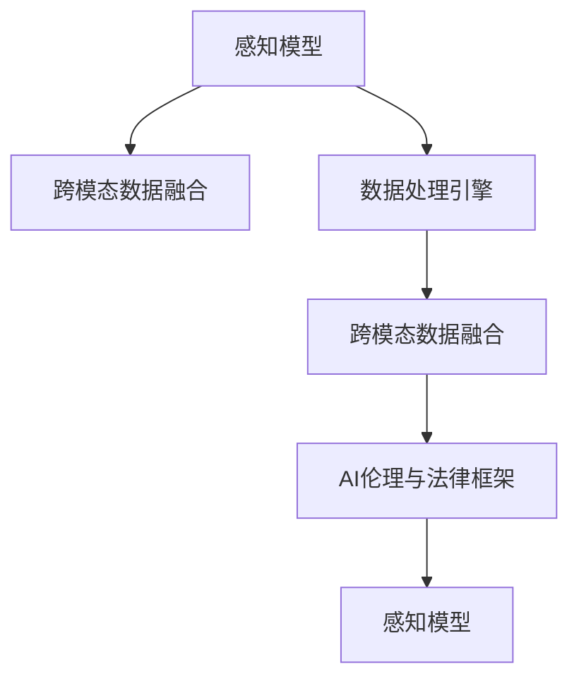

                 

# 数字化感知扩展：AI创造的新感官维度

## 1. 背景介绍

### 1.1 问题由来

数字化时代的快速发展，极大地改变了人类感知世界的维度。从虚拟现实（VR）到增强现实（AR），从物联网（IoT）到智慧城市，AI技术的日益成熟，使得人类能够以前所未有的方式扩展感知世界的能力。数字化感知不仅仅是单一技术的堆叠，更是跨领域、多技术融合的产物。

AI技术的发展，尤其是深度学习和大数据技术的结合，使数字化感知具备了强大的数据处理能力。通过算法模型，数字化感知技术可以自动化处理海量数据，进行模式识别和决策，从而提升人类感知世界的精确度和效率。然而，尽管数字化感知技术在许多领域取得了显著进展，但仍然面临诸多挑战。这些挑战不仅包括技术层面的瓶颈，还包括伦理道德、隐私保护等方面的考量。

### 1.2 问题核心关键点

数字化感知的核心关键点在于：如何通过AI技术，扩展人类的感知维度，提升感知效率，并同时确保数据安全和伦理道德的遵守。这涉及到技术、伦理、法律等多个层面，需要在多方利益之间找到平衡。

技术上，数字化感知需要解决的核心问题包括：

- 跨模态数据的融合：如何有效地将不同模态的数据（如视觉、听觉、触觉等）进行整合，形成统一的感知模型。
- 高效的数据处理：如何通过算法优化，提高数据处理的速度和效率，实现实时处理。
- 可解释性和透明性：如何让AI系统的决策过程可解释，提高系统的可信度。

伦理和法律方面，数字化感知需要：

- 保障用户隐私：如何保护用户数据，防止数据泄露和滥用。
- 遵守伦理道德规范：如何在技术应用中遵循道德准则，避免算法偏见和歧视。
- 构建法规框架：如何制定法规，规范数字化感知技术的应用，确保其安全和合规。

## 2. 核心概念与联系

### 2.1 核心概念概述

为更好地理解数字化感知的实现原理和技术架构，本节将介绍几个关键概念：

- **感知模型（Perception Model）**：用于将多模态数据进行融合，形成统一的感知表示的模型。感知模型可以是深度神经网络、物理模型等，通过算法优化和训练，能够高效地处理各种数据。
- **跨模态数据融合（Cross-modal Data Fusion）**：将不同模态的数据进行整合，形成统一的感知模型。跨模态数据融合是数字化感知的重要环节，可以显著提升感知效果。
- **数据处理引擎（Data Processing Engine）**：用于高效处理大量数据，进行模式识别和决策的计算引擎。数据处理引擎可以是分布式计算框架（如Hadoop、Spark），也可以是专门设计的硬件加速器。
- **AI伦理与法律框架（AI Ethics and Legal Framework）**：确保数字化感知技术在应用过程中遵循道德和法律规范，保护用户隐私，防止算法偏见和滥用。

这些核心概念之间的逻辑关系可以通过以下Mermaid流程图来展示：



这个流程图展示了大语言模型微调的各个核心概念及其之间的关系：

1. 感知模型通过跨模态数据融合，形成统一的感知表示。
2. 感知模型与数据处理引擎相结合，高效处理数据。
3. AI伦理与法律框架确保技术应用过程中遵循道德和法律规范。

## 3. 核心算法原理 & 具体操作步骤

### 3.1 算法原理概述

数字化感知的核心算法包括跨模态数据融合、数据处理和感知模型训练等。其中，跨模态数据融合是关键环节，通过将不同模态的数据进行有效整合，形成统一的感知表示。

### 3.2 算法步骤详解

**Step 1: 数据预处理**

数据预处理是数字化感知的第一步。需要将不同模态的数据进行清洗、归一化、特征提取等操作，以便后续的融合和处理。例如，对于图像数据，需要进行去噪、裁剪、缩放等预处理；对于文本数据，需要进行分词、去停用词等处理。

**Step 2: 跨模态数据融合**

跨模态数据融合是数字化感知的核心步骤。目前，常用的跨模态数据融合方法包括特征匹配、集成学习、深度学习等。深度学习方法是其中最先进的方法，通过神经网络模型，可以实现高效的数据融合。

**Step 3: 感知模型训练**

感知模型的训练分为两个阶段：预训练和微调。预训练阶段通过大规模数据进行训练，获得初步的感知能力。微调阶段通过特定的任务数据进行训练，调整感知模型，使其适应具体的感知任务。

### 3.3 算法优缺点

数字化感知的算法具有以下优点：

- 强大的跨模态数据融合能力：通过深度学习等先进方法，能够高效地将不同模态的数据进行融合，形成统一的感知表示。
- 高效的数据处理能力：通过数据处理引擎，可以高效地处理海量数据，进行模式识别和决策。
- 广泛的适用性：数字化感知技术可以应用于多个领域，如医疗、交通、娱乐等，具有广泛的应用前景。

同时，该算法也存在以下缺点：

- 高昂的计算成本：深度学习模型的训练需要大量的计算资源，训练时间较长。
- 数据依赖性强：感知模型的训练和优化高度依赖于高质量、多样化的数据，数据获取和标注成本较高。
- 可解释性不足：深度学习模型通常被视为“黑箱”，难以解释其内部决策过程。

### 3.4 算法应用领域

数字化感知技术已经广泛应用于多个领域，具体包括：

- 医疗领域：通过跨模态数据融合，提升诊断和治疗的准确性。例如，将医学影像与临床数据结合，实现更精准的诊断。
- 交通领域：通过感知模型和数据处理引擎，优化交通流量管理。例如，通过实时监控交通数据，优化信号灯控制。
- 娱乐领域：通过虚拟现实（VR）和增强现实（AR）技术，提供沉浸式体验。例如，游戏、电影等娱乐应用中，通过跨模态数据融合，提升用户体验。
- 工业领域：通过物联网（IoT）设备，实时监控生产过程。例如，在制造业中，通过传感器数据和图像数据的融合，实现设备状态监测和故障预测。
- 教育领域：通过数字化感知技术，提供个性化教育服务。例如，智能教育系统通过感知学生的行为数据，提供个性化的学习建议。

## 4. 数学模型和公式 & 详细讲解 & 举例说明

### 4.1 数学模型构建

本节将使用数学语言对数字化感知的核心算法进行更加严格的刻画。

假设输入数据的模态数为 $M$，每个模态的特征维度为 $D_m$，则输入数据的总维度为 $D=D_1+D_2+...+D_M$。设 $X^{(m)}\in \mathbb{R}^{N\times D_m}$ 为第 $m$ 个模态的数据矩阵，其中 $N$ 为样本数量。

定义跨模态数据融合函数 $F: \mathbb{R}^{D_1}\times\mathbb{R}^{D_2}\times...\times\mathbb{R}^{D_M} \rightarrow \mathbb{R}^D$，用于将不同模态的数据进行融合。

感知模型的训练目标为最小化预测误差：

$$
\min_{\theta} \sum_{i=1}^N \sum_{m=1}^M \ell(X^{(m)}_i, \hat{Y}^{(m)}_i) + \lambda ||\theta||^2
$$

其中，$\ell$ 为损失函数，$\hat{Y}^{(m)}_i$ 为模型预测的第 $m$ 个模态的输出，$\theta$ 为感知模型的参数，$\lambda$ 为正则化系数。

### 4.2 公式推导过程

以跨模态数据融合函数 $F$ 为例，推导其优化目标和优化方法。

设 $W_m\in \mathbb{R}^{D_m\times D}$ 为第 $m$ 个模态的权重矩阵，$b_m\in \mathbb{R}^D$ 为偏置向量。则跨模态数据融合函数 $F$ 可以表示为：

$$
F(X^{(1)},X^{(2)},...,X^{(M)}) = \sigma(W_1X^{(1)} + W_2X^{(2)} + ... + W_MX^{(M)} + b)
$$

其中，$\sigma$ 为激活函数，如ReLU、Sigmoid等。

为了最小化感知模型的预测误差，需要求解感知模型参数 $\theta$，即求解：

$$
\min_{\theta} \sum_{i=1}^N \sum_{m=1}^M \ell(X^{(m)}_i, \hat{Y}^{(m)}_i)
$$

其中，$\hat{Y}^{(m)}_i = \sigma(W_mX^{(m)}_i + b_m)$。

根据梯度下降算法，求解感知模型参数 $\theta$ 的更新公式为：

$$
\theta \leftarrow \theta - \eta \frac{\partial \mathcal{L}}{\partial \theta}
$$

其中，$\eta$ 为学习率，$\mathcal{L}$ 为感知模型的损失函数。

### 4.3 案例分析与讲解

以医疗领域为例，说明数字化感知技术的应用。

假设有一个病患，其心电图（ECG）、影像（X-ray）和血液检验（Lab test）数据需要通过数字化感知技术进行整合，以辅助诊断。

首先，对三种模态的数据进行预处理，包括去噪、归一化等操作。然后，通过跨模态数据融合函数 $F$ 将三种模态的数据进行融合，形成一个综合的感知表示。最后，将感知表示输入到感知模型中，通过训练得到诊断结果。

## 5. 项目实践：代码实例和详细解释说明

### 5.1 开发环境搭建

在进行数字化感知技术开发前，我们需要准备好开发环境。以下是使用Python进行TensorFlow开发的环境配置流程：

1. 安装Anaconda：从官网下载并安装Anaconda，用于创建独立的Python环境。

2. 创建并激活虚拟环境：
```bash
conda create -n tensorflow-env python=3.8 
conda activate tensorflow-env
```

3. 安装TensorFlow：根据CUDA版本，从官网获取对应的安装命令。例如：
```bash
conda install tensorflow tensorflow-gpu -c conda-forge -c pytorch -c pypi -c nvidia
```

4. 安装各类工具包：
```bash
pip install numpy pandas scikit-learn matplotlib tqdm jupyter notebook ipython
```

完成上述步骤后，即可在`tensorflow-env`环境中开始数字化感知技术的开发。

### 5.2 源代码详细实现

这里我们以医疗领域的跨模态数据融合为例，给出使用TensorFlow实现跨模态数据融合的代码实现。

首先，定义输入数据的维度和权重矩阵：

```python
import tensorflow as tf

# 定义输入数据的维度
D_1, D_2, D_3 = 128, 128, 128
D = D_1 + D_2 + D_3

# 定义权重矩阵
W_1 = tf.Variable(tf.random.normal([D_1, D]))
W_2 = tf.Variable(tf.random.normal([D_2, D]))
W_3 = tf.Variable(tf.random.normal([D_3, D]))

b = tf.Variable(tf.zeros([D]))

# 定义跨模态数据融合函数
def fusion(X_1, X_2, X_3):
    return tf.sigmoid(tf.matmul(X_1, W_1) + tf.matmul(X_2, W_2) + tf.matmul(X_3, W_3) + b)
```

然后，加载数据并进行预处理：

```python
# 加载数据
X_1 = ... # 心电图数据
X_2 = ... # 影像数据
X_3 = ... # 血液检验数据

# 数据预处理
X_1 = tf.reshape(X_1, [N, D_1])
X_2 = tf.reshape(X_2, [N, D_2])
X_3 = tf.reshape(X_3, [N, D_3])

# 归一化
X_1 = X_1 / tf.norm(X_1, axis=1, keepdims=True)
X_2 = X_2 / tf.norm(X_2, axis=1, keepdims=True)
X_3 = X_3 / tf.norm(X_3, axis=1, keepdims=True)
```

接着，执行跨模态数据融合和感知模型训练：

```python
# 执行跨模态数据融合
F = fusion(X_1, X_2, X_3)

# 定义感知模型的输出
Y_hat = tf.nn.sigmoid(F)

# 定义损失函数和优化器
loss = tf.losses.mean_squared_error(Y_true, Y_hat)
optimizer = tf.optimizers.Adam(learning_rate=0.001)

# 定义训练循环
@tf.function
def train_step(X_1, X_2, X_3, Y_true):
    with tf.GradientTape() as tape:
        Y_hat = tf.nn.sigmoid(fusion(X_1, X_2, X_3))
        loss = tf.losses.mean_squared_error(Y_true, Y_hat)
    gradients = tape.gradient(loss, [W_1, W_2, W_3, b])
    optimizer.apply_gradients(zip(gradients, [W_1, W_2, W_3, b]))

# 训练感知模型
N_epochs = 100
for epoch in range(N_epochs):
    for i in range(len(X_1)):
        train_step(X_1[i], X_2[i], X_3[i], Y_true[i])
```

以上就是使用TensorFlow对跨模态数据融合进行实现的完整代码。可以看到，TensorFlow提供了丰富的API，使得模型构建和训练变得更加简洁和高效。

### 5.3 代码解读与分析

让我们再详细解读一下关键代码的实现细节：

**数据预处理**：
- 对心电图、影像和血液检验数据进行归一化处理，以保证各模态数据具有相似的特征尺度。

**跨模态数据融合函数**：
- 定义了三个权重矩阵 $W_1, W_2, W_3$ 和偏置向量 $b$，用于将三种模态的数据进行融合。
- 使用sigmoid函数作为激活函数，将融合后的数据映射到 $[0, 1]$ 区间，作为感知模型的输出。

**感知模型训练**：
- 定义感知模型的输出 $Y_hat$，使用均方误差损失函数计算预测误差。
- 使用Adam优化器进行模型训练，通过梯度下降更新模型参数。
- 使用tf.function进行性能优化，提升模型训练的速度。

**训练循环**：
- 定义训练循环，每次迭代使用一批数据进行训练，更新模型参数。
- 重复训练循环，直到达到预设的epoch数或训练误差收敛。

可以看到，TensorFlow提供了丰富的API，使得数字化感知技术的开发变得更加高效和简洁。开发者可以将更多精力放在数据处理和模型优化上，而不必过多关注底层的实现细节。

## 6. 实际应用场景

### 6.1 医疗诊断

在医疗领域，数字化感知技术可以应用于诊断和决策支持。通过跨模态数据融合和感知模型的训练，可以提升诊断的准确性和效率。

例如，在肿瘤检测中，通过融合医学影像、基因数据和临床数据，可以更准确地诊断肿瘤类型和分期。在放射学中，通过融合CT影像和MRI影像，可以更精确地进行病变分析。

### 6.2 智能家居

在智能家居领域，数字化感知技术可以实现更智能的家居管理。通过融合传感器数据、语音指令和视觉信息，可以提供更个性化和智能化的服务。

例如，通过语音助手和视觉识别技术，可以实现智能照明、智能空调等家居设备的自动化控制。通过传感器数据和行为分析，可以实现健康监测和能源管理。

### 6.3 智能交通

在智能交通领域，数字化感知技术可以实现更高效的交通管理和决策支持。通过融合车辆数据、道路数据和气象数据，可以实现智能交通流量管理、路径规划等。

例如，通过实时监控交通数据，可以实现智能信号灯控制，优化交通流量。通过融合气象数据和路况数据，可以实现智能导航和路径规划。

### 6.4 未来应用展望

随着技术的不断发展，数字化感知技术将会在更多领域得到应用，为人类生产生活带来新的变革。

- 智能制造：通过融合传感器数据和机器视觉，可以实现智能制造和设备状态监测。例如，在制造工厂中，通过跨模态数据融合，可以实现设备故障预测和预防性维护。
- 智慧农业：通过融合传感器数据和图像数据，可以实现智能农业管理和精准农业。例如，通过传感器数据和图像识别，可以实现土壤监测和作物生长分析。
- 智慧城市：通过融合城市数据和物联网设备，可以实现智慧城市管理和公共服务。例如，通过实时监控城市数据，可以实现智能垃圾回收和公共设施管理。

## 7. 工具和资源推荐

### 7.1 学习资源推荐

为了帮助开发者系统掌握数字化感知的理论基础和实践技巧，这里推荐一些优质的学习资源：

1. 《深度学习》系列书籍：由深度学习领域的知名专家撰写，全面介绍深度学习的基本概念和核心算法。
2. 《TensorFlow官方文档》：TensorFlow官方提供的详细文档，包含大量的API和示例代码。
3. 《跨模态学习与数据融合》课程：斯坦福大学开设的跨模态学习课程，涵盖跨模态学习的基本概念和核心算法。
4. 《医疗数据分析》课程：Coursera提供的医疗数据分析课程，涵盖医疗数据预处理、分析方法和应用案例。
5. 《智慧城市》课程：Coursera提供的智慧城市课程，涵盖智慧城市的基本概念和核心技术。

通过对这些资源的学习实践，相信你一定能够快速掌握数字化感知的精髓，并用于解决实际的感知问题。

### 7.2 开发工具推荐

高效的开发离不开优秀的工具支持。以下是几款用于数字化感知开发的常用工具：

1. TensorFlow：由Google主导开发的开源深度学习框架，生产部署方便，适合大规模工程应用。提供丰富的API和算法库，支持跨模态数据融合和感知模型训练。
2. PyTorch：基于Python的开源深度学习框架，灵活动态的计算图，适合快速迭代研究。支持高效的深度学习模型构建和训练。
3. Weights & Biases：模型训练的实验跟踪工具，可以记录和可视化模型训练过程中的各项指标，方便对比和调优。与主流深度学习框架无缝集成。
4. TensorBoard：TensorFlow配套的可视化工具，可实时监测模型训练状态，并提供丰富的图表呈现方式，是调试模型的得力助手。
5. Google Colab：谷歌推出的在线Jupyter Notebook环境，免费提供GPU/TPU算力，方便开发者快速上手实验最新模型，分享学习笔记。

合理利用这些工具，可以显著提升数字化感知技术的开发效率，加快创新迭代的步伐。

### 7.3 相关论文推荐

数字化感知技术的发展源于学界的持续研究。以下是几篇奠基性的相关论文，推荐阅读：

1. Deep Cross-Modal Feature Fusion for Content-Aware Image Retargeting：提出了一种基于CNN的跨模态特征融合方法，用于图像调整和视频编辑。
2. Multi-Modal Fusion Framework for Cross-modal Image Quality Enhancement：提出了一种基于深度学习的跨模态数据融合框架，用于图像质量增强。
3. Learning Hierarchical Cross-Modal Representations with Multi-Task Deep Neural Networks：提出了一种多任务深度学习框架，用于跨模态数据融合和表示学习。
4. Multimodal Fusion for Robust Image and Video Retrieval：提出了一种基于CNN和LSTM的跨模态数据融合方法，用于图像和视频检索。
5. Bridging the Gap between Multi-modal Data Fusion and Multi-modal Recommendation Systems：提出了一种基于深度学习的跨模态推荐方法，用于个性化推荐。

这些论文代表了大语言模型微调技术的发展脉络。通过学习这些前沿成果，可以帮助研究者把握学科前进方向，激发更多的创新灵感。

## 8. 总结：未来发展趋势与挑战

### 8.1 总结

本文对数字化感知扩展技术进行了全面系统的介绍。首先阐述了数字化感知的背景和意义，明确了技术在多模态数据融合和感知模型训练方面的独特价值。其次，从原理到实践，详细讲解了数字化感知的数学模型和操作步骤，给出了代码实现的完整示例。同时，本文还广泛探讨了数字化感知技术在医疗、智能家居、智能交通等多个行业领域的应用前景，展示了数字化感知技术的广阔前景。此外，本文精选了数字化感知的各类学习资源，力求为读者提供全方位的技术指引。

通过本文的系统梳理，可以看到，数字化感知技术正在成为跨模态数据融合和感知模型训练的重要范式，极大地拓展了人类感知世界的维度，提升感知效率。未来，伴随技术的不断发展，数字化感知技术必将带来更多创新应用，推动社会生产生活的进步。

### 8.2 未来发展趋势

展望未来，数字化感知技术将呈现以下几个发展趋势：

1. 多模态数据融合能力提升：未来的感知模型将具备更强大的跨模态数据融合能力，能够高效地整合多种模态的数据，形成统一的感知表示。
2. 高效的数据处理引擎：未来的数据处理引擎将具备更强的计算能力和分布式处理能力，能够高效地处理海量数据，进行模式识别和决策。
3. 更强的感知模型训练算法：未来的感知模型将使用更先进的算法进行训练，能够更好地利用数据，提升感知模型的泛化能力和性能。
4. 更广泛的应用领域：未来的数字化感知技术将拓展到更多领域，如智能制造、智慧农业、智慧城市等，为各行各业带来新的变革。
5. 更高的可靠性和安全性：未来的数字化感知技术将更加注重可靠性和安全性，确保数据的安全性和系统的可信度。

以上趋势凸显了数字化感知技术的广阔前景。这些方向的探索发展，必将进一步提升数字化感知的性能和应用范围，为人类认知智能的进化带来深远影响。

### 8.3 面临的挑战

尽管数字化感知技术已经取得了显著进展，但在迈向更加智能化、普适化应用的过程中，仍面临诸多挑战：

1. 数据获取和标注成本高：高质量、多样化的数据获取和标注成本较高，特别是在医疗、智能家居等垂直领域，数据获取难度更大。
2. 数据隐私和安全问题：大规模数据的存储和使用带来了数据隐私和安全问题，需要建立更完善的数据保护机制。
3. 算法偏见和歧视问题：数字化感知技术可能存在算法偏见和歧视问题，需要采取措施消除偏见，确保公平性。
4. 跨模态数据融合难度大：不同模态数据的融合难度较大，需要更先进的算法和模型架构。
5. 系统可解释性不足：数字化感知系统通常被视为“黑箱”，难以解释其内部决策过程，需要加强系统可解释性和透明性。

正视数字化感知面临的这些挑战，积极应对并寻求突破，将是大语言模型微调走向成熟的必由之路。相信随着学界和产业界的共同努力，这些挑战终将一一被克服，数字化感知技术必将在构建人机协同的智能时代中扮演越来越重要的角色。

### 8.4 未来突破

面对数字化感知面临的种种挑战，未来的研究需要在以下几个方面寻求新的突破：

1. 探索更高效的数据获取和标注方法：利用自动标注、弱监督学习等技术，降低数据获取和标注成本。
2. 开发更强大的跨模态数据融合算法：利用深度学习、图神经网络等先进算法，提升跨模态数据融合的准确性和效率。
3. 引入更多的先验知识：将符号化的先验知识，如知识图谱、逻辑规则等，与神经网络模型进行巧妙融合，引导感知模型的训练过程。
4. 结合因果分析和博弈论工具：利用因果分析方法和博弈论工具，增强系统的可靠性和安全性。
5. 增强系统的可解释性和透明性：利用解释性算法和可视化工具，增强系统的可解释性和透明性，确保系统的可信度。

这些研究方向的探索，必将引领数字化感知技术迈向更高的台阶，为构建安全、可靠、可解释、可控的智能系统铺平道路。面向未来，数字化感知技术还需要与其他人工智能技术进行更深入的融合，如知识表示、因果推理、强化学习等，多路径协同发力，共同推动自然语言理解和智能交互系统的进步。只有勇于创新、敢于突破，才能不断拓展感知模型的边界，让智能技术更好地造福人类社会。

## 9. 附录：常见问题与解答

**Q1：数字化感知技术能否应用到医疗领域？**

A: 是的，数字化感知技术可以广泛应用于医疗领域。通过跨模态数据融合和感知模型的训练，可以提升诊断的准确性和效率。例如，在肿瘤检测中，通过融合医学影像、基因数据和临床数据，可以更准确地诊断肿瘤类型和分期。

**Q2：数据隐私和安全问题如何解决？**

A: 为了保护用户数据，需要建立完善的数据保护机制。这包括数据加密、匿名化处理、访问控制等措施。在数据使用过程中，需要严格限制数据的使用范围和权限，确保数据的安全性和隐私性。

**Q3：如何避免算法偏见和歧视？**

A: 避免算法偏见和歧视，需要采用多样化的数据集进行训练，确保数据集的多样性和代表性。同时，在模型训练和部署过程中，需要进行公平性评估和测试，及时发现和纠正偏见和歧视问题。

**Q4：如何提高系统的可解释性？**

A: 提高系统的可解释性，可以通过可视化工具和解释性算法，对系统的决策过程进行可视化展示，确保系统的透明性和可信度。例如，利用LIME、SHAP等工具，可以生成系统的局部可解释性模型，帮助理解系统的决策逻辑。

**Q5：数字化感知技术的应用前景如何？**

A: 数字化感知技术具有广泛的应用前景。除了医疗、智能家居、智能交通等传统领域，未来还将拓展到智能制造、智慧农业、智慧城市等更多领域。通过跨模态数据融合和感知模型的训练，可以提升各领域的信息处理和决策能力。

通过本文的系统梳理，可以看到，数字化感知技术正在成为跨模态数据融合和感知模型训练的重要范式，极大地拓展了人类感知世界的维度，提升感知效率。未来，伴随技术的不断发展，数字化感知技术必将带来更多创新应用，推动社会生产生活的进步。

