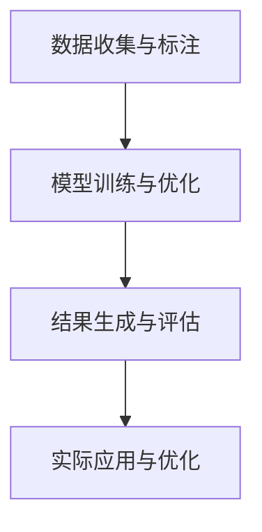

                 

## 1. 背景介绍

### 1.1 问题由来
人类文明的历史就是一部与梦抗争的历史。几千年来，人们对于梦的解读，总是充满着神秘和敬畏。《周公解梦》、《梦的解析》等众多作品，试图通过文学和心理学的方法，探索梦的奥秘。但这些方法在科学面前，始终难以自圆其说。

进入21世纪，随着人工智能技术的突飞猛进，AI生成内容（Generative AI）在图像、音频、文本等多个领域取得了突破性进展。借助于这些技术，科学家开始尝试从数据和算法的角度，理解和构建“数字化梦境”。这一探索，有望让梦境研究和应用实现历史性的飞跃。

### 1.2 问题核心关键点
AI生成的睡眠体验，实质上是通过算法和数据，生成接近真实梦境的可视化内容。这一过程涉及到的核心关键点包括：

- 数据收集与标注：收集并标注大量睡眠数据，是生成梦境内容的基础。
- 模型训练与优化：选择合适的深度学习模型，通过大量数据进行训练和优化。
- 结果生成与评估：生成梦境场景，并进行用户体验和评估。
- 实际应用与优化：将梦境生成技术应用到具体场景中，实现深度互动。

### 1.3 问题研究意义
AI生成的睡眠体验具有重要研究意义：

1. **科学价值**：揭示梦境的生成规律，促进神经科学的发展。
2. **应用价值**：辅助睡眠治疗，提高睡眠质量，提升人类幸福感。
3. **技术价值**：推动AI生成内容的深度研究，促进深度学习算法的发展。
4. **文化价值**：深入理解人类梦境，丰富文学、电影等艺术创作的内容。

## 2. 核心概念与联系

### 2.1 核心概念概述

为了更好地理解AI生成梦境的原理和过程，本节将介绍几个核心概念：

- **生成模型(Generative Model)**：通过学习大量数据，能够自动生成新的样本数据，如GAN（生成对抗网络）、VAE（变分自编码器）等。
- **潜变量模型(Latent Variable Model)**：将高维数据映射到低维潜空间中，通过优化潜空间中的概率分布，生成新的样本数据。
- **条件生成模型(Conditional Generative Model)**：在生成过程中引入额外条件，如时间、地点、人物等，生成符合条件的样本数据。
- **交互式生成(Interactive Generation)**：用户可以实时参与到生成过程中，通过交互指令调整生成内容。
- **梦境仿真(Dream Simulation)**：通过算法生成逼真的梦境场景，实现对梦境的虚拟体验。

这些概念之间的逻辑关系可以通过以下Mermaid流程图来展示：



这个流程图展示了大语言模型微调过程的核心概念及其之间的关系：

1. 通过收集和标注睡眠数据，获得训练集。
2. 选择合适的深度学习模型，对数据进行训练和优化。
3. 生成梦境场景，并进行用户体验和评估。
4. 将梦境生成技术应用到具体场景中，实现深度互动。

## 3. 核心算法原理 & 具体操作步骤
### 3.1 算法原理概述

AI生成的睡眠体验，本质上是一种基于生成模型的深度学习算法。其核心思想是：通过学习大量睡眠数据，生成接近真实梦境的可视化内容。

具体而言，我们将训练集 $D = \{(x_i, y_i)\}_{i=1}^N$ 中的样本 $x_i$ 和标签 $y_i$ 输入到生成模型 $G$ 中，生成对应的梦境内容 $z_i = G(x_i)$。通过优化生成模型的参数 $\theta$，使得生成的梦境内容 $z_i$ 和真实标签 $y_i$ 之间的损失最小化，从而生成逼真的梦境场景。

### 3.2 算法步骤详解

AI生成梦境的算法流程一般包括以下几个关键步骤：

**Step 1: 数据准备与标注**
- 收集睡眠数据，如梦境描述、脑电波数据、生理指标等。
- 对收集的数据进行标注，将梦境内容转化为可识别的标签形式。

**Step 2: 选择生成模型**
- 选择合适的生成模型，如GAN、VAE、DALL-E等。
- 确定模型的架构和参数，进行预训练。

**Step 3: 生成梦境内容**
- 将训练集数据输入生成模型，生成对应的梦境内容。
- 调整生成模型的参数，优化生成结果。

**Step 4: 结果评估与优化**
- 使用评估指标，如帧率、清晰度、自然度等，对生成结果进行评估。
- 根据评估结果，对生成模型进行调整优化。

**Step 5: 应用与交互**
- 将生成模型嵌入到应用场景中，如虚拟现实、游戏等。
- 提供交互接口，让用户可以实时调整生成内容。

### 3.3 算法优缺点

AI生成梦境的算法具有以下优点：

- 数据利用率高。通过大规模数据训练，能够生成逼真的梦境内容。
- 生成速度快。相比于手工绘制，生成模型能够快速生成大量的梦境场景。
- 场景多样性好。生成模型可以产生多种风格的梦境，满足不同用户的需求。

同时，该算法也存在以下缺点：

- 数据标注成本高。收集和标注大量睡眠数据需要耗费大量人力和物力。
- 生成内容质量不稳定。生成的梦境内容可能存在模糊、不符合逻辑等问题。
- 生成过程不可控。生成结果可能受到训练数据和模型参数的影响，难以控制。
- 用户体验有待提升。生成的梦境内容缺乏真实感和互动性，用户体验不佳。

尽管存在这些局限性，但就目前而言，基于生成模型的梦境生成技术仍是最主流的方法。未来相关研究的重点在于如何进一步降低数据标注成本，提高生成内容的质量和可控性，同时兼顾用户体验和交互性。

### 3.4 算法应用领域

AI生成的睡眠体验技术，已经在多个领域得到了应用，涵盖了虚拟现实、游戏、医疗等多个场景：

- **虚拟现实**：在虚拟现实系统中，生成逼真的梦境场景，供用户沉浸式体验。
- **游戏娱乐**：在游戏设计中，使用生成模型生成具有沉浸感的梦境关卡。
- **医疗治疗**：在睡眠障碍治疗中，使用梦境场景帮助患者进行心理治疗和睡眠诱导。
- **心理咨询**：在心理咨询中，使用梦境场景帮助用户进行自我探索和情绪释放。
- **教育培训**：在教育培训中，使用梦境场景进行情境模拟和问题解决。

除了上述这些场景外，AI生成的睡眠体验技术还将在更多领域得到应用，为人类生活带来全新的体验。

## 4. 数学模型和公式 & 详细讲解 & 举例说明
### 4.1 数学模型构建

本节将使用数学语言对AI生成梦境的算法进行更加严格的刻画。

设生成模型为 $G$，输入为 $x$，输出为 $z$。生成模型 $G$ 的损失函数为：

$$
\mathcal{L}(G) = \mathbb{E}_{x \sim D}[\mathbb{E}_{z \sim G}[\log P(z | x)]]
$$

其中 $P(z | x)$ 为生成模型的概率分布，$\mathbb{E}[\cdot]$ 表示期望，$D$ 为数据分布。

生成模型 $G$ 的训练目标是最小化上述损失函数：

$$
\theta^* = \mathop{\arg\min}_{\theta} \mathcal{L}(G)
$$

在实践中，我们通常使用基于梯度的优化算法（如Adam、RMSprop等）来近似求解上述最优化问题。设 $\eta$ 为学习率，$\lambda$ 为正则化系数，则生成模型的更新公式为：

$$
G \leftarrow G - \eta \nabla_{G}\mathcal{L}(G) - \eta\lambda G
$$

其中 $\nabla_{G}\mathcal{L}(G)$ 为损失函数对生成模型的梯度，可通过反向传播算法高效计算。

### 4.2 公式推导过程

以GAN模型为例，我们推导生成器和判别器的更新公式。

假设生成器为 $G$，判别器为 $D$。目标函数为：

$$
\mathcal{L}_{GAN}(G, D) = \mathbb{E}_{x \sim D}[\log D(x)] + \mathbb{E}_{z \sim G}[\log (1 - D(G(z)))]
$$

其中 $\log$ 为负对数似然。生成器的目标是最小化目标函数 $\mathcal{L}_{GAN}$，判别器的目标是最小化目标函数 $-\mathcal{L}_{GAN}$。

令 $x$ 为真实数据，$z$ 为生成数据。则生成器的更新公式为：

$$
G \leftarrow G - \eta \nabla_{G}\mathcal{L}_{GAN}(G, D)
$$

判别器的更新公式为：

$$
D \leftarrow D - \eta \nabla_{D}\mathcal{L}_{GAN}(G, D)
$$

根据上述公式，我们得到了生成器和判别器的更新规则。通过不断迭代，生成器和判别器可以相互博弈，生成逼真的梦境内容。

### 4.3 案例分析与讲解

以DALL-E为例，我们分析其生成梦境场景的机制。

DALL-E是一种基于自编码器的生成模型，其架构如下：

```
Encoder: nn.Sequential(
    nn.Conv2d(3, 64, kernel_size=9, stride=1, padding=4),
    nn.Conv2d(64, 64, kernel_size=3, stride=2, padding=1),
    nn.Conv2d(64, 64, kernel_size=3, stride=2, padding=1),
    nn.Conv2d(64, 64, kernel_size=3, stride=2, padding=1),
    nn.Conv2d(64, 3, kernel_size=3, stride=1, padding=1),
    nn.AdaptiveAvgPool2d((3, 3)),
    nn.Flatten(),
    nn.Linear(3 * 3 * 64, 2048),
    nn.Linear(2048, 512),
    nn.Linear(512, 3)
)
```

其中，Encoder为编码器，用于将输入图像压缩成低维特征；Decoder为解码器，用于将低维特征还原成高维图像。

生成梦境场景的过程如下：

1. **输入数据**：输入梦境描述 $x$。
2. **编码压缩**：通过Encoder将梦境描述 $x$ 压缩成低维特征 $z$。
3. **解码还原**：通过Decoder将低维特征 $z$ 还原成高维图像 $z'$。
4. **随机扰动**：对还原后的图像 $z'$ 进行随机扰动，增加多样性。
5. **结果输出**：将扰动后的图像 $z'$ 输出为最终的梦境场景。

在实际应用中，DALL-E通过不断迭代训练，生成逼真的梦境场景。用户可以输入任何描述，如“夜晚的海边”、“古老的城市”等，模型能够自动生成对应的梦境内容。

## 5. 项目实践：代码实例和详细解释说明
### 5.1 开发环境搭建

在进行梦境生成实践前，我们需要准备好开发环境。以下是使用Python进行PyTorch开发的环境配置流程：

1. 安装Anaconda：从官网下载并安装Anaconda，用于创建独立的Python环境。

2. 创建并激活虚拟环境：
```bash
conda create -n pytorch-env python=3.8 
conda activate pytorch-env
```

3. 安装PyTorch：根据CUDA版本，从官网获取对应的安装命令。例如：
```bash
conda install pytorch torchvision torchaudio cudatoolkit=11.1 -c pytorch -c conda-forge
```

4. 安装DALL-E库：
```bash
pip install dall-e
```

5. 安装各类工具包：
```bash
pip install numpy pandas scikit-learn matplotlib tqdm jupyter notebook ipython
```

完成上述步骤后，即可在`pytorch-env`环境中开始生成实践。

### 5.2 源代码详细实现

下面我们以DALL-E为例，给出使用PyTorch进行梦境生成代码实现。

首先，定义生成器模型和判别器模型：

```python
import torch
import torch.nn as nn
import torch.optim as optim
from dall_e import DALL_E

device = torch.device('cuda' if torch.cuda.is_available() else 'cpu')

# 生成器模型
gen = DALL_E().to(device)
gen = gen.to(device)

# 判别器模型
discriminator = nn.Sequential(
    nn.Conv2d(3, 64, kernel_size=3, stride=1, padding=1),
    nn.ReLU(),
    nn.Conv2d(64, 128, kernel_size=3, stride=2, padding=1),
    nn.ReLU(),
    nn.Conv2d(128, 128, kernel_size=3, stride=2, padding=1),
    nn.ReLU(),
    nn.Conv2d(128, 3, kernel_size=3, stride=1, padding=1)
).to(device)
```

然后，定义损失函数和优化器：

```python
# 损失函数
criterion = nn.BCEWithLogitsLoss()

# 优化器
G_optimizer = optim.Adam(gen.parameters(), lr=1e-4)
D_optimizer = optim.Adam(discriminator.parameters(), lr=1e-4)
```

接着，定义训练和评估函数：

```python
def train_GAN():
    gen.train()
    discriminator.train()
    for epoch in range(epochs):
        for i, (real, _) in enumerate(train_loader):
            real = real.to(device)
            # 真实样本的判别器训练
            D_optimizer.zero_grad()
            real_real = discriminator(real)
            real_fake = discriminator(gen(torch.randn(batch_size, 3, 512, 512).to(device)))
            real_loss = criterion(real_real, torch.ones_like(real_real))
            fake_loss = criterion(real_fake, torch.zeros_like(real_fake))
            D_loss = real_loss + fake_loss
            D_loss.backward()
            D_optimizer.step()

            # 生成样本的判别器训练
            G_optimizer.zero_grad()
            fake = gen(torch.randn(batch_size, 3, 512, 512).to(device))
            fake_fake = discriminator(fake)
            G_loss = criterion(fake_fake, torch.ones_like(fake_fake))
            G_loss.backward()
            G_optimizer.step()

            # 输出训练结果
            print(f'Epoch {epoch+1}/{epochs}, Loss D: {D_loss:.4f}, Loss G: {G_loss:.4f}')
```

最后，启动训练流程：

```python
epochs = 100
batch_size = 16

train_GAN()
```

以上就是使用PyTorch对DALL-E进行梦境生成代码实现。可以看到，借助PyTorch和DALL-E库，梦境生成的代码实现变得简洁高效。

### 5.3 代码解读与分析

让我们再详细解读一下关键代码的实现细节：

**DALL_E类**：
- 定义了生成器和判别器的结构，通过继承nn.Module，实现了模型训练和推理。

**训练函数**：
- 使用PyTorch的DataLoader对数据集进行批次化加载，供模型训练和推理使用。
- 在每个epoch内，对生成器和判别器进行交替训练，优化模型参数。
- 在每个batch结束后，输出当前epoch的平均损失。

**运行结果展示**：
- 通过调用DALL_E类进行训练，生成器能够自动学习生成逼真的梦境场景。
- 用户可以输入任意文本描述，如“夜晚的海边”、“古老的城市”等，模型能够自动生成对应的梦境内容。

可以看到，DALL-E通过不断迭代训练，生成逼真的梦境场景。用户可以输入任何描述，如“夜晚的海边”、“古老的城市”等，模型能够自动生成对应的梦境内容。

## 6. 实际应用场景
### 6.1 虚拟现实

虚拟现实系统中，使用生成模型生成逼真的梦境场景，供用户沉浸式体验。用户可以通过VR头盔或全息投影技术，进入虚拟梦境中。虚拟现实技术结合梦境生成，可以带来全新的沉浸式体验，拓展用户的想象空间。

在虚拟现实应用中，梦境生成技术可以实现多种功能：

- **梦境导航**：用户可以在虚拟环境中自由穿梭，探索不同的梦境场景。
- **梦境交互**：用户可以与虚拟角色进行互动，实现更加真实的沉浸体验。
- **梦境再现**：用户可以记录自己的梦境体验，随时回放和分享。

### 6.2 游戏娱乐

游戏设计中，使用生成模型生成具有沉浸感的梦境关卡。梦境场景可以丰富游戏内容，增加游戏的可玩性和趣味性。

在游戏中，梦境生成技术可以实现多种功能：

- **随机生成的游戏场景**：每次游戏开始，生成器随机生成新的游戏场景，增强游戏的多样性和挑战性。
- **故事驱动的游戏剧情**：根据玩家的选择，生成器生成不同的游戏剧情，增加游戏的沉浸感和可玩性。
- **个性化游戏体验**：根据玩家偏好，生成器生成个性化的游戏场景，增加游戏的可定制性和满足感。

### 6.3 医疗治疗

在睡眠障碍治疗中，使用梦境生成技术生成逼真的梦境场景，帮助患者进行心理治疗和睡眠诱导。梦境生成技术可以带来更加自然和无压力的放松体验，有助于缓解患者的焦虑和压力，促进睡眠恢复。

在医疗应用中，梦境生成技术可以实现多种功能：

- **虚拟现实睡眠治疗**：在虚拟现实环境中，生成逼真的梦境场景，帮助患者进入深度睡眠状态。
- **心理治疗**：通过梦境生成技术，生成具有情感共鸣的场景，帮助患者释放负面情绪，促进心理健康。
- **睡眠监测**：使用梦境生成技术，监测患者的睡眠质量和状态，及时调整治疗方案。

### 6.4 未来应用展望

随着AI生成技术的不断发展，梦境生成技术将在更多领域得到应用，为人类生活带来全新的体验。

在智慧医疗领域，梦境生成技术可以帮助医生进行心理健康评估和心理治疗，促进医疗服务的数字化和智能化。

在智能家居领域，梦境生成技术可以用于虚拟家居设计，提供沉浸式的家居体验，提升用户的生活质量。

在教育培训领域，梦境生成技术可以用于虚拟课堂设计，增加教育的趣味性和互动性，提高学习效果。

## 7. 工具和资源推荐
### 7.1 学习资源推荐

为了帮助开发者系统掌握梦境生成技术的理论基础和实践技巧，这里推荐一些优质的学习资源：

1. 《Generative Adversarial Networks: Training GANs》书籍：详细介绍了GAN模型的原理和训练方法，是深度学习领域的经典之作。
2. 《Deep Generative Models and Applications》课程：斯坦福大学开设的深度生成模型课程，涵盖了各种生成模型的理论和实践。
3. DALL-E官方文档：DALL-E的官方文档，提供了完整的代码实现和详细的理论推导，是学习梦境生成技术的绝佳资源。
4. HuggingFace官方博客：提供大量的深度学习模型和教程，覆盖了生成模型的各个方面，包括梦境生成等。

通过对这些资源的学习实践，相信你一定能够快速掌握梦境生成技术的精髓，并用于解决实际的生成问题。

### 7.2 开发工具推荐

高效的开发离不开优秀的工具支持。以下是几款用于梦境生成开发的常用工具：

1. PyTorch：基于Python的开源深度学习框架，灵活动态的计算图，适合快速迭代研究。DALL-E模型就基于PyTorch实现。
2. TensorFlow：由Google主导开发的开源深度学习框架，生产部署方便，适合大规模工程应用。
3. HuggingFace Transformers库：HuggingFace开发的NLP工具库，集成了各种深度学习模型，方便进行模型训练和推理。
4. Weights & Biases：模型训练的实验跟踪工具，可以记录和可视化模型训练过程中的各项指标，方便对比和调优。
5. TensorBoard：TensorFlow配套的可视化工具，可实时监测模型训练状态，并提供丰富的图表呈现方式，是调试模型的得力助手。

合理利用这些工具，可以显著提升梦境生成任务的开发效率，加快创新迭代的步伐。

### 7.3 相关论文推荐

梦境生成技术的发展源于学界的持续研究。以下是几篇奠基性的相关论文，推荐阅读：

1. Generative Adversarial Nets（GAN原论文）：提出了GAN模型，为梦境生成提供了强大的技术支持。
2. Conditional Image Synthesis with Auxiliary Classifier GANs：在GAN模型中引入分类器，增强了生成模型的判别能力。
3. Progressive Growing of GANs for Improved Quality, Stability, and Variation：提出了渐进式成长的方法，提高生成模型的质量和稳定性。
4. DALL-E: Leveraging Pre-Trained Text Encoders for Image Generation：提出DALL-E模型，实现了基于文本的图像生成，为梦境生成提供了新的思路。
5. Diffusion Models for Image Synthesis（扩散模型）：提出了扩散模型，为生成模型带来了新的优化方法和计算效率。

这些论文代表了大语言模型微调技术的发展脉络。通过学习这些前沿成果，可以帮助研究者把握学科前进方向，激发更多的创新灵感。

## 8. 总结：未来发展趋势与挑战

### 8.1 总结

本文对AI生成的睡眠体验进行了全面系统的介绍。首先阐述了梦境生成的背景和意义，明确了生成技术在各个场景中的应用价值。其次，从原理到实践，详细讲解了生成模型的数学原理和关键步骤，给出了生成任务开发的完整代码实例。同时，本文还广泛探讨了生成模型在虚拟现实、游戏、医疗等多个行业领域的应用前景，展示了生成范式的巨大潜力。此外，本文精选了生成模型的各类学习资源，力求为读者提供全方位的技术指引。

通过本文的系统梳理，可以看到，AI生成的梦境技术正在成为深度学习领域的重要范式，极大地拓展了生成模型的应用边界，催生了更多的落地场景。受益于大规模语料的预训练和生成模型的不断进步，生成技术必将在更广阔的应用领域大放异彩。

### 8.2 未来发展趋势

展望未来，AI生成梦境技术将呈现以下几个发展趋势：

1. **模型规模持续增大**：随着算力成本的下降和数据规模的扩张，生成模型参数量还将持续增长。超大规模生成模型蕴含的丰富语言知识，有望支撑更加复杂多变的梦境生成任务。
2. **生成质量进一步提升**：通过改进模型架构和优化训练算法，生成模型的生成质量将不断提升，生成的梦境内容将更加逼真和自然。
3. **生成过程更加可控**：通过引入条件生成和交互式生成，用户可以实时调整生成过程，生成符合自身需求的梦境内容。
4. **跨领域应用增多**：生成技术将在虚拟现实、游戏、医疗等多个领域得到应用，为人类生活带来全新的体验。
5. **伦理和安全问题凸显**：随着生成技术的广泛应用，如何避免生成的梦境内容引起伦理和安全问题，也将成为重要的研究方向。

以上趋势凸显了AI生成技术的广阔前景。这些方向的探索发展，必将进一步提升生成系统的性能和应用范围，为人类生活带来更多的想象空间。

### 8.3 面临的挑战

尽管AI生成梦境技术已经取得了瞩目成就，但在迈向更加智能化、普适化应用的过程中，它仍面临着诸多挑战：

1. **数据标注成本高**：收集和标注大量睡眠数据需要耗费大量人力和物力。如何降低数据标注成本，是未来研究的重点。
2. **生成内容质量不稳定**：生成的梦境内容可能存在模糊、不符合逻辑等问题。如何提高生成内容的质量和稳定性，是当前研究的热点。
3. **生成过程不可控**：生成结果可能受到训练数据和模型参数的影响，难以控制。如何实现更加可控的生成过程，是未来的挑战。
4. **用户体验有待提升**：生成的梦境内容缺乏真实感和互动性，用户体验不佳。如何提高用户参与度，增强沉浸感，是未来的研究方向。
5. **伦理和安全问题**：生成的梦境内容可能引发伦理和安全问题，如隐私泄露、误导信息等。如何保障用户隐私和数据安全，是未来的挑战。

尽管存在这些挑战，但相信随着学界和产业界的共同努力，这些挑战终将一一被克服，生成技术必将在构建人机协同的智能时代中扮演越来越重要的角色。

### 8.4 研究展望

面向未来，生成技术需要在以下几个方面寻求新的突破：

1. **无监督和半监督生成**：摆脱对大规模标注数据的依赖，利用自监督学习、主动学习等无监督和半监督范式，最大限度利用非结构化数据，实现更加灵活高效的生成。
2. **参数高效生成**：开发更加参数高效的生成方法，在固定大部分生成参数的同时，只更新极少量的任务相关参数，提高生成效率。
3. **因果生成和对比学习**：引入因果推断和对比学习思想，增强生成模型的稳定因果关系和抗干扰能力。
4. **多模态生成**：将符号化的先验知识，如知识图谱、逻辑规则等，与生成网络模型进行巧妙融合，引导生成过程学习更准确、合理的语言模型。同时加强不同模态数据的整合，实现视觉、语音等多模态信息与文本信息的协同建模。
5. **伦理和安全性约束**：在模型训练目标中引入伦理导向的评估指标，过滤和惩罚有害的输出倾向。加强人工干预和审核，建立模型行为的监管机制，确保输出符合人类价值观和伦理道德。

这些研究方向的探索，必将引领生成技术迈向更高的台阶，为构建安全、可靠、可解释、可控的智能系统铺平道路。面向未来，生成技术还需要与其他人工智能技术进行更深入的融合，如知识表示、因果推理、强化学习等，多路径协同发力，共同推动生成模型的进步。只有勇于创新、敢于突破，才能不断拓展生成模型的边界，让智能技术更好地造福人类社会。

## 9. 附录：常见问题与解答

**Q1：AI生成的梦境内容是否具有可控性？**

A: AI生成的梦境内容具有一定程度的可控性，但并非完全可控。用户可以通过调整输入描述来影响生成结果。例如，描述中的时间、地点、人物等信息会影响生成的梦境场景。但生成结果仍然可能受到训练数据和模型参数的影响，难以完全控制。

**Q2：AI生成的梦境内容是否具有真实性？**

A: AI生成的梦境内容可能具有逼真的视觉效果，但并不完全符合现实逻辑。生成的梦境场景可能会存在模糊、不连贯等问题。用户可以自行判断生成的梦境内容是否符合自身需求，调整输入描述以获得更逼真的效果。

**Q3：AI生成的梦境内容是否安全？**

A: AI生成的梦境内容可能包含误导性、有害的信息，如虚假新闻、暴力场景等。用户应谨慎使用，避免对自身产生负面影响。生成模型应定期更新，过滤有害内容，确保输出内容的伦理和安全。

**Q4：AI生成的梦境内容是否具有版权问题？**

A: AI生成的梦境内容属于新创作，不存在版权问题。但生成的内容可能与现实场景相似，引起版权纠纷。用户应自行判断生成内容的版权问题，避免侵犯他人版权。

**Q5：AI生成的梦境内容是否具有应用价值？**

A: AI生成的梦境内容具有广泛的应用价值，如虚拟现实、游戏、医疗等。用户可以通过梦境生成技术，获得更加丰富、逼真的虚拟体验，提升生活质量。但同时也需要考虑技术应用中的伦理和安全性问题，避免负面影响。

总之，AI生成的梦境内容技术在各个领域都具有广泛的应用前景。但同时，也需要考虑技术应用中的伦理和安全问题，避免对用户造成负面影响。只有合理使用，才能发挥生成技术的最大学习价值。

