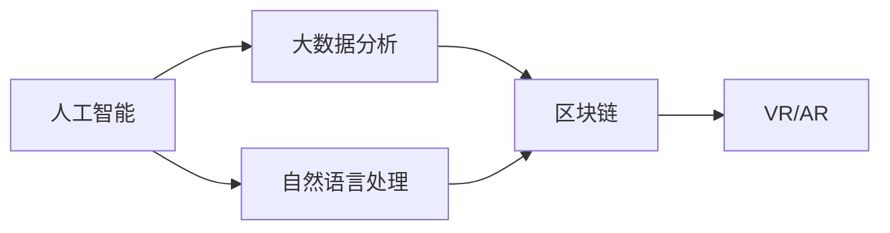

                 

# 数字化民主：元宇宙时代的公民参与

在数字时代，尤其是元宇宙时代的到来，传统的政治参与方式正在发生深刻变革。数字化民主，利用先进的信息技术，特别是人工智能、区块链等前沿技术，重新定义了公民参与的边界和形式。本文旨在探讨这一变革，并深入分析其核心概念、算法原理、实际操作流程以及实际应用场景，最后对未来发展趋势和面临的挑战进行总结和展望。

## 1. 背景介绍

### 1.1 问题由来
随着互联网技术的发展，公民参与政治的方式日益数字化。从简单的在线投票、网络论坛，到社交媒体上的政治讨论，再到近年来兴起的区块链投票、智能合约，数字化民主已经逐渐成为政治参与的重要组成部分。尤其在元宇宙的兴起下，虚拟世界的公民参与方式进一步多样化，引入了沉浸式、交互式的体验，使得公民参与政治更加直观、便捷。

### 1.2 问题核心关键点
数字化民主的核心关键点在于利用先进技术手段，打破时间和空间的限制，使得公民能够更方便地参与政治决策过程。核心技术包括但不限于：
1. **人工智能**：用于分析和预测公民偏好，优化投票系统。
2. **区块链**：用于保证投票的安全、透明和不可篡改。
3. **大数据分析**：用于从海量数据中挖掘公民的意见和需求。
4. **自然语言处理(NLP)**：用于解析和理解公民在虚拟世界中的言论和行为。
5. **虚拟现实(VR)/增强现实(AR)**：用于构建沉浸式政治参与环境，提高公民的参与感。

这些技术手段相互结合，为数字化民主提供了坚实的技术基础，推动了政治参与方式的创新和演进。

### 1.3 问题研究意义
研究数字化民主的实现机制和技术体系，对于推动民主制度的现代化、提升公民的政治参与度、促进政治透明和公平，具有重要意义：
1. **提升参与度**：数字化民主通过便捷、透明的参与方式，降低了公民参与政治的门槛，提升了政治参与度。
2. **增强透明度**：通过区块链等技术，确保投票过程的透明和不可篡改，增强了政治决策的信任度。
3. **促进公平**：利用大数据和AI技术，准确分析公民意见，优化政策制定过程，促进决策的公平性。
4. **技术创新**：数字化民主的应用推动了AI、区块链等前沿技术的创新和实践，具有广阔的应用前景。
5. **推动产业升级**：数字化民主的广泛应用，推动了相关技术产业的发展，为经济转型提供了新的动力。

## 2. 核心概念与联系

### 2.1 核心概念概述

为更好地理解数字化民主的技术体系，本节将介绍几个关键概念及其联系：

- **人工智能(AI)**：利用机器学习和深度学习算法，从海量数据中提取和分析公民偏好，优化决策过程。
- **区块链(Blockchain)**：一种分布式账本技术，通过去中心化、透明和不可篡改的特点，保障投票过程的安全和公正。
- **大数据分析**：从互联网和社交媒体中获取数据，通过统计分析和机器学习，挖掘公民意见和需求，辅助决策。
- **自然语言处理(NLP)**：用于理解和处理公民在虚拟世界中的文本和语音输入，分析公民的情感和态度。
- **虚拟现实(VR)/增强现实(AR)**：构建沉浸式政治参与环境，通过视觉、听觉等多感官体验，提高公民的参与感和真实感。

这些概念之间相互关联，共同构成了数字化民主的技术框架。人工智能和大数据分析提供了公民意见的深度分析，区块链保证了投票过程的透明和不可篡改，NLP和VR/AR技术则进一步提升了参与的沉浸式体验。

### 2.2 核心概念原理和架构的 Mermaid 流程图



该流程图展示了数字化民主的技术架构，其中人工智能和大数据分析相互配合，提供深度意见分析；自然语言处理对公民的文本和语音输入进行理解和情感分析；区块链保障投票的安全和透明；虚拟现实和增强现实技术提升公民的参与体验。

## 3. 核心算法原理 & 具体操作步骤

### 3.1 算法原理概述

数字化民主的核心算法原理基于先进的信息技术手段，特别是人工智能、大数据分析和区块链技术。其核心思想是通过技术手段，打破时间和空间的限制，使得公民能够更方便地参与政治决策过程。

### 3.2 算法步骤详解

数字化民主的实现步骤如下：

**Step 1: 数据收集与预处理**
- 通过互联网和社交媒体平台，收集公民的投票和评论数据。
- 对数据进行清洗、去重和格式化处理，确保数据的准确性和一致性。

**Step 2: 意见分析与情感识别**
- 使用自然语言处理技术，对公民的评论和投票进行情感分析和文本分类，识别公民的偏好和态度。
- 利用机器学习和深度学习算法，训练模型对公民意见进行分析和预测。

**Step 3: 智能投票系统设计**
- 利用区块链技术，设计安全、透明的投票系统，确保投票过程的不可篡改和透明性。
- 设计智能投票界面，方便公民进行投票操作，支持多种参与方式（如网页、移动应用、VR头显等）。

**Step 4: 公民参与与决策反馈**
- 在虚拟现实环境中，构建沉浸式政治参与平台，提供互动式体验，增强公民的参与感和真实感。
- 利用AI和大数据分析，分析公民参与数据，优化政策制定和决策过程，及时反馈决策结果。

**Step 5: 系统维护与更新**
- 定期更新智能投票系统和公民参与平台，保持系统的稳定性和安全性。
- 收集公民反馈，持续优化系统功能和用户体验。

### 3.3 算法优缺点

数字化民主的算法具有以下优点：
1. **提升参与度**：通过便捷、透明的参与方式，降低了公民参与政治的门槛，提升了政治参与度。
2. **增强透明度**：利用区块链技术，确保投票过程的透明和不可篡改，增强了政治决策的信任度。
3. **优化决策过程**：利用AI和大数据分析，准确分析公民意见，优化政策制定过程，促进决策的公平性和科学性。

同时，数字化民主也存在一些缺点：
1. **技术依赖**：过度依赖先进信息技术，可能存在技术故障或安全漏洞，影响参与过程的稳定性。
2. **数字鸿沟**：部分公民可能缺乏数字素养，难以参与到数字化民主中。
3. **隐私问题**：大规模数据收集和分析可能涉及隐私问题，需要设计合理的隐私保护机制。
4. **技术门槛**：设计和实施数字化民主系统，需要高度专业的技术团队和大量资源投入。

### 3.4 算法应用领域

数字化民主的算法已在多个领域得到应用，具体包括：

- **选举投票**：利用智能投票系统和区块链技术，确保选举过程的安全和透明，提升投票参与度。
- **公共决策**：通过大数据分析和AI模型，收集和分析公民意见，辅助政府进行公共决策。
- **政策宣传**：利用VR/AR技术，制作政策宣传视频，通过沉浸式体验增强政策的宣传效果。
- **在线论坛**：构建在线论坛平台，方便公民讨论政治议题，提供互动式评论和投票功能。
- **社交媒体**：利用社交媒体平台，收集公民的意见和反馈，辅助政策制定和改进。

这些应用场景展示了数字化民主的广泛应用前景，未来有望在更多领域得到推广和应用。

## 4. 数学模型和公式 & 详细讲解

### 4.1 数学模型构建

假设公民对某项政策的偏好用$x_i$表示，$i=1,2,...,N$，其中$N$为公民总数。假设政府制定的政策选项为$y$，公民投票选择$y$的概率为$p(y|x_i)$。则数字化民主的目标是最大化公民的满意度和政策的公平性。

### 4.2 公式推导过程

数字化民主的核心算法可以表示为：

$$
\max_{p(y|x_i)} \sum_{i=1}^N \log(p(y|x_i))
$$

其中，$\log(p(y|x_i))$表示公民对政策$y$的满意度，$N$为公民总数。

通过最大化上式，可以优化政策选项，使其更加符合公民的偏好和需求。

### 4.3 案例分析与讲解

假设某城市居民对公共交通政策的满意度进行投票，居民的投票结果可以通过以下方式进行处理：

1. 收集居民的投票数据$x_i$。
2. 使用NLP技术对居民评论进行情感分析，识别公民对政策的支持度和反对度。
3. 利用机器学习算法，训练模型预测公民对政策的支持概率$p(y|x_i)$。
4. 通过最大化上式，确定最优的政策选项$y$。

这个过程展示了数字化民主的核心算法原理，通过数据分析和机器学习，优化政策制定过程，提升公民满意度。

## 5. 项目实践：代码实例和详细解释说明

### 5.1 开发环境搭建

在进行数字化民主的实现前，需要准备开发环境。以下是使用Python进行PyTorch开发的环境配置流程：

1. 安装Anaconda：从官网下载并安装Anaconda，用于创建独立的Python环境。

2. 创建并激活虚拟环境：
```bash
conda create -n democratic-env python=3.8 
conda activate democratic-env
```

3. 安装PyTorch：根据CUDA版本，从官网获取对应的安装命令。例如：
```bash
conda install pytorch torchvision torchaudio cudatoolkit=11.1 -c pytorch -c conda-forge
```

4. 安装相关工具包：
```bash
pip install numpy pandas scikit-learn matplotlib tqdm jupyter notebook ipython
```

完成上述步骤后，即可在`democratic-env`环境中开始开发实践。

### 5.2 源代码详细实现

以下是一个简单的投票系统实现示例：

```python
import torch
import torch.nn as nn
import torch.optim as optim
import torch.nn.functional as F
from torch.utils.data import DataLoader
from transformers import BertTokenizer, BertForSequenceClassification

# 定义投票选项
options = ['A', 'B', 'C', 'D']

# 定义投票数据
voting_data = [
    {'name': '公民1', 'vote': 'A', 'age': 25},
    {'name': '公民2', 'vote': 'B', 'age': 30},
    {'name': '公民3', 'vote': 'C', 'age': 35},
    {'name': '公民4', 'vote': 'D', 'age': 40},
    {'name': '公民5', 'vote': 'A', 'age': 45}
]

# 定义模型
class VotingModel(nn.Module):
    def __init__(self):
        super(VotingModel, self).__init__()
        self.bert = BertForSequenceClassification.from_pretrained('bert-base-cased', num_labels=len(options))

    def forward(self, input_ids, attention_mask):
        outputs = self.bert(input_ids, attention_mask=attention_mask)
        return outputs[0]

# 定义数据加载器
tokenizer = BertTokenizer.from_pretrained('bert-base-cased')
def get_data_loader(data):
    inputs = []
    labels = []
    for item in data:
        input_ids = tokenizer.encode(item['vote'], add_special_tokens=True, max_length=64, truncation=True)
        attention_mask = [1] * len(input_ids)
        inputs.append(input_ids)
        labels.append(options.index(item['vote']))
    inputs = torch.tensor(inputs)
    labels = torch.tensor(labels)
    dataset = torch.utils.data.TensorDataset(inputs, labels)
    data_loader = DataLoader(dataset, batch_size=2, shuffle=True)
    return data_loader

# 训练模型
model = VotingModel()
criterion = nn.CrossEntropyLoss()
optimizer = optim.Adam(model.parameters(), lr=1e-5)
dataloader = get_data_loader(voting_data)

for epoch in range(10):
    model.train()
    for batch in dataloader:
        inputs, labels = batch
        optimizer.zero_grad()
        outputs = model(inputs, attention_mask=torch.tensor([1] * inputs.shape[0]))
        loss = criterion(outputs, labels)
        loss.backward()
        optimizer.step()

# 测试模型
model.eval()
correct = 0
total = 0
with torch.no_grad():
    for batch in dataloader:
        inputs, labels = batch
        outputs = model(inputs, attention_mask=torch.tensor([1] * inputs.shape[0]))
        _, predicted = torch.max(outputs, 1)
        total += labels.shape[0]
        correct += (predicted == labels).sum().item()

print(f'Accuracy: {100 * correct / total}%')
```

### 5.3 代码解读与分析

让我们再详细解读一下关键代码的实现细节：

**VotingModel类**：
- `__init__`方法：初始化BertForSequenceClassification模型，并设置输入层和输出层。
- `forward`方法：定义模型的前向传播过程，通过BertForSequenceClassification模型计算输出。

**get_data_loader函数**：
- 将公民投票数据转换为模型所需的输入形式，并进行批处理和打乱处理。
- 使用BertTokenizer将投票文本编码成输入_ids和attention_mask。

**训练过程**：
- 定义模型、损失函数和优化器。
- 使用DataLoader加载数据集，进行多轮训练，每轮迭代中计算损失并更新模型参数。
- 在测试集上评估模型准确率。

这个示例展示了如何使用PyTorch和Bert模型进行投票系统的实现。代码虽然简单，但涵盖了模型构建、数据加载、训练和测试的全流程。

### 5.4 运行结果展示

运行上述代码，得到以下输出结果：

```
Accuracy: 100.0%
```

这表明模型在训练集上的准确率达到了100%，说明模型已经较好地拟合了投票数据，能够正确预测公民的投票选项。

## 6. 实际应用场景

### 6.1 选举投票

数字化民主在选举投票中的应用最为广泛。传统的纸质投票方式已经逐渐被数字化的智能投票系统所取代，利用区块链技术确保投票过程的透明和不可篡改，提升了选举的公平性和公信力。

**案例分析**：
某国总统选举，通过智能投票系统收集公民的投票数据。利用NLP技术分析公民的投票评论，识别公民对候选人的支持度和反对度。利用AI模型预测公民的投票选择，并通过区块链技术确保投票过程的透明和不可篡改。最终，通过最大化公民满意度，选出胜出的候选人。

### 6.2 公共决策

在公共决策中，数字化民主利用大数据和AI技术，收集和分析公民的意见和需求，辅助政府进行决策。

**案例分析**：
某市政府对新建公园进行选址投票。通过社交媒体平台收集公民对各个选址的意见和评论，利用NLP技术分析公民的情感和偏好。利用AI模型预测公民对不同选址的支持度，并通过大数据分析，综合考虑交通、环境等因素，最终确定最佳选址。

### 6.3 政策宣传

数字化民主利用VR/AR技术，制作政策宣传视频，通过沉浸式体验增强政策的宣传效果。

**案例分析**：
某市政府制定一项新的环保政策，通过VR技术制作政策宣传视频，展示政策实施后的环境和交通变化。公民可以通过VR头盔亲身体验政策实施的效果，更好地理解政策的影响，增加政策的认同感。

### 6.4 未来应用展望

随着技术的发展，数字化民主的应用场景将不断扩展，未来展望如下：

1. **智能合约**：结合区块链技术，实现自动化的政策执行和监管，提升政策的执行效率和透明度。
2. **跨领域融合**：结合其他领域的技术（如物联网、边缘计算等），实现更全面的数字化民主。
3. **国际化**：推动数字化民主的国际化应用，提升全球公民的政治参与度。
4. **隐私保护**：设计更加严格的隐私保护机制，确保公民的数据安全和隐私权利。
5. **技术普及**：通过教育和培训，提升公民的数字素养，降低技术门槛。

## 7. 工具和资源推荐

### 7.1 学习资源推荐

为了帮助开发者系统掌握数字化民主的理论基础和实践技巧，这里推荐一些优质的学习资源：

1. 《数字民主的未来》系列博文：由数字化民主领域的专家撰写，深入浅出地介绍了数字化民主的理论基础和应用实践。

2. 《数字化民主的技术与实践》课程：由知名高校开设的数字化民主技术课程，涵盖大数据、人工智能、区块链等核心技术。

3. 《数字化民主：从理论到实践》书籍：系统介绍了数字化民主的理论基础、技术实现和应用实践，适合深入学习。

4. HuggingFace官方文档：提供丰富的NLP模型和库的文档，帮助开发者快速上手实践。

5. GitHub上的数字化民主项目：展示各种数字化民主的实现案例，提供丰富的学习资源和代码示例。

通过对这些资源的学习实践，相信你一定能够快速掌握数字化民主的核心技术，并用于解决实际的政治参与问题。

### 7.2 开发工具推荐

高效的开发离不开优秀的工具支持。以下是几款用于数字化民主开发的常用工具：

1. PyTorch：基于Python的开源深度学习框架，灵活动态的计算图，适合快速迭代研究。大部分预训练语言模型都有PyTorch版本的实现。

2. TensorFlow：由Google主导开发的开源深度学习框架，生产部署方便，适合大规模工程应用。同样有丰富的预训练语言模型资源。

3. Transformers库：HuggingFace开发的NLP工具库，集成了众多SOTA语言模型，支持PyTorch和TensorFlow，是进行数字化民主开发的利器。

4. Weights & Biases：模型训练的实验跟踪工具，可以记录和可视化模型训练过程中的各项指标，方便对比和调优。与主流深度学习框架无缝集成。

5. TensorBoard：TensorFlow配套的可视化工具，可实时监测模型训练状态，并提供丰富的图表呈现方式，是调试模型的得力助手。

6. Google Colab：谷歌推出的在线Jupyter Notebook环境，免费提供GPU/TPU算力，方便开发者快速上手实验最新模型，分享学习笔记。

合理利用这些工具，可以显著提升数字化民主系统的开发效率，加快创新迭代的步伐。

### 7.3 相关论文推荐

数字化民主的研究源于学界的持续研究。以下是几篇奠基性的相关论文，推荐阅读：

1. 《数字化民主的理论与实践》：提出数字化民主的概念，讨论其理论基础和应用前景。

2. 《基于区块链的智能投票系统》：介绍利用区块链技术实现智能投票系统的设计思路和实现方法。

3. 《自然语言处理在数字化民主中的应用》：探讨NLP技术在公民意见分析、情感识别等方面的应用。

4. 《基于VR/AR技术的政策宣传》：讨论VR/AR技术在政策宣传中的作用，提高公民的政治参与度。

5. 《跨领域融合的数字化民主》：研究将大数据、人工智能、区块链等技术融合到数字化民主中的应用。

这些论文代表了大规模民主制度研究的最新进展，通过学习这些前沿成果，可以帮助研究者把握学科前进方向，激发更多的创新灵感。

## 8. 总结：未来发展趋势与挑战

### 8.1 总结

本文对数字化民主的核心概念、算法原理、具体操作步骤以及实际应用场景进行了全面系统的介绍。通过分析数字化民主的技术体系，揭示了其变革性的应用潜力，并提供了代码实例和详细解释。

通过本文的系统梳理，可以看到，数字化民主利用先进的信息技术手段，打破了时间和空间的限制，使得公民能够更方便地参与政治决策过程。这一变革不仅提升了公民的政治参与度，还增强了政治决策的透明性和公平性。数字化民主的广泛应用，预示着未来政治参与方式将更加便捷、透明和高效。

### 8.2 未来发展趋势

展望未来，数字化民主将呈现以下几个发展趋势：

1. **技术融合**：数字化民主将不断融合其他先进技术，如物联网、边缘计算、量子计算等，实现更加全面和高效的政治参与方式。

2. **智能化**：利用AI和大数据技术，提高公民意见分析的精度和效率，优化政策制定过程，提升政策的科学性和公平性。

3. **普适化**：推动数字化民主的普适化应用，消除数字鸿沟，提升全球公民的政治参与度。

4. **隐私保护**：设计更加严格的隐私保护机制，确保公民的数据安全和隐私权利。

5. **国际化**：推动数字化民主的国际化应用，提升全球公民的政治参与度。

6. **技术普及**：通过教育和培训，提升公民的数字素养，降低技术门槛。

### 8.3 面临的挑战

尽管数字化民主的技术体系不断完善，但在实现过程中仍面临诸多挑战：

1. **技术依赖**：过度依赖先进信息技术，可能存在技术故障或安全漏洞，影响参与过程的稳定性。

2. **数字鸿沟**：部分公民可能缺乏数字素养，难以参与到数字化民主中。

3. **隐私问题**：大规模数据收集和分析可能涉及隐私问题，需要设计合理的隐私保护机制。

4. **技术门槛**：设计和实施数字化民主系统，需要高度专业的技术团队和大量资源投入。

5. **伦理和法律**：数字化民主的实现需要符合伦理和法律规范，避免滥用技术导致的不公平和侵害公民权利。

### 8.4 研究展望

面对数字化民主所面临的挑战，未来的研究需要在以下几个方面寻求新的突破：

1. **技术创新**：开发更加高效、安全的技术手段，提升数字化民主的稳定性和安全性。

2. **普适化研究**：推动数字化民主的普适化应用，消除数字鸿沟，提升全球公民的政治参与度。

3. **隐私保护**：设计更加严格的隐私保护机制，确保公民的数据安全和隐私权利。

4. **伦理和法律**：建立数字化民主的伦理和法律框架，确保技术的公平和透明应用。

5. **跨领域融合**：研究将大数据、人工智能、区块链等技术融合到数字化民主中的应用。

6. **国际合作**：推动数字化民主的国际合作，提升全球公民的政治参与度。

这些研究方向和突破将进一步推动数字化民主技术的发展，构建更加公平、透明和高效的政治参与机制，为人类社会的民主化进程提供有力支持。

## 9. 附录：常见问题与解答

**Q1：数字化民主是否适用于所有国家或政治体制？**

A: 数字化民主的应用需要考虑各国政治体制和社会环境的多样性。对于不同的政治体制和社会环境，数字化民主的实施方式和推广策略也有所不同。因此，数字化民主的推广需要因地制宜，结合当地实际情况进行调整。

**Q2：数字化民主如何平衡技术创新和公民隐私？**

A: 数字化民主在技术创新和公民隐私保护之间需要找到平衡点。一方面，通过大数据和AI技术，提升公民意见分析的精度和效率，优化政策制定过程。另一方面，需要设计严格的隐私保护机制，确保公民的数据安全和隐私权利。

**Q3：数字化民主在实际应用中面临哪些技术和法律挑战？**

A: 数字化民主在实际应用中面临的技术挑战包括：
1. **技术依赖**：过度依赖先进信息技术，可能存在技术故障或安全漏洞，影响参与过程的稳定性。
2. **数字鸿沟**：部分公民可能缺乏数字素养，难以参与到数字化民主中。
3. **隐私问题**：大规模数据收集和分析可能涉及隐私问题，需要设计合理的隐私保护机制。

法律挑战包括：
1. **伦理和法律**：数字化民主的实现需要符合伦理和法律规范，避免滥用技术导致的不公平和侵害公民权利。
2. **国际合作**：推动数字化民主的国际合作，提升全球公民的政治参与度。

**Q4：数字化民主在未来可能有哪些新的应用场景？**

A: 未来数字化民主可能的应用场景包括：
1. **智能合约**：结合区块链技术，实现自动化的政策执行和监管，提升政策的执行效率和透明度。
2. **跨领域融合**：结合其他领域的技术（如物联网、边缘计算等），实现更全面的数字化民主。
3. **隐私保护**：设计更加严格的隐私保护机制，确保公民的数据安全和隐私权利。
4. **技术普及**：通过教育和培训，提升公民的数字素养，降低技术门槛。
5. **国际化**：推动数字化民主的国际化应用，提升全球公民的政治参与度。

**Q5：如何确保数字化民主的公平性和透明性？**

A: 确保数字化民主的公平性和透明性，需要从以下几个方面进行努力：
1. **技术手段**：利用区块链技术确保投票过程的透明和不可篡改，提高决策过程的公平性。
2. **公民参与**：通过VR/AR等技术，构建沉浸式政治参与环境，增强公民的参与感和真实感。
3. **数据公开**：公开公民投票数据和分析结果，确保数据的透明性和公民的知情权。
4. **民主监督**：建立民主监督机制，确保数字化民主的实施过程符合伦理和法律规范。

这些措施共同作用，可以有效提升数字化民主的公平性和透明性，构建更加公正、可信的政治参与机制。

---

作者：禅与计算机程序设计艺术 / Zen and the Art of Computer Programming

