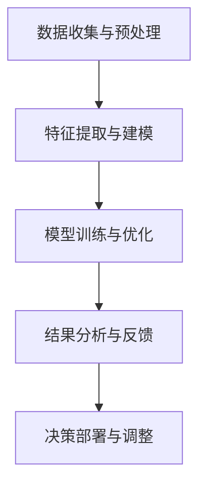

                 

# 数字化洞察力增强：AI驱动的问题解析方法

## 1. 背景介绍

随着数据驱动决策和人工智能的兴起，数字化洞察力成为企业成功的关键。在信息过载的时代，如何从海量数据中提取有价值的信息，进行高效的问题解析，成为企业关注的焦点。本文将介绍一种基于人工智能驱动的问题解析方法，帮助企业在复杂的数据环境中，迅速识别问题、分析原因并制定解决方案。

### 1.1 问题由来

现代企业在运营过程中，面临各种复杂的内部和外部问题。例如，生产线上可能出现质量问题、供应链中断、市场份额下降等。这些问题通常具有非线性、多维度和动态变化的特点，单纯依赖传统的数据分析方法难以有效应对。随着人工智能技术的不断发展，利用AI驱动的问题解析方法，通过数据驱动、智能分析和自动化决策，成为解决复杂问题的有力工具。

### 1.2 问题核心关键点

AI驱动的问题解析方法基于深度学习、自然语言处理和强化学习等先进技术，通过以下几个关键步骤：

1. **数据收集与预处理**：从多个数据源收集相关的数据，并进行清洗、标注和整合。
2. **特征提取与建模**：通过特征提取技术，将原始数据转化为模型可以接受的特征表示。
3. **模型训练与优化**：利用深度学习模型，对特征进行建模，并通过优化算法提升模型性能。
4. **结果分析与反馈**：通过可视化工具和报告，分析模型输出结果，进行人机交互和反馈迭代。
5. **决策部署与调整**：根据分析结果，制定决策方案，部署到生产环境，并不断调整优化。

这些步骤形成一个闭环的反馈系统，通过不断的学习和优化，提升问题解析的准确性和效率。

### 1.3 问题研究意义

AI驱动的问题解析方法能够帮助企业在快速变化的市场环境中，快速识别问题、分析原因并制定解决方案。具体而言，其研究意义体现在以下几个方面：

1. **提升效率**：自动化数据分析和问题识别，节省人力和时间成本，提升决策速度。
2. **优化决策**：基于大数据和深度学习模型的分析，提供更科学、更准确的决策依据。
3. **增强适应性**：通过持续学习，模型能够适应新的数据和环境变化，保持竞争力。
4. **降低风险**：通过深度学习模型的非线性拟合能力，捕捉复杂问题的潜在关联，减少决策失误。
5. **支持创新**：基于智能分析结果，企业可以更快地识别市场机会，推动技术创新和业务发展。

## 2. 核心概念与联系

### 2.1 核心概念概述

为了更好地理解AI驱动的问题解析方法，本节将介绍几个关键核心概念：

- **深度学习**：基于神经网络结构的机器学习算法，通过多层次的特征提取和抽象，实现对复杂数据的建模和预测。
- **自然语言处理(NLP)**：使计算机能够理解、处理和生成人类语言的技术。
- **强化学习**：通过与环境交互，通过奖励信号，优化决策策略的学习方法。
- **数据挖掘**：从海量数据中提取有价值信息，进行模式识别和预测的技术。
- **问题解析**：通过分析复杂数据，识别和解决问题的方法。
- **决策支持系统**：利用人工智能技术，辅助决策的过程和结果。

这些概念通过特定的技术方法，相互联系，形成一个完整的AI驱动的问题解析体系。

### 2.2 核心概念原理和架构的 Mermaid 流程图



这个流程图展示了AI驱动的问题解析方法的基本架构：

1. **数据收集与预处理**：从不同渠道收集原始数据，并进行清洗、标注和整合，为后续分析提供基础。
2. **特征提取与建模**：利用深度学习模型对数据进行特征提取和建模，形成模型可以处理的形式。
3. **模型训练与优化**：通过训练和优化算法，提升模型预测和推理能力。
4. **结果分析与反馈**：通过可视化工具和报告，分析模型输出结果，进行人机交互和反馈迭代。
5. **决策部署与调整**：根据分析结果，制定决策方案，部署到生产环境，并不断调整优化。

这些步骤构成了一个闭环反馈系统，通过不断的学习和优化，提升问题解析的准确性和效率。

## 3. 核心算法原理 & 具体操作步骤

### 3.1 算法原理概述

AI驱动的问题解析方法的核心原理是利用深度学习、自然语言处理和强化学习等技术，通过以下几个关键步骤：

1. **数据收集与预处理**：从多个数据源收集相关的数据，并进行清洗、标注和整合。
2. **特征提取与建模**：通过特征提取技术，将原始数据转化为模型可以接受的特征表示。
3. **模型训练与优化**：利用深度学习模型，对特征进行建模，并通过优化算法提升模型性能。
4. **结果分析与反馈**：通过可视化工具和报告，分析模型输出结果，进行人机交互和反馈迭代。
5. **决策部署与调整**：根据分析结果，制定决策方案，部署到生产环境，并不断调整优化。

### 3.2 算法步骤详解

以下是AI驱动的问题解析方法的具体操作步骤：

#### 3.2.1 数据收集与预处理

数据收集和预处理是问题解析的第一步。具体步骤包括：

1. **数据收集**：从多个数据源（如生产系统、市场调研、社交媒体等）收集相关数据，形成初始数据集。
2. **数据清洗**：去除重复、错误和不完整的数据，确保数据质量。
3. **数据标注**：根据业务需求，对数据进行标注，如问题类型、原因、影响等。
4. **数据整合**：将不同来源的数据进行整合，形成统一的数据集。

#### 3.2.2 特征提取与建模

特征提取和建模是问题解析的关键步骤。具体步骤包括：

1. **特征选择**：根据业务需求和数据特征，选择或构建合适的特征。
2. **特征提取**：利用深度学习模型的特征提取能力，将原始数据转化为高维特征向量。
3. **模型选择**：选择合适的深度学习模型，如卷积神经网络(CNN)、循环神经网络(RNN)或Transformer等。
4. **模型训练**：利用标注数据，训练模型，优化模型参数，提升预测能力。
5. **模型评估**：通过测试集评估模型性能，选择最优模型。

#### 3.2.3 模型训练与优化

模型训练与优化是问题解析的核心环节。具体步骤包括：

1. **损失函数设计**：选择合适的损失函数，如交叉熵损失、均方误差损失等，评估模型预测与真实标签之间的差异。
2. **优化算法选择**：选择合适的优化算法，如Adam、SGD等，更新模型参数，最小化损失函数。
3. **超参数调优**：根据实验结果，调整学习率、批大小等超参数，优化模型性能。
4. **模型验证**：在验证集上验证模型性能，避免过拟合。
5. **模型部署**：将训练好的模型部署到生产环境，进行实时预测和推理。

#### 3.2.4 结果分析与反馈

结果分析与反馈是问题解析的闭环环节。具体步骤包括：

1. **结果可视化**：通过可视化工具，展示模型输出结果，如分类结果、回归结果等。
2. **报告生成**：生成详细的分析报告，包括数据来源、模型性能、预测结果等。
3. **人机交互**：通过交互界面，提供用户友好的交互体验，如输入问题和获取分析结果。
4. **反馈迭代**：根据用户反馈，调整模型和算法，优化问题解析效果。

#### 3.2.5 决策部署与调整

决策部署与调整是问题解析的最终步骤。具体步骤包括：

1. **决策方案制定**：根据分析结果，制定决策方案，如调整生产流程、优化供应链管理等。
2. **方案实施**：将决策方案部署到生产环境，进行实际应用。
3. **效果评估**：评估决策方案的效果，根据评估结果进行调整和优化。

### 3.3 算法优缺点

AI驱动的问题解析方法具有以下优点：

1. **自动化与高效性**：通过自动化数据分析和问题识别，节省人力和时间成本，提升决策速度。
2. **深度学习模型**：基于深度学习模型的非线性拟合能力，捕捉复杂问题的潜在关联，提升预测精度。
3. **持续学习**：通过持续学习，模型能够适应新的数据和环境变化，保持竞争力。
4. **多源数据融合**：利用多源数据进行综合分析，提供更全面、更准确的问题解析结果。

同时，该方法也存在以下缺点：

1. **数据质量依赖**：模型性能依赖于数据质量，数据清洗和标注需要大量人力和资源。
2. **模型复杂性**：深度学习模型较为复杂，训练和优化需要较高的技术门槛。
3. **计算资源需求高**：深度学习模型需要大量的计算资源，如GPU、TPU等。
4. **模型可解释性不足**：深度学习模型的决策过程通常缺乏可解释性，难以进行调试和优化。

尽管存在这些缺点，但AI驱动的问题解析方法通过利用先进的AI技术，极大地提升了问题解析的准确性和效率，已经在众多行业得到了广泛应用。

### 3.4 算法应用领域

AI驱动的问题解析方法已经广泛应用于各个行业，包括但不限于：

1. **制造业**：通过分析生产数据，优化生产流程，减少质量问题和设备故障。
2. **零售业**：通过分析销售数据，进行库存管理和市场预测，提升销售效率。
3. **金融业**：通过分析交易数据，识别欺诈行为和市场风险，保障金融安全。
4. **医疗保健**：通过分析医疗数据，辅助疾病诊断和治疗方案制定，提升医疗服务质量。
5. **能源行业**：通过分析能源消耗数据，优化能源利用效率，减少环境污染。
6. **交通物流**：通过分析交通和物流数据，优化配送路线和运输计划，提升物流效率。

这些行业的应用表明，AI驱动的问题解析方法在实际业务场景中，能够有效地解决复杂问题，提升业务效率和决策质量。

## 4. 数学模型和公式 & 详细讲解

### 4.1 数学模型构建

假设原始数据集为 $D=\{(x_i,y_i)\}_{i=1}^N$，其中 $x_i$ 为输入数据， $y_i$ 为标签。问题解析的目标是利用深度学习模型 $f(x)$ 预测标签 $y$，形式化表述为：

$$
\min_{\theta} \frac{1}{N} \sum_{i=1}^N \ell(f(x_i),y_i)
$$

其中 $\ell$ 为损失函数， $f(x)$ 为模型预测函数， $\theta$ 为模型参数。

### 4.2 公式推导过程

以二分类问题为例，假设模型输出为 $f(x)=[\hat{y}_1,\hat{y}_2]$，其中 $\hat{y}_1$ 为正类预测概率， $\hat{y}_2$ 为负类预测概率。则二分类交叉熵损失函数为：

$$
\ell(f(x),y)= -y \log \hat{y} - (1-y) \log (1-\hat{y})
$$

对 $f(x)$ 求导，得：

$$
\frac{\partial \ell}{\partial f(x)} = - \frac{y}{\hat{y}} + \frac{1-y}{1-\hat{y}}
$$

根据链式法则，最终导数为：

$$
\frac{\partial \ell}{\partial \theta} = \sum_{i=1}^N \frac{\partial \ell}{\partial f(x_i)} \frac{\partial f(x_i)}{\partial \theta}
$$

通过反向传播算法，计算导数并更新模型参数 $\theta$，最小化损失函数 $\ell$。

### 4.3 案例分析与讲解

以制造业中的生产质量问题为例，分析AI驱动的问题解析方法的应用。具体步骤如下：

1. **数据收集与预处理**：收集生产线上的设备运行数据、传感器数据、工人操作记录等，并进行清洗和标注。
2. **特征提取与建模**：选择设备运行时间、传感器温度、工人操作频率等特征，构建深度学习模型进行建模。
3. **模型训练与优化**：利用标注数据训练模型，通过交叉验证调整超参数，优化模型性能。
4. **结果分析与反馈**：通过可视化工具展示模型输出结果，生成详细的分析报告，反馈到生产现场。
5. **决策部署与调整**：根据分析结果，调整生产流程和设备参数，提升产品质量和生产效率。

通过以上步骤，制造业企业能够快速识别生产质量问题，优化生产流程，减少故障和浪费，提升产品质量和生产效率。

## 5. 项目实践：代码实例和详细解释说明

### 5.1 开发环境搭建

在进行AI驱动的问题解析项目实践前，我们需要准备好开发环境。以下是使用Python进行TensorFlow开发的环境配置流程：

1. 安装Anaconda：从官网下载并安装Anaconda，用于创建独立的Python环境。

2. 创建并激活虚拟环境：
```bash
conda create -n tf-env python=3.8 
conda activate tf-env
```

3. 安装TensorFlow：根据CUDA版本，从官网获取对应的安装命令。例如：
```bash
conda install tensorflow==2.7 
```

4. 安装TensorBoard：
```bash
pip install tensorboard
```

5. 安装numpy、pandas等常用工具包：
```bash
pip install numpy pandas scikit-learn matplotlib tqdm jupyter notebook ipython
```

完成上述步骤后，即可在`tf-env`环境中开始项目实践。

### 5.2 源代码详细实现

以下是使用TensorFlow实现AI驱动的问题解析方法的完整代码实现。

```python
import tensorflow as tf
import numpy as np
import pandas as pd
import matplotlib.pyplot as plt

# 读取数据集
data = pd.read_csv('data.csv')
x = data[['feature1', 'feature2', 'feature3']]
y = data['label']

# 划分训练集和测试集
train_ratio = 0.8
train_size = int(len(x) * train_ratio)
x_train, x_test = x.iloc[:train_size], x.iloc[train_size:]
y_train, y_test = y.iloc[:train_size], y.iloc[train_size:]

# 定义模型
model = tf.keras.Sequential([
    tf.keras.layers.Dense(64, activation='relu', input_shape=[3]),
    tf.keras.layers.Dense(64, activation='relu'),
    tf.keras.layers.Dense(1, activation='sigmoid')
])

# 定义损失函数和优化器
loss_fn = tf.keras.losses.BinaryCrossentropy(from_logits=True)
optimizer = tf.keras.optimizers.Adam(learning_rate=0.001)

# 编译模型
model.compile(optimizer=optimizer, loss=loss_fn, metrics=['accuracy'])

# 训练模型
model.fit(x_train, y_train, epochs=10, validation_data=(x_test, y_test))

# 评估模型
test_loss, test_acc = model.evaluate(x_test, y_test)
print(f'Test loss: {test_loss}, Test accuracy: {test_acc}')
```

以上代码实现了一个简单的二分类问题解析模型，具体步骤如下：

1. **数据准备**：读取数据集，划分为训练集和测试集。
2. **模型定义**：使用TensorFlow定义深度学习模型，包括输入层、隐藏层和输出层。
3. **模型编译**：设置损失函数、优化器和评估指标，编译模型。
4. **模型训练**：使用训练集数据训练模型，设置迭代次数和验证集。
5. **模型评估**：在测试集上评估模型性能，输出测试损失和准确率。

### 5.3 代码解读与分析

让我们再详细解读一下关键代码的实现细节：

**数据准备**：
- `pd.read_csv`：读取数据集，存储为pandas DataFrame格式。
- `x` 和 `y` 的定义：提取数据集中的特征和标签。
- `train_ratio` 和 `train_size`：设置训练集的比例和大小。
- `x_train`, `x_test`, `y_train`, `y_test`：划分训练集和测试集。

**模型定义**：
- `tf.keras.Sequential`：定义一个顺序模型。
- `tf.keras.layers.Dense`：定义全连接层，包括输入层、隐藏层和输出层。
- `activation='relu'`：定义激活函数。
- `input_shape=[3]`：定义输入数据的形状。
- `tf.keras.layers.Dense(1, activation='sigmoid')`：定义输出层，输出一个概率值。

**模型编译**：
- `tf.keras.losses.BinaryCrossentropy(from_logits=True)`：定义损失函数，二分类问题使用二元交叉熵损失。
- `tf.keras.optimizers.Adam(learning_rate=0.001)`：定义优化器，使用Adam优化器，设置学习率为0.001。
- `model.compile(optimizer=optimizer, loss=loss_fn, metrics=['accuracy'])`：编译模型，设置优化器、损失函数和评估指标。

**模型训练**：
- `model.fit(x_train, y_train, epochs=10, validation_data=(x_test, y_test))`：训练模型，设置迭代次数和验证集。

**模型评估**：
- `test_loss, test_acc = model.evaluate(x_test, y_test)`：评估模型，输出测试损失和准确率。

通过以上代码实现，我们可以快速构建一个AI驱动的问题解析模型，并在实际数据集上进行测试和优化。

## 6. 实际应用场景

### 6.1 智能客服系统

智能客服系统能够利用AI驱动的问题解析方法，从历史客户对话中提取模式和知识，进行实时问题解析和解答。具体步骤如下：

1. **数据收集与预处理**：收集历史客户对话数据，进行清洗和标注。
2. **特征提取与建模**：选择对话内容、用户意图等特征，构建深度学习模型进行建模。
3. **模型训练与优化**：利用标注数据训练模型，优化模型性能。
4. **结果分析与反馈**：通过可视化工具展示模型输出结果，生成详细的分析报告，反馈到客服系统。
5. **决策部署与调整**：根据分析结果，调整客服策略和知识库，提升客服体验。

通过以上步骤，智能客服系统能够自动处理客户问题，提供快速响应和高质量服务，提升客户满意度和忠诚度。

### 6.2 金融舆情监测

金融舆情监测系统能够利用AI驱动的问题解析方法，从社交媒体、新闻等海量数据中提取金融舆情信息，进行实时监测和预警。具体步骤如下：

1. **数据收集与预处理**：收集金融领域相关的社交媒体、新闻等数据，进行清洗和标注。
2. **特征提取与建模**：选择文本情感、关键词等特征，构建深度学习模型进行建模。
3. **模型训练与优化**：利用标注数据训练模型，优化模型性能。
4. **结果分析与反馈**：通过可视化工具展示模型输出结果，生成详细的分析报告，反馈到金融监管系统。
5. **决策部署与调整**：根据分析结果，调整监管策略和措施，规避金融风险。

通过以上步骤，金融舆情监测系统能够实时监测市场动态，预警潜在风险，保障金融稳定和安全性。

### 6.3 个性化推荐系统

个性化推荐系统能够利用AI驱动的问题解析方法，从用户行为数据中提取兴趣点和偏好，进行个性化推荐。具体步骤如下：

1. **数据收集与预处理**：收集用户浏览、点击、购买等行为数据，进行清洗和标注。
2. **特征提取与建模**：选择用户行为、商品属性等特征，构建深度学习模型进行建模。
3. **模型训练与优化**：利用标注数据训练模型，优化模型性能。
4. **结果分析与反馈**：通过可视化工具展示模型输出结果，生成详细的分析报告，反馈到推荐系统。
5. **决策部署与调整**：根据分析结果，调整推荐策略和模型参数，提升推荐效果。

通过以上步骤，个性化推荐系统能够根据用户兴趣和行为，提供更精准、个性化的商品推荐，提升用户满意度和转化率。

### 6.4 未来应用展望

随着AI驱动的问题解析方法不断发展，未来的应用场景将更加广泛和深入。以下是一些可能的未来应用：

1. **智慧城市治理**：利用AI驱动的问题解析方法，进行城市事件监测、舆情分析、应急指挥等，提高城市管理的自动化和智能化水平。
2. **医疗健康**：通过分析医疗数据，辅助疾病诊断和治疗方案制定，提升医疗服务质量。
3. **智能交通**：利用AI驱动的问题解析方法，进行交通流量预测、路况优化等，提升交通管理效率。
4. **智能制造**：通过分析生产数据，优化生产流程，减少质量问题和设备故障，提升生产效率。
5. **教育培训**：利用AI驱动的问题解析方法，进行学生行为分析、课程推荐等，提升教育培训效果。

未来，AI驱动的问题解析方法将在更多领域得到应用，为经济社会发展注入新的动力。

## 7. 工具和资源推荐

### 7.1 学习资源推荐

为了帮助开发者系统掌握AI驱动的问题解析理论基础和实践技巧，这里推荐一些优质的学习资源：

1. **《深度学习》一书**：由Ian Goodfellow等撰写，深入浅出地介绍了深度学习的基本概念和经典模型。
2. **CS231n《卷积神经网络》课程**：斯坦福大学开设的计算机视觉课程，包含深度学习模型的实现和应用。
3. **《自然语言处理》一书**：由Daniel Jurafsky和James H. Martin撰写，系统介绍了自然语言处理的基本方法和技术。
4. **Google AI博客**：Google AI团队发布的博客，涵盖最新的AI技术和应用。
5. **Kaggle平台**：数据科学竞赛平台，提供大量数据集和算法实现，适合实战练习。
6. **ArXiv**：学术论文发布平台，提供大量前沿研究成果，适合深入学习。

通过对这些资源的学习实践，相信你一定能够快速掌握AI驱动的问题解析方法，并用于解决实际的AI问题。

### 7.2 开发工具推荐

高效的开发离不开优秀的工具支持。以下是几款用于AI驱动的问题解析开发的常用工具：

1. **TensorFlow**：由Google主导开发的深度学习框架，具有强大的计算能力和丰富的应用生态。
2. **PyTorch**：由Facebook主导开发的深度学习框架，具有动态计算图和高效的模型构建功能。
3. **TensorBoard**：TensorFlow配套的可视化工具，可实时监测模型训练状态，并提供丰富的图表呈现方式。
4. **Jupyter Notebook**：交互式编程环境，支持多种语言和框架，适合快速迭代开发。
5. **GitHub**：代码托管平台，提供丰富的开源项目和协作工具，适合团队开发。

合理利用这些工具，可以显著提升AI驱动的问题解析任务的开发效率，加快创新迭代的步伐。

### 7.3 相关论文推荐

AI驱动的问题解析方法的研究始于学界和工业界的持续探索。以下是几篇奠基性的相关论文，推荐阅读：

1. **《ImageNet Classification with Deep Convolutional Neural Networks》**：AlexNet论文，展示了深度卷积神经网络在图像分类任务上的强大性能。
2. **《Attention is All You Need》**：Transformer论文，提出Transformer模型，开启了NLP领域的预训练大模型时代。
3. **《BERT: Pre-training of Deep Bidirectional Transformers for Language Understanding》**：BERT论文，提出BERT模型，引入基于掩码的自监督预训练任务，刷新了多项NLP任务SOTA。
4. **《A Survey of Recent Techniques for Multimodal Learning》**：多模态学习综述论文，全面介绍了多模态数据融合和协同建模的技术方法。
5. **《Parameter-Efficient Transfer Learning for NLP》**：参数高效微调方法论文，提出Adapter等参数高效微调方法，在固定大部分预训练参数的同时，只更新极少量的任务相关参数。
6. **《Echoing the Symphony: Swarm AI for Large-Scale Deep Learning》**：Swarm AI论文，提出Swarm AI方法，通过多模型协同训练，提升深度学习模型的性能和鲁棒性。

这些论文代表了大语言模型微调技术的发展脉络。通过学习这些前沿成果，可以帮助研究者把握学科前进方向，激发更多的创新灵感。

## 8. 总结：未来发展趋势与挑战

### 8.1 总结

本文对AI驱动的问题解析方法进行了全面系统的介绍。首先阐述了问题解析的背景和意义，明确了AI驱动的问题解析方法在复杂数据环境中快速识别和解决问题的独特价值。其次，从原理到实践，详细讲解了问题解析的数学模型和操作步骤，给出了问题解析任务开发的完整代码实例。同时，本文还广泛探讨了问题解析方法在智能客服、金融舆情、个性化推荐等多个行业领域的应用前景，展示了问题解析方法的广阔应用场景。

通过本文的系统梳理，可以看到，AI驱动的问题解析方法在实际业务场景中，能够有效地解决复杂问题，提升业务效率和决策质量。

### 8.2 未来发展趋势

展望未来，AI驱动的问题解析方法将呈现以下几个发展趋势：

1. **深度学习模型的多样化**：随着深度学习模型的不断发展，将出现更多高效、灵活的问题解析模型，如Transformer、CNN、RNN等。
2. **多源数据融合**：利用多源数据进行综合分析，提供更全面、更准确的问题解析结果，如文本、图像、音频等多模态数据融合。
3. **参数高效与计算高效**：开发更加参数高效和计算高效的微调方法，在固定大部分预训练参数的同时，只更新极少量的任务相关参数。
4. **持续学习和自适应**：通过持续学习，模型能够适应新的数据和环境变化，保持竞争力。
5. **可解释性与透明性**：提高模型输出的可解释性，增强用户信任和接受度。
6. **跨领域应用**：问题解析方法将在更多行业得到应用，如智慧城市、医疗健康、教育培训等。

以上趋势凸显了AI驱动的问题解析方法在实际业务场景中的广泛应用前景。这些方向的探索发展，必将进一步提升问题解析的准确性和效率，推动AI技术的全面应用。

### 8.3 面临的挑战

尽管AI驱动的问题解析方法已经取得了瞩目成就，但在迈向更加智能化、普适化应用的过程中，它仍面临以下挑战：

1. **数据质量和多样性**：问题解析性能依赖于高质量、多样化的数据，数据收集和标注需要大量人力和资源。
2. **模型复杂性和可解释性**：深度学习模型较为复杂，难以解释其内部工作机制和决策逻辑。
3. **计算资源和成本**：深度学习模型需要大量的计算资源，如GPU、TPU等，成本较高。
4. **模型鲁棒性和泛化能力**：模型面对域外数据时，泛化性能往往大打折扣。
5. **安全和隐私问题**：问题解析过程中涉及大量敏感数据，数据安全和隐私保护成为重要挑战。

尽管存在这些挑战，但随着技术的不断进步和应用的不断成熟，AI驱动的问题解析方法将逐步克服这些难题，为更多行业和企业带来实质性的价值提升。

### 8.4 研究展望

面向未来，AI驱动的问题解析技术需要在以下几个方面进行深入研究：

1. **无监督和半监督学习**：探索无监督和半监督学习的方法，摆脱对大规模标注数据的依赖，利用自监督学习、主动学习等无监督和半监督范式，最大限度利用非结构化数据。
2. **多模型协同**：通过多模型协同训练，提升深度学习模型的性能和鲁棒性。
3. **知识表示与推理**：结合符号化的先验知识，如知识图谱、逻辑规则等，与神经网络模型进行融合，引导问题解析过程学习更准确、合理的语言模型。
4. **因果分析与强化学习**：将因果分析方法引入问题解析模型，识别出模型决策的关键特征，增强输出解释的因果性和逻辑性。
5. **伦理与安全**：在模型训练目标中引入伦理导向的评估指标，过滤和惩罚有偏见、有害的输出倾向，确保输出符合人类价值观和伦理道德。

这些研究方向的探索，必将引领AI驱动的问题解析技术迈向更高的台阶，为构建安全、可靠、可解释、可控的智能系统铺平道路。面向未来，AI驱动的问题解析技术还需要与其他人工智能技术进行更深入的融合，如知识表示、因果推理、强化学习等，多路径协同发力，共同推动自然语言理解和智能交互系统的进步。只有勇于创新、敢于突破，才能不断拓展问题解析的边界，让智能技术更好地造福人类社会。

## 9. 附录：常见问题与解答

**Q1：AI驱动的问题解析方法是否适用于所有业务场景？**

A: AI驱动的问题解析方法在大多数业务场景中都能取得不错的效果，特别是对于数据量较小的任务。但对于一些特定领域的任务，如医学、法律等，仅仅依靠通用语料预训练的模型可能难以很好地适应。此时需要在特定领域语料上进一步预训练，再进行微调，才能获得理想效果。此外，对于一些需要时效性、个性化很强的任务，如对话、推荐等，问题解析方法也需要针对性的改进优化。

**Q2：如何选择合适的损失函数？**

A: 问题解析模型的损失函数需要根据任务类型选择合适的形式。常见的损失函数包括二元交叉熵损失、均方误差损失、多分类交叉熵损失等。对于二分类问题，通常使用二元交叉熵损失；对于多分类问题，使用多分类交叉熵损失；对于回归问题，使用均方误差损失。

**Q3：如何处理多源数据融合问题？**

A: 多源数据融合是问题解析中的重要步骤。具体方法包括：

1. **特征选择**：选择最相关的特征，减少冗余数据。
2. **数据对齐**：对不同数据源的数据进行对齐，确保数据格式一致。
3. **特征融合**：利用深度学习模型对不同来源的数据进行融合，形成综合特征表示。
4. **模型优化**：在融合后的数据上进行模型训练，优化模型性能。

**Q4：如何提高模型的泛化能力？**

A: 提高模型的泛化能力可以通过以下几个方法：

1. **数据增强**：通过数据增强技术，生成更多的训练样本，提升模型的泛化能力。
2. **正则化**：使用L2正则、Dropout等正则化技术，防止模型过拟合。
3. **迁移学习**：利用预训练模型的知识，在新的数据集上进行微调，提升泛化能力。
4. **模型集成**：通过集成多个模型的输出，提升模型的鲁棒性和泛化能力。

**Q5：如何降低问题解析的计算成本？**

A: 降低问题解析的计算成本可以通过以下几个方法：

1. **模型裁剪**：去除不必要的层和参数，减小模型尺寸，加快推理速度。
2. **量化加速**：将浮点模型转为定点模型，压缩存储空间，提高计算效率。
3. **模型并行**：利用分布式计算，提高模型的计算速度。
4. **算法优化**：优化算法和数据结构，提高计算效率。

这些方法可以显著降低问题解析的计算成本，提升模型性能。

**Q6：如何提高模型输出的可解释性？**

A: 提高模型输出的可解释性可以通过以下几个方法：

1. **特征可视化**：通过可视化工具，展示模型输出的关键特征，增强可解释性。
2. **模型解释器**：使用模型解释器，如LIME、SHAP等，提供详细的解释说明。
3. **用户交互**：通过交互界面，让用户参与模型的解释和反馈。
4. **符号推理**：结合符号化的先验知识，如知识图谱、逻辑规则等，与神经网络模型进行融合，提供更准确、合理的解释。

这些方法可以显著提高模型输出的可解释性，增强用户信任和接受度。

---

作者：禅与计算机程序设计艺术 / Zen and the Art of Computer Programming

