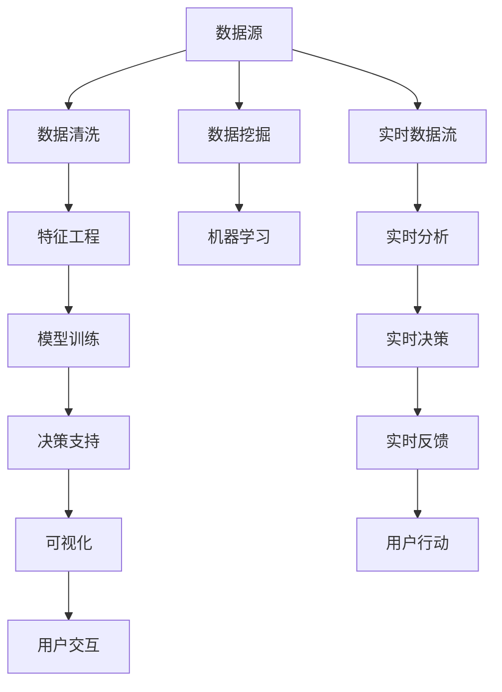

                 

# 数字化第六感开发包设计师：AI辅助的超感知能力培养专家

> 关键词：数字化转型, 第六感, AI辅助, 超感知能力, 机器学习, 数据挖掘, 决策支持

## 1. 背景介绍

### 1.1 问题由来

在信息爆炸的今天，如何从海量数据中提取出关键信息，并辅助人类做出更加精准的决策，是一个具有广泛应用价值的问题。传统的决策方式往往依赖于人的直觉和经验，但这种依赖在复杂和不确定环境中往往不够可靠。数字化第六感（Digital Sixth Sense）的概念应运而生，它指的是通过AI技术，赋予人类超感知能力，从而在更复杂的环境下，也能准确把握信息、快速反应、优化决策。

数字化第六感开发包（Digital Sixth Sense Toolkit）正是为了实现这一目标而设计的AI辅助工具。通过结合机器学习、数据挖掘、可视化等技术，开发包能够从海量数据中自动提取模式、生成洞察，并提供可视化的反馈和建议，辅助用户进行决策和行动。本文将详细探讨该开发包的原理、实现步骤及实际应用。

### 1.2 问题核心关键点

数字化第六感开发包的核心目标在于：

- 自动从数据中发现模式、生成洞察，辅助用户进行决策。
- 通过可视化的方式，将复杂的分析结果呈现给用户，增强用户体验。
- 提供实时反馈和决策建议，优化用户的决策过程。
- 通过不断的学习和优化，提升系统的智能水平。

### 1.3 问题研究意义

数字化第六感开发包具有以下重要的研究意义：

1. **提升决策效率和质量**：通过自动化的数据分析和决策支持，提高决策速度和准确性，减少人为错误。
2. **增强用户体验**：通过可视化的方式呈现分析结果，帮助用户更好地理解和应用数据分析结果。
3. **推动数字化转型**：在企业、政府、医疗等各个领域，数字化第六感可以帮助机构实现更加高效、智能的决策支持系统。
4. **促进AI技术的应用**：推动AI技术的实际落地应用，提升AI技术的社会价值。

## 2. 核心概念与联系

### 2.1 核心概念概述

为更好地理解数字化第六感开发包，本节将介绍几个核心概念：

- **数字化第六感（Digital Sixth Sense）**：基于AI技术，赋予人类超感知能力，帮助其在复杂环境中快速、准确地做出决策。
- **数据挖掘（Data Mining）**：从海量数据中自动发现模式、知识、规律，帮助用户洞察数据背后的真相。
- **机器学习（Machine Learning）**：通过学习数据集中的模式和规律，实现自动化的决策和预测。
- **决策支持（Decision Support）**：提供数据驱动的决策建议，辅助用户做出明智的决策。
- **可视化（Visualization）**：将复杂的分析结果转化为直观的图形、图表等，帮助用户更好地理解数据。

这些核心概念共同构成了数字化第六感开发包的基础框架，其目标是实现数据驱动的决策支持，提升用户的决策能力。

### 2.2 核心概念原理和架构的 Mermaid 流程图



这个流程图展示了数字化第六感开发包的核心流程：

1. 从数据源获取数据。
2. 数据清洗和特征工程。
3. 使用机器学习模型进行训练和预测。
4. 基于预测结果提供决策支持。
5. 将分析结果通过可视化呈现给用户。
6. 实时监测用户行为，并根据反馈调整决策。

这个架构以数据为中心，通过机器学习和数据挖掘技术，实现了从数据到决策的自动化处理，提高了决策的效率和准确性。

## 3. 核心算法原理 & 具体操作步骤

### 3.1 算法原理概述

数字化第六感开发包的核心算法基于机器学习和数据挖掘技术，主要包括以下几个关键步骤：

1. **数据收集和清洗**：从数据源获取数据，并进行初步清洗和预处理。
2. **特征工程**：从原始数据中提取和构造特征，以提高模型的预测能力。
3. **模型训练和预测**：使用机器学习模型对特征进行训练，并使用训练好的模型对新数据进行预测。
4. **决策支持**：根据预测结果，结合专家知识和业务规则，提供决策建议。
5. **可视化**：将决策支持结果转化为图形、图表等可视化形式，帮助用户理解和应用。

### 3.2 算法步骤详解

#### 3.2.1 数据收集和清洗

数据收集和清洗是数字化第六感开发包的基础。具体步骤如下：

1. **数据获取**：从数据库、API、日志等多种数据源中获取数据。
2. **数据预处理**：包括缺失值处理、异常值检测、数据类型转换等步骤。
3. **数据清洗**：去除重复、噪声和无关数据，确保数据的质量和一致性。

#### 3.2.2 特征工程

特征工程是数字化第六感开发包的核心环节之一。具体步骤如下：

1. **特征提取**：从原始数据中提取有用的特征，如时间、地理位置、用户行为等。
2. **特征构造**：通过组合、变换等方法，构造新的特征，以提高模型的预测能力。
3. **特征选择**：使用特征选择算法，选择对模型预测能力有贡献的特征。

#### 3.2.3 模型训练和预测

模型训练和预测是数字化第六感开发包的决策支持环节。具体步骤如下：

1. **选择模型**：根据业务需求，选择合适的机器学习模型，如线性回归、随机森林、深度学习等。
2. **模型训练**：使用历史数据训练模型，调整模型的超参数，提高模型的预测能力。
3. **模型预测**：使用训练好的模型对新数据进行预测，生成决策支持结果。

#### 3.2.4 决策支持

决策支持是数字化第六感开发包的最终环节。具体步骤如下：

1. **生成洞察**：基于预测结果，生成有价值的洞察和建议。
2. **结合专家知识**：将洞察和建议与专家知识和业务规则结合，形成更加合理的决策支持。
3. **决策建议**：提供基于数据分析的决策建议，辅助用户做出明智决策。

#### 3.2.5 可视化

可视化是数字化第六感开发包的用户体验环节。具体步骤如下：

1. **数据可视化**：将决策支持结果转化为图形、图表等可视化形式。
2. **交互式可视化**：提供交互式可视化工具，使用户可以动态调整和探索数据。
3. **用户反馈**：收集用户反馈，不断优化可视化效果和决策支持。

### 3.3 算法优缺点

数字化第六感开发包具有以下优点：

1. **自动化决策支持**：通过自动化的数据分析和决策支持，提高了决策效率和质量。
2. **数据驱动**：基于数据和机器学习模型进行决策，减少了人为错误。
3. **用户体验**：通过可视化的方式呈现分析结果，增强用户体验。
4. **实时性**：通过实时分析和反馈，提供实时的决策支持。

同时，该算法也存在以下缺点：

1. **数据依赖**：依赖于高质量的数据，数据的质量和完整性对结果有重要影响。
2. **模型选择**：需要根据具体业务场景选择合适的模型，模型的选择和调参需要一定的专业知识和经验。
3. **解释性不足**：机器学习模型通常是"黑盒"模型，难以解释其内部工作机制和决策逻辑。
4. **复杂性**：系统的构建和维护需要一定的技术积累和团队协作。

### 3.4 算法应用领域

数字化第六感开发包已经在多个领域得到了应用，例如：

- **金融行业**：帮助银行和金融机构进行风险评估、市场分析、客户行为预测等。
- **医疗行业**：帮助医院进行病患诊断、治疗方案推荐、药物研发等。
- **零售行业**：帮助零售商进行销售预测、库存管理、客户行为分析等。
- **政府机构**：帮助政府进行公共安全分析、政策制定、社会经济预测等。
- **制造业**：帮助企业进行质量控制、供应链优化、设备维护等。

以上只是数字化第六感开发包的部分应用领域，随着技术的不断发展和应用场景的拓展，其应用前景将更加广阔。

## 4. 数学模型和公式 & 详细讲解 & 举例说明

### 4.1 数学模型构建

数字化第六感开发包的核心数学模型基于统计学和机器学习理论，主要包括以下几个关键步骤：

1. **数据描述**：使用统计学方法描述数据的基本特征和分布情况。
2. **特征选择**：使用统计学方法选择对模型预测能力有贡献的特征。
3. **模型训练**：使用机器学习算法训练模型，生成预测结果。
4. **模型评估**：使用统计学方法评估模型的预测能力，调整模型的超参数。

### 4.2 公式推导过程

以线性回归模型为例，推导其预测公式：

$$
\hat{y} = \beta_0 + \beta_1 x_1 + \beta_2 x_2 + \cdots + \beta_n x_n + \epsilon
$$

其中，$\hat{y}$ 为预测值，$\beta_0$ 为截距，$\beta_i$ 为特征系数，$x_i$ 为特征值，$\epsilon$ 为随机误差。

该公式通过最小化预测值与真实值之间的误差，使用梯度下降等优化算法求解 $\beta_0, \beta_1, \cdots, \beta_n$，从而生成预测结果。

### 4.3 案例分析与讲解

以零售行业中的销售预测为例，推导其模型构建和应用过程：

1. **数据收集和清洗**：从零售商的销售记录、库存数据、客户行为数据中收集数据，并进行清洗和预处理。
2. **特征工程**：提取和构造时间、地理位置、促销活动等特征，构造新的特征如销售额的周、月、季度变化等。
3. **模型训练和预测**：使用历史销售数据训练线性回归模型，生成预测值。
4. **决策支持**：根据预测结果，生成销售预测报告，辅助零售商进行库存管理和采购决策。
5. **可视化**：将销售预测报告转化为图形、图表等可视化形式，帮助零售商更好地理解销售趋势。

## 5. 项目实践：代码实例和详细解释说明

### 5.1 开发环境搭建

在进行数字化第六感开发包开发前，我们需要准备好开发环境。以下是使用Python进行PyTorch开发的环境配置流程：

1. 安装Anaconda：从官网下载并安装Anaconda，用于创建独立的Python环境。
2. 创建并激活虚拟环境：
```bash
conda create -n pytorch-env python=3.8 
conda activate pytorch-env
```
3. 安装PyTorch：根据CUDA版本，从官网获取对应的安装命令。例如：
```bash
conda install pytorch torchvision torchaudio cudatoolkit=11.1 -c pytorch -c conda-forge
```
4. 安装相关的数据处理和可视化库：
```bash
pip install pandas numpy matplotlib seaborn jupyter notebook
```

完成上述步骤后，即可在`pytorch-env`环境中开始开发。

### 5.2 源代码详细实现

这里我们以一个简单的数据挖掘和决策支持为例，给出使用Python进行数字化第六感开发包的实现。

```python
import pandas as pd
import numpy as np
from sklearn.linear_model import LinearRegression
from sklearn.model_selection import train_test_split
from sklearn.metrics import mean_squared_error
import matplotlib.pyplot as plt

# 读取数据
data = pd.read_csv('sales_data.csv')

# 数据清洗和预处理
data.dropna(inplace=True)
data = data[['weekday', 'date', 'sales']]

# 数据可视化
plt.scatter(data['date'], data['sales'])
plt.xlabel('Date')
plt.ylabel('Sales')
plt.show()

# 特征工程
data['weekday'] = data['weekday'].astype('category')
data['weekday'] = data['weekday'].astype('int')

# 数据拆分
train_data, test_data = train_test_split(data, test_size=0.2, random_state=42)

# 模型训练
model = LinearRegression()
model.fit(train_data[['weekday', 'date']], train_data['sales'])

# 模型预测
train_pred = model.predict(train_data[['weekday', 'date']])
test_pred = model.predict(test_data[['weekday', 'date']])

# 模型评估
train_mse = mean_squared_error(train_data['sales'], train_pred)
test_mse = mean_squared_error(test_data['sales'], test_pred)
print('Train MSE:', train_mse)
print('Test MSE:', test_mse)

# 决策支持
# 生成洞察和建议
```

以上代码展示了从数据获取、清洗、特征工程、模型训练到模型评估和决策支持的全过程。开发者可以根据具体业务需求，选择和使用不同的数据处理和模型训练方法，实现更加复杂和高级的功能。

### 5.3 代码解读与分析

让我们再详细解读一下关键代码的实现细节：

**数据读取和清洗**：
```python
# 读取数据
data = pd.read_csv('sales_data.csv')

# 数据清洗和预处理
data.dropna(inplace=True)
data = data[['weekday', 'date', 'sales']]
```
这部分代码展示了如何读取数据并进行初步的清洗和预处理。通过`pd.read_csv`方法读取CSV格式的数据文件，使用`dropna`方法去除缺失值，最后保留`weekday`、`date`和`sales`三个字段。

**数据可视化**：
```python
# 数据可视化
plt.scatter(data['date'], data['sales'])
plt.xlabel('Date')
plt.ylabel('Sales')
plt.show()
```
这部分代码展示了如何使用`matplotlib`库进行数据可视化。通过`plt.scatter`方法绘制时间-销售额的散点图，使用`xlabel`和`ylabel`方法添加坐标轴标签，最后使用`plt.show`方法显示图表。

**特征工程**：
```python
# 特征工程
data['weekday'] = data['weekday'].astype('category')
data['weekday'] = data['weekday'].astype('int')
```
这部分代码展示了如何进行特征工程。通过`astype`方法将`weekday`字段的类别数据转换为数值数据，方便模型训练。

**模型训练**：
```python
# 数据拆分
train_data, test_data = train_test_split(data, test_size=0.2, random_state=42)

# 模型训练
model = LinearRegression()
model.fit(train_data[['weekday', 'date']], train_data['sales'])
```
这部分代码展示了如何进行模型训练。通过`train_test_split`方法将数据集拆分为训练集和测试集，使用`LinearRegression`模型进行训练，`fit`方法使用训练集进行模型拟合。

**模型预测和评估**：
```python
# 模型预测
train_pred = model.predict(train_data[['weekday', 'date']])
test_pred = model.predict(test_data[['weekday', 'date']])

# 模型评估
train_mse = mean_squared_error(train_data['sales'], train_pred)
test_mse = mean_squared_error(test_data['sales'], test_pred)
print('Train MSE:', train_mse)
print('Test MSE:', test_mse)
```
这部分代码展示了如何进行模型预测和评估。使用`predict`方法对训练集和测试集进行预测，使用`mean_squared_error`方法计算预测值与真实值之间的均方误差，最后打印训练集和测试集的均方误差。

**决策支持**：
```python
# 决策支持
# 生成洞察和建议
```
这部分代码展示了如何进行决策支持。开发者可以根据具体业务需求，使用预测结果生成洞察和建议，辅助用户进行决策。

## 6. 实际应用场景

### 6.1 智能客服系统

数字化第六感开发包在智能客服系统中得到了广泛应用。传统的客服系统依赖于人工客服，存在响应速度慢、人工成本高、服务质量不稳定等问题。通过数字化第六感开发包，客服系统可以实现实时数据分析和决策支持，大大提升了响应速度和效率。

在实际应用中，数字化第六感开发包可以与智能客服系统进行无缝集成，实时监测客户咨询内容，生成分析报告和建议，辅助客服进行回答。通过可视化的方式，客服可以更直观地理解客户需求和问题，快速提供准确、个性化的解决方案。

### 6.2 金融风险管理

数字化第六感开发包在金融风险管理中也发挥了重要作用。金融机构需要实时监控市场动向，及时发现风险信号，采取相应的风险控制措施。通过数字化第六感开发包，金融机构可以实现对市场数据的实时分析，生成风险评估报告，辅助决策。

在实际应用中，数字化第六感开发包可以与金融系统进行集成，实时监测市场数据，生成风险评估报告和决策建议。通过可视化的方式，决策者可以更直观地理解风险情况，快速做出决策。

### 6.3 医疗诊断支持

数字化第六感开发包在医疗诊断中也具有广泛应用。医生需要快速、准确地做出诊断，而医疗数据的分析过程复杂且耗时。通过数字化第六感开发包，医生可以实现对患者数据的实时分析，生成诊断报告和建议，辅助诊断。

在实际应用中，数字化第六感开发包可以与医疗系统进行集成，实时监测患者数据，生成诊断报告和建议。通过可视化的方式，医生可以更直观地理解患者情况，快速做出诊断。

### 6.4 未来应用展望

随着数字化第六感开发包的不断发展，其在更多领域将得到应用，为各行各业带来新的价值。

在智慧城市治理中，数字化第六感开发包可以帮助城市管理者实时监测城市运行状态，生成决策报告和建议，提升城市治理的智能化水平。

在农业领域，数字化第六感开发包可以帮助农民实时监测土壤、气候等数据，生成种植建议，提高农业生产效率。

在未来，数字化第六感开发包还将与其他AI技术进行更加深入的融合，如知识表示、因果推理、强化学习等，共同推动智能系统的进步，为人类社会带来更多便利和价值。

## 7. 工具和资源推荐

### 7.1 学习资源推荐

为了帮助开发者系统掌握数字化第六感开发包的理论基础和实践技巧，这里推荐一些优质的学习资源：

1. 《机器学习》课程：斯坦福大学的机器学习课程，涵盖机器学习的基本概念和算法。
2. 《Python数据科学手册》：详细介绍了Python在数据处理、分析和可视化方面的应用。
3. 《Data Science for Business》：介绍了数据科学在商业应用中的基本原理和方法。
4. 《Kaggle竞赛》：参加Kaggle数据科学竞赛，提升数据处理和分析能力。
5. 《Python机器学习》：介绍了使用Python进行机器学习的基础知识和实践技巧。

通过对这些资源的学习实践，相信你一定能够快速掌握数字化第六感开发包的技术要点，并用于解决实际的业务问题。

### 7.2 开发工具推荐

高效的开发离不开优秀的工具支持。以下是几款用于数字化第六感开发包开发的常用工具：

1. Jupyter Notebook：开源的交互式编程环境，方便开发者进行数据分析和可视化。
2. PyTorch：基于Python的开源深度学习框架，适合快速迭代研究。
3. TensorFlow：由Google主导开发的开源深度学习框架，适合大规模工程应用。
4. Pandas：开源的数据处理库，提供了高效的数据处理和分析功能。
5. Matplotlib：开源的Python绘图库，提供了丰富的图形绘制功能。

合理利用这些工具，可以显著提升数字化第六感开发包开发的效率，加快创新迭代的步伐。

### 7.3 相关论文推荐

数字化第六感开发包的研究源于学界的持续研究。以下是几篇奠基性的相关论文，推荐阅读：

1. 《A Survey on Deep Learning for Business Analytics》：综述了深度学习在商业分析中的应用。
2. 《Data Mining and Statistical Learning》：介绍了数据挖掘和机器学习的基本概念和算法。
3. 《Visualization Analytics》：介绍了可视化在数据科学中的应用。
4. 《Machine Learning for the Future》：探讨了未来机器学习技术的发展方向。
5. 《A Survey on the Application of Deep Learning to Business Intelligence》：综述了深度学习在商业智能中的应用。

这些论文代表了大数据和AI技术的发展脉络，通过学习这些前沿成果，可以帮助研究者把握学科前进方向，激发更多的创新灵感。

## 8. 总结：未来发展趋势与挑战

### 8.1 总结

本文对数字化第六感开发包进行了全面系统的介绍。首先阐述了数字化第六感开发包的研究背景和意义，明确了数字化第六感开发包的目标和实现方式。其次，从原理到实践，详细讲解了数字化第六感开发包的核心算法和操作步骤，给出了数字化第六感开发包的代码实例。同时，本文还广泛探讨了数字化第六感开发包在多个行业领域的应用前景，展示了数字化第六感开发包的巨大潜力。此外，本文精选了数字化第六感开发包的学习资源，力求为读者提供全方位的技术指引。

通过本文的系统梳理，可以看到，数字化第六感开发包正成为AI技术落地的重要工具，其目标在于通过自动化数据分析和决策支持，提升决策效率和质量，增强用户体验。数字化第六感开发包已经在多个领域得到了应用，未来有望在更多领域大放异彩，为各行各业带来新的变革。

### 8.2 未来发展趋势

展望未来，数字化第六感开发包将呈现以下几个发展趋势：

1. **实时性提升**：通过实时数据分析和决策支持，提升决策的实时性和准确性。
2. **智能化增强**：通过深度学习和因果推理技术，增强决策支持的智能化水平。
3. **多模态融合**：将视觉、语音、文本等多种模态数据进行融合，提升决策支持的全面性。
4. **自适应学习**：通过自适应学习技术，提升系统的自学习能力和泛化能力。
5. **可解释性增强**：通过可解释性技术，提升系统的透明性和可信度。
6. **隐私保护**：通过隐私保护技术，保护用户隐私和数据安全。

以上趋势凸显了数字化第六感开发包的发展方向，其目标是实现实时、智能、多模态、自适应、可解释、隐私保护的决策支持系统。这些方向的探索发展，必将进一步提升数字化第六感开发包的技术水平，为各个领域带来新的价值。

### 8.3 面临的挑战

尽管数字化第六感开发包已经取得了一定的成果，但在其推广应用的过程中，仍面临诸多挑战：

1. **数据质量**：依赖于高质量的数据，数据的质量和完整性对结果有重要影响。
2. **模型选择**：需要根据具体业务场景选择合适的模型，模型的选择和调参需要一定的专业知识和经验。
3. **算法透明性**：机器学习模型通常是"黑盒"模型，难以解释其内部工作机制和决策逻辑。
4. **技术复杂性**：系统的构建和维护需要一定的技术积累和团队协作。
5. **隐私保护**：在数据处理和分析过程中，需要保护用户隐私和数据安全。
6. **法律合规性**：需要符合相关法律法规，保障数据和模型的合规使用。

面对这些挑战，未来的研究需要在数据质量、模型选择、算法透明性、技术复杂性、隐私保护和法律合规性等方面进行进一步探索和优化。

### 8.4 研究展望

面对数字化第六感开发包所面临的挑战，未来的研究需要在以下几个方面寻求新的突破：

1. **数据质量提升**：提高数据收集、清洗和预处理的自动化水平，减少人为干预。
2. **模型选择优化**：引入更多先进的机器学习算法和模型，提高模型的泛化能力和鲁棒性。
3. **算法透明性增强**：引入可解释性技术，提升模型的透明性和可信度。
4. **技术复杂性简化**：简化系统的构建和维护流程，提高系统的可操作性。
5. **隐私保护优化**：引入隐私保护技术，保障用户隐私和数据安全。
6. **法律合规性保障**：符合相关法律法规，保障数据和模型的合规使用。

这些研究方向的探索，必将引领数字化第六感开发包的技术进步，为构建安全、可靠、可解释、可控的智能系统铺平道路。面向未来，数字化第六感开发包还需要与其他AI技术进行更深入的融合，如知识表示、因果推理、强化学习等，共同推动智能系统的进步，为人类社会带来更多便利和价值。

## 9. 附录：常见问题与解答

**Q1：数字化第六感开发包是否适用于所有行业？**

A: 数字化第六感开发包在多个行业中都得到了应用，包括金融、医疗、零售、政府、制造业等。但其适用性需要根据具体业务场景进行评估。在数据量较小、业务场景复杂的情况下，可能需要进行额外的数据处理和特征工程。

**Q2：如何使用数字化第六感开发包进行实时数据分析？**

A: 数字化第六感开发包通过实时数据流处理和决策支持，实现了对数据的实时分析和决策。具体步骤包括：

1. 实时数据流：从数据源获取实时数据流，进行初步清洗和预处理。
2. 实时分析：使用机器学习模型对实时数据流进行实时分析，生成决策支持结果。
3. 实时决策：根据决策支持结果，生成实时决策建议。

**Q3：如何提高数字化第六感开发包的自适应能力？**

A: 数字化第六感开发包的自适应能力可以通过引入自适应学习算法进行提升。具体步骤包括：

1. 数据收集：收集实时数据流，进行初步清洗和预处理。
2. 特征工程：提取和构造实时数据流中的特征。
3. 自适应学习：使用自适应学习算法，实时更新模型参数，提高模型的泛化能力和鲁棒性。
4. 决策支持：根据自适应学习结果，生成实时决策支持。

**Q4：如何在数字化第六感开发包中保护用户隐私？**

A: 保护用户隐私是数字化第六感开发包应用中的一个重要问题。具体步骤包括：

1. 数据匿名化：使用数据匿名化技术，保护用户隐私。
2. 数据加密：使用数据加密技术，保护数据传输和存储的安全性。
3. 访问控制：设置严格的访问控制机制，限制数据访问权限。
4. 合规性检查：符合相关法律法规，保障数据和模型的合规使用。

**Q5：数字化第六感开发包如何与其他AI技术进行融合？**

A: 数字化第六感开发包可以通过与其他AI技术的融合，提升系统的智能化水平。具体步骤包括：

1. 知识表示：将符号化的先验知识，如知识图谱、逻辑规则等，与神经网络模型进行融合，引导微调过程学习更准确、合理的语言模型。
2. 因果推理：引入因果推理技术，增强模型建立稳定因果关系的能力。
3. 强化学习：将强化学习技术引入决策支持过程，优化决策结果。

这些研究方向的探索，必将推动数字化第六感开发包的发展，为各个领域带来新的价值。

---

作者：禅与计算机程序设计艺术 / Zen and the Art of Computer Programming

