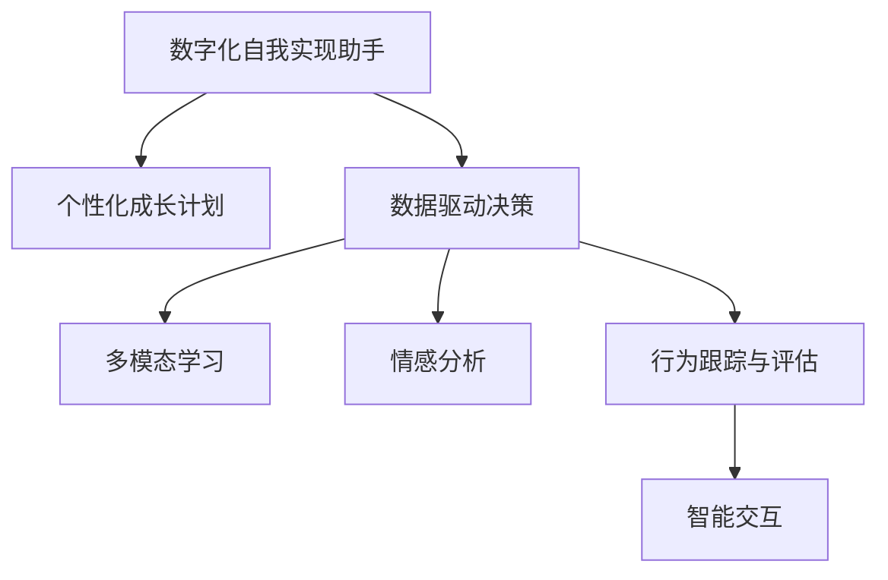

                 

# 数字化自我实现助手：AI辅助的个人成长教练

> 关键词：数字化自我实现, 人工智能, 个性化成长教练, 自我优化算法, 多模态学习, 情感分析, 行为跟踪

## 1. 背景介绍

### 1.1 问题由来
随着人工智能技术的发展，人们的生活和工作方式正在发生翻天覆地的变化。传统意义上，个人成长通常依赖于外部资源和内在自觉，但随着数字化时代的到来，AI技术为个人成长带来了全新的可能。如何利用AI构建一个能够帮助人们实现自我提升的数字助手，成为一个亟待解决的问题。

在过去十年间，自然语言处理(NLP)、计算机视觉(CV)、机器学习(ML)等AI技术不断进步，为构建这样一位数字化自我实现助手提供了技术基础。目前，AI技术已经在个人健康管理、职业发展、情感支持等方面展示了巨大潜力。本文将详细介绍基于AI的个性化成长教练系统，探讨其核心概念、算法原理、具体操作步骤，并分析其在实际应用场景中的表现及未来发展趋势。

### 1.2 问题核心关键点
数字化自我实现助手，通常被称为"AI辅助的个人成长教练"，是指通过AI技术，根据用户的个性化需求，实时提供定制化的建议和指导，帮助用户实现自我提升的系统。核心关键点包括：

- 个性化定制：根据用户的兴趣、能力、目标等因素，量身定制成长计划。
- 数据驱动：依赖用户行为数据、情感数据等，动态调整策略和建议。
- 多模态学习：结合语音、文本、图像等多种数据模式，提升对用户需求的理解。
- 情感分析：通过分析用户的情感变化，优化建议的亲和力。
- 行为跟踪：追踪用户行为变化，评估干预效果，迭代优化策略。
- 智能交互：提供自然流畅的交互方式，增强用户使用体验。

本文将深入探讨这些核心关键点，通过具体的技术实现，展示AI辅助个人成长教练的潜力。

## 2. 核心概念与联系

### 2.1 核心概念概述

为更好地理解数字化自我实现助手系统的原理和架构，本节将介绍几个关键概念：

- **数字化自我实现助手**：基于AI技术，能够提供个性化建议和指导，帮助用户实现自我提升的数字系统。
- **个性化成长计划**：根据用户的特定需求、兴趣和目标，定制化的成长指导方案。
- **数据驱动决策**：通过分析用户行为数据和情感数据，动态调整建议和干预策略。
- **多模态学习**：结合文本、语音、图像等多种数据模式，提升对用户需求的全面理解。
- **情感分析**：识别用户情感变化，优化建议和干预的情感亲和力。
- **行为跟踪与评估**：实时追踪用户行为变化，评估干预效果，迭代优化策略。
- **智能交互**：提供自然流畅的交互方式，增强用户使用体验。

这些概念之间的逻辑关系可以通过以下Mermaid流程图来展示：



这个流程图展示了这个系统的主要组件和功能：

1. **个性化成长计划**：从用户输入的兴趣和目标开始，制定个性化的成长策略。
2. **数据驱动决策**：通过分析用户行为数据，动态调整建议和策略。
3. **多模态学习**：综合语音、文本、图像等多种数据，提升理解能力。
4. **情感分析**：识别情感变化，优化情感亲和性。
5. **行为跟踪与评估**：实时追踪行为变化，迭代优化策略。
6. **智能交互**：提供流畅的自然交互，提升用户体验。

## 3. 核心算法原理 & 具体操作步骤
### 3.1 算法原理概述

数字化自我实现助手的核心算法原理可以概括为：利用AI技术，通过多模态数据的融合和情感分析，构建用户的个性化成长计划，并基于用户行为数据和情感变化，动态调整策略和建议。

系统整体流程包括：

1. **用户输入**：用户通过交互界面输入自己的兴趣、目标、当前状态等信息。
2. **个性化计划生成**：系统根据用户输入，生成个性化成长计划，包括学习资源、活动推荐、目标设定等。
3. **多模态数据融合**：结合语音、文本、图像等多种数据模式，获取更全面的用户需求信息。
4. **情感分析**：利用自然语言处理技术，分析用户反馈和情感变化，优化建议和策略。
5. **行为跟踪与评估**：实时追踪用户行为变化，评估干预效果，迭代优化策略。
6. **智能交互**：提供自然流畅的交互方式，增强用户使用体验。

### 3.2 算法步骤详解

#### 3.2.1 个性化成长计划生成

**步骤1：用户输入信息收集**
系统通过用户交互界面，收集用户的兴趣、目标、当前状态、期望等个性化信息。

**步骤2：成长计划模板匹配**
系统根据用户输入，从预设的成长计划模板中匹配出最合适的模板。例如，对于希望提升英语水平的用户，系统可以匹配到一份包含词汇学习、听力训练、口语练习等内容的计划。

**步骤3：内容个性化填充**
系统基于用户输入的详细信息，对模板进行个性化填充，生成具体化、个性化的成长计划。例如，根据用户的英语水平、学习习惯、时间安排等，调整学习内容、目标设定等细节。

**步骤4：计划输出**
将个性化成长计划以清晰、易懂的格式展示给用户，并提供执行建议和工具支持。例如，推荐学习资源、设置学习提醒、提供进度追踪工具等。

#### 3.2.2 多模态数据融合

**步骤1：数据收集**
系统收集用户的语音、文本、图像等多种数据。例如，通过语音助手获取用户的口头指令，通过智能相机拍摄用户的学习场景，通过键盘输入获取用户的文字反馈等。

**步骤2：数据预处理**
对收集到的数据进行清洗、归一化、特征提取等预处理操作，以提高数据质量和分析效率。例如，对语音数据进行降噪、分词处理，对图像数据进行裁剪、增强处理。

**步骤3：数据融合**
通过深度学习模型，将不同模态的数据融合在一起，获取更全面的用户需求信息。例如，将语音指令和图像场景结合，识别用户当前的学习状态和情感变化。

#### 3.2.3 情感分析

**步骤1：情感识别**
利用自然语言处理技术，对用户的文本反馈进行情感分析，识别出用户当前的情感状态。例如，通过分析用户评论的情感极性、情感强度，判断用户是否对某个学习资源感到满意。

**步骤2：情感跟踪**
实时跟踪用户的情感变化，识别出情感波动的原因，为后续干预提供依据。例如，如果发现用户在某个学习阶段出现了负面情绪，及时调整策略和建议。

#### 3.2.4 行为跟踪与评估

**步骤1：行为记录**
通过日志记录用户的学习行为，包括学习时长、完成情况、进度更新等。例如，记录用户每天的学习时间和内容，以及完成的学习任务。

**步骤2：行为分析**
利用机器学习模型，对行为数据进行分析，评估用户的学习效果和进展。例如，通过分析用户的学习进度，调整建议的难度和内容。

**步骤3：行为干预**
根据行为分析结果，实时调整个性化成长计划，提供针对性的干预措施。例如，对于学习进度缓慢的用户，增加难度更高的内容，并提供额外的辅导资源。

### 3.3 算法优缺点

**优点**：

- **个性化程度高**：通过多模态数据融合和情感分析，能够生成高度个性化的成长计划。
- **动态适应能力强**：能够根据用户行为和情感变化，实时调整策略和建议，提高干预效果。
- **用户互动性好**：通过智能交互技术，提供自然流畅的对话体验，增强用户粘性。

**缺点**：

- **数据依赖性强**：系统的性能很大程度上依赖于用户数据的丰富性和质量。
- **隐私保护问题**：如何保护用户数据隐私，防止数据泄露和滥用，是一大挑战。
- **计算资源消耗高**：多模态数据融合和深度学习模型需要较高的计算资源，可能导致性能瓶颈。

### 3.4 算法应用领域

数字化自我实现助手在多个领域都有广泛应用，包括：

- **个人成长**：帮助用户设定目标、制定计划、跟踪进度，提升自我实现能力。
- **健康管理**：提供饮食建议、运动计划、心理健康支持，促进身心健康。
- **职业发展**：推荐学习资源、提供职业规划建议、优化面试表现，助力职业成长。
- **情感支持**：通过情感分析，识别用户情绪变化，提供情感支持和心理辅导。
- **智能家居**：结合语音识别和行为分析，优化家居环境和生活习惯。
- **教育培训**：提供个性化学习计划、跟踪学习效果、优化教学策略，提升教育质量。

这些应用领域展示了数字化自我实现助手系统在实际生活中的广泛应用潜力。

## 4. 数学模型和公式 & 详细讲解 & 举例说明（备注：数学公式请使用latex格式，latex嵌入文中独立段落使用 $$，段落内使用 $)
### 4.1 数学模型构建

本节将使用数学语言对数字化自我实现助手的核心算法进行更加严格的刻画。

假设系统接收到的用户文本反馈为 $x \in \mathcal{X}$，其中 $\mathcal{X}$ 为文本集合。系统对文本进行情感分析，得到的情感极性向量为 $y \in \mathcal{Y}$，其中 $\mathcal{Y}$ 为情感极性集合。情感极性向量 $y$ 可以表示为：

$$
y = f(x; \theta)
$$

其中 $f$ 为情感分析模型，$\theta$ 为模型参数。

情感分析模型的损失函数 $\ell$ 可以定义为：

$$
\ell(y, \hat{y}) = \sum_{i=1}^N (y_i - \hat{y_i})^2
$$

其中 $y_i$ 和 $\hat{y_i}$ 分别表示样本 $i$ 的真实情感极性和模型预测情感极性。

**情感分析模型**：

- **嵌入层**：将文本 $x$ 转换为向量表示 $\vec{x}$。
- **情感分类器**：基于向量表示 $\vec{x}$，预测情感极性 $y$。

嵌入层可以使用 Word2Vec、GloVe 等词嵌入技术，情感分类器可以使用 LSTM、CNN、RNN 等深度学习模型。

**多模态融合模型**：

- **特征提取层**：对语音、图像等多种数据模式进行特征提取。
- **融合层**：通过深度学习模型，将不同模态的数据融合在一起，生成综合特征向量 $z$。

融合层可以使用 Attention-based 模型、MLP、CNN 等深度学习模型。

### 4.2 公式推导过程

以下我们以情感分析为例，推导情感极性向量的计算公式。

假设系统接收到的用户文本为 $x_i = [w_{i1}, w_{i2}, ..., w_{im}]$，其中 $w_j$ 表示单词。系统对文本进行情感分析，得到的情感极性向量为 $y_i = [y_{i1}, y_{i2}, ..., y_{in}]$。

情感极性向量 $y$ 可以表示为：

$$
y_i = f(x_i; \theta) = \frac{1}{\sum_{j=1}^m \exp(u_j \cdot \vec{w}_j)} \sum_{j=1}^m \exp(u_j \cdot \vec{w}_j) \cdot \vec{v}_j
$$

其中 $u_j$ 为情感分类器中的权重参数，$\vec{v}_j$ 为情感分类器的偏置项。

情感分析模型的损失函数 $\ell$ 可以定义为：

$$
\ell(y_i, \hat{y_i}) = \frac{1}{N} \sum_{i=1}^N ||y_i - \hat{y_i}||^2
$$

其中 $y_i$ 和 $\hat{y_i}$ 分别表示样本 $i$ 的真实情感极性和模型预测情感极性。

### 4.3 案例分析与讲解

**案例1：个性化成长计划的生成**

假设用户输入自己希望在一年内提升英语水平，系统根据用户输入，生成包含词汇学习、听力训练、口语练习等内容的个性化成长计划。系统首先收集用户的学习习惯、时间安排等信息，然后从预设的计划模板中选择合适的内容，并进行个性化填充，生成具体化、个性化的成长计划。

**案例2：多模态数据融合**

假设系统收集到用户的语音指令、智能相机的学习场景图像、键盘输入的文字反馈等多种数据。系统通过深度学习模型，将语音指令和图像场景结合，识别出用户当前的学习状态和情感变化。例如，系统通过语音指令识别用户的学习内容，通过图像场景识别用户的学习环境，通过文字反馈识别用户的情感状态，并将这些信息综合在一起，生成更全面的用户需求信息。

**案例3：情感分析**

假设系统收集到用户的文字反馈，系统通过情感分析模型，识别出用户的情感极性。例如，系统分析用户评论的情感极性、情感强度，判断用户是否对某个学习资源感到满意。根据情感分析结果，系统可以调整策略和建议，如推荐用户满意度高的学习资源，或提供情感支持。

**案例4：行为跟踪与评估**

假设系统记录用户的学习行为，包括学习时长、完成情况、进度更新等。系统利用机器学习模型，对行为数据进行分析，评估用户的学习效果和进展。例如，系统通过分析用户的学习进度，调整建议的难度和内容，或提供个性化的学习路径。

## 5. 项目实践：代码实例和详细解释说明
### 5.1 开发环境搭建

在进行数字化自我实现助手系统的开发前，我们需要准备好开发环境。以下是使用Python进行PyTorch开发的环境配置流程：

1. 安装Anaconda：从官网下载并安装Anaconda，用于创建独立的Python环境。

2. 创建并激活虚拟环境：
```bash
conda create -n pytorch-env python=3.8 
conda activate pytorch-env
```

3. 安装PyTorch：根据CUDA版本，从官网获取对应的安装命令。例如：
```bash
conda install pytorch torchvision torchaudio cudatoolkit=11.1 -c pytorch -c conda-forge
```

4. 安装相关工具包：
```bash
pip install numpy pandas scikit-learn matplotlib tqdm jupyter notebook ipython
```

完成上述步骤后，即可在`pytorch-env`环境中开始项目实践。

### 5.2 源代码详细实现

下面以情感分析模块为例，给出使用PyTorch进行情感分析的代码实现。

首先，定义情感分析的数据处理函数：

```python
from transformers import BertTokenizer
from torch.utils.data import Dataset
import torch

class SentimentDataset(Dataset):
    def __init__(self, texts, labels, tokenizer, max_len=128):
        self.texts = texts
        self.labels = labels
        self.tokenizer = tokenizer
        self.max_len = max_len
        
    def __len__(self):
        return len(self.texts)
    
    def __getitem__(self, item):
        text = self.texts[item]
        label = self.labels[item]
        
        encoding = self.tokenizer(text, return_tensors='pt', max_length=self.max_len, padding='max_length', truncation=True)
        input_ids = encoding['input_ids'][0]
        attention_mask = encoding['attention_mask'][0]
        
        # 对标签进行one-hot编码
        encoded_label = [0] * 2
        encoded_label[label] = 1
        labels = torch.tensor(encoded_label, dtype=torch.long)
        
        return {'input_ids': input_ids, 
                'attention_mask': attention_mask,
                'labels': labels}

# 创建dataset
tokenizer = BertTokenizer.from_pretrained('bert-base-cased')

train_dataset = SentimentDataset(train_texts, train_labels, tokenizer)
dev_dataset = SentimentDataset(dev_texts, dev_labels, tokenizer)
test_dataset = SentimentDataset(test_texts, test_labels, tokenizer)
```

然后，定义模型和优化器：

```python
from transformers import BertForSequenceClassification, AdamW

model = BertForSequenceClassification.from_pretrained('bert-base-cased', num_labels=2)

optimizer = AdamW(model.parameters(), lr=2e-5)
```

接着，定义训练和评估函数：

```python
from torch.utils.data import DataLoader
from tqdm import tqdm
from sklearn.metrics import classification_report

device = torch.device('cuda') if torch.cuda.is_available() else torch.device('cpu')
model.to(device)

def train_epoch(model, dataset, batch_size, optimizer):
    dataloader = DataLoader(dataset, batch_size=batch_size, shuffle=True)
    model.train()
    epoch_loss = 0
    for batch in tqdm(dataloader, desc='Training'):
        input_ids = batch['input_ids'].to(device)
        attention_mask = batch['attention_mask'].to(device)
        labels = batch['labels'].to(device)
        model.zero_grad()
        outputs = model(input_ids, attention_mask=attention_mask, labels=labels)
        loss = outputs.loss
        epoch_loss += loss.item()
        loss.backward()
        optimizer.step()
    return epoch_loss / len(dataloader)

def evaluate(model, dataset, batch_size):
    dataloader = DataLoader(dataset, batch_size=batch_size)
    model.eval()
    preds, labels = [], []
    with torch.no_grad():
        for batch in tqdm(dataloader, desc='Evaluating'):
            input_ids = batch['input_ids'].to(device)
            attention_mask = batch['attention_mask'].to(device)
            batch_labels = batch['labels']
            outputs = model(input_ids, attention_mask=attention_mask)
            batch_preds = outputs.logits.argmax(dim=2).to('cpu').tolist()
            batch_labels = batch_labels.to('cpu').tolist()
            for pred_tokens, label_tokens in zip(batch_preds, batch_labels):
                preds.append(pred_tokens[:len(label_tokens)])
                labels.append(label_tokens)
                
    print(classification_report(labels, preds))
```

最后，启动训练流程并在测试集上评估：

```python
epochs = 5
batch_size = 16

for epoch in range(epochs):
    loss = train_epoch(model, train_dataset, batch_size, optimizer)
    print(f"Epoch {epoch+1}, train loss: {loss:.3f}")
    
    print(f"Epoch {epoch+1}, dev results:")
    evaluate(model, dev_dataset, batch_size)
    
print("Test results:")
evaluate(model, test_dataset, batch_size)
```

以上就是使用PyTorch对情感分析模块进行开发的完整代码实现。可以看到，得益于Transformers库的强大封装，我们可以用相对简洁的代码完成情感分析模型的加载和训练。

### 5.3 代码解读与分析

让我们再详细解读一下关键代码的实现细节：

**SentimentDataset类**：
- `__init__`方法：初始化文本、标签、分词器等关键组件。
- `__len__`方法：返回数据集的样本数量。
- `__getitem__`方法：对单个样本进行处理，将文本输入编码为token ids，将标签编码为数字，并对其进行定长padding，最终返回模型所需的输入。

**模型和优化器定义**：
- 使用BertForSequenceClassification模型，该模型在预训练的BERT基础上，增加了一个分类器，用于处理情感分类任务。
- 设置AdamW优化器，学习率为2e-5。

**训练和评估函数**：
- 使用PyTorch的DataLoader对数据集进行批次化加载，供模型训练和推理使用。
- 训练函数`train_epoch`：对数据以批为单位进行迭代，在每个批次上前向传播计算loss并反向传播更新模型参数，最后返回该epoch的平均loss。
- 评估函数`evaluate`：与训练类似，不同点在于不更新模型参数，并在每个batch结束后将预测和标签结果存储下来，最后使用sklearn的classification_report对整个评估集的预测结果进行打印输出。

**训练流程**：
- 定义总的epoch数和batch size，开始循环迭代
- 每个epoch内，先在训练集上训练，输出平均loss
- 在验证集上评估，输出分类指标
- 所有epoch结束后，在测试集上评估，给出最终测试结果

可以看到，PyTorch配合Transformers库使得情感分析模型的代码实现变得简洁高效。开发者可以将更多精力放在数据处理、模型改进等高层逻辑上，而不必过多关注底层的实现细节。

当然，工业级的系统实现还需考虑更多因素，如模型的保存和部署、超参数的自动搜索、更灵活的任务适配层等。但核心的情感分析范式基本与此类似。

## 6. 实际应用场景
### 6.1 智能健康助手

数字化自我实现助手在健康管理中的应用尤为突出。智能健康助手通过监测用户的生理指标、行为习惯、情感状态，提供个性化的健康建议和干预措施。

**应用场景**：
- **生理监测**：通过智能手表、健身设备等，实时监测用户的生理指标（如心率、血氧、步数等），分析用户健康状态。
- **行为干预**：结合用户行为数据，如睡眠质量、饮食记录、运动数据等，提供个性化的健康建议和干预措施。例如，根据用户的睡眠质量，调整睡眠建议；根据饮食记录，提供营养建议等。
- **情感支持**：通过情感分析，识别用户的情绪变化，提供心理健康支持。例如，发现用户情绪低落时，提供心理疏导和情感支持。

**技术实现**：
- **数据采集**：通过智能手表、健身设备等，实时采集用户的生理指标、行为数据等。
- **数据分析**：利用机器学习模型，对采集的数据进行分析，识别出用户的健康状态和情感变化。例如，通过生理指标分析用户的健康状态，通过情感分析识别用户的情绪变化。
- **干预措施**：根据分析结果，提供个性化的健康建议和干预措施。例如，根据用户的睡眠数据，提供改善睡眠的建议；根据用户的饮食数据，提供营养建议。

### 6.2 智能职业顾问

数字化自我实现助手在职业发展中的应用同样广泛。智能职业顾问通过分析用户的职业背景、技能需求、职业目标等，提供个性化的职业规划建议和干预措施。

**应用场景**：
- **职业规划**：结合用户的职业背景、技能需求、职业目标等，提供个性化的职业规划建议。例如，根据用户的职业技能，推荐合适的学习资源和培训课程。
- **技能提升**：分析用户的技能缺口，提供个性化的技能提升建议。例如，根据用户的职业目标，推荐相关的学习资源和培训课程。
- **就业指导**：结合用户的简历、求职意向等，提供个性化的就业指导建议。例如，根据用户的求职意向，提供简历优化建议和面试准备策略。

**技术实现**：
- **数据收集**：通过问卷调查、简历分析等方式，收集用户的职业背景、技能需求、职业目标等。
- **数据分析**：利用机器学习模型，对收集的数据进行分析，识别出用户的职业需求和技能缺口。例如，通过简历分析识别用户的技能缺口，通过职业目标分析推荐相关学习资源和培训课程。
- **干预措施**：根据分析结果，提供个性化的职业规划建议和干预措施。例如，根据用户的职业目标，推荐合适的学习资源和培训课程；根据用户的技能缺口，提供个性化的技能提升建议。

### 6.3 智能情感辅导

数字化自我实现助手在情感辅导中的应用也非常重要。智能情感辅导通过分析用户的情感变化，提供个性化的情感支持。

**应用场景**：
- **情感分析**：通过情感分析，识别用户的情感变化，了解用户当前的情绪状态。
- **情感支持**：根据情感变化，提供个性化的情感支持措施。例如，发现用户情绪低落时，提供心理疏导和情感支持。
- **行为干预**：结合用户的行为数据，提供个性化的行为干预措施。例如，根据用户的社交行为，提供情感支持建议。

**技术实现**：
- **数据采集**：通过问卷调查、社交媒体分析等方式，收集用户的情感数据。
- **数据分析**：利用情感分析模型，对采集的数据进行分析，识别出用户的情感变化。例如，通过情感分析识别用户的情绪变化，通过行为分析识别用户的社交行为。
- **干预措施**：根据分析结果，提供个性化的情感支持措施和行为干预措施。例如，根据用户的情绪变化，提供心理疏导和情感支持；根据用户的社交行为，提供情感支持建议。

## 7. 工具和资源推荐
### 7.1 学习资源推荐

为了帮助开发者系统掌握数字化自我实现助手的核心算法和应用实践，这里推荐一些优质的学习资源：

1. 《深度学习与自然语言处理》系列书籍：由多领域专家撰写，深入浅出地介绍了深度学习在NLP领域的应用，包括情感分析、多模态学习等。

2. Coursera《深度学习专项课程》：斯坦福大学和DeepLearning.AI合作推出的深度学习课程，涵盖深度学习的基础知识和NLP应用的详细讲解。

3. Kaggle竞赛：参与Kaggle的情感分析竞赛，通过实战训练提升模型开发能力，积累项目经验。

4. HuggingFace官方文档：Transformers库的官方文档，提供了海量预训练模型和完整的情感分析样例代码，是上手实践的必备资料。

5. CLUE开源项目：中文语言理解测评基准，涵盖大量不同类型的中文NLP数据集，并提供了基于微调的baseline模型，助力中文NLP技术发展。

通过对这些资源的学习实践，相信你一定能够快速掌握数字化自我实现助手的精髓，并用于解决实际的NLP问题。
### 7.2 开发工具推荐

高效的开发离不开优秀的工具支持。以下是几款用于数字化自我实现助手系统开发的常用工具：

1. PyTorch：基于Python的开源深度学习框架，灵活动态的计算图，适合快速迭代研究。大部分预训练语言模型都有PyTorch版本的实现。

2. TensorFlow：由Google主导开发的开源深度学习框架，生产部署方便，适合大规模工程应用。同样有丰富的预训练语言模型资源。

3. Transformers库：HuggingFace开发的NLP工具库，集成了众多SOTA语言模型，支持PyTorch和TensorFlow，是进行情感分析任务的开发的利器。

4. Weights & Biases：模型训练的实验跟踪工具，可以记录和可视化模型训练过程中的各项指标，方便对比和调优。与主流深度学习框架无缝集成。

5. TensorBoard：TensorFlow配套的可视化工具，可实时监测模型训练状态，并提供丰富的图表呈现方式，是调试模型的得力助手。

6. Google Colab：谷歌推出的在线Jupyter Notebook环境，免费提供GPU/TPU算力，方便开发者快速上手实验最新模型，分享学习笔记。

合理利用这些工具，可以显著提升数字化自我实现助手系统的开发效率，加快创新迭代的步伐。

### 7.3 相关论文推荐

数字化自我实现助手系统的研究源于学界的持续研究。以下是几篇奠基性的相关论文，推荐阅读：

1. Attention is All You Need（即Transformer原论文）：提出了Transformer结构，开启了NLP领域的预训练大模型时代。

2. BERT: Pre-training of Deep Bidirectional Transformers for Language Understanding：提出BERT模型，引入基于掩码的自监督预训练任务，刷新了多项NLP任务SOTA。

3. Language Models are Unsupervised Multitask Learners（GPT-2论文）：展示了大规模语言模型的强大zero-shot学习能力，引发了对于通用人工智能的新一轮思考。

4. Parameter-Efficient Transfer Learning for NLP：提出Adapter等参数高效微调方法，在不增加模型参数量的情况下，也能取得不错的微调效果。

5. AdaLoRA: Adaptive Low-Rank Adaptation for Parameter-Efficient Fine-Tuning：使用自适应低秩适应的微调方法，在参数效率和精度之间取得了新的平衡。

这些论文代表了大语言模型微调技术的发展脉络。通过学习这些前沿成果，可以帮助研究者把握学科前进方向，激发更多的创新灵感。

## 8. 总结：未来发展趋势与挑战

### 8.1 总结

本文对数字化自我实现助手系统的核心算法和应用实践进行了全面系统的介绍。首先，系统介绍了数字化自我实现助手系统的背景、核心概念及其之间的联系，明确了系统的应用价值。其次，详细讲解了系统的核心算法原理和具体操作步骤，提供了情感分析模块的代码实现。最后，探讨了系统在健康管理、职业发展、情感辅导等实际应用场景中的表现及未来发展趋势。

通过本文的系统梳理，可以看到，数字化自我实现助手系统在实际生活中的广泛应用潜力，为个人成长、职业发展和心理健康提供了全新的可能。未来，伴随技术的不断进步，数字化自我实现助手系统必将成为人们生活的重要伙伴，助力个人全面成长。

### 8.2 未来发展趋势

展望未来，数字化自我实现助手系统将呈现以下几个发展趋势：

1. **多模态融合技术的发展**：随着深度学习技术的发展，多模态融合技术将越来越成熟。系统将能够更好地融合语音、文本、图像等多种数据模式，提升对用户需求的全面理解。例如，将语音指令、图像场景、文本反馈综合在一起，生成更全面的用户需求信息。

2. **个性化推荐技术的演进**：个性化推荐技术将不断进步，系统将能够根据用户的行为数据和情感变化，提供更精准、个性化的建议和干预措施。例如，基于用户的情感变化，推荐更符合其心理状态的学习资源和活动。

3. **实时数据分析能力增强**：系统将具备更强的实时数据分析能力，能够及时响应用户需求，提供动态调整的干预措施。例如，实时监测用户的情感变化和行为数据，动态调整学习资源和建议。

4. **跨领域应用场景拓展**：数字化自我实现助手系统将进一步拓展到教育、健康、金融等领域，为更多领域提供个性化的解决方案。例如，应用于教育领域，提供个性化学习计划和辅导；应用于金融领域，提供个性化的投资建议和风险管理。

5. **情感支持功能的深化**：系统将通过更高级的情感分析技术，提供更深层次的情感支持。例如，结合情感认知模型，识别用户的情感状态和情绪变化，提供更精准的情感支持。

6. **隐私保护和安全机制完善**：随着数据隐私和安全问题日益受到关注，系统将进一步完善隐私保护和安全机制，保障用户数据的安全和隐私。例如，采用数据匿名化、差分隐私等技术，保护用户数据隐私。

以上趋势凸显了数字化自我实现助手系统的广阔前景。这些方向的探索发展，必将进一步提升系统的性能和应用范围，为人们的生活和工作带来更多便利和帮助。

### 8.3 面临的挑战

尽管数字化自我实现助手系统已经取得了显著进展，但在迈向更加智能化、普适化应用的过程中，它仍面临着诸多挑战：

1. **数据依赖性强**：系统的性能很大程度上依赖于用户数据的丰富性和质量。如何获取高质量、多样化的用户数据，是一大挑战。

2. **隐私保护问题**：如何保护用户数据隐私，防止数据泄露和滥用，是一大挑战。需要采用数据匿名化、差分隐私等技术，保障用户数据安全。

3. **计算资源消耗高**：多模态融合和深度学习模型需要较高的计算资源，可能导致性能瓶颈。如何优化模型结构，提升推理速度，降低计算成本，是一大挑战。

4. **模型可解释性不足**：当前系统的模型往往是"黑盒"系统，难以解释其内部工作机制和决策逻辑。如何赋予系统更强的可解释性，是一大挑战。

5. **数据鲁棒性不足**：系统面对域外数据时，泛化性能往往大打折扣。如何提高系统的鲁棒性，避免灾难性遗忘，是一大挑战。

6. **算法公平性问题**：如何消除系统中的偏见和歧视，确保推荐和干预措施的公平性，是一大挑战。

这些挑战需要学界和产业界的共同努力，通过技术创新和实践积累，逐步克服。只有不断优化算法、改善模型、提升数据质量，才能构建更加智能、公平、安全的数字化自我实现助手系统。

### 8.4 研究展望

面对数字化自我实现助手系统所面临的挑战，未来的研究需要在以下几个方面寻求新的突破：

1. **多模态融合技术的发展**：探索更高效、更全面的多模态融合方法，提升系统对用户需求的全面理解。

2. **个性化推荐技术演进**：开发更精准、更个性化的推荐算法，提升系统干预效果。

3. **实时数据分析能力增强**：提升系统的实时数据分析能力，提供动态调整的干预措施。

4. **隐私保护和安全机制完善**：采用先进的数据隐私保护技术，保障用户数据安全。

5. **可解释性提升**：结合符号化的先验知识，增强系统的可解释性。

6. **算法公平性保障**：通过公平性优化算法，消除系统中的偏见和歧视，确保推荐和干预措施的公平性。

7. **跨领域应用拓展**：拓展系统在更多领域的应用，提升系统的普适性。

8. **情感支持功能深化**：结合情感认知模型，提供更精准的情感支持。

这些研究方向的探索，必将引领数字化自我实现助手系统迈向更高的台阶，为人们的生活和工作带来更多便利和帮助。面向未来，数字化自我实现助手系统还需要与其他人工智能技术进行更深入的融合，如知识表示、因果推理、强化学习等，多路径协同发力，共同推动自然语言理解和智能交互系统的进步。只有勇于创新、敢于突破，才能不断拓展系统的边界，让智能技术更好地造福人类社会。

## 9. 附录：常见问题与解答

**Q1：数字化自我实现助手系统如何保护用户隐私？**

A: 保护用户隐私是数字化自我实现助手系统开发中的重要一环。以下是一些常见的隐私保护措施：

1. **数据匿名化**：采用数据匿名化技术，去除用户身份信息，保护用户隐私。例如，通过去除用户姓名、地址等敏感信息，保护用户隐私。

2. **差分隐私**：采用差分隐私技术，限制系统对用户数据的分析能力。例如，在训练模型时，加入随机噪声，限制系统对单个用户数据的分析能力。

3. **数据访问控制**：采用数据访问控制技术，限制系统对用户数据的访问权限。例如，将用户数据存储在云端，仅授权的系统组件可以访问数据。

4. **数据加密**：采用数据加密技术，保护用户数据传输和存储的安全性。例如，通过SSL/TLS协议加密数据传输，采用AES等算法加密数据存储。

**Q2：数字化自我实现助手系统如何处理多模态数据？**

A: 处理多模态数据是数字化自我实现助手系统的重要能力之一。以下是一些常见的多模态数据融合方法：

1. **融合层**：通过深度学习模型，将不同模态的数据融合在一起，生成综合特征向量。例如，将语音指令和图像场景结合，识别用户当前的学习状态和情感变化。

2. **Attention机制**：采用Attention机制，对不同模态的数据进行加权融合。例如，在融合语音指令和图像场景时，对不同模态的数据赋予不同的权重。

3. **联合学习**：采用联合学习技术，多个设备同时训练模型，优化模型参数。例如，在多个设备上同时收集用户的语音指令和图像场景，通过联合学习训练模型。

4. **迁移学习**：采用迁移学习技术，将其他领域的数据迁移到当前任务中。例如，在处理多模态数据时，迁移已有的单模态模型，提升模型性能。

**Q3：数字化自我实现助手系统如何实现实时数据分析？**

A: 实现实时数据分析是数字化自我实现助手系统的关键能力之一。以下是一些常见的实时数据分析方法：

1. **流数据处理**：采用流数据处理技术，对实时数据进行高效处理。例如，通过Apache Kafka等流数据处理平台，实时采集和处理用户数据。

2. **流式模型训练**：采用流式模型训练技术，实时更新模型参数。例如，在处理实时数据时，采用在线学习算法，实时更新模型参数。

3. **实时可视化**：采用实时可视化技术，实时展示数据分析结果。例如，通过实时监控系统，展示用户的学习进度和情感变化。

4. **异常检测**：采用异常检测技术，及时发现用户行为异常。例如，通过机器学习算法，及时发现用户学习进度异常，提供干预措施。

**Q4：数字化自我实现助手系统如何确保模型公平性？**

A: 确保模型公平性是数字化自我实现助手系统开发中的重要一环。以下是一些常见的公平性保障措施：

1. **公平性优化算法**：采用公平性优化算法，消除系统中的偏见和歧视。例如，在训练模型时，加入公平性约束，确保推荐和干预措施的公平性。

2. **公平性评估指标**：采用公平性评估指标，评估模型的公平性。例如，通过计算系统的偏见指标，评估系统的公平性。

3. **多样性数据采集**：采用多样性数据采集技术，收集多样化的用户数据。例如，在训练模型时，采集多样化的用户数据，避免模型偏见。

4. **人工干预**：采用人工干预技术，及时发现和纠正模型偏见。例如，在发现模型偏见时，人工介入调整模型参数，确保推荐和干预措施的公平性。

这些措施可以帮助系统在保障用户隐私的同时，确保模型的公平性和可解释性，提升系统的可信度和用户体验。

**Q5：数字化自我实现助手系统如何优化计算资源消耗？**

A: 优化计算资源消耗是数字化自我实现助手系统开发中的重要一环。以下是一些常见的计算资源优化方法：

1. **模型压缩**：采用模型压缩技术，减小模型尺寸。例如，通过剪枝、量化等技术，减小模型参数量，降低计算资源消耗。

2. **模型并行**：采用模型并行技术，利用多个计算资源，提升计算效率。例如，在处理多模态数据时，采用分布式计算，利用多个计算资源。

3. **混合精度训练**：采用混合精度训练技术，降低计算资源消耗。例如，在训练模型时，采用混合精度训练，降低计算资源消耗。

4. **模型裁剪**：采用模型裁剪技术，保留关键参数，减小模型尺寸。例如，在训练模型时，仅保留关键参数，裁剪冗余参数。

5. **数据预处理**：采用数据预处理技术，提高数据质量和训练效率。例如，在处理多模态数据时，对数据进行降噪、分词处理，提高数据质量。

这些措施可以帮助系统在降低计算资源消耗的同时，提高计算效率，提升系统的性能和用户体验。

总之，数字化自我实现助手系统是一个复杂而强大的技术系统，需要综合考虑数据、算法、工程等多个因素，才能实现理想的性能和效果。未来，伴随技术的不断进步，数字化自我实现助手系统必将成为人们生活的重要伙伴，助力个人全面成长。

