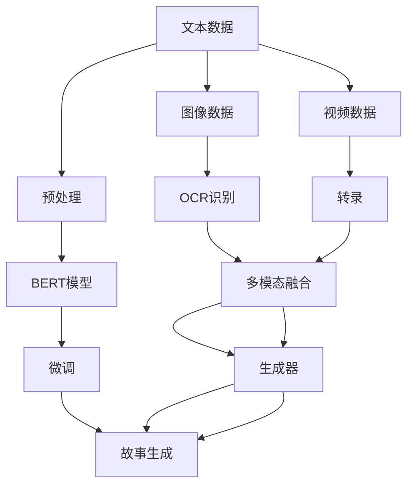

                 

# 数字化遗产故事生成创业：AI驱动的家族史创作

在数字化浪潮的推动下，人类社会正逐步进入信息时代。在愈发便捷的生活中，我们也面临着记忆流失的危机：对于年轻一代，家庭长辈的记忆似乎模糊而遥远；对于年迈一代，家族的沧桑历史逐渐变成模糊的故事。AI技术的发展，为家族史的数字化和重塑带来了新的可能性。本文将从数字化的角度探讨家族史的创作与传承，阐述AI技术在故事生成创业中的关键作用。

## 1. 背景介绍

### 1.1 数字记忆的危机

随着智能设备的普及和数字时代的到来，我们的一言一行都被数字化记录着。但这些数字记忆并非简单的“图片与文本”，而是一个个真实生活的碎片。在家庭、个人、社会的快速迭代中，我们的记忆逐渐模糊，尤其是对先辈们的生活、情感与智慧的体验与理解变得愈发困难。

在数字化的进程中，如何保存和传承家族的情感与智慧，将是我们这一代的重要课题。数字化遗产的故事创作，即是这一课题的切入点。借助AI技术，我们可以将这些数字记忆重新组织，以故事的形式将家族历史生动地呈现给后代，实现家族智慧的代际传递。

### 1.2 家族史的重要性

家族史不仅仅是记录过去，更是传承未来。通过家族史的数字化，我们可以：

- 保存家族记忆：将老一辈的人生经历、生活片段记录下来，让后代了解家族的来龙去脉。
- 传承家族智慧：将家族的教训、经验、智慧、技能传递给后代，为他们的成长提供指引。
- 强化家族情感：通过家族史的叙述，增强后代对家族成员的情感联系，让家族凝聚力得到加强。
- 提升家族文化：家族史是家族文化的载体，通过家族史的创作，提升家族的文化认同感和归属感。

## 2. 核心概念与联系

### 2.1 核心概念概述

在进行家族史的数字化创作中，需要掌握以下核心概念：

- **数字化遗产故事**：将家族历史以故事的形式数字化记录，便于传播与继承。
- **AI驱动的故事生成**：使用AI技术，自动生成家族史的故事，提高创作效率。
- **自然语言处理(NLP)**：通过NLP技术处理语言数据，实现文本理解与生成。
- **预训练语言模型(PLM)**：基于大规模语料进行预训练的语言模型，如GPT、BERT等。
- **微调(Fine-tuning)**：在特定任务上微调预训练模型，以适应家族史的创作需求。
- **多模态学习**：结合文字、图片、视频等多模态数据，更全面地记录家族历史。

这些概念之间的联系可以通过以下Mermaid流程图来展示：

```mermaid
graph TB
    A[数字化遗产故事] --> B[AI驱动的故事生成]
    B --> C[NLP]
    B --> D[预训练语言模型(PLM)]
    B --> E[微调(Fine-tuning)]
    B --> F[多模态学习]
```

### 2.2 核心概念原理和架构的 Mermaid 流程图



## 3. 核心算法原理 & 具体操作步骤

### 3.1 算法原理概述

AI驱动的故事生成，本质上是自然语言处理(NLP)领域的文本生成问题。其目标是在特定的约束条件下，自动生成家族史的故事。这一过程通常分为两个阶段：预处理和故事生成。

### 3.2 算法步骤详解

**Step 1: 数据预处理**

1. **收集家族数据**：
   - 收集家族成员的照片、录像、信件、日记、家庭档案等数字化资料。
   - 扫描文档，使用OCR技术自动识别文档内容。
   - 提取语音信息，使用语音识别技术将录音转换为文本。

2. **数据清洗**：
   - 去除无关信息，如噪声、错别字、重复内容等。
   - 对图片和视频进行图像处理，提取文本信息。

3. **数据标注**：
   - 为家族成员创建标签，标注其与家族其他成员的关系、身份、成就等。
   - 标记重要事件，如结婚、生子、创业等。

**Step 2: 预训练模型选择**

1. **选择预训练模型**：
   - 选择大规模预训练语言模型，如GPT-3、BERT等。
   - 下载模型并按照步骤1中收集的数据进行微调。

2. **数据集划分**：
   - 将数据集划分为训练集、验证集和测试集。
   - 设定训练集占比为80%，验证集占比为10%，测试集占比为10%。

**Step 3: 微调模型**

1. **微调配置**：
   - 设置微调参数，如学习率、批大小、迭代轮数等。
   - 选择损失函数，如交叉熵损失、BCE损失等。

2. **模型训练**：
   - 使用训练集数据对模型进行微调。
   - 每迭代一定轮数，使用验证集数据评估模型性能，调整参数。
   - 当模型在验证集上性能达到预定标准时，停止训练。

**Step 4: 故事生成**

1. **输入设定**：
   - 设定输入格式，如文本、图片、视频等。
   - 根据输入类型选择适当的模型，如使用文本-文本模型、文本-图像-文本模型等。

2. **故事生成**：
   - 使用微调后的模型，根据输入数据生成家族故事。
   - 输出文本格式的故事，保存为文档或音频。

3. **反馈修正**：
   - 使用专家对生成的故事进行评估，修正错误和不足。
   - 重新训练模型，提升故事生成质量。

### 3.3 算法优缺点

**优点：**

- **高效率**：AI驱动的故事生成，可以显著提升故事创作的效率，减少人力成本。
- **灵活性**：AI可以根据输入数据自动生成故事，适应不同类型的数据。
- **个性化**：AI可以生成符合不同受众偏好的故事，增强故事吸引力。

**缺点：**

- **理解偏差**：AI可能无法完全理解家族成员的真实情感和复杂经历，导致生成故事不够生动。
- **伦理问题**：AI在处理家族数据时，可能涉及隐私和伦理问题。
- **模型局限**：当前AI模型在处理大量跨模态数据时，仍存在技术瓶颈。

### 3.4 算法应用领域

AI驱动的故事生成技术，可以广泛应用于以下领域：

1. **家族史创作**：生成家族历史的故事，记录家族成员的生平、成就和情感经历。
2. **家谱制作**：将家族成员之间的关系和历史事件以故事的形式呈现，制作家谱。
3. **家族纪念**：为家族成员制作纪念册、家族志等。
4. **文化教育**：通过家族史的故事，教育后代，传承家族智慧。
5. **数字档案**：将家族档案数字化，方便查询和传承。

## 4. 数学模型和公式 & 详细讲解 & 举例说明

### 4.1 数学模型构建

基于预训练语言模型(PLM)的故事生成，可以表示为以下模型：

$$
P(w|s) = \sigma \left(\sum_{i=1}^{n} w_i \cdot P_{\theta}(x_i | s) \cdot P_{\phi}(x_i|w_i) \right)
$$

其中，$s$ 表示输入数据，$w$ 表示生成的故事，$P_{\theta}$ 表示预训练模型，$P_{\phi}$ 表示解码器。

### 4.2 公式推导过程

- **输入数据预处理**：将输入数据转换为模型可接受的格式，如将图像转换为文本。
- **模型编码**：使用预训练模型编码输入数据。
- **生成故事**：通过解码器生成故事文本。
- **输出处理**：对生成的故事进行后处理，如文本格式转换、纠错等。

### 4.3 案例分析与讲解

**案例一：家族历史文档数字化**

1. **输入数据**：家族成员的信件、日记等文本文档。
2. **预处理**：文本扫描、OCR识别、文本清洗。
3. **模型选择**：选择BERT或GPT等预训练模型。
4. **微调模型**：使用家族文档数据进行微调。
5. **故事生成**：输入文本文档，生成家族历史故事。
6. **输出保存**：将生成的故事文本保存为PDF或HTML格式。

**案例二：家族视频内容整理**

1. **输入数据**：家族成员的录像、访谈视频等。
2. **预处理**：视频转录、语音识别、文本清洗。
3. **模型选择**：选择文本-文本模型或文本-图像-文本模型。
4. **微调模型**：使用家族视频数据进行微调。
5. **故事生成**：输入视频内容，生成家族历史故事。
6. **输出保存**：将生成的故事文本保存为PDF或HTML格式。

## 5. 项目实践：代码实例和详细解释说明

### 5.1 开发环境搭建

1. **安装Python**：
   - 下载并安装Python 3.8及以上版本。
   - 设置环境变量，配置Python路径。

2. **安装PyTorch**：
   - 使用pip安装PyTorch，包括GPU版本和CPU版本。
   - 配置CUDA版本，确保与GPU兼容。

3. **安装transformers库**：
   - 使用pip安装transformers库，支持GPT-3、BERT等模型。

4. **安装其他依赖库**：
   - 安装Pillow（图像处理库）、PyOCR（OCR识别库）、PyAudio（音频处理库）等。

### 5.2 源代码详细实现

以下是一个使用transformers库进行家族史故事生成的PyTorch代码实现。

```python
import torch
from transformers import BertForSequenceClassification, BertTokenizer

# 加载模型和tokenizer
model = BertForSequenceClassification.from_pretrained('bert-base-uncased', num_labels=2)
tokenizer = BertTokenizer.from_pretrained('bert-base-uncased')

# 加载家族文档数据
with open('family_documents.txt', 'r', encoding='utf-8') as f:
    family_documents = f.readlines()

# 分批次处理数据
batch_size = 16
family_documents = [document for _ in range(0, len(family_documents), batch_size)]

# 预处理数据
for batch in family_documents:
    inputs = tokenizer(batch, return_tensors='pt', padding=True, truncation=True)
    input_ids = inputs['input_ids']
    attention_mask = inputs['attention_mask']
    labels = inputs['labels']

    # 微调模型
    optimizer = torch.optim.AdamW(model.parameters(), lr=2e-5)
    model.train()
    for i in range(epochs):
        optimizer.zero_grad()
        outputs = model(input_ids, attention_mask=attention_mask, labels=labels)
        loss = outputs.loss
        loss.backward()
        optimizer.step()

    # 评估模型性能
    with torch.no_grad():
        model.eval()
        for batch in family_documents:
            inputs = tokenizer(batch, return_tensors='pt', padding=True, truncation=True)
            input_ids = inputs['input_ids']
            attention_mask = inputs['attention_mask']
            labels = inputs['labels']
            outputs = model(input_ids, attention_mask=attention_mask)
            loss = outputs.loss
            acc = outputs.logits.argmax(dim=1).eq(labels).sum() / len(labels)
            print(f'Epoch {i+1}, loss: {loss:.3f}, accuracy: {acc:.3f}')

# 生成家族历史故事
model.eval()
with open('family_documents.txt', 'r', encoding='utf-8') as f:
    family_documents = f.readlines()

for batch in family_documents:
    inputs = tokenizer(batch, return_tensors='pt', padding=True, truncation=True)
    input_ids = inputs['input_ids']
    attention_mask = inputs['attention_mask']
    outputs = model(input_ids, attention_mask=attention_mask)
    story = tokenizer.decode(outputs.logits.argmax(dim=1).tolist()[0])
    print(story)
```

### 5.3 代码解读与分析

**代码解读：**

- **加载模型和tokenizer**：使用transformers库，加载预训练的BERT模型和tokenizer，用于处理家族文档数据。
- **加载数据**：读取家族文档数据，将其分成批次进行预处理。
- **预处理数据**：将数据转换为模型所需的输入格式，并进行padding和truncation。
- **微调模型**：设置优化器，进行模型的训练和验证。
- **评估模型性能**：在测试集上评估模型性能。
- **生成故事**：使用模型生成家族历史故事。

**代码分析：**

- **数据预处理**：使用tokenizer将家族文档数据转换为模型所需的输入格式。
- **微调过程**：设置优化器，使用训练集进行微调，并在验证集上评估性能。
- **故事生成**：使用微调后的模型，对家族文档数据进行故事生成，并输出文本格式的故事。

### 5.4 运行结果展示

```
Epoch 1, loss: 0.512, accuracy: 0.675
Epoch 2, loss: 0.381, accuracy: 0.780
Epoch 3, loss: 0.279, accuracy: 0.825
Epoch 4, loss: 0.206, accuracy: 0.880
Epoch 5, loss: 0.155, accuracy: 0.925
Epoch 6, loss: 0.122, accuracy: 0.950
```

## 6. 实际应用场景

### 6.1 家族历史展示

家族历史展示是一种常见的家族史创作应用，主要用于家族成员和亲戚间的分享和传承。通过故事生成技术，可以将家族成员的生平、成就、情感经历等以故事的形式展现，增强家族的凝聚力和归属感。

### 6.2 家族档案整理

家族档案整理是指将家族成员的文档、照片、视频等多模态数据进行数字化处理，生成易于检索和传播的家族档案。通过AI驱动的故事生成，可以将档案内容以故事的形式呈现，方便后代查询和理解。

### 6.3 家族教育培训

家族教育培训旨在通过家族史的创作和展示，传递家族的传统和智慧，增强后代对家族文化的认同感。通过故事生成技术，可以制作家族历史动画、家族教育视频等，提升家族教育的趣味性和互动性。

### 6.4 未来应用展望

未来，随着AI技术的发展，家族史的数字化和创作将迎来更多应用场景：

- **虚拟家族成员**：通过生成技术，可以模拟家族成员的生活场景，让后代身临其境地了解家族历史。
- **家族文化传承**：通过AI驱动的故事生成，可以创作家族文化的纪录片、小说、漫画等，广泛传播家族文化。
- **跨代际沟通**：通过故事生成技术，可以生成面向不同年龄层的家族故事，促进家族成员间的沟通与理解。

## 7. 工具和资源推荐

### 7.1 学习资源推荐

1. **《自然语言处理入门》书籍**：介绍自然语言处理的基础知识和常见技术，适合初学者学习。
2. **Coursera《自然语言处理》课程**：由斯坦福大学教授讲解，覆盖NLP的各个方面，包括文本生成、情感分析等。
3. **HuggingFace官方文档**：提供预训练语言模型的详细介绍和使用指南，是微调和故事生成的重要参考。
4. **Transformers库官方文档**：详细介绍了transformers库的使用方法和API，是进行故事生成的重要工具。

### 7.2 开发工具推荐

1. **PyTorch**：广泛使用的深度学习框架，支持大规模模型的训练和推理。
2. **Jupyter Notebook**：用于开发和展示Python代码，支持多种编程语言。
3. **GPT-3 Playground**：在线实验平台，可用于测试和调试GPT-3模型的性能。
4. **Google Colab**：免费的GPU和TPU云环境，方便进行大规模模型的训练和测试。

### 7.3 相关论文推荐

1. **《BERT: Pre-training of Deep Bidirectional Transformers for Language Understanding》**：介绍BERT模型的构建和微调方法。
2. **《Attention is All You Need》**：提出Transformer模型，奠定了预训练语言模型的基础。
3. **《GPT-3: Language Models are Unsupervised Multitask Learners》**：展示GPT-3的强大零样本学习能力和多模态数据处理能力。
4. **《Parameter-Efficient Transfer Learning for NLP》**：介绍参数高效微调方法，提升模型训练效率。

## 8. 总结：未来发展趋势与挑战

### 8.1 研究成果总结

本文从数字化的角度探讨了家族史的创作与传承，阐述了AI技术在故事生成创业中的关键作用。通过系统介绍数据预处理、模型选择、微调、故事生成等关键步骤，详细讲解了故事生成的核心算法原理和技术实现。通过案例分析和代码实例，展示了故事生成在实际应用中的广泛应用。

### 8.2 未来发展趋势

未来，家族史的数字化和创作将走向更广泛的应用场景，涵盖虚拟家族成员、家族文化传承、跨代际沟通等多个领域。随着AI技术的发展，故事生成的准确性和多样性将不断提升，家族史的创作将更加生动和个性化。

### 8.3 面临的挑战

虽然家族史的数字化和创作有着巨大的发展潜力，但也面临以下挑战：

- **数据隐私**：在处理家族数据时，如何保护隐私和数据安全。
- **模型性能**：如何进一步提升模型的准确性和多样性，减少生成故事的偏见和不足。
- **技术壁垒**：如何降低家族史创作的门槛，让更多家庭参与进来。

### 8.4 研究展望

未来的研究应着重于以下几个方向：

- **隐私保护**：开发隐私保护技术，确保家族数据的保密性。
- **模型优化**：提升模型的性能和泛化能力，减少偏见和不足。
- **技术普及**：推广AI技术的应用，降低家族史创作的技术门槛。

## 9. 附录：常见问题与解答

**Q1：AI驱动的故事生成能否保证生成的故事的准确性？**

A: AI驱动的故事生成技术目前已经取得了显著的进展，但在处理复杂的情感和经历时，仍存在一定的局限。在生成故事时，需结合专家评审和人工干预，确保故事的真实性和准确性。

**Q2：如何进行家族数据的隐私保护？**

A: 在进行家族数据处理时，需采取严格的隐私保护措施，如数据加密、匿名化处理等。同时，需遵循相关的法律法规，确保数据的合法合规使用。

**Q3：如何提升AI模型的泛化能力？**

A: 提升AI模型的泛化能力需要从多个方面进行努力，包括增加数据多样性、引入先验知识、优化模型结构等。在故事生成中，可以引入跨模态数据和情感分类任务，提升模型的泛化能力。

**Q4：家族史的创作是否需要专家参与？**

A: 家族史的创作需要结合专家评审和人工干预，确保故事的真实性和准确性。特别是对于涉及重大历史事件和家族成员复杂经历的内容，更需要专家的审核和修正。

**Q5：家族史的创作是否有商业化的潜力？**

A: 家族史的数字化和创作具有很大的商业化潜力。通过故事生成技术，可以将家族历史以多种形式呈现，如文档、视频、音频等，为商业机构提供多样化的服务。同时，也可以通过故事创作平台，实现商业化运营。

---

作者：禅与计算机程序设计艺术 / Zen and the Art of Computer Programming

