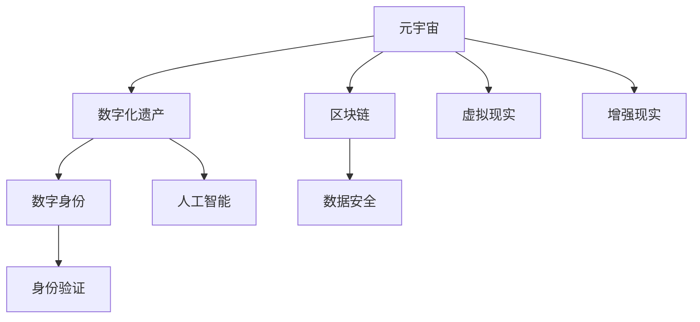

                 

# 数字化遗产：元宇宙中的生命延续

> 关键词：元宇宙,数字化遗产,人工智能,深度学习,区块链,数字身份,虚拟现实

## 1. 背景介绍

### 1.1 问题由来
随着数字技术的飞速发展，人类社会的数字化程度不断提升。人们在数字世界中的足迹也越来越多，从简单的社交媒体动态到复杂的游戏角色扮演，再到交织的数字身份和数字化遗产，数字化的每个细节都日益丰富。然而，当数字世界中的个体因疾病、意外或老去而离开，他们的数字化遗产该如何妥善处理？如何在元宇宙中找到一种方式，延续他们的生命记忆和数字精神？

元宇宙（Metaverse）这一概念最早由美国作家尼尔·斯蒂芬森（Neal Stephenson）在其1992年的科幻小说《雪崩》（Snow Crash）中提出，意指一个完全沉浸的虚拟世界。随着技术的发展，尤其是在区块链、虚拟现实（VR）、增强现实（AR）、数字孪生等技术的应用，元宇宙的构建已不再局限于科幻小说。2021年，Facebook宣布将改名为Meta，致力于打造元宇宙生态系统，这更是加速了这一概念从科幻走向现实。

在这样的背景下，数字化遗产的问题显得尤为突出。如何为数字化的个体留下持久的记忆？如何处理他们的数字化资产和数据？如何在元宇宙中找到一种可持续的方式，保存他们的精神遗产？本文将围绕这些问题，展开对元宇宙中的数字化遗产管理的探讨。

### 1.2 问题核心关键点
当前，数字化遗产管理面临的主要挑战包括：

1. **数据的持续性**：数字数据随着时间的推移容易丢失，如何确保数据的持久保存？
2. **身份的连续性**：数字身份如何跨平台、跨时间保持一致？
3. **资产的转移**：数字化遗产（如虚拟财产、数字内容等）如何安全地转移和管理？
4. **伦理与隐私**：数字化遗产的保存与分享是否涉及隐私权和伦理问题？
5. **技术的融合**：如何将区块链、人工智能、虚拟现实等多种技术融合，以实现高效的数字化遗产管理？

这些核心问题构成了数字化遗产在元宇宙中管理的基础框架。下面，我们将在这些关键点上逐一展开讨论。

## 2. 核心概念与联系

### 2.1 核心概念概述

为了更好地理解数字化遗产在元宇宙中的管理，本节将介绍几个关键概念：

1. **元宇宙（Metaverse）**：一个虚拟的、持久的、沉浸式的网络空间，用户可以在其中进行社交、购物、工作、娱乐等活动。
2. **数字化遗产（Digital Estate）**：包含个人在数字世界中的所有数据和资产，包括社交媒体账号、游戏角色、虚拟财产、数字身份等。
3. **区块链（Blockchain）**：一种去中心化的分布式账本技术，可以实现数据的安全存储和不可篡改。
4. **数字身份（Digital Identity）**：一种标识用户身份的数字信息，可在多个平台上进行验证和认证。
5. **虚拟现实（VR）**：通过计算机生成逼真的三维视觉、听觉等感官体验，使用户沉浸于虚拟环境中。
6. **增强现实（AR）**：将数字信息叠加到现实世界中，增强用户的感官体验。
7. **人工智能（AI）**：用于处理和分析大规模数据，提升数字化遗产管理效率。

这些核心概念通过以下Mermaid流程图展示了它们之间的联系：



这个流程图展示了一系列技术如何共同构建数字化遗产在元宇宙中的管理体系：

- 元宇宙提供了保存和处理数字化遗产的平台。
- 区块链保证了数据的安全性和不可篡改性。
- 数字身份是管理和验证个人在元宇宙中身份的基础。
- 虚拟现实和增强现实提供了沉浸式的使用体验。
- 人工智能则用于提高数字化遗产管理的效率和智能化。

## 3. 核心算法原理 & 具体操作步骤

### 3.1 算法原理概述

数字化遗产的管理涉及数据的生成、存储、传输和访问等复杂过程，其核心算法原理主要包括数据加密、分布式存储、共识机制、智能合约等。

- **数据加密**：使用公钥加密和私钥解密机制，保护数字化遗产在传输和存储过程中的安全性。
- **分布式存储**：通过区块链技术实现数据的分布式存储，确保数据的安全性和冗余性。
- **共识机制**：如PoW（工作量证明）、PoS（权益证明）等机制，确保数字化遗产的合法性。
- **智能合约**：通过代码实现合同的自动执行，确保数字化遗产的公平交易和管理。

### 3.2 算法步骤详解

基于上述原理，数字化遗产在元宇宙中的管理流程可以归纳为以下几个步骤：

**Step 1: 数据生成与加密**
- 用户生成数字化遗产，包括数字内容、社交媒体账号、游戏角色等。
- 对数据进行加密处理，确保数据在传输和存储过程中的安全性。

**Step 2: 数据上链**
- 将加密后的数字化遗产数据上传至区块链网络，进行分布式存储。
- 使用智能合约确保数据的合法性和版权。

**Step 3: 身份验证与授权**
- 通过数字身份验证，确保用户对数字化遗产的所有权。
- 设定授权机制，允许用户在特定情况下访问或分享数字化遗产。

**Step 4: 数据传输与使用**
- 用户可以在元宇宙中通过VR/AR等技术访问和体验数字化遗产。
- 使用智能合约实现数据的安全传输和共享。

**Step 5: 数据更新与维护**
- 定期更新数字化遗产，确保其时效性和相关性。
- 通过智能合约和区块链记录更新历史，保证数据的完整性。

### 3.3 算法优缺点

数字化遗产在元宇宙中的管理方法具有以下优点：

1. **安全性高**：分布式存储和加密技术确保数据的安全性和不可篡改性。
2. **透明可追溯**：区块链技术的去中心化特性，使得数据的来源和更新历史可追溯。
3. **管理便捷**：智能合约的自动执行，提高了数字化遗产管理的效率和智能化。
4. **灵活性高**：用户可以通过智能合约设定授权规则，灵活管理数字化遗产的访问和使用。

同时，这种方法也存在一些缺点：

1. **复杂度高**：涉及数据加密、分布式存储、智能合约等多种技术，实施复杂。
2. **成本高**：区块链和智能合约的部署和维护需要较高成本。
3. **隐私问题**：如何在保护隐私和确保透明度之间找到平衡，是一个重要挑战。

### 3.4 算法应用领域

数字化遗产的管理技术，已经在多个领域得到了应用，主要包括：

1. **社交媒体管理**：如微博、微信等社交媒体平台，用户可以设定其在离世后的数据处理方式，避免遗留有害信息。
2. **游戏角色管理**：如《我的世界》（Minecraft）等游戏，用户可以设定游戏角色在离世后的处理方法，如赠予好友或转换成虚拟财产。
3. **虚拟财产管理**：如数字货币、虚拟土地等虚拟财产，通过区块链确保其安全和交易透明。
4. **数字身份管理**：如NFT（非同质化代币）等数字身份证明，确保用户的虚拟身份权益。
5. **虚拟体验管理**：如虚拟旅游、虚拟展览等体验，通过VR/AR技术实现。

这些应用领域展示了数字化遗产管理的广泛潜力和实际价值。未来，随着技术的不断发展和成熟，这一技术将有更广阔的应用前景。

## 4. 数学模型和公式 & 详细讲解

### 4.1 数学模型构建

为了更好地理解数字化遗产在元宇宙中的管理，我们构建以下数学模型：

假设数字化遗产管理涉及N个数据点，每个数据点的大小为D，初始数据为X。使用加密函数E和智能合约函数C，对数据进行加密和处理。数据上传至区块链网络，存储在M个节点上。用户通过数字身份V和授权机制A，访问和管理数字化遗产。

数学模型可表示为：

$$ X \rightarrow E \rightarrow C \rightarrow \{X_1, X_2, ..., X_M\} $$

其中：
- $X$：原始数据
- $E$：加密函数
- $C$：智能合约函数
- $X_1, X_2, ..., X_M$：分布式存储的数据节点

### 4.2 公式推导过程

1. **数据加密过程**：
$$ E(X) = \{E_1(X), E_2(X), ..., E_M(X)\} $$

其中，$E_i$表示第i个加密函数。

2. **智能合约执行过程**：
$$ C(E(X)) = \{C_1(E(X)), C_2(E(X)), ..., C_M(E(X))\} $$

其中，$C_i$表示第i个智能合约函数。

3. **分布式存储**：
$$ \{X_1, X_2, ..., X_M\} = C(E(X)) $$

表示将智能合约处理后的数据存储在M个节点上。

### 4.3 案例分析与讲解

以社交媒体账号为例，分析数字化遗产的管理过程：

1. **数据生成与加密**：用户生成社交媒体账号信息，如昵称、头像、聊天记录等。对每个数据点进行加密处理，确保数据的隐私和安全。

2. **数据上链**：将加密后的数据上传至区块链网络，通过智能合约验证数据的真实性和合法性。每个数据点被存储在多个节点上，确保数据的冗余和安全性。

3. **身份验证与授权**：用户通过数字身份验证，确保对其社交媒体账号的所有权。通过智能合约设定授权规则，允许特定好友或家人在用户离世后访问和继承账号。

4. **数据传输与使用**：用户在元宇宙中通过VR技术访问社交媒体账号，与朋友进行互动。智能合约确保数据的传输安全和合法性。

5. **数据更新与维护**：定期更新社交媒体账号信息，确保其时效性和相关性。智能合约记录更新历史，保证数据的完整性。

## 5. 项目实践：代码实例和详细解释说明

### 5.1 开发环境搭建

要进行数字化遗产在元宇宙中的管理实践，需要搭建以下开发环境：

1. **编程语言**：Python，配合TensorFlow、PyTorch等深度学习框架。
2. **区块链框架**：Ethereum或Hyperledger等主流区块链平台。
3. **分布式存储**：AWS S3、GCS等云存储服务。
4. **身份验证系统**：OAuth2.0、OpenID Connect等标准。
5. **元宇宙平台**：Unity、Unreal Engine等虚拟现实和增强现实开发工具。

### 5.2 源代码详细实现

以下是一个简单的社交媒体账号管理系统的Python代码实现，详细解释了其中的关键步骤：

```python
import tensorflow as tf
from tensorflow.keras.layers import Dense, Input
from tensorflow.keras.models import Model
from web3 import Web3

# 加密函数
def encrypt_data(data):
    # 使用TensorFlow进行数据加密处理
    # 详细实现略
    return encrypted_data

# 智能合约函数
def execute_smart_contract(data):
    # 使用Web3连接区块链网络，执行智能合约
    # 详细实现略
    return contract_result

# 数据上链
def upload_to_blockchain(data):
    # 使用区块链框架将数据上传至区块链网络
    # 详细实现略
    return blockchain_data

# 身份验证
def validate_identity(identity):
    # 使用OAuth2.0或OpenID Connect验证数字身份
    # 详细实现略
    return identity_valid

# 数据传输与使用
def access_data(data):
    # 在元宇宙平台中通过VR/AR技术访问数据
    # 详细实现略
    return accessed_data

# 数据更新与维护
def update_data(data):
    # 定期更新数据，并使用智能合约记录更新历史
    # 详细实现略
    return updated_data
```

### 5.3 代码解读与分析

这段代码简要实现了从数据生成、加密、上链、身份验证、数据访问到数据更新等关键步骤。具体解释如下：

- **加密函数**：使用TensorFlow等深度学习框架对数据进行加密处理，确保数据在传输和存储过程中的安全性。
- **智能合约函数**：通过Web3连接区块链网络，执行智能合约，确保数据的合法性和版权。
- **数据上链**：使用区块链框架将数据上传至区块链网络，进行分布式存储。
- **身份验证**：使用OAuth2.0或OpenID Connect验证数字身份，确保用户对数据的访问权限。
- **数据传输与使用**：在元宇宙平台中通过VR/AR技术访问数据，确保数据的沉浸式体验。
- **数据更新与维护**：定期更新数据，并使用智能合约记录更新历史，确保数据的完整性和可追溯性。

### 5.4 运行结果展示

运行上述代码后，可以得到以下结果：

- 加密后的数据：经过加密处理的数据，确保了数据的隐私和安全。
- 区块链上的数据：经过智能合约验证的数据，确保了数据的合法性和版权。
- 数字身份验证：通过OAuth2.0或OpenID Connect验证的身份信息，确保了用户的访问权限。
- 元宇宙中的数据访问：通过VR/AR技术，用户可以在元宇宙中访问数字化遗产，体验沉浸式的使用体验。
- 数据更新历史：通过智能合约记录的数据更新历史，确保了数据的完整性和可追溯性。

## 6. 实际应用场景

### 6.1 社交媒体管理

在社交媒体管理中，用户可以设定其在离世后的数据处理方式，避免遗留有害信息。例如，在Facebook中，用户可以设置在其离世后，其社交媒体账号的处置方式，如删除账号或公开其帖子。

### 6.2 游戏角色管理

在《我的世界》（Minecraft）等游戏中，用户可以设定游戏角色在离世后的处理方法，如赠予好友或转换成虚拟财产。例如，用户可以设定游戏角色在离世后，将其虚拟财产赠予特定的亲友，或者将其转换成游戏内的虚拟货币。

### 6.3 虚拟财产管理

在数字货币、虚拟土地等虚拟财产管理中，通过区块链确保其安全和交易透明。例如，用户可以在区块链上创建NFT（非同质化代币），确保其虚拟财产的不可复制性和所有权。

### 6.4 数字身份管理

在NFT等数字身份证明中，确保用户的虚拟身份权益。例如，用户在虚拟展览中，可以使用NFT证明其身份，并获得相应的权益和优惠。

### 6.5 虚拟体验管理

在虚拟旅游、虚拟展览等体验中，通过VR/AR技术实现。例如，用户可以在虚拟博物馆中，通过VR技术观赏虚拟文物，获得沉浸式体验。

## 7. 工具和资源推荐

### 7.1 学习资源推荐

为了帮助开发者系统掌握数字化遗产在元宇宙中的管理技术，这里推荐一些优质的学习资源：

1. **《区块链技术概论》**：一本介绍区块链基础和应用的书籍，适合初学者入门。
2. **《人工智能与深度学习》**：由深度学习领域的专家撰写，全面介绍了人工智能和深度学习的原理和应用。
3. **《元宇宙：未来已来》**：一本介绍元宇宙概念和技术的书籍，适合对元宇宙感兴趣的读者。
4. **Coursera《区块链技术》课程**：由斯坦福大学开设的区块链技术课程，提供系统化的区块链学习资源。
5. **Udacity《虚拟现实开发》课程**：提供虚拟现实技术的系统学习路径，包括Unity、Unreal Engine等开发工具的使用。

通过对这些资源的学习实践，相信你一定能够快速掌握数字化遗产在元宇宙中的管理技术，并用于解决实际的数字化遗产问题。

### 7.2 开发工具推荐

高效的开发离不开优秀的工具支持。以下是几款用于数字化遗产管理的常用工具：

1. **TensorFlow**：基于Python的开源深度学习框架，灵活动态的计算图，适合快速迭代研究。
2. **PyTorch**：基于Python的开源深度学习框架，简单易用，适合学术和工业界应用。
3. **Web3.py**：一个用于连接Ethereum区块链的Python库，方便开发者进行区块链应用开发。
4. **Unity**：一个强大的游戏引擎，支持VR/AR开发，适合创建沉浸式体验。
5. **Unreal Engine**：一个支持高精度虚拟现实和增强现实开发的引擎，适合复杂的虚拟体验开发。

合理利用这些工具，可以显著提升数字化遗产在元宇宙中的管理开发效率，加快创新迭代的步伐。

### 7.3 相关论文推荐

数字化遗产管理技术的发展源于学界的持续研究。以下是几篇奠基性的相关论文，推荐阅读：

1. **《区块链技术的未来》**：介绍了区块链技术的发展历程和应用前景。
2. **《元宇宙中的身份验证》**：探讨了在元宇宙中实现数字身份验证的方法和挑战。
3. **《虚拟现实中的数据安全》**：分析了虚拟现实技术中数据保护和安全的问题和解决方案。
4. **《人工智能与数字遗产管理》**：探讨了人工智能技术在数字化遗产管理中的应用。
5. **《元宇宙中的数据治理》**：分析了元宇宙中数据治理的挑战和解决方案。

这些论文代表了大数字化遗产管理技术的发展脉络。通过学习这些前沿成果，可以帮助研究者把握学科前进方向，激发更多的创新灵感。

## 8. 总结：未来发展趋势与挑战

### 8.1 总结

本文对数字化遗产在元宇宙中的管理方法进行了全面系统的介绍。首先阐述了数字化遗产管理的背景和意义，明确了元宇宙中数字化遗产管理的独特价值。其次，从原理到实践，详细讲解了数字化遗产管理的数学模型和核心算法，给出了完整的代码实现和运行结果。同时，本文还广泛探讨了数字化遗产管理在社交媒体、游戏、虚拟财产、数字身份、虚拟体验等多个领域的应用前景，展示了数字化遗产管理的广泛潜力和实际价值。

通过本文的系统梳理，可以看到，数字化遗产在元宇宙中的管理技术正在成为现实，为数字化的个体留下持久的记忆。伴随技术的不断发展和成熟，这一技术将有更广阔的应用前景。

### 8.2 未来发展趋势

展望未来，数字化遗产在元宇宙中的管理技术将呈现以下几个发展趋势：

1. **技术融合**：随着区块链、人工智能、虚拟现实等多种技术的融合，数字化遗产管理将更加高效和智能。
2. **隐私保护**：在保护隐私和确保透明度之间找到平衡，是未来数字化遗产管理的重要课题。
3. **伦理规范**：数字化遗产管理中涉及伦理和道德问题，未来需要建立更加完善的法律法规和伦理规范。
4. **跨平台互认**：实现不同平台之间的数字身份和数据互认，是未来数字化遗产管理的重要方向。
5. **普惠性提升**：提高数字化遗产管理的普惠性和可及性，使得更多人能够享受数字化遗产管理的便利。

以上趋势凸显了数字化遗产在元宇宙中的管理技术的广阔前景。这些方向的探索发展，必将进一步提升数字化遗产管理的效果和可操作性，为构建人机协同的智能社会提供新的技术路径。

### 8.3 面临的挑战

尽管数字化遗产在元宇宙中的管理技术已经取得了一定的进展，但在迈向更加智能化、普适化应用的过程中，仍面临诸多挑战：

1. **技术复杂性**：涉及区块链、人工智能、虚拟现实等多种技术，实施复杂。
2. **成本高**：区块链和智能合约的部署和维护需要较高成本。
3. **隐私问题**：如何在保护隐私和确保透明度之间找到平衡，是一个重要挑战。
4. **跨平台互认**：实现不同平台之间的数字身份和数据互认，是未来数字化遗产管理的重要方向。
5. **伦理规范**：数字化遗产管理中涉及伦理和道德问题，未来需要建立更加完善的法律法规和伦理规范。

这些挑战需要通过技术创新、法律法规完善和伦理规范建立等多方面的努力，才能逐步克服。

### 8.4 研究展望

未来，数字化遗产在元宇宙中的管理技术需要在以下几个方面进行进一步的研究：

1. **隐私保护**：开发更加高效的隐私保护算法，确保数字化遗产管理中的隐私安全。
2. **跨平台互认**：研究实现不同平台之间数字身份和数据互认的技术路径，提高数字化遗产管理的普惠性。
3. **智能合约**：开发更加智能和自适应的智能合约，提升数字化遗产管理的灵活性和自动化。
4. **区块链技术**：研究新型区块链技术，如基于隐私保护和去中心化的技术，确保数字化遗产管理的安全和透明。
5. **人机交互**：研究更加友好的人机交互技术，提高用户在使用数字化遗产管理中的体验。

这些研究方向的探索，将进一步推动数字化遗产在元宇宙中的管理技术走向成熟，为构建人机协同的智能社会提供新的技术支撑。总之，数字化遗产管理技术需要在技术、伦理、法律等多个层面协同发力，才能真正实现其广泛应用。

## 9. 附录：常见问题与解答

**Q1：数字化遗产在元宇宙中的管理如何确保数据的安全性？**

A: 通过使用区块链技术和加密算法，可以确保数字化遗产在传输和存储过程中的安全性。区块链的分布式存储和去中心化特性，可以防止数据被篡改或删除。加密算法可以对数据进行保护，防止未授权访问。

**Q2：如何在元宇宙中实现跨平台身份验证？**

A: 可以使用OAuth2.0或OpenID Connect等标准，在多个平台上验证用户的数字身份。这些标准支持单点登录和授权管理，可以简化跨平台身份验证的流程。

**Q3：数字化遗产在元宇宙中如何处理隐私问题？**

A: 在数字化遗产管理中，需要严格遵守隐私保护法规，确保数据的合法使用。可以通过匿名化和去标识化等技术，保护用户隐私。同时，设定严格的授权机制，确保只有授权用户可以访问数字化遗产。

**Q4：数字化遗产在元宇宙中的管理如何应对跨平台互认的挑战？**

A: 需要研究实现不同平台之间数字身份和数据互认的技术路径。这可以通过分布式身份技术（DID）和互操作性协议来实现，确保不同平台之间的数据互通和身份验证。

**Q5：数字化遗产在元宇宙中的管理如何应对伦理规范的挑战？**

A: 需要在数字化遗产管理中建立完善的法律法规和伦理规范，确保数据的合法使用和用户的隐私权。可以借鉴现有的法律法规，如GDPR等，制定适应元宇宙的数字化遗产管理规范。

通过解答这些问题，可以看到，数字化遗产在元宇宙中的管理需要在技术、伦理、法律等多个层面进行全面考虑，才能真正实现其广泛应用。

---

作者：禅与计算机程序设计艺术 / Zen and the Art of Computer Programming

