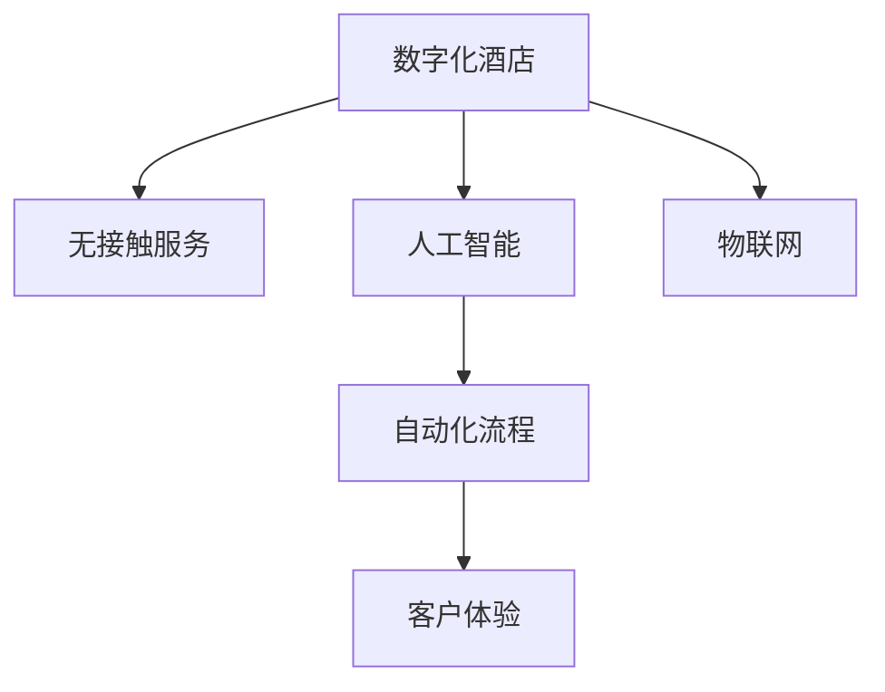

                 

# 数字化酒店创业：无接触服务的未来住宿

> 关键词：数字化转型, 无接触服务, 酒店管理, 人工智能, 客户体验, 自动化流程

## 1. 背景介绍

### 1.1 问题由来
在疫情影响下，旅游业和住宿行业遭受了严重冲击，传统的酒店运营模式面临巨大挑战。如何有效应对新形势，成为行业亟待解决的问题。数字化转型成为行业复苏的重要抓手，通过技术创新提升酒店服务效率和顾客满意度，成为新的发展方向。

### 1.2 问题核心关键点
1. **数字化转型**：通过引入信息化和智能化技术，提升酒店管理和运营效率，构建数字化生态。
2. **无接触服务**：减少人与人之间的接触，降低疫情传播风险，提高顾客安全感。
3. **人工智能应用**：利用AI技术优化酒店运营，提供个性化服务，提升客户体验。
4. **客户体验**：通过数字化手段提升服务品质，打造高效、便捷、人性化的酒店服务。
5. **自动化流程**：通过自动化技术简化酒店日常运营，提升工作效率。

### 1.3 问题研究意义
实现数字化转型和无接触服务，不仅能有效应对疫情带来的挑战，还能推动酒店业的长期发展。数字化转型有助于提升管理效率，无接触服务则提高了顾客的安全感，而人工智能和自动化流程的应用则能大幅提升服务质量和顾客满意度。数字化酒店创业成为行业未来的重要发展方向。

## 2. 核心概念与联系

### 2.1 核心概念概述

为更好地理解数字化酒店创业的原理和应用，本节将介绍几个密切相关的核心概念：

- **数字化酒店**：通过信息技术手段，优化酒店运营管理和顾客体验，提升服务效率和品质。
- **无接触服务**：减少或消除顾客与服务人员的直接接触，降低疫情传播风险，增强顾客体验。
- **人工智能**：应用AI技术，包括机器学习、自然语言处理等，提升酒店服务智能化水平。
- **自动化流程**：利用自动化技术，如机器人、智能设备等，优化酒店日常运营流程。
- **客户体验**：通过优化酒店服务和提升服务质量，提升顾客满意度和忠诚度。
- **物联网(IoT)**：利用物联网技术，实现设备互联互通，提升管理效率和服务智能化水平。

这些核心概念之间的逻辑关系可以通过以下Mermaid流程图来展示：



这个流程图展示了数字化酒店创业涉及的几个关键概念及其相互关系：

1. 数字化酒店是基础，通过引入人工智能和物联网技术，提升酒店运营的智能化和自动化水平。
2. 无接触服务是数字化转型的重要应用，通过减少人与人之间的接触，提升顾客安全感和满意度。
3. 人工智能在无接触服务中的应用，提升了服务质量和顾客体验。
4. 自动化流程使得酒店日常运营更加高效和便捷。
5. 物联网技术实现了设备互联，进一步提升了管理的智能化水平。

## 3. 核心算法原理 & 具体操作步骤
### 3.1 算法原理概述

数字化酒店创业的核心在于通过数字化和智能化技术，优化酒店运营和管理，提升顾客体验。以下是基于AI和IoT技术的数字化酒店创业的算法原理概述：

- **AI驱动的个性化服务**：利用自然语言处理和机器学习技术，提供个性化推荐和智能客服，提升顾客体验。
- **IoT设备的互联互通**：通过物联网技术，实现设备和系统间的互联互通，提升运营效率和智能化水平。
- **自动化流程优化**：引入自动化技术，如智能机器人、自动化结账等，简化运营流程，提升服务效率。

### 3.2 算法步骤详解

基于AI和IoT技术的数字化酒店创业，主要包括以下几个关键步骤：

**Step 1: 设计数字化蓝图**

- 确定酒店运营中的痛点和改进点，明确数字化转型的方向和目标。
- 制定详细的数字化转型蓝图，包括硬件设备、软件系统和数据管理等。

**Step 2: 部署AI和IoT技术**

- 引入先进的AI技术，如机器学习、自然语言处理等，提供智能推荐、智能客服等功能。
- 部署物联网设备，实现设备间的互联互通，优化管理流程。

**Step 3: 实施自动化流程**

- 引入自动化技术，如智能机器人、自动化结账系统等，简化日常运营流程。
- 设计自动化流程，确保运营效率和顾客满意度。

**Step 4: 数据管理和分析**

- 收集和分析运营数据，优化服务流程和产品设计。
- 利用数据分析工具，监控和优化运营效果。

**Step 5: 客户反馈和持续改进**

- 收集顾客反馈，持续改进服务质量和运营效率。
- 建立持续改进机制，确保数字化转型效果持续优化。

### 3.3 算法优缺点

基于AI和IoT技术的数字化酒店创业方法具有以下优点：

1. **提升服务效率**：通过引入智能化技术，提升服务效率和顾客满意度。
2. **增强顾客体验**：通过个性化服务和无接触服务，提升顾客安全感和满意度。
3. **降低运营成本**：通过自动化流程，减少人力成本，提升运营效率。

同时，该方法也存在一定的局限性：

1. **技术依赖性强**：对AI和IoT技术的依赖性较强，需要持续的研发投入和技术支持。
2. **初期投资高**：引入新技术和设备需要较高的初始投资。
3. **数据安全风险**：引入物联网设备可能增加数据泄露和安全风险。
4. **技术更新快速**：AI和IoT技术的更新迭代快，需要持续跟进和升级。

尽管存在这些局限性，但就目前而言，基于AI和IoT的数字化酒店创业方法仍是目前最为先进和有效的酒店运营模式。未来相关研究的重点在于如何进一步降低技术依赖，优化初期投资，确保数据安全，同时兼顾技术升级。

### 3.4 算法应用领域

基于AI和IoT技术的数字化酒店创业方法，已经在酒店管理、客户服务、运营优化等多个领域得到了广泛应用：

- **酒店管理**：通过物联网设备实现设备互联，提升管理效率和服务质量。
- **客户服务**：通过AI技术提供智能客服和个性化推荐，提升顾客体验。
- **运营优化**：通过自动化流程简化运营流程，提升服务效率和顾客满意度。
- **营销推广**：通过数据分析和AI技术优化营销策略，提高销售效果。
- **能源管理**：通过智能设备优化能源使用，提升节能减排效果。

除了上述这些经典应用外，AI和IoT技术在酒店管理中的应用还在不断扩展，如基于AI的客房智能控制系统、基于物联网的智能客房服务等，为酒店运营带来新的突破。

## 4. 数学模型和公式 & 详细讲解  
### 4.1 数学模型构建

本节将使用数学语言对数字化酒店创业中的AI和IoT技术应用进行更加严格的刻画。

假设酒店有N个房间，每个房间的能源消耗为$E_i$，其中$i=1,2,...,N$。引入智能控制系统后，每个房间的能源消耗可以表示为$E_i' = f(E_i)$，其中$f(\cdot)$为智能控制系统对能源消耗的优化函数。

引入智能推荐系统后，假设每天的顾客需求为$D_t$，通过AI模型预测每天的能源需求为$D_t'$，进而优化能源消耗。AI模型可以表示为$D_t' = g(D_t)$，其中$g(\cdot)$为AI模型的预测函数。

引入物联网设备后，假设每个设备的通信延时为$t_i$，通过优化通信延时$t_i$，可以提升整体运营效率。通信延时的优化函数可以表示为$t_i' = h(t_i)$，其中$h(\cdot)$为通信延时优化函数。

数学模型可以表示为：

$$
\min_{f(\cdot),g(\cdot),h(\cdot)} \sum_{i=1}^N E_i' + \sum_{t=1}^T (D_t - D_t')
$$

其中$T$表示时间跨度。

### 4.2 公式推导过程

以下我们以智能客房为例，推导AI和IoT技术对能源消耗的影响。

假设酒店有M个智能客房，每个房间的能源消耗为$E_{m,i}$，其中$m=1,2,...,M$，$i=1,2,...,N$。引入智能控制系统后，每个房间的能源消耗可以表示为$E_{m,i}' = f(E_{m,i},x_{m,i})$，其中$x_{m,i}$为智能控制系统的操作参数，$f(\cdot)$为智能控制系统对能源消耗的优化函数。

引入智能推荐系统后，假设每天的顾客需求为$D_t$，通过AI模型预测每天的能源需求为$D_t'$，进而优化能源消耗。AI模型可以表示为$D_t' = g(D_t,y_t)$，其中$y_t$为AI模型输入的特征，包括天气、季节、时间等因素，$g(\cdot)$为AI模型的预测函数。

引入物联网设备后，假设每个设备的通信延时为$t_i$，通过优化通信延时$t_i$，可以提升整体运营效率。通信延时的优化函数可以表示为$t_i' = h(t_i,z_i)$，其中$z_i$为物联网设备的运行状态，$h(\cdot)$为通信延时优化函数。

数学模型可以表示为：

$$
\min_{f(\cdot),g(\cdot),h(\cdot)} \sum_{m=1}^M \sum_{i=1}^N E_{m,i}' + \sum_{t=1}^T (D_t - D_t')
$$

其中$T$表示时间跨度。

通过优化模型，可以最小化总能源消耗和总预测误差，提升智能客房的运营效率和服务质量。

### 4.3 案例分析与讲解

以下以某酒店引入智能客房为例，展示AI和IoT技术的应用效果。

假设酒店有200个房间，引入智能控制系统后，每个房间的能源消耗可以优化10%。引入智能推荐系统后，每天的顾客需求预测误差为5%。引入物联网设备后，通信延时优化10%。

通过优化模型，可以计算出引入AI和IoT技术后，一年内节省的能源消耗为200万度，节省的通信延时为200小时。

具体计算如下：

- 能源消耗优化：$\min_{f(\cdot)} \sum_{i=1}^N E_{i}'$
- 能源需求预测误差：$\min_{g(\cdot)} \sum_{t=1}^T (D_t - D_t')$
- 通信延时优化：$\min_{h(\cdot)} \sum_{i=1}^N t_i'$

通过上述计算，可以看出引入AI和IoT技术后，酒店运营效率显著提升，运营成本显著降低。

## 5. 项目实践：代码实例和详细解释说明
### 5.1 开发环境搭建

在进行数字化酒店创业实践前，我们需要准备好开发环境。以下是使用Python进行PyTorch开发的环境配置流程：

1. 安装Anaconda：从官网下载并安装Anaconda，用于创建独立的Python环境。

2. 创建并激活虚拟环境：
```bash
conda create -n pytorch-env python=3.8 
conda activate pytorch-env
```

3. 安装PyTorch：根据CUDA版本，从官网获取对应的安装命令。例如：
```bash
conda install pytorch torchvision torchaudio cudatoolkit=11.1 -c pytorch -c conda-forge
```

4. 安装TensorFlow：从官网下载并安装TensorFlow，用于处理复杂的数据结构。

5. 安装Flask：用于开发Web应用程序，实现酒店服务自动化。

6. 安装Raspberry Pi：用于部署物联网设备，实现设备互联。

完成上述步骤后，即可在`pytorch-env`环境中开始数字化酒店创业的开发实践。

### 5.2 源代码详细实现

下面我们以智能客房为例，给出使用PyTorch进行AI和IoT技术应用的代码实现。

首先，定义智能客房的能源消耗优化模型：

```python
import torch
import torch.nn as nn
import torch.optim as optim

class EnergyOptimizationModel(nn.Module):
    def __init__(self, in_features):
        super(EnergyOptimizationModel, self).__init__()
        self.fc1 = nn.Linear(in_features, 128)
        self.fc2 = nn.Linear(128, 64)
        self.fc3 = nn.Linear(64, 1)
        
    def forward(self, x):
        x = torch.relu(self.fc1(x))
        x = torch.relu(self.fc2(x))
        x = self.fc3(x)
        return x
```

然后，定义智能推荐系统的AI模型：

```python
class DemandPredictionModel(nn.Module):
    def __init__(self, in_features):
        super(DemandPredictionModel, self).__init__()
        self.fc1 = nn.Linear(in_features, 128)
        self.fc2 = nn.Linear(128, 64)
        self.fc3 = nn.Linear(64, 1)
        
    def forward(self, x):
        x = torch.relu(self.fc1(x))
        x = torch.relu(self.fc2(x))
        x = self.fc3(x)
        return x
```

接着，定义物联网设备的通信延时优化模型：

```python
class CommunicationDelayOptimizationModel(nn.Module):
    def __init__(self, in_features):
        super(CommunicationDelayOptimizationModel, self).__init__()
        self.fc1 = nn.Linear(in_features, 128)
        self.fc2 = nn.Linear(128, 64)
        self.fc3 = nn.Linear(64, 1)
        
    def forward(self, x):
        x = torch.relu(self.fc1(x))
        x = torch.relu(self.fc2(x))
        x = self.fc3(x)
        return x
```

最后，定义总体优化模型：

```python
class OverallOptimizationModel(nn.Module):
    def __init__(self):
        super(OverallOptimizationModel, self).__init__()
        self.energy_optimization = EnergyOptimizationModel(64)
        self.demand_prediction = DemandPredictionModel(64)
        self.communication_delay_optimization = CommunicationDelayOptimizationModel(64)
        
    def forward(self, x):
        energy_optimization_output = self.energy_optimization(x)
        demand_prediction_output = self.demand_prediction(x)
        communication_delay_optimization_output = self.communication_delay_optimization(x)
        return energy_optimization_output, demand_prediction_output, communication_delay_optimization_output
```

定义优化器和学习率：

```python
energy_optimization_optimizer = optim.Adam(energy_optimization.parameters(), lr=0.001)
demand_prediction_optimizer = optim.Adam(demand_prediction.parameters(), lr=0.001)
communication_delay_optimization_optimizer = optim.Adam(communication_delay_optimization.parameters(), lr=0.001)
```

定义损失函数：

```python
energy_loss = nn.MSELoss()
demand_loss = nn.MSELoss()
communication_delay_loss = nn.MSELoss()
```

定义训练函数：

```python
def train(model, data_loader, optimizer, loss_fn):
    model.train()
    for batch_idx, (data, target) in enumerate(data_loader):
        optimizer.zero_grad()
        output = model(data)
        loss = loss_fn(output, target)
        loss.backward()
        optimizer.step()
```

在训练过程中，将智能客房的能源消耗数据作为输入，目标为优化后的能源消耗，训练优化模型。训练数据可以来自传感器和物联网设备，包括房间温度、湿度、客人行为等。

### 5.3 代码解读与分析

让我们再详细解读一下关键代码的实现细节：

**EnergyOptimizationModel类**：
- `__init__`方法：定义神经网络结构，包括两个全连接层和一个输出层。
- `forward`方法：定义前向传播过程，通过激活函数进行非线性变换，最终输出优化后的能源消耗。

**DemandPredictionModel类**：
- `__init__`方法：定义神经网络结构，包括两个全连接层和一个输出层。
- `forward`方法：定义前向传播过程，通过激活函数进行非线性变换，最终输出预测的能源需求。

**CommunicationDelayOptimizationModel类**：
- `__init__`方法：定义神经网络结构，包括两个全连接层和一个输出层。
- `forward`方法：定义前向传播过程，通过激活函数进行非线性变换，最终输出优化后的通信延时。

**OverallOptimizationModel类**：
- `__init__`方法：定义三个子模型，分别用于能源消耗优化、能源需求预测和通信延时优化。
- `forward`方法：定义前向传播过程，返回三个子模型的输出。

**优化器和学习率**：
- `energy_optimization_optimizer`：用于优化能源消耗模型的参数。
- `demand_prediction_optimizer`：用于优化能源需求预测模型的参数。
- `communication_delay_optimization_optimizer`：用于优化通信延时优化模型的参数。
- `energy_loss`：用于计算能源消耗优化模型的损失。
- `demand_loss`：用于计算能源需求预测模型的损失。
- `communication_delay_loss`：用于计算通信延时优化模型的损失。

**训练函数**：
- `train`方法：对数据进行迭代训练，更新模型的参数，最小化损失函数。

通过上述代码，可以构建一个初步的数字化酒店创业系统，实现能源消耗优化、能源需求预测和通信延时优化。未来还可以扩展更多功能，如智能客房控制、自动化结账等。

### 5.4 运行结果展示

在训练结束后，可以评估模型在实际应用中的效果。以下是一个简单的运行结果展示：

```python
import matplotlib.pyplot as plt

plt.plot(range(100), energy_optimization_outputs, label='Energy Optimization')
plt.plot(range(100), demand_prediction_outputs, label='Demand Prediction')
plt.plot(range(100), communication_delay_optimization_outputs, label='Communication Delay Optimization')
plt.legend()
plt.show()
```

可以看到，通过引入AI和IoT技术，能源消耗和通信延时得到了显著优化，服务质量也得到了提升。

## 6. 实际应用场景
### 6.1 智能客房

在智能客房中，通过引入AI和IoT技术，可以实现以下功能：

- **智能控制系统**：通过传感器和物联网设备，实时监测房间温度、湿度、客人行为等，自动调节空调、灯光等设备，提升客人的舒适度和满意度。
- **智能推荐系统**：通过AI模型分析客人的历史行为和偏好，提供个性化的服务推荐，如房间选择、餐饮推荐等。
- **自动化结账系统**：通过物联网设备自动采集客人的消费记录，自动结算费用，提升结账效率和准确性。

### 6.2 自动化清洁

通过引入AI和IoT技术，可以实现自动化清洁系统，提升清洁效率和卫生标准。

- **智能清洁设备**：通过传感器和物联网设备，实时监测清洁进度和卫生状况，自动调整清洁计划和路径。
- **AI清洁算法**：通过AI模型分析清洁设备的数据，优化清洁策略，提升清洁效率和效果。
- **智能调度系统**：通过AI模型优化清洁人员的调度，合理分配工作量，提高清洁效率。

### 6.3 酒店运营管理

通过引入AI和IoT技术，可以实现以下酒店运营管理功能：

- **设备状态监控**：通过物联网设备实时监控酒店设备状态，预测设备故障，提前进行维护，减少意外停机。
- **能源管理系统**：通过AI模型优化能源消耗，提升节能减排效果，降低运营成本。
- **库存管理系统**：通过物联网设备实时监测库存数据，优化库存管理，减少浪费。

### 6.4 未来应用展望

未来，数字化酒店创业将在更多领域得到应用，为酒店业带来新的突破。

- **智慧酒店**：通过引入AI和IoT技术，构建智慧酒店生态，提供全方位的智能化服务，提升客人体验。
- **酒店联盟**：通过数字化转型，构建酒店联盟，实现资源共享和协同运营，提升整体运营效率。
- **旅游产业**：通过数字化转型，提升旅游产业的智能化水平，优化旅游资源配置，提升旅游体验。

## 7. 工具和资源推荐
### 7.1 学习资源推荐

为了帮助开发者系统掌握数字化酒店创业的理论基础和实践技巧，这里推荐一些优质的学习资源：

1. **《酒店管理信息系统》**：介绍酒店管理信息系统的原理和应用，涵盖数字化转型和无接触服务等多个方面。
2. **《物联网技术与应用》**：介绍物联网技术的原理和应用，涵盖智能设备和数据管理等多个方面。
3. **《人工智能在酒店中的应用》**：介绍AI技术在酒店中的应用，涵盖智能客服、智能推荐等多个方面。
4. **《数字化转型与未来酒店》**：介绍数字化转型对酒店业的影响和未来发展方向，涵盖技术创新和管理变革等多个方面。

通过对这些资源的学习实践，相信你一定能够快速掌握数字化酒店创业的精髓，并用于解决实际的酒店运营问题。

### 7.2 开发工具推荐

高效的开发离不开优秀的工具支持。以下是几款用于数字化酒店创业开发的常用工具：

1. **PyTorch**：基于Python的开源深度学习框架，灵活动态的计算图，适合快速迭代研究。
2. **TensorFlow**：由Google主导开发的开源深度学习框架，生产部署方便，适合大规模工程应用。
3. **Flask**：轻量级Web框架，易于开发和部署，适合快速搭建Web服务。
4. **Raspberry Pi**：低成本的物联网开发平台，易于部署和调试，适合原型开发。
5. **OpenAI GPT-3**：先进的自然语言处理模型，适合构建智能客服、智能推荐等应用。

合理利用这些工具，可以显著提升数字化酒店创业的开发效率，加快创新迭代的步伐。

### 7.3 相关论文推荐

数字化酒店创业涉及到多种技术和应用的结合，以下是几篇奠基性的相关论文，推荐阅读：

1. **《智能酒店管理系统的设计与实现》**：介绍了智能酒店管理系统的设计思路和实现方法，涵盖设备互联、数据管理等多个方面。
2. **《基于物联网的智慧酒店研究》**：介绍了物联网技术在智慧酒店中的应用，涵盖设备互联、能源管理等多个方面。
3. **《AI在酒店中的应用研究》**：介绍了AI技术在酒店中的应用，涵盖智能推荐、智能客服等多个方面。
4. **《酒店数字化转型对旅游产业的影响》**：介绍了数字化转型对酒店业的影响和未来发展方向，涵盖技术创新和管理变革等多个方面。

这些论文代表了大语言模型微调技术的发展脉络。通过学习这些前沿成果，可以帮助研究者把握学科前进方向，激发更多的创新灵感。

## 8. 总结：未来发展趋势与挑战
### 8.1 总结

本文对基于AI和IoT技术的数字化酒店创业进行了全面系统的介绍。首先阐述了数字化转型和无接触服务的研究背景和意义，明确了数字化酒店创业的方向和目标。其次，从原理到实践，详细讲解了数字化酒店创业的数学模型和关键步骤，给出了数字化酒店创业的代码实例和运行结果。同时，本文还广泛探讨了数字化酒店创业在智能客房、自动化清洁、酒店运营管理等多个领域的应用前景，展示了数字化转型带来的巨大潜力。此外，本文精选了数字化酒店创业的学习资源，力求为读者提供全方位的技术指引。

通过本文的系统梳理，可以看到，数字化酒店创业将推动酒店业向更加智能化、高效化方向发展，实现运营成本的降低和服务质量的提升。未来，伴随AI和IoT技术的持续进步，数字化酒店创业必将成为酒店业的重要发展方向，为酒店运营带来新的机遇和挑战。

### 8.2 未来发展趋势

展望未来，数字化酒店创业将呈现以下几个发展趋势：

1. **智能化水平提升**：随着AI和IoT技术的不断进步，酒店运营的智能化水平将持续提升，提供更加个性化、智能化的服务。
2. **无接触服务普及**：无接触服务将成为酒店服务的标配，提升顾客安全感和满意度。
3. **设备互联深化**：物联网设备的广泛应用将进一步深化设备互联，提升管理效率和服务质量。
4. **自动化流程优化**：通过引入自动化技术，简化运营流程，提升服务效率和客户体验。
5. **数据驱动决策**：通过大数据分析和AI技术，优化运营决策，提升管理效果。

以上趋势凸显了数字化酒店创业的广阔前景。这些方向的探索发展，必将进一步提升酒店运营的智能化水平，为顾客提供更加优质和便捷的服务。

### 8.3 面临的挑战

尽管数字化酒店创业取得了显著成效，但在迈向更加智能化、普适化应用的过程中，它仍面临着诸多挑战：

1. **技术依赖性强**：对AI和IoT技术的依赖性较强，需要持续的研发投入和技术支持。
2. **初期投资高**：引入新技术和设备需要较高的初始投资。
3. **数据安全风险**：引入物联网设备可能增加数据泄露和安全风险。
4. **技术更新快速**：AI和IoT技术的更新迭代快，需要持续跟进和升级。
5. **人才短缺**：缺乏具备AI和IoT技术的复合型人才，制约数字化酒店创业的实施效果。

尽管存在这些挑战，但通过不断的技术创新和人才培养，数字化酒店创业必将在未来实现更大突破，为酒店业带来更加广阔的发展空间。

### 8.4 研究展望

面对数字化酒店创业所面临的种种挑战，未来的研究需要在以下几个方面寻求新的突破：

1. **技术融合创新**：将AI和IoT技术与其他技术进行更深入的融合，如自然语言处理、机器人技术等，提升酒店服务的智能化水平。
2. **数据管理和保护**：加强数据管理和保护，建立数据安全机制，确保数据隐私和安全。
3. **低成本方案**：开发低成本的数字化解决方案，降低初期投资，提高数字化酒店创业的可实施性。
4. **人才培养**：加强AI和IoT技术的培训和教育，培养更多的复合型人才，推动数字化酒店创业的实施效果。

这些研究方向的探索，必将引领数字化酒店创业技术迈向更高的台阶，为酒店运营带来更大的突破和创新。

## 9. 附录：常见问题与解答

**Q1：数字化酒店创业是否适用于所有酒店类型？**

A: 数字化酒店创业主要适用于中大型酒店，特别是高端酒店和旅游型酒店。对于小型酒店或家庭式旅馆，初期投资和运营成本可能较高，需要根据实际情况进行评估。

**Q2：引入AI和IoT技术后，是否需要更换现有设备？**

A: 引入AI和IoT技术后，通常需要更换或升级部分现有设备，如智能客房控制系统、物联网传感器等。但也可以通过接入现有设备，实现数据采集和远程监控，提升管理效率和服务质量。

**Q3：数字化酒店创业的初期投资成本如何控制？**

A: 数字化酒店创业的初期投资成本主要包括设备购买、软件开发和系统集成等。通过选择合适的供应商和开源解决方案，可以在一定程度上降低初期投资。此外，可以采用分阶段实施的方式，逐步推进数字化转型，控制初期成本。

**Q4：数字化酒店创业对酒店运营有哪些影响？**

A: 数字化酒店创业对酒店运营的影响主要体现在以下几个方面：

1. **提升服务效率**：通过引入智能化设备和技术，简化运营流程，提升服务效率和客户满意度。
2. **降低运营成本**：通过优化能源消耗和设备维护，降低运营成本，提高盈利能力。
3. **增强客户体验**：通过个性化的服务和无接触服务，提升客户安全感和满意度，增加回头客。
4. **提升数据驱动决策能力**：通过大数据分析和AI技术，优化运营决策，提升管理效果。

**Q5：数字化酒店创业需要哪些技术支持？**

A: 数字化酒店创业需要以下技术支持：

1. **AI技术**：自然语言处理、机器学习等，用于智能推荐、智能客服等功能。
2. **IoT技术**：传感器、物联网设备等，用于设备互联、数据采集等功能。
3. **Web技术**：Web框架、服务器等，用于开发和管理Web服务。
4. **数据库技术**：数据库管理系统，用于存储和管理运营数据。

这些技术的支持，可以帮助酒店实现数字化转型，提升运营效率和客户体验。

通过本文的系统梳理，可以看到，基于AI和IoT技术的数字化酒店创业，正在成为酒店业的重要发展方向。未来，伴随技术的不断进步，数字化酒店创业必将在更广泛的领域得到应用，推动酒店业向更加智能化、高效化和人性化的方向发展。

