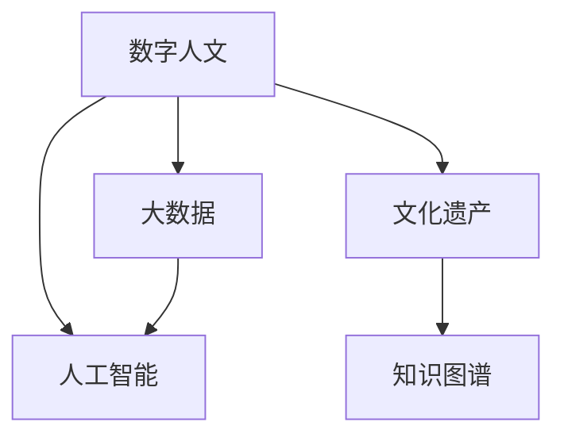

                 

# 数字时代的人文精神的传承

> 关键词：数字人文,人工智能,数据科学,文化传承,历史理解,社会科学,数字艺术

## 1. 背景介绍

### 1.1 问题由来

在数字化飞速发展的今天，人类社会的方方面面都在经历着深刻的变革。从个人生活到商业运作，再到国家治理，数字技术的渗透无处不在。但与此同时，这一进程也引发了关于科技与人文关系的新思考：如何在数字化的浪潮中，保持并传承人类珍贵的文化与精神遗产？

面对这一挑战，数字人文（Digital Humanities）应运而生。它将传统的文学、艺术、历史等领域的研究，与新兴的计算技术相结合，为保存、分析、研究人类文化遗产提供了新的工具和方法。这不仅丰富了文化遗产的呈现形式，也使得人类精神的传承有了新的途径。

### 1.2 问题核心关键点

数字人文的核心在于如何利用计算技术，特别是人工智能和大数据，来辅助人文学科的研究，提升文化遗产的保存和利用效率，同时促进人类精神价值的传承。具体关键点包括：

- **数据整合与处理**：高效收集和整理不同来源的文化遗产数据，使其能够被机器识别和处理。
- **自然语言处理（NLP）**：利用NLP技术，分析和理解人类文化遗产中的文本内容，从中提取有价值的信息。
- **可视化与互动**：通过可视化工具和互动技术，使文化遗产更生动、直观地呈现给公众。
- **模型训练与优化**：基于人工智能算法，训练文化遗产分析和理解模型，提升研究精度和效率。

### 1.3 问题研究意义

研究和应用数字人文，对于保存人类文化遗产、促进跨文化交流、推动社会科学研究具有重要意义：

- **文化传承**：确保人类文化遗产不会因数字化进程而丢失，通过数字化手段传播和保存。
- **社会科学研究**：提供新的研究方法，揭示人类历史和社会现象的复杂性。
- **公共教育**：以更直观、互动的方式向公众普及文化知识，提升全民文化素养。

## 2. 核心概念与联系

### 2.1 核心概念概述

为更好地理解数字人文技术的应用，本节将介绍几个关键概念及其相互联系：

- **数字人文（Digital Humanities）**：运用计算技术和人工智能方法，分析和理解人类文化遗产的研究领域。
- **文化遗产（Cultural Heritage）**：包括历史文献、艺术作品、建筑遗址等人类活动的产物，是人类文化的重要组成部分。
- **人工智能（AI）**：以数据和算法为基础，模仿人类智能的计算技术，特别是机器学习、自然语言处理等领域。
- **大数据（Big Data）**：指规模巨大、结构复杂的数据集，具有处理难度高、分析价值大的特点。
- **知识图谱（Knowledge Graph）**：一种语义网络的知识表示方式，用于组织和关联大量实体及其关系。

这些概念之间的联系可以通过以下Mermaid流程图来展示：



这个流程图展示了大语言模型的核心概念及其之间的关系：

1. 数字人文通过人工智能技术处理文化遗产数据。
2. 人工智能算法依赖于大数据进行模型训练和优化。
3. 文化遗产的数字化离不开对大规模数据集的处理。
4. 知识图谱是人工智能理解文化遗产的基础。

## 3. 核心算法原理 & 具体操作步骤
### 3.1 算法原理概述

数字人文的核心算法原理包括自然语言处理（NLP）、文本挖掘、图像识别等，这些技术都是基于人工智能和机器学习的。以下是几个关键算法：

- **词向量模型（Word Embedding）**：将词语映射到高维空间，捕捉词语之间的语义关系。
- **卷积神经网络（CNN）**：用于图像识别，可以从大量数据中提取出图像的特征。
- **递归神经网络（RNN）**：用于文本生成和分类，能够捕捉文本序列的上下文信息。
- **长短期记忆网络（LSTM）**：特别适用于序列数据的处理，可以处理变长序列的文本数据。
- **Transformer模型**：特别适用于自然语言处理任务，能够捕捉文本序列的复杂依赖关系。

### 3.2 算法步骤详解

基于数字人文的核心算法原理，具体的操作流程可以分为以下几步：

**Step 1: 数据收集与预处理**
- 确定研究主题，收集相关的文化遗产数据，如文本、图像、音频等。
- 对数据进行清洗和预处理，包括去除噪声、归一化、标注等步骤。

**Step 2: 特征提取与表示**
- 使用自然语言处理技术提取文本的语义特征，如词向量模型、TF-IDF等。
- 对于图像数据，使用卷积神经网络提取特征。
- 将提取的特征进行编码表示，以便于后续处理和分析。

**Step 3: 模型训练与优化**
- 根据研究需求选择合适的模型，如文本分类模型、图像识别模型等。
- 利用标注数据训练模型，优化模型的参数和结构。
- 采用交叉验证、网格搜索等方法进行模型评估和调优。

**Step 4: 数据分析与理解**
- 使用机器学习算法对数据进行分析和理解，如聚类、分类、回归等。
- 通过可视化工具呈现分析结果，帮助研究人员进行解释和探索。
- 构建知识图谱，关联和组织大量的实体和关系，形成有价值的知识体系。

**Step 5: 应用与评估**
- 将训练好的模型应用到实际问题中，如文本分类、图像识别等。
- 评估模型的性能，对比和改进。
- 持续更新数据和模型，保持研究的先进性和实用性。

### 3.3 算法优缺点

数字人文算法具有以下优点：

- **高效性**：能够处理大规模数据集，显著提升研究效率。
- **自动化**：通过算法自动化处理，减少了人工工作量。
- **精准性**：在处理数据和提取特征时，能够更准确地捕捉信息。

同时，这些算法也存在一些局限：

- **数据依赖**：模型的效果高度依赖于数据的质量和量。
- **解释性不足**：部分复杂算法如深度神经网络，模型难以解释和调试。
- **资源消耗高**：处理大规模数据需要高性能计算资源。
- **隐私风险**：文化遗产数据的处理可能涉及敏感信息，需注意隐私保护。

### 3.4 算法应用领域

数字人文算法在多个领域都有广泛应用，例如：

- **历史研究**：通过文本挖掘和图像识别技术，分析历史文献和文物图像，揭示历史事件和社会变迁。
- **文学研究**：使用NLP技术分析文学作品，探索作者的创作动机和风格特征。
- **艺术鉴赏**：通过视觉和文本分析，研究艺术品的美学特征和历史价值。
- **语言学研究**：利用语言模型和词向量技术，研究语言的发展和演化。
- **社会学研究**：通过大数据分析，研究社会行为和社会结构。
- **公共教育**：开发交互式学习工具，使文化遗产和知识更加易于理解和传播。

这些应用领域展示了数字人文技术的广泛潜力和应用前景。

## 4. 数学模型和公式 & 详细讲解 & 举例说明（备注：数学公式请使用latex格式，latex嵌入文中独立段落使用 $$，段落内使用 $)
### 4.1 数学模型构建

数字人文研究中的数学模型主要集中在自然语言处理和图像识别领域。以文本分类任务为例，常用的数学模型如下：

- **朴素贝叶斯分类器（Naive Bayes Classifier）**：基于贝叶斯定理，通过训练数据计算每个词出现的概率，进而分类文本。
- **支持向量机（Support Vector Machine, SVM）**：通过寻找最优超平面，将不同类别的文本分开。
- **随机森林（Random Forest）**：使用多个决策树进行投票分类，提升分类精度。
- **卷积神经网络（Convolutional Neural Network, CNN）**：通过卷积层和池化层提取图像特征，用于图像分类任务。
- **递归神经网络（Recurrent Neural Network, RNN）**：用于序列数据的处理，如文本生成和分类。

### 4.2 公式推导过程

以朴素贝叶斯分类器为例，其核心公式如下：

$$
P(C_i|D) = \frac{P(D|C_i)P(C_i)}{P(D)}
$$

其中 $C_i$ 表示文本所属的第 $i$ 个类别，$D$ 表示文本的特征向量。模型通过训练数据计算 $P(D|C_i)$ 和 $P(C_i)$，进而计算 $P(C_i|D)$。公式中的 $P(D)$ 是归一化因子，不影响最终的分类结果。

### 4.3 案例分析与讲解

以下以Google Scholar的论文分类模型为例，介绍数字人文在科学研究中的应用：

**论文分类模型**：Google Scholar使用深度学习算法对论文进行分类，首先将论文摘要转换为向量表示，然后通过卷积神经网络提取特征，最后利用分类器进行分类。模型训练时，使用标注数据优化参数，分类时，通过前向传播计算预测结果。

该模型展示了深度学习在文本分类任务中的强大能力，通过算法自动学习特征，提升了分类的准确性和效率。其优点在于能够处理大规模数据集，同时算法本身具有很好的可扩展性，适用于多领域、多语种的分类任务。

## 5. 项目实践：代码实例和详细解释说明
### 5.1 开发环境搭建

在进行数字人文项目实践前，我们需要准备好开发环境。以下是使用Python进行TensorFlow和Keras开发的环境配置流程：

1. 安装Anaconda：从官网下载并安装Anaconda，用于创建独立的Python环境。

2. 创建并激活虚拟环境：
```bash
conda create -n tf-env python=3.8 
conda activate tf-env
```

3. 安装TensorFlow：根据CUDA版本，从官网获取对应的安装命令。例如：
```bash
conda install tensorflow-gpu=2.4.1
```

4. 安装Keras：
```bash
pip install keras
```

5. 安装各类工具包：
```bash
pip install numpy pandas scikit-learn matplotlib tqdm jupyter notebook ipython
```

完成上述步骤后，即可在`tf-env`环境中开始数字人文项目的开发。

### 5.2 源代码详细实现

下面我们以文本分类任务为例，给出使用TensorFlow和Keras进行数字人文项目开发的PyTorch代码实现。

首先，定义文本数据处理函数：

```python
from tensorflow.keras.preprocessing.text import Tokenizer
from tensorflow.keras.preprocessing.sequence import pad_sequences
from tensorflow.keras.utils import to_categorical

def preprocess_text(texts, max_len, tokenizer):
    tokenizer.fit_on_texts(texts)
    sequences = tokenizer.texts_to_sequences(texts)
    padded_sequences = pad_sequences(sequences, maxlen=max_len, padding='post', truncating='post')
    labels = to_categorical(tokenizer.word_index, num_classes=num_classes)
    return padded_sequences, labels
```

然后，定义模型和优化器：

```python
from tensorflow.keras.models import Sequential
from tensorflow.keras.layers import Embedding, Conv1D, MaxPooling1D, Flatten, Dense

model = Sequential()
model.add(Embedding(input_dim=vocab_size, output_dim=embedding_dim, input_length=max_len))
model.add(Conv1D(filters=128, kernel_size=3, activation='relu'))
model.add(MaxPooling1D(pool_size=2))
model.add(Flatten())
model.add(Dense(64, activation='relu'))
model.add(Dense(num_classes, activation='softmax'))

optimizer = Adam(lr=0.001)
```

接着，定义训练和评估函数：

```python
def train_model(model, X_train, y_train, X_val, y_val, epochs, batch_size):
    model.compile(optimizer=optimizer, loss='categorical_crossentropy', metrics=['accuracy'])
    model.fit(X_train, y_train, batch_size=batch_size, epochs=epochs, validation_data=(X_val, y_val))
    test_loss, test_acc = model.evaluate(X_test, y_test, verbose=2)
    print(f'Test accuracy: {test_acc:.4f}')
```

最后，启动训练流程并在测试集上评估：

```python
epochs = 10
batch_size = 32

train_model(model, X_train, y_train, X_val, y_val, epochs, batch_size)

test_loss, test_acc = model.evaluate(X_test, y_test, verbose=2)
print(f'Test accuracy: {test_acc:.4f}')
```

以上就是使用TensorFlow和Keras对文本分类模型进行训练的完整代码实现。可以看到，TensorFlow和Keras提供了丰富的API和工具，可以方便地进行模型构建和训练。

### 5.3 代码解读与分析

让我们再详细解读一下关键代码的实现细节：

**preprocess_text函数**：
- 该函数将文本转换为模型所需的格式。首先通过`Tokenizer`将文本转换为数字序列，然后使用`pad_sequences`对序列进行填充，使其长度统一。最后使用`to_categorical`将标签转换为独热编码格式。

**模型构建**：
- 使用`Sequential`构建一个线性堆叠的模型，依次添加嵌入层、卷积层、池化层、全连接层和输出层。嵌入层将单词转换为向量，卷积层和池化层提取特征，全连接层和输出层进行分类。

**训练函数**：
- 使用`compile`方法配置模型的优化器和损失函数。
- 使用`fit`方法进行训练，指定训练轮数、批大小和验证集。
- 使用`evaluate`方法在测试集上评估模型性能，输出准确率。

**训练流程**：
- 定义总的epoch数和批大小，开始循环迭代
- 每个epoch内，先在训练集上训练，输出平均准确率
- 在验证集上评估，输出准确率
- 重复上述步骤直至模型收敛

可以看到，TensorFlow和Keras使得数字人文模型的开发过程变得简洁高效。开发者可以将更多精力放在模型设计和算法选择上，而不必过多关注底层的实现细节。

当然，工业级的系统实现还需考虑更多因素，如模型的保存和部署、超参数的自动搜索、更灵活的任务适配层等。但核心的数字人文模型构建基本与此类似。

## 6. 实际应用场景
### 6.1 历史研究

数字人文技术在历史研究中的应用，主要通过文本挖掘和图像识别技术，分析和理解历史文献和文物图像。例如，通过分析古代手稿的语义内容，可以揭示古代文明的社会结构和文化特征。使用图像识别技术，可以对考古遗址的图像进行分类和标注，快速识别出土文物和建筑结构。

### 6.2 文学研究

在文学研究中，数字人文技术可以用于文本分析和生成。通过对文学作品进行情感分析、风格分类等，可以揭示作者的创作动机和风格特征。此外，数字人文技术还可以用于生成文学作品，如自动生成诗歌、小说等，丰富文学创作的形式和内容。

### 6.3 艺术鉴赏

在艺术鉴赏领域，数字人文技术可以用于艺术品的分析与鉴赏。通过图像识别和文本分析，可以研究艺术品的风格、主题和历史价值。例如，使用图像识别技术，可以自动识别和分类艺术品的流派和风格；使用文本分析技术，可以研究艺术品的创作背景和历史演变。

### 6.4 语言学研究

数字人文技术在语言学研究中的应用，主要集中在自然语言处理和语料库构建。通过对大规模语料库的分析和挖掘，可以揭示语言的发展和演化规律。例如，通过文本分析技术，可以研究语言的词汇变化、语义演变等；通过构建语料库，可以支持语言教学和词典编纂。

### 6.5 社会学研究

数字人文技术在社会学研究中的应用，主要通过大数据分析，研究社会行为和社会结构。例如，通过分析社交媒体数据，可以研究网络社会的行为模式和传播规律；通过构建知识图谱，可以探索不同社会群体之间的关系和互动。

### 6.6 公共教育

在公共教育领域，数字人文技术可以用于开发交互式学习工具，使文化遗产和知识更加易于理解和传播。例如，通过构建虚拟博物馆和历史遗址，可以使学生通过虚拟现实技术进行互动学习和探索；通过开发交互式课程，可以使学生通过游戏化学习方式获取知识。

### 6.7 未来应用展望

未来，数字人文技术将在更多领域得到应用，为人类文化遗产的保存和传承提供新的途径。以下是几个可能的未来应用方向：

- **跨文化交流**：通过数字人文技术，不同文化背景的人们可以更易于理解和交流，促进全球化进程。
- **文化遗产保护**：利用数字技术，可以更高效地保存和修复文化遗产，使其传承下去。
- **数字化教学**：数字人文技术可以用于开发更加生动、互动的学习工具，提升教育质量。
- **历史模拟与重建**：通过数字技术，可以对历史事件进行模拟和重建，帮助人们更好地理解和研究历史。
- **智能客服与导览**：在博物馆、图书馆等公共文化设施中，数字人文技术可以用于智能导览和客户服务，提升用户体验。

## 7. 工具和资源推荐
### 7.1 学习资源推荐

为了帮助开发者系统掌握数字人文技术的应用，这里推荐一些优质的学习资源：

1. **《数字人文导论》**：由数字人文领域专家撰写，介绍了数字人文的基本概念、技术和应用。
2. **Coursera《数字人文课程》**：斯坦福大学开设的数字人文课程，有Lecture视频和配套作业，带你入门数字人文领域。
3. **JSTOR数字人文项目**：提供大量数字化文献和研究资源，方便学者进行文献检索和分析。
4. **Google Arts & Culture**：通过虚拟现实技术，展示和研究全球各地的文化遗产。
5. **Python for Digital Humanities**：一本介绍如何使用Python进行数字人文研究的书籍，适合初学者的自学。

通过对这些资源的学习实践，相信你一定能够快速掌握数字人文技术的精髓，并用于解决实际的文化遗产保护和研究问题。

### 7.2 开发工具推荐

高效的开发离不开优秀的工具支持。以下是几款用于数字人文项目开发的常用工具：

1. **TensorFlow**：Google主导开发的深度学习框架，生产部署方便，适合大规模工程应用。
2. **Keras**：用于构建和训练深度学习模型的高级API，易于上手。
3. **Jupyter Notebook**：交互式编程环境，适合快速原型开发和数据分析。
4. **Gephi**：可视化工具，用于探索和展示网络数据。
5. **Tableau**：数据可视化工具，支持多种数据源和复杂图表。

合理利用这些工具，可以显著提升数字人文项目的开发效率，加快创新迭代的步伐。

### 7.3 相关论文推荐

数字人文技术的发展源于学界的持续研究。以下是几篇奠基性的相关论文，推荐阅读：

1. **《从纸质到数字：数字人文的革命》（"From Paper to Digital: The Revolution in the Humanities"）**：Kirschner和Blei的文章，探讨了数字技术在人文研究中的应用。
2. **《数字人文：一种新型的学术范式》（"Digital Humanities: A New Academic Paradigm"）**：Andrew Piper的文章，介绍了数字人文的研究方法和应用前景。
3. **《数字人文研究的未来方向》（"Future Directions in Digital Humanities Research"）**：Amy Clarke和Alejandro Sánchez的论文，探讨了未来数字人文的研究方向和挑战。

这些论文代表了大语言模型微调技术的发展脉络。通过学习这些前沿成果，可以帮助研究者把握学科前进方向，激发更多的创新灵感。

## 8. 总结：未来发展趋势与挑战
### 8.1 研究成果总结

数字人文技术在文化遗产保护和研究方面，已经取得了显著进展。主要成果包括：

- **数据整合与处理**：构建了大规模数字化语料库，如Project Gutenberg、Google Books等。
- **自然语言处理**：开发了多种NLP算法，如BERT、GPT等，提高了文本分析的精度和效率。
- **图像识别**：发展了深度学习算法，如CNN、RNN等，提升了图像分析和识别的能力。
- **可视化与互动**：开发了多种可视化工具，如Gephi、Tableau等，使文化遗产的呈现更加生动和互动。
- **知识图谱**：构建了多领域知识图谱，如Wikidata、Linked Data等，提供了丰富的实体和关系数据。

这些研究成果为文化遗产的保存和研究提供了新的工具和方法，显著提升了研究的效率和精度。

### 8.2 未来发展趋势

展望未来，数字人文技术将呈现以下几个发展趋势：

- **多模态融合**：将文本、图像、音频等多种数据源融合，提升文化遗产的分析和理解能力。
- **智能辅助**：利用AI技术，提供智能辅助工具，如自动翻译、智能导览等，提升用户交互体验。
- **跨领域协作**：促进不同学科之间的交叉合作，推动文化遗产研究的深度和广度。
- **大规模协作**：利用开源社区的力量，共建数字化文化遗产资源，提升数据共享和协作效率。
- **隐私保护**：在数据处理和共享过程中，注重隐私保护，确保文化遗产的保密性和安全性。
- **多语种支持**：开发多语种数字人文工具，支持全球文化遗产的研究和传播。

以上趋势展示了数字人文技术的广阔前景，为文化遗产的保存和研究提供了新的路径。

### 8.3 面临的挑战

尽管数字人文技术已经取得了显著进展，但在迈向更加智能化、普适化应用的过程中，它仍面临着诸多挑战：

- **数据质量**：高质量、标注数据的需求高，但获取和标注成本高。
- **算法复杂性**：部分复杂算法难以解释和调试，增加了模型开发的难度。
- **资源消耗**：大规模数据处理和模型训练需要高性能计算资源，成本较高。
- **隐私风险**：文化遗产数据的处理可能涉及敏感信息，需注意隐私保护。
- **标准化问题**：不同学科和领域的标准不一，数据格式和处理方法不统一。

### 8.4 研究展望

面对数字人文技术面临的挑战，未来的研究需要在以下几个方面寻求新的突破：

- **无监督学习**：利用无监督学习算法，如自编码器、生成对抗网络等，处理非结构化数据。
- **可解释性**：开发可解释性强、易于调试的算法，提高模型的透明度和可信度。
- **跨学科融合**：促进不同学科的交叉合作，推动文化遗产研究的深度和广度。
- **多语种支持**：开发多语种数字人文工具，支持全球文化遗产的研究和传播。
- **隐私保护**：开发隐私保护技术，确保文化遗产数据的保密性和安全性。
- **标准化建设**：制定统一的数字化标准，提高数据共享和协作效率。

这些研究方向的探索，必将引领数字人文技术迈向更高的台阶，为文化遗产的保存和研究提供更先进、更全面的工具和方法。

## 9. 附录：常见问题与解答

**Q1：数字人文技术是否适用于所有文化遗产类型？**

A: 数字人文技术适用于大多数文化遗产类型，包括文本、图像、音频等。但不同类型的数据可能需要不同的处理和分析方法。例如，文本数据可以使用自然语言处理技术进行分析，而图像数据需要使用计算机视觉技术进行处理。

**Q2：数字人文技术在保护文化遗产时是否会破坏原始数据？**

A: 数字人文技术主要是对文化遗产的数字化处理，并不会破坏原始数据。但需要注意数据格式和质量问题，避免因数据处理不当导致信息丢失或损坏。

**Q3：数字人文技术是否会影响文化遗产的学术价值？**

A: 数字人文技术不会影响文化遗产的学术价值。相反，它提供了新的研究方法和工具，帮助学者更好地理解文化遗产，提升研究的深度和广度。

**Q4：数字人文技术在研究中是否需要专业知识？**

A: 数字人文技术的应用需要一定的专业知识和技能，包括计算机科学、历史学、语言学等。但随着技术的发展和普及，越来越多的学者开始接触和使用数字人文技术。

**Q5：数字人文技术在研究和应用中需要注意哪些伦理问题？**

A: 数字人文技术在研究和应用中需要注意隐私保护、版权问题、数据质量等伦理问题。例如，在处理文化遗产数据时，需要确保数据来源合法，保护数据隐私，避免数据滥用。

通过对这些问题的探讨和解答，可以更好地理解和应用数字人文技术，推动文化遗产的数字化保护和研究。

---

作者：禅与计算机程序设计艺术 / Zen and the Art of Computer Programming

