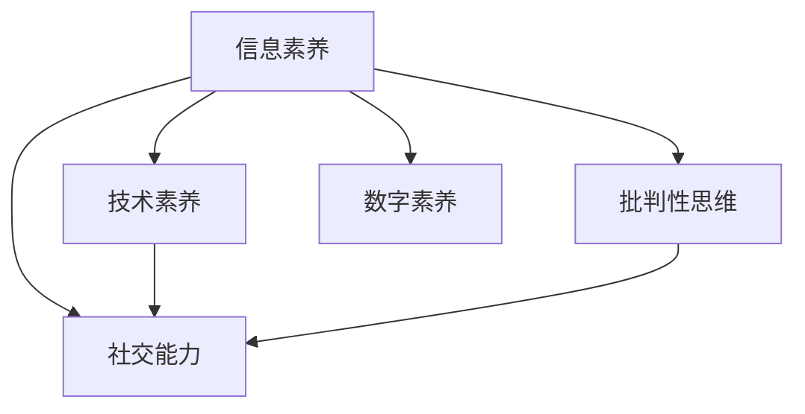

                 

# 数字素养：公民参与的基石

在数字化时代，数字素养成为了一种全新的技能，不仅是个人获得知识、提升竞争力，更是公民有效参与社会和政治生活的重要基石。数字素养涉及信息获取、技能应用、批判性思维、社交能力等多方面的综合能力，它使个体能够更高效地适应数字化环境，并在其中扮演积极角色。本文将从背景、核心概念、算法原理与操作步骤、数学模型和公式、项目实践、应用场景、工具和资源推荐等多个维度，全面解析数字素养的重要性和实现路径，旨在帮助公民提升自身的数字素养，为社会进步贡献力量。

## 1. 背景介绍

### 1.1 数字素养的重要性

随着信息技术的迅猛发展，数字化已成为现代社会不可或缺的组成部分。数字素养不仅关乎个人职业发展，更是全球化背景下公民有效参与政治、经济、文化等社会活动的基础。根据联合国教科文组织的定义，数字素养是指个体理解、使用和创造数字媒体的能力，包括信息的获取、信息的评估、信息的创建和信息的共享。

在现代社会的方方面面，数字素养的重要性日益凸显：

- **经济领域**：数字素养有助于个体在就业市场中的竞争力提升，适应在线教育、电子商务、远程工作等新兴经济形态。
- **社会领域**：数字素养使公民能更好地获取公共信息、参与社会事务，提升民主参与度。
- **文化领域**：数字素养促进了文化的传播和创新，使个体能够更好地保存和传承文化遗产。
- **教育领域**：数字素养是现代教育的重要组成部分，培养出具有批判性思维和创造力的未来公民。

### 1.2 数字素养的现状与挑战

尽管数字技术在全球范围内的普及率不断提高，但不同国家和地区的数字素养水平存在显著差异。根据国际电信联盟（ITU）的统计，全球范围内只有约27%的成年人具备基本数字素养，而在发展中国家这一比例更低。

这一现状主要受到以下因素的制约：

- **基础设施不均**：互联网普及率和质量在不同国家和地区差异较大，影响了数字素养的普及。
- **教育资源不足**：在一些经济落后地区，学校和社区的数字教育资源有限，无法满足学生和成人对数字技能的需求。
- **技术复杂性**：数字技术和平台日新月异，复杂性增加，对学习者的知识要求提高。
- **隐私和安全问题**：在数字化世界中，隐私保护和个人数据安全成为新的挑战，需提升公众对这些问题的认知。

为应对这些挑战，各国政府、教育机构、非政府组织和私营部门正积极合作，推动数字素养的普及和提升。

## 2. 核心概念与联系

### 2.1 核心概念概述

在探讨数字素养之前，需要明确几个核心概念：

- **信息素养（Information Literacy）**：个体获取、评估、创建和管理信息的能力。信息素养是数字素养的基础，涉及对信息的识别、筛选、分析和应用。
- **技术素养（Technical Literacy）**：个体掌握和使用数字技术的能力，包括编程、数据分析、网络安全等技能。技术素养是数字素养的关键，促进了信息素养的深入应用。
- **批判性思维（Critical Thinking）**：个体对信息的质疑、分析和评估能力，是数字素养中不可或缺的思维能力。
- **社交能力（Social Skills）**：个体在数字化环境中有效沟通、协作和社交的能力，数字素养不仅是个体能力，更是社会能力的体现。

这些概念之间的联系可以通过以下Mermaid流程图来展示：



该流程图展示出信息素养、技术素养、批判性思维和社会能力在数字素养中的相互作用和融合。

### 2.2 核心概念原理和架构

数字素养是一种综合能力，涉及信息的获取、评估、创建、共享和应用等多个环节。其原理和架构可以抽象为以下四个层次：

- **感知与理解层**：个体通过感官或工具感知数字信息，并利用知识结构理解信息的基本内容。
- **评估与选择层**：个体运用批判性思维，评估信息的真实性、相关性和可用性，并进行选择和排序。
- **应用与创新层**：个体根据需求，应用信息解决实际问题，或进行信息的创造和创新。
- **协作与沟通层**：个体在数字化环境中进行沟通和协作，分享信息和知识，构建社会网络。

## 3. 核心算法原理 & 具体操作步骤

### 3.1 算法原理概述

数字素养的学习和提升是一个循序渐进的过程，涉及知识的获取、技能的培养和思维的提升。算法原理旨在通过结构化的方法，帮助个体系统地学习数字技能。

数字素养的核心算法包括以下几个部分：

1. **知识图谱构建**：通过构建以数据和知识点为核心的知识图谱，帮助学习者理解和掌握数字信息的基础框架。
2. **技能训练模型**：设计基于强化学习的技能训练模型，通过模拟实际应用场景，逐步提升学习者的数字技能。
3. **批判性思维框架**：引入批判性思维工具，如逻辑推理、证据评估等，培养学习者的分析能力和判断力。
4. **社交网络构建**：使用社交网络分析方法，构建和维护数字化环境中的社会关系网络，提升协作与沟通能力。

### 3.2 算法步骤详解

基于上述算法原理，数字素养的学习和提升可以通过以下步骤实现：

**Step 1: 知识图谱构建**
- 定义核心知识点，如网络安全、信息评估、编程基础等。
- 建立知识图谱框架，将知识点连接成网络。
- 使用可视化工具展示知识图谱，便于学习者理解和记忆。

**Step 2: 技能训练模型设计**
- 定义技能训练目标，如编程语言的学习、数据分析的基本操作等。
- 设计强化学习算法，设置合适的奖励机制和惩罚机制。
- 创建模拟任务和应用场景，让学习者在虚拟环境中进行实际操作。
- 根据学习者的表现调整算法参数，优化学习路径。

**Step 3: 批判性思维框架应用**
- 引入逻辑推理和证据评估工具，如假说检验、证据链分析等。
- 设计批判性思维练习，如识别信息源的可靠性、评估数据的多样性等。
- 通过案例分析，帮助学习者理解和应用批判性思维方法。

**Step 4: 社交网络构建**
- 分析数字化环境中的社交关系网络，识别关键节点和结构。
- 设计社交网络构建工具，如社交平台模拟、协作任务设计等。
- 提供反馈和指导，帮助学习者优化社交策略和沟通技能。

### 3.3 算法优缺点

**优点**：
1. **系统化学习**：通过结构化的方法和步骤，帮助学习者系统地掌握数字素养的核心技能。
2. **实践性强**：强化学习和模拟任务的引入，使学习者在实际应用中逐步提升技能。
3. **互动性高**：批判性思维和社交网络的构建，通过互动提升学习效果。

**缺点**：
1. **时间和资源投入大**：结构化学习和模拟任务的实现需要大量时间和资源。
2. **个体差异大**：不同学习者的起点和需求不同，需个性化调整学习路径和内容。
3. **技术复杂性**：算法设计和实现的技术要求较高，需要专业知识和技术支持。

### 3.4 算法应用领域

数字素养的应用领域广泛，包括但不限于以下几个方面：

- **教育领域**：在学校教育中引入数字素养课程，提升学生的全面数字能力。
- **职业培训**：为职场人士提供数字技能培训，提升其职业竞争力。
- **社区发展**：在社区中推广数字素养教育，促进公民的数字参与。
- **公共服务**：通过数字素养培训，提升政府和公共服务部门的数字化能力。
- **个人成长**：通过自我学习，提升个人在数字化环境中的综合素养。

## 4. 数学模型和公式 & 详细讲解 & 举例说明

### 4.1 数学模型构建

为了更好地理解数字素养的学习过程，本文将从信息获取、技能训练、批判性思维和社交网络构建四个方面，构建数学模型。

**信息获取模型**：
- 设信息源集合为 $S$，信息内容为 $I$，信息质量为 $Q$。
- 模型目标是最小化信息质量的误差，即：$\min_{Q} |Q(I) - I^*|$
- 其中 $I^*$ 为理想信息质量，$Q$ 为信息质量评估函数。

**技能训练模型**：
- 设技能集合为 $S_k$，训练任务为 $T$，学习率为 $\eta$，模型参数为 $\theta$。
- 模型目标是在训练任务 $T$ 下，最大化技能 $S_k$ 的准确率，即：$\max_{\theta} P(S_k|T)$。
- 使用强化学习算法，通过模拟任务 $T$ 和奖励机制，不断调整模型参数 $\theta$。

**批判性思维模型**：
- 设证据集合为 $E$，推理链为 $R$，结论为 $C$。
- 模型目标是在证据 $E$ 下，最大化推理链 $R$ 的可靠性，即：$\max_{R} P(C|E, R)$。
- 使用逻辑推理工具，如贝叶斯网络、证据推理等，评估和优化推理链 $R$。

**社交网络构建模型**：
- 设社交网络节点为 $N$，边集合为 $E$，社交关系为 $S$。
- 模型目标是在社交网络 $N$ 中，最大化节点间的社交关系 $S$，即：$\max_{S} \sum_{i,j} S_{i,j}$
- 使用社交网络分析工具，如度中心性分析、社区检测等，优化社交网络结构。

### 4.2 公式推导过程

以下是对上述模型公式的推导过程：

**信息获取模型**：
$$
\min_{Q} |Q(I) - I^*| = \min_{Q} \int_{S} (Q(I) - I^*)^2 dP(S)
$$
其中 $P(S)$ 为信息源 $S$ 的先验概率分布。

**技能训练模型**：
$$
\max_{\theta} P(S_k|T) = \max_{\theta} \frac{P(S_k, T|S_k)}{P(T|S_k)} = \max_{\theta} P(T|S_k, \theta)
$$
其中 $P(T|S_k, \theta)$ 为在技能 $S_k$ 和模型参数 $\theta$ 下的任务 $T$ 的似然函数。

**批判性思维模型**：
$$
\max_{R} P(C|E, R) = \max_{R} \frac{P(C, R|E)}{P(E|R)} = \max_{R} P(E|C, R)
$$
其中 $P(E|C, R)$ 为在结论 $C$ 和推理链 $R$ 下的证据 $E$ 的似然函数。

**社交网络构建模型**：
$$
\max_{S} \sum_{i,j} S_{i,j} = \max_{S} \log \prod_{i,j} S_{i,j} = \max_{S} \sum_{i,j} \log S_{i,j}
$$
其中 $\prod_{i,j} S_{i,j}$ 为社交网络中节点间社交关系的乘积。

### 4.3 案例分析与讲解

**案例分析**：
假设某社区计划提升居民的数字素养，社区管理者决定采用数字素养学习平台。该平台设计了以下功能模块：

- **知识图谱构建模块**：通过可视化工具，展示了数字素养的核心知识点网络。
- **技能训练模块**：设计了编程、数据分析和信息评估等多种技能训练任务，使用强化学习算法调整学习路径。
- **批判性思维模块**：通过案例分析和批判性思维练习，提升学习者的分析能力和判断力。
- **社交网络构建模块**：设计了社区协作任务，使用社交网络分析工具优化社交关系。

通过以上模块的协同作用，社区居民的数字素养得到了显著提升，能够在数字化环境中高效沟通、协作和创新。

## 5. 项目实践：代码实例和详细解释说明

### 5.1 开发环境搭建

在进行数字素养项目开发前，需要准备开发环境。以下是使用Python进行Web开发的环境配置流程：

1. 安装Anaconda：从官网下载并安装Anaconda，用于创建独立的Python环境。
2. 创建并激活虚拟环境：
```bash
conda create -n py37 python=3.7 
conda activate py37
```
3. 安装Python Web框架：
```bash
pip install flask
```
4. 安装相关数据库和模型库：
```bash
pip install pymongo pandas numpy scikit-learn
```

完成上述步骤后，即可在`py37`环境中开始开发。

### 5.2 源代码详细实现

以下是一个基于Web框架的简单数字素养学习平台的前端和后端代码实现。

**前端代码**：

```html
<!DOCTYPE html>
<html>
<head>
    <title>数字素养学习平台</title>
    <script src="https://cdn.jsdelivr.net/npm/vue/dist/vue.js"></script>
    <script src="https://cdn.jsdelivr.net/npm/vuex/dist/vuex.js"></script>
    <script src="https://cdn.jsdelivr.net/npm/axios/dist/axios.min.js"></script>
    <style>
        /* 样式表 */
    </style>
</head>
<body>
    <div id="app">
        <router-view></router-view>
    </div>
    <script>
        var app = new Vue({
            el: '#app',
            store: new Vuex.Store({ ... }),
            router: new VueRouter({ ... }),
            mounted() {
                this.$router.push(this.$route.path);
            }
        });
    </script>
</body>
</html>
```

**后端代码**：

```python
from flask import Flask, render_template, request
from flask_sqlalchemy import SQLAlchemy
from sqlalchemy.orm import sessionmaker

app = Flask(__name__)
app.config['SQLALCHEMY_DATABASE_URI'] = 'sqlite:////tmp/test.db'
db = SQLAlchemy(app)
Session = sessionmaker(bind=db)

class User(db.Model):
    id = db.Column(db.Integer, primary_key=True)
    username = db.Column(db.String(80), unique=True, nullable=False)
    password = db.Column(db.String(120), nullable=False)

@app.route('/')
def index():
    users = User.query.all()
    return render_template('index.html', users=users)

@app.route('/login', methods=['GET', 'POST'])
def login():
    if request.method == 'POST':
        username = request.form['username']
        password = request.form['password']
        user = User.query.filter_by(username=username, password=password).first()
        if user:
            return 'Login success!'
        else:
            return 'Login failed!'
    else:
        return render_template('login.html')

@app.route('/register', methods=['GET', 'POST'])
def register():
    if request.method == 'POST':
        username = request.form['username']
        password = request.form['password']
        user = User(username=username, password=password)
        db.session.add(user)
        db.session.commit()
        return 'Register success!'
    else:
        return render_template('register.html')

if __name__ == '__main__':
    app.run(debug=True)
```

### 5.3 代码解读与分析

**前端代码解读**：
- 使用Vue.js框架，实现了页面渲染和状态管理。
- 通过路由管理，实现不同功能模块的切换。
- 使用了Axios库进行前后端数据交换。

**后端代码解读**：
- 使用Flask框架，构建Web服务。
- 通过SQLAlchemy库进行数据库操作。
- 实现了用户注册、登录和查询功能。

### 5.4 运行结果展示

**前端展示**：
1. 首页展示用户列表，如：
```html
<div v-for="user in users">
    {{ user.username }}
</div>
```

2. 登录页面展示登录表单，如：
```html
<form method="post">
    <label for="username">Username:</label>
    <input type="text" id="username" name="username">
    <label for="password">Password:</label>
    <input type="password" id="password" name="password">
    <button type="submit">Login</button>
</form>
```

**后端展示**：
1. 用户列表：
```python
@app.route('/')
def index():
    users = User.query.all()
    return render_template('index.html', users=users)
```

2. 登录功能：
```python
@app.route('/login', methods=['GET', 'POST'])
def login():
    if request.method == 'POST':
        # 查询用户并验证
        user = User.query.filter_by(username=request.form['username'], password=request.form['password']).first()
        if user:
            return 'Login success!'
        else:
            return 'Login failed!'
    else:
        return render_template('login.html')
```

**运行结果展示**：
1. 首页展示用户列表。
2. 登录功能成功验证用户，返回“Login success!”。

## 6. 实际应用场景

### 6.1 企业培训

在企业中，提升员工的数字素养是提高工作效率、增强创新能力的有效手段。通过数字素养培训，员工能够更高效地使用企业内部的信息系统、协作工具和数据分析平台。

企业可以通过以下方式实现数字素养培训：

1. 设计定制化课程：根据企业实际需求，设计针对性强的数字素养课程，如数据分析、项目管理等。
2. 提供在线学习平台：利用Web开发技术，搭建在线学习平台，提供丰富的教学资源和互动功能。
3. 定期组织培训：定期组织线下培训或线上直播课程，保证培训的持续性和覆盖面。
4. 考核与反馈：通过考核和反馈机制，评估员工的学习效果，持续改进培训内容。

### 6.2 教育系统

在教育系统中，数字素养已经成为基础教育的重要组成部分。通过数字素养教育，学生能够掌握基本的数字技能和思维能力，适应数字化学习环境。

教育系统可以通过以下方式实现数字素养教育：

1. 引入数字素养课程：在中小学教育中引入数字素养课程，从基础技能到高级应用逐步推进。
2. 开发数字素养教材：编写适合不同年级的数字素养教材，系统化地传授数字知识和技能。
3. 提供数字化学习工具：利用平板电脑、电子书、在线课堂等数字化学习工具，提升学生的学习体验。
4. 组织数字素养竞赛：通过举办数字素养竞赛，激发学生对数字技术的兴趣和创新能力。

### 6.3 公共服务

在公共服务领域，提升公民的数字素养有助于提升政府服务质量、促进公共参与。通过数字素养培训，公民能够更好地获取公共信息、参与社会事务。

公共服务可以通过以下方式实现数字素养培训：

1. 发布数字素养指南：编写数字素养指南，帮助公民了解数字技能的要点和方法。
2. 开展数字素养讲座：定期举办数字素养讲座，普及数字技能和应用。
3. 提供数字素养服务：在社区中心、图书馆等公共场所提供数字素养服务，帮助公民提升数字技能。
4. 促进数字参与：利用数字素养提升公民的在线参与度，促进政府与公民的互动。

## 7. 工具和资源推荐

### 7.1 学习资源推荐

为了帮助开发者系统掌握数字素养的核心知识和技能，以下推荐一些优质的学习资源：

1. 《数字素养：信息时代公民必备技能》：一本全面介绍数字素养的书籍，涵盖基础知识、高级技能和应用案例。
2. 《Python网络爬虫》：一本讲解Web开发和数据爬取技巧的书籍，适合掌握Web开发技术的初学者。
3. 《Python数据分析》：一本详细介绍数据分析和可视化技术的书籍，适合希望提升数据分析能力的用户。
4. 《深度学习入门》：一本介绍深度学习基础和实践的书籍，适合想入门深度学习的开发者。
5. 《批判性思维与信息素养》：一本提升批判性思维和信息素养的书籍，适合对信息分析有需求的读者。

### 7.2 开发工具推荐

在进行数字素养开发时，需要一些高效的开发工具：

1. PyTorch：基于Python的深度学习框架，适合构建复杂的学习模型。
2. TensorFlow：谷歌开源的深度学习框架，适用于大规模模型训练和优化。
3. Keras：一个高层次的深度学习API，易于上手和调试。
4. Flask：轻量级的Web开发框架，适合构建简单的Web服务。
5. React：一个流行的JavaScript库，用于构建前端界面。
6. Vue.js：一个渐进式的JavaScript框架，适用于构建单页应用。

### 7.3 相关论文推荐

数字素养研究涉及多学科交叉，以下是几篇具有代表性的相关论文：

1. 《数字素养：概念、模型与实践》：总结了数字素养的定义、模型和实践应用。
2. 《信息素养与批判性思维：教育中的结合》：探讨了信息素养和批判性思维在教育中的结合。
3. 《社交网络分析与数字素养》：研究了社交网络分析在提升数字素养中的应用。
4. 《机器学习与数字素养》：探讨了机器学习在提升数字素养中的潜力。
5. 《跨领域数字素养教育框架》：提出了一种跨领域的数字素养教育框架，适用于不同学科和领域。

## 8. 总结：未来发展趋势与挑战

### 8.1 研究成果总结

本文对数字素养的重要性和实现路径进行了全面探讨，主要总结了以下几个方面的研究成果：

1. 数字素养的概念框架：包括信息素养、技术素养、批判性思维和社交能力。
2. 数字素养的学习模型：信息获取、技能训练、批判性思维和社交网络构建。
3. 数字素养的应用场景：企业培训、教育系统和公共服务。
4. 数字素养的技术工具：Web开发框架、深度学习框架和数据分析工具。
5. 数字素养的资源推荐：书籍、工具和论文。

### 8.2 未来发展趋势

未来，数字素养的发展趋势主要包括以下几个方向：

1. **智能化与个性化**：通过人工智能和机器学习技术，提供个性化、智能化的数字素养学习路径，提升学习效率。
2. **跨学科融合**：数字素养与其他学科如数学、科学、艺术等的融合，形成更加综合的数字能力。
3. **全球化与本地化结合**：数字素养教育的全球化推广与本地化适应相结合，适应不同地区和人群的需求。
4. **社会化与网络化**：利用社交网络和协作工具，促进数字素养的社会化学习和应用。
5. **终身学习与持续更新**：建立终身学习机制，定期更新数字素养课程和技能，适应不断变化的数字环境。

### 8.3 面临的挑战

尽管数字素养的发展前景广阔，但仍然面临诸多挑战：

1. **教育资源不均**：不同地区和学校在数字素养教育资源上存在不均衡，需要更多投入来改善。
2. **技术复杂性**：数字素养涉及多学科知识，学习者需要具备一定的技术基础，对学习者要求较高。
3. **隐私与安全问题**：数字素养培训中涉及大量数据和信息，如何保障隐私与安全是一大挑战。
4. **技术与教育的融合**：如何将数字素养教育与传统教育有机结合，形成互补的教育体系。
5. **社会与文化的适应**：数字素养教育需要考虑不同社会和文化背景下的适应性，推动社会的数字化转型。

### 8.4 研究展望

面对数字素养发展中的挑战，未来的研究可以从以下几个方向继续推进：

1. **多模态学习**：结合图像、视频、音频等多模态信息，提升数字素养学习的丰富性和有效性。
2. **情感计算**：利用情感计算技术，提升数字素养学习中的情感支持，增强学习者的参与度和兴趣。
3. **元认知训练**：引入元认知训练方法，提升学习者的自我监控和调节能力，增强学习效果。
4. **虚拟现实与增强现实**：利用虚拟现实和增强现实技术，创建沉浸式学习环境，提升学习体验。
5. **个性化学习路径**：通过大数据和机器学习技术，构建个性化的学习路径，提升学习效率和效果。

总之，数字素养是一个涉及多学科、多技术、多领域的重要课题。未来需要各领域的专家和学者共同努力，推动数字素养教育的深入发展，为社会数字化转型做出更大的贡献。

## 9. 附录：常见问题与解答

**Q1: 什么是数字素养？**

A: 数字素养是指个体理解和应用数字技术的综合能力，涉及信息的获取、评估、创建、共享和应用等多个方面。

**Q2: 数字素养的实现路径有哪些？**

A: 数字素养的实现路径包括知识图谱构建、技能训练、批判性思维和社交网络构建。

**Q3: 数字素养有哪些应用场景？**

A: 数字素养的应用场景包括企业培训、教育系统和公共服务。

**Q4: 数字素养的未来发展趋势是什么？**

A: 数字素养的未来发展趋势包括智能化与个性化、跨学科融合、全球化与本地化结合、社会化与网络化、终身学习与持续更新。

**Q5: 数字素养发展中面临哪些挑战？**

A: 数字素养发展中面临教育资源不均、技术复杂性、隐私与安全问题、技术与教育的融合、社会与文化的适应等挑战。

---

作者：禅与计算机程序设计艺术 / Zen and the Art of Computer Programming

