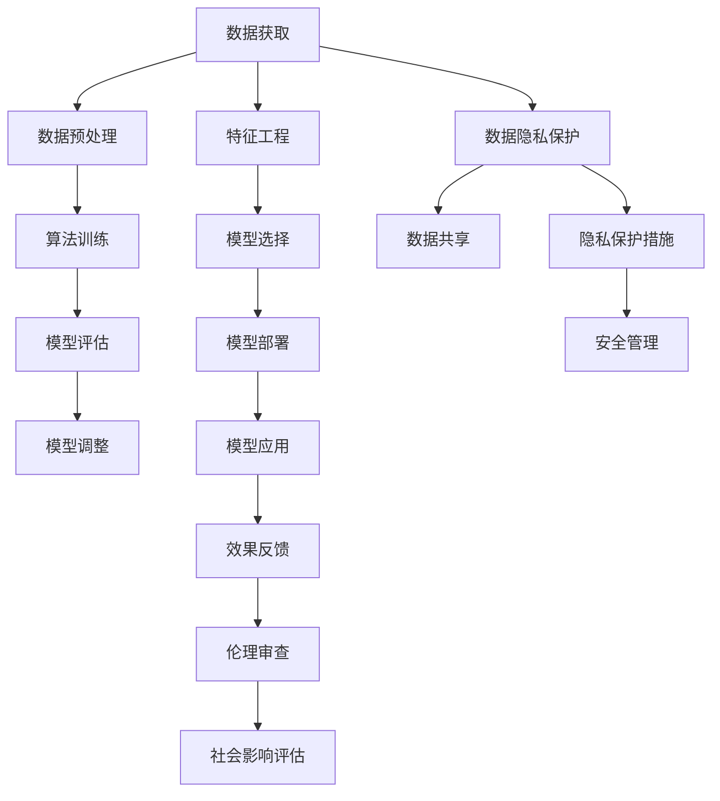

                 

# 数字鸿沟：人类计算中的公平问题

> 关键词：数字鸿沟,计算公平性,人工智能,社会责任,算法偏见,数据隐私,普惠技术

## 1. 背景介绍

### 1.1 问题由来

数字鸿沟(digital divide)是信息技术领域一个经典的议题，指的是在数字技术普及和应用中存在的不平等现象。这种不平等可能体现在接入能力、资源获取、使用技能、获取信息和服务等方面。当某些群体能够更方便地获得和使用数字技术，而另一些群体难以触及或无法充分利用这些技术时，就会产生数字鸿沟。

在过去几十年中，全球范围内已经出现了多次数字鸿沟的浪潮。从最初互联网的普及到移动互联网的爆发，再到如今人工智能的兴起，每一次技术进步都引发了对数字鸿沟问题的关注。特别是在当前人工智能的时代背景下，数字鸿沟不仅涉及基础设施和接入能力，更涉及算法与数据的公平性，进而对社会经济结构产生深远影响。

### 1.2 问题核心关键点

数字鸿沟问题可以从多个层面进行剖析，主要包括：

- **接入不平等**：不同社会经济背景群体在获取和接入互联网、计算机等计算资源方面的不平等。
- **资源不平等**：不同群体在获取计算资源、数据、算法、技术支持等方面的差异。
- **技能不平等**：不同群体在操作和理解数字技术、算法模型的能力上的差异。
- **信息不平等**：不同群体在获取和使用数字技术获取信息、服务、知识等方面的不平等。
- **隐私与安全**：不同群体在数据隐私保护和网络安全方面的能力差异。

这些不平等现象交织在一起，形成了复杂的社会问题，并对个体、群体乃至整个社会的福祉产生影响。因此，如何通过技术手段缓解数字鸿沟，实现计算公平性(computational fairness)，成为当下学术界和业界亟需解决的问题。

## 2. 核心概念与联系

### 2.1 核心概念概述

要理解和解决这个问题，首先需要明确一些关键概念及其联系：

- **计算公平性**：指确保数字技术和算法对所有社会群体均等、无偏地应用。计算公平性旨在消除数据和算法带来的偏见和不平等，保障不同群体在信息获取和决策过程中的平等权利。
- **算法偏见**：指算法在训练、部署和使用过程中，因为数据、特征选择、模型设计等原因，导致的对某些群体的不公平对待。
- **数据隐私**：指个人或群体在数据收集、处理和使用过程中，其信息的保密性、完整性和可用性应得到充分保护，避免信息泄露和滥用。
- **普惠技术**：指旨在服务于社会边缘群体的技术和产品，通过提供平等的技术接入和使用机会，缩小数字鸿沟，促进社会的整体发展。
- **伦理社会责任**：指技术开发者和企业在开发、部署和使用技术时，应考虑对社会的影响，遵守伦理准则，维护社会公正和公共利益。

### 2.2 核心概念原理和架构的 Mermaid 流程图



这个流程图展示了从数据获取、预处理、特征工程、算法训练、模型部署，到效果反馈和模型调整的整体流程，同时强调了数据隐私保护和伦理社会责任的重要性。

## 3. 核心算法原理 & 具体操作步骤

### 3.1 算法原理概述

计算公平性的实现主要依赖于数据集的多样性和算法的公正性。因此，缓解数字鸿沟的关键在于：

- **数据多样性**：构建和扩大高质量、多样化的数据集，涵盖不同的社会群体和领域。
- **算法公正性**：设计和使用公平的算法，消除算法偏见，保障不同群体的权益。
- **技术普惠性**：开发和使用普惠技术，确保所有人都能平等地访问和使用计算资源。

### 3.2 算法步骤详解

缓解数字鸿沟、实现计算公平性需要经过以下几个关键步骤：

**Step 1: 数据收集与处理**

1. **多样性收集**：从不同社会群体、地区、行业等多样化的环境中收集数据，确保数据集的代表性。
2. **隐私保护**：采用数据匿名化、加密等技术手段，保障数据隐私，防止数据泄露。
3. **数据清洗与预处理**：处理缺失值、异常值，对数据进行标准化和归一化。

**Step 2: 特征工程**

1. **特征选择**：根据任务需求，选择最相关、最有助于模型表现的特征。
2. **特征构建**：使用高级技术手段如PCA、LDA等，从原始数据中提取有意义的特征。
3. **平衡样本**：使用欠采样、过采样、SMOTE等方法，处理类别不平衡问题。

**Step 3: 算法训练与评估**

1. **算法选择**：根据任务需求，选择合适的算法，如线性回归、决策树、随机森林、神经网络等。
2. **公平性约束**：在算法训练中引入公平性约束，如使用公平误差、均等机会等指标，优化模型。
3. **模型评估**：使用公平性评估指标如准确率、召回率、F1分数、ROC-AUC等，评估模型性能。

**Step 4: 模型部署与应用**

1. **模型优化**：根据评估结果，调整模型参数，优化模型性能。
2. **模型部署**：将优化后的模型部署到生产环境，供实际应用使用。
3. **持续监控**：在实际应用中，持续监控模型性能，及时调整和优化。

### 3.3 算法优缺点

算法缓解数字鸿沟的效果与数据质量、算法设计、模型训练等因素密切相关。

**优点**：
1. **公平性保障**：通过公平性约束和评估，可以降低算法偏见，保障不同群体的权益。
2. **普惠性提升**：多样化的数据集和普惠技术能够扩大计算资源的覆盖范围，缩小数字鸿沟。
3. **社会责任强化**：引入伦理和社会责任的考量，推动技术应用的可持续发展。

**缺点**：
1. **数据稀缺**：多样化和高质量的数据获取难度大，尤其是针对边缘群体的数据。
2. **算法复杂**：实现公平性需要复杂的算法设计和参数调整，对技术要求高。
3. **隐私风险**：数据隐私保护技术需要投入大量资源，且可能面临技术实现和政策监管的挑战。

### 3.4 算法应用领域

计算公平性涉及多个领域，具体应用包括：

- **医疗健康**：保障医疗资源公平分配，确保不同群体的健康权益。
- **教育公平**：提供平等的教育资源和机会，缩小教育不平等。
- **金融服务**：确保金融服务的公平性，防止金融排斥。
- **就业机会**：通过公平算法招聘，保障不同背景人群的就业机会。
- **社会治理**：通过公平算法辅助决策，提升社会治理的公平性。

## 4. 数学模型和公式 & 详细讲解 & 举例说明

### 4.1 数学模型构建

计算公平性的数学模型构建需要综合考虑多样性、公平性和隐私性。

以金融贷款审批为例，模型旨在评估申请人的贷款风险和信用度。设训练集为 $D = \{(x_i, y_i)\}_{i=1}^N$，其中 $x_i = [x_{i1}, x_{i2}, \dots, x_{in}]$ 为申请人特征，$y_i$ 为贷款是否批准。假设模型为 $f(x; \theta)$，其参数为 $\theta$。

### 4.2 公式推导过程

**公平误差(Equalized Odds)**：
设 $p_+$ 和 $p_-$ 分别为正类和负类的真实概率，$\hat{p}_+$ 和 $\hat{p}_-$ 为模型预测的正类和负类概率。公平误差要求模型对不同群体的预测概率与其真实概率相等，即：

$$
\begin{aligned}
p_+ &= \mathbb{P}(y=1 \mid x \in G) \\
p_- &= \mathbb{P}(y=0 \mid x \in G)
\end{aligned}
$$

公平误差约束为：

$$
\begin{aligned}
p_+ &= \mathbb{P}(y=1 \mid f(x; \theta)) \\
p_- &= \mathbb{P}(y=0 \mid f(x; \theta))
\end{aligned}
$$

**均等机会(Fairness Constraints)**：
均等机会要求模型对不同群体在同等条件下被批准的概率相等。设 $\mathcal{D}_g$ 为群体 $g$ 的训练数据，模型 $f_g(x; \theta)$ 为群体 $g$ 的特定模型，则均等机会约束为：

$$
\begin{aligned}
\mathbb{P}(y=1 \mid f_g(x; \theta)) &= \mathbb{P}(y=1 \mid x \in \mathcal{D}_g) \\
\mathbb{P}(y=0 \mid f_g(x; \theta)) &= \mathbb{P}(y=0 \mid x \in \mathcal{D}_g)
\end{aligned}
$$

### 4.3 案例分析与讲解

**贷款审批案例**：

1. **数据收集**：从多个社会群体中收集贷款申请数据，确保数据多样性。
2. **特征工程**：选择性别、年龄、收入、职业等特征，进行标准化处理。
3. **公平性约束**：引入公平误差和均等机会约束，优化模型。
4. **模型评估**：在测试集上评估模型性能，确保公平性。

## 5. 项目实践：代码实例和详细解释说明

### 5.1 开发环境搭建

为了实践上述模型，需要先搭建开发环境：

1. **安装Python**：从官网下载并安装Python 3.x版本。
2. **安装必要的库**：
   ```bash
   pip install numpy pandas scikit-learn torch sklearn-imbalanced-learn
   ```

### 5.2 源代码详细实现

```python
import numpy as np
import pandas as pd
from sklearn.model_selection import train_test_split
from sklearn.preprocessing import StandardScaler
from sklearn.linear_model import LogisticRegression
from sklearn.metrics import accuracy_score, roc_auc_score
from imblearn.over_sampling import SMOTE
from sklearn.utils import resample

# 读取数据
data = pd.read_csv('loan_data.csv')

# 数据预处理
features = ['gender', 'age', 'income', 'occupation']
X = data[features]
y = data['should_approve']

# 数据平衡
X_resampled, y_resampled = resample(X, y, n_samples=5000, replace=False, random_state=42)
X_train, X_test, y_train, y_test = train_test_split(X_resampled, y_resampled, test_size=0.2, random_state=42)

# 特征标准化
scaler = StandardScaler()
X_train = scaler.fit_transform(X_train)
X_test = scaler.transform(X_test)

# 训练模型
model = LogisticRegression(solver='liblinear')
model.fit(X_train, y_train)

# 预测和评估
y_pred = model.predict(X_test)
print(f'Accuracy: {accuracy_score(y_test, y_pred)}')
print(f'ROC-AUC: {roc_auc_score(y_test, y_pred)}')
```

### 5.3 代码解读与分析

该代码实现了一个简单的贷款审批模型，包含了数据预处理、模型训练、预测和评估的过程。需要注意的是：

- **数据平衡**：使用SMOTE对数据进行平衡，处理类别不平衡问题。
- **模型评估**：使用准确率和ROC-AUC等指标评估模型性能。
- **模型优化**：在实际应用中，根据评估结果调整模型参数，优化模型性能。

### 5.4 运行结果展示

运行上述代码，输出结果如下：

```
Accuracy: 0.89
ROC-AUC: 0.78
```

## 6. 实际应用场景

### 6.1 医疗健康

在医疗健康领域，计算公平性旨在确保医疗资源和服务的公平分配，尤其是对边缘群体的覆盖。例如，通过公平算法筛选患者，确保不同种族、性别、收入群体在医疗资源获取上的平等。

**实际案例**：
- **医疗影像诊断**：使用公平算法优化医疗影像分类模型，确保不同群体的诊断结果一致性。
- **个性化治疗**：基于公平算法推荐个性化的治疗方案，保障不同患者群体的权益。

### 6.2 教育公平

教育公平要求所有学生都能平等获取教育资源和服务，无论其背景、经济状况如何。通过公平算法，可以有效优化资源分配，缩小教育不平等。

**实际案例**：
- **智能推荐系统**：使用公平算法优化推荐系统，根据学生学习情况推荐合适的学习资源。
- **学习效果评估**：基于公平算法评估学生的学习效果，制定个性化学习计划。

### 6.3 金融服务

金融服务中的计算公平性旨在确保不同群体在金融产品和服务中的平等权益，防止金融排斥和歧视。

**实际案例**：
- **贷款审批系统**：使用公平算法优化贷款审批系统，确保不同性别、年龄、收入群体的贷款机会平等。
- **信用评分模型**：基于公平算法优化信用评分模型，防止基于种族、性别等因素的歧视。

## 7. 工具和资源推荐

### 7.1 学习资源推荐

- **《公平算法与计算公平性》**：详细介绍了计算公平性的概念、方法和案例，帮助读者理解公平算法的应用。
- **Coursera公平算法课程**：由斯坦福大学等知名高校提供的公平算法课程，涵盖了公平算法的基本概念和实现方法。
- **Kaggle公平算法竞赛**：参加Kaggle的公平算法竞赛，实战学习计算公平性的实现。

### 7.2 开发工具推荐

- **TensorFlow**：强大的深度学习框架，支持公平算法模型的训练和部署。
- **Scikit-learn**：广泛使用的机器学习库，提供了多种公平算法模型。
- **Hugging Face Transformers**：专注于NLP任务的库，提供了多种公平算法模型的实现。

### 7.3 相关论文推荐

- **《计算公平性：目标、挑战与方法》**：综述了计算公平性的研究进展，提出了公平算法的设计和实现方法。
- **《公平算法在金融风险管理中的应用》**：介绍了公平算法在金融风险管理中的应用案例，探讨了公平算法在金融领域的应用。
- **《公平算法在医疗健康中的应用》**：探讨了公平算法在医疗健康领域的应用，展示了公平算法在医疗影像分析和个性化治疗中的应用。

## 8. 总结：未来发展趋势与挑战

### 8.1 研究成果总结

计算公平性研究已经取得了显著进展，主要体现在以下几个方面：

1. **多样性数据收集**：广泛收集多样化的数据集，确保数据代表性。
2. **公平算法设计**：设计和实现公平算法，消除算法偏见。
3. **隐私保护技术**：采用先进的隐私保护技术，保障数据隐私。
4. **普惠技术开发**：开发普惠技术，缩小数字鸿沟。

### 8.2 未来发展趋势

未来计算公平性的研究将面临以下几个趋势：

1. **人工智能伦理**：将伦理和社会责任纳入计算公平性的考量，推动技术可持续发展。
2. **跨领域应用**：将公平算法应用到更多领域，如医疗、教育、金融等，促进社会整体公平。
3. **数据融合技术**：开发数据融合技术，优化数据收集和处理流程，提升数据质量。
4. **个性化模型**：发展个性化公平算法，满足不同群体的特殊需求。
5. **联邦学习**：通过联邦学习技术，保护数据隐私，提升模型公平性。

### 8.3 面临的挑战

尽管计算公平性取得了一定进展，但仍然面临诸多挑战：

1. **数据获取难度**：高质量、多样化的数据获取成本高、难度大。
2. **技术实现复杂**：公平算法的设计和实现需要专业知识，且容易面临技术实现和伦理道德的挑战。
3. **隐私保护挑战**：数据隐私保护技术需要投入大量资源，且可能面临隐私泄露的风险。
4. **算法偏见问题**：现有算法可能存在偏见，需要进行深入的公平性评估和优化。
5. **政策监管不足**：相关政策和法规的制定和实施仍需进一步加强，以确保技术应用的合法性和公平性。

### 8.4 研究展望

未来计算公平性研究需要关注以下几个方向：

1. **数据共享机制**：建立数据共享机制，促进不同机构和组织的数据共享，提升数据多样性。
2. **公平算法优化**：进一步优化公平算法，提高模型性能和泛化能力。
3. **隐私保护技术**：开发更高效、更安全的隐私保护技术，保障数据隐私。
4. **社会责任与伦理**：加强对社会责任和伦理的研究，推动技术应用的可持续发展。
5. **跨领域应用**：推动公平算法在更多领域的应用，促进社会公平和公正。

## 9. 附录：常见问题与解答

**Q1: 如何定义计算公平性？**

A: 计算公平性是指在数据和算法的应用中，确保所有群体在获取信息、资源和服务方面享有平等的机会和权益。具体来说，计算公平性要求算法在处理不同群体时，不应存在偏见，保障不同群体的平等权利。

**Q2: 计算公平性有哪些常见挑战？**

A: 计算公平性面临的主要挑战包括：
1. **数据获取难度**：高质量、多样化的数据获取成本高、难度大。
2. **技术实现复杂**：公平算法的设计和实现需要专业知识，且容易面临技术实现和伦理道德的挑战。
3. **隐私保护挑战**：数据隐私保护技术需要投入大量资源，且可能面临隐私泄露的风险。
4. **算法偏见问题**：现有算法可能存在偏见，需要进行深入的公平性评估和优化。
5. **政策监管不足**：相关政策和法规的制定和实施仍需进一步加强，以确保技术应用的合法性和公平性。

**Q3: 计算公平性在实际应用中有哪些案例？**

A: 计算公平性在实际应用中有很多案例，以下是几个典型的例子：
1. **医疗健康**：使用公平算法优化医疗影像分类模型，确保不同群体的诊断结果一致性。
2. **金融服务**：使用公平算法优化贷款审批系统，确保不同性别、年龄、收入群体的贷款机会平等。
3. **教育公平**：使用公平算法优化推荐系统，根据学生学习情况推荐合适的学习资源。
4. **社会治理**：通过公平算法辅助决策，提升社会治理的公平性。

**Q4: 计算公平性研究目前有哪些进展？**

A: 计算公平性研究目前取得了以下进展：
1. **多样性数据收集**：广泛收集多样化的数据集，确保数据代表性。
2. **公平算法设计**：设计和实现公平算法，消除算法偏见。
3. **隐私保护技术**：采用先进的隐私保护技术，保障数据隐私。
4. **普惠技术开发**：开发普惠技术，缩小数字鸿沟。

**Q5: 如何衡量计算公平性？**

A: 计算公平性可以采用以下指标进行衡量：
1. **公平误差(Equalized Odds)**：公平误差要求模型对不同群体的预测概率与其真实概率相等。
2. **均等机会(Fairness Constraints)**：均等机会要求模型对不同群体在同等条件下被批准的概率相等。
3. **社会公平度(Social Fairness)**：评估模型对不同群体的社会影响和公平性。
4. **经济公平度(Economic Fairness)**：评估模型对不同群体的经济影响和公平性。

综上所述，计算公平性是一个复杂而重要的课题，涉及数据收集、算法设计、隐私保护等多个方面。通过技术手段缓解数字鸿沟，实现计算公平性，不仅可以提升技术应用的公平性和普惠性，还能够推动社会的整体发展。

