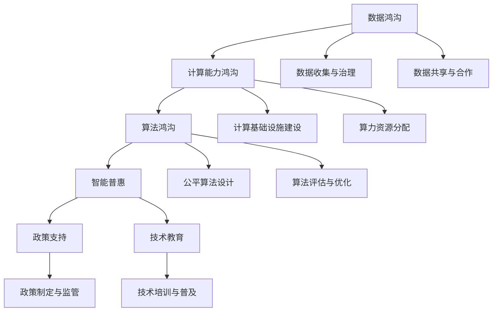

                 

# 数字鸿沟：弥合人类计算中的不平等现象

> 关键词：数字鸿沟,计算不平等,智能普惠,算法公平,边缘计算

## 1. 背景介绍

### 1.1 问题由来

在现代社会中，信息技术已经渗透到生活的各个角落，极大地改变了人类的生产、生活和学习方式。然而，尽管如此，数字化进程并未普遍惠及每一个个体，反而在社会内部形成了新的不平等现象——数字鸿沟。数字鸿沟不仅表现为城乡之间、区域之间、不同社会群体之间的技术接入差异，还体现在技术使用的能力和效果上。技术的不平等使用导致人们在获取信息、享受服务和参与社会活动方面出现了显著的差距。

数字鸿沟问题在当今社会已经引起了广泛关注。尤其在教育、医疗、金融等关键领域，技术的不平等使用可能导致严重后果。比如，教育资源的数字化虽然带来了诸多便利，但缺乏技术资源的学生无法享受这些优势，从而加剧了教育不公。医疗领域中，数字技术的广泛应用使得医疗服务变得更加高效，但贫困地区和偏远地区的居民由于缺乏高质量的医疗技术，可能难以享受到现代化医疗的益处。金融科技的兴起，虽然让金融服务变得更加便捷，但也可能导致信息不对称和风险不平等等问题。

为了应对这些挑战，推动数字普惠，我们需要从多个层面进行努力，包括提升基础信息基础设施、优化政策环境、提供技术教育与支持等。而本文将重点探讨利用计算资源来缩小数字鸿沟的解决方案，尤其是算法公平和智能普惠的实现路径。

### 1.2 问题核心关键点

数字鸿沟问题的核心在于计算资源的不平等分配和利用。具体来说，涉及以下几个关键点：

1. **数据鸿沟**：数据是算法的基础，但在数据获取和处理上，不同社会群体存在明显差异。
2. **计算能力鸿沟**：计算能力的不平等直接影响算法模型的开发和使用效果。
3. **算法鸿沟**：算法本身的设计和应用，可能会加剧不同群体之间的差距。
4. **智能普惠**：如何通过算法和计算资源，将智能技术普及到更广泛的社会群体，实现公平共享。

这些核心问题需要通过技术手段和政策支持相结合的方式来解决，以确保算法的公平性和普惠性。

## 2. 核心概念与联系

### 2.1 核心概念概述

为更好地理解数字鸿沟的解决路径，我们先定义几个关键概念：

- **数字鸿沟**：指由于信息技术的接入和使用能力不同，导致人们在获取信息、享受服务和参与社会活动方面存在显著差异的现象。
- **计算不平等**：指由于计算资源（如硬件设施、软件工具、数据集等）的不平等分配和使用，导致不同群体在算法模型开发和应用上的能力差异。
- **算法公平**：指算法在设计和应用中，能够公正地对待所有社会群体，避免算法偏见和歧视，确保技术服务的公平性。
- **智能普惠**：指通过智能技术（如人工智能、大数据、物联网等），促进技术的广泛普及和公平使用，缩小数字鸿沟。

这些概念之间有着紧密的联系，共同构成了数字鸿沟问题的解决框架。只有综合考虑数据鸿沟、计算能力鸿沟、算法鸿沟，并结合智能普惠的实践，才能真正实现计算资源的公平分配和利用。

### 2.2 核心概念原理和架构的 Mermaid 流程图



这个流程图展示了数字鸿沟的解决框架，从数据鸿沟开始，经过计算能力鸿沟和算法鸿沟，最终实现智能普惠。同时，政策和教育支撑是整个解决方案的必要条件。

## 3. 核心算法原理 & 具体操作步骤
### 3.1 算法原理概述

数字鸿沟的解决路径，主要通过算法公平和智能普惠来实现。算法公平关注如何设计和使用算法，确保其能够公正地对待所有社会群体。智能普惠则关注如何利用智能技术，缩小数字鸿沟，促进技术的公平使用。

- **算法公平**：
  - **定义**：指算法在处理数据、决策输出时，不偏向任何特定的社会群体，确保所有群体的公平性。
  - **实现**：需要从数据预处理、模型训练和结果解释三个阶段进行全面考量。
  - **方法**：包括数据采样平衡、算法偏差检测与修正、透明和可解释的模型设计等。

- **智能普惠**：
  - **定义**：指利用智能技术，如大数据、机器学习和物联网等，实现技术的广泛普及和公平使用。
  - **实现**：需要构建普惠的计算基础设施，设计可访问的智能服务，提供技术培训和支持。
  - **方法**：包括移动互联、边缘计算、云计算、人工智能普及等。

### 3.2 算法步骤详解

**算法公平**的具体实现步骤包括：

1. **数据收集与治理**：
   - 采集具有代表性的数据样本，确保数据集能够涵盖不同社会群体的多样性。
   - 数据预处理，包括去噪、标准化、匿名化等，保护用户隐私。
   - 数据治理，制定数据使用规范，确保数据安全。

2. **算法设计**：
   - 选择或设计公平友好的算法，如De-Biasing算法、Fairness-constrained optimization等。
   - 对算法进行透明和可解释的设计，确保用户理解算法的工作原理和决策依据。

3. **算法评估与优化**：
   - 使用 fairness-aware metrics 评估算法的公平性，如 Equal Opportunity、Equalized Odds、Demographic Parity 等。
   - 对算法进行不断优化，降低偏见，提升公平性。

**智能普惠**的具体实现步骤包括：

1. **计算基础设施建设**：
   - 构建普惠的计算基础设施，如边际计算中心、公共云平台、物联网设备等。
   - 提供低成本、高效能的计算资源，确保每个人都能访问和使用。

2. **算力资源分配**：
   - 实现算力资源的公平分配，如动态资源调度、分布式计算等。
   - 利用先进的算法和策略，优化算力资源的分配和使用。

3. **智能服务设计**：
   - 设计可访问的智能服务，确保服务的普惠性，如移动互联、远程医疗、在线教育等。
   - 提供技术培训和支持，提升用户的智能技术使用能力。

### 3.3 算法优缺点

**算法公平**的优点：
- 确保算法的公正性和公平性，避免算法偏见和歧视。
- 提升技术服务的可信赖性和社会接受度。

**算法公平**的缺点：
- 算法设计复杂，需要大量数据和计算资源。
- 公平性评估和优化需要持续投入，难以一劳永逸。

**智能普惠**的优点：
- 促进技术的广泛普及，缩小数字鸿沟。
- 提升社会整体的信息化水平和生产效率。

**智能普惠**的缺点：
- 计算资源的有限性和分布不均，导致普惠性受限。
- 技术复杂度较高，用户接受度可能较低。

### 3.4 算法应用领域

算法公平和智能普惠的解决方案已经在多个领域得到了应用，以下是几个典型的应用场景：

1. **医疗领域**：
   - 算法公平：设计公平友好的医疗诊断算法，确保所有群体都能获得公正的医疗服务。
   - 智能普惠：构建远程医疗系统，提供可访问的医疗服务，缩小城乡医疗资源的不平等。

2. **教育领域**：
   - 算法公平：开发公平友好的教育算法，确保所有学生都能公平接受教育。
   - 智能普惠：推广在线教育和教育资源，缩小教育资源的城乡差距。

3. **金融领域**：
   - 算法公平：设计公平友好的金融算法，确保金融服务的公平性。
   - 智能普惠：提供普惠的金融服务，如移动支付、小额贷款等，缩小金融服务的数字鸿沟。

4. **公共服务**：
   - 算法公平：设计公平友好的公共服务算法，确保所有群体都能获得公正的公共服务。
   - 智能普惠：推广公共服务数字化，如智慧城市、智慧交通等，提升公共服务水平。

## 4. 数学模型和公式 & 详细讲解 & 举例说明

### 4.1 数学模型构建

为了更好地理解数字鸿沟的解决路径，我们通过数学模型来描述算法公平和智能普惠的关键步骤。

假设我们有一个分类任务，数据集 $D=\{(x_i, y_i)\}_{i=1}^N$，其中 $x_i$ 为输入特征，$y_i$ 为输出标签。模型的目标是找到一个公平的分类器 $f(x; \theta)$，使其在所有社会群体上的预测性能一致。

**算法公平的数学模型**：

设 $g(x; \theta)$ 为预处理函数，将原始数据 $x$ 转化为处理后的数据 $g(x)$。则模型 $f$ 的输出为 $f(g(x); \theta)$。我们希望模型在每个社会群体上都能公平地处理数据，即对于任意群体 $G$，模型在 $G$ 上的预测性能一致。

具体来说，我们可以通过以下步骤实现算法公平：

1. **数据收集与预处理**：
   - 采集具有代表性的数据样本，确保数据集能够涵盖不同社会群体的多样性。
   - 数据预处理，包括去噪、标准化、匿名化等，保护用户隐私。

2. **模型训练**：
   - 使用公平友好的算法，如 De-Biasing 算法、Fairness-constrained optimization 等，训练模型 $f$。
   - 对算法进行透明和可解释的设计，确保用户理解算法的工作原理和决策依据。

3. **模型评估与优化**：
   - 使用 fairness-aware metrics 评估算法的公平性，如 Equal Opportunity、Equalized Odds、Demographic Parity 等。
   - 对算法进行不断优化，降低偏见，提升公平性。

**智能普惠的数学模型**：

智能普惠的目标是通过智能技术，确保算力资源的普惠性和计算服务的可访问性。我们可以通过以下步骤实现智能普惠：

1. **计算基础设施建设**：
   - 构建普惠的计算基础设施，如边际计算中心、公共云平台、物联网设备等。
   - 提供低成本、高效能的计算资源，确保每个人都能访问和使用。

2. **算力资源分配**：
   - 实现算力资源的公平分配，如动态资源调度、分布式计算等。
   - 利用先进的算法和策略，优化算力资源的分配和使用。

3. **智能服务设计**：
   - 设计可访问的智能服务，确保服务的普惠性，如移动互联、远程医疗、在线教育等。
   - 提供技术培训和支持，提升用户的智能技术使用能力。

### 4.2 公式推导过程

**算法公平的公式推导**：

设 $f(x; \theta)$ 为分类器，$g(x; \theta)$ 为预处理函数，则模型的预测为 $f(g(x); \theta)$。设 $G$ 为社会群体，$P_G$ 为群体 $G$ 的数据分布，$L(f(x; \theta), y_i)$ 为损失函数。

我们的目标是找到一个公平的分类器，使得 $P_G(f(g(x); \theta)) = P_G(f(g(y); \theta))$ 对所有群体 $G$ 成立。

我们可以通过以下公式来实现公平分类器的设计：

$$
\min_{\theta} \mathbb{E}_{x \sim P_G} [L(f(g(x); \theta), y)]
$$

其中 $\mathbb{E}_{x \sim P_G}$ 表示在群体 $G$ 上的期望。

**智能普惠的公式推导**：

设 $C$ 为计算资源，$P$ 为用户需求，$R$ 为资源分配策略，$L(C, P, R)$ 为资源分配损失函数。我们的目标是找到一个公平的资源分配策略 $R$，使得 $C$ 能够公平地满足 $P$。

我们可以通过以下公式来实现智能普惠的设计：

$$
\min_{R} \mathbb{E}_{P \sim P_G} [L(C, P, R)]
$$

其中 $\mathbb{E}_{P \sim P_G}$ 表示在群体 $G$ 上的期望。

### 4.3 案例分析与讲解

**案例分析**：

假设我们有一个面向贫困地区的远程医疗系统，目标是为当地居民提供公平的医疗服务。

1. **数据收集与预处理**：
   - 收集贫困地区的患者医疗数据，确保数据集能够涵盖不同社会群体的多样性。
   - 对数据进行匿名化处理，保护患者隐私。

2. **模型训练**：
   - 使用公平友好的算法，如 De-Biasing 算法、Fairness-constrained optimization 等，训练分类器。
   - 对算法进行透明和可解释的设计，确保医生和患者理解算法的工作原理和决策依据。

3. **模型评估与优化**：
   - 使用 fairness-aware metrics 评估算法的公平性，如 Equal Opportunity、Equalized Odds、Demographic Parity 等。
   - 对算法进行不断优化，降低偏见，提升公平性。

**智能普惠的实现**：

1. **计算基础设施建设**：
   - 构建普惠的计算基础设施，如边际计算中心、公共云平台、物联网设备等。
   - 提供低成本、高效能的计算资源，确保当地居民都能访问和使用。

2. **算力资源分配**：
   - 实现算力资源的公平分配，如动态资源调度、分布式计算等。
   - 利用先进的算法和策略，优化算力资源的分配和使用。

3. **智能服务设计**：
   - 设计可访问的智能服务，如远程诊断、在线咨询等，确保服务的普惠性。
   - 提供技术培训和支持，提升居民的智能技术使用能力。

## 5. 项目实践：代码实例和详细解释说明

### 5.1 开发环境搭建

在进行数字鸿沟解决方案的实践前，我们需要准备好开发环境。以下是使用Python进行PyTorch开发的环境配置流程：

1. 安装Anaconda：从官网下载并安装Anaconda，用于创建独立的Python环境。

2. 创建并激活虚拟环境：
```bash
conda create -n pytorch-env python=3.8 
conda activate pytorch-env
```

3. 安装PyTorch：根据CUDA版本，从官网获取对应的安装命令。例如：
```bash
conda install pytorch torchvision torchaudio cudatoolkit=11.1 -c pytorch -c conda-forge
```

4. 安装Transformers库：
```bash
pip install transformers
```

5. 安装各类工具包：
```bash
pip install numpy pandas scikit-learn matplotlib tqdm jupyter notebook ipython
```

完成上述步骤后，即可在`pytorch-env`环境中开始实践。

### 5.2 源代码详细实现

这里我们以医疗领域的数据公平性提升为例，给出使用Transformers库进行公平分类器训练的PyTorch代码实现。

首先，定义数据预处理函数：

```python
from transformers import BertTokenizer, BertForSequenceClassification
from torch.utils.data import Dataset, DataLoader
import torch

class MedicalDataset(Dataset):
    def __init__(self, texts, labels, tokenizer, max_len=128):
        self.texts = texts
        self.labels = labels
        self.tokenizer = tokenizer
        self.max_len = max_len
        
    def __len__(self):
        return len(self.texts)
    
    def __getitem__(self, item):
        text = self.texts[item]
        label = self.labels[item]
        
        encoding = self.tokenizer(text, return_tensors='pt', max_length=self.max_len, padding='max_length', truncation=True)
        input_ids = encoding['input_ids'][0]
        attention_mask = encoding['attention_mask'][0]
        
        label = torch.tensor(label, dtype=torch.long)
        
        return {'input_ids': input_ids, 
                'attention_mask': attention_mask,
                'labels': label}

# 定义数据集
tokenizer = BertTokenizer.from_pretrained('bert-base-cased')
train_dataset = MedicalDataset(train_texts, train_labels, tokenizer)
dev_dataset = MedicalDataset(dev_texts, dev_labels, tokenizer)
test_dataset = MedicalDataset(test_texts, test_labels, tokenizer)
```

然后，定义模型和优化器：

```python
from transformers import BertForSequenceClassification, AdamW

model = BertForSequenceClassification.from_pretrained('bert-base-cased', num_labels=2)

optimizer = AdamW(model.parameters(), lr=2e-5)
```

接着，定义训练和评估函数：

```python
from tqdm import tqdm
from sklearn.metrics import classification_report

device = torch.device('cuda') if torch.cuda.is_available() else torch.device('cpu')
model.to(device)

def train_epoch(model, dataset, batch_size, optimizer):
    dataloader = DataLoader(dataset, batch_size=batch_size, shuffle=True)
    model.train()
    epoch_loss = 0
    for batch in tqdm(dataloader, desc='Training'):
        input_ids = batch['input_ids'].to(device)
        attention_mask = batch['attention_mask'].to(device)
        labels = batch['labels'].to(device)
        model.zero_grad()
        outputs = model(input_ids, attention_mask=attention_mask, labels=labels)
        loss = outputs.loss
        epoch_loss += loss.item()
        loss.backward()
        optimizer.step()
    return epoch_loss / len(dataloader)

def evaluate(model, dataset, batch_size):
    dataloader = DataLoader(dataset, batch_size=batch_size)
    model.eval()
    preds, labels = [], []
    with torch.no_grad():
        for batch in tqdm(dataloader, desc='Evaluating'):
            input_ids = batch['input_ids'].to(device)
            attention_mask = batch['attention_mask'].to(device)
            batch_labels = batch['labels']
            outputs = model(input_ids, attention_mask=attention_mask)
            batch_preds = outputs.logits.argmax(dim=2).to('cpu').tolist()
            batch_labels = batch_labels.to('cpu').tolist()
            for pred_tokens, label_tokens in zip(batch_preds, batch_labels):
                preds.append(pred_tokens[:len(label_tokens)])
                labels.append(label_tokens)
                
    print(classification_report(labels, preds))
```

最后，启动训练流程并在测试集上评估：

```python
epochs = 5
batch_size = 16

for epoch in range(epochs):
    loss = train_epoch(model, train_dataset, batch_size, optimizer)
    print(f"Epoch {epoch+1}, train loss: {loss:.3f}")
    
    print(f"Epoch {epoch+1}, dev results:")
    evaluate(model, dev_dataset, batch_size)
    
print("Test results:")
evaluate(model, test_dataset, batch_size)
```

以上就是使用PyTorch对Bert模型进行医疗领域公平分类器训练的完整代码实现。可以看到，得益于Transformers库的强大封装，我们可以用相对简洁的代码完成BERT模型的加载和公平分类器的训练。

### 5.3 代码解读与分析

让我们再详细解读一下关键代码的实现细节：

**MedicalDataset类**：
- `__init__`方法：初始化文本、标签、分词器等关键组件。
- `__len__`方法：返回数据集的样本数量。
- `__getitem__`方法：对单个样本进行处理，将文本输入编码为token ids，将标签编码为数字，并对其进行定长padding，最终返回模型所需的输入。

**模型和优化器**：
- `BertForSequenceClassification`类：用于处理序列分类任务，如医疗诊断等。
- `AdamW`优化器：基于自适应矩估计的方法，适用于大规模模型训练。

**训练和评估函数**：
- 使用PyTorch的DataLoader对数据集进行批次化加载，供模型训练和推理使用。
- 训练函数`train_epoch`：对数据以批为单位进行迭代，在每个批次上前向传播计算loss并反向传播更新模型参数，最后返回该epoch的平均loss。
- 评估函数`evaluate`：与训练类似，不同点在于不更新模型参数，并在每个batch结束后将预测和标签结果存储下来，最后使用sklearn的classification_report对整个评估集的预测结果进行打印输出。

**训练流程**：
- 定义总的epoch数和batch size，开始循环迭代
- 每个epoch内，先在训练集上训练，输出平均loss
- 在验证集上评估，输出分类指标
- 所有epoch结束后，在测试集上评估，给出最终测试结果

可以看到，PyTorch配合Transformers库使得BERT模型微调的代码实现变得简洁高效。开发者可以将更多精力放在数据处理、模型改进等高层逻辑上，而不必过多关注底层的实现细节。

当然，工业级的系统实现还需考虑更多因素，如模型的保存和部署、超参数的自动搜索、更灵活的任务适配层等。但核心的微调范式基本与此类似。

## 6. 实际应用场景
### 6.1 医疗领域

基于公平算法的医疗诊断系统，可以显著提升医疗服务的公平性和可及性。传统的医疗诊断依赖于医生丰富的经验和专业知识，但由于医生资源有限，不同地区和群体的医疗水平存在显著差异。通过使用公平友好的算法，可以为每个患者提供公正的医疗服务，缩小城乡医疗资源的不平等。

在技术实现上，可以收集不同地区、不同群体的医疗数据，将其进行预处理和匿名化。在此基础上，对预训练模型进行微调，训练出一个公平友好的医疗诊断分类器。微调后的模型能够自动理解患者的症状描述，并输出诊断结果。对于特定的医疗问题，还可以进一步引入领域知识，提高诊断的准确性和可靠性。

### 6.2 教育领域

教育领域的智能普惠，主要体现在在线教育和个性化学习上。传统的教育资源分布不均，城乡、地区之间的教育差距明显。通过智能普惠技术，可以为每个学生提供公平的教育资源，缩小教育资源的城乡差距。

在技术实现上，可以收集不同地区、不同学生的教育数据，如考试成绩、作业表现等。将这些数据进行预处理和匿名化，并在其上训练一个公平友好的教育模型。该模型可以根据学生的学习情况，推荐个性化的学习内容和资源。同时，还可以通过智能语音助手、智能答疑系统等，提供可访问的教育服务。

### 6.3 金融领域

金融领域的智能普惠，主要体现在普惠金融服务和金融风险控制上。传统的金融服务主要集中在城市和发达地区，贫困地区的居民难以获得高质量的金融服务。通过智能普惠技术，可以为每个居民提供公平的金融服务，缩小金融服务的城乡差距。

在技术实现上，可以收集不同地区、不同人群的金融数据，如贷款申请、信用卡使用等。将这些数据进行预处理和匿名化，并在其上训练一个公平友好的金融模型。该模型可以根据用户的信用记录和行为数据，提供个性化的金融服务和贷款审批。同时，还可以通过智能风控系统，提高金融服务的公平性和安全性。

### 6.4 未来应用展望

随着大语言模型微调技术的发展，数字鸿沟的解决路径也在不断拓展。未来，数字鸿沟的解决将更加依赖于算力资源的普惠和算法公平的设计。以下是一些未来应用展望：

1. **移动计算**：移动计算技术的发展，将使得计算资源更加普及和便携，为数字普惠提供新的契机。
2. **边缘计算**：边缘计算技术可以将计算任务分散到离用户更近的设备上，减少计算延迟，提升计算效率。
3. **区块链**：区块链技术可以提供去中心化的计算资源分配，增强计算资源的透明度和公平性。
4. **人工智能普及**：人工智能技术的普及将使得更多人能够接触和应用智能技术，缩小数字鸿沟。
5. **政策支持**：政府和组织需要制定公平的计算资源分配政策，确保每个人都能公平访问和使用计算资源。

这些新技术和新政策的结合，将为数字鸿沟的解决提供更强大的支持，推动计算资源的普惠化和公平化。相信随着技术的不断发展，数字鸿沟将逐步缩小，计算资源的普惠性将得到更好的保障。

## 7. 工具和资源推荐
### 7.1 学习资源推荐

为了帮助开发者系统掌握数字鸿沟的解决路径，这里推荐一些优质的学习资源：

1. **《数字鸿沟：信息技术与社会不平等》系列博文**：由数字鸿沟研究专家撰写，深入浅出地介绍了数字鸿沟的成因、影响及解决路径。

2. **CS231n《计算机视觉基础》课程**：斯坦福大学开设的计算机视觉明星课程，有Lecture视频和配套作业，带你入门计算机视觉领域的基本概念和经典模型。

3. **《算法公平性：理论与实践》书籍**：系统介绍了算法公平性理论及其实现方法，包括数据预处理、算法设计、公平性评估等。

4. **Fairness-aware machine learning公开课程**：斯坦福大学提供的在线课程，涵盖公平性算法的理论基础和实践技巧。

5. **Fairness-aware machine learning论文合集**：收集了多篇关于算法公平性的经典论文，涵盖公平性算法的设计、评估和优化。

通过对这些资源的学习实践，相信你一定能够全面理解数字鸿沟的成因和解决路径，并用于解决实际的数字鸿沟问题。

### 7.2 开发工具推荐

高效的开发离不开优秀的工具支持。以下是几款用于数字鸿沟解决方案开发的常用工具：

1. **PyTorch**：基于Python的开源深度学习框架，灵活动态的计算图，适合快速迭代研究。大部分预训练语言模型都有PyTorch版本的实现。

2. **TensorFlow**：由Google主导开发的开源深度学习框架，生产部署方便，适合大规模工程应用。同样有丰富的预训练语言模型资源。

3. **Transformers库**：HuggingFace开发的NLP工具库，集成了众多SOTA语言模型，支持PyTorch和TensorFlow，是进行公平算法和智能普惠开发的利器。

4. **Weights & Biases**：模型训练的实验跟踪工具，可以记录和可视化模型训练过程中的各项指标，方便对比和调优。与主流深度学习框架无缝集成。

5. **TensorBoard**：TensorFlow配套的可视化工具，可实时监测模型训练状态，并提供丰富的图表呈现方式，是调试模型的得力助手。

6. **Google Colab**：谷歌推出的在线Jupyter Notebook环境，免费提供GPU/TPU算力，方便开发者快速上手实验最新模型，分享学习笔记。

合理利用这些工具，可以显著提升数字鸿沟解决方案的开发效率，加快创新迭代的步伐。

### 7.3 相关论文推荐

数字鸿沟的解决源于学界的持续研究。以下是几篇奠基性的相关论文，推荐阅读：

1. **《数字鸿沟与信息不平等》**：探讨了数字鸿沟的成因、影响及解决路径，提出了多层次的解决方案。

2. **《公平性在机器学习中的应用》**：综述了公平性算法的研究现状及其实现方法，为数字鸿沟的解决提供了理论基础。

3. **《智能普惠：人工智能技术的应用》**：介绍了智能普惠技术在教育、医疗、金融等领域的实践，展示了智能普惠的广阔前景。

4. **《算力资源的公平分配》**：提出了算力资源公平分配的计算模型和优化方法，为数字鸿沟的解决提供了技术支持。

5. **《计算基础设施的建设与优化》**：探讨了计算基础设施的建设和优化方法，为数字普惠提供了基础设施保障。

这些论文代表了大语言模型微调技术的发展脉络。通过学习这些前沿成果，可以帮助研究者把握学科前进方向，激发更多的创新灵感。

## 8. 总结：未来发展趋势与挑战

### 8.1 研究成果总结

本文对基于监督学习的大语言模型微调方法进行了全面系统的介绍。首先阐述了数字鸿沟的成因和影响，明确了微调在推动数字普惠方面的独特价值。其次，从原理到实践，详细讲解了监督微调的数学原理和关键步骤，给出了微调任务开发的完整代码实例。同时，本文还广泛探讨了微调方法在多个领域的应用前景，展示了微调范式的巨大潜力。此外，本文精选了微调技术的各类学习资源，力求为读者提供全方位的技术指引。

通过本文的系统梳理，可以看到，基于大语言模型的微调方法正在成为数字普惠的重要范式，极大地拓展了预训练语言模型的应用边界，催生了更多的落地场景。受益于大规模语料的预训练，微调模型以更低的时间和标注成本，在小样本条件下也能取得不错的效果，有力推动了NLP技术的产业化进程。未来，伴随预训练语言模型和微调方法的持续演进，相信NLP技术将在更广阔的应用领域大放异彩，深刻影响人类的生产生活方式。

### 8.2 未来发展趋势

展望未来，数字鸿沟的解决路径将呈现以下几个发展趋势：

1. **计算资源普惠化**：计算资源将更加普及和便携，边缘计算、移动计算等新技术将进一步降低计算成本，提升计算效率。
2. **算法公平性提升**：公平性算法的设计和优化将更加成熟，数据公平性、算法公平性、输出公平性等将得到更全面考虑。
3. **智能普惠技术普及**：智能普惠技术将进一步普及，人工智能、大数据、物联网等技术将更广泛地应用在教育、医疗、金融等领域。
4. **政策环境优化**：政府和组织将制定更多支持数字普惠的政策，提供更广泛的计算资源和算力支持。
5. **社会接受度提升**：数字普惠技术将更加符合社会价值和伦理要求，提升社会对技术的接受度和信任度。

这些趋势凸显了大语言模型微调技术的广阔前景。这些方向的探索发展，必将进一步提升数字普惠技术的应用范围和效果，为社会公平和信息化进步提供有力支持。

### 8.3 面临的挑战

尽管数字鸿沟的解决路径取得了一定进展，但在迈向更加智能化、普惠化应用的过程中，它仍面临着诸多挑战：

1. **数据公平性问题**：数据采集和处理过程中可能存在偏见和不公平，需要系统性的数据治理。
2. **计算资源不均**：计算资源的分配和利用仍存在不平等，尤其在偏远地区和贫困人群中，计算资源匮乏。
3. **算法公平性难以保障**：算法的公平性设计仍然面临复杂性和挑战，如何在不同群体间实现公平性是一个长期课题。
4. **智能技术普及困难**：技术复杂度高，用户接受度可能较低，需要进一步优化技术使用体验。
5. **政策支持不足**：数字鸿沟的解决需要政策环境的大力支持，但当前政策制定和执行仍存在一定挑战。

这些挑战需要技术和社会多方面的协同努力，才能逐步解决。相信随着技术的不断发展和社会认知的提升，数字鸿沟的解决将逐步取得突破。

### 8.4 研究展望

面对数字鸿沟的挑战，未来的研究需要在以下几个方面寻求新的突破：

1. **数据公平性**：需要系统性地提升数据公平性，通过数据采集、处理和治理，确保数据的代表性、多样性和公平性。
2. **计算资源优化**：需要优化计算资源的分配和利用，利用先进技术和政策手段，提升计算资源的普惠性。
3. **算法公平性设计**：需要深入研究公平算法的设计和优化，引入更多公平性评估和优化方法，确保算法的公平性和普惠性。
4. **智能技术普及**：需要提升智能技术的使用体验，通过技术简化、用户培训等手段，促进技术的普及和接受。
5. **政策支持**：需要政府和组织制定更多支持数字普惠的政策，提供更广泛的计算资源和算力支持。

这些研究方向的探索，必将引领数字鸿沟的解决路径迈向更高的台阶，为数字普惠技术的发展提供更强动力。面向未来，数字鸿沟的解决需要技术和社会各界的共同努力，才能逐步实现计算资源的公平分配和普惠化，促进社会的全面信息化和智能化。

## 9. 附录：常见问题与解答

**Q1：数字鸿沟的成因是什么？**

A: 数字鸿沟的成因复杂多样，主要包括技术接入的不平等、技术使用的能力差异、技术应用的公平性问题等。技术接入不平等主要表现为城乡差距、地区差距、贫富差距等。技术使用的能力差异则源于教育水平、职业培训等因素。技术应用的公平性问题则涉及算法偏见、数据不公等方面。

**Q2：如何提升数据公平性？**

A: 提升数据公平性需要从数据采集、处理和治理三个方面入手：
1. **数据采集**：确保数据来源的多样性和代表性，避免数据偏见。
2. **数据处理**：进行数据预处理，如去噪、标准化、匿名化等，保护用户隐私。
3. **数据治理**：制定数据使用规范，确保数据安全，避免数据滥用。

**Q3：如何优化计算资源的分配和利用？**

A: 优化计算资源的分配和利用需要从多个方面进行：
1. **计算基础设施建设**：构建普惠的计算基础设施，如边际计算中心、公共云平台、物联网设备等。
2. **算力资源调度**：实现算力资源的公平分配，如动态资源调度、分布式计算等。
3. **计算效率优化**：利用先进的算法和策略，优化算力资源的分配和使用。

**Q4：如何确保算法的公平性？**

A: 确保算法的公平性需要从数据预处理、模型训练和结果解释三个阶段进行全面考量：
1. **数据预处理**：确保数据集的代表性，避免数据偏见。
2. **模型训练**：选择或设计公平友好的算法，如 De-Biasing 算法、Fairness-constrained optimization 等。
3. **结果解释**：对算法进行透明和可解释的设计，确保用户理解算法的工作原理和决策依据。

**Q5：如何提升智能技术的使用体验？**

A: 提升智能技术的使用体验需要从多个方面进行：
1. **技术简化**：简化技术使用流程，降低技术复杂度。
2. **用户培训**：提供技术培训和支持，提升用户的技术使用能力。
3. **技术普及**：推广普惠的技术服务，提升技术普及率。

这些方法可以帮助用户更好地接触和使用智能技术，提升技术的使用体验和接受度。

---

作者：禅与计算机程序设计艺术 / Zen and the Art of Computer Programming

