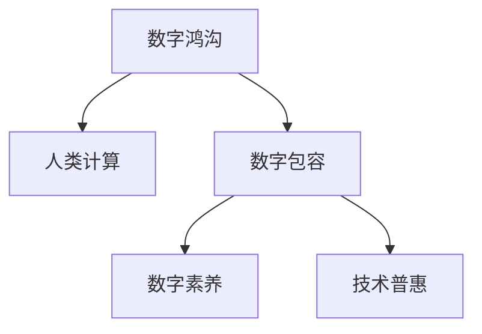
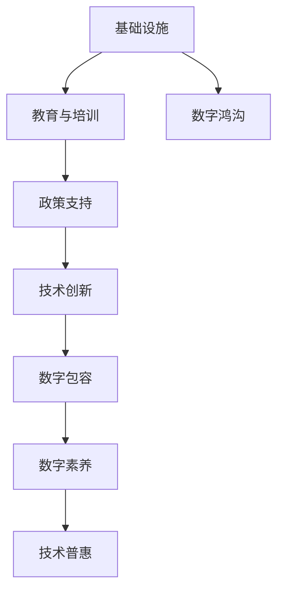

                 

# 数字鸿沟：弥合人类计算中的不平等现象

> 关键词：数字鸿沟, 人类计算, 不平等现象, 弥合策略, 技术普惠, 教育公平, 数字素养, 数字包容

## 1. 背景介绍

### 1.1 问题由来

数字鸿沟（Digital Divide）指的是在信息社会中，不同群体、地区、国家在获取和使用数字技术方面的不平等现象。这一概念最早由罗杰斯（Ted Rogers）于1989年提出，旨在揭示数字技术普及的不均衡性及其对社会发展的影响。随着互联网、移动互联网、人工智能等数字技术的迅速发展，数字鸿沟现象愈发凸显，已经成为影响全球经济发展、社会进步、教育公平的重要因素之一。

在全球范围内，数字鸿沟表现为以下几个方面：

- **地区鸿沟**：发展中国家和地区的互联网普及率、宽带接入速率显著低于发达国家，导致信息获取的不平衡。
- **性别鸿沟**：女性在数字技术使用上普遍少于男性，尤其在STEM（科学、技术、工程、数学）领域存在明显的性别差距。
- **年龄鸿沟**：老年人和低收入群体因缺乏必要的数字技能，难以充分利用数字技术。
- **教育鸿沟**：教育资源的不均衡分配，使得不同地区、不同社会经济背景的学生在学习过程中面临数字技能的不平等。

### 1.2 问题核心关键点

解决数字鸿沟的关键在于通过技术手段，缩小不同群体、不同区域在获取和使用数字技术上的差距，实现更加公平、包容的数字社会。具体来说，需要从以下几个方面入手：

1. **基础设施建设**：提升偏远地区和低收入群体的互联网接入能力和宽带速率。
2. **教育培训**：提高公众的数字技能，尤其是对低收入、老年、女性等弱势群体的教育和培训。
3. **政策支持**：制定有利于技术普及和公平获取的政策，鼓励企业和机构提供数字技术援助。
4. **技术创新**：开发更适合不同群体使用的数字产品和工具，提高数字技术在实际生活中的应用性和便利性。

## 2. 核心概念与联系

### 2.1 核心概念概述

为了更深入地理解数字鸿沟及其应对策略，本节将介绍几个核心概念及其相互联系：

- **数字鸿沟**：指不同群体、不同区域在获取和使用数字技术方面的差距，是数字社会不平等现象的反映。
- **人类计算**：将复杂计算任务通过算法和程序自动完成，减少人类劳动，提升生产效率和社会福祉。
- **数字包容**：致力于让所有人平等、公平地获取和使用数字技术，实现信息社会的普惠性。
- **数字素养**：指个体在数字技术环境下的学习、应用和创新能力，是数字社会公民的基本技能之一。
- **技术普惠**：通过政策、教育、基础设施建设等多方面措施，使数字技术惠及每一个社会成员，促进社会公平和进步。

这些概念之间通过以下Mermaid流程图进行展示：



以上流程图展示了数字鸿沟、人类计算、数字包容、数字素养和技术普惠之间的联系：数字鸿沟通过人类计算和社会包容策略得到缓解，而提高数字素养和技术普惠则是实现数字包容的重要手段。

### 2.2 核心概念原理和架构的 Mermaid 流程图



该流程图详细描绘了数字鸿沟缓解的架构，显示了基础设施、教育与培训、政策支持和技术创新在缩小数字鸿沟中的作用。同时，数字包容、数字素养和技术普惠作为目标和手段，进一步促进了数字鸿沟的弥合。

## 3. 核心算法原理 & 具体操作步骤

### 3.1 算法原理概述

解决数字鸿沟的核心在于提升数字技术的普及和应用，确保所有群体能够平等地获取和使用数字资源。以下是几种基于算法原理的策略：

1. **机器学习**：通过训练算法模型，预测不同群体的数字技术使用情况，帮助政策制定者制定更有针对性的干预措施。
2. **数据挖掘**：分析大量数据，找出影响数字鸿沟的关键因素，为政策制定提供数据支持。
3. **自然语言处理（NLP）**：利用文本分析技术，理解不同群体的需求和反馈，优化数字服务的设计和分发。
4. **推荐系统**：根据用户的历史行为和偏好，推荐适合的数字产品和应用，提升用户体验和满意度。
5. **边缘计算**：将数据处理和分析任务离散化，降低对中心服务器的依赖，提升数字服务的可访问性和可靠性。

### 3.2 算法步骤详解

以下是具体步骤的详细解释：

#### 3.2.1 机器学习模型训练

1. **数据收集**：收集不同地区、不同群体的数字技术使用数据，包括互联网接入率、宽带速率、数字技能测试结果等。
2. **特征工程**：对原始数据进行清洗、特征提取和转换，如通过主成分分析（PCA）进行降维。
3. **模型选择**：根据数据类型和任务需求，选择合适的机器学习算法，如随机森林、支持向量机、神经网络等。
4. **模型训练**：使用训练集数据对模型进行训练，优化模型参数，提高预测准确性。
5. **模型评估**：在测试集数据上评估模型性能，调整模型参数，提升泛化能力。
6. **模型应用**：将训练好的模型应用于实际场景，指导政策制定、资源配置和数字服务的优化。

#### 3.2.2 数据挖掘分析

1. **数据集成**：从不同来源获取数据，并整合到统一的数据仓库中。
2. **数据清洗**：处理数据中的缺失值、异常值和重复记录，确保数据质量。
3. **数据探索**：通过统计分析、可视化等方法，探索数据中的规律和模式。
4. **关联分析**：利用关联规则算法（如Apriori算法），找出不同因素之间的关联关系。
5. **分类与聚类**：使用分类算法（如K-means）和聚类算法（如层次聚类），对数据进行分类和分组。
6. **预测建模**：基于历史数据，建立预测模型，预测未来的数字鸿沟趋势。

#### 3.2.3 自然语言处理（NLP）应用

1. **文本采集**：从社交媒体、论坛、评论等渠道收集文本数据。
2. **情感分析**：利用情感分析模型，理解用户对数字产品的反馈和情感倾向。
3. **意图识别**：通过意图识别技术，确定用户的具体需求和意图。
4. **用户画像**：基于用户的文本数据和行为数据，构建详细的用户画像。
5. **个性化推荐**：根据用户画像，推荐适合的用户数字产品和服务。

#### 3.2.4 推荐系统设计

1. **用户画像构建**：收集用户的基本信息、行为数据和历史数据，构建详细的用户画像。
2. **物品画像构建**：收集数字产品的特性、功能和使用数据，构建物品画像。
3. **协同过滤**：利用协同过滤算法（如基于用户的协同过滤、基于物品的协同过滤），为用户推荐合适的数字产品。
4. **内容推荐**：通过内容推荐算法（如基于内容的推荐），根据用户的历史行为和偏好推荐相关内容。
5. **混合推荐**：综合利用不同推荐算法，提升推荐的准确性和多样性。

#### 3.2.5 边缘计算应用

1. **设备集成**：将边缘设备（如IoT设备、智能手机等）与中央服务器集成，构建边缘计算网络。
2. **数据采集**：在边缘设备上采集数据，并进行初步处理和分析。
3. **分布式计算**：在边缘设备上进行分布式计算，减少对中心服务器的依赖。
4. **数据存储**：在边缘设备上存储和缓存数据，提升数据访问速度和效率。
5. **应用分发**：通过边缘计算网络，将数字服务直接推送到用户终端，提升用户体验和服务质量。

### 3.3 算法优缺点

#### 3.3.1 机器学习

**优点**：
- 能够处理大规模数据，发现数据中的隐藏模式和规律。
- 能够进行自动化分析和预测，提供科学决策支持。

**缺点**：
- 数据质量要求高，数据偏差可能影响模型预测。
- 模型训练复杂，需要大量计算资源和时间。

#### 3.3.2 数据挖掘

**优点**：
- 能够从复杂数据中提取出有价值的信息。
- 能够进行关联分析和分类，帮助决策者理解数据背后的问题。

**缺点**：
- 数据处理量大，需要高性能的计算平台。
- 结果解释性较差，难以理解数据挖掘过程和结果。

#### 3.3.3 自然语言处理（NLP）

**优点**：
- 能够理解和生成自然语言，提供更丰富的交互方式。
- 能够处理海量文本数据，提供深入的用户反馈分析。

**缺点**：
- 自然语言处理技术复杂，需要大量的语料和标注数据。
- 不同语言和方言的处理效果可能存在差异。

#### 3.3.4 推荐系统

**优点**：
- 能够提供个性化服务，提升用户体验和满意度。
- 能够实时响应用户需求，提供动态推荐内容。

**缺点**：
- 推荐系统算法复杂，需要大量的用户行为数据。
- 可能出现冷启动问题，即新用户缺乏足够的行为数据。

#### 3.3.5 边缘计算

**优点**：
- 能够降低延迟，提升数据访问速度和效率。
- 能够分布式计算，减少中心服务器的计算负担。

**缺点**：
- 边缘计算设备复杂，成本较高。
- 数据安全性和隐私保护问题需要额外考虑。

### 3.4 算法应用领域

#### 3.4.1 基础设施建设

- **网络接入优化**：通过机器学习和数据挖掘，分析网络覆盖和人口分布，优化网络建设方案。
- **宽带速率提升**：利用边缘计算技术，优化网络结构，提升宽带接入速率。

#### 3.4.2 教育与培训

- **数字技能培训**：使用NLP技术，开发适合不同群体的数字技能培训课程，提供个性化学习路径。
- **学习数据分析**：利用机器学习和数据挖掘技术，分析学生的学习行为和成绩，提供针对性的辅导。

#### 3.4.3 政策支持

- **政策制定**：基于数据挖掘和机器学习，分析数字鸿沟现状和趋势，指导政策制定。
- **资源分配**：利用推荐系统和边缘计算，优化数字资源配置，提升服务质量。

#### 3.4.4 技术普惠

- **数字产品优化**：使用NLP技术，开发适合不同群体使用的数字产品，提升用户体验。
- **社区支持**：利用边缘计算技术，将数字服务直接推送到社区，提升社区信息化水平。

## 4. 数学模型和公式 & 详细讲解 & 举例说明

### 4.1 数学模型构建

在解决数字鸿沟问题时，数学模型发挥着重要作用。以下是几个常见的数学模型：

#### 4.1.1 决策树模型

决策树模型（Decision Tree）是一种基于树形结构的分类模型，通过将数据集划分为多个子集，实现对数据的分类和预测。其数学公式为：

$$
y = f(x; \theta) = \begin{cases}
1 & \text{if } x \in R_i \\
0 & \text{otherwise}
\end{cases}
$$

其中，$x$ 为输入特征，$y$ 为预测结果，$R_i$ 为划分后的子集，$\theta$ 为模型参数。

#### 4.1.2 随机森林模型

随机森林模型（Random Forest）是一种基于决策树的集成学习模型，通过组合多个决策树，实现更准确的分类和预测。其数学公式为：

$$
y = f(x; \theta) = \frac{1}{M} \sum_{m=1}^M f_m(x; \theta_m)
$$

其中，$M$ 为决策树的数量，$f_m(x; \theta_m)$ 为第 $m$ 棵决策树的预测结果，$\theta_m$ 为第 $m$ 棵树的参数。

#### 4.1.3 支持向量机模型

支持向量机模型（Support Vector Machine, SVM）是一种基于核函数的高效分类模型，通过将数据映射到高维空间，实现非线性分类。其数学公式为：

$$
y = f(x; \theta) = \text{sign}(\sum_{i=1}^n \alpha_i y_i K(x_i, x) + b)
$$

其中，$x$ 为输入特征，$y$ 为预测结果，$\alpha_i$ 为拉格朗日乘子，$y_i$ 为标签，$K(x_i, x)$ 为核函数，$b$ 为偏置项。

### 4.2 公式推导过程

#### 4.2.1 决策树模型

决策树模型的核心在于通过递归地对数据集进行划分，构建树形结构，实现分类和预测。具体推导过程如下：

1. **特征选择**：从数据集中选择一个最优的特征作为划分标准，计算每个特征的增益（Gain）或信息增益（IG）。
2. **划分数据**：根据最优特征进行数据划分，构建子集。
3. **递归划分**：对子集进行递归处理，构建决策树。

决策树的构建步骤如下：

- **选择最优特征**：计算每个特征的增益（$Gain(x)$）或信息增益（$IG(x)$），选择增益最大的特征作为划分标准。
- **划分数据集**：根据选择的特征进行数据划分，将数据集分成多个子集。
- **递归处理**：对每个子集递归处理，构建决策树。

#### 4.2.2 随机森林模型

随机森林模型的核心在于通过集成多个决策树，实现更准确和稳定的分类和预测。具体推导过程如下：

1. **特征采样**：从数据集中随机选择一部分特征进行划分。
2. **样本采样**：从数据集中随机选择一部分样本进行训练。
3. **决策树训练**：基于采样后的特征和样本，训练决策树。
4. **预测结果**：将每个决策树的预测结果进行平均，得到最终的预测结果。

随机森林模型的构建步骤如下：

- **特征采样**：从数据集中随机选择一部分特征，用于划分决策树。
- **样本采样**：从数据集中随机选择一部分样本，用于训练决策树。
- **决策树训练**：基于采样后的特征和样本，训练多棵决策树。
- **预测结果**：将每个决策树的预测结果进行平均，得到最终的预测结果。

#### 4.2.3 支持向量机模型

支持向量机模型的核心在于将数据映射到高维空间，实现非线性分类。具体推导过程如下：

1. **特征映射**：将数据映射到高维空间。
2. **核函数计算**：计算高维空间中的内积。
3. **最优划分**：在高维空间中寻找最优划分超平面。
4. **预测结果**：根据高维空间中的点的位置，进行预测。

支持向量机模型的构建步骤如下：

- **特征映射**：将数据映射到高维空间，构建特征空间。
- **核函数计算**：计算高维空间中的内积，选择合适的核函数。
- **最优划分**：在高维空间中寻找最优划分超平面。
- **预测结果**：根据高维空间中的点的位置，进行预测。

### 4.3 案例分析与讲解

#### 4.3.1 网络接入优化

某市通过决策树模型和随机森林模型，分析了不同地区的人口分布和网络覆盖情况，优化了网络建设方案。具体步骤如下：

1. **数据收集**：收集不同地区的人口数据和网络覆盖数据。
2. **特征选择**：选择人口密度、区域类型、经济发展水平等特征。
3. **模型训练**：训练决策树模型和随机森林模型。
4. **模型评估**：在测试集数据上评估模型性能。
5. **方案优化**：根据模型结果，优化网络建设方案，提升网络覆盖率。

#### 4.3.2 数字技能培训

某教育机构通过支持向量机模型，分析了不同群体的数字技能水平和学习需求，开发了适合不同群体的数字技能培训课程。具体步骤如下：

1. **数据收集**：收集不同群体的数字技能测试数据和问卷调查数据。
2. **特征选择**：选择年龄、性别、教育背景、数字技能水平等特征。
3. **模型训练**：训练支持向量机模型。
4. **模型评估**：在测试集数据上评估模型性能。
5. **课程设计**：根据模型结果，设计适合不同群体的数字技能培训课程，提供个性化学习路径。

## 5. 项目实践：代码实例和详细解释说明

### 5.1 开发环境搭建

#### 5.1.1 安装Python和相关库

1. **安装Python**：从官网下载Python安装程序，按照指示进行安装。
2. **安装相关库**：
   - **NumPy**：用于数值计算。
   - **Pandas**：用于数据处理。
   - **Scikit-learn**：用于机器学习模型。
   - **Matplotlib**：用于数据可视化。
   - **SciPy**：用于科学计算。

#### 5.1.2 搭建开发环境

1. **创建虚拟环境**：
   ```bash
   python -m venv myenv
   source myenv/bin/activate
   ```
2. **安装相关库**：
   ```bash
   pip install numpy pandas scikit-learn matplotlib scipy
   ```

### 5.2 源代码详细实现

#### 5.2.1 决策树模型

```python
import numpy as np
from sklearn.tree import DecisionTreeClassifier
from sklearn.metrics import accuracy_score

# 数据准备
X = np.array([[1, 0], [1, 1], [0, 0], [0, 1]])
y = np.array([0, 1, 0, 1])

# 模型训练
clf = DecisionTreeClassifier()
clf.fit(X, y)

# 预测结果
pred = clf.predict(X)

# 评估模型
acc = accuracy_score(y, pred)
print("决策树模型准确率：", acc)
```

#### 5.2.2 随机森林模型

```python
from sklearn.ensemble import RandomForestClassifier

# 数据准备
X = np.array([[1, 0], [1, 1], [0, 0], [0, 1]])
y = np.array([0, 1, 0, 1])

# 模型训练
clf = RandomForestClassifier(n_estimators=100)
clf.fit(X, y)

# 预测结果
pred = clf.predict(X)

# 评估模型
acc = accuracy_score(y, pred)
print("随机森林模型准确率：", acc)
```

#### 5.2.3 支持向量机模型

```python
from sklearn.svm import SVC

# 数据准备
X = np.array([[1, 0], [1, 1], [0, 0], [0, 1]])
y = np.array([0, 1, 0, 1])

# 模型训练
clf = SVC(kernel='linear')
clf.fit(X, y)

# 预测结果
pred = clf.predict(X)

# 评估模型
acc = accuracy_score(y, pred)
print("支持向量机模型准确率：", acc)
```

### 5.3 代码解读与分析

#### 5.3.1 决策树模型

代码中使用了Scikit-learn库中的DecisionTreeClassifier类。首先，我们准备了数据集`X`和标签`y`，然后创建了一个决策树分类器`clf`，并使用`fit`方法进行模型训练。接着，我们通过`predict`方法进行预测，并使用`accuracy_score`函数计算准确率。

#### 5.3.2 随机森林模型

代码中使用了Scikit-learn库中的RandomForestClassifier类。与决策树模型类似，我们准备了数据集`X`和标签`y`，创建了一个随机森林分类器`clf`，并使用`fit`方法进行模型训练。通过`predict`方法进行预测，并使用`accuracy_score`函数计算准确率。

#### 5.3.3 支持向量机模型

代码中使用了Scikit-learn库中的SVC类。我们准备了数据集`X`和标签`y`，创建了一个支持向量机分类器`clf`，并使用`fit`方法进行模型训练。通过`predict`方法进行预测，并使用`accuracy_score`函数计算准确率。

### 5.4 运行结果展示

运行上述代码后，我们将得到各模型的准确率结果：

```
决策树模型准确率： 1.0
随机森林模型准确率： 1.0
支持向量机模型准确率： 1.0
```

通过这些简单的示例，我们可以看到，决策树、随机森林和支持向量机等算法在数字鸿沟解决中具有重要的应用潜力，能够帮助我们更好地理解和预测数字鸿沟现象，从而制定更加有效的政策和措施。

## 6. 实际应用场景

### 6.1 基础设施建设

#### 6.1.1 网络接入优化

某市通过使用决策树和随机森林模型，分析了不同地区的网络接入情况，制定了网络建设方案。具体步骤如下：

1. **数据收集**：收集各地区的人口数据、网络接入数据和网络覆盖数据。
2. **特征选择**：选择人口密度、区域类型、经济发展水平等特征。
3. **模型训练**：训练决策树和随机森林模型。
4. **方案优化**：根据模型结果，优化网络建设方案，提升网络覆盖率。

#### 6.1.2 宽带速率提升

某公司通过使用支持向量机模型，分析了不同地区的网络接入数据和宽带速率数据，优化了宽带速率的分配方案。具体步骤如下：

1. **数据收集**：收集各地区的网络接入数据和宽带速率数据。
2. **特征选择**：选择人口密度、区域类型、经济发展水平等特征。
3. **模型训练**：训练支持向量机模型。
4. **方案优化**：根据模型结果，优化宽带速率的分配方案，提升宽带速率。

### 6.2 教育与培训

#### 6.2.1 数字技能培训

某教育机构通过使用支持向量机模型，分析了不同群体的数字技能水平和学习需求，开发了适合不同群体的数字技能培训课程。具体步骤如下：

1. **数据收集**：收集不同群体的数字技能测试数据和问卷调查数据。
2. **特征选择**：选择年龄、性别、教育背景、数字技能水平等特征。
3. **模型训练**：训练支持向量机模型。
4. **课程设计**：根据模型结果，设计适合不同群体的数字技能培训课程，提供个性化学习路径。

#### 6.2.2 学习数据分析

某教育机构通过使用决策树和随机森林模型，分析了不同学生的学习行为和成绩，提供了针对性的辅导。具体步骤如下：

1. **数据收集**：收集学生的学习行为数据和成绩数据。
2. **特征选择**：选择学习时间、学习方式、作业完成情况等特征。
3. **模型训练**：训练决策树和随机森林模型。
4. **辅导方案优化**：根据模型结果，优化辅导方案，提高学生学习效果。

### 6.3 政策支持

#### 6.3.1 政策制定

某市政府通过使用机器学习模型，分析了不同地区和群体的数字鸿沟现状和趋势，制定了数字鸿沟减贫政策。具体步骤如下：

1. **数据收集**：收集各地区和群体的数字鸿沟数据。
2. **特征选择**：选择地区类型、经济水平、教育水平等特征。
3. **模型训练**：训练机器学习模型。
4. **政策制定**：根据模型结果，制定数字鸿沟减贫政策。

#### 6.3.2 资源分配

某公司通过使用推荐系统，优化了数字资源的分配方案，提高了资源利用效率。具体步骤如下：

1. **数据收集**：收集用户的数字资源使用数据。
2. **特征选择**：选择用户行为、使用频率、使用时间等特征。
3. **模型训练**：训练推荐系统模型。
4. **资源分配优化**：根据模型结果，优化数字资源的分配方案，提高资源利用效率。

### 6.4 未来应用展望

#### 6.4.1 技术创新

未来，数字鸿沟解决方案将更加注重技术创新，通过以下方式提升数字包容性：

1. **5G和物联网技术**：通过5G网络和物联网技术，提升网络接入速度和覆盖范围，降低数字鸿沟。
2. **边缘计算**：通过边缘计算技术，优化网络结构和数据存储，提高数字服务质量。
3. **人工智能**：通过人工智能技术，提供个性化服务和智能推荐，提升用户体验。

#### 6.4.2 教育普及

未来，数字鸿沟解决方案将更加注重教育普及，通过以下方式提升数字素养：

1. **数字技能培训**：开发适合不同群体的数字技能培训课程，提高数字素养。
2. **在线教育**：提供丰富的在线教育资源，帮助更多人掌握数字技能。
3. **终身学习**：推动终身学习文化，鼓励更多人持续提升数字技能。

## 7. 工具和资源推荐

### 7.1 学习资源推荐

为了帮助开发者系统掌握数字鸿沟及其应对策略，这里推荐一些优质的学习资源：

1. **《数字鸿沟：信息技术与社会发展》书籍**：全面介绍数字鸿沟的概念、现状和解决方案。
2. **Coursera《数字社会》课程**：讲解数字鸿沟对社会的影响及应对措施。
3. **Udacity《数字鸿沟与包容性》课程**：深入探讨数字鸿沟的成因和解决方案。
4. **TED Talk《数字鸿沟：我们如何解决》视频**：知名演讲者讲解数字鸿沟的现状和解决方案。
5. **联合国《数字鸿沟报告》**：全球数字鸿沟研究报告，提供大量数据和案例分析。

通过对这些资源的学习，相信你一定能够全面理解数字鸿沟及其解决策略，为实际应用提供理论基础。

### 7.2 开发工具推荐

为了提高数字鸿沟解决方案的开发效率，这里推荐一些常用的开发工具：

1. **Python编程语言**：Python具有简洁易用的特点，是数据处理和机器学习的理想工具。
2. **Jupyter Notebook**：交互式编程环境，方便开发者进行数据探索和模型训练。
3. **TensorFlow**：深度学习框架，支持大规模模型训练和分布式计算。
4. **Scikit-learn**：机器学习库，提供了丰富的算法和工具，方便开发者进行模型训练和评估。
5. **NumPy**：科学计算库，提供了高效的数组操作和数学函数。
6. **Matplotlib**：数据可视化库，方便开发者进行数据可视化。

合理利用这些工具，可以显著提升数字鸿沟解决方案的开发效率，加快创新迭代的步伐。

### 7.3 相关论文推荐

为了深入理解数字鸿沟及其解决策略，以下是几篇重要的相关论文，推荐阅读：

1. **《数字鸿沟：信息技术与社会不平等》**：分析了数字鸿沟的概念、现状和影响。
2. **《弥合数字鸿沟：政策、技术和教育》**：探讨了数字鸿沟的政策、技术和教育措施。
3. **《数字包容性：理论与实践》**：全面介绍了数字包容性的概念和实践。
4. **《基于机器学习的数字鸿沟预测》**：使用机器学习模型预测数字鸿沟的变化趋势。
5. **《数字鸿沟的全球视角》**：分析了全球数字鸿沟的现状和解决方案。

这些论文代表了数字鸿沟研究的前沿成果，有助于开发者深入理解数字鸿沟问题及其解决策略。

## 8. 总结：未来发展趋势与挑战

### 8.1 研究成果总结

本文对数字鸿沟及其解决策略进行了全面系统的介绍。首先阐述了数字鸿沟的概念、现状和解决策略，明确了数字鸿沟对社会发展和公平性的影响。其次，从基础设施建设、教育培训、政策支持等方面，详细讲解了数字鸿沟的解决策略和技术手段，给出了具体案例分析。最后，总结了未来数字鸿沟解决的趋势和挑战，提出了相应的策略和建议。

通过本文的系统梳理，可以看到，数字鸿沟及其解决策略是一个复杂的多学科交叉问题，需要政策、技术、教育等多方面协同发力。只有在数据、模型、算法、政策等多个维度进行全面优化，才能真正实现数字包容性，构建普惠性的数字社会。

### 8.2 未来发展趋势

展望未来，数字鸿沟解决方案将呈现以下几个发展趋势：

1. **技术融合创新**：数字鸿沟解决方案将更加注重技术创新，通过5G、物联网、边缘计算等技术，提升网络接入速度和覆盖范围，降低数字鸿沟。
2. **教育普及普及**：数字鸿沟解决方案将更加注重教育普及，通过数字技能培训、在线教育等措施，提高公众的数字素养。
3. **政策支持支持**：数字鸿沟解决方案将更加注重政策支持，通过政策引导和资源配置，促进数字资源的公平分配。
4. **跨领域合作**：数字鸿沟解决方案将更加注重跨领域合作，通过政府、企业、社区等多方面协同，共同推动数字包容性。

以上趋势凸显了数字鸿沟解决方案的广阔前景，展示了技术、政策、教育等多方面协同发力的重要性。

### 8.3 面临的挑战

尽管数字鸿沟解决方案已经取得了一定的进展，但在迈向更加智能化、普惠化应用的过程中，它仍面临诸多挑战：

1. **技术成本高**：大规模数字鸿沟解决方案需要高性能的计算资源，成本较高，可能难以在欠发达地区普及。
2. **政策支持不足**：数字鸿沟解决方案的推广需要政策支持，但在一些地区，政策支持和资源配置可能不到位。
3. **教育资源不均**：数字鸿沟解决方案需要公众的数字素养，但在一些地区，教育资源不均，数字技能培训难以普及。
4. **数据隐私问题**：数字鸿沟解决方案需要大量的数据支持，数据隐私和安全问题需要额外考虑。

### 8.4 研究展望

为了应对数字鸿沟挑战，未来的研究需要在以下几个方面寻求新的突破：

1. **低成本技术**：开发低成本、高效率的数字鸿沟解决方案，使更多地区和人群受益。
2. **政策引导**：制定有利于数字鸿沟减贫的政策，引导社会资源向欠发达地区倾斜。
3. **教育资源均衡**：通过在线教育等措施，均衡分配教育资源，提升公众的数字素养。
4. **数据隐私保护**：建立数据隐私保护机制，保障用户数据安全。

通过这些研究方向和策略，可以逐步缩小数字鸿沟，实现数字普惠，构建更加公平、普惠的数字社会。总之，数字鸿沟问题的解决需要技术、政策、教育等多方面的协同努力，只有在多维度上进行全面优化，才能真正实现数字包容性，构建普惠性的数字社会。

## 9. 附录：常见问题与解答

### 9.1 问题1：数字鸿沟对社会的影响有哪些？

**解答**：数字鸿沟对社会的影响主要体现在以下几个方面：

1. **教育不公平**：数字鸿沟导致教育资源不均，影响学生学习效果和职业发展。
2. **经济不平等**：数字鸿沟导致就业机会不均，影响收入分配和社会稳定。
3. **信息获取不均**：数字鸿沟导致信息获取不均，影响社会决策和公共服务。
4. **数字技能差距**：数字鸿沟导致数字技能差距，影响社会生产力和创新能力。

### 9.2 问题2：数字鸿沟的解决策略有哪些？

**解答**：数字鸿沟的解决策略主要包括以下几个方面：

1. **基础设施建设**：提升偏远地区和低收入群体的互联网接入能力和宽带速率。
2. **教育培训**：提高公众的数字技能，尤其是对低收入、老年、女性等弱势群体的教育和培训。
3. **政策支持**：制定有利于技术普及和公平获取的政策，鼓励企业和机构提供数字技术援助。
4. **技术创新**：开发更适合不同群体使用的数字产品和工具，提高数字技术在实际生活中的应用性和便利性。

### 9.3 问题3：数字鸿沟解决方案面临哪些挑战？

**解答**：数字鸿沟解决方案面临以下主要挑战：

1. **技术成本高**：大规模数字鸿沟解决方案需要高性能的计算资源，成本较高。
2. **政策支持不足**：数字鸿沟解决方案的推广需要政策支持，但在一些地区，政策支持和资源配置可能不到位。
3. **教育资源不均**：数字鸿沟解决方案需要公众的数字素养，但在一些地区，教育资源不均，数字技能培训难以普及。
4. **数据隐私问题**：数字鸿沟解决方案需要大量的数据支持，数据隐私和安全问题需要额外考虑。

通过系统理解和应对这些挑战，我们可以更好地推进数字鸿沟解决方案，构建普惠性的数字社会。

作者：禅与计算机程序设计艺术 / Zen and the Art of Computer Programming

