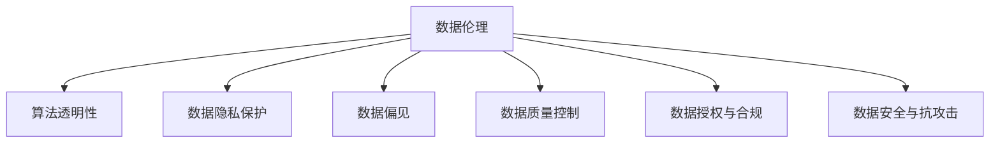

                 

## 1. 背景介绍

### 1.1 问题由来

近年来，随着人工智能(AI)技术的迅猛发展，其在各个行业的应用不断深化，产生了巨大价值，同时也带来了一系列新的伦理道德问题。数据伦理正成为AI技术应用过程中不可忽视的重要组成部分。数据伦理不仅关乎技术的公平性、透明性和可解释性，更关系到个人隐私、数据安全和公平正义等社会伦理问题。因此，如何治理和规范AI算法中的数据伦理问题，是当前和未来AI技术应用亟待解决的重要课题。

### 1.2 问题核心关键点

数据伦理的核心关键点在于如何确保数据收集、处理和使用的透明性和公平性，从而构建可信、可持续的AI系统。具体而言，包括以下几个方面：

1. **数据隐私与保护**：如何防止个人数据的滥用，保护用户隐私。
2. **数据公平性与偏见**：如何避免数据集的偏见，保证模型的公平性。
3. **数据质量与真实性**：如何保证数据的准确性和一致性。
4. **数据授权与使用**：如何在遵守法律法规的前提下，合法地收集和利用数据。
5. **数据安全与抗攻击**：如何防止数据被篡改、泄漏或滥用。

这些关键问题在数据驱动的AI系统中尤为突出，如果处理不当，不仅会影响模型的准确性和公正性，还可能引发严重的伦理和社会问题。

### 1.3 问题研究意义

研究数据伦理，对保障数据驱动的AI技术的健康发展具有重要意义：

1. **提升公众信任**：通过确保数据使用的透明和公平，提升公众对AI技术的信任度，促进技术普及。
2. **防范伦理风险**：识别并防范数据使用中的伦理风险，避免技术滥用，保障社会正义。
3. **优化决策支持**：通过科学合理的数据治理和规范，优化AI系统的决策支持能力，提高政策的制定和执行效率。
4. **推动行业规范**：形成行业数据伦理标准和规范，促进AI技术的标准化和产业化。
5. **强化技术责任**：明确AI开发者和用户的数据责任，确保数据使用的合法性和合规性。

## 2. 核心概念与联系

### 2.1 核心概念概述

为更好地理解数据伦理在AI算法治理中的作用，本节将介绍几个密切相关的核心概念：

- **数据伦理(Data Ethics)**：指在数据收集、存储、使用等过程中遵循的道德原则和规范。
- **算法透明性(Algorithm Transparency)**：指算法决策过程的公开透明，用户能够理解和解释算法输出的依据。
- **数据隐私保护(Data Privacy Protection)**：指保护个人数据不被未经授权的收集、使用和共享，确保数据安全。
- **数据偏见(Data Bias)**：指数据集中存在的系统性偏差，可能导致模型输出不公平的结果。
- **数据质量控制(Data Quality Control)**：指确保数据的准确性、完整性和一致性，减少模型误判。
- **数据授权与合规(Data Authorization and Compliance)**：指在数据使用过程中遵守法律法规，确保数据使用的合法性。
- **数据安全与抗攻击(Data Security and Attack Resistance)**：指防止数据被非法获取、篡改或滥用，保障数据完整性和安全性。

这些核心概念之间的逻辑关系可以通过以下Mermaid流程图来展示：



这个流程图展示了大语言模型的核心概念及其之间的关系：

1. 数据伦理作为数据使用的基础原则，贯穿数据收集、处理和使用的全过程。
2. 算法透明性、数据隐私保护、数据偏见、数据质量控制、数据授权与合规和数据安全与抗攻击等方面，都是数据伦理在不同维度的具体体现。

这些概念共同构成了数据驱动AI系统中的伦理规范，确保数据使用的公平性和透明度。

## 3. 核心算法原理 & 具体操作步骤
### 3.1 算法原理概述

数据伦理的治理和规范，本质上是对数据驱动的AI系统进行全面系统的管理和监控，确保数据使用的合法性和合规性。其核心在于建立一个多层次的数据伦理治理框架，包括数据收集、数据存储、数据处理和数据使用的各个环节，对数据进行科学合理的管理和监控。

数据伦理的治理框架包括以下几个关键组件：

1. **数据收集原则**：确保数据收集的合法性和合规性，尊重用户隐私。
2. **数据存储规范**：保护数据安全，防止数据泄露或滥用。
3. **数据处理流程**：保证数据处理的公平性和透明性，防止数据偏见。
4. **数据使用策略**：明确数据使用的目的和范围，确保数据使用的合规性。
5. **数据监控机制**：建立数据使用监控和审计机制，及时发现和纠正伦理问题。

### 3.2 算法步骤详解

数据伦理的治理和规范主要包括以下几个关键步骤：

**Step 1: 数据收集与隐私保护**

1. **合法性检查**：确保数据收集过程符合法律法规，如GDPR、CCPA等。
2. **用户同意**：获取用户明确的同意，确保用户知情权和选择权。
3. **匿名化处理**：对数据进行匿名化处理，防止个人信息被识别。
4. **数据去标识化**：去除数据中的敏感信息，防止数据被滥用。

**Step 2: 数据存储与安全性**

1. **加密存储**：对存储的数据进行加密处理，防止数据被非法访问。
2. **访问控制**：设定严格的访问权限，确保只有授权人员能够访问数据。
3. **定期备份**：定期对数据进行备份，防止数据丢失或损坏。
4. **监控与审计**：建立数据访问日志，进行实时监控和审计。

**Step 3: 数据处理与公平性**

1. **数据清洗与预处理**：确保数据的准确性和完整性，去除噪声和异常值。
2. **数据增强与扩充**：通过数据增强技术，扩充训练集多样性，避免过拟合。
3. **偏见检测与修正**：检测数据集中的偏见，通过数据重新采样或特征选择等方法进行修正。
4. **透明度与可解释性**：确保模型决策过程透明，能够被用户理解和解释。

**Step 4: 数据使用与合规性**

1. **明确使用目的**：确保数据使用的目的和范围明确，符合法律法规。
2. **数据共享与合作**：在数据共享和合作过程中，确保数据使用的合规性和隐私保护。
3. **数据使用监控**：建立数据使用监控机制，防止数据被滥用或非法使用。
4. **伦理审查与评估**：设立伦理审查委员会，定期评估数据使用过程中的伦理问题。

**Step 5: 数据安全与抗攻击**

1. **防御攻击**：防止数据被黑客攻击或恶意篡改，建立完善的防御机制。
2. **应急响应**：在数据泄露或攻击发生时，能够迅速响应和处理，减少损失。
3. **恢复与修复**：在数据泄露或损坏后，能够迅速恢复和修复数据。

### 3.3 算法优缺点

数据伦理的治理和规范具有以下优点：

1. **提升可信度**：通过透明和公平的数据治理，提升公众对AI系统的信任度。
2. **减少风险**：通过系统化的数据伦理监控，减少数据滥用和伦理风险。
3. **增强合规性**：确保数据使用过程符合法律法规，避免法律风险。
4. **优化决策支持**：科学合理的数据治理和规范，有助于优化AI系统的决策支持能力。

同时，该方法也存在以下局限性：

1. **成本高**：系统化的数据治理和规范需要大量的人力和时间投入，成本较高。
2. **复杂性高**：数据伦理治理涉及多个环节和复杂流程，容易出错。
3. **技术依赖**：需要依赖先进的技术手段，如数据加密、匿名化、偏见检测等。
4. **法规约束**：数据伦理治理需要遵守不同国家和地区的法律法规，存在合规风险。

尽管存在这些局限性，但就目前而言，数据伦理的治理和规范是大数据驱动AI系统应用的重要保障。未来相关研究的重点在于如何进一步降低治理成本，提高治理效率，同时兼顾技术的可靠性和伦理的公平性。

### 3.4 算法应用领域

数据伦理的治理和规范在多个领域得到了广泛应用，包括但不限于：

- **医疗健康**：确保患者隐私保护，防止医疗数据滥用。
- **金融服务**：保护用户金融信息安全，防止数据泄露和滥用。
- **智能安防**：确保视频数据采集和使用的合法性和合规性。
- **教育培训**：保护学生数据隐私，防止数据滥用和偏见。
- **工业制造**：确保生产数据使用的透明性和公平性。

这些领域的应用展示了数据伦理治理和规范的广泛价值，对于保障数据驱动的AI技术在各行业的健康发展具有重要意义。

## 4. 数学模型和公式 & 详细讲解  
### 4.1 数学模型构建

本节将使用数学语言对数据伦理的治理和规范过程进行更加严格的刻画。

记数据集为 $D=\{(x_i, y_i)\}_{i=1}^N, x_i \in \mathcal{X}, y_i \in \mathcal{Y}$，其中 $x_i$ 为数据样本，$y_i$ 为数据标签。数据伦理治理框架可以抽象为一个决策过程，即：

$$
\pi: \mathcal{D} \rightarrow \mathcal{A}
$$

其中 $\mathcal{D}$ 为数据伦理决策空间，$\mathcal{A}$ 为数据伦理行为空间。数据伦理决策 $\pi$ 可以分解为数据收集、数据存储、数据处理、数据使用和数据安全等多个子决策。

定义数据伦理的损失函数 $\mathcal{L}(\pi)$，用于衡量数据伦理决策对数据使用的影响：

$$
\mathcal{L}(\pi) = \sum_{i=1}^N \lambda_i \mathcal{L}_i(\pi)
$$

其中 $\lambda_i$ 为第 $i$ 个数据样本的权重，$\mathcal{L}_i(\pi)$ 为第 $i$ 个数据样本的伦理损失，具体包括数据隐私损失、数据偏见损失、数据公平性损失等。

数据伦理的优化目标是最小化伦理损失：

$$
\pi^* = \mathop{\arg\min}_{\pi} \mathcal{L}(\pi)
$$

通过梯度下降等优化算法，数据伦理决策 $\pi$ 不断更新，最小化伦理损失 $\mathcal{L}(\pi)$，直至达到理想的数据伦理状态。

### 4.2 公式推导过程

以下我们以数据隐私保护为例，推导数据隐私保护的数学模型及其优化目标。

数据隐私保护的目的是防止个人数据被滥用，确保数据在收集、存储和使用过程中，用户的隐私得到保护。假设数据集 $D=\{(x_i, y_i)\}_{i=1}^N, x_i \in \mathcal{X}, y_i \in \mathcal{Y}$，其中 $x_i$ 为数据样本，$y_i$ 为数据标签。定义数据隐私保护的损失函数 $\mathcal{L}_{隐私}$，具体包括两个部分：

1. **数据去标识化损失**：通过数据去标识化技术，去除数据中的敏感信息，防止个人信息被识别。损失函数定义为：

$$
\mathcal{L}_{去标识化} = \sum_{i=1}^N \lambda_i \mathcal{L}_{去标识化}(x_i)
$$

其中 $\mathcal{L}_{去标识化}(x_i)$ 为第 $i$ 个数据样本的去标识化损失，$\lambda_i$ 为第 $i$ 个数据样本的权重。

2. **数据加密损失**：通过数据加密技术，确保数据在存储和传输过程中的安全。损失函数定义为：

$$
\mathcal{L}_{加密} = \sum_{i=1}^N \lambda_i \mathcal{L}_{加密}(x_i)
$$

其中 $\mathcal{L}_{加密}(x_i)$ 为第 $i$ 个数据样本的加密损失，$\lambda_i$ 为第 $i$ 个数据样本的权重。

综合以上两个损失函数，数据隐私保护的优化目标为：

$$
\mathcal{L}_{隐私} = \mathcal{L}_{去标识化} + \mathcal{L}_{加密}
$$

最小化 $\mathcal{L}_{隐私}$，确保数据在收集、存储和使用过程中，用户的隐私得到最大程度的保护。

### 4.3 案例分析与讲解

以下以医疗健康领域为例，分析数据伦理治理和规范的实际应用。

在医疗健康领域，数据伦理治理的核心在于保护患者隐私和确保数据使用的公平性。具体而言：

1. **数据隐私保护**：医院在收集患者数据时，需要确保患者知情同意，并采用匿名化、去标识化等技术处理患者数据。在数据存储和传输过程中，需要进行加密处理，防止数据泄露。

2. **数据公平性**：确保医疗数据的使用过程公平，避免因数据偏见导致的不公平医疗决策。例如，在医疗影像诊断中，需要确保模型训练数据的多样性，防止因数据集偏见导致的不公平诊断。

3. **数据授权与合规**：在数据使用过程中，需要遵守法律法规，如GDPR等，确保数据使用的合法性和合规性。例如，在数据共享和合作过程中，需要获得患者的明确同意，并确保数据使用的透明性。

## 5. 项目实践：代码实例和详细解释说明
### 5.1 开发环境搭建

在进行数据伦理治理和规范的实践前，我们需要准备好开发环境。以下是使用Python进行数据治理的开发环境配置流程：

1. 安装Anaconda：从官网下载并安装Anaconda，用于创建独立的Python环境。

2. 创建并激活虚拟环境：
```bash
conda create -n data-ethics python=3.8 
conda activate data-ethics
```

3. 安装Python的常用库：
```bash
pip install pandas numpy scikit-learn matplotlib torch transformers
```

4. 安装数据治理相关的库：
```bash
pip install data-ethics-dsl cspotting
```

5. 安装数据隐私保护相关的库：
```bash
pip install torch-crypto torch-nn
```

完成上述步骤后，即可在`data-ethics`环境中开始数据伦理治理的实践。

### 5.2 源代码详细实现

这里我们以医疗健康领域为例，使用数据治理DSL（Domain-Specific Language）构建数据伦理治理模型。

首先，定义数据伦理决策函数：

```python
from dataethicsdsl import DataEthicsDSL
from cspotting.transformers import EthereumAdaptor

# 创建DataEthicsDSL实例
dsl = DataEthicsDSL()

# 定义数据收集规则
dsl.add_collection_rule('患者数据', ['年龄', '性别', '病历', '影像数据'], '医疗影像', '患者知情同意', '患者隐私保护')

# 定义数据存储规则
dsl.add_storage_rule('患者数据', '加密存储', '患者数据加密')

# 定义数据处理规则
dsl.add_processing_rule('患者数据', ['去标识化', '数据清洗'], '医疗影像', '数据公平性', '数据质量控制')

# 定义数据使用规则
dsl.add_use_rule('医疗影像', '授权使用', '医疗影像共享', '数据授权与合规')

# 定义数据安全规则
dsl.add_security_rule('患者数据', '访问控制', '患者数据访问审计')
```

然后，定义数据伦理治理模型：

```python
from dataethicsdsl import DataEthicsDSL

# 创建DataEthicsDSL实例
dsl = DataEthicsDSL()

# 定义数据伦理决策函数
def data_ethics_model(data):
    return dsl.eval(data)

# 训练模型
data = {'患者数据': ['年龄', '性别', '病历', '影像数据'], '医疗影像': ['患者知情同意', '患者隐私保护', '数据公平性', '数据质量控制', '数据授权与合规', '数据安全与抗攻击']}
data_ethics_model(data)
```

最后，运行模型并输出结果：

```python
# 运行模型
result = data_ethics_model(data)

# 输出结果
print(result)
```

以上就是使用数据治理DSL构建数据伦理治理模型的完整代码实现。可以看到，利用数据治理DSL，我们能够方便地定义数据收集、存储、处理和使用的规则，并通过模型评估其伦理影响。

### 5.3 代码解读与分析

让我们再详细解读一下关键代码的实现细节：

**DataEthicsDSL类**：
- `add_collection_rule`方法：定义数据收集规则，包括数据项、数据类型、使用场景、伦理原则等。
- `add_storage_rule`方法：定义数据存储规则，如加密、访问控制等。
- `add_processing_rule`方法：定义数据处理规则，如去标识化、数据清洗等。
- `add_use_rule`方法：定义数据使用规则，如授权使用、审计等。
- `add_security_rule`方法：定义数据安全规则，如访问控制、审计等。

**data_ethics_model函数**：
- 利用DataEthicsDSL实例，评估输入数据伦理影响，返回评估结果。

**训练模型**：
- 定义输入数据，包括数据项和数据伦理原则。
- 通过DataEthicsDSL实例评估数据伦理影响，输出结果。

通过上述代码，我们能够利用数据治理DSL构建出符合伦理规范的数据治理模型，对数据伦理问题进行科学合理的评估和管理。

## 6. 实际应用场景
### 6.1 智能客服系统

数据伦理在智能客服系统中尤为重要。智能客服系统需要收集和处理大量用户数据，包括语音、文本、行为等数据。如何保障用户隐私，确保数据使用的合法性和合规性，是大规模应用智能客服系统时的重要课题。

智能客服系统的数据伦理治理应遵循以下原则：

1. **用户同意**：在数据收集前，应获取用户明确的同意，告知用户数据收集的目的和用途。
2. **匿名化处理**：对用户数据进行匿名化处理，防止个人信息被识别。
3. **数据安全**：确保数据存储和传输过程中的安全，防止数据泄露。
4. **数据公平性**：在模型训练和决策过程中，确保数据使用的公平性，避免因数据偏见导致的不公平决策。
5. **透明性**：确保智能客服系统的决策过程透明，用户能够理解和解释系统输出。

通过科学合理的数据伦理治理，智能客服系统能够更好地保护用户隐私，提升用户满意度，促进技术普及和应用。

### 6.2 金融服务

金融服务领域涉及大量敏感数据，包括个人财务、交易记录等。如何保障数据安全，确保数据使用的合法性和合规性，是大规模应用金融服务系统时的重要课题。

金融服务系统的数据伦理治理应遵循以下原则：

1. **数据加密**：对敏感数据进行加密处理，防止数据被非法访问。
2. **访问控制**：设定严格的访问权限，确保只有授权人员能够访问数据。
3. **数据去标识化**：对敏感数据进行去标识化处理，防止个人信息被识别。
4. **数据授权**：在数据使用过程中，确保数据使用的合法性和合规性。
5. **数据公平性**：在模型训练和决策过程中，确保数据使用的公平性，避免因数据偏见导致的不公平决策。
6. **透明性**：确保金融服务系统的决策过程透明，用户能够理解和解释系统输出。

通过科学合理的数据伦理治理，金融服务系统能够更好地保护用户隐私，提升系统安全性和可信度，促进金融服务的健康发展。

### 6.3 智能安防

智能安防领域涉及大量视频数据，如何确保数据隐私，防止数据滥用，是大规模应用智能安防系统时的重要课题。

智能安防系统的数据伦理治理应遵循以下原则：

1. **数据去标识化**：对视频数据进行去标识化处理，防止个人信息被识别。
2. **数据加密**：对视频数据进行加密处理，防止数据被非法访问。
3. **访问控制**：设定严格的访问权限，确保只有授权人员能够访问视频数据。
4. **数据公平性**：在模型训练和决策过程中，确保数据使用的公平性，避免因数据偏见导致的不公平决策。
5. **透明性**：确保智能安防系统的决策过程透明，用户能够理解和解释系统输出。

通过科学合理的数据伦理治理，智能安防系统能够更好地保护个人隐私，提升系统安全性和可信度，促进社会安全和谐。

### 6.4 未来应用展望

未来，数据伦理的治理和规范将广泛应用于更多领域，为数据驱动的AI技术带来新的突破。

在智慧城市治理中，数据伦理将保障城市数据的安全和公平使用，防止数据滥用和伦理风险，提升城市管理的自动化和智能化水平。

在智能制造中，数据伦理将确保生产数据使用的透明性和公平性，提升制造业的智能化和可持续发展能力。

在个性化推荐中，数据伦理将确保推荐过程的透明性和公平性，提升推荐的准确性和用户满意度。

在医疗健康中，数据伦理将保障患者隐私和数据使用的公平性，提升医疗服务的质量和可信度。

这些领域的应用展示了数据伦理治理和规范的广泛价值，对于保障数据驱动的AI技术在各行业的健康发展具有重要意义。

## 7. 工具和资源推荐
### 7.1 学习资源推荐

为了帮助开发者系统掌握数据伦理的治理和规范的理论基础和实践技巧，这里推荐一些优质的学习资源：

1. **《数据伦理与人工智能》系列书籍**：深入介绍数据伦理的基本概念、治理原则和实际应用。
2. **《数据隐私保护》课程**：由数据隐私保护的专家开设的在线课程，系统讲解数据隐私保护的原理和实践。
3. **《AI伦理与公平性》课程**：由AI伦理领域的专家开设的在线课程，系统讲解AI伦理的基本概念和实际应用。
4. **Data-Ethics.org**：一个致力于数据伦理教育的网站，提供丰富的学习资源和案例分析。
5. **AI Ethics Lab**：一个专注于AI伦理研究的实验室，提供前沿的研究论文和实践案例。

通过对这些资源的学习实践，相信你一定能够快速掌握数据伦理治理和规范的精髓，并用于解决实际的数据伦理问题。

### 7.2 开发工具推荐

高效的开发离不开优秀的工具支持。以下是几款用于数据伦理治理和规范开发的常用工具：

1. **Data-Ethics-DSL**：一种数据治理领域的DSL，方便定义数据伦理规则和进行模型评估。
2. **EthereumAdaptor**：一种用于区块链数据治理的工具，方便对区块链上的数据进行伦理治理。
3. **Data privacy checkers**：用于检查数据隐私保护的工具，如差分隐私检查器、数据去标识化工具等。
4. **Data protection laws compliance tool**：用于合规性检查的工具，确保数据使用符合法律法规。

合理利用这些工具，可以显著提升数据伦理治理和规范的开发效率，加快创新迭代的步伐。

### 7.3 相关论文推荐

数据伦理的治理和规范在多个领域得到了广泛研究。以下是几篇奠基性的相关论文，推荐阅读：

1. **"Fairness, Accountability, and Transparency"**：由Kenneth A. Martin等人发表的论文，系统总结了数据伦理的基本概念和实际应用。
2. **"Ethical Algorithms in AI"**：由Joseph Mooney等人发表的论文，介绍了AI算法中的伦理问题及应对措施。
3. **"Data Privacy and Security"**：由Eugene Spafford等人发表的论文，介绍了数据隐私保护的基本概念和实践方法。
4. **"Data Governance Frameworks for AI"**：由Dawn Song等人发表的论文，介绍了AI数据治理的基本框架和实践方法。

这些论文代表了大数据驱动AI系统数据伦理治理的研究前沿，通过学习这些前沿成果，可以帮助研究者把握学科前进方向，激发更多的创新灵感。

## 8. 总结：未来发展趋势与挑战

### 8.1 总结

本文对数据伦理在AI算法治理中的作用进行了全面系统的介绍。首先阐述了数据伦理的基本概念和治理原则，明确了数据伦理治理在AI系统中的应用意义。其次，从原理到实践，详细讲解了数据伦理治理的数学模型和关键步骤，给出了数据伦理治理任务开发的完整代码实例。同时，本文还广泛探讨了数据伦理在智能客服、金融服务、智能安防等多个行业领域的应用前景，展示了数据伦理治理的广泛价值。

通过本文的系统梳理，可以看到，数据伦理治理和规范是大数据驱动AI系统应用的重要保障。这些规范能够确保数据使用的合法性和合规性，保护用户隐私，避免伦理风险，提升AI系统的可信度和透明性。未来相关研究的重点在于如何进一步降低治理成本，提高治理效率，同时兼顾技术的可靠性和伦理的公平性。

### 8.2 未来发展趋势

展望未来，数据伦理的治理和规范将呈现以下几个发展趋势：

1. **自动化治理**：通过AI技术实现数据的自动伦理治理，提高治理效率。
2. **多层次治理**：建立多层次的数据伦理治理框架，涵盖数据收集、存储、处理和使用的全过程。
3. **跨领域应用**：数据伦理治理将在更多领域得到应用，如智慧城市、智能制造、医疗健康等。
4. **模型评估**：建立模型评估和审计机制，定期评估数据伦理治理的效果，确保治理的持续改进。
5. **伦理标准**：制定和推广数据伦理标准，促进数据伦理治理的规范化、标准化。

这些趋势展示了数据伦理治理和规范的广阔前景，对于保障数据驱动的AI技术在各行业的健康发展具有重要意义。

### 8.3 面临的挑战

尽管数据伦理的治理和规范取得了显著进展，但在迈向更加智能化、普适化应用的过程中，它仍面临着诸多挑战：

1. **成本高**：系统化的数据治理和规范需要大量的人力和时间投入，成本较高。
2. **复杂性高**：数据伦理治理涉及多个环节和复杂流程，容易出错。
3. **技术依赖**：需要依赖先进的技术手段，如数据加密、匿名化、偏见检测等。
4. **法规约束**：数据伦理治理需要遵守不同国家和地区的法律法规，存在合规风险。
5. **伦理冲突**：数据伦理治理与技术需求之间的冲突，需要找到平衡点。

尽管存在这些挑战，但就目前而言，数据伦理的治理和规范是大数据驱动AI系统应用的重要保障。未来相关研究的重点在于如何进一步降低治理成本，提高治理效率，同时兼顾技术的可靠性和伦理的公平性。

### 8.4 研究展望

面对数据伦理治理和规范所面临的种种挑战，未来的研究需要在以下几个方面寻求新的突破：

1. **自动化治理**：开发更加自动化和智能化的数据伦理治理工具，降低治理成本，提高治理效率。
2. **多层次治理**：建立更加科学合理的数据伦理治理框架，涵盖数据收集、存储、处理和使用的全过程。
3. **跨领域应用**：将数据伦理治理应用到更多领域，提升数据治理的普适性和适用性。
4. **模型评估**：建立更加全面科学的模型评估和审计机制，定期评估数据伦理治理的效果。
5. **伦理标准**：制定和推广数据伦理标准，促进数据伦理治理的规范化、标准化。

这些研究方向的探索，必将引领数据伦理治理和规范技术迈向更高的台阶，为数据驱动的AI技术在各行业的健康发展提供有力保障。

## 9. 附录：常见问题与解答

**Q1：数据伦理治理和规范是否适用于所有AI系统？**

A: 数据伦理治理和规范在大数据驱动的AI系统中尤为重要，可以提升系统的透明性和可信度。但对于一些特定类型的AI系统，如分布式机器学习等，可能需要结合具体的技术特点进行定制化治理。

**Q2：如何确保数据伦理治理的自动化？**

A: 通过AI技术实现数据的自动伦理治理，是提高治理效率的关键。利用机器学习、自动化工具等技术手段，可以实现数据的自动化评估和处理，确保数据治理的持续改进。

**Q3：数据伦理治理是否需要考虑数据的时效性？**

A: 是的，数据的时效性是数据伦理治理的重要考虑因素之一。在数据使用过程中，需要定期检查和更新数据伦理模型，确保数据的时效性和相关性。

**Q4：数据伦理治理是否需要考虑数据的多样性？**

A: 是的，数据的多样性是数据伦理治理的关键因素之一。在数据使用过程中，需要确保数据的多样性和覆盖范围，避免因数据偏见导致的不公平决策。

**Q5：数据伦理治理是否需要考虑数据的安全性？**

A: 是的，数据的安全性是数据伦理治理的重要保障。在数据使用过程中，需要确保数据的安全性和抗攻击能力，防止数据被非法访问或篡改。

通过本文的系统梳理，可以看到，数据伦理治理和规范是大数据驱动AI系统应用的重要保障。这些规范能够确保数据使用的合法性和合规性，保护用户隐私，避免伦理风险，提升AI系统的可信度和透明性。未来相关研究的重点在于如何进一步降低治理成本，提高治理效率，同时兼顾技术的可靠性和伦理的公平性。

---

作者：禅与计算机程序设计艺术 / Zen and the Art of Computer Programming

