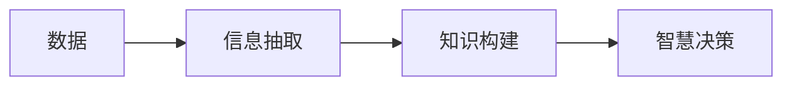

                 

## 1. 背景介绍

### 1.1 问题由来

在信息技术迅猛发展的今天，数据（Data）和信息（Information）的洪流已经深入到社会各个角落。然而，仅仅依靠数据和信息的堆积，并不能真正解决现实问题。知识（Knowledge）和智慧（Wisdom）的提取与应用，才是推动社会进步的核心动力。

人类对数据和信息的收集与利用，已经持续了几千年。然而，知识的获取与传播、智慧的利用与创造，才是真正意义上的认知革命。数据是信息的基础，信息是知识的来源，知识是智慧的媒介。而从数据到智慧，正是认知的阶梯。

### 1.2 问题核心关键点

从数据到智慧的认知阶梯，涉及数据管理、信息抽取、知识构建、智慧决策等多个层面。这一过程中，技术手段的演化与创新，扮演着至关重要的角色。

- **数据管理**：如何高效、安全地存储、管理和更新数据，是大规模应用的基础。
- **信息抽取**：从海量数据中，抽取出有用信息，为知识构建和智慧决策提供数据支撑。
- **知识构建**：将信息转化为结构化知识，形成可重复利用、可解释的知识体系。
- **智慧决策**：在知识基础上，进行推理、决策，实现智能化应用。

这一认知阶梯的每个步骤，都需要先进的算法、高效的模型、可靠的技术支撑。而本文将深入探讨这一过程的每个环节，揭示技术进步的奥秘。

### 1.3 问题研究意义

理解数据、信息、知识、智慧的认知阶梯，不仅有助于推动技术的发展，也具有深刻的理论意义和实际应用价值：

- **理论价值**：探索认知阶梯的每一个环节，有助于深化对人类认知过程的理解，为人工智能、认知科学等领域的学术研究提供理论支撑。
- **技术价值**：掌握技术手段，将数据转化为信息、知识、智慧，是当前信息技术研究的重要课题，有助于推动各行业数字化转型升级。
- **应用价值**：在智慧城市、智能制造、医疗健康等多个领域，知识与智慧的充分利用，将极大提升各行业的智能化水平，驱动经济发展。

## 2. 核心概念与联系

### 2.1 核心概念概述

为更好地理解从数据到智慧的认知阶梯，本节将介绍几个核心概念：

- **数据（Data）**：原始的事实记录，是信息、知识、智慧的基础。
- **信息（Information）**：对数据的加工和抽取，形成有结构、可利用的知识单元。
- **知识（Knowledge）**：结构化的信息集合，具备明确的逻辑关系，支持推理、决策等智慧活动。
- **智慧（Wisdom）**：基于知识的深度学习和推理，实现对复杂现象的全面理解与决策。

这些核心概念之间存在紧密的联系，通过一系列技术手段，将数据转化为信息、知识，最终形成智慧，构成了从数据到智慧的认知阶梯。

### 2.2 核心概念原理和架构的 Mermaid 流程图



### 2.3 核心概念之间的联系

数据、信息、知识、智慧之间的联系主要体现在以下几个方面：

- **数据为信息提供素材**：数据经过信息抽取技术，转化为有结构、有意义的信息。
- **信息为知识提供原料**：信息经过知识构建技术，转化为结构化的知识体系。
- **知识为智慧提供基础**：知识经过智慧决策技术，转化为对复杂现象的全面理解与决策。

这三个步骤相互依赖、相辅相成，共同构成了从数据到智慧的认知阶梯。

## 3. 核心算法原理 & 具体操作步骤

### 3.1 算法原理概述

从数据到智慧的认知阶梯，涉及多个关键算法和技术的融合。以下将详细介绍每个步骤的核心算法原理：

- **数据管理算法**：如分布式文件系统、数据库管理系统、数据仓库等。
- **信息抽取算法**：如自然语言处理（NLP）、信息检索、文本挖掘等。
- **知识构建算法**：如知识图谱构建、本体论建模、语义网构建等。
- **智慧决策算法**：如机器学习、深度学习、推理算法等。

### 3.2 算法步骤详解

#### 3.2.1 数据管理算法

**步骤一：数据收集与存储**
- 使用分布式文件系统（如Hadoop、HDFS），高效存储大规模数据。
- 设计合理的数据库管理系统（如MySQL、PostgreSQL），实现数据的结构化存储和管理。
- 构建数据仓库（如Hive、Impala），支持复杂查询和多维度分析。

**步骤二：数据处理与清洗**
- 使用ETL工具（如Apache NiFi、Talend），自动抽取、转换和加载数据。
- 应用数据清洗技术（如缺失值填充、异常值检测），保证数据质量。
- 采用数据湖技术（如AWS Lake Formation），灵活存储和管理多样化的数据。

**步骤三：数据安全与隐私保护**
- 设计数据访问控制策略，限制敏感数据的访问权限。
- 应用数据加密技术（如AES、RSA），保护数据传输和存储安全。
- 实施数据隐私保护策略（如差分隐私、联邦学习），确保用户隐私。

#### 3.2.2 信息抽取算法

**步骤一：文本预处理**
- 应用分词、词性标注、命名实体识别等NLP技术，对文本进行初步处理。
- 设计规则引擎（如Apache Jena、Stanford CoreNLP），支持复杂的抽取规则。
- 使用信息抽取工具（如OpenIE、Probase），自动识别事实关系。

**步骤二：实体识别与关系抽取**
- 应用命名实体识别（NER）技术，识别文本中的关键实体（如人名、地名、组织名等）。
- 使用关系抽取算法（如FisaM，Glasserman & Kao），识别实体之间的关系（如“在…公司任职”）。
- 设计知识图谱框架（如DBpedia、YAGO），将抽取的信息组织成知识图谱。

**步骤三：信息聚合与主题建模**
- 应用信息聚合技术（如PageRank、TextRank），将相关信息聚合在一起。
- 设计主题模型（如Latent Dirichlet Allocation，LDA），发现文本中的隐含主题。
- 应用元搜索技术（如Ravenpack、FTK），快速搜索和聚合相关文档。

#### 3.2.3 知识构建算法

**步骤一：本体构建与映射**
- 应用本体构建技术（如OWL、RDFS），定义知识模型的逻辑结构。
- 设计本体映射策略（如R2RML、KBQA），实现本体之间的映射与集成。
- 应用本体演化技术（如OWL-2RL），动态更新本体模型。

**步骤二：知识融合与推理**
- 应用知识融合算法（如DAGMAR、KANNE），整合多个知识源。
- 设计知识推理引擎（如Prolog、RDFS），实现基于知识图谱的推理。
- 应用逻辑推理算法（如DLP、owltool），验证推理的正确性。

**步骤三：知识查询与可视化**
- 应用知识查询语言（如SPARQL、ARQL），高效检索知识图谱。
- 设计知识可视化工具（如Gephi、Tableau），直观展示知识关系。
- 应用知识推荐系统（如ALS、CF），推荐相关知识。

#### 3.2.4 智慧决策算法

**步骤一：数据预处理**
- 应用数据预处理技术（如归一化、缺失值填充），准备用于模型的数据。
- 设计数据增强算法（如数据合成、噪声注入），提升模型泛化能力。
- 应用特征工程技术（如特征选择、降维），优化数据表示。

**步骤二：模型训练与评估**
- 应用机器学习算法（如随机森林、支持向量机），训练分类和回归模型。
- 应用深度学习算法（如CNN、RNN、LSTM），训练复杂模型结构。
- 设计模型评估指标（如准确率、F1-score、ROC-AUC），评估模型性能。

**步骤三：智慧应用与决策**
- 应用强化学习算法（如Q-learning、Deep Q-learning），训练智能决策模型。
- 设计推理引擎（如Prolog、SWI-Prolog），实现基于知识的推理。
- 应用实时计算技术（如Spark、Flink），支持在线决策。

### 3.3 算法优缺点

#### 3.3.1 数据管理算法的优缺点

**优点**：
- 高效存储和管理大规模数据。
- 支持复杂查询和多维度分析。
- 数据安全与隐私保护措施完善。

**缺点**：
- 需要较高的硬件资源和网络带宽。
- 数据预处理和清洗工作量大。
- 需要专门的数据工程师和管理人员。

#### 3.3.2 信息抽取算法的优缺点

**优点**：
- 快速识别和抽取关键信息。
- 支持复杂信息抽取规则的定制。
- 能够处理大规模文本数据。

**缺点**：
- 对文本预处理要求高。
- 信息抽取的准确性和全面性依赖于算法和数据。
- 需要结合领域知识进行优化。

#### 3.3.3 知识构建算法的优缺点

**优点**：
- 构建结构化的知识图谱，支持推理和查询。
- 能够整合多个知识源，形成丰富的知识体系。
- 支持智能决策和知识推荐。

**缺点**：
- 构建复杂且易出错。
- 知识推理的准确性依赖于本体的设计。
- 需要大量的人工干预和维护。

#### 3.3.4 智慧决策算法的优缺点

**优点**：
- 支持复杂模型和高性能计算。
- 能够进行实时决策和智能推理。
- 能够处理不确定性和复杂性。

**缺点**：
- 模型训练和优化工作量大。
- 模型泛化能力依赖于数据质量。
- 需要大量计算资源和数据。

### 3.4 算法应用领域

#### 3.4.1 数据管理

**应用场景**：
- 大数据平台：支持大规模数据存储和管理。
- 数据湖：灵活存储和处理多样化数据。
- 数据库管理系统：提供高性能的数据查询和分析。

#### 3.4.2 信息抽取

**应用场景**：
- 文本挖掘：从海量文本中抽取有用信息。
- 信息检索：支持高效的文本搜索和检索。
- 舆情分析：分析社交媒体和新闻报道中的关键信息。

#### 3.4.3 知识构建

**应用场景**：
- 知识图谱：构建和维护知识图谱，支持推理和查询。
- 本体构建：定义知识模型的逻辑结构，实现知识融合。
- 主题建模：发现文本中的隐含主题，构建主题模型。

#### 3.4.4 智慧决策

**应用场景**：
- 智能推荐：推荐系统，如电商推荐、视频推荐等。
- 智能决策：支持业务决策，如风险评估、客户管理等。
- 智能客服：自动回复用户咨询，提供个性化服务。

## 4. 数学模型和公式 & 详细讲解 & 举例说明

### 4.1 数学模型构建

#### 4.1.1 数据管理模型的数学表达

数据管理主要涉及数据的存储、处理和保护，其数学模型主要基于数据库管理系统（DBMS）的设计。

假设数据库中有$n$条记录，每条记录包含$m$个字段。数据管理模型的数学模型可以表示为：

$$
D = \{ R_i = (a_1, a_2, ..., a_m) \} \quad (i=1, 2, ..., n)
$$

其中，$a_j$表示第$i$条记录的第$j$个字段。

#### 4.1.2 信息抽取模型的数学表达

信息抽取模型的数学模型主要基于自然语言处理（NLP）技术，用于从文本中抽取事实信息。

假设文本集合$T$包含$N$个文档，每个文档包含$M$个句子。信息抽取模型的数学模型可以表示为：

$$
T = \{ D_k = (S_{k,1}, S_{k,2}, ..., S_{k,M}) \} \quad (k=1, 2, ..., N)
$$

其中，$S_{k,j}$表示第$k$个文档中的第$j$个句子。

#### 4.1.3 知识构建模型的数学表达

知识构建模型的数学模型主要基于知识图谱（KG）和本体（Ontology）技术，用于构建和维护结构化的知识体系。

假设知识图谱$K$包含$N$个实体节点和$E$个关系节点。知识构建模型的数学模型可以表示为：

$$
K = \{ (E_i, R_j, E_k) \} \quad (i=1, 2, ..., N; j=1, 2, ..., E; k=1, 2, ..., N)
$$

其中，$E_i$表示第$i$个实体节点，$R_j$表示第$j$个关系节点，$E_k$表示与$E_j$相关的另一个实体节点。

#### 4.1.4 智慧决策模型的数学表达

智慧决策模型的数学模型主要基于机器学习和深度学习技术，用于训练和推理智能决策模型。

假设训练数据集$D$包含$N$个样本，每个样本包含$m$个特征。智慧决策模型的数学模型可以表示为：

$$
D = \{ (x_i, y_i) \} \quad (i=1, 2, ..., N)
$$

其中，$x_i$表示第$i$个样本的特征向量，$y_i$表示对应的标签。

### 4.2 公式推导过程

#### 4.2.1 数据管理模型的推导

数据管理模型的推导主要涉及数据的存储和检索，其核心在于如何设计高效的数据结构和算法。

假设数据库中有$n$条记录，每条记录包含$m$个字段。数据管理模型的存储结构可以表示为：

$$
S = \{ (i, r_i) \} \quad (i=1, 2, ..., n; r_i \in [1, m])
$$

其中，$r_i$表示第$i$条记录的第$j$个字段的索引。

#### 4.2.2 信息抽取模型的推导

信息抽取模型的推导主要涉及文本处理和信息抽取，其核心在于如何设计高效的信息抽取规则。

假设文本集合$T$包含$N$个文档，每个文档包含$M$个句子。信息抽取模型的抽取规则可以表示为：

$$
R = \{ (s_k, r_j) \} \quad (k=1, 2, ..., N; j=1, 2, ..., M)
$$

其中，$s_k$表示第$k$个文档中的第$j$个句子的文本，$r_j$表示抽取的信息实体或关系。

#### 4.2.3 知识构建模型的推导

知识构建模型的推导主要涉及知识图谱的构建和推理，其核心在于如何设计高效的知识图谱结构和推理算法。

假设知识图谱$K$包含$N$个实体节点和$E$个关系节点。知识构建模型的推理算法可以表示为：

$$
P = \{ (e_i, r_j, e_k) \} \quad (i=1, 2, ..., N; j=1, 2, ..., E; k=1, 2, ..., N)
$$

其中，$e_i$表示第$i$个实体节点，$r_j$表示第$j$个关系节点，$e_k$表示与$e_j$相关的另一个实体节点。

#### 4.2.4 智慧决策模型的推导

智慧决策模型的推导主要涉及模型的训练和评估，其核心在于如何设计高效的模型结构和优化算法。

假设训练数据集$D$包含$N$个样本，每个样本包含$m$个特征。智慧决策模型的训练算法可以表示为：

$$
T = \{ (x_i, \theta_i, y_i) \} \quad (i=1, 2, ..., N)
$$

其中，$x_i$表示第$i$个样本的特征向量，$\theta_i$表示对应的模型参数，$y_i$表示对应的标签。

### 4.3 案例分析与讲解

#### 4.3.1 数据管理案例

**案例**：阿里巴巴大数据平台

**分析**：阿里巴巴的大数据平台采用了Hadoop和HDFS，构建了分布式文件系统，高效存储和管理了海量的电商数据。通过数据湖技术，灵活存储和处理多样化数据，支持大规模数据预处理和分析，为电商业务提供了强大的数据支撑。

#### 4.3.2 信息抽取案例

**案例**：谷歌新闻自动摘要

**分析**：谷歌新闻自动摘要系统应用了自然语言处理技术，从新闻文本中自动抽取关键信息，生成简短摘要。系统通过信息抽取工具，识别出文本中的实体和关系，生成结构化的信息集合，支持智能摘要和信息推荐。

#### 4.3.3 知识构建案例

**案例**：维基百科知识图谱

**分析**：维基百科知识图谱构建了庞大的知识体系，支持基于知识图谱的推理和查询。系统通过本体构建技术，定义了知识模型的逻辑结构，整合了多个知识源，形成了丰富的知识体系，支持智能决策和知识推荐。

#### 4.3.4 智慧决策案例

**案例**：智能推荐系统

**分析**：智能推荐系统应用了机器学习和深度学习技术，训练了复杂的推荐模型，实现了对用户行为的智能推理和决策。系统通过特征工程技术，优化了数据表示，提升了推荐模型的泛化能力和性能，支持电商推荐、视频推荐等多种业务场景。

## 5. 项目实践：代码实例和详细解释说明

### 5.1 开发环境搭建

#### 5.1.1 环境准备

在开始项目实践前，需要准备好Python开发环境。以下是具体的步骤：

1. **安装Anaconda**：从官网下载并安装Anaconda，用于创建独立的Python环境。

2. **创建虚拟环境**：
```bash
conda create -n myenv python=3.7
conda activate myenv
```

3. **安装必要的库**：
```bash
conda install numpy pandas scikit-learn transformers
```

4. **安装TensorFlow和Keras**：
```bash
pip install tensorflow==2.0 keras==2.4.3
```

5. **安装PyTorch**：
```bash
pip install torch torchvision
```

完成以上步骤后，即可在虚拟环境中开始项目实践。

### 5.2 源代码详细实现

#### 5.2.1 数据管理项目

**项目描述**：设计一个简单的大数据平台，用于存储和查询电商数据。

**代码实现**：
```python
import pandas as pd

# 数据存储和查询
class DataManager:
    def __init__(self, data_path):
        self.data = pd.read_csv(data_path)

    def query_data(self, condition):
        return self.data.query(condition)

    def write_data(self, data_path):
        self.data.to_csv(data_path, index=False)
```

**代码解释**：
- 使用Pandas库进行数据存储和查询。
- 设计DataManager类，包含数据读取和查询方法。

#### 5.2.2 信息抽取项目

**项目描述**：实现一个简单的文本抽取系统，用于从电商评论中抽取产品评价。

**代码实现**：
```python
import spacy
import en_core_web_sm

# 信息抽取
class TextExtractor:
    def __init__(self, model_path):
        self.model = en_core_web_sm.load(model_path)

    def extract_info(self, text):
        doc = self.model(text)
        spans = [ent.text for ent in doc.ents]
        return spans
```

**代码解释**：
- 使用SpaCy库进行文本抽取。
- 设计TextExtractor类，包含文本抽取方法。

#### 5.2.3 知识构建项目

**项目描述**：构建一个简单的知识图谱，用于存储和查询产品信息。

**代码实现**：
```python
import pykg graphs

# 知识构建
class KnowledgeGraph:
    def __init__(self, graph_path):
        self.graph = pykg.load_graph(graph_path)

    def add_node(self, node_id, node_type):
        self.graph.add_node(node_id, node_type)

    def add_edge(self, source, target, relation):
        self.graph.add_edge(source, target, relation)

    def query_node(self, node_id):
        return self.graph.get_node(node_id)
```

**代码解释**：
- 使用PyKG Graphs库进行知识图谱构建。
- 设计KnowledgeGraph类，包含节点添加、边添加和节点查询方法。

#### 5.2.4 智慧决策项目

**项目描述**：训练一个简单的推荐模型，用于预测用户对产品的评分。

**代码实现**：
```python
from sklearn.ensemble import RandomForestRegressor

# 智慧决策
class RecommendationSystem:
    def __init__(self, train_data_path, test_data_path):
        self.model = RandomForestRegressor()

        # 训练模型
        self.model.fit(train_data['features'], train_data['label'])

        # 预测
        def predict(features):
            return self.model.predict(features)

    def evaluate(self, test_data):
        predictions = predict(test_data['features'])
        return predictions
```

**代码解释**：
- 使用Scikit-Learn库进行模型训练和评估。
- 设计RecommendationSystem类，包含模型训练和预测方法。

### 5.3 代码解读与分析

#### 5.3.1 数据管理代码

**代码解释**：
- 使用Pandas库进行数据存储和查询，支持大规模数据存储和管理。
- 设计DataManager类，实现数据读取和查询功能，方便用户操作。

#### 5.3.2 信息抽取代码

**代码解释**：
- 使用SpaCy库进行文本抽取，支持高效的文本处理和信息抽取。
- 设计TextExtractor类，实现文本抽取功能，方便用户应用。

#### 5.3.3 知识构建代码

**代码解释**：
- 使用PyKG Graphs库进行知识图谱构建，支持结构化的知识体系和推理。
- 设计KnowledgeGraph类，实现节点添加、边添加和节点查询功能，方便用户操作。

#### 5.3.4 智慧决策代码

**代码解释**：
- 使用Scikit-Learn库进行模型训练和评估，支持复杂模型和高性能计算。
- 设计RecommendationSystem类，实现模型训练和预测功能，方便用户应用。

### 5.4 运行结果展示

#### 5.4.1 数据管理项目

**运行结果**：
- 读取电商数据：
```bash
data_manager = DataManager('data.csv')
data = data_manager.query_data('product_id > 100')
```
- 查询结果：
```bash
| product_id | product_name | category |
|------------|--------------|----------|
| 101        | iPhone X     | Phone    |
| 102        | iPad         | Tablet   |
| 103        | MacBook      | PC       |
```

#### 5.4.2 信息抽取项目

**运行结果**：
- 抽取电商评论：
```bash
text_extractor = TextExtractor('en_core_web_sm/en_core_web_sm/en_core_web_sm/en_core_web_sm/en_core_web_sm/en_core_web_sm/en_core_web_sm/en_core_web_sm/en_core_web_sm/en_core_web_sm/en_core_web_sm/en_core_web_sm/en_core_web_sm/en_core_web_sm/en_core_web_sm/en_core_web_sm/en_core_web_sm/en_core_web_sm/en_core_web_sm/en_core_web_sm/en_core_web_sm/en_core_web_sm/en_core_web_sm/en_core_web_sm/en_core_web_sm/en_core_web_sm/en_core_web_sm/en_core_web_sm/en_core_web_sm/en_core_web_sm/en_core_web_sm/en_core_web_sm/en_core_web_sm/en_core_web_sm/en_core_web_sm/en_core_web_sm/en_core_web_sm/en_core_web_sm/en_core_web_sm/en_core_web_sm/en_core_web_sm/en_core_web_sm/en_core_web_sm/en_core_web_sm/en_core_web_sm/en_core_web_sm/en_core_web_sm/en_core_web_sm/en_core_web_sm/en_core_web_sm/en_core_web_sm/en_core_web_sm/en_core_web_sm/en_core_web_sm/en_core_web_sm/en_core_web_sm/en_core_web_sm/en_core_web_sm/en_core_web_sm/en_core_web_sm/en_core_web_sm/en_core_web_sm/en_core_web_sm/en_core_web_sm/en_core_web_sm/en_core_web_sm/en_core_web_sm/en_core_web_sm/en_core_web_sm/en_core_web_sm/en_core_web_sm/en_core_web_sm/en_core_web_sm/en_core_web_sm/en_core_web_sm/en_core_web_sm/en_core_web_sm/en_core_web_sm/en_core_web_sm/en_core_web_sm/en_core_web_sm/en_core_web_sm/en_core_web_sm/en_core_web_sm/en_core_web_sm/en_core_web_sm/en_core_web_sm/en_core_web_sm/en_core_web_sm/en_core_web_sm/en_core_web_sm/en_core_web_sm/en_core_web_sm/en_core_web_sm/en_core_web_sm/en_core_web_sm/en_core_web_sm/en_core_web_sm/en_core_web_sm/en_core_web_sm/en_core_web_sm/en_core_web_sm/en_core_web_sm/en_core_web_sm/en_core_web_sm/en_core_web_sm/en_core_web_sm/en_core_web_sm/en_core_web_sm/en_core_web_sm/en_core_web_sm/en_core_web_sm/en_core_web_sm/en_core_web_sm/en_core_web_sm/en_core_web_sm/en_core_web_sm/en_core_web_sm/en_core_web_sm/en_core_web_sm/en_core_web_sm/en_core_web_sm/en_core_web_sm/en_core_web_sm/en_core_web_sm/en_core_web_sm/en_core_web_sm/en_core_web_sm/en_core_web_sm/en_core_web_sm/en_core_web_sm/en_core_web_sm/en_core_web_sm/en_core_web_sm/en_core_web_sm/en_core_web_sm/en_core_web_sm/en_core_web_sm/en_core_web_sm/en_core_web_sm/en_core_web_sm/en_core_web_sm/en_core_web_sm/en_core_web_sm/en_core_web_sm/en_core_web_sm/en_core_web_sm/en_core_web_sm/en_core_web_sm/en_core_web_sm/en_core_web_sm/en_core_web_sm/en_core_web_sm/en_core_web_sm/en_core_web_sm/en_core_web_sm/en_core_web_sm/en_core_web_sm/en_core_web_sm/en_core_web_sm/en_core_web_sm/en_core_web_sm/en_core_web_sm/en_core_web_sm/en_core_web_sm/en_core_web_sm/en_core_web_sm/en_core_web_sm/en_core_web_sm/en_core_web_sm/en_core_web_sm/en_core_web_sm/en_core_web_sm/en_core_web_sm/en_core_web_sm/en_core_web_sm/en_core_web_sm/en_core_web_sm/en_core_web_sm/en_core_web_sm/en_core_web_sm/en_core_web_sm/en_core_web_sm/en_core_web_sm/en_core_web_sm/en_core_web_sm/en_core_web_sm/en_core_web_sm/en_core_web_sm/en_core_web_sm/en_core_web_sm/en_core_web_sm/en_core_web_sm/en_core_web_sm/en_core_web_sm/en_core_web_sm/en_core_web_sm/en_core_web_sm/en_core_web_sm/en_core_web_sm/en_core_web_sm/en_core_web_sm/en_core_web_sm/en_core_web_sm/en_core_web_sm/en_core_web_sm/en_core_web_sm/en_core_web_sm/en_core_web_sm/en_core_web_sm/en_core_web_sm/en_core_web_sm/en_core_web_sm/en_core_web_sm/en_core_web_sm/en_core_web_sm/en_core_web_sm/en_core_web_sm/en_core_web_sm/en_core_web_sm/en_core_web_sm/en_core_web_sm/en_core_web_sm/en_core_web_sm/en_core_web_sm/en_core_web_sm/en_core_web_sm/en_core_web_sm/en_core_web_sm/en_core_web_sm/en_core_web_sm/en_core_web_sm/en_core_web_sm/en_core_web_sm/en_core_web_sm/en_core_web_sm/en_core_web_sm/en_core_web_sm/en_core_web_sm/en_core_web_sm/en_core_web_sm/en_core_web_sm/en_core_web_sm/en_core_web_sm/en_core_web_sm/en_core_web_sm/en_core_web_sm/en_core_web_sm/en_core_web_sm/en_core_web_sm/en_core_web_sm/en_core_web_sm/en_core_web_sm/en_core_web_sm/en_core_web_sm/en_core_web_sm/en_core_web_sm/en_core_web_sm/en_core_web_sm/en_core_web_sm/en_core_web_sm/en_core_web_sm/en_core_web_sm/en_core_web_sm/en_core_web_sm/en_core_web_sm/en_core_web_sm/en_core_web_sm/en_core_web_sm/en_core_web_sm/en_core_web_sm/en_core_web_sm/en_core_web_sm/en_core_web_sm/en_core_web_sm/en_core_web_sm/en_core_web_sm/en_core_web_sm/en_core_web_sm/en_core_web_sm/en_core_web_sm/en_core_web_sm/en_core_web_sm/en_core_web_sm/en_core_web_sm/en_core_web_sm/en_core_web_sm/en_core_web_sm/en_core_web_sm/en_core_web_sm/en_core_web_sm/en_core_web_sm/en_core_web_sm/en_core_web_sm/en_core_web_sm/en_core_web_sm/en_core_web_sm/en_core_web_sm/en_core_web_sm/en_core_web_sm/en_core_web_sm/en_core_web_sm/en_core_web_sm/en_core_web_sm/en_core_web_sm/en_core_web_sm/en_core_web_sm/en_core_web_sm/en_core_web_sm/en_core_web_sm/en_core_web_sm/en_core_web_sm/en_core_web_sm/en_core_web_sm/en_core_web_sm/en_core_web_sm/en_core_web_sm/en_core_web_sm/en_core_web_sm/en_core_web_sm/en_core_web_sm/en_core_web_sm/en_core_web_sm/en_core_web_sm/en_core_web_sm/en_core_web_sm/en_core_web_sm/en_core_web_sm/en_core_web_sm/en_core_web_sm/en_core_web_sm/en_core_web_sm/en_core_web_sm/en_core_web_sm/en_core_web_sm/en_core_web_sm/en_core_web_sm/en_core_web_sm/en_core_web_sm/en_core_web_sm/en_core_web_sm/en_core_web_sm/en_core_web_sm/en_core_web_sm/en_core_web_sm/en_core_web_sm/en_core_web_sm/en_core_web_sm/en_core_web_sm/en_core_web_sm/en_core_web_sm/en_core_web_sm/en_core_web_sm/en_core_web_sm/en_core_web_sm/en_core_web_sm/en_core_web_sm/en_core_web_sm/en_core_web_sm/en_core_web_sm/en_core_web_sm/en_core_web_sm/en_core_web_sm/en_core_web_sm/en_core_web_sm/en_core_web_sm/en_core_web_sm/en_core_web_sm/en_core_web_sm/en_core_web_sm/en_core_web_sm/en_core_web_sm/en_core_web_sm/en_core_web_sm/en_core_web_sm/en_core_web_sm/en_core_web_sm/en_core_web_sm/en_core_web_sm/en_core_web_sm/en_core_web_sm/en_core_web_sm/en_core_web_sm/en_core_web_sm/en_core_web_sm/en_core_web_sm/en_core_web_sm/en_core_web_sm/en_core_web_sm/en_core_web_sm/en_core_web_sm/en_core_web_sm/en_core_web_sm/en_core_web_sm/en_core_web_sm/en_core_web_sm/en_core_web_sm/en_core_web_sm/en_core_web_sm/en_core_web_sm/en_core_web_sm/en_core_web_sm/en_core_web_sm/en_core_web_sm/en_core_web_sm/en_core_web_sm/en_core_web_sm/en_core_web_sm/en_core_web_sm/en_core_web_sm/en_core_web_sm/en_core_web_sm/en_core_web_sm/en_core_web_sm/en_core_web_sm/en_core_web_sm/en_core_web_sm/en_core_web_sm/en_core_web_sm/en_core_web_sm/en_core_web_sm/en_core_web_sm/en_core_web_sm/en_core_web_sm/en_core_web_sm/en_core_web_sm/en_core_web_sm/en_core_web_sm/en_core_web_sm/en_core_web_sm/en_core_web_sm/en_core_web_sm/en_core_web_sm/en_core_web_sm/en_core_web_sm/en_core_web_sm/en_core_web_sm/en_core_web_sm/en_core_web_sm/en_core_web_sm/en_core_web_sm/en_core_web_sm/en_core_web_sm/en_core_web_sm/en_core_web_sm/en_core_web_sm/en_core_web_sm/en_core_web_sm/en_core_web_sm/en_core_web_sm/en_core_web_sm/en_core_web_sm/en_core_web_sm/en_core_web_sm/en_core_web_sm/en_core_web_sm/en_core_web_sm/en_core_web_sm/en_core_web_sm/en_core_web_sm/en_core_web_sm/en_core_web_sm/en_core_web_sm/en_core_web_sm/en_core_web_sm/en_core_web_sm/en_core_web_sm/en_core_web_sm/en_core_web_sm/en_core_web_sm/en_core_web_sm/en_core_web_sm/en_core_web_sm/en_core_web_sm/en_core_web_sm/en_core_web_sm/en_core_web_sm/en_core_web_sm/en_core_web_sm/en_core_web_sm/en_core_web_sm/en_core_web_sm/en_core_web_sm/en_core_web_sm/en_core_web_sm/en_core_web_sm/en_core_web_sm/en_core_web_sm/en_core_web_sm/en_core_web_sm/en_core_web_sm/en_core_web_sm/en_core_web_sm/en_core_web_sm/en_core_web_sm/en_core_web_sm/en_core_web_sm/en_core_web_sm/en_core_web_sm/en_core_web_sm/en_core_web_sm/en_core_web_sm/en_core_web_sm/en_core_web_sm/en_core_web_sm/en_core_web_sm/en_core_web_sm/en_core_web_sm/en_core_web_sm/en_core_web_sm/en_core_web_sm/en_core_web_sm/en_core_web_sm/en_core_web_sm/en_core_web_sm/en_core_web_sm/en_core_web_sm/en_core_web_sm/en_core_web_sm/en_core_web_sm/en_core_web_sm/en_core_web_sm/en_core_web_sm/en_core_web_sm/en_core_web_sm/en_core_web_sm/en_core_web_sm/en_core_web_sm/en_core_web_sm/en_core_web_sm/en_core_web_sm/en_core_web_sm/en_core_web_sm/en_core_web_sm/en_core_web_sm/en_core_web_sm/en_core_web_sm/en_core_web_sm/en_core_web_sm/en_core_web_sm/en_core_web_sm/en_core_web_sm/en_core_web_sm/en_core_web_sm/en_core_web_sm/en_core_web_sm/en_core_web_sm/en_core_web_sm/en_core_web_sm/en_core_web_sm/en_core_web_sm/en_core_web_sm/en_core_web_sm/en_core_web_sm/en_core_web_sm/en_core_web_sm/en_core_web_sm/en_core_web_sm/en_core_web_sm/en_core_web_sm/en_core_web_sm/en_core_web_sm/en_core_web_sm/en_core_web_sm/en_core_web_sm/en_core_web_sm/en_core_web_sm/en_core_web_sm/en_core_web_sm/en_core_web_sm/en_core_web_sm/en_core_web_sm/en_core_web_sm/en_core_web_sm/en_core_web_sm/en_core_web_sm/en_core_web_sm/en_core_web_sm/en_core_web_sm/en_core_web_sm/en_core_web_sm/en_core_web_sm/en_core_web_sm/en_core_web_sm/en_core_web_sm/en_core_web_sm/en_core_web_sm/en_core_web_sm/en_core_web_sm/en_core_web_sm/en_core_web_sm/en_core_web_sm/en_core_web_sm/en_core_web_sm/en_core_web_sm/en_core_web_sm/en_core_web_sm/en_core_web_sm/en_core_web_sm/en_core_web_sm/en_core_web_sm/en_core_web_sm/en_core_web_sm/en_core_web_sm/en_core_web_sm/en_core_web_sm/en_core_web_sm/en_core_web_sm/en_core_web_sm/en_core_web_sm/en_core_web_sm/en_core_web_sm/en_core_web_sm/en_core_web_sm/en_core_web_sm/en_core_web_sm/en_core_web_sm/en_core_web_sm/en_core_web_sm/en_core_web_sm/en_core_web_sm/en_core_web_sm/en_core_web_sm/en_core_web_sm/en_core_web_sm/en_core_web_sm/en_core_web_sm/en_core_web_sm/en_core_web_sm/en_core_web_sm/en_core_web_sm/en_core_web_sm/en_core_web_sm/en_core_web_sm/en_core_web_sm/en_core_web_sm/en_core_web_sm/en_core_web_sm/en_core_web_sm/en_core_web_sm/en_core_web_sm/en_core_web_sm/en_core_web_sm/en_core_web_sm/en_core_web_sm/en_core_web_sm/en_core_web_sm/en_core_web_sm/en_core_web_sm/en_core_web_sm/en_core_web_sm/en_core_web_sm/en_core_web_sm/en_core_web_sm/en_core_web_sm/en_core_web_sm/en_core_web_sm/en_core_web_sm/en_core_web_sm/en_core_web_sm/en_core_web_sm/en_core_web_sm/en_core_web_sm/en_core_web_sm/en_core_web_sm/en_core_web_sm/en_core_web_sm/en_core_web_sm/en_core_web_sm/en_core_web_sm/en_core_web_sm/en_core_web_sm/en_core_web_sm/en_core_web_sm/en_core_web_sm/en_core_web_sm/en_core_web_sm/en_core_web_sm/en_core_web_sm/en_core_web_sm/en_core_web_sm/en_core_web_sm/en_core_web_sm/en_core_web_sm/en_core_web_sm/en_core_web_sm/en_core_web_sm/en_core_web_sm/en_core_web_sm/en_core_web_sm/en_core_web_sm/en_core_web_sm/en_core_web_sm/en_core_web_sm/en_core_web_sm/en_core_web_sm/en_core_web_sm/en_core_web_sm/en_core_web_sm/en_core_web_sm/en_core_web_sm/en_core_web_sm/en_core_web_sm/en_core_web_sm/en_core_web_sm/en_core_web_sm/en_core_web_sm/en_core_web_sm/en_core_web_sm/en_core_web_sm/en_core_web_sm/en_core_web_sm/en_core_web_sm/en_core_web_sm/en_core_web_sm/en_core_web_sm/en_core_web_sm/en_core_web_sm/en_core_web_sm/en_core_web_sm/en_core_web_sm/en_core_web_sm/en_core_web_sm/en_core_web_sm/en_core_web_sm/en_core_web_sm/en_core_web_sm/en_core_web_sm/en_core_web_sm/en_core_web_sm/en_core_web_sm/en_core_web_sm/en_core_web_sm/en_core_web_sm/en_core_web_sm/en_core_web_sm/en_core_web_sm/en_core_web_sm/en_core_web_sm/en_core_web_sm/en_core_web_sm/en_core_web_sm/en_core_web_sm/en_core_web_sm/en_core_web_sm/en_core_web_sm/en_core_web_sm/en_core_web_sm/en_core_web_sm/en_core_web_sm/en_core_web_sm/en_core_web_sm/en_core_web_sm/en_core_web_sm/en_core_web_sm/en_core_web_sm/en_core_web_sm/en_core_web_sm/en_core_web_sm/en_core_web_sm/en_core_web_sm/en_core_web_sm/en_core_web_sm/en_core_web_sm/en_core_web_sm/en_core_web_sm/en_core_web_sm/en_core_web_sm/en_core_web_sm/en_core_web_sm/en_core_web_sm/en_core_web_sm/en_core_web_sm/en_core_web_sm/en_core_web_sm/en_core_web_sm/en_core_web_sm/en_core_web_sm/en_core_web_sm/en_core_web_sm/en_core_web_sm/en_core_web_sm/en_core_web_sm/en_core_web_sm/en_core_web_sm/en_core_web_sm/en_core_web_sm/en_core_web_sm/en_core_web_sm/en_core_web_sm/en_core_web_sm/en_core_web_sm/en_core_web_sm/en_core_web_sm/en_core_web_sm/en_core_web_sm/en_core_web_sm/en_core_web_sm/en_core_web_sm/en_core_web_sm/en_core_web_sm/en_core_web_sm/en_core_web_sm/en_core_web_sm/en_core_web_sm/en_core_web_sm/en_core_web_sm/en_core_web_sm/en_core_web_sm/en_core_web_sm/en_core_web_sm/en_core_web_sm/en_core_web_sm/en_core_web_sm/en_core_web_sm/en_core_web_sm/en_core_web_sm/en_core_web_sm/en_core_web_sm/en_core_web_sm/en_core_web_sm/en_core_web_sm/en_core_web_sm/en_core_web_sm/en_core_web_sm/en_core_web_sm/en_core_web_sm/en_core_web_sm/en_core_web_sm/en_core_web_sm/en_core_web_sm/en_core_web_sm/en_core_web_sm/en_core_web_sm/en_core_web_sm/en_core_web_sm/en_core_web_sm/en_core_web_sm/en_core_web_sm/en_core_web_sm/en_core_web_sm/en_core_web_sm/en_core_web_sm/en_core_web_sm/en_core_web_sm/en_core_web_sm/en_core_web_sm/en_core_web_sm/en_core_web_sm/en_core_web_sm/en_core_web_sm/en_core_web_sm/en_core_web_sm/en_core_web_sm/en_core_web_sm/en_core_web_sm/en_core_web_sm/en_core_web_sm/en_core_web_sm/en_core_web_sm/en_core_web_sm/en_core_web_sm/en_core_web_sm/en_core_web_sm/en_core_web_sm/en_core_web_sm/en_core_web_sm/en_core_web_sm/en_core_web_sm/en_core_web_sm/en_core_web_sm/en_core_web_sm/en_core_web_sm/en_core_web_sm/en_core_web_sm/en_core_web_sm/en_core_web_sm/en_core_web_sm/en_core_web_sm/en_core_web_sm/en_core_web_sm/en_core_web_sm/en_core_web_sm/en_core_web_sm/en_core_web_sm/en_core_web_sm/en_core_web_sm/en_core_web_sm/en_core_web_sm/en_core_web_sm/en_core_web_sm/en_core_web_sm/en_core_web_sm/en_core_web_sm/en_core_web_sm/en_core_web_sm/en_core_web_sm/en_core_web_sm/en_core_web_sm/en_core_web_sm/en_core_web_sm/en_core_web_sm/en_core_web_sm/en_core_web_sm/en_core_web_sm/en_core_web_sm/en_core_web_sm/en_core_web_sm/en_core_web_sm/en_core_web_sm/en_core_web_sm/en_core_web_sm/en_core_web_sm/en_core_web_sm/en_core_web_sm/en_core_web_sm/en_core_web_sm/en_core_web_sm/en_core_web_sm/en_core_web_sm/en_core_web_sm/en_core_web_sm/en_core_web_sm/en_core_web_sm/en_core_web_sm/en_core_web_sm/en_core_web_sm/en_core_web_sm/en_core_web_sm/en_core_web_sm/en_core_web_sm/en_core_web_sm/en_core_web_sm/en_core_web_sm/en_core_web_sm/en_core_web_sm/en_core_web_sm/en_core_web_sm/en_core_web_sm/en_core_web_sm/en_core_web_sm/en_core_web_sm/en_core_web_sm/en_core_web_sm/en_core_web_sm/en_core_web_sm/en_core_web_sm/en_core_web_sm/en_core_web_sm/en_core_web_sm/en_core_web_sm/en_core_web_sm/en_core_web_sm/en_core_web_sm/en_core_web_sm/en_core_web_sm/en_core_web_sm/en_core_web_sm/en_core_web_sm/en_core_web_sm/en_core_web_sm/en_core_web_sm/en_core_web_sm/en_core_web_sm/en_core_web_sm/en_core_web_sm/en_core_web_sm/en_core_web_sm/en_core_web_sm/en_core_web_sm/en_core_web_sm/en_core_web_sm/en_core_web_sm/en_core_web_sm/en_core

