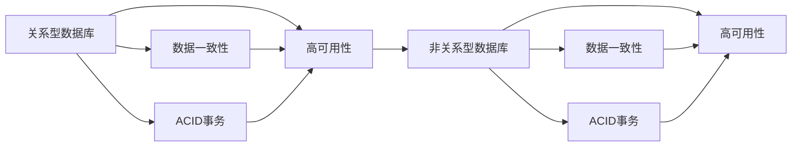

                 

# 数据库选型：关系型 vs 非关系型

## 1. 背景介绍

### 1.1 问题由来
在当今数字化时代，数据已经成为企业最重要的资产之一。无论是传统行业还是新兴领域，都需要依赖于高效、稳定、安全的数据库系统来存储和处理数据。然而，在实际应用中，不同的业务场景对数据管理的需求不同，数据库的选型也显得尤为重要。传统的关系型数据库（RDBMS）与新兴的非关系型数据库（NoSQL）各有优缺点，如何在特定场景中选择合适的数据库类型，是开发者和架构师面临的常见问题。

### 1.2 问题核心关键点
选择合适的数据库类型主要考虑以下几个关键点：
- 数据结构：数据是否具有明显的结构化和关系性，还是分散、非结构化的数据。
- 访问模式：数据是否以固定的结构模式访问，还是需要根据不同场景进行灵活的调整。
- 扩展性：数据库系统是否能根据业务需求进行无缝扩展，保持性能稳定。
- 复杂度：数据管理是否简单，是否有较高的开发复杂度和维护成本。
- 性能需求：系统是否需要高效处理大量数据，支持高并发和低延迟操作。

本文将对关系型数据库和非关系型数据库的核心概念进行阐述，并结合实际案例，深入分析这两种数据库类型在性能、扩展性、复杂度等方面的差异，帮助读者在系统选型时做出更加明智的选择。

## 2. 核心概念与联系

### 2.1 核心概念概述

#### 2.1.1 关系型数据库（RDBMS）
关系型数据库是一种以表格形式存储数据的数据库，遵循关系模型的基本结构。每个数据表由多行多列组成，行表示记录，列表示属性。通过外键、索引等机制实现数据关联和查询优化。

#### 2.1.2 非关系型数据库（NoSQL）
非关系型数据库是一种不遵循传统关系模型的数据库类型，包括文档型、键值型、列族型等不同类型的数据模型。NoSQL数据库更加灵活，能够处理大规模、非结构化或半结构化数据。

### 2.2 核心概念联系

关系型数据库和非关系型数据库的联系主要体现在以下几点：
- 数据一致性：两者都追求数据一致性，确保数据更新后的一致性状态。
- 事务支持：两者都支持ACID（原子性、一致性、隔离性、持久性）事务处理，保证数据操作的正确性和可靠性。
- 高可用性：两者都设计了高可用性机制，确保系统的高可用性和数据持久性。

### 2.3 核心概念联系的 Mermaid 流程图



从图中可以看出，关系型数据库和非关系型数据库在数据一致性、事务支持和系统高可用性方面存在相似之处。然而，两者的数据模型和应用场景有所不同，接下来将对两种数据库类型进行详细比较。

## 3. 核心算法原理 & 具体操作步骤

### 3.1 算法原理概述

#### 3.1.1 关系型数据库原理
关系型数据库的核心原理包括SQL查询语言、关系模型、索引机制等。通过SQL语句对数据进行查询、插入、更新和删除操作，支持复杂的关联查询和多表操作。

#### 3.1.2 非关系型数据库原理
非关系型数据库的核心原理包括数据模型、分布式存储、高性能读写等。数据模型灵活多样，支持键值对、文档、列族等不同类型的数据存储方式。通过分布式存储和并行计算，实现高并发和低延迟操作。

### 3.2 算法步骤详解

#### 3.2.1 关系型数据库操作流程
1. **数据模型设计**：设计数据表结构和关联关系，定义字段类型和约束条件。
2. **索引设计**：设计合适的索引，优化查询性能。
3. **数据加载**：将数据导入数据库，确保数据完整性和一致性。
4. **SQL查询**：使用SQL语句进行数据查询、统计和分析。
5. **事务处理**：确保数据操作的原子性和一致性。

#### 3.2.2 非关系型数据库操作流程
1. **数据模型设计**：根据数据特点选择合适的数据模型，如键值对、文档、列族等。
2. **分布式存储**：将数据分散存储在多个节点上，提高系统的扩展性和可用性。
3. **数据加载**：将数据分散存储到各个节点，确保数据一致性和完整性。
4. **数据读写**：通过键、文档ID、列族ID等进行数据读写操作。
5. **分布式同步**：确保分布式节点之间的数据同步和一致性。

### 3.3 算法优缺点

#### 3.3.1 关系型数据库优点
1. **数据一致性高**：通过ACID事务保证数据操作的正确性和一致性。
2. **数据结构清晰**：数据表结构定义明确，易于理解和维护。
3. **查询语言丰富**：SQL语言功能强大，支持复杂的查询和统计操作。
4. **成熟稳定**：经过多年的发展，成熟稳定，广泛应用。

#### 3.3.2 关系型数据库缺点
1. **扩展性有限**：数据表结构固定，难以根据业务需求进行灵活扩展。
2. **性能瓶颈**：在大规模数据环境下，SQL查询性能可能受到影响。
3. **开发复杂度高**：数据模型设计和SQL查询复杂度较高，开发和维护成本高。

#### 3.3.3 非关系型数据库优点
1. **扩展性强**：支持分布式存储，易于根据业务需求进行扩展。
2. **高性能读写**：支持高并发读写，处理大规模数据能力强。
3. **灵活的数据模型**：数据模型灵活多样，能够处理非结构化数据。
4. **低开发成本**：API简单，开发和维护成本低。

#### 3.3.4 非关系型数据库缺点
1. **数据一致性低**：通常采用最终一致性模型，数据一致性较弱。
2. **事务支持不足**：不支持复杂的事务处理，数据操作可能出现不一致性。
3. **查询复杂度高**：数据模型复杂，查询操作相对繁琐。

### 3.4 算法应用领域

#### 3.4.1 关系型数据库应用领域
- **传统行业**：金融、医疗、电商等领域对数据一致性要求高，适合使用关系型数据库。
- **复杂查询**：需要处理复杂关联查询和多表操作的场景，适合使用关系型数据库。

#### 3.4.2 非关系型数据库应用领域
- **大数据处理**：需要处理大规模、非结构化或半结构化数据的场景，适合使用非关系型数据库。
- **高并发读写**：需要支持高并发读写操作，如搜索引擎、缓存系统等，适合使用非关系型数据库。

## 4. 数学模型和公式 & 详细讲解 & 举例说明

### 4.1 数学模型构建

#### 4.1.1 关系型数据库数学模型
关系型数据库的核心数学模型是关系代数，包括集合、元组、关系等基本概念。通过关系代数运算符（如交集、并集、差集、笛卡尔积等）进行数据操作。

#### 4.1.2 非关系型数据库数学模型
非关系型数据库的数学模型多种多样，如键值型、文档型、列族型等。每种数据模型有其特定的数据结构和操作方式。

### 4.2 公式推导过程

#### 4.2.1 关系型数据库公式推导
设关系型数据库中的数据表为 $T$，列向量为 $\mathbf{t}$，关系代数运算符为 $+$ 表示并集，$-$ 表示差集，$\times$ 表示笛卡尔积。则查询 $\sigma_A(T)$ 表示筛选满足条件 $A$ 的关系 $T$，其数学推导如下：

$$
\sigma_A(T) = \{t' | \exists t \in T, \mathbf{t} \in \sigma_A(T)\}
$$

其中 $\sigma_A$ 表示筛选条件，$\mathbf{t}$ 表示筛选后的列向量。

#### 4.2.2 非关系型数据库公式推导
设非关系型数据库中的数据模型为 $D$，键为 $\mathbf{k}$，数据对象为 $\mathbf{o}$。则查询 $\sigma_A(D)$ 表示筛选满足条件 $A$ 的数据模型 $D$，其数学推导如下：

$$
\sigma_A(D) = \{(k', o') | \exists k \in D, \mathbf{k} = k', \sigma_A(o) = o'\}
$$

其中 $\sigma_A$ 表示筛选条件，$\mathbf{k}$ 表示键，$\mathbf{o}$ 表示数据对象。

### 4.3 案例分析与讲解

#### 4.3.1 关系型数据库案例
假设有一个电商网站，需要记录用户的购买记录、商品信息、订单信息等。设计关系型数据库的表结构如下：

```
CREATE TABLE users (
    id INT PRIMARY KEY,
    name VARCHAR(50),
    email VARCHAR(50)
);

CREATE TABLE products (
    id INT PRIMARY KEY,
    name VARCHAR(50),
    price DECIMAL(10, 2)
);

CREATE TABLE orders (
    id INT PRIMARY KEY,
    user_id INT,
    product_id INT,
    quantity INT,
    FOREIGN KEY (user_id) REFERENCES users(id),
    FOREIGN KEY (product_id) REFERENCES products(id)
);
```

使用SQL查询获取用户购买商品的信息：

```sql
SELECT users.name, products.name, orders.quantity
FROM users
JOIN orders ON users.id = orders.user_id
JOIN products ON orders.product_id = products.id;
```

#### 4.3.2 非关系型数据库案例
假设有一个社交媒体平台，需要存储用户动态、文章、评论等非结构化数据。设计非关系型数据库的数据模型如下：

```
{
    "user_id": "123",
    "dynamic": [
        {"id": "1", "content": "Hello World!"},
        {"id": "2", "content": "I love programming."}
    ]
}
```

使用API获取用户动态信息：

```python
import redis

redis_client = redis.StrictRedis(host='localhost', port=6379, db=0)
user_id = "123"
dynamic_data = redis_client.hgetall(user_id)
```

## 5. 项目实践：代码实例和详细解释说明

### 5.1 开发环境搭建

#### 5.1.1 关系型数据库搭建
以MySQL为例，安装MySQL数据库并配置服务。使用以下命令进行安装和配置：

```bash
sudo apt-get update
sudo apt-get install mysql-server
sudo mysql_secure_installation
```

创建数据库和表：

```sql
CREATE DATABASE mydb;
USE mydb;
CREATE TABLE users (
    id INT PRIMARY KEY,
    name VARCHAR(50),
    email VARCHAR(50)
);
CREATE TABLE products (
    id INT PRIMARY KEY,
    name VARCHAR(50),
    price DECIMAL(10, 2)
);
CREATE TABLE orders (
    id INT PRIMARY KEY,
    user_id INT,
    product_id INT,
    quantity INT,
    FOREIGN KEY (user_id) REFERENCES users(id),
    FOREIGN KEY (product_id) REFERENCES products(id)
);
```

#### 5.1.2 非关系型数据库搭建
以MongoDB为例，安装MongoDB数据库并配置服务。使用以下命令进行安装和配置：

```bash
sudo apt-get update
sudo apt-get install mongodb
sudo systemctl start mongod
sudo systemctl enable mongod
```

创建数据库和集合：

```python
from pymongo import MongoClient

client = MongoClient('mongodb://localhost:27017/')
db = client['mydb']
collection = db['users']
```

### 5.2 源代码详细实现

#### 5.2.1 关系型数据库代码实现
使用Python的MySQL Connector库连接MySQL数据库，实现插入、查询和更新操作：

```python
import mysql.connector

# 连接数据库
conn = mysql.connector.connect(
    host="localhost",
    user="root",
    password="password",
    database="mydb"
)

# 插入数据
cursor = conn.cursor()
cursor.execute("INSERT INTO users (id, name, email) VALUES (%s, %s, %s)", (1, "Alice", "alice@example.com"))
conn.commit()

# 查询数据
cursor.execute("SELECT * FROM users")
for row in cursor:
    print(row)

# 更新数据
cursor.execute("UPDATE users SET email='bob@example.com' WHERE id=2")
conn.commit()
```

#### 5.2.2 非关系型数据库代码实现
使用Python的pymongo库连接MongoDB数据库，实现插入、查询和更新操作：

```python
from pymongo import MongoClient

# 连接数据库
client = MongoClient('mongodb://localhost:27017/')
db = client['mydb']
collection = db['users']

# 插入数据
data = {"id": 1, "name": "Alice", "email": "alice@example.com"}
collection.insert_one(data)

# 查询数据
for doc in collection.find():
    print(doc)

# 更新数据
collection.update_one({"id": 2}, {"$set": {"email": "bob@example.com"}})
```

### 5.3 代码解读与分析

#### 5.3.1 关系型数据库代码解读
代码首先通过MySQL Connector库连接到MySQL数据库，然后执行SQL语句进行数据操作。使用Cursor对象执行SQL语句，通过commit方法提交事务。

#### 5.3.2 非关系型数据库代码解读
代码首先通过pymongo库连接到MongoDB数据库，然后通过insert_one方法插入数据，使用find方法查询数据，使用update_one方法更新数据。

### 5.4 运行结果展示

#### 5.4.1 关系型数据库运行结果
运行上述代码，可以获取用户信息，插入、查询和更新用户数据。

#### 5.4.2 非关系型数据库运行结果
运行上述代码，可以获取用户信息，插入、查询和更新用户数据。

## 6. 实际应用场景

### 6.1 传统行业应用
关系型数据库在传统行业中的应用非常广泛，如金融、医疗、电商等领域。例如，银行需要存储大量客户信息、交易记录和财务报表等结构化数据，适合使用关系型数据库。

#### 6.1.1 金融行业
在金融行业，关系型数据库用于存储和处理交易数据、客户信息、财务报表等数据。通过复杂的SQL查询和关联操作，实时计算金融产品的风险和收益。

#### 6.1.2 医疗行业
在医疗行业，关系型数据库用于存储和处理患者信息、医疗记录、药品信息等数据。通过复杂的SQL查询和关联操作，实现患者信息的查询、更新和统计。

#### 6.1.3 电商行业
在电商行业，关系型数据库用于存储和处理用户信息、商品信息、订单信息等数据。通过复杂的SQL查询和关联操作，实现商品的推荐、订单的生成和支付。

### 6.2 新兴领域应用
非关系型数据库在新兴领域中的应用也非常广泛，如大数据处理、搜索引擎、缓存系统等。例如，搜索引擎需要存储和处理海量网页数据，适合使用非关系型数据库。

#### 6.2.1 大数据处理
在大数据处理场景中，非关系型数据库用于存储和处理大规模、非结构化或半结构化数据。通过分布式存储和并行计算，实现高效的数据处理和分析。

#### 6.2.2 搜索引擎
在搜索引擎中，非关系型数据库用于存储和处理网页数据和搜索索引。通过高并发读写和低延迟操作，实现快速搜索和推荐。

#### 6.2.3 缓存系统
在缓存系统中，非关系型数据库用于存储和处理缓存数据。通过高效的数据读写和访问速度，实现快速的数据访问和查询。

## 7. 工具和资源推荐

### 7.1 学习资源推荐

#### 7.1.1 关系型数据库学习资源
- MySQL官方文档：详细介绍了MySQL数据库的安装、配置和操作。
- SQLZoo：提供SQL学习教程，适合初学者入门。
- SQL Cookbook：提供实用的SQL查询和操作示例。

#### 7.1.2 非关系型数据库学习资源
- MongoDB官方文档：详细介绍了MongoDB数据库的安装、配置和操作。
- Redis官方文档：详细介绍了Redis数据库的安装、配置和操作。
- NoSQL Cookbook：提供实用的非关系型数据库查询和操作示例。

### 7.2 开发工具推荐

#### 7.2.1 关系型数据库开发工具
- MySQL Workbench：图形化界面的工具，方便进行数据库设计和管理。
- phpMyAdmin：基于Web的界面，方便进行数据库操作。
- Navicat：跨平台的数据库管理工具，支持多种数据库类型。

#### 7.2.2 非关系型数据库开发工具
- MongoDB Compass：图形化界面的工具，方便进行数据库设计和管理。
- Robo 3T：基于Web的界面，方便进行数据库操作。
- JetBrains DataGrip：跨平台的数据库管理工具，支持多种数据库类型。

### 7.3 相关论文推荐

#### 7.3.1 关系型数据库论文
- “ACID Transactions: Es保证数据一致性和持久性”
- “SQL: A Query Language for Relational Databases”
- “SQL: The Programming Language for Relational Databases”

#### 7.3.2 非关系型数据库论文
- “NoSQL: The Data Storage Language You Should Know”
- “The Apache Cassandra Protocol”
- “Designing Distributed Systems with Apache Cassandra”

## 8. 总结：未来发展趋势与挑战

### 8.1 研究成果总结

本文对关系型数据库和非关系型数据库的核心概念进行了系统介绍，分析了两者在数据结构、访问模式、扩展性、性能等方面的差异，并通过实际案例展示了两种数据库类型的应用场景。

### 8.2 未来发展趋势

#### 8.2.1 关系型数据库发展趋势
1. **云化部署**：关系型数据库逐渐向云服务化方向发展，提供按需扩展和弹性计算能力。
2. **自动化运维**：关系型数据库通过自动化运维工具，降低运维成本，提升系统可靠性。
3. **分布式架构**：关系型数据库通过分布式架构，实现高可用性和高性能。

#### 8.2.2 非关系型数据库发展趋势
1. **多模型融合**：非关系型数据库通过多模型融合，实现对复杂数据的统一管理和处理。
2. **容器化部署**：非关系型数据库通过容器化部署，提升系统部署效率和管理便利性。
3. **数据一致性**：非关系型数据库通过分布式一致性协议，提升数据一致性和系统可靠性。

### 8.3 面临的挑战

#### 8.3.1 关系型数据库挑战
1. **扩展性瓶颈**：关系型数据库的扩展性受限于数据表结构和SQL查询性能，难以应对大规模数据的处理。
2. **开发复杂度高**：关系型数据库的复杂查询和关联操作增加了开发和维护成本。
3. **数据一致性问题**：关系型数据库在分布式环境下，数据一致性难以保证。

#### 8.3.2 非关系型数据库挑战
1. **数据一致性低**：非关系型数据库的最终一致性模型，数据一致性较弱。
2. **事务支持不足**：非关系型数据库不支持复杂的事务处理，数据操作可能出现不一致性。
3. **查询复杂度高**：非关系型数据库的数据模型复杂，查询操作相对繁琐。

### 8.4 研究展望

#### 8.4.1 关系型数据库研究展望
1. **分布式数据库**：开发高性能、高可扩展的分布式关系型数据库，支持大规模数据处理。
2. **自动化优化**：开发自动化查询优化工具，提升SQL查询性能。
3. **多模态融合**：开发支持多模态数据存储和处理的关系型数据库。

#### 8.4.2 非关系型数据库研究展望
1. **一致性增强**：开发一致性增强协议，提升非关系型数据库的数据一致性。
2. **事务处理**：开发支持复杂事务处理的技术，保证数据操作的正确性和一致性。
3. **查询优化**：开发高效的查询优化工具，提升数据查询性能。

## 9. 附录：常见问题与解答

### 9.1 问题1：关系型数据库和非关系型数据库的主要区别是什么？

答：关系型数据库和非关系型数据库的主要区别在于数据模型、扩展性、性能等方面。关系型数据库以表格形式存储数据，适合处理结构化数据，支持复杂的关联查询和多表操作。非关系型数据库采用不同的数据模型，如键值型、文档型、列族型等，适合处理非结构化或半结构化数据，支持高并发读写和低延迟操作。

### 9.2 问题2：如何选择适合的数据库类型？

答：选择适合的数据库类型需要考虑以下几个因素：
1. **数据结构**：如果数据具有明显的结构化和关系性，适合使用关系型数据库。
2. **访问模式**：如果数据需要以固定的结构模式访问，适合使用关系型数据库。
3. **扩展性**：如果需要根据业务需求进行灵活扩展，适合使用非关系型数据库。
4. **性能需求**：如果系统需要高效处理大量数据，支持高并发和低延迟操作，适合使用非关系型数据库。

### 9.3 问题3：关系型数据库和非关系型数据库各自有哪些优缺点？

答：关系型数据库和非关系型数据库各有优缺点：
1. **关系型数据库**：优点是数据一致性高、数据结构清晰、查询语言丰富、成熟稳定。缺点是扩展性有限、性能瓶颈、开发复杂度高。
2. **非关系型数据库**：优点是扩展性强、高性能读写、灵活的数据模型、低开发成本。缺点是数据一致性低、事务支持不足、查询复杂度高。

### 9.4 问题4：未来数据库的发展趋势是什么？

答：未来数据库的发展趋势包括：
1. **云化部署**：关系型数据库和非关系型数据库逐渐向云服务化方向发展，提供按需扩展和弹性计算能力。
2. **自动化运维**：通过自动化运维工具，降低运维成本，提升系统可靠性。
3. **分布式架构**：关系型数据库和非关系型数据库通过分布式架构，实现高可用性和高性能。
4. **多模型融合**：非关系型数据库通过多模型融合，实现对复杂数据的统一管理和处理。
5. **容器化部署**：关系型数据库和非关系型数据库通过容器化部署，提升系统部署效率和管理便利性。
6. **数据一致性**：非关系型数据库通过分布式一致性协议，提升数据一致性和系统可靠性。

### 9.5 问题5：如何设计高效的数据库索引？

答：设计高效的数据库索引需要考虑以下几个因素：
1. **数据访问频率**：对于频繁访问的数据，设计合适的索引，减少查询时间。
2. **索引类型**：选择合适的索引类型，如B树索引、哈希索引等。
3. **索引维护**：定期维护索引，避免索引碎片和失效。
4. **索引优化**：使用索引优化工具，提升查询性能。

通过系统的学习实践，相信你一定能够深刻理解关系型数据库和非关系型数据库的核心概念和应用场景，并在实际开发中做出明智的选择。

---

作者：禅与计算机程序设计艺术 / Zen and the Art of Computer Programming

