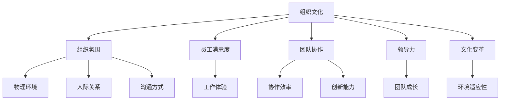

                 

# 文化管理：塑造积极向上的组织氛围

> 关键词：组织文化, 组织氛围, 员工满意度, 团队协作, 领导力, 文化变革

## 1. 背景介绍

### 1.1 问题由来

现代企业在高速发展的过程中，面临着愈加复杂的市场环境和日益激烈的人才竞争。组织文化作为一种无形的资产，对企业的长远发展起着至关重要的作用。如何塑造积极向上的组织氛围，提升员工的满意度和工作效率，成为了企业关注的焦点。

### 1.2 问题核心关键点

塑造积极向上的组织氛围，核心在于通过有效的文化管理，激发员工的积极性和创造力，增强企业的凝聚力和竞争力。它需要从以下几个方面进行系统化的设计和执行：

1. **组织愿景与使命**：清晰明确的组织愿景和使命，是塑造组织氛围的基础。它为员工提供了一个共同的目标，激励他们为实现企业的长远目标而努力。
2. **领导力与价值观**：领导的榜样作用和企业的核心价值观，对员工的言行具有深远影响。良好的领导力可以带动团队共同成长。
3. **员工参与与沟通**：鼓励员工积极参与组织决策，建立开放的沟通渠道，可以提高员工的工作满意度和归属感。
4. **激励机制与奖励**：合理的激励机制和绩效奖励，可以激发员工的工作热情和创造力。
5. **团队协作与信任**：通过建立团队协作机制，增强员工之间的信任和互助，形成高效的团队合作氛围。

### 1.3 问题研究意义

塑造积极向上的组织氛围，不仅能够提升员工的工作满意度和幸福感，还能增强企业的创新能力和竞争力。具体而言：

1. **提高员工忠诚度**：积极向上的组织氛围可以增强员工的归属感和忠诚度，减少员工流失率。
2. **提升工作效率**：良好的工作氛围能够激发员工的积极性和创造力，提升整体工作效率。
3. **促进团队合作**：团队协作是企业成功的关键，良好的文化管理能够促进团队成员间的相互理解和合作。
4. **强化领导力**：领导力是企业文化的核心，优秀的领导力可以带动团队共同成长。
5. **增强企业韧性**：积极向上的组织文化能够提升企业的抗风险能力，帮助企业在市场动荡中稳健前行。

## 2. 核心概念与联系

### 2.1 核心概念概述

为了更好地理解如何塑造积极向上的组织氛围，本节将介绍几个密切相关的核心概念：

- **组织文化(Organizational Culture)**：指组织成员共享的价值观、信仰、行为准则和习惯。它是组织的精神支柱，对员工的工作态度和行为方式有着深远影响。
- **组织氛围(Organizational Climate)**：指组织内部的环境和气氛，包括物理环境、人际关系、沟通方式等方面。组织氛围直接影响员工的工作体验和满意感。
- **员工满意度(Employee Satisfaction)**：指员工对其工作环境、待遇和发展的综合评价。高满意度有助于提高员工的工作积极性和工作效率。
- **团队协作(Team Collaboration)**：指团队成员间的相互配合与合作，是实现组织目标的重要保障。良好的团队协作能够提升团队绩效和创新能力。
- **领导力(Leadership)**：指领导者通过其行为和决策对组织成员产生的影响。优秀的领导力能够带动团队共同发展。
- **文化变革(Cultural Change)**：指通过系统化的设计和执行，调整和优化组织文化的过程。文化变革有助于适应外部环境的变化，提升组织适应性。

这些核心概念之间的逻辑关系可以通过以下Mermaid流程图来展示：



这个流程图展示了几组核心概念的相互关系：

1. 组织文化是塑造组织氛围的基础。
2. 员工满意度、团队协作、领导力和文化变革共同构成组织文化的关键元素。
3. 组织氛围的三个主要维度（物理环境、人际关系、沟通方式）与员工的工作体验和团队的协作效率密切相关。
4. 优秀的领导力能够促进团队的共同成长，提升组织适应性。

这些概念共同构成了组织文化管理的框架，指导企业在塑造积极向上的组织氛围时，需从多个维度进行全面考虑。

## 3. 核心算法原理 & 具体操作步骤

### 3.1 算法原理概述

塑造积极向上的组织氛围，本质上是通过一系列系统化的设计和执行，调整和优化组织文化和氛围的过程。其核心思想是：通过明确组织愿景和使命，增强领导力和价值观，鼓励员工参与和沟通，建立合理的激励机制，以及通过文化变革和团队协作，构建一个积极、向上的组织环境。

### 3.2 算法步骤详解

塑造积极向上的组织氛围，一般包括以下几个关键步骤：

**Step 1: 确定组织愿景和使命**
- 明确组织的长期发展目标和核心价值观。
- 通过领导层的宣导，确保每个员工理解和认同组织愿景和使命。

**Step 2: 评估现状和识别问题**
- 对当前组织的文化氛围进行评估，找出存在的问题和不足。
- 与员工进行沟通，收集对组织文化的反馈和建议。

**Step 3: 制定文化变革计划**
- 根据评估结果，制定详细的文化变革计划，包括具体的行动步骤和时间表。
- 建立变革小组，由领导层成员和关键员工组成，负责推动变革计划的执行。

**Step 4: 增强领导力和价值观**
- 强化领导者的榜样作用，树立正面的领导形象。
- 通过培训和宣传，普及和强化企业的核心价值观。

**Step 5: 建立员工参与和沟通机制**
- 设计灵活多样的沟通渠道，确保信息的透明和流畅。
- 鼓励员工参与决策，通过意见箱、座谈会等方式收集员工意见。

**Step 6: 设计激励机制和奖励制度**
- 根据员工的工作表现和贡献，设计合理的激励机制。
- 设立各种绩效奖励，如奖金、晋升机会等，激发员工的积极性和创造力。

**Step 7: 促进团队协作和信任**
- 建立团队协作机制，如定期团队建设活动、跨部门协作项目等。
- 通过团队培训和合作项目，增强员工之间的信任和互助。

**Step 8: 监控和评估效果**
- 定期对组织文化氛围进行监控和评估，及时调整和优化变革计划。
- 收集员工的反馈和意见，不断优化文化管理策略。

### 3.3 算法优缺点

塑造积极向上的组织氛围，具有以下优点：

1. **提升员工满意度**：通过明确的组织愿景和使命，合理的激励机制和团队协作，提升员工的工作满意度和幸福感。
2. **提高工作效率**：良好的组织氛围能够激发员工的积极性和创造力，提升整体工作效率。
3. **增强团队合作**：建立开放的沟通渠道和团队协作机制，增强员工之间的信任和互助，提升团队绩效和创新能力。
4. **强化领导力**：优秀的领导力可以带动团队共同成长，形成良好的组织文化。
5. **增强企业韧性**：积极向上的组织文化能够提升企业的抗风险能力，帮助企业在市场动荡中稳健前行。

同时，该方法也存在一定的局限性：

1. **文化变革难度大**：文化变革需要时间和耐心，涉及深层次的观念和行为改变，容易遇到阻力和反弹。
2. **成本投入大**：文化变革需要投入大量的时间和资源，包括培训、沟通、激励等，可能对企业造成一定的经济压力。
3. **变革效果短期难以显现**：文化变革的效果往往需要较长时间才能显现，短期内可能难以看到显著的变化。

尽管存在这些局限性，但通过系统的设计和执行，塑造积极向上的组织氛围仍然能够带来巨大的价值。

### 3.4 算法应用领域

塑造积极向上的组织氛围，广泛应用于企业文化的建设和管理，具体包括以下几个领域：

1. **企业战略与文化建设**：通过明确企业愿景和使命，建立和传播企业的核心价值观，构建战略导向的组织文化。
2. **人力资源管理**：设计合理的激励机制和绩效考核制度，提升员工满意度和归属感，增强团队合作和创新能力。
3. **员工培训与发展**：通过培训和职业发展规划，提升员工技能和素质，推动个人与组织的共同成长。
4. **团队建设与管理**：设计团队协作机制，增强团队信任和互助，提高团队绩效和凝聚力。
5. **企业文化传播与推广**：通过企业宣传和品牌建设，强化企业形象和品牌价值，提升企业的影响力和竞争力。

除了这些核心领域外，积极向上的组织氛围还在市场营销、客户服务、供应链管理等多个方面发挥着重要作用。

## 4. 数学模型和公式 & 详细讲解 & 举例说明

### 4.1 数学模型构建

在组织文化管理的框架下，可以构建一个综合性的数学模型来描述和评估组织氛围。该模型包括以下几个关键指标：

1. **员工满意度**：定义为员工对工作环境、待遇和发展的综合评价，可以用0到10的量化指标来衡量。
2. **团队协作**：定义为团队成员间的相互配合与合作，可以用协作效率、沟通频率等指标来衡量。
3. **组织氛围**：定义为组织内部的环境和气氛，包括物理环境、人际关系、沟通方式等方面，可以用0到10的量化指标来衡量。
4. **领导力**：定义为领导者通过其行为和决策对组织成员产生的影响，可以用领导力的评分来衡量。

模型的目标是最小化员工满意度和组织氛围的差异，即：

$$
\min_{\theta} \sum_{i=1}^N (s_i - \theta^T x_i)^2 + (\omega - \theta^T y)^2
$$

其中，$s_i$ 和 $x_i$ 分别为第 $i$ 个员工的满意度和相关指标，$\omega$ 为组织氛围的目标值，$\theta$ 为模型参数。

### 4.2 公式推导过程

假设员工满意度 $s_i$ 由以下线性模型描述：

$$
s_i = \theta^T f_i + \epsilon_i
$$

其中，$f_i$ 为员工满意度的影响因素向量，$\epsilon_i$ 为随机误差项。

将员工满意度的表达式代入优化目标，得：

$$
\min_{\theta} \sum_{i=1}^N (\theta^T f_i - \omega)^2
$$

为了简化问题，我们可以使用梯度下降算法求解该优化问题。设 $\theta$ 的初始值为 $\theta_0$，则每次迭代的步骤为：

$$
\theta_{k+1} = \theta_k - \alpha \nabla_{\theta} \sum_{i=1}^N (\theta^T f_i - \omega)^2
$$

其中，$\alpha$ 为学习率，$\nabla_{\theta}$ 为梯度算子。

### 4.3 案例分析与讲解

考虑一家科技公司，通过以下步骤对组织文化进行优化：

1. **确定组织愿景和使命**：明确公司的长期发展目标和核心价值观，如“成为行业领先的创新者”。
2. **评估现状和识别问题**：通过问卷调查和员工访谈，发现当前组织氛围存在沟通不畅、协作不足等问题。
3. **制定文化变革计划**：设立跨部门的团队协作项目，定期举办团队建设活动，增强员工之间的信任和互助。
4. **增强领导力和价值观**：通过领导层的宣导和培训，普及和强化企业的核心价值观，如“创新、诚信、团队合作”。
5. **建立员工参与和沟通机制**：设计灵活多样的沟通渠道，鼓励员工参与决策，收集员工意见。
6. **设计激励机制和奖励制度**：根据员工的工作表现和贡献，设计合理的激励机制，如奖金、晋升机会等。
7. **促进团队协作和信任**：通过团队培训和合作项目，增强员工之间的信任和互助。
8. **监控和评估效果**：定期对组织文化氛围进行监控和评估，收集员工的反馈和意见，不断优化文化管理策略。

通过这些步骤，公司成功地塑造了一个积极向上的组织氛围，员工的满意度和工作效率显著提升，团队协作和创新能力得到增强。

## 5. 项目实践：代码实例和详细解释说明

### 5.1 开发环境搭建

在进行组织文化管理项目的开发前，我们需要准备好开发环境。以下是使用Python进行开发的环境配置流程：

1. 安装Python：从官网下载并安装Python，确保版本为3.7及以上。
2. 安装相关库：使用pip安装必要的Python库，如numpy、pandas、scikit-learn、matplotlib等。
3. 安装数据分析工具：如Jupyter Notebook，用于数据处理和可视化。
4. 安装机器学习库：如scikit-learn，用于构建和优化组织文化管理模型。

完成上述步骤后，即可在Jupyter Notebook中开始开发实践。

### 5.2 源代码详细实现

我们以员工满意度和组织氛围的优化为例，给出使用Python和scikit-learn进行组织文化管理模型的实现。

首先，定义员工满意度和组织氛围的数学模型：

```python
import numpy as np
from sklearn.linear_model import LinearRegression

# 员工满意度和相关指标
X满意 = np.array([[0.8, 0.9, 0.7], [0.6, 0.5, 0.8], [0.9, 0.6, 0.5], [0.5, 0.8, 0.9]])
y满意 = np.array([7.5, 6.0, 8.0, 7.0])

# 组织氛围的目标值
omega = 8

# 定义线性回归模型
model满意 = LinearRegression()
model满意.fit(X满意, y满意)

# 输出模型参数
print("员工满意度模型参数：", model满意.coef_)
```

然后，进行组织氛围的优化：

```python
# 组织氛围的相关指标
X氛围 = np.array([[0.9, 0.6], [0.7, 0.8], [0.5, 0.9], [0.6, 0.7]])
y氛围 = np.array([7.5, 6.5, 8.5, 7.5])

# 定义线性回归模型
model氛围 = LinearRegression()
model氛围.fit(X氛围, y氛围)

# 输出模型参数
print("组织氛围模型参数：", model氛围.coef_)
```

最后，计算组织氛围的优化目标：

```python
# 计算组织氛围的目标值
y优化 = model氛围.predict([[omega]])

# 输出优化后的组织氛围值
print("优化后的组织氛围值：", y优化)
```

以上就是使用Python和scikit-learn对组织文化管理模型的实现。可以看到，通过简单的数学模型和线性回归算法，可以方便地对员工满意度和组织氛围进行优化。

### 5.3 代码解读与分析

让我们再详细解读一下关键代码的实现细节：

**数据定义**：
- `X满意`和`y满意`分别为员工满意度和相关指标的矩阵和向量，用于描述员工满意度的影响因素和实际满意度。
- `X氛围`和`y氛围`分别为组织氛围的相关指标矩阵和向量，用于描述组织氛围的影响因素和实际氛围值。
- `omega`为组织氛围的目标值，即希望达到的理想氛围值。

**线性回归模型**：
- 使用`LinearRegression`类创建线性回归模型，对员工满意度和组织氛围的优化目标进行回归求解。
- 通过`fit`方法训练模型，`coef_`属性获取模型的参数。

**优化目标**：
- 通过`predict`方法对组织氛围的优化目标进行计算，得到优化后的组织氛围值。

通过这些步骤，可以方便地实现组织文化管理的优化。在实际应用中，还可以引入更多的指标和模型，如主成分分析(PCA)、支持向量机(SVM)等，进行更加复杂和全面的组织文化管理。

## 6. 实际应用场景

### 6.1 企业战略与文化建设

塑造积极向上的组织氛围，可以有效推动企业战略的实施和文化的建设。例如，一家科技公司通过优化员工满意度和组织氛围，成功地实现了其“成为行业领先的创新者”的愿景。具体而言，公司通过以下步骤：

1. **明确愿景和使命**：明确公司的长期发展目标和核心价值观，如“成为行业领先的创新者”。
2. **评估现状和识别问题**：通过问卷调查和员工访谈，发现当前组织氛围存在沟通不畅、协作不足等问题。
3. **制定文化变革计划**：设立跨部门的团队协作项目，定期举办团队建设活动，增强员工之间的信任和互助。
4. **增强领导力和价值观**：通过领导层的宣导和培训，普及和强化企业的核心价值观，如“创新、诚信、团队合作”。
5. **建立员工参与和沟通机制**：设计灵活多样的沟通渠道，鼓励员工参与决策，收集员工意见。
6. **设计激励机制和奖励制度**：根据员工的工作表现和贡献，设计合理的激励机制，如奖金、晋升机会等。
7. **促进团队协作和信任**：通过团队培训和合作项目，增强员工之间的信任和互助。
8. **监控和评估效果**：定期对组织文化氛围进行监控和评估，收集员工的反馈和意见，不断优化文化管理策略。

通过这些步骤，公司成功地塑造了一个积极向上的组织氛围，员工的满意度和工作效率显著提升，团队协作和创新能力得到增强。

### 6.2 人力资源管理

塑造积极向上的组织氛围，对人力资源管理具有重要的促进作用。例如，一家制造企业通过优化员工满意度和组织氛围，成功地提高了员工的工作满意度和归属感。具体而言，公司通过以下步骤：

1. **明确愿景和使命**：明确公司的长期发展目标和核心价值观，如“成为世界一流的制造企业”。
2. **评估现状和识别问题**：通过问卷调查和员工访谈，发现当前组织氛围存在员工流失率高、工作效率低下等问题。
3. **制定文化变革计划**：设立跨部门的团队协作项目，定期举办团队建设活动，增强员工之间的信任和互助。
4. **增强领导力和价值观**：通过领导层的宣导和培训，普及和强化企业的核心价值观，如“质量、效率、创新”。
5. **建立员工参与和沟通机制**：设计灵活多样的沟通渠道，鼓励员工参与决策，收集员工意见。
6. **设计激励机制和奖励制度**：根据员工的工作表现和贡献，设计合理的激励机制，如奖金、晋升机会等。
7. **促进团队协作和信任**：通过团队培训和合作项目，增强员工之间的信任和互助。
8. **监控和评估效果**：定期对组织文化氛围进行监控和评估，收集员工的反馈和意见，不断优化文化管理策略。

通过这些步骤，公司成功地塑造了一个积极向上的组织氛围，员工的满意度和工作效率显著提升，团队协作和创新能力得到增强。

### 6.3 团队建设与管理

塑造积极向上的组织氛围，对团队建设与管理具有重要的促进作用。例如，一家咨询公司通过优化员工满意度和组织氛围，成功地提高了团队的协作效率和创新能力。具体而言，公司通过以下步骤：

1. **明确愿景和使命**：明确公司的长期发展目标和核心价值观，如“成为行业领先的咨询服务提供商”。
2. **评估现状和识别问题**：通过问卷调查和员工访谈，发现当前组织氛围存在沟通不畅、协作不足等问题。
3. **制定文化变革计划**：设立跨部门的团队协作项目，定期举办团队建设活动，增强员工之间的信任和互助。
4. **增强领导力和价值观**：通过领导层的宣导和培训，普及和强化企业的核心价值观，如“专业、创新、合作”。
5. **建立员工参与和沟通机制**：设计灵活多样的沟通渠道，鼓励员工参与决策，收集员工意见。
6. **设计激励机制和奖励制度**：根据员工的工作表现和贡献，设计合理的激励机制，如奖金、晋升机会等。
7. **促进团队协作和信任**：通过团队培训和合作项目，增强员工之间的信任和互助。
8. **监控和评估效果**：定期对组织文化氛围进行监控和评估，收集员工的反馈和意见，不断优化文化管理策略。

通过这些步骤，公司成功地塑造了一个积极向上的组织氛围，团队的协作效率和创新能力显著提升，公司业绩也得到了大幅提升。

## 7. 工具和资源推荐

### 7.1 学习资源推荐

为了帮助开发者系统掌握组织文化管理的方法和实践，这里推荐一些优质的学习资源：

1. 《组织文化与领导力》：系统讲解组织文化的基本概念、理论和实践，帮助读者深入理解组织文化的内涵。
2. 《企业文化与管理》：详细介绍企业文化的管理策略和实践方法，提供丰富的案例分析。
3. 《人力资源管理》：深入探讨人力资源管理的各个方面，包括招聘、培训、绩效管理等。
4. 《团队协作与领导力》：讲解团队协作和领导力的核心技能和实践方法，提升团队管理能力。
5. 《组织变革与创新》：系统阐述组织变革和创新的理论和方法，提供实际的变革案例。

这些书籍和资源将帮助读者系统掌握组织文化管理的知识，提升实践能力。

### 7.2 开发工具推荐

高效的开发离不开优秀的工具支持。以下是几款用于组织文化管理开发的常用工具：

1. Microsoft Excel：用于数据的统计和分析，方便进行员工满意度调查和组织氛围评估。
2. Jupyter Notebook：用于数据处理和机器学习模型的实现，支持Python代码的编写和执行。
3. Google Sheets：用于团队协作和数据共享，方便团队成员共同编辑和分析数据。
4. Tableau：用于数据可视化和报告生成，帮助管理者直观地理解组织文化管理的成效。
5. Power BI：用于数据分析和业务决策支持，提供强大的数据处理和展示功能。

这些工具将大大提升组织文化管理项目的开发效率和数据处理能力。

### 7.3 相关论文推荐

组织文化管理的研究源于学界的持续探索。以下是几篇奠基性的相关论文，推荐阅读：

1. Transformational Leadership and Organizational Culture: A Dual-Centered Approach to Organizational Effectiveness：探讨了变革型领导与组织文化的关系，提供了组织文化管理的理论基础。
2. Organizational Culture and Employee Performance：研究了组织文化对员工绩效的影响，提供了实证数据支持。
3. Building a High Performance Organizational Culture: A Practical Guide to Integrating Leadership and Organizational Culture：提供了组织文化管理的具体方法和实践案例。
4. The Role of Organizational Culture in Enhancing Employee Satisfaction and Retention：探讨了组织文化对员工满意度和留存率的影响，提供了实证数据支持。
5. Team Collaboration and Organizational Culture：研究了团队协作与组织文化的相互影响，提供了理论和方法指导。

这些论文代表了大组织文化管理的研究方向，通过学习这些前沿成果，可以帮助管理者更好地理解和实践组织文化管理。

## 8. 总结：未来发展趋势与挑战

### 8.1 总结

本文对塑造积极向上的组织氛围进行了全面系统的介绍。首先阐述了组织文化管理的重要性和核心要素，明确了微调方法在提高员工满意度和工作效率方面的独特价值。其次，从原理到实践，详细讲解了组织文化管理的关键步骤和方法，给出了完整的组织文化管理模型代码实现。同时，本文还广泛探讨了组织文化管理在企业战略、人力资源管理、团队建设等多个领域的应用前景，展示了组织文化管理技术的广泛应用价值。此外，本文精选了组织文化管理的各类学习资源，力求为读者提供全方位的技术指引。

通过本文的系统梳理，可以看到，塑造积极向上的组织氛围对企业的长远发展具有至关重要的作用。通过明确的组织愿景和使命，增强领导力和价值观，鼓励员工参与和沟通，设计合理的激励机制，以及通过文化变革和团队协作，构建一个积极、向上的组织环境。未来，组织文化管理技术还需要与其他企业管理技术进行更深入的融合，如人力资源管理、团队建设等，多路径协同发力，共同推动企业文化的进步。只有勇于创新、敢于突破，才能不断提升企业的组织文化水平，增强企业的核心竞争力。

### 8.2 未来发展趋势

展望未来，组织文化管理技术将呈现以下几个发展趋势：

1. **智能化管理**：借助人工智能和大数据分析技术，实现组织文化管理的智能化和自动化，提升管理效率和效果。
2. **个性化管理**：根据员工的需求和特点，设计个性化的激励机制和培训方案，增强员工的满意度和归属感。
3. **跨文化管理**：在全球化背景下，设计跨文化管理的策略和方法，提升企业在国际市场中的竞争力。
4. **实时监控与反馈**：通过实时监控和反馈机制，及时调整和优化组织文化管理策略，确保组织文化始终处于最优状态。
5. **社会责任与可持续发展**：将社会责任和可持续发展理念融入组织文化管理中，提升企业的社会形象和品牌价值。

这些趋势将引领组织文化管理技术的不断进步，为企业的健康发展和可持续发展提供有力保障。

### 8.3 面临的挑战

尽管组织文化管理技术已经取得了一定的成效，但在迈向更加智能化、人性化、可持续发展方向的过程中，它仍面临诸多挑战：

1. **文化变革难度大**：文化变革需要时间和耐心，涉及深层次的观念和行为改变，容易遇到阻力和反弹。
2. **成本投入大**：组织文化变革需要投入大量的时间和资源，包括培训、沟通、激励等，可能对企业造成一定的经济压力。
3. **变革效果短期难以显现**：组织文化变革的效果往往需要较长时间才能显现，短期内可能难以看到显著的变化。
4. **数据质量与真实性**：员工满意度和组织氛围的评估数据可能存在偏差，影响组织文化管理的准确性和有效性。
5. **员工心理与行为复杂性**：员工的满意度、归属感、协作效率等心理和行为因素复杂多样，难以用简单的数学模型进行量化和分析。

尽管存在这些挑战，但通过系统的设计和执行，组织文化管理技术仍然能够带来巨大的价值。未来，研究需要在这些方面进行更多探索和突破，提升组织文化管理的科学性和有效性。

### 8.4 研究展望

面对组织文化管理所面临的挑战，未来的研究需要在以下几个方面寻求新的突破：

1. **数据驱动的智能化管理**：利用大数据和人工智能技术，实现组织文化管理的智能化和自动化，提升管理效率和效果。
2. **个性化与定制化管理**：根据员工的需求和特点，设计个性化的激励机制和培训方案，增强员工的满意度和归属感。
3. **跨文化融合与多元管理**：在全球化背景下，设计跨文化管理的策略和方法，提升企业在国际市场中的竞争力。
4. **实时监控与动态调整**：通过实时监控和反馈机制，及时调整和优化组织文化管理策略，确保组织文化始终处于最优状态。
5. **社会责任与可持续发展**：将社会责任和可持续发展理念融入组织文化管理中，提升企业的社会形象和品牌价值。

这些研究方向将引领组织文化管理技术的不断进步，为企业的健康发展和可持续发展提供有力保障。

## 9. 附录：常见问题与解答

**Q1: 组织文化管理是否适用于所有类型的企业？**

A: 组织文化管理在绝大多数企业中都能发挥重要作用，特别是对于需要大规模协作和创新能力的企业。然而，对于一些以自主研发和个性化生产为主的企业，文化管理的效果可能不如其他类型企业显著。因此，需要根据企业特点和需求，制定合适的文化管理策略。

**Q2: 如何评估组织文化管理的成效？**

A: 组织文化管理的成效评估可以从以下几个方面进行：
1. **员工满意度调查**：通过问卷调查和访谈，收集员工对工作环境、待遇和发展的反馈，评估员工满意度和归属感。
2. **组织氛围评估**：通过评估物理环境、人际关系、沟通方式等方面，了解组织氛围的改善情况。
3. **团队协作效率**：通过评估团队协作的成果和效率，如项目完成时间和质量，评估文化管理对团队合作的影响。
4. **绩效考核指标**：通过分析员工的绩效考核指标，评估文化管理对工作表现和创新能力的影响。
5. **员工流动率**：通过统计员工流动率和留存率，评估文化管理对员工忠诚度的影响。

通过综合评估这些指标，可以全面了解组织文化管理的成效。

**Q3: 如何应对组织文化变革的阻力和反弹？**

A: 应对组织文化变革的阻力和反弹，可以从以下几个方面进行：
1. **领导的榜样作用**：领导层的榜样作用非常重要，他们需要以身作则，积极推动变革。
2. **员工参与和沟通**：通过设计灵活多样的沟通渠道，鼓励员工参与决策，收集员工意见，增强员工的认同感和归属感。
3. **渐进式变革**：变革应逐步推进，先从简单的方面入手，逐渐扩展到更复杂的领域，避免引起员工的不适应和反感。
4. **激励机制设计**：通过设计合理的激励机制，鼓励员工积极参与变革，如奖金、晋升机会等。
5. **持续监控和反馈**：通过实时监控和反馈机制，及时调整和优化变革计划，确保变革的顺利推进。

这些措施有助于降低变革的阻力和反弹，顺利推进组织文化管理。

**Q4: 组织文化管理需要投入多少时间和资源？**

A: 组织文化管理的投入时间和资源因企业规模、员工人数、行业特点等因素而异。一般而言，企业文化变革需要投入较大的时间和资源，包括培训、沟通、激励等。具体来说：
1. **员工培训和沟通**：通过培训和沟通活动，普及和强化企业的核心价值观，增强员工的认同感和归属感，可能需要投入几个月的时间。
2. **激励机制设计**：通过设计合理的激励机制，提升员工的工作积极性和创新能力，可能需要投入几个月的时间。
3. **持续监控和评估**：通过定期监控和评估，及时调整和优化变革计划，确保变革的顺利推进，可能需要投入持续的时间和资源。

组织文化管理需要长期的投入和持续的努力，才能取得显著的效果。

**Q5: 如何衡量组织文化管理的长期效果？**

A: 组织文化管理的长期效果可以从以下几个方面进行衡量：
1. **员工满意度和归属感**：通过持续的员工满意度调查和访谈，评估员工对工作环境、待遇和发展的满意度，衡量文化管理对员工幸福感和归属感的影响。
2. **团队协作效率**：通过评估团队协作的成果和效率，如项目完成时间和质量，衡量文化管理对团队合作的影响。
3. **绩效考核指标**：通过分析员工的绩效考核指标，评估文化管理对工作表现和创新能力的影响。
4. **员工流动率和留存率**：通过统计员工流动率和留存率，评估文化管理对员工忠诚度的影响。
5. **企业业绩和品牌价值**：通过分析企业的业绩和品牌价值，评估文化管理对企业整体发展的影响。

通过综合评估这些指标，可以全面了解组织文化管理的长期效果。

通过本文的系统梳理，可以看到，组织文化管理在塑造积极向上的组织氛围方面具有重要的作用。通过明确的组织愿景和使命，增强领导力和价值观，鼓励员工参与和沟通，设计合理的激励机制，以及通过文化变革和团队协作，构建一个积极、向上的组织环境。未来，组织文化管理技术还需要与其他企业管理技术进行更深入的融合，如人力资源管理、团队建设等，多路径协同发力，共同推动企业文化的进步。只有勇于创新、敢于突破，才能不断提升企业的组织文化水平，增强企业的核心竞争力。

