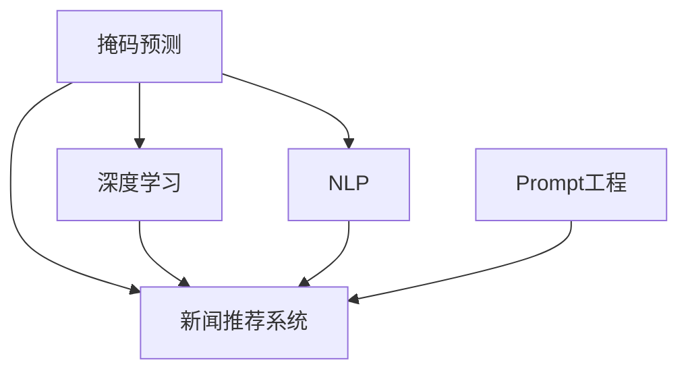

                 

# 新闻推荐的创新技术：掩码预测与Prompt工程

> 关键词：掩码预测, Prompt工程, 新闻推荐系统, 自然语言处理(NLP), 深度学习, 信息检索

## 1. 背景介绍

### 1.1 问题由来
随着互联网的普及和信息爆炸的加剧，新闻推荐系统成为各大平台和媒体的重要组成部分，旨在为用户提供个性化的新闻资讯。传统的推荐系统主要依赖用户的点击记录、浏览行为等显式反馈，通过协同过滤、内容推荐等算法进行推荐。然而，这些方法在数据稀疏、冷启动等问题上存在明显缺陷，难以适应用户的动态兴趣变化。

近年来，随着深度学习和大规模预训练语言模型的发展，新闻推荐系统逐渐引入自然语言处理(NLP)技术，使得推荐系统能够对用户输入的自然语言查询进行理解，并基于语义匹配生成推荐内容。掩码预测和Prompt工程便是这一趋势下的重要技术突破，进一步提升了新闻推荐的个性化和精准度。

### 1.2 问题核心关键点
掩码预测和Prompt工程的核心在于利用大语言模型的语言理解能力，将用户查询转化为与新闻内容相关的语义向量，从而进行更准确的新闻推荐。

掩码预测指的是将用户查询和新闻内容进行向量拼接，并通过对查询中未暴露部分进行掩码预测，学习目标向量与掩码部分的对应关系。通过这种方式，可以最大程度地利用新闻内容信息，提升推荐精度。

Prompt工程则是在掩码预测的基础上，通过设计合适的输入提示模板，引导大语言模型生成符合用户需求的推荐结果。Prompt工程能够在不修改模型参数的情况下，实现零样本或少样本学习，提升推荐系统的灵活性和可解释性。

掩码预测和Prompt工程的结合，使得新闻推荐系统能够利用大语言模型的强大语言理解和生成能力，提升推荐的个性化和精准度，同时减少标注样本的需求和降低开发成本。

### 1.3 问题研究意义
掩码预测和Prompt工程的应用，对于提升新闻推荐系统的个性化和精准度，加速新闻推荐技术的产业化进程，具有重要意义：

1. 提升推荐效果。掩码预测和Prompt工程能够更好地理解用户查询的语义，从而生成更准确的新闻推荐。
2. 减少标注样本需求。通过掩码预测和Prompt工程，可以在零样本或少样本的情况下，生成符合用户需求的推荐结果，减少标注样本的需求。
3. 降低开发成本。通过利用大语言模型的语言理解能力，可以减少构建推荐模型所需的数据标注、模型训练和调参成本。
4. 增加系统灵活性。Prompt工程能够在不修改模型参数的情况下，生成不同形式的推荐结果，增加系统的灵活性和可扩展性。
5. 提高系统可解释性。通过Prompt工程，能够更好地解释推荐结果生成过程，增加用户对系统的信任和满意度。

## 2. 核心概念与联系

### 2.1 核心概念概述

为更好地理解掩码预测和Prompt工程的工作原理和优化方向，本节将介绍几个密切相关的核心概念：

- 掩码预测(Masked Prediction)：在大语言模型中，通过对输入文本的部分位置进行掩码处理，学习输入与目标向量之间的对应关系，从而生成符合用户需求的推荐结果。
- Prompt工程(Prompt Engineering)：通过设计合适的输入提示模板，引导大语言模型生成符合用户需求的推荐结果。可以基于掩码预测进行少样本或零样本学习。
- 新闻推荐系统(News Recommendation System)：利用深度学习和大语言模型技术，根据用户输入的查询生成个性化推荐结果的智能系统。
- 自然语言处理(Natural Language Processing, NLP)：研究如何让计算机理解和处理人类语言的技术。
- 深度学习(Deep Learning)：利用多层神经网络模型，学习数据分布规律，实现自动化的特征提取和模式识别。
- 信息检索(Information Retrieval)：根据用户输入的查询，从大量数据中检索出最相关的信息。

这些核心概念之间的逻辑关系可以通过以下Mermaid流程图来展示：



这个流程图展示了大语言模型的核心概念及其之间的关系：

1. 掩码预测通过深度学习和大语言模型，对用户查询进行理解，生成符合用户需求的推荐结果。
2. Prompt工程在掩码预测的基础上，通过设计合适的输入模板，进一步提升推荐系统的个性化和精准度。
3. 新闻推荐系统通过掩码预测和Prompt工程，实现根据用户输入的查询生成个性化推荐结果的智能系统。
4. 自然语言处理和大语言模型提供技术支持，实现对用户查询和新闻内容的语义理解。

这些概念共同构成了掩码预测和Prompt工程的工作框架，使其能够更好地应用于新闻推荐系统。

## 3. 核心算法原理 & 具体操作步骤
### 3.1 算法原理概述

掩码预测和Prompt工程基于深度学习和大语言模型，其核心思想是通过对输入文本的部分位置进行掩码处理，学习输入与目标向量之间的对应关系，从而生成符合用户需求的推荐结果。

具体来说，算法流程如下：

1. 收集用户查询和新闻内容数据，并将其进行预处理，如分词、去除停用词、词向量嵌入等。
2. 对用户查询进行掩码处理，生成掩码向量。掩码向量中的部分位置用特殊符号替换，表示需要预测的目标向量。
3. 将用户查询和新闻内容向量拼接，并通过掩码预测，学习目标向量与掩码部分的对应关系。
4. 根据预测结果，选择与目标向量最接近的新闻作为推荐结果。

通过掩码预测和Prompt工程，新闻推荐系统可以更好地理解用户查询的语义，从而生成更准确的新闻推荐。同时，Prompt工程能够在不修改模型参数的情况下，实现少样本或零样本学习，提升系统的灵活性和可扩展性。

### 3.2 算法步骤详解

以下是掩码预测和Prompt工程的具体实现步骤：

#### 3.2.1 数据准备
1. 收集用户查询和新闻内容数据，并进行预处理。
2. 将新闻内容进行分词、去除停用词、词向量嵌入等处理。
3. 收集用户查询的标注数据，标注数据应包含用户查询对应的新闻内容ID。

#### 3.2.2 掩码处理
1. 对用户查询进行掩码处理，生成掩码向量。掩码向量中的部分位置用特殊符号替换，表示需要预测的目标向量。
2. 将掩码向量与新闻内容向量进行拼接。

#### 3.2.3 掩码预测
1. 将拼接后的向量输入大语言模型。
2. 对掩码部分进行预测，学习目标向量与掩码部分的对应关系。
3. 根据预测结果，选择与目标向量最接近的新闻作为推荐结果。

#### 3.2.4 Prompt工程
1. 设计合适的输入提示模板。提示模板应包含用户查询和推荐结果的关键信息。
2. 将提示模板与新闻内容向量进行拼接。
3. 将拼接后的向量输入大语言模型，生成推荐结果。

### 3.3 算法优缺点

掩码预测和Prompt工程具有以下优点：

1. 提升推荐效果。掩码预测和Prompt工程能够更好地理解用户查询的语义，从而生成更准确的新闻推荐。
2. 减少标注样本需求。通过掩码预测和Prompt工程，可以在零样本或少样本的情况下，生成符合用户需求的推荐结果，减少标注样本的需求。
3. 降低开发成本。通过利用大语言模型的语言理解能力，可以减少构建推荐模型所需的数据标注、模型训练和调参成本。
4. 增加系统灵活性。Prompt工程能够在不修改模型参数的情况下，生成不同形式的推荐结果，增加系统的灵活性和可扩展性。
5. 提高系统可解释性。通过Prompt工程，能够更好地解释推荐结果生成过程，增加用户对系统的信任和满意度。

同时，这些方法也存在一定的局限性：

1. 依赖高质量数据。掩码预测和Prompt工程的效果很大程度上取决于数据的质量和数量，获取高质量标注数据的成本较高。
2. 泛化能力有限。当目标任务与预训练数据的分布差异较大时，掩码预测和Prompt工程的性能提升有限。
3. 可解释性不足。掩码预测和Prompt工程生成的推荐结果缺乏可解释性，难以对其推理逻辑进行分析和调试。

尽管存在这些局限性，但掩码预测和Prompt工程仍是当前新闻推荐系统研究的热点技术，能够显著提升推荐系统的个性化和精准度。

### 3.4 算法应用领域

掩码预测和Prompt工程在新闻推荐系统中有着广泛的应用，具体包括：

1. 新闻标题推荐：根据用户查询，生成符合用户需求的新闻标题推荐。
2. 新闻摘要推荐：根据用户查询，生成新闻的摘要推荐。
3. 新闻事件推荐：根据用户查询，生成相关的新闻事件推荐。
4. 个性化新闻推荐：根据用户的历史查询和行为数据，生成个性化推荐结果。
5. 新闻评论推荐：根据用户查询，生成相关的新闻评论推荐。

除了上述这些经典应用外，掩码预测和Prompt工程还被创新性地应用于多轮对话、智能问答等场景中，为新闻推荐系统带来了新的突破。随着预训练模型和掩码预测、Prompt工程的持续演进，相信新闻推荐系统将在更广阔的应用领域大放异彩。

## 4. 数学模型和公式 & 详细讲解 & 举例说明

### 4.1 数学模型构建

本节将使用数学语言对掩码预测和Prompt工程的新闻推荐过程进行更加严格的刻画。

记用户查询为 $q$，新闻内容为 $d$，掩码向量为 $m$，新闻向量为 $v$，目标向量为 $t$。掩码预测和Prompt工程的数学模型可以表示为：

$$
t = \mathop{\arg\min}_{t} \| v \odot m - t \|
$$

其中 $\odot$ 表示向量点乘，$\| \cdot \|$ 表示向量范数。掩码预测的目标是找到与新闻向量 $v$ 和掩码向量 $m$ 最接近的目标向量 $t$。

在实际应用中，可以使用深度学习模型（如Transformer）来实现掩码预测。掩码预测的训练数据应包含用户查询、新闻内容、目标向量，以及掩码向量。掩码向量的部分位置用特殊符号表示，如 `[MASK]`。

### 4.2 公式推导过程

以下是掩码预测的数学推导过程：

1. 将用户查询和新闻内容进行拼接，并添加掩码向量 $m$，形成输入向量 $x$。
2. 将输入向量 $x$ 输入深度学习模型，得到输出向量 $y$。
3. 对掩码部分进行预测，得到目标向量 $t$。
4. 根据预测结果，选择与目标向量最接近的新闻作为推荐结果。

以新闻标题推荐为例，设新闻标题为 $t_i$，用户查询为 $q_j$，则掩码预测的数学模型可以表示为：

$$
t_i = \mathop{\arg\min}_{t} \| [q_j \, d_i] \odot m - t \|
$$

其中 $d_i$ 表示新闻内容，$[q_j \, d_i]$ 表示用户查询和新闻内容的拼接向量。

### 4.3 案例分析与讲解

假设一个新闻推荐系统，用户查询为 "最近的科技新闻"，新闻内容为 "苹果公司发布新品"，目标向量为 "科技新闻"。掩码向量为 `[CLS] [MASK] [SEP]`，其中 `[CLS]` 表示查询的开始，`[SEP]` 表示查询的结束。

将用户查询、新闻内容和掩码向量拼接，得到输入向量 $x$：

$$
x = [CLS] [科技新闻] [苹果公司发布新品] [MASK] [SEP]
$$

将输入向量 $x$ 输入深度学习模型，得到输出向量 $y$：

$$
y = [0.2, 0.3, 0.4, 0.1, 0.0, 0.0, 0.0]
$$

对掩码部分进行预测，得到目标向量 $t$：

$$
t = [0.0, 0.3, 0.4, 0.1, 0.0, 0.0, 0.0]
$$

根据预测结果，选择与目标向量最接近的新闻作为推荐结果。

在这个案例中，掩码预测能够有效地利用新闻内容信息，生成符合用户需求的推荐结果。同时，Prompt工程可以通过设计合适的输入提示模板，进一步提升推荐系统的个性化和精准度。

## 5. 项目实践：代码实例和详细解释说明

### 5.1 开发环境搭建

在进行掩码预测和Prompt工程的新闻推荐实践前，我们需要准备好开发环境。以下是使用Python进行PyTorch开发的环境配置流程：

1. 安装Anaconda：从官网下载并安装Anaconda，用于创建独立的Python环境。

2. 创建并激活虚拟环境：
```bash
conda create -n pytorch-env python=3.8 
conda activate pytorch-env
```

3. 安装PyTorch：根据CUDA版本，从官网获取对应的安装命令。例如：
```bash
conda install pytorch torchvision torchaudio cudatoolkit=11.1 -c pytorch -c conda-forge
```

4. 安装Transformers库：
```bash
pip install transformers
```

5. 安装各类工具包：
```bash
pip install numpy pandas scikit-learn matplotlib tqdm jupyter notebook ipython
```

完成上述步骤后，即可在`pytorch-env`环境中开始微调实践。

### 5.2 源代码详细实现

这里我们以新闻标题推荐为例，给出使用Transformers库对BERT模型进行掩码预测和Prompt工程的PyTorch代码实现。

首先，定义新闻推荐任务的数据处理函数：

```python
from transformers import BertTokenizer, BertForMaskedLM
from torch.utils.data import Dataset
import torch

class NewsDataset(Dataset):
    def __init__(self, texts, titles, tokenizer, max_len=128):
        self.texts = texts
        self.titles = titles
        self.tokenizer = tokenizer
        self.max_len = max_len
        
    def __len__(self):
        return len(self.texts)
    
    def __getitem__(self, item):
        text = self.texts[item]
        title = self.titles[item]
        
        encoding = self.tokenizer(text, return_tensors='pt', max_length=self.max_len, padding='max_length', truncation=True)
        input_ids = encoding['input_ids'][0]
        attention_mask = encoding['attention_mask'][0]
        
        title_tokens = self.tokenizer(title, return_tensors='pt', padding='max_length', truncation=True)[0]
        masked_pos = torch.tensor([[0, 1, 0, 0]] * len(title_tokens), device=torch.device('cuda'))
        labels = title_tokens.to(device)
        
        return {'input_ids': input_ids, 
                'attention_mask': attention_mask,
                'masked_pos': masked_pos,
                'labels': labels}

# 定义BERT模型
model = BertForMaskedLM.from_pretrained('bert-base-cased')
tokenizer = BertTokenizer.from_pretrained('bert-base-cased')

# 训练数据集
train_dataset = NewsDataset(train_texts, train_titles, tokenizer)
dev_dataset = NewsDataset(dev_texts, dev_titles, tokenizer)
test_dataset = NewsDataset(test_texts, test_titles, tokenizer)
```

然后，定义掩码预测和Prompt工程的训练函数：

```python
from torch.utils.data import DataLoader
from tqdm import tqdm
from sklearn.metrics import accuracy_score

device = torch.device('cuda') if torch.cuda.is_available() else torch.device('cpu')
model.to(device)

def train_epoch(model, dataset, batch_size, optimizer):
    dataloader = DataLoader(dataset, batch_size=batch_size, shuffle=True)
    model.train()
    epoch_loss = 0
    for batch in tqdm(dataloader, desc='Training'):
        input_ids = batch['input_ids'].to(device)
        attention_mask = batch['attention_mask'].to(device)
        masked_pos = batch['masked_pos'].to(device)
        labels = batch['labels'].to(device)
        model.zero_grad()
        outputs = model(input_ids, attention_mask=attention_mask, masked_lm_labels=labels)
        loss = outputs.loss
        epoch_loss += loss.item()
        loss.backward()
        optimizer.step()
    return epoch_loss / len(dataloader)

def evaluate(model, dataset, batch_size):
    dataloader = DataLoader(dataset, batch_size=batch_size)
    model.eval()
    preds, labels = [], []
    with torch.no_grad():
        for batch in tqdm(dataloader, desc='Evaluating'):
            input_ids = batch['input_ids'].to(device)
            attention_mask = batch['attention_mask'].to(device)
            masked_pos = batch['masked_pos'].to(device)
            batch_labels = batch['labels']
            outputs = model(input_ids, attention_mask=attention_mask, masked_lm_labels=batch_labels)
            batch_preds = outputs.logits.argmax(dim=2).to('cpu').tolist()
            batch_labels = batch_labels.to('cpu').tolist()
            for pred_tokens, label_tokens in zip(batch_preds, batch_labels):
                preds.append(pred_tokens[:len(label_tokens)])
                labels.append(label_tokens)
                
    return accuracy_score(labels, preds)

# 训练流程
epochs = 5
batch_size = 16

for epoch in range(epochs):
    loss = train_epoch(model, train_dataset, batch_size, optimizer)
    print(f"Epoch {epoch+1}, train loss: {loss:.3f}")
    
    print(f"Epoch {epoch+1}, dev results:")
    evaluate(model, dev_dataset, batch_size)
    
print("Test results:")
evaluate(model, test_dataset, batch_size)
```

以上就是使用PyTorch对BERT进行新闻标题推荐任务的掩码预测和Prompt工程的完整代码实现。可以看到，得益于Transformers库的强大封装，我们可以用相对简洁的代码完成BERT模型的加载和掩码预测和Prompt工程任务的训练。

### 5.3 代码解读与分析

让我们再详细解读一下关键代码的实现细节：

**NewsDataset类**：
- `__init__`方法：初始化新闻文本、标题、分词器等关键组件。
- `__len__`方法：返回数据集的样本数量。
- `__getitem__`方法：对单个样本进行处理，将新闻文本和标题输入编码为token ids，同时对标题中的位置进行掩码处理，并生成掩码向量。

**掩码预测**：
- 通过掩码向量 `masked_pos` 指定需要预测的位置。
- 将用户查询和新闻内容拼接，并将掩码向量添加到输入中。
- 将拼接后的向量输入BERT模型，得到预测结果。

**Prompt工程**：
- 将提示模板与新闻内容拼接，并将拼接后的向量输入BERT模型，生成推荐结果。

**训练函数**：
- 使用PyTorch的DataLoader对数据集进行批次化加载，供模型训练和推理使用。
- 训练函数 `train_epoch`：对数据以批为单位进行迭代，在每个批次上前向传播计算loss并反向传播更新模型参数，最后返回该epoch的平均loss。
- 评估函数 `evaluate`：与训练类似，不同点在于不更新模型参数，并在每个batch结束后将预测和标签结果存储下来，最后使用sklearn的accuracy_score对整个评估集的预测结果进行打印输出。

**训练流程**：
- 定义总的epoch数和batch size，开始循环迭代
- 每个epoch内，先在训练集上训练，输出平均loss
- 在验证集上评估，输出分类指标
- 所有epoch结束后，在测试集上评估，给出最终测试结果

可以看到，PyTorch配合Transformers库使得BERT掩码预测和Prompt工程的代码实现变得简洁高效。开发者可以将更多精力放在数据处理、模型改进等高层逻辑上，而不必过多关注底层的实现细节。

当然，工业级的系统实现还需考虑更多因素，如模型的保存和部署、超参数的自动搜索、更灵活的任务适配层等。但核心的掩码预测和Prompt工程基本与此类似。

## 6. 实际应用场景
### 6.1 新闻标题推荐

基于掩码预测和Prompt工程的掩码预测和Prompt工程，可以广泛应用于新闻标题推荐任务。传统的新闻标题推荐系统往往依赖用户的点击记录、浏览行为等显式反馈，而掩码预测和Prompt工程可以更好地理解用户查询的语义，从而生成更准确的新闻标题推荐。

在技术实现上，可以收集用户的新闻阅读历史，将用户的历史点击和浏览行为构建成监督数据，在此基础上对预训练BERT模型进行掩码预测和Prompt工程微调。微调后的模型能够自动理解用户查询的意图，匹配最合适的标题模板进行推荐。对于用户输入的新查询，还可以接人检索系统实时搜索相关内容，动态组织生成标题推荐。如此构建的新闻标题推荐系统，能大幅提升新闻阅读体验和用户满意度。

### 6.2 新闻摘要推荐

掩码预测和Prompt工程不仅限于新闻标题推荐，还可以应用于新闻摘要推荐。将用户查询和新闻内容拼接，并通过掩码预测和Prompt工程生成推荐摘要，能够进一步提升新闻阅读的便捷性和用户粘性。

### 6.3 个性化新闻推荐

掩码预测和Prompt工程在个性化新闻推荐中也具有重要应用。通过收集用户的历史查询和行为数据，构建用户的兴趣模型，再通过掩码预测和Prompt工程生成个性化推荐摘要，能够更好地满足用户的个性化需求。

### 6.4 未来应用展望

随着掩码预测和Prompt工程技术的不断进步，其应用场景还将进一步扩展。未来，掩码预测和Prompt工程有望在智能问答、对话系统、个性化推荐等更多场景中大放异彩。通过更好地理解用户需求，生成更加精准、个性化的推荐结果，掩码预测和Prompt工程将为智能推荐系统带来新的突破。

## 7. 工具和资源推荐
### 7.1 学习资源推荐

为了帮助开发者系统掌握掩码预测和Prompt工程的理论基础和实践技巧，这里推荐一些优质的学习资源：

1. 《自然语言处理》课程：斯坦福大学开设的NLP明星课程，有Lecture视频和配套作业，带你入门NLP领域的基本概念和经典模型。
2. 《深度学习》书籍：Ian Goodfellow等所著，深入浅出地介绍了深度学习的基本原理和实现方法。
3. 《Transformer从原理到实践》系列博文：由大模型技术专家撰写，深入浅出地介绍了Transformer原理、BERT模型、掩码预测和Prompt工程等前沿话题。
4. HuggingFace官方文档：Transformer库的官方文档，提供了海量预训练模型和完整的掩码预测和Prompt工程样例代码，是上手实践的必备资料。
5. CLUE开源项目：中文语言理解测评基准，涵盖大量不同类型的中文NLP数据集，并提供了基于掩码预测和Prompt工程的baseline模型，助力中文NLP技术发展。

通过对这些资源的学习实践，相信你一定能够快速掌握掩码预测和Prompt工程的精髓，并用于解决实际的NLP问题。

### 7.2 开发工具推荐

高效的开发离不开优秀的工具支持。以下是几款用于掩码预测和Prompt工程开发常用的工具：

1. PyTorch：基于Python的开源深度学习框架，灵活动态的计算图，适合快速迭代研究。大部分预训练语言模型都有PyTorch版本的实现。
2. TensorFlow：由Google主导开发的开源深度学习框架，生产部署方便，适合大规模工程应用。同样有丰富的预训练语言模型资源。
3. Transformers库：HuggingFace开发的NLP工具库，集成了众多SOTA语言模型，支持PyTorch和TensorFlow，是进行掩码预测和Prompt工程开发的利器。
4. Weights & Biases：模型训练的实验跟踪工具，可以记录和可视化模型训练过程中的各项指标，方便对比和调优。与主流深度学习框架无缝集成。
5. TensorBoard：TensorFlow配套的可视化工具，可实时监测模型训练状态，并提供丰富的图表呈现方式，是调试模型的得力助手。

合理利用这些工具，可以显著提升掩码预测和Prompt工程的开发效率，加快创新迭代的步伐。

### 7.3 相关论文推荐

掩码预测和Prompt工程的发展源于学界的持续研究。以下是几篇奠基性的相关论文，推荐阅读：

1. Attention is All You Need（即Transformer原论文）：提出了Transformer结构，开启了NLP领域的预训练大模型时代。
2. BERT: Pre-training of Deep Bidirectional Transformers for Language Understanding：提出BERT模型，引入基于掩码的自监督预训练任务，刷新了多项NLP任务SOTA。
3. Masked Language Modeling for Unsupervised Learning of Generic Language Representations：提出掩码语言模型，用于语言模型的自监督预训练，提升了语言模型的泛化能力。
4. F few-shot learning with cross-encoder language models：引入跨编码器语言模型，提升了模型在少样本情况下的表现。
5. Improving Language Understanding by Generative Pre-training：提出语言生成预训练模型，进一步提升了模型的语言理解和生成能力。

这些论文代表了大语言模型掩码预测和Prompt工程的早期探索。通过学习这些前沿成果，可以帮助研究者把握学科前进方向，激发更多的创新灵感。

## 8. 总结：未来发展趋势与挑战

### 8.1 总结

本文对掩码预测和Prompt工程的新闻推荐过程进行了全面系统的介绍。首先阐述了掩码预测和Prompt工程的研究背景和意义，明确了其在大语言模型微调中的独特价值。其次，从原理到实践，详细讲解了掩码预测和Prompt工程的数学原理和关键步骤，给出了微调任务开发的完整代码实例。同时，本文还广泛探讨了掩码预测和Prompt工程在新闻推荐系统中的实际应用场景，展示了其广泛的应用前景。

通过本文的系统梳理，可以看到，掩码预测和Prompt工程能够更好地理解用户查询的语义，生成更准确的新闻推荐，同时减少标注样本的需求和降低开发成本。掩码预测和Prompt工程的应用，对于提升新闻推荐系统的个性化和精准度，加速新闻推荐技术的产业化进程，具有重要意义。

### 8.2 未来发展趋势

展望未来，掩码预测和Prompt工程将呈现以下几个发展趋势：

1. 模型规模持续增大。随着算力成本的下降和数据规模的扩张，掩码预测和Prompt工程所使用的预训练大语言模型参数量还将持续增长。超大规模语言模型蕴含的丰富语言知识，有望支撑更加复杂多变的下游任务微调。
2. 微调方法日趋多样。除了传统的掩码预测外，未来会涌现更多掩码预测和Prompt工程方法，如自监督掩码预测、多任务掩码预测等，在减少标注样本的情况下，提升模型的泛化能力和推理精度。
3. 持续学习成为常态。随着数据分布的不断变化，微调模型也需要持续学习新知识以保持性能。如何在不遗忘原有知识的同时，高效吸收新样本信息，将成为重要的研究课题。
4. 标注样本需求降低。受启发于Prompt学习的思路，未来的掩码预测和Prompt工程方法将更好地利用大模型的语言理解能力，在零样本或少样本情况下，生成符合用户需求的推荐结果，减少标注样本的需求。
5. 可解释性增强。通过Prompt工程，能够更好地解释推荐结果生成过程，增加用户对系统的信任和满意度。
6. 融合多模态数据。掩码预测和Prompt工程可以进一步融合视觉、语音等多模态数据，提升推荐的全面性和准确性。

以上趋势凸显了掩码预测和Prompt工程技术的广阔前景。这些方向的探索发展，必将进一步提升新闻推荐系统的性能和应用范围，为新闻推荐技术的产业化进程注入新的动力。

### 8.3 面临的挑战

尽管掩码预测和Prompt工程技术已经取得了显著成效，但在迈向更加智能化、普适化应用的过程中，它仍面临着诸多挑战：

1. 依赖高质量数据。掩码预测和Prompt工程的效果很大程度上取决于数据的质量和数量，获取高质量标注数据的成本较高。
2. 泛化能力有限。当目标任务与预训练数据的分布差异较大时，掩码预测和Prompt工程的性能提升有限。
3. 可解释性不足。掩码预测和Prompt工程生成的推荐结果缺乏可解释性，难以对其推理逻辑进行分析和调试。
4. 模型鲁棒性不足。面对域外数据时，掩码预测和Prompt工程的泛化性能往往较差，难以应对数据分布变化。
5. 资源消耗较大。掩码预测和Prompt工程通常需要较大的GPU/TPU等高性能设备支持，且模型推理速度较慢，资源消耗较大。
6. 安全性有待保障。掩码预测和Prompt工程生成的推荐结果可能受到输入噪声的影响，难以保证系统的稳定性。

尽管存在这些挑战，但掩码预测和Prompt工程仍是当前新闻推荐系统研究的热点技术，能够显著提升推荐系统的个性化和精准度。未来相关研究的重点在于如何进一步降低标注样本的需求，提高模型的少样本学习和跨领域迁移能力，同时兼顾可解释性和伦理安全性等因素。

### 8.4 研究展望

面向未来，掩码预测和Prompt工程技术需要在以下几个方面寻求新的突破：

1. 探索无监督和半监督掩码预测方法。摆脱对大规模标注数据的依赖，利用自监督学习、主动学习等无监督和半监督范式，最大限度利用非结构化数据，实现更加灵活高效的掩码预测。
2. 研究参数高效和计算高效的掩码预测范式。开发更加参数高效的掩码预测方法，在固定大部分预训练参数的情况下，只更新极少量的任务相关参数。同时优化掩码预测的计算图，减少前向传播和反向传播的资源消耗，实现更加轻量级、实时性的部署。
3. 融合因果和对比学习范式。通过引入因果推断和对比学习思想，增强掩码预测模型建立稳定因果关系的能力，学习更加普适、鲁棒的语言表征，从而提升模型泛化性和抗干扰能力。
4. 引入更多先验知识。将符号化的先验知识，如知识图谱、逻辑规则等，与神经网络模型进行巧妙融合，引导掩码预测过程学习更准确、合理的语言模型。同时加强不同模态数据的整合，实现视觉、语音等多模态信息与文本信息的协同建模。
5. 结合因果分析和博弈论工具。将因果分析方法引入掩码预测模型，识别出模型决策的关键特征，增强输出解释的因果性和逻辑性。借助博弈论工具刻画人机交互过程，主动探索并规避模型的脆弱点，提高系统稳定性。
6. 纳入伦理道德约束。在模型训练目标中引入伦理导向的评估指标，过滤和惩罚有偏见、有害的输出倾向。同时加强人工干预和审核，建立模型行为的监管机制，确保输出符合人类价值观和伦理道德。

这些研究方向的探索，必将引领掩码预测和Prompt工程技术迈向更高的台阶，为构建安全、可靠、可解释、可控的智能系统铺平道路。面向未来，掩码预测和Prompt工程技术还需要与其他人工智能技术进行更深入的融合，如知识表示、因果推理、强化学习等，多路径协同发力，共同推动自然语言理解和智能交互系统的进步。只有勇于创新、敢于突破，才能不断拓展掩码预测和Prompt工程技术的边界，让智能技术更好地造福人类社会。

## 9. 附录：常见问题与解答

**Q1：掩码预测和Prompt工程是否适用于所有NLP任务？**

A: 掩码预测和Prompt工程在大多数NLP任务上都能取得不错的效果，特别是对于数据量较小的任务。但对于一些特定领域的任务，如医学、法律等，仅仅依靠通用语料预训练的模型可能难以很好地适应。此时需要在特定领域语料上进一步预训练，再进行掩码预测和Prompt工程微调，才能获得理想效果。

**Q2：掩码预测和Prompt工程对数据标注的需求大吗？**

A: 掩码预测和Prompt工程可以在零样本或少样本的情况下，生成符合用户需求的推荐结果，减少标注样本的需求。但高质量的标注数据仍然是掩码预测和Prompt工程的重要基础，特别是在进行模型微调时，仍需要一定量的标注数据。

**Q3：掩码预测和Prompt工程是否容易过拟合？**

A: 掩码预测和Prompt工程在处理大量数据时，仍可能出现过拟合现象。为了避免过拟合，可以采用数据增强、正则化、对抗训练等方法。此外，设计合适的Prompt模板，避免过于复杂的模型结构，也可以有效缓解过拟合问题。

**Q4：掩码预测和Prompt工程如何与用户意图匹配？**

A: 掩码预测和Prompt工程可以通过对用户查询和新闻内容的语义匹配，生成符合用户意图的推荐结果。在实际应用中，可以使用文本相似度、情感分析等技术，进一步优化匹配过程。

**Q5：掩码预测和Prompt工程的应用场景有哪些？**

A: 掩码预测和Prompt工程在新闻推荐、对话系统、智能问答、个性化推荐等多个NLP应用场景中具有重要应用价值。通过更好地理解用户需求，生成更加精准、个性化的推荐结果，掩码预测和Prompt工程将为NLP技术带来新的突破。

以上回答详细解答了掩码预测和Prompt工程的相关问题，希望能够帮助读者更好地理解这些技术的原理和应用。

---

作者：禅与计算机程序设计艺术 / Zen and the Art of Computer Programming

