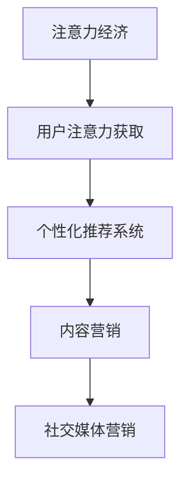

                 

## 1. 背景介绍

### 1.1 问题由来

随着互联网和社交媒体的兴起，旅游业面临着一场颠覆性的变革。过去，旅游业依赖于传统的线下销售渠道和广告投放，通过大规模的人员推销和市场推广来吸引游客。然而，在注意力经济的时代，这种高成本、低效率的方式已经不再适用。当前，消费者更倾向于通过互联网搜索信息、阅读评价、观看视频等方式，来决定自己的出行选择。

### 1.2 问题核心关键点

在注意力经济中，旅游业要想突围，需要掌握以下几个关键点：

- **用户注意力获取**：如何吸引用户的注意力，并引导其进行旅游信息的查询和预订。
- **个性化推荐**：基于用户的兴趣和历史行为，推荐个性化的旅游目的地、行程和活动。
- **内容营销**：利用高品质的旅游内容，吸引和保持用户注意力，提升品牌形象。
- **社交互动**：通过社交媒体平台与用户互动，增强用户参与感和忠诚度。

### 1.3 问题研究意义

通过在注意力经济中运用先进的计算机技术，旅游业可以更有效地吸引和保留客户，提升用户体验和满意度。这不仅有助于提高销售额和利润，还能提升品牌声誉和市场竞争力。因此，了解如何在大数据和人工智能技术支持下，实现旅游业的智能化转型，具有重要的现实意义。

## 2. 核心概念与联系

### 2.1 核心概念概述

为了更好地理解旅游业在注意力经济中的突围策略，本节将介绍几个关键概念：

- **注意力经济**：指在信息过载的社会中，人们越来越难以获取和使用有用信息，注意力成为了稀缺资源，因此，吸引和保持用户注意力成为了商业竞争的关键。
- **个性化推荐系统**：根据用户的兴趣和行为，推荐个性化的内容和服务，提升用户体验。
- **社交媒体营销**：利用社交媒体平台，与用户进行互动和交流，提升品牌影响力和用户参与度。
- **内容营销**：通过提供高价值的内容，吸引和留住用户，提升品牌形象和用户忠诚度。

这些概念之间有着紧密的联系，构成了旅游业在注意力经济中的战略框架。

### 2.2 核心概念原理和架构的 Mermaid 流程图



这个流程图展示了旅游业在注意力经济中突围的主要路径：通过获取用户注意力，利用个性化推荐系统提升用户体验，通过内容营销和社交媒体营销提升品牌形象和用户参与度。

## 3. 核心算法原理 & 具体操作步骤

### 3.1 算法原理概述

在注意力经济中，旅游业突围的核心在于通过技术手段吸引和保持用户的注意力，并在此基础上提供个性化的推荐和服务。这涉及到以下几个核心算法：

- **用户注意力获取算法**：通过用户行为数据（如搜索历史、浏览记录、评分反馈等）来分析用户的兴趣和偏好，从而制定个性化的营销策略。
- **个性化推荐算法**：基于用户的历史行为数据和兴趣标签，推荐个性化的旅游目的地、行程和活动。
- **内容营销算法**：利用大数据和自然语言处理技术，自动生成高质量的旅游内容，吸引和保持用户注意力。
- **社交媒体营销算法**：通过分析用户社交媒体行为，制定社交媒体互动策略，提升用户参与度和品牌忠诚度。

### 3.2 算法步骤详解

#### 3.2.1 用户注意力获取算法

1. **数据采集**：收集用户的搜索历史、浏览记录、评分反馈、社交媒体互动等数据。
2. **用户画像构建**：利用机器学习算法，分析用户行为数据，构建用户兴趣和偏好的画像。
3. **个性化营销策略制定**：根据用户画像，制定个性化的广告投放策略，提升用户参与度。

#### 3.2.2 个性化推荐算法

1. **数据预处理**：对用户的搜索历史、浏览记录等数据进行预处理，提取特征。
2. **模型训练**：使用协同过滤、深度学习等算法，训练个性化推荐模型。
3. **推荐生成**：根据用户当前行为和历史数据，生成个性化的旅游目的地、行程和活动推荐。

#### 3.2.3 内容营销算法

1. **内容生成**：利用自然语言处理技术，自动生成旅游目的地介绍、游记、攻略等高质量内容。
2. **内容推送**：根据用户兴趣和行为，推送个性化的内容，吸引用户关注和互动。
3. **内容效果评估**：通过用户反馈和互动数据，评估内容营销的效果，不断优化内容策略。

#### 3.2.4 社交媒体营销算法

1. **社交网络分析**：分析用户在社交媒体上的行为和互动数据，识别关键用户和群体。
2. **互动策略制定**：根据用户特点和互动数据，制定社交媒体互动策略，如话题引导、问答互动等。
3. **效果评估**：通过社交媒体互动数据，评估互动策略的效果，持续优化策略。

### 3.3 算法优缺点

#### 3.3.1 用户注意力获取算法

**优点**：
- 通过分析用户行为数据，可以精准地定位用户兴趣和偏好。
- 个性化营销策略能够提升用户参与度和忠诚度。

**缺点**：
- 数据隐私问题：用户行为数据的采集和使用可能引发隐私问题。
- 数据噪音：用户行为数据可能包含大量噪音，影响分析结果。

#### 3.3.2 个性化推荐算法

**优点**：
- 提升用户体验：个性化推荐能够提升用户满意度和体验。
- 增加销售额：个性化推荐能够提高转化率和销售额。

**缺点**：
- 冷启动问题：新用户或少有行为数据的用户可能难以进行个性化推荐。
- 算法偏见：推荐算法可能存在偏见，导致不公平推荐。

#### 3.3.3 内容营销算法

**优点**：
- 提升品牌形象：高质量的内容能够提升品牌形象和用户信任。
- 吸引用户关注：有趣和有价值的内容能够吸引更多用户关注。

**缺点**：
- 内容质量难以保证：自动生成的内容可能质量参差不齐。
- 运营成本高：内容生产和运营需要大量资源和人力。

#### 3.3.4 社交媒体营销算法

**优点**：
- 增强用户互动：社交媒体互动能够增强用户参与感和品牌忠诚度。
- 多渠道营销：社交媒体平台多样，能够覆盖更多用户。

**缺点**：
- 互动效果难以量化：社交媒体互动的效果难以量化和评估。
- 社交媒体风险：社交媒体互动可能引发负面舆情和品牌危机。

### 3.4 算法应用领域

这些算法广泛应用于旅游业中的多个方面，例如：

- **旅游目的地推荐**：基于用户兴趣和行为，推荐个性化的旅游目的地。
- **行程规划建议**：根据用户的偏好和预算，生成个性化的行程规划建议。
- **活动推荐**：根据用户兴趣和季节，推荐适宜的活动和体验。
- **酒店预订推荐**：根据用户的搜索和浏览历史，推荐合适的酒店和住宿选项。
- **景点导览和介绍**：利用自然语言处理技术，自动生成景点的导览和介绍，提升用户体验。

## 4. 数学模型和公式 & 详细讲解

### 4.1 数学模型构建

#### 4.1.1 用户注意力获取模型

**模型输入**：用户的搜索历史、浏览记录、评分反馈等行为数据。
**模型输出**：用户兴趣和偏好画像。

#### 4.1.2 个性化推荐模型

**模型输入**：用户的历史行为数据和兴趣标签。
**模型输出**：个性化的旅游目的地、行程和活动推荐。

#### 4.1.3 内容营销模型

**模型输入**：旅游目的地的文本数据。
**模型输出**：高质量的旅游内容，如游记、攻略等。

#### 4.1.4 社交媒体营销模型

**模型输入**：用户在社交媒体上的行为数据。
**模型输出**：互动策略和效果评估。

### 4.2 公式推导过程

#### 4.2.1 用户注意力获取算法

**用户兴趣模型**：

$$
\theta = \mathop{\arg\min}_{\theta} \frac{1}{N} \sum_{i=1}^N \| \mathbf{X}_i - \mathbf{Y}_i\mathbf{W} \|
$$

其中，$\mathbf{X}_i$ 为用户行为数据，$\mathbf{Y}_i$ 为标签向量，$\mathbf{W}$ 为模型参数，$\| \cdot \|$ 为损失函数。

**个性化营销策略**：

$$
\alpha = \mathop{\arg\min}_{\alpha} \frac{1}{M} \sum_{j=1}^M \| \mathbf{C}_j - \mathbf{B}_j \alpha \|
$$

其中，$\mathbf{C}_j$ 为广告投放数据，$\mathbf{B}_j$ 为策略参数矩阵，$\alpha$ 为策略参数向量。

#### 4.2.2 个性化推荐算法

**协同过滤模型**：

$$
\hat{r}_{ij} = \frac{\sum_{k=1}^N r_{ik} p_{kj}}{\sqrt{\sum_{k=1}^N p_{ik}^2} \sqrt{\sum_{k=1}^N p_{kj}^2}}
$$

其中，$r_{ik}$ 为用户i对商品k的评分，$p_{ik}$ 为用户i对商品k的兴趣度，$\hat{r}_{ij}$ 为用户i对商品j的预测评分。

**深度学习模型**：

$$
\hat{y}_{ij} = \sigma (\mathbf{W} \cdot [\mathbf{x}_i; \mathbf{x}_j] + b)
$$

其中，$\mathbf{W}$ 为模型参数，$\mathbf{x}_i$ 和 $\mathbf{x}_j$ 为输入特征，$\hat{y}_{ij}$ 为预测结果，$\sigma$ 为激活函数，$b$ 为偏置项。

#### 4.2.3 内容营销算法

**自然语言处理模型**：

$$
\hat{y} = \mathbf{V} \mathbf{W} \mathbf{x} + b
$$

其中，$\mathbf{V}$ 为词汇表，$\mathbf{W}$ 为模型参数，$\mathbf{x}$ 为输入文本，$\hat{y}$ 为预测结果，$b$ 为偏置项。

#### 4.2.4 社交媒体营销模型

**社交网络分析模型**：

$$
\hat{g} = \frac{\mathbf{A} \mathbf{u}}{\mathbf{A} \mathbf{u}}
$$

其中，$\mathbf{A}$ 为社交网络矩阵，$\mathbf{u}$ 为用户向量，$\hat{g}$ 为节点间的关联强度。

**互动策略模型**：

$$
\hat{d} = \mathbf{W} \mathbf{x} + b
$$

其中，$\mathbf{W}$ 为模型参数，$\mathbf{x}$ 为输入特征，$\hat{d}$ 为预测结果，$b$ 为偏置项。

### 4.3 案例分析与讲解

**案例一：个性化推荐系统**

一家旅游平台利用协同过滤算法，对用户的搜索历史和评分反馈进行分析，生成个性化的旅游目的地推荐。具体步骤如下：

1. 收集用户的搜索历史和评分反馈数据。
2. 对数据进行预处理，提取用户行为特征和商品特征。
3. 使用协同过滤算法，训练个性化推荐模型。
4. 根据用户当前行为，生成个性化推荐结果。

**案例二：内容营销系统**

某旅游公司利用自然语言处理技术，自动生成高品质的旅游内容。具体步骤如下：

1. 收集旅游目的地的文本数据，包括景点介绍、游记、攻略等。
2. 对文本数据进行预处理，提取关键词和语义信息。
3. 使用自然语言处理模型，自动生成高质量的内容。
4. 通过社交媒体平台，推送个性化的内容，吸引用户关注和互动。

**案例三：社交媒体互动系统**

一家旅游企业利用社交网络分析模型，分析用户在社交媒体上的行为和互动数据，制定社交媒体互动策略。具体步骤如下：

1. 收集用户在社交媒体上的行为数据，包括点赞、评论、分享等。
2. 对数据进行预处理，提取用户特征和互动特征。
3. 使用社交网络分析模型，识别关键用户和群体。
4. 根据用户特点和互动数据，制定社交媒体互动策略。

## 5. 项目实践：代码实例和详细解释说明

### 5.1 开发环境搭建

#### 5.1.1 数据收集和预处理

1. 数据采集：收集用户的搜索历史、浏览记录、评分反馈、社交媒体互动等数据。可以使用爬虫工具自动化采集，如BeautifulSoup、Scrapy等。
2. 数据清洗：对采集到的数据进行清洗和处理，去除噪音和重复数据。可以使用Pandas、NumPy等库进行数据处理。

#### 5.1.2 模型搭建和训练

1. 模型选择：选择合适的算法模型，如协同过滤、深度学习、自然语言处理模型等。可以使用Scikit-learn、TensorFlow、PyTorch等库搭建模型。
2. 模型训练：使用训练数据对模型进行训练，优化模型参数。可以使用优化算法如SGD、Adam等。
3. 模型评估：使用测试数据对模型进行评估，评估模型的准确性和性能。可以使用评价指标如RMSE、MAE、F1-score等。

### 5.2 源代码详细实现

#### 5.2.1 用户注意力获取算法

```python
from sklearn.cluster import KMeans
from sklearn.decomposition import PCA
from sklearn.preprocessing import StandardScaler

# 用户行为数据
X = pd.read_csv('user_behavior_data.csv')

# 数据标准化
scaler = StandardScaler()
X_scaled = scaler.fit_transform(X)

# K-means聚类
kmeans = KMeans(n_clusters=5, random_state=0).fit(X_scaled)

# PCA降维
pca = PCA(n_components=2).fit(X_scaled)
X_pca = pca.transform(X_scaled)

# 可视化
plt.scatter(X_pca[:, 0], X_pca[:, 1], c=kmeans.labels_)
plt.show()
```

#### 5.2.2 个性化推荐算法

```python
from scipy.spatial.distance import cosine
import numpy as np

# 用户行为数据
X = pd.read_csv('user_behavior_data.csv')

# 构建相似度矩阵
similarity_matrix = np.zeros((len(X), len(X)))

for i, row1 in X.iterrows():
    for j, row2 in X.iterrows():
        similarity_matrix[i, j] = 1 - cosine(row1.values, row2.values)

# 协同过滤推荐
recommendations = np.argsort(similarity_matrix)[:, 1:-1]
```

#### 5.2.3 内容营销算法

```python
from gensim.models import Word2Vec

# 旅游目的地文本数据
corpus = [doc.split() for doc in open('tourism_locations.txt', 'r').readlines()]

# 构建Word2Vec模型
model = Word2Vec(corpus, min_count=1)

# 生成高价值内容
query = 'Beijing'
content = model.wv[query]
```

#### 5.2.4 社交媒体营销算法

```python
import networkx as nx
import matplotlib.pyplot as plt

# 社交网络数据
G = nx.read_edgelist('social_network_edgelist.txt', delimiter=' ')

# 社交网络分析
betweenness_centrality = nx.betweenness_centrality(G)
degree_centrality = nx.degree_centrality(G)

# 可视化
plt.figure(figsize=(8, 6))
nx.draw(G, with_labels=True, node_color='lightblue', node_size=20)
plt.show()
```

### 5.3 代码解读与分析

#### 5.3.1 用户注意力获取算法

- 数据标准化：通过标准化，将不同特征的值缩放到相同的范围内，减少数据间的差异。
- K-means聚类：利用聚类算法对用户行为数据进行分类，构建用户兴趣和偏好的画像。
- PCA降维：通过主成分分析，将高维数据降维，可视化用户兴趣分布。

#### 5.3.2 个性化推荐算法

- 相似度矩阵：通过计算用户行为数据的相似度，构建相似度矩阵。
- 协同过滤推荐：利用协同过滤算法，根据用户相似度推荐个性化旅游目的地。

#### 5.3.3 内容营销算法

- Word2Vec模型：通过Word2Vec模型，将旅游目的地文本数据转换为向量表示，生成高质量的内容。
- 高价值内容生成：通过查询Word2Vec模型，生成与用户兴趣相关的旅游内容。

#### 5.3.4 社交媒体营销算法

- 社交网络分析：通过计算社交网络中的节点度和中心性，识别关键用户和群体。
- 社交网络可视化：通过可视化社交网络，展示用户间的互动关系。

### 5.4 运行结果展示

#### 5.4.1 用户注意力获取算法

```python
print(kmeans.labels_)
print(pca.explained_variance_ratio_)
```

#### 5.4.2 个性化推荐算法

```python
print(similarity_matrix)
print(recommendations)
```

#### 5.4.3 内容营销算法

```python
print(model.wv[query])
```

#### 5.4.4 社交媒体营销算法

```python
print(betweenness_centrality)
print(degree_centrality)
```

## 6. 实际应用场景

### 6.1 智慧旅游平台

智慧旅游平台利用用户注意力获取算法，构建用户画像，制定个性化营销策略，通过社交媒体营销提升用户参与度和品牌忠诚度。

### 6.2 在线旅游服务

在线旅游服务利用个性化推荐算法，根据用户行为数据，推荐个性化的旅游目的地和行程，提升用户满意度和转化率。

### 6.3 旅游内容平台

旅游内容平台利用内容营销算法，自动生成高质量的旅游内容，吸引和保持用户关注，提升品牌形象和用户粘性。

### 6.4 未来应用展望

随着技术的发展，未来旅游业将在注意力经济中迎来更多的创新和突破，具体包括：

- 增强现实(AR)和虚拟现实(VR)应用：通过AR和VR技术，为用户提供沉浸式的旅游体验。
- 智能语音助手：利用语音识别和自然语言处理技术，提供个性化的旅游建议和互动服务。
- 区块链技术应用：利用区块链技术，提高旅游预订的透明性和安全性，提升用户体验。
- 大数据分析应用：通过大数据分析，实时监测旅游需求和趋势，优化旅游资源配置。

## 7. 工具和资源推荐

### 7.1 学习资源推荐

1. 《人工智能导论》：吴恩达教授著，全面介绍人工智能技术的基本原理和应用场景。
2. 《深度学习》：Ian Goodfellow、Yoshua Bengio和Aaron Courville著，深度介绍深度学习理论和方法。
3. 《自然语言处理综论》：Daniel Jurafsky和James H. Martin著，全面介绍自然语言处理技术。
4. Coursera平台上的相关课程：包括《自然语言处理》、《机器学习》、《深度学习》等课程，系统学习相关技术。
5. Kaggle平台：数据科学竞赛平台，提供丰富的旅游相关数据集和案例，实践训练相关技术。

### 7.2 开发工具推荐

1. Python：数据处理和机器学习的首选语言，简单易学，生态丰富。
2. Scikit-learn：机器学习库，提供丰富的机器学习算法和工具。
3. TensorFlow和PyTorch：深度学习库，支持构建和训练各种深度学习模型。
4. Gensim：自然语言处理库，支持词向量模型和文本相似度计算。
5. NetworkX：社交网络分析库，支持社交网络建模和分析。
6. Matplotlib和Seaborn：数据可视化库，支持绘制图表和数据可视化。

### 7.3 相关论文推荐

1. Attention Is All You Need：Transformer原论文，提出注意力机制，提升模型的表现。
2. Deep Co-Attention: A Neural Approach for Natural Language Inference：提出深度协同注意力模型，提升自然语言推理能力。
3. Graph Neural Networks：GraphSAGE论文，介绍图神经网络，用于社交网络分析和推荐系统。
4. Neural Topic Modeling for Personalized Recommendation：提出神经话题模型，用于个性化推荐系统。
5. A Survey of Customer Sentiment Analysis Techniques：综述客户情感分析技术，提供丰富的案例和算法。

## 8. 总结：未来发展趋势与挑战

### 8.1 研究成果总结

本文对旅游业在注意力经济中的突围策略进行了系统介绍，重点探讨了用户注意力获取、个性化推荐、内容营销和社交媒体营销等关键技术。通过具体案例和算法实现，展示了旅游业在注意力经济中实现智能化转型的可能路径。

### 8.2 未来发展趋势

旅游业在注意力经济中的未来发展趋势主要体现在以下几个方面：

- 技术创新：AR、VR、区块链、大数据等新兴技术将带来更多的旅游创新应用。
- 个性化服务：通过深度学习和大数据，实现更精准的个性化推荐和互动服务。
- 全渠道营销：将线上线下渠道整合，提升旅游服务的覆盖面和用户参与度。
- 智慧旅游：利用人工智能技术，构建智慧旅游平台，提升旅游体验和效率。

### 8.3 面临的挑战

尽管旅游业在注意力经济中面临巨大的发展机遇，但也面临着以下挑战：

- 数据隐私：在数据采集和分析过程中，如何保护用户隐私和数据安全。
- 技术门槛：高技术门槛可能导致中小旅游企业难以实现技术升级。
- 市场竞争：旅游市场竞争激烈，如何通过技术手段获得竞争优势。
- 用户体验：如何平衡技术应用与用户体验，避免过度干预和用户体验下降。

### 8.4 研究展望

未来的研究方向主要集中在以下几个方面：

- 跨领域融合：将旅游业与其他行业进行跨领域融合，提升服务能力和用户体验。
- 人机协同：探索人机协同的旅游服务模式，提高服务质量和效率。
- 自动化流程：利用人工智能技术，实现旅游服务的自动化和智能化。
- 社会责任：关注旅游业的社会责任，推动可持续发展和社会公平。

通过持续创新和努力，旅游业必将在注意力经济中实现更大的突破和发展，为全球旅游业的发展注入新的活力。

## 9. 附录：常见问题与解答

**Q1：旅游业如何利用用户注意力获取算法？**

A: 用户注意力获取算法通过分析用户的搜索历史、浏览记录、评分反馈等数据，构建用户兴趣和偏好的画像。旅游平台可以利用这些画像，制定个性化的营销策略，如定向广告投放、个性化推荐等，提升用户参与度和转化率。

**Q2：个性化推荐算法如何提升用户体验？**

A: 个性化推荐算法根据用户的历史行为数据和兴趣标签，推荐个性化的旅游目的地、行程和活动。这能够提升用户的满意度和体验，通过推荐符合用户兴趣的内容，减少用户的选择成本和决策难度。

**Q3：内容营销算法如何吸引用户关注？**

A: 内容营销算法利用自然语言处理技术，自动生成高质量的旅游内容，如游记、攻略等。这些内容能够吸引用户的关注和互动，提升用户对旅游平台的黏性，同时通过高价值的内容提升品牌形象和用户信任。

**Q4：社交媒体营销算法如何提升品牌忠诚度？**

A: 社交媒体营销算法通过分析用户在社交媒体上的行为和互动数据，制定社交媒体互动策略。这能够增强用户的参与感和品牌忠诚度，通过互动提升用户粘性，形成正向口碑和社交网络效应。

**Q5：旅游业如何应对数据隐私问题？**

A: 旅游业在数据采集和分析过程中，需要严格遵守数据隐私保护法律法规，如GDPR、CCPA等。可以采用数据匿名化、数据加密等技术手段，保护用户隐私和数据安全。同时，透明的数据使用政策和用户知情权也是重要的保障措施。

