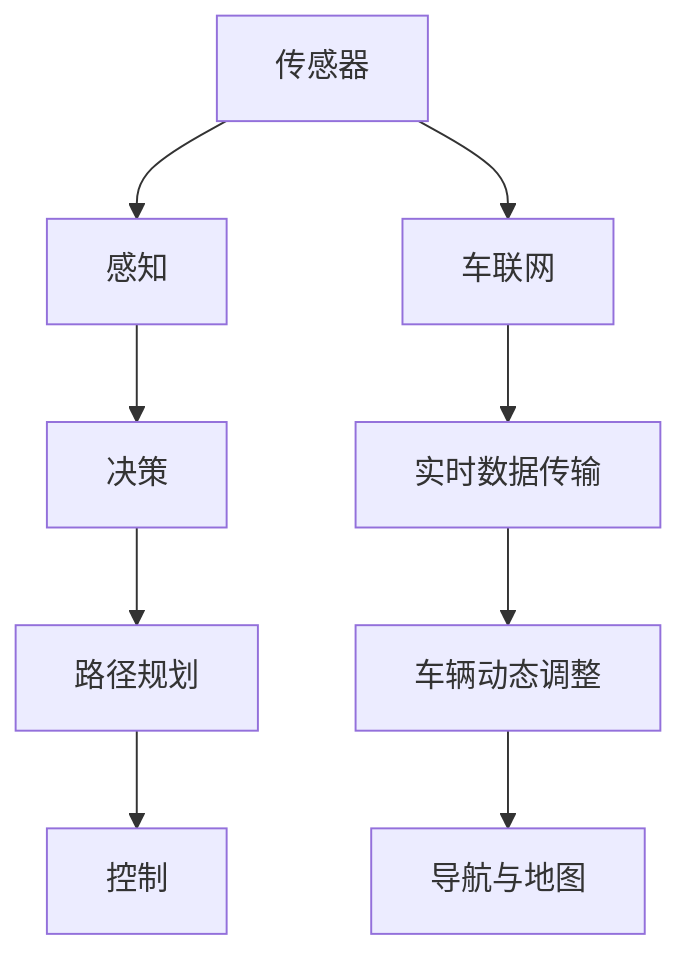

                 

## 1. 背景介绍

### 1.1 问题由来

随着汽车工业的飞速发展和城市化进程的加快，全球交通拥堵、事故频发、环境污染等问题日益严重。为解决这些问题，无人驾驶技术应运而生。无人驾驶技术可以大幅提升交通安全性、提升运输效率、减少能源消耗、降低事故率，有望彻底改变人类未来的出行方式和物流模式。

无人驾驶技术的发展历程，从最初的自动驾驶研究到如今的商业化落地，已经经历了几十年的探索。然而，尽管取得了一定的进展，但无人驾驶技术的商业化应用仍面临诸多挑战，需要更多的企业投入资源进行深度研发和推广。

### 1.2 问题核心关键点

无人驾驶技术的核心关键点在于通过传感器、人工智能算法、车联网、自动化驾驶平台等关键技术，实现车辆的自主行驶、避障、决策、路径规划等功能。其中，无人驾驶算法是整个系统的核心，其性能直接决定了车辆的行驶安全与效率。

当前无人驾驶技术面临的挑战包括：

1. **技术成熟度**：无人驾驶系统需要高度的可靠性和鲁棒性，关键技术的性能瓶颈仍然限制着无人驾驶的广泛应用。
2. **法律法规**：无人驾驶涉及复杂的法律法规问题，如道路安全法规、隐私保护等，需要政府和企业的共同协作。
3. **基础设施**：车联网等基础设施建设尚未完善，无法满足无人驾驶车辆的高精度定位和通信需求。
4. **用户体验**：无人驾驶技术需要提供便捷、可靠的用户体验，才能被广大用户接受。
5. **经济成本**：无人驾驶车辆的高成本使得其难以大规模推广，尤其是在初期阶段。

### 1.3 问题研究意义

无人驾驶技术是未来智能交通和物流的重要方向，其商业化应用将带来巨大的经济效益和社会效益。无人驾驶技术能够：

1. 提升交通效率，减少交通拥堵和事故，降低环境污染。
2. 降低物流成本，提高运输效率，增加运输网络灵活性。
3. 促进智能城市建设，提升城市管理水平，改善市民生活。
4. 创造大量就业机会，推动经济发展，形成新的产业链。

因此，无人驾驶技术的研发和应用具有深远的社会意义和巨大的经济效益。

## 2. 核心概念与联系

### 2.1 核心概念概述

为更好地理解无人驾驶系统的技术框架和各个模块的联系，本节将介绍几个关键概念：

1. **传感器(Sensor)**：无人驾驶车辆的关键设备，用于采集车辆内外部的环境信息。主要包括激光雷达(LiDAR)、摄像头、雷达、GPS、IMU等。
2. **人工智能算法(AI Algorithms)**：包括感知、决策、规划、控制等多个子模块，用于处理传感器数据，实现车辆的自主驾驶功能。
3. **车联网(V2X)**：车辆与环境、车辆与车辆之间的通信网络，包括车-路、车-车、车-人等通信，用于提高行驶安全性。
4. **自动化驾驶平台(Autonomous Driving Platform)**：包含感知、决策、路径规划、控制等多个模块，用于综合管理无人驾驶系统。

这些核心概念之间的逻辑关系可以通过以下Mermaid流程图来展示：



这个流程图展示了无人驾驶系统的工作流程：传感器采集数据，感知模块处理环境信息，决策模块根据信息做出行驶决策，路径规划模块生成最优路径，控制模块执行命令，最终通过车联网实现实时数据传输和车辆动态调整，导航与地图模块提供导航支持。

## 3. 核心算法原理 & 具体操作步骤
### 3.1 算法原理概述

无人驾驶系统的核心算法包括感知、决策、路径规划和控制等多个模块，各个模块的算法原理如下：

1. **感知算法**：通过激光雷达、摄像头等传感器采集环境信息，并对数据进行处理，实现对车辆周围环境的精确感知。
2. **决策算法**：基于感知结果，结合地图信息、交通规则等，做出最优行驶决策。
3. **路径规划算法**：根据决策结果和地图信息，生成最优行驶路径。
4. **控制算法**：根据路径规划结果和当前状态，执行车辆控制命令，如加速、转向、制动等。

### 3.2 算法步骤详解

以下是无人驾驶系统的主要算法步骤：

**Step 1: 传感器数据采集**
- 激光雷达、摄像头等传感器采集车辆内外部的环境信息。
- 使用多个传感器获取冗余信息，提高数据准确性。

**Step 2: 数据预处理**
- 对传感器数据进行噪声过滤、数据融合、特征提取等预处理。
- 将传感器数据映射到统一坐标系，生成高精度的环境地图。

**Step 3: 感知模块**
- 使用感知算法，如点云处理、目标检测等，实现对车辆周围环境的精确感知。
- 在多传感器数据融合的基础上，生成高精度的环境表示。

**Step 4: 决策模块**
- 结合地图信息、交通规则等，使用决策算法，做出最优行驶决策。
- 考虑安全、效率、成本等因素，优化决策过程。

**Step 5: 路径规划模块**
- 使用路径规划算法，生成最优行驶路径。
- 考虑车辆动力学特性、交通规则、道路条件等因素，优化路径。

**Step 6: 控制模块**
- 使用控制算法，根据路径规划结果和当前状态，执行车辆控制命令。
- 通过精确控制车辆转向、加速、制动等，实现自主行驶。

**Step 7: 车联网通信**
- 通过车联网模块，实现车辆与环境、车辆与车辆之间的实时通信。
- 使用V2X协议，传输车辆位置、速度、交通状况等信息。

**Step 8: 实时反馈与调整**
- 根据实时通信信息，动态调整车辆行驶策略。
- 实现车辆状态反馈和自动调整，提高行驶稳定性。

### 3.3 算法优缺点

无人驾驶系统的感知、决策、路径规划和控制算法具有以下优点：

1. **数据冗余**：使用多个传感器进行数据采集，提高了数据的准确性和鲁棒性。
2. **实时性**：多传感器数据融合和实时通信，使得决策和控制过程更加快速。
3. **智能决策**：结合地图信息和交通规则，做出最优行驶决策。
4. **安全性**：通过冗余设计、实时通信和反馈调整，提高了车辆行驶的安全性。

同时，这些算法也存在以下缺点：

1. **计算复杂度**：高精度感知和实时决策计算量较大，需要高性能计算资源。
2. **成本高**：多传感器、高性能计算和车联网等硬件设备成本较高。
3. **环境复杂性**：不同环境、不同天气条件下的感知和决策难度较大。
4. **技术成熟度**：关键算法仍需进一步成熟和优化，确保系统的稳定性和可靠性。

### 3.4 算法应用领域

无人驾驶系统的感知、决策、路径规划和控制算法，广泛应用于各种智能交通和物流场景，包括：

1. **自动驾驶汽车**：在高速公路、城市道路、停车场等环境中，实现自动驾驶和辅助驾驶功能。
2. **物流配送车**：在城市配送、园区运输、长途运输等场景中，实现高效、安全、便捷的物流配送。
3. **无人驾驶无人机**：在快递配送、搜索救援、地理勘探等场景中，实现高精度、低成本的空中运输。
4. **无人驾驶船只**：在港口作业、海上巡逻、环保监测等场景中，实现智能导航和自动化操作。
5. **无人驾驶飞机**：在农业植保、航拍测绘、空中旅游等场景中，实现自主飞行和精准操作。

这些无人驾驶技术的应用，将大幅提升交通和物流效率，改善环境质量，创造更多社会和经济价值。

## 4. 数学模型和公式 & 详细讲解
### 4.1 数学模型构建

以下是无人驾驶系统感知、决策、路径规划和控制算法中常用的数学模型：

1. **感知算法**：使用点云数据处理、目标检测等算法，实现对车辆周围环境的精确感知。
2. **决策算法**：使用决策树、强化学习等算法，实现最优行驶决策。
3. **路径规划算法**：使用A*、D*、RRT等算法，生成最优行驶路径。
4. **控制算法**：使用PID控制、线性控制等算法，实现车辆控制命令。

### 4.2 公式推导过程

以感知算法中的目标检测为例，推导常见的YOLO算法（You Only Look Once）的数学公式。

**YOLO算法公式推导**：
$$
\begin{aligned}
&\text{目标位置} = \mathop{\arg\min}_{x_i, y_i} \sum_{i=1}^n \left( (x_i - \hat{x}_i)^2 + (y_i - \hat{y}_i)^2 \right) \\
&\text{目标大小} = \mathop{\arg\min}_{w_i, h_i} \sum_{i=1}^n \left( (w_i - \hat{w}_i)^2 + (h_i - \hat{h}_i)^2 \right)
\end{aligned}
$$

上述公式中，$\text{target\_position}$ 和 $\text{target\_size}$ 分别表示目标位置和大小。$\hat{x}_i$、$\hat{y}_i$、$\hat{w}_i$ 和 $\hat{h}_i$ 分别表示目标检测的预测值。该公式通过最小化预测值与实际值之间的差异，实现目标检测。

### 4.3 案例分析与讲解

**案例1: 目标检测与跟踪**
- 目标检测：使用YOLO算法，实现对车辆、行人等目标的精确检测。
- 目标跟踪：使用卡尔曼滤波、粒子滤波等算法，实现对目标的连续跟踪。

**案例2: 路径规划**
- 使用A*算法，结合地图信息、交通规则，生成最优路径。
- 考虑车辆动力学特性、道路条件，优化路径规划算法。

**案例3: 自动驾驶决策**
- 使用决策树算法，根据传感器数据和地图信息，做出最优行驶决策。
- 考虑安全、效率、成本等因素，优化决策过程。

这些数学模型和算法在无人驾驶系统中起到了关键作用，提高了系统的感知精度、决策效率和路径规划能力。

## 5. 项目实践：代码实例和详细解释说明
### 5.1 开发环境搭建

在进行无人驾驶系统开发前，我们需要准备好开发环境。以下是使用Python进行PyTorch开发的环境配置流程：

1. 安装Anaconda：从官网下载并安装Anaconda，用于创建独立的Python环境。

2. 创建并激活虚拟环境：
```bash
conda create -n pytorch-env python=3.8 
conda activate pytorch-env
```

3. 安装PyTorch：根据CUDA版本，从官网获取对应的安装命令。例如：
```bash
conda install pytorch torchvision torchaudio cudatoolkit=11.1 -c pytorch -c conda-forge
```

4. 安装OpenCV：
```bash
pip install opencv-python
```

5. 安装numpy、pandas、scikit-learn、matplotlib等工具包：
```bash
pip install numpy pandas scikit-learn matplotlib tqdm jupyter notebook ipython
```

完成上述步骤后，即可在`pytorch-env`环境中开始无人驾驶系统开发。

### 5.2 源代码详细实现

下面我们以目标检测为例，给出使用OpenCV和YOLOv3模型进行目标检测的PyTorch代码实现。

首先，定义YOLOv3模型的加载函数：

```python
import cv2
import torch
import torchvision.transforms as transforms

class YOLOv3Model:
    def __init__(self, model_path, class_names):
        self.model = torch.load(model_path)
        self.class_names = class_names

    def predict(self, image, confidence_threshold=0.5, iou_threshold=0.5):
        image_tensor = transforms.ToTensor()(image)
        image_tensor = image_tensor.unsqueeze(0)

        with torch.no_grad():
            outputs = self.model(image_tensor)

        boxes, confidences, class_probs = self.decode_outputs(outputs)

        return boxes, confidences, class_probs

    def decode_outputs(self, outputs):
        ...
```

然后，定义目标检测函数：

```python
def detect_objects(image, model, confidence_threshold=0.5, iou_threshold=0.5):
    boxes, confidences, class_probs = model.predict(image)

    # 过滤低置信度的检测结果
    confidences = confidences[:, 0]
    boxes = boxes[:, [1, 2, 3, 4]]

    # 非极大值抑制
    indices = cv2.dnn.NMSBoxes(boxes, confidences, confidence_threshold, iou_threshold)

    if len(indices) > 0:
        boxes = boxes[indices]
        class_labels = [self.class_names[i] for i in indices]
        confidences = confidences[indices]
    else:
        boxes, class_labels, confidences = [], [], []

    return boxes, class_labels, confidences
```

最后，启动目标检测流程并在测试图像上进行检测：

```python
import cv2
import numpy as np

# 加载模型和类名
model = YOLOv3Model('yolov3.weights', 'yolov3.names')

# 加载测试图像
image = cv2.imread('test.jpg')

# 进行目标检测
boxes, labels, confidences = detect_objects(image, model)

# 绘制检测结果
for box, label, confidence in zip(boxes, labels, confidences):
    x, y, w, h = box
    cv2.rectangle(image, (x, y), (x+w, y+h), (0, 255, 0), 2)
    cv2.putText(image, f'{label}: {confidence:.2f}', (x, y-10), cv2.FONT_HERSHEY_SIMPLEX, 0.5, (0, 255, 0), 2)

# 显示检测结果
cv2.imshow('Detection Results', image)
cv2.waitKey(0)
cv2.destroyAllWindows()
```

以上就是使用PyTorch和OpenCV进行目标检测的完整代码实现。可以看到，利用YOLOv3模型，我们可以快速实现对图像中目标的检测和标注。

### 5.3 代码解读与分析

让我们再详细解读一下关键代码的实现细节：

**YOLOv3Model类**：
- `__init__`方法：加载YOLOv3模型和类名列表。
- `predict`方法：对图像进行前向传播，解码模型输出，返回检测结果。

**detect_objects函数**：
- 对模型输出进行后处理，包括过滤低置信度检测结果和进行非极大值抑制。
- 将检测结果转化为坐标和标签。

**目标检测流程**：
- 加载图像并调用检测函数。
- 绘制检测结果，并显示在窗口中。

可以看到，YOLOv3模型在目标检测中表现出色，能够快速、准确地检测出图像中的目标，并给出其坐标和置信度。

## 6. 实际应用场景
### 6.1 智能交通

无人驾驶技术在智能交通领域具有广泛应用前景。通过无人驾驶技术，可以实现：

1. **自动驾驶汽车**：在高速公路、城市道路、停车场等环境中，实现自动驾驶和辅助驾驶功能。
2. **智能交通管理**：通过车联网和交通信号控制，实现交通流量优化和道路安全管理。
3. **无人驾驶公共交通**：在城市公交、出租车、物流配送等场景中，实现无人驾驶车辆的高效运营。

### 6.2 智慧物流

无人驾驶技术在智慧物流领域具有广泛应用前景。通过无人驾驶技术，可以实现：

1. **自动驾驶物流车**：在城市配送、园区运输、长途运输等场景中，实现高效、安全、便捷的物流配送。
2. **智能仓库管理**：在仓库内，使用无人驾驶车辆进行货物搬运、分拣、储存等作业，提升仓库运营效率。
3. **无人机快递**：在快递配送、搜索救援、地理勘探等场景中，实现高精度、低成本的空中运输。

### 6.3 未来应用展望

随着无人驾驶技术的不断进步，其应用场景将更加广泛，带来更多创新和变革。

1. **无人驾驶出租车**：在城市和乡镇地区，实现无人驾驶出租车的广泛部署，提供便捷的出行服务。
2. **无人驾驶农业**：在农业生产、植保喷洒、收获采摘等场景中，使用无人驾驶车辆和无人机进行作业，提升农业生产效率。
3. **无人驾驶旅游**：在旅游景区、公园、城市景点等场景中，使用无人驾驶车辆进行游览和观光，提升旅游体验。
4. **无人驾驶医疗**：在医院、养老院、康复中心等场景中，使用无人驾驶车辆进行病患接送、物资配送等任务。

这些应用场景将大幅提升无人驾驶技术的应用价值和社会效益，为智能城市和智慧物流的建设带来新的机遇。

## 7. 工具和资源推荐
### 7.1 学习资源推荐

为帮助开发者系统掌握无人驾驶技术的理论基础和实践技巧，这里推荐一些优质的学习资源：

1. **《深度学习》系列书籍**：由Ian Goodfellow、Yoshua Bengio、Aaron Courville合著，涵盖了深度学习领域的核心概念和算法。
2. **《无人驾驶技术》课程**：斯坦福大学开设的无人驾驶技术课程，包括感知、决策、控制等多个模块。
3. **《深度学习与自动驾驶》书籍**：讲解深度学习在自动驾驶中的应用，包括感知、决策、路径规划等技术。
4. **《OpenCV》教程**：OpenCV官方提供的计算机视觉教程，涵盖图像处理、目标检测、图像分割等多个模块。
5. **《PyTorch官方文档》**：PyTorch官方文档，提供了详细的API和示例代码，帮助开发者快速上手。

通过对这些资源的学习实践，相信你一定能够系统掌握无人驾驶技术的核心算法和实践技巧，并为未来的无人驾驶项目奠定坚实基础。

### 7.2 开发工具推荐

高效的开发离不开优秀的工具支持。以下是几款用于无人驾驶技术开发的常用工具：

1. **PyTorch**：基于Python的开源深度学习框架，灵活动态的计算图，适合快速迭代研究。
2. **TensorFlow**：由Google主导开发的开源深度学习框架，生产部署方便，适合大规模工程应用。
3. **OpenCV**：开源计算机视觉库，提供丰富的图像处理和目标检测算法，适用于无人驾驶中的感知模块。
4. **ROS**：Robot Operating System，用于无人驾驶系统的构建和测试，支持多种传感器和硬件设备。
5. **Simulink**：MATLAB/Simulink环境下的仿真工具，用于无人驾驶系统的模型仿真和调试。

合理利用这些工具，可以显著提升无人驾驶系统的开发效率，加速技术创新和应用落地。

### 7.3 相关论文推荐

无人驾驶技术的研发离不开学界的持续研究。以下是几篇奠基性的相关论文，推荐阅读：

1. **《物体检测与分类》**：深度学习在目标检测和分类中的应用，介绍了YOLO、Faster R-CNN等算法。
2. **《深度学习在自动驾驶中的应用》**：探讨深度学习在自动驾驶中的感知、决策和控制等方面的应用。
3. **《车联网技术综述》**：车联网技术的综述文章，介绍了车联网的基本概念和关键技术。
4. **《无人驾驶出租车》**：关于无人驾驶出租车的研究论文，探讨了无人驾驶出租车在城市交通中的应用。
5. **《智能交通系统》**：智能交通系统的综述文章，介绍了智能交通系统在城市交通管理中的应用。

这些论文代表了大无人驾驶技术的发展脉络。通过学习这些前沿成果，可以帮助研究者把握学科前进方向，激发更多的创新灵感。

## 8. 总结：未来发展趋势与挑战
### 8.1 总结

本文对无人驾驶技术的核心算法和应用场景进行了全面系统的介绍。首先阐述了无人驾驶技术的背景和意义，明确了无人驾驶系统在智能交通和物流中的重要价值。其次，从算法原理到具体实现，详细讲解了无人驾驶系统中的感知、决策、路径规划和控制模块。同时，本文还探讨了无人驾驶技术在实际应用中的挑战，提出了未来研究方向和突破方向。

通过本文的系统梳理，可以看到，无人驾驶技术正处于快速发展阶段，具有广阔的应用前景和深远的影响。尽管面临诸多挑战，但通过不断的技术创新和产业合作，无人驾驶技术必将取得突破性进展，重塑未来的交通和物流模式。

### 8.2 未来发展趋势

展望未来，无人驾驶技术的发展趋势包括：

1. **技术成熟度**：无人驾驶系统的技术将逐步成熟，关键算法的性能将大幅提升，系统可靠性将进一步增强。
2. **基础设施建设**：车联网和智能交通基础设施建设将加速，为无人驾驶系统的应用提供更多支持。
3. **法律法规完善**：无人驾驶相关的法律法规将逐步完善，为无人驾驶技术的商业化应用提供法律保障。
4. **人工智能融合**：无人驾驶技术将与人工智能、大数据、物联网等技术深度融合，实现更加智能化、高效化的应用。
5. **场景多样化**：无人驾驶技术将覆盖更多的应用场景，如无人驾驶出租车、无人驾驶农业等，带来更多创新和变革。

### 8.3 面临的挑战

尽管无人驾驶技术已经取得了一定的进展，但在迈向大规模应用的过程中，仍面临诸多挑战：

1. **技术瓶颈**：无人驾驶系统中的感知、决策、控制等算法仍需进一步优化，确保系统的稳定性。
2. **法律法规限制**：无人驾驶涉及复杂的法律法规问题，需逐步完善相关法规。
3. **基础设施不足**：车联网和智能交通基础设施尚未完善，无法满足无人驾驶车辆的高精度定位和通信需求。
4. **成本高昂**：无人驾驶车辆的高成本使得其难以大规模推广，尤其是在初期阶段。
5. **安全问题**：无人驾驶系统仍需进一步提高安全性，避免事故发生。

### 8.4 研究展望

未来的研究需要在以下几个方面寻求新的突破：

1. **技术优化**：进一步优化感知、决策、路径规划和控制算法，提升系统的稳定性和鲁棒性。
2. **法律法规研究**：制定无人驾驶相关的法律法规，确保技术的合规性。
3. **基础设施建设**：加速车联网和智能交通基础设施建设，为无人驾驶应用提供更多支持。
4. **跨学科研究**：无人驾驶技术需要与人工智能、物联网、大数据等技术深度融合，实现多领域的协同创新。
5. **社会伦理研究**：研究无人驾驶技术对社会伦理的影响，建立技术应用的道德规范。

这些研究方向的探索，必将引领无人驾驶技术的深度发展，为未来智能交通和物流的建设提供新的动力。总之，无人驾驶技术需要从技术、法规、基础设施等多个维度协同发力，方能实现大规模落地应用。

## 9. 附录：常见问题与解答

**Q1：无人驾驶技术面临哪些技术挑战？**

A: 无人驾驶技术面临的主要技术挑战包括：

1. **感知挑战**：多传感器数据融合、环境感知、目标检测和跟踪等技术仍需进一步优化。
2. **决策挑战**：最优路径规划、安全驾驶决策等算法仍需进一步完善。
3. **控制挑战**：车辆动力学控制、精准定位等技术仍需进一步提升。
4. **环境适应性**：不同环境、不同天气条件下的感知和决策难度较大，需要进一步提高系统的鲁棒性。

**Q2：如何降低无人驾驶技术的成本？**

A: 降低无人驾驶技术的成本需要从以下几个方面进行：

1. **规模效应**：通过大规模生产，降低无人驾驶车辆的生产和运营成本。
2. **技术创新**：通过技术创新，提高无人驾驶系统的可靠性和效率，降低维护成本。
3. **法规支持**：通过政府支持，降低无人驾驶系统的法律风险和监管成本。
4. **市场推广**：通过市场推广，提高公众对无人驾驶技术的接受度，促进其普及。

**Q3：无人驾驶技术的安全性如何保障？**

A: 保障无人驾驶技术的安全性需要从以下几个方面进行：

1. **多传感器冗余**：使用多个传感器进行数据采集和处理，提高系统的鲁棒性。
2. **实时监控和反馈**：实时监控无人驾驶系统的运行状态，及时发现并纠正异常。
3. **自动化测试**：通过自动化测试，发现并修复系统漏洞和缺陷。
4. **人机协同**：在必要时，人机协同操作，确保系统的安全性。

**Q4：无人驾驶技术在实际应用中面临哪些挑战？**

A: 无人驾驶技术在实际应用中面临的挑战包括：

1. **法律法规限制**：无人驾驶涉及复杂的法律法规问题，需逐步完善相关法规。
2. **基础设施不足**：车联网和智能交通基础设施尚未完善，无法满足无人驾驶车辆的高精度定位和通信需求。
3. **成本高昂**：无人驾驶车辆的高成本使得其难以大规模推广，尤其是在初期阶段。
4. **安全问题**：无人驾驶系统仍需进一步提高安全性，避免事故发生。

**Q5：未来无人驾驶技术的发展方向有哪些？**

A: 未来无人驾驶技术的发展方向包括：

1. **技术优化**：进一步优化感知、决策、路径规划和控制算法，提升系统的稳定性和鲁棒性。
2. **法律法规研究**：制定无人驾驶相关的法律法规，确保技术的合规性。
3. **基础设施建设**：加速车联网和智能交通基础设施建设，为无人驾驶应用提供更多支持。
4. **跨学科研究**：无人驾驶技术需要与人工智能、物联网、大数据等技术深度融合，实现多领域的协同创新。
5. **社会伦理研究**：研究无人驾驶技术对社会伦理的影响，建立技术应用的道德规范。

---

作者：禅与计算机程序设计艺术 / Zen and the Art of Computer Programming

