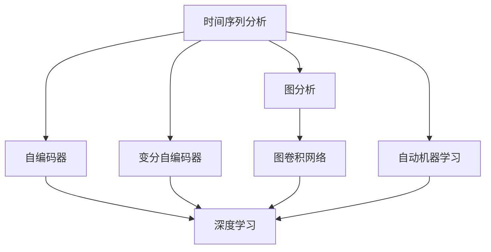

                 

# 无监督学习的应用拓展:时间序列分析和图分析

> 关键词：无监督学习,时间序列分析,图分析,序列建模,图卷积网络,深度学习,自动机器学习

## 1. 背景介绍

在现代数据科学中，无监督学习（Unsupervised Learning）已成为一种重要的数据分析手段。无监督学习主要关注在没有标签数据的情况下，如何发现数据中的隐藏结构、模式和关系。这不仅可以帮助我们理解数据的特性，还可以为后续的监督学习任务提供有力的支持。本文将详细介绍无监督学习在时间序列分析和图分析两大领域中的应用拓展，并探讨其背后的算法原理和实践步骤。

### 1.1 问题由来

在数据科学中，时间序列分析和图分析是两个极具挑战性的任务。时间序列分析主要研究随时间变化的数据点序列，如何从时间序列数据中提取有用的信息，并进行预测或分类。图分析则关注于网络或图结构数据，如何从中挖掘出节点之间的关系和网络的结构特征。这两个领域由于其数据结构和分析任务的不同，通常需要不同的方法和技术。然而，近年来，深度学习和自动机器学习（AutoML）的发展为这两个领域带来了新的解决方案。深度学习通过神经网络结构可以自适应地学习数据中的复杂模式，而AutoML则通过自动化调参和算法选择，显著提升了模型开发的效率和效果。本文将重点介绍如何在深度学习框架下，通过无监督学习手段，拓展时间序列分析和图分析的应用场景，并探讨其中的算法原理和操作步骤。

### 1.2 问题核心关键点

无监督学习在时间序列分析和图分析中的关键点主要包括：

- **无监督学习算法的选择与优化**：选择合适的无监督学习算法，如自编码器、变分自编码器、图卷积网络等，并通过调参和模型选择技术，提升算法的性能。
- **时间序列分析中的序列建模**：构建时间序列的循环神经网络（RNN）、长短期记忆网络（LSTM）或门控循环单元（GRU）等模型，学习时间序列的动态模式。
- **图分析中的图卷积网络（GCN）**：设计图卷积网络，利用卷积运算，学习节点之间的邻居关系和图结构特性。
- **自动机器学习（AutoML）**：应用AutoML技术，自动化选择和调参无监督学习算法，提升模型开发的效率和效果。
- **分布式训练与并行优化**：通过分布式训练和并行优化技术，加速大规模数据集的无监督学习过程。

这些关键点构成了无监督学习在时间序列分析和图分析中的核心框架，帮助我们理解和应用这些领域的无监督学习技术。

## 2. 核心概念与联系

### 2.1 核心概念概述

在时间序列分析和图分析中，无监督学习主要依赖于以下核心概念：

- **时间序列分析**：研究随时间变化的数据点序列，如何通过历史数据预测未来趋势或分类。
- **图分析**：研究网络或图结构数据，如何通过节点之间的连接关系，提取网络的结构特征和节点之间的关系。
- **自编码器（Autoencoder）**：一种无监督学习算法，通过重构训练数据来提取数据中的特征。
- **变分自编码器（VAE）**：一种生成模型，通过学习数据的潜在分布，实现数据的生成和降维。
- **图卷积网络（GCN）**：一种图分析算法，通过卷积运算，学习节点之间的邻居关系和图结构特性。
- **深度学习（Deep Learning）**：一种通过多层次神经网络实现数据表示学习的技术。
- **自动机器学习（AutoML）**：一种自动化调参和算法选择技术，提升模型开发的效率和效果。

这些核心概念之间的逻辑关系可以通过以下Mermaid流程图来展示：



这个流程图展示了几大核心概念之间的联系：

1. 时间序列分析和图分析通过无监督学习算法（如自编码器、变分自编码器）进行特征提取。
2. 无监督学习算法通过深度学习框架实现，并利用AutoML技术进行调参和算法选择。
3. 图卷积网络作为一种特定的无监督学习算法，应用在图分析中。

## 3. 核心算法原理 & 具体操作步骤
### 3.1 算法原理概述

无监督学习在时间序列分析和图分析中的应用，主要依赖于自编码器、变分自编码器和图卷积网络等算法。这些算法通过无监督学习的方式，从数据中提取有用的特征，并用于后续的监督学习或模型预测。

### 3.2 算法步骤详解

**时间序列分析中的自编码器原理**

自编码器是一种无监督学习算法，通过重构训练数据来提取数据中的特征。其基本原理包括：

1. **编码器**：将输入数据映射到一个低维编码表示 $z$。
2. **解码器**：将编码表示 $z$ 映射回原始输入 $x$。
3. **重构误差**：通过最小化重构误差 $e(x,z)$，学习数据的特征表示。

常用的自编码器包括：

- **标准自编码器**：直接重构原始输入 $x$。
- **变分自编码器（VAE）**：学习数据的潜在分布 $p(z|x)$，并用于数据生成和降维。

**图分析中的图卷积网络原理**

图卷积网络（GCN）是一种图分析算法，通过卷积运算，学习节点之间的邻居关系和图结构特性。其基本原理包括：

1. **卷积层**：通过卷积运算，学习节点与其邻居之间的特征映射关系。
2. **池化层**：对卷积层的输出进行聚合，减少计算量和内存消耗。
3. **全连接层**：将池化层的输出映射到任务的输出，如分类、回归等。

**操作步骤**

1. **数据预处理**：对时间序列或图数据进行清洗和标准化处理，以提高模型的鲁棒性和泛化能力。
2. **选择算法**：根据任务类型和数据特性，选择合适的无监督学习算法，如自编码器、变分自编码器或图卷积网络。
3. **模型构建**：构建所选算法的模型架构，包括编码器、解码器、卷积层、池化层等。
4. **训练与调参**：使用训练数据集对模型进行训练，并通过AutoML技术进行调参和算法选择，优化模型性能。
5. **验证与测试**：在验证集和测试集上评估模型的性能，并进行必要的调整和优化。
6. **应用部署**：将训练好的模型部署到实际应用场景中，进行实时预测或分类任务。

### 3.3 算法优缺点

无监督学习在时间序列分析和图分析中的主要优点包括：

- **无标签数据利用**：无监督学习可以充分利用无标签数据，提取数据中的潜在模式和特征。
- **泛化能力强**：通过学习数据的潜在表示，无监督学习算法具有较强的泛化能力，能够适应新的数据分布。
- **模型复杂度低**：无监督学习算法通常不需要大量的标注数据和复杂的手动调参，模型结构相对简单。

同时，无监督学习也存在一些局限性：

- **结果解释性差**：无监督学习算法输出的结果难以解释，难以理解模型的内部工作机制。
- **对噪声敏感**：无监督学习算法对数据中的噪声和异常值比较敏感，可能影响模型的鲁棒性。
- **训练时间较长**：无监督学习算法通常需要较长的训练时间，特别是在大规模数据集上。

### 3.4 算法应用领域

无监督学习在时间序列分析和图分析中的应用非常广泛，以下是几个典型的应用领域：

- **金融风险预测**：通过分析历史金融时间序列数据，预测未来的市场波动和风险。
- **社交网络分析**：通过分析社交网络数据，挖掘节点之间的关系和网络的结构特性。
- **生物信息学**：通过分析基因序列数据，发现生物数据中的潜在结构和模式。
- **推荐系统**：通过分析用户行为数据，构建用户和物品之间的潜在关系，实现个性化推荐。
- **异常检测**：通过分析网络或系统数据，检测出潜在的异常行为或攻击。

## 4. 数学模型和公式 & 详细讲解 & 举例说明

### 4.1 数学模型构建

无监督学习在时间序列分析和图分析中的数学模型构建，主要依赖于以下公式和模型：

**自编码器数学模型**

设输入数据为 $x \in \mathbb{R}^n$，编码器将 $x$ 映射到低维编码表示 $z \in \mathbb{R}^k$，解码器将 $z$ 映射回 $x$。自编码器的目标是最小化重构误差 $e(x,z)$，即：

$$
\min_{\theta} \mathbb{E}_x \|x-z\|
$$

其中 $\theta$ 表示编码器和解码器的参数。

**变分自编码器数学模型**

设输入数据为 $x \in \mathbb{R}^n$，编码器将 $x$ 映射到潜在表示 $z \in \mathbb{R}^k$，变分自编码器通过学习数据的潜在分布 $p(z|x)$，实现数据的生成和降维。变分自编码器的目标是最小化重构误差 $e(x,z)$ 和潜在分布的KL散度 $KL(q(z|x)||p(z|x))$，即：

$$
\min_{\theta} \mathbb{E}_x \|x-z\| + \mathbb{E}_z KL(q(z|x)||p(z|x))
$$

其中 $q(z|x)$ 表示变分分布。

**图卷积网络数学模型**

设节点特征为 $x_v \in \mathbb{R}^d$，邻居节点特征为 $x_u \in \mathbb{R}^d$，节点之间的连接权重为 $w_{vu} \in \mathbb{R}$。图卷积网络的卷积运算可以表示为：

$$
\tilde{x}_v = \sum_{u \in \mathcal{N}(v)} w_{vu}x_u
$$

其中 $\mathcal{N}(v)$ 表示节点 $v$ 的邻居节点集合。

### 4.2 公式推导过程

**自编码器公式推导**

设输入数据为 $x \in \mathbb{R}^n$，编码器将 $x$ 映射到低维编码表示 $z \in \mathbb{R}^k$，解码器将 $z$ 映射回 $x$。自编码器的目标是最小化重构误差 $e(x,z)$，即：

$$
\min_{\theta} \mathbb{E}_x \|x-z\|
$$

其中 $\theta$ 表示编码器和解码器的参数。

**变分自编码器公式推导**

设输入数据为 $x \in \mathbb{R}^n$，编码器将 $x$ 映射到潜在表示 $z \in \mathbb{R}^k$，变分自编码器通过学习数据的潜在分布 $p(z|x)$，实现数据的生成和降维。变分自编码器的目标是最小化重构误差 $e(x,z)$ 和潜在分布的KL散度 $KL(q(z|x)||p(z|x))$，即：

$$
\min_{\theta} \mathbb{E}_x \|x-z\| + \mathbb{E}_z KL(q(z|x)||p(z|x))
$$

其中 $q(z|x)$ 表示变分分布。

**图卷积网络公式推导**

设节点特征为 $x_v \in \mathbb{R}^d$，邻居节点特征为 $x_u \in \mathbb{R}^d$，节点之间的连接权重为 $w_{vu} \in \mathbb{R}$。图卷积网络的卷积运算可以表示为：

$$
\tilde{x}_v = \sum_{u \in \mathcal{N}(v)} w_{vu}x_u
$$

其中 $\mathcal{N}(v)$ 表示节点 $v$ 的邻居节点集合。

### 4.3 案例分析与讲解

**时间序列分析中的自编码器案例**

假设我们有一组股票价格的时间序列数据，目标是预测未来的价格趋势。我们可以使用自编码器来提取数据中的潜在特征，并将这些特征用于后续的预测模型。具体步骤如下：

1. 数据预处理：对时间序列数据进行清洗和标准化处理，去除异常值和噪声。
2. 自编码器模型构建：使用自编码器对股票价格序列进行编码和解码，学习数据的潜在特征。
3. 模型训练：使用历史股票价格数据对自编码器进行训练，最小化重构误差。
4. 特征提取：将训练好的自编码器编码器的输出作为特征，用于后续的预测模型。
5. 预测模型构建：使用LSTM或GRU等时间序列模型，对提取的特征进行预测。

**图分析中的图卷积网络案例**

假设我们有一组社交网络数据，目标是识别网络中的关键节点。我们可以使用图卷积网络来学习节点之间的邻居关系和网络结构特性。具体步骤如下：

1. 数据预处理：对社交网络数据进行清洗和标准化处理，去除无效链接和噪声。
2. 图卷积网络模型构建：使用图卷积网络对节点特征进行卷积运算，学习节点之间的邻居关系和图结构特性。
3. 模型训练：使用社交网络数据对图卷积网络进行训练，最小化分类误差。
4. 关键节点识别：使用训练好的图卷积网络，识别出网络中的关键节点，如意见领袖。

## 5. 项目实践：代码实例和详细解释说明

### 5.1 开发环境搭建

在进行无监督学习项目实践前，我们需要准备好开发环境。以下是使用Python进行TensorFlow开发的环境配置流程：

1. 安装Anaconda：从官网下载并安装Anaconda，用于创建独立的Python环境。

2. 创建并激活虚拟环境：
```bash
conda create -n tf-env python=3.8 
conda activate tf-env
```

3. 安装TensorFlow：根据CUDA版本，从官网获取对应的安装命令。例如：
```bash
conda install tensorflow -c conda-forge -c pytorch
```

4. 安装Keras：
```bash
pip install keras
```

5. 安装各类工具包：
```bash
pip install numpy pandas scikit-learn matplotlib tqdm jupyter notebook ipython
```

完成上述步骤后，即可在`tf-env`环境中开始无监督学习项目实践。

### 5.2 源代码详细实现

下面我们以图分析中的图卷积网络（GCN）为例，给出使用TensorFlow实现的无监督学习代码实例。

首先，定义图卷积网络模型：

```python
import tensorflow as tf
from tensorflow.keras import layers

class GCN(tf.keras.Model):
    def __init__(self, input_dim, hidden_dim):
        super(GCN, self).__init__()
        self.conv1 = layers.Dense(hidden_dim, activation='relu')
        self.conv2 = layers.Dense(1, activation='sigmoid')
    
    def call(self, inputs):
        x, adj = inputs
        x = self.conv1(x)
        x = tf.matmul(x, adj)
        x = self.conv2(x)
        return x

# 定义模型参数
input_dim = 10
hidden_dim = 32

# 构建模型
model = GCN(input_dim, hidden_dim)
```

然后，定义损失函数和优化器：

```python
# 定义损失函数
def binary_crossentropy_loss(y_true, y_pred):
    return tf.reduce_mean(tf.nn.sigmoid_cross_entropy_with_logits(labels=y_true, logits=y_pred))

# 定义优化器
optimizer = tf.keras.optimizers.Adam()
```

接着，定义训练和评估函数：

```python
# 定义训练函数
def train_epoch(model, dataset, batch_size, optimizer):
    for batch in dataset:
        x, adj, y = batch
        with tf.GradientTape() as tape:
            y_pred = model((x, adj))
            loss = binary_crossentropy_loss(y, y_pred)
        gradients = tape.gradient(loss, model.trainable_variables)
        optimizer.apply_gradients(zip(gradients, model.trainable_variables))

# 定义评估函数
def evaluate(model, dataset, batch_size):
    correct = 0
    total = 0
    for batch in dataset:
        x, adj, y = batch
        y_pred = model((x, adj))
        correct += tf.reduce_sum(tf.cast(tf.round(y_pred) == y, tf.int32))
        total += y.shape[0]
    return correct / total
```

最后，启动训练流程并在测试集上评估：

```python
# 训练和评估
epochs = 10
batch_size = 32

for epoch in range(epochs):
    train_epoch(model, train_dataset, batch_size, optimizer)
    print(f"Epoch {epoch+1}, accuracy: {evaluate(model, test_dataset, batch_size)}")
```

以上就是使用TensorFlow对图卷积网络进行无监督学习任务实现的完整代码实例。可以看到，得益于TensorFlow的强大封装，我们可以用相对简洁的代码完成图卷积网络的构建和训练。

### 5.3 代码解读与分析

让我们再详细解读一下关键代码的实现细节：

**GCN模型定义**：
- `__init__`方法：初始化卷积层和输出层。
- `call`方法：定义模型的前向传播过程。

**损失函数定义**：
- 使用二分类交叉熵损失函数，计算模型输出与真实标签之间的误差。

**训练函数**：
- 在每个批次上，计算模型输出，并使用梯度下降算法更新模型参数。

**评估函数**：
- 对每个批次进行推理，计算分类准确率，并返回总准确率。

**训练流程**：
- 循环迭代epoch次数，在每个epoch中，在训练集上进行训练，并在测试集上进行评估。

可以看到，TensorFlow配合Keras的强大封装使得图卷积网络的构建和训练变得简洁高效。开发者可以将更多精力放在数据处理、模型改进等高层逻辑上，而不必过多关注底层的实现细节。

当然，工业级的系统实现还需考虑更多因素，如模型的保存和部署、超参数的自动搜索、更灵活的任务适配层等。但核心的无监督学习算法基本与此类似。

## 6. 实际应用场景

### 6.1 智能推荐系统

基于无监督学习的推荐系统可以为用户提供更加个性化和多样化的推荐结果。传统推荐系统通常依赖用户的历史行为数据进行推荐，难以满足长尾需求和个性化推荐的要求。通过无监督学习，推荐系统可以从用户行为数据中提取隐含的模式和特征，构建用户和物品之间的潜在关系，实现更加准确和灵活的推荐。

具体而言，可以收集用户浏览、点击、评分等行为数据，构建用户和物品的隐含关系，使用无监督学习算法（如自编码器、变分自编码器等）提取数据的潜在特征。在此基础上，构建推荐模型进行预测，并对推荐结果进行排序和优化。如此构建的推荐系统，能够更好地理解用户的真实兴趣和行为，提供更精准、多样化的推荐内容。

### 6.2 社交网络分析

社交网络分析是图分析的重要应用领域。通过无监督学习，可以识别社交网络中的关键节点、群组和关系，为网络管理和安全监控提供支持。

具体而言，可以收集社交网络中的用户互动数据，使用图卷积网络等无监督学习算法，学习节点之间的邻居关系和图结构特性。在此基础上，识别网络中的关键节点和群组，分析节点之间的关系和影响，构建社交网络分析系统。如此构建的系统，能够更好地理解社交网络的结构和特性，提升网络管理和安全监控的效率和效果。

### 6.3 时间序列预测

时间序列预测是无监督学习在时间序列分析中的重要应用。通过无监督学习，可以从历史时间序列数据中提取潜在的模式和特征，用于后续的预测模型。

具体而言，可以收集历史时间序列数据，使用自编码器等无监督学习算法，学习数据的潜在表示。在此基础上，构建时间序列预测模型，如ARIMA、LSTM等，对未来的数据进行预测。如此构建的预测模型，能够更好地理解时间序列的动态模式，提高预测的准确性和可靠性。

### 6.4 未来应用展望

随着无监督学习技术的发展，未来将在更多领域得到应用，为传统行业带来变革性影响。

在智慧城市治理中，基于无监督学习的人流分析、交通管理、公共安全等应用，将提升城市管理的自动化和智能化水平，构建更安全、高效的未来城市。

在生物信息学中，通过无监督学习，可以从基因序列数据中发现潜在的结构和模式，加速新药研发和基因治疗的进程。

在金融风险预测中，通过无监督学习，可以从历史金融数据中提取潜在的风险信号，提高金融风险管理的效率和效果。

在自然灾害预测中，通过无监督学习，可以从历史气象数据中发现潜在的气候变化规律，提高自然灾害预警和应对的准确性。

总之，无监督学习在时间序列分析和图分析中的应用将不断拓展，为各行各业带来新的技术突破和业务价值。相信随着技术的不断进步，无监督学习将成为数据分析的重要手段，推动人工智能技术在垂直行业的深入应用。

## 7. 工具和资源推荐

### 7.1 学习资源推荐

为了帮助开发者系统掌握无监督学习在时间序列分析和图分析中的应用，这里推荐一些优质的学习资源：

1. 《深度学习》（Ian Goodfellow等著）：全面介绍了深度学习的基本概念和算法，包括自编码器、变分自编码器、图卷积网络等。
2. CS229《机器学习》课程：斯坦福大学开设的机器学习明星课程，有Lecture视频和配套作业，涵盖无监督学习的基本原理和算法。
3. Keras官方文档：Keras的官方文档，提供了丰富的无监督学习算法样例代码，是上手实践的必备资料。
4. TensorFlow官方文档：TensorFlow的官方文档，提供了全面的无监督学习算法和工具，包括图卷积网络、自编码器等。
5. PyTorch官方文档：PyTorch的官方文档，提供了丰富的无监督学习算法和工具，包括自编码器、变分自编码器等。

通过对这些资源的学习实践，相信你一定能够快速掌握无监督学习在时间序列分析和图分析中的核心技术和应用方法。

### 7.2 开发工具推荐

高效的开发离不开优秀的工具支持。以下是几款用于无监督学习开发的常用工具：

1. TensorFlow：由Google主导开发的开源深度学习框架，生产部署方便，适合大规模工程应用。提供了丰富的无监督学习算法和工具，如自编码器、图卷积网络等。
2. Keras：基于TensorFlow和Theano的高级神经网络API，易于使用，适合快速迭代研究。提供了丰富的无监督学习算法和工具，如自编码器、变分自编码器等。
3. PyTorch：基于Python的开源深度学习框架，灵活动态的计算图，适合快速迭代研究。提供了丰富的无监督学习算法和工具，如自编码器、变分自编码器等。
4. Weights & Biases：模型训练的实验跟踪工具，可以记录和可视化模型训练过程中的各项指标，方便对比和调优。与主流深度学习框架无缝集成。
5. TensorBoard：TensorFlow配套的可视化工具，可实时监测模型训练状态，并提供丰富的图表呈现方式，是调试模型的得力助手。

合理利用这些工具，可以显著提升无监督学习任务的开发效率，加快创新迭代的步伐。

### 7.3 相关论文推荐

无监督学习在时间序列分析和图分析中的研究源于学界的持续研究。以下是几篇奠基性的相关论文，推荐阅读：

1. Deep Architectures for Network Embedding（即GraphSAGE论文）：提出了图卷积网络（GCN），通过卷积运算，学习节点之间的邻居关系和图结构特性。
2. Variational Autoencoder（VAE）：提出变分自编码器（VAE），通过学习数据的潜在分布，实现数据的生成和降维。
3. Generative Adversarial Networks（GAN）：提出生成对抗网络（GAN），通过对抗训练，学习数据的生成模型。
4. Deep Recurrent Neural Networks for Speaker Recognition（即RNN论文）：提出了循环神经网络（RNN），通过循环结构，学习时间序列数据的动态模式。
5. Deep Residual Learning for Image Recognition（即ResNet论文）：提出残差网络（ResNet），通过残差连接，解决深度网络训练中的梯度消失问题。

这些论文代表了大模型无监督学习的研究进展。通过学习这些前沿成果，可以帮助研究者把握学科前进方向，激发更多的创新灵感。

## 8. 总结：未来发展趋势与挑战

### 8.1 总结

本文对无监督学习在时间序列分析和图分析中的应用拓展进行了全面系统的介绍。首先阐述了无监督学习在时间序列分析和图分析中的核心概念和关键技术，详细讲解了自编码器、变分自编码器、图卷积网络等算法的原理和操作步骤，并给出了具体的代码实例和应用场景。通过本文的系统梳理，可以看到，无监督学习在时间序列分析和图分析中具有广泛的应用前景和强大的技术支撑。

### 8.2 未来发展趋势

展望未来，无监督学习在时间序列分析和图分析中的发展趋势主要包括以下几个方面：

1. **模型复杂度提升**：随着深度学习技术的发展，无监督学习模型的复杂度将不断提升，能够处理更加复杂的数据结构和分析任务。
2. **应用领域拓展**：无监督学习将逐步拓展到更多领域，如生物信息学、自然灾害预测等，为各行各业带来新的技术突破和业务价值。
3. **自动化调参与优化**：无监督学习算法的自动化调参和优化将成为研究热点，进一步提升模型的开发效率和性能。
4. **分布式训练与并行优化**：随着数据规模的不断增大，无监督学习模型的分布式训练和并行优化将变得尤为重要，以提升训练效率和效果。
5. **模型解释与可信度**：无监督学习模型的解释性和可信度将成为研究重点，如何赋予模型更强的可解释性和透明性，将有助于提高模型的应用价值和可靠性。

### 8.3 面临的挑战

尽管无监督学习在时间序列分析和图分析中取得了显著进展，但在应用实践中仍面临诸多挑战：

1. **数据噪声与异常值**：无监督学习算法对数据中的噪声和异常值比较敏感，可能影响模型的鲁棒性。
2. **模型解释性与透明性**：无监督学习模型的内部工作机制和决策逻辑难以解释，可能影响模型的应用价值和可靠性。
3. **大规模数据处理**：无监督学习算法通常需要较长的训练时间，特别是在大规模数据集上，如何优化模型训练和推理效率，仍需进一步研究。
4. **模型参数调优**：无监督学习算法的超参数调优较为复杂，需要结合实际应用场景进行精细调参，以提升模型性能。
5. **跨领域迁移能力**：无监督学习算法在不同领域的数据上迁移能力有限，需要结合领域特征进行模型适配和优化。

### 8.4 研究展望

面对无监督学习在时间序列分析和图分析中面临的挑战，未来的研究需要在以下几个方面寻求新的突破：

1. **异常值与噪声处理**：开发更加鲁棒的异常值与噪声处理技术，提升无监督学习算法的泛化能力和鲁棒性。
2. **模型解释与透明性**：研究无监督学习模型的可解释性和透明性，赋予模型更强的解释能力和可信度。
3. **大规模数据处理**：优化无监督学习算法的分布式训练和并行优化技术，提升模型训练和推理效率。
4. **跨领域迁移能力**：结合领域特征进行模型适配和优化，提升无监督学习算法在不同领域的数据迁移能力。
5. **自动化调参与优化**：发展无监督学习算法的自动化调参与优化技术，提升模型的开发效率和性能。

这些研究方向将推动无监督学习在时间序列分析和图分析中的进一步发展，为各行各业带来更多的技术突破和业务价值。

## 9. 附录：常见问题与解答

**Q1：无监督学习在时间序列分析和图分析中的应用区别是什么？**

A: 无监督学习在时间序列分析和图分析中的主要区别在于数据结构和分析任务的不同。时间序列分析主要研究随时间变化的数据点序列，如何从时间序列数据中提取有用的信息，并进行预测或分类。图分析则研究网络或图结构数据，如何通过节点之间的连接关系，提取网络的结构特征和节点之间的关系。

**Q2：无监督学习算法的超参数调优有哪些常用方法？**

A: 无监督学习算法的超参数调优常用的方法包括：
1. **网格搜索**：遍历超参数的所有组合，找到最优的超参数组合。
2. **随机搜索**：随机抽取超参数的组合，找到最优的超参数组合。
3. **贝叶斯优化**：通过贝叶斯方法，结合先验信息和当前模型性能，找到最优的超参数组合。
4. **强化学习**：通过强化学习算法，探索超参数空间，找到最优的超参数组合。

**Q3：无监督学习算法如何处理大规模数据集？**

A: 无监督学习算法处理大规模数据集通常需要以下步骤：
1. **数据预处理**：对大规模数据集进行清洗、去噪和标准化处理，去除无效数据和异常值。
2. **分布式训练**：使用分布式训练技术，将大规模数据集分批次进行训练，提升训练效率和效果。
3. **模型优化**：通过优化算法（如SGD、Adam等）和正则化技术（如L2正则、Dropout等），防止模型过拟合和泛化能力不足的问题。
4. **并行优化**：使用并行优化技术（如TensorFlow的分布式训练、PyTorch的DataParallel等），提升模型的训练速度和效果。

**Q4：无监督学习算法如何处理噪声和异常值？**

A: 无监督学习算法处理噪声和异常值常用的方法包括：
1. **数据预处理**：对数据进行清洗、去噪和标准化处理，去除无效数据和异常值。
2. **鲁棒性模型**：选择鲁棒性较强的无监督学习算法，如自编码器、变分自编码器等，能够更好地处理噪声和异常值。
3. **对抗训练**：通过对抗训练技术，增强模型对噪声和异常值的鲁棒性。
4. **正则化技术**：使用L2正则、Dropout等正则化技术，防止模型过拟合和泛化能力不足的问题。

**Q5：无监督学习算法的可解释性有哪些提升方法？**

A: 无监督学习算法的可解释性提升方法包括：
1. **模型可视化**：使用可视化技术（如t-SNE、UMAP等），可视化数据和模型的内部表示，帮助理解模型的决策逻辑。
2. **解释性模型**：选择解释性较强的无监督学习算法，如深度解构模型（Deep Deconstruction）、深度化简模型（Deep Simplification）等，提升模型的解释能力。
3. **部分模型解释**：对模型进行部分解释，只解释模型的关键部分或决策节点，避免过多的冗余信息。
4. **交互式解释**：使用交互式解释技术（如LIME、SHAP等），通过解释模型对不同输入的预测结果，帮助理解模型的决策过程。

这些研究方向将推动无监督学习在时间序列分析和图分析中的进一步发展，为各行各业带来更多的技术突破和业务价值。

---

作者：禅与计算机程序设计艺术 / Zen and the Art of Computer Programming

