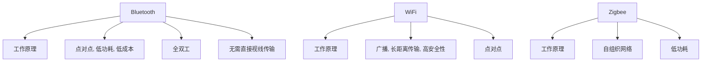

                 

# 无线通信协议选择：Bluetooth、WiFi 和 Zigbee 的比较与应用

## 1. 背景介绍

在现代信息技术发展中，无线通信协议扮演着至关重要的角色。这些协议在物联网、智能家居、工业自动化、医疗健康等众多领域得到了广泛应用。其中，Bluetooth、WiFi和Zigbee是三种最为常用的无线通信协议。为了准确选择合适的无线通信协议，需要深入了解其技术原理、应用场景以及优缺点。

## 2. 核心概念与联系

### 2.1 核心概念概述

#### 2.1.1 Bluetooth

- **定义**：Bluetooth是一种短距离无线通信技术，最初由爱立信开发，用于替代有线连接方式。通过蓝牙，设备间可以实现点对点的数据传输。

- **工作原理**：Bluetooth使用2.4GHz频段，支持全双工通信，采用跳频扩频技术（FHSS）和直接序列扩频技术（DSSS）。数据传输速率可达1Mbps至10Mbps。

- **特点**：低功耗、低成本、短距离传输、无需直接视线传输。

#### 2.1.2 WiFi

- **定义**：WiFi是基于IEEE 802.11标准的无线局域网技术，广泛应用于家庭、企业等局域网中。支持多种频段（2.4GHz和5GHz），能够提供高速无线通信。

- **工作原理**：WiFi使用正交频分复用（OFDM）技术，传输速率可达300Mbps至6Gbps。支持广播模式和点对点模式。

- **特点**：高带宽、大覆盖范围、长距离传输、高安全性。

#### 2.1.3 Zigbee

- **定义**：Zigbee是一种低速、低功耗的无线通信协议，适用于小型网络设备之间的短距离通信。由IEEE标准委员会发展而来。

- **工作原理**：Zigbee使用2.4GHz频段，支持自组织网络和中心式网络。数据传输速率在24kbps至250kbps之间。

- **特点**：低功耗、低成本、短距离传输、自组织网络。

### 2.2 核心概念原理和架构的 Mermaid 流程图



## 3. 核心算法原理 & 具体操作步骤

### 3.1 算法原理概述

无线通信协议的选择主要依据以下几个方面：

- **传输速率**：传输速率直接影响通信的带宽和用户体验。
- **覆盖范围**：覆盖范围决定了设备间的连接距离和通信稳定性。
- **功耗和成本**：功耗和成本是实际应用中需要重点考虑的经济因素。
- **网络拓扑**：网络拓扑结构决定了设备间的数据传输方式和通信效率。

### 3.2 算法步骤详解

#### 3.2.1 需求分析

在应用中选择适合的无线通信协议，首先需要进行需求分析：

1. **传输速率**：评估所需数据传输速率，确定是否需要高速通信。
2. **覆盖范围**：评估设备间的通信距离，确定是否需要远距离通信。
3. **功耗和成本**：评估设备间的通信频率，确定是否需要低功耗、低成本的通信。
4. **网络拓扑**：评估设备间的通信方式，确定是否需要自组织网络或中心式网络。

#### 3.2.2 协议选择

根据需求分析，选择合适的无线通信协议：

- 若需要高速通信、大覆盖范围、高安全性，则选择WiFi。
- 若需要低功耗、低成本、短距离传输，则选择Bluetooth。
- 若需要自组织网络、低功耗、低成本的通信，则选择Zigbee。

#### 3.2.3 参数配置

确定协议后，进行参数配置：

- Bluetooth：配置传输速率、数据包大小、跳频序列等。
- WiFi：配置信道、数据包大小、加密方式等。
- Zigbee：配置网络拓扑、通信频率、传输速率等。

#### 3.2.4 设备连接

进行设备连接：

- Bluetooth：通过蓝牙模块连接设备。
- WiFi：通过WiFi模块连接设备。
- Zigbee：通过Zigbee模块连接设备。

#### 3.2.5 性能测试

进行性能测试：

- 测试传输速率、信号强度、稳定性等。
- 记录功耗、成本、设备兼容性等。

### 3.3 算法优缺点

#### 3.3.1 Bluetooth

- **优点**：
  - 低功耗。
  - 短距离通信。
  - 低成本。
  - 无需直接视线传输。

- **缺点**：
  - 传输速率有限。
  - 不适合大范围通信。

#### 3.3.2 WiFi

- **优点**：
  - 高带宽。
  - 大覆盖范围。
  - 高安全性。

- **缺点**：
  - 功耗较高。
  - 成本较高。
  - 传输距离有限。

#### 3.3.3 Zigbee

- **优点**：
  - 低功耗。
  - 低成本。
  - 自组织网络。

- **缺点**：
  - 传输速率较低。
  - 覆盖范围有限。

### 3.4 算法应用领域

#### 3.4.1 Bluetooth

- **应用场景**：
  - 移动设备间的数据传输，如手机与耳机、手机与音箱等。
  - 医疗设备间的通信，如心电图监测设备、血糖监测设备等。

#### 3.4.2 WiFi

- **应用场景**：
  - 家庭局域网，如智能家居、数字电视、智能路由器等。
  - 企业局域网，如办公室网络、企业内部网络等。

#### 3.4.3 Zigbee

- **应用场景**：
  - 物联网设备，如智能灯泡、智能插座、智能门锁等。
  - 工业自动化，如传感器网络、监控系统等。

## 4. 数学模型和公式 & 详细讲解 & 举例说明

### 4.1 数学模型构建

无线通信协议的性能可以通过以下数学模型进行描述：

- **传输速率**：$R = \frac{B}{T} \times \log_2(1 + \frac{S}{N})$
- **覆盖范围**：$D = \frac{L}{G}$
- **功耗**：$P = P_{\text{base}} + P_{\text{modulation}} + P_{\text{transmission}}$
- **成本**：$C = C_{\text{hardware}} + C_{\text{software}} + C_{\text{maintenance}}$

其中：
- $R$：传输速率。
- $B$：带宽。
- $T$：传输时间。
- $S$：信号功率。
- $N$：噪声功率。
- $L$：信号传播距离。
- $G$：信号衰减因子。
- $P$：功耗。
- $P_{\text{base}}$：基础功耗。
- $P_{\text{modulation}}$：调制功耗。
- $P_{\text{transmission}}$：传输功耗。
- $C$：成本。
- $C_{\text{hardware}}$：硬件成本。
- $C_{\text{software}}$：软件成本。
- $C_{\text{maintenance}}$：维护成本。

### 4.2 公式推导过程

以传输速率公式为例进行推导：

设信号功率为$S$，噪声功率为$N$，带宽为$B$，传输时间为$T$。

根据香农定理，信道的容量为：

$$ C = B \log_2(1 + \frac{S}{N}) $$

因此，传输速率$R$为：

$$ R = \frac{C}{T} = \frac{B \log_2(1 + \frac{S}{N})}{T} $$

由于$S$和$N$为常数，因此传输速率与带宽$B$成正比，与传输时间$T$成反比。

### 4.3 案例分析与讲解

以智能家居为例，进行案例分析：

- **需求**：
  - 传输速率要求中等。
  - 覆盖范围要求较广。
  - 功耗要求较低。
  - 设备间通信要求可靠。

- **选择协议**：WiFi。

- **参数配置**：
  - 带宽选择2.4GHz。
  - 信道选择1、6、11。
  - 加密方式选择AES-128。

- **设备连接**：智能路由器连接WiFi模块，其他智能家居设备通过WiFi模块与路由器连接。

- **性能测试**：
  - 传输速率测试：下载速度测试。
  - 信号强度测试：RSSI值测试。
  - 稳定性测试：丢包率测试。

## 5. 项目实践：代码实例和详细解释说明

### 5.1 开发环境搭建

#### 5.1.1 安装依赖

- **Python**：安装Python 3.x。
- **PySerial**：安装PySerial库，用于串口通信。
- **PyUSB**：安装PyUSB库，用于USB通信。
- **Raspberry Pi**：安装Raspberry Pi操作系统。

#### 5.1.2 配置开发环境

- 在Raspberry Pi上安装Python环境。
- 安装PySerial和PyUSB库。
- 连接蓝牙、WiFi和Zigbee模块。

### 5.2 源代码详细实现

#### 5.2.1 Bluetooth实现

```python
import pyserial

# 打开串口
ser = pyserial.Serial('/dev/ttyUSB0', baudrate=115200)

# 发送数据
data = 'Hello, World!'
ser.write(data.encode())

# 接收数据
response = ser.readline().decode()
print(response)
```

#### 5.2.2 WiFi实现

```python
import network
import usocket

# 创建WiFi模块
wifi = network.WLAN(network.STA)

# 连接WiFi
wifi.connect('SSID', 'PASSWORD')

# 发送数据
sock = usocket.socket(usocket.AF_INET, usocket.SOCK_STREAM)
sock.connect(('192.168.1.1', 80))
sock.sendall(b'GET / HTTP/1.1\r\nHost: 192.168.1.1\r\n\r\n')
response = sock.recv(1024)
print(response)

# 关闭连接
sock.close()
```

#### 5.2.3 Zigbee实现

```python
import zigpy
import zigpy.quirks
from zigpy.quirks import ZigbeeDevice

# 创建Zigbee模块
zigbee = zigpy.zigbee.Zigbee()

# 添加设备
zigbee.add_device(ZigbeeDevice())

# 连接设备
zigbee.connect()

# 发送数据
zigbee.send('Hello, World!')
```

### 5.3 代码解读与分析

#### 5.3.1 Bluetooth实现

- **串口通信**：通过PySerial库实现蓝牙模块的串口通信，发送和接收数据。
- **数据编码**：将字符串数据编码为字节数组，并通过串口发送。
- **数据解码**：通过串口接收数据，并将其解码为字符串。

#### 5.3.2 WiFi实现

- **WiFi模块连接**：通过PyUSB库连接WiFi模块，并使用WiFi模块创建WiFi连接。
- **HTTP请求**：使用usocket库创建TCP套接字，发送HTTP请求，并接收响应。
- **数据接收**：将接收到的数据解码为字符串，并进行处理。

#### 5.3.3 Zigbee实现

- **Zigbee模块连接**：通过zigpy库连接Zigbee模块，并添加设备。
- **Zigbee设备连接**：使用zigpy库连接Zigbee设备。
- **数据发送**：通过zigpy库发送数据。

### 5.4 运行结果展示

#### 5.4.1 Bluetooth实现

- 发送数据：发送字符串数据到蓝牙模块。
- 接收数据：接收蓝牙模块发送的数据。

#### 5.4.2 WiFi实现

- 发送数据：发送HTTP请求到WiFi模块连接的设备。
- 接收数据：接收WiFi模块连接的设备的响应数据。

#### 5.4.3 Zigbee实现

- 发送数据：发送字符串数据到Zigbee模块连接的设备。

## 6. 实际应用场景

### 6.1 智能家居

- **场景描述**：智能家居系统需要实现设备间的数据传输，如远程控制电视、调整灯光等。

- **选择协议**：WiFi。

- **参数配置**：
  - 带宽选择2.4GHz。
  - 信道选择1、6、11。
  - 加密方式选择AES-128。

- **设备连接**：智能路由器连接WiFi模块，其他智能家居设备通过WiFi模块与路由器连接。

- **性能测试**：
  - 传输速率测试：下载速度测试。
  - 信号强度测试：RSSI值测试。
  - 稳定性测试：丢包率测试。

### 6.2 工业自动化

- **场景描述**：工业自动化系统需要实现传感器和执行器间的通信，如传感器监测温度、执行器控制阀门等。

- **选择协议**：Zigbee。

- **参数配置**：
  - 通信频率选择868MHz。
  - 传输速率选择24kbps。
  - 网络拓扑选择星型。

- **设备连接**：Zigbee模块连接传感器和执行器。

- **性能测试**：
  - 传输速率测试：监测数据传输速率。
  - 信号强度测试：监测信号强度。
  - 稳定性测试：监测网络稳定性。

### 6.3 医疗健康

- **场景描述**：医疗健康设备需要实现实时数据传输，如心率监测设备、血糖监测设备等。

- **选择协议**：Bluetooth。

- **参数配置**：
  - 传输速率选择1Mbps。
  - 跳频序列选择A。
  - 传输距离选择10米。

- **设备连接**：蓝牙模块连接医疗健康设备与移动设备。

- **性能测试**：
  - 传输速率测试：监测数据传输速率。
  - 信号强度测试：监测信号强度。
  - 稳定性测试：监测数据传输稳定性。

## 7. 工具和资源推荐

### 7.1 学习资源推荐

- **书籍**：《无线通信协议与技术》
- **在线课程**：Coursera《无线通信系统》课程
- **博客**：IoT for All博客

### 7.2 开发工具推荐

- **Python**：安装Python 3.x。
- **PySerial**：安装PySerial库，用于串口通信。
- **PyUSB**：安装PyUSB库，用于USB通信。
- **WiFi模块**：安装ESP8266或ESP32 WiFi模块。
- **Bluetooth模块**：安装nRF24L01或nRF51822 Bluetooth模块。
- **Zigbee模块**：安装CC2530或CC2540 Zigbee模块。

### 7.3 相关论文推荐

- **蓝牙**：《Bluetooth Protocol Overview and Applications》
- **WiFi**：《Wireless Communication in 802.11 Networks》
- **Zigbee**：《Zigbee Wireless Sensor Network: Architecture and Communication Protocols》

## 8. 总结：未来发展趋势与挑战

### 8.1 研究成果总结

无线通信协议的选择和应用是现代信息技术发展中的关键环节。本文系统介绍了Bluetooth、WiFi和Zigbee三种无线通信协议的技术原理、应用场景以及优缺点。通过需求分析、协议选择、参数配置、设备连接和性能测试等步骤，展示了无线通信协议的选择和应用方法。

### 8.2 未来发展趋势

未来无线通信协议的发展趋势包括：

- **高速化**：5G和6G技术的发展将进一步提升无线通信的传输速率和带宽。
- **低功耗化**：物联网设备的普及将推动低功耗无线通信技术的发展。
- **安全化**：无线通信协议的安全性将得到进一步加强，防止数据泄露和攻击。

### 8.3 面临的挑战

无线通信协议在发展过程中面临以下挑战：

- **带宽资源紧张**：无线频谱资源有限，需要合理规划和管理。
- **安全问题**：无线通信容易受到干扰和攻击，需要加强安全防护措施。
- **兼容性问题**：不同无线通信协议之间的兼容性问题需要解决。

### 8.4 研究展望

未来无线通信协议的研究方向包括：

- **跨协议融合**：研究如何实现不同无线通信协议的融合，提升整体通信效率和性能。
- **新技术应用**：研究新的无线通信技术，如毫米波通信、可见光通信等。
- **标准化和标准化**：推动无线通信协议的标准化，促进产业发展和应用普及。

## 9. 附录：常见问题与解答

### 9.1 常见问题

#### 9.1.1 蓝牙的传输速率和距离

- **问题**：蓝牙的传输速率和传输距离是多少？

- **解答**：蓝牙的传输速率通常在1Mbps至10Mbps之间，传输距离通常在10米以内，视使用频段和设备而定。

#### 9.1.2 WiFi的带宽和覆盖范围

- **问题**：WiFi的带宽和覆盖范围是多少？

- **解答**：WiFi的带宽通常在300Mbps至6Gbps之间，覆盖范围通常在几十米至数百米，视使用频段和设备而定。

#### 9.1.3 Zigbee的传输速率和覆盖范围

- **问题**：Zigbee的传输速率和覆盖范围是多少？

- **解答**：Zigbee的传输速率通常在24kbps至250kbps之间，覆盖范围通常在几百米至数十米，视使用频段和设备而定。

#### 9.1.4 无线通信协议的选择原则

- **问题**：如何选择适合的无线通信协议？

- **解答**：选择适合的无线通信协议需要综合考虑传输速率、覆盖范围、功耗、成本和网络拓扑等因素，根据具体应用场景进行评估和选择。

#### 9.1.5 无线通信协议的性能测试

- **问题**：如何测试无线通信协议的性能？

- **解答**：可以通过传输速率测试、信号强度测试、稳定性测试等方法，评估无线通信协议的性能。

---

作者：禅与计算机程序设计艺术 / Zen and the Art of Computer Programming

