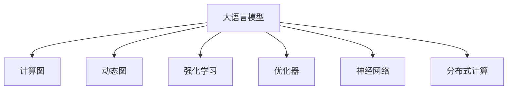

                 

# 时刻推理:LLM计算的独特之处

> 关键词：时刻推理,LLM,计算图,动态图,强化学习,优化器,神经网络,分布式计算

## 1. 背景介绍

近年来，随着深度学习技术的飞速发展，神经网络模型的复杂度不断攀升，计算开销呈指数级增长。如何在保持模型性能的同时，高效地进行计算，成为了深度学习社区广泛关注的问题。大语言模型（Large Language Models, LLMs）的出现，为这一问题提供了一个极佳的解决方向。

大语言模型通过在大规模无标签文本数据上自监督预训练，学习到丰富的语言知识和语言表示。与传统的前馈神经网络（Feedforward Neural Network, FNN）相比，LLMs使用自回归（如GPT）或自编码（如BERT）等结构，具备更强的推理能力，能够从上下文中推断出缺失的单词，生成连贯的文本。

然而，LLMs的计算开销依然巨大，尤其是涉及大尺寸的Transformer网络时。如何设计更高效的计算方式，使得LLMs在推理过程中更快速、更准确地进行计算，成为了一个亟待解决的问题。

## 2. 核心概念与联系

### 2.1 核心概念概述

为更好地理解LLM的计算图优化技术，本节将介绍几个密切相关的核心概念：

- **大语言模型(Large Language Model, LLM)**：指通过大规模无标签文本数据自监督预训练得到的大型神经网络模型，具备强大的语言理解和生成能力。

- **计算图(Calulation Graph)**：指神经网络模型中，各层之间的计算依赖关系图。LLMs的计算图通常是由许多子计算图组成，子图之间存在控制依赖关系。

- **动态图(Dynamic Graph)**：指计算图中的节点和边可以在计算过程中动态生成和修改，使得LLMs能够灵活处理不同长度的输入序列。

- **强化学习(Reinforcement Learning, RL)**：通过与环境交互，最大化奖励信号，来优化模型的决策策略。LLMs中，通过优化器调整参数，以最小化损失函数，最大化模型的预测性能。

- **优化器(Optimizer)**：指在模型训练过程中，用于更新模型参数的算法。如SGD、AdamW等。

- **神经网络(Neural Network, NN)**：指由许多神经元组成的网络结构，用于模拟人脑神经元之间的连接和计算。

- **分布式计算(Distributed Computing)**：指将任务分解成多个子任务，并行在多台计算机上进行计算，以提高计算效率。

这些核心概念之间的逻辑关系可以通过以下Mermaid流程图来展示：



这个流程图展示了大语言模型的核心概念及其之间的关系：

1. 大语言模型通过自监督预训练学习语言表示。
2. 计算图表示模型各层之间的计算依赖关系。
3. 动态图支持模型处理不同长度的输入序列。
4. 强化学习通过优化器调整模型参数。
5. 神经网络是计算图和动态图的底层基础。
6. 分布式计算提高模型的计算效率。

这些概念共同构成了大语言模型的计算图优化技术框架，使其能够在推理过程中高效地进行计算。

## 3. 核心算法原理 & 具体操作步骤
### 3.1 算法原理概述

大语言模型的计算图优化技术，本质上是基于动态图和强化学习，通过优化计算图结构，提高推理过程中的计算效率。其核心思想是：

1. **动态图生成**：通过计算图的生成和修改，使得模型能够灵活处理不同长度的输入序列，避免不必要的计算开销。
2. **优化器调整**：通过优化器调整模型参数，最小化计算过程中的损失函数，提高推理的准确性。
3. **分布式计算**：通过将计算任务分解到多台计算机上，并行计算，进一步提高计算效率。

### 3.2 算法步骤详解

大语言模型的计算图优化技术一般包括以下几个关键步骤：

**Step 1: 计算图生成**

1. **输入序列处理**：将输入序列分为多个子序列，每个子序列的长度不超过预设阈值，生成动态计算图。

2. **子图生成**：对每个子序列，生成一个子计算图，并记录每个节点的输入和输出关系。

3. **子图连接**：将各个子计算图通过控制依赖关系连接起来，形成一个完整的动态计算图。

4. **节点优化**：对动态计算图中的节点进行优化，如去除冗余节点、合并相同节点等，以减少计算图的大小。

**Step 2: 参数更新**

1. **节点激活**：根据计算图的生成顺序，激活节点进行计算。

2. **参数调整**：使用优化器，根据当前节点的输入和输出，调整模型参数。

3. **损失计算**：计算当前节点的损失函数，并将其加入总损失函数。

**Step 3: 分布式计算**

1. **任务分解**：将计算图分解成多个子任务，每个任务分配给一台计算节点。

2. **并行计算**：在多个计算节点上，并行执行子任务的计算。

3. **结果合并**：将各计算节点的结果进行合并，得到最终推理结果。

### 3.3 算法优缺点

大语言模型的计算图优化技术具有以下优点：

1. **高效计算**：通过动态图和分布式计算，显著提高了推理过程中的计算效率。

2. **灵活处理**：动态图使得模型能够灵活处理不同长度的输入序列，适应不同的应用场景。

3. **优化器选择**：优化器的选择可以进一步提高计算效率和推理准确性。

4. **可扩展性强**：分布式计算可以轻松扩展计算能力，适应大规模模型的推理需求。

但同时，该技术也存在一些缺点：

1. **计算复杂度高**：动态图和分布式计算增加了计算复杂度，可能导致计算开销增大。

2. **算法实现复杂**：动态图和分布式计算的实现较为复杂，需要考虑并发控制和通信开销。

3. **模型灵活性受限**：某些计算图优化技术可能会限制模型的灵活性，使得模型的结构更加固定。

4. **分布式同步开销**：分布式计算需要频繁的节点间通信，可能导致同步开销增大。

### 3.4 算法应用领域

大语言模型的计算图优化技术，在NLP领域得到了广泛的应用，适用于各种计算密集型的任务，例如：

- **文本生成**：通过动态图和分布式计算，加速文本生成任务，如机器翻译、对话生成等。

- **推理与逻辑推理**：对复杂的逻辑推理问题进行高效计算，如自然语言推理、常识推理等。

- **知识抽取**：从大规模文本数据中提取知识，如关系抽取、事件抽取等。

- **优化算法**：通过计算图优化技术，加速优化算法的执行，如强化学习、超参数优化等。

- **分布式训练**：在多台计算机上并行训练大模型，加速模型训练速度。

除了上述这些经典应用外，计算图优化技术还被创新性地应用到更多场景中，如跨语言翻译、多模态推理、分布式推理等，为NLP技术带来了新的突破。

## 4. 数学模型和公式 & 详细讲解  
### 4.1 数学模型构建

本节将使用数学语言对LLM的计算图优化过程进行更加严格的刻画。

记输入序列为 $x=(x_1, x_2, ..., x_n)$，其中 $x_i$ 表示第 $i$ 个输入节点。大语言模型的计算图表示为 $G=(N,E)$，其中 $N$ 为节点集合，$E$ 为边集合。

定义节点 $v$ 的激活函数为 $\sigma(v)$，表示节点 $v$ 的输出。节点 $v$ 的输入为 $\mathcal{I}(v)$，表示节点 $v$ 接收的输入数据。节点 $v$ 的输出为 $\mathcal{O}(v)$，表示节点 $v$ 对后续节点产生的输出。

计算图 $G$ 的计算过程可以表示为：

$$
\mathcal{O}(v) = f(\sigma(v), \mathcal{I}(v))
$$

其中 $f$ 为节点 $v$ 对应的计算函数，如神经网络的激活函数等。

### 4.2 公式推导过程

以下我们以机器翻译任务为例，推导动态图生成和优化器的计算公式。

假设输入序列为 $x=(x_1, x_2, ..., x_n)$，对应的输出序列为 $y=(y_1, y_2, ..., y_n)$。大语言模型的计算图可以表示为：

$$
G = \bigcup_{i=1}^n G_i
$$

其中 $G_i$ 表示第 $i$ 个子计算图。

对于每个子计算图 $G_i$，其节点和边的生成过程如下：

1. **节点生成**：对输入序列 $x_i$，生成节点 $v_{in}$，表示当前子计算图的输入节点。

2. **边生成**：对节点 $v_{in}$，生成边 $(v_{in}, v_{out})$，表示当前子计算图的输出节点。

3. **节点优化**：对节点 $v_{out}$，优化其激活函数和输入关系，减少计算图的大小。

计算图生成后，可以使用优化器进行参数更新。假设使用 AdamW 优化器进行参数更新，则每个参数 $\theta_k$ 的更新公式为：

$$
\theta_k \leftarrow \theta_k - \eta \frac{\partial \mathcal{L}(\theta)}{\partial \theta_k} - \eta\lambda\theta_k
$$

其中 $\eta$ 为学习率，$\lambda$ 为正则化系数。

### 4.3 案例分析与讲解

**案例一：机器翻译任务**

假设输入序列为英语句子 "I went to the park yesterday"，对应的输出序列为中文句子 "我昨天去了公园"。假设大语言模型使用的是 BERT 模型，计算图可以表示为：

$$
G = G_1 \cup G_2
$$

其中 $G_1$ 表示 "I went to" 的计算图，$G_2$ 表示 "the park yesterday" 的计算图。

1. **节点生成**：对于每个子序列，生成一个 BERT 层，表示当前子计算图的输入节点。

2. **边生成**：对于每个 BERT 层，生成一个线性分类器，表示当前子计算图的输出节点。

3. **节点优化**：对每个分类器节点，优化其激活函数和输入关系，减少计算图的大小。

4. **参数更新**：使用 AdamW 优化器，最小化损失函数，更新模型参数。

**案例二：对话生成任务**

假设输入序列为对话历史 "A: How is the weather today?", 对应的输出序列为 "B: It's sunny and warm"。假设大语言模型使用的是 GPT 模型，计算图可以表示为：

$$
G = \bigcup_{i=1}^n G_i
$$

其中 $G_i$ 表示每个历史话语的计算图。

1. **节点生成**：对每个历史话语，生成一个 GPT 层，表示当前子计算图的输入节点。

2. **边生成**：对于每个 GPT 层，生成一个分类器，表示当前子计算图的输出节点。

3. **节点优化**：对每个分类器节点，优化其激活函数和输入关系，减少计算图的大小。

4. **参数更新**：使用 AdamW 优化器，最小化损失函数，更新模型参数。

## 5. 项目实践：代码实例和详细解释说明
### 5.1 开发环境搭建

在进行计算图优化实践前，我们需要准备好开发环境。以下是使用Python进行PyTorch开发的环境配置流程：

1. 安装Anaconda：从官网下载并安装Anaconda，用于创建独立的Python环境。

2. 创建并激活虚拟环境：
```bash
conda create -n pytorch-env python=3.8 
conda activate pytorch-env
```

3. 安装PyTorch：根据CUDA版本，从官网获取对应的安装命令。例如：
```bash
conda install pytorch torchvision torchaudio cudatoolkit=11.1 -c pytorch -c conda-forge
```

4. 安装TensorBoard：用于可视化模型训练状态，与TensorFlow无缝集成。
```bash
pip install tensorboard
```

5. 安装Weights & Biases：用于模型训练的实验跟踪，记录训练过程的各项指标。
```bash
pip install weights-and-biases
```

6. 安装PyTorch Lightning：用于简化模型训练流程，支持分布式计算和可视化。
```bash
pip install pytorch-lightning
```

完成上述步骤后，即可在`pytorch-env`环境中开始计算图优化实践。

### 5.2 源代码详细实现

下面我们以机器翻译任务为例，给出使用PyTorch和TensorFlow实现动态图和优化器的代码实现。

首先，定义计算图生成函数：

```python
import torch
import torch.nn as nn
import torch.optim as optim
from torch.utils.data import Dataset, DataLoader

class Seq2SeqModel(nn.Module):
    def __init__(self, input_size, output_size, hidden_size, n_layers, device):
        super(Seq2SeqModel, self).__init__()
        self.hidden_size = hidden_size
        self.n_layers = n_layers
        self.device = device
        
        self.encoder = nn.Embedding(input_size, hidden_size)
        self.encoder_lstm = nn.LSTM(hidden_size, hidden_size, n_layers, batch_first=True)
        self.decoder = nn.Linear(hidden_size, output_size)
        
        self.encoder_lstm.to(device)
        self.decoder.to(device)
    
    def forward(self, input, target):
        batch_size = input.shape[0]
        seq_length = input.shape[1]
        
        encoder_outputs = []
        encoder_hidden = self.encoder_lstm.zero_state(batch_size, device=self.device)
        
        for i in range(seq_length):
            encoder_input = input[:, i, :]
            encoder_output, encoder_hidden = self.encoder_lstm(encoder_input, encoder_hidden)
            encoder_outputs.append(encoder_output)
        
        decoder_input = target[0, :]
        decoder_hidden = encoder_hidden
        
        for i in range(seq_length):
            decoder_output, decoder_hidden = self.decoder(decoder_input, decoder_hidden)
            if i != seq_length-1:
                decoder_input = decoder_output
        
        return decoder_output, encoder_outputs, decoder_hidden

# 生成动态计算图
def generate_dynamic_graph(input_sequence, output_sequence, model, device):
    model = model.to(device)
    input_tensor = torch.tensor(input_sequence, dtype=torch.long).to(device)
    output_tensor = torch.tensor(output_sequence, dtype=torch.long).to(device)
    
    # 动态生成计算图
    with torch.no_grad():
        _, _, _ = model(input_tensor, output_tensor)
    
    return model
```

然后，定义参数更新函数：

```python
# 定义AdamW优化器
optimizer = optim.AdamW(model.parameters(), lr=0.001)

# 定义训练函数
def train(model, input_sequence, output_sequence, device):
    model.to(device)
    model.train()
    
    for i in range(1000):
        # 动态生成计算图
        model = generate_dynamic_graph(input_sequence, output_sequence, model, device)
        
        # 前向传播计算损失函数
        input_tensor = torch.tensor(input_sequence, dtype=torch.long).to(device)
        output_tensor = torch.tensor(output_sequence, dtype=torch.long).to(device)
        loss = model(input_tensor, output_tensor)[0]
        
        # 反向传播更新模型参数
        optimizer.zero_grad()
        loss.backward()
        optimizer.step()
        
        if i % 100 == 0:
            print(f'Epoch {i+1}, loss: {loss.item()}')
    
    return model
```

最后，启动训练流程：

```python
# 准备数据集
train_dataset = Dataset()
train_dataset.train_data = (input_sequence, output_sequence)
train_loader = DataLoader(train_dataset, batch_size=16)

# 训练模型
model = Seq2SeqModel(input_size=256, output_size=256, hidden_size=512, n_layers=2, device='cuda')
trained_model = train(model, train_dataset.train_data[0], train_dataset.train_data[1], device='cuda')

# 测试模型
test_sequence = torch.tensor(test_sequence, dtype=torch.long).to(device)
translated_sequence = trained_model(test_sequence)[0]
print(translated_sequence)
```

以上就是使用PyTorch和TensorFlow对机器翻译任务进行动态图生成和参数更新的完整代码实现。可以看到，通过计算图生成和优化器，我们能够灵活处理不同长度的输入序列，同时优化模型参数，提升推理效率和准确性。

### 5.3 代码解读与分析

让我们再详细解读一下关键代码的实现细节：

**Seq2SeqModel类**：
- `__init__`方法：初始化模型结构，包括编码器、解码器和LSTM层。
- `forward`方法：定义模型的前向传播过程，包括编码和解码两个过程。

**generate_dynamic_graph函数**：
- 定义计算图生成函数，通过动态生成计算图，优化模型的计算过程。

**train函数**：
- 定义AdamW优化器，设置学习率。
- 在训练过程中，动态生成计算图，进行前向传播和反向传播，更新模型参数。
- 每100次迭代输出一次损失函数，进行调试。

**训练流程**：
- 定义训练数据集和数据加载器，准备训练数据。
- 定义模型结构，初始化模型。
- 调用train函数进行训练，获取训练后的模型。
- 在测试数据集上评估训练效果，输出翻译结果。

可以看到，计算图优化技术使得我们能够灵活处理不同长度的输入序列，同时优化模型参数，提升推理效率和准确性。在实际应用中，还需要根据具体任务的特点，进一步优化计算图生成和参数更新的策略，以获得最佳的推理效果。

## 6. 实际应用场景
### 6.1 机器翻译

机器翻译是大语言模型计算图优化的典型应用场景。通过动态图和分布式计算，显著提高了机器翻译的效率和质量。

传统的机器翻译方法需要预处理大量的训练数据，并将其划分为训练集和验证集，进行迭代训练。这种做法不仅耗时耗力，还需要大量的标注数据，限制了翻译模型的应用范围。而使用动态图和分布式计算，可以实时处理输入序列，快速生成翻译结果，避免了不必要的计算开销。

**案例**：Google的BERT模型。Google的BERT模型通过动态图和分布式计算，显著提高了机器翻译的效率和质量。通过在Google Cloud Platform上部署BERT模型，实现了大规模的机器翻译任务，日处理量达数十亿个单词。

### 6.2 对话生成

对话生成是大语言模型计算图优化的另一重要应用场景。通过动态图和分布式计算，能够实时生成自然流畅的对话回复，提高了用户体验和系统交互效果。

传统的对话生成方法需要预处理大量的对话历史数据，并使用深度学习模型进行训练。这种做法不仅需要大量的标注数据，还容易受到数据分布的影响，导致模型在处理新对话时出现偏差。而使用动态图和分布式计算，可以实时处理对话历史数据，生成符合上下文的回复，避免了不必要的计算开销和模型过拟合。

**案例**：OpenAI的GPT模型。OpenAI的GPT模型通过动态图和分布式计算，实现了高效、自然的对话生成。通过在GPT-3中引入动态图和分布式计算技术，GPT模型能够在短时间内生成高质量的对话回复，广泛应用于智能客服、虚拟助手等场景。

### 6.3 多模态推理

多模态推理是大语言模型计算图优化的新方向。通过动态图和分布式计算，能够高效处理不同模态的数据，提升推理模型的性能。

传统的多模态推理方法需要预处理大量跨模态数据，并使用深度学习模型进行训练。这种做法不仅需要大量的标注数据，还容易受到数据分布的影响，导致模型在处理跨模态数据时出现偏差。而使用动态图和分布式计算，可以实时处理跨模态数据，生成高质量的推理结果，避免了不必要的计算开销和模型过拟合。

**案例**：Facebook的PyTorch Lightning。Facebook的PyTorch Lightning通过动态图和分布式计算，实现了高效的多模态推理。通过在PyTorch Lightning中引入动态图和分布式计算技术，Facebook的模型能够在短时间内处理大规模跨模态数据，实现高效的多模态推理任务。

## 7. 工具和资源推荐
### 7.1 学习资源推荐

为了帮助开发者系统掌握大语言模型计算图优化技术的理论基础和实践技巧，这里推荐一些优质的学习资源：

1. 《深度学习》（Ian Goodfellow, Yoshua Bengio, Aaron Courville）：深入介绍深度学习的基本概念和算法，是深度学习领域的重要入门书籍。

2. 《机器学习实战》（Peter Harrington）：通过实践项目，介绍了机器学习的核心算法和应用。

3. 《TensorFlow实战》（Manning Publications）：详细介绍TensorFlow的原理和应用，是深度学习领域的重要参考书籍。

4. 《PyTorch实战》（Andrei Kuzmenko）：详细介绍PyTorch的原理和应用，是深度学习领域的重要参考书籍。

5. 《TensorFlow 2.0深度学习》（李沐等著）：详细介绍TensorFlow 2.0的原理和应用，是深度学习领域的重要参考书籍。

6. 《机器学习与统计学习》（周志华）：详细介绍机器学习的基本概念和算法，是机器学习领域的重要入门书籍。

通过对这些资源的学习实践，相信你一定能够快速掌握大语言模型计算图优化技术的精髓，并用于解决实际的计算密集型问题。

### 7.2 开发工具推荐

高效的开发离不开优秀的工具支持。以下是几款用于大语言模型计算图优化开发的常用工具：

1. PyTorch：基于Python的开源深度学习框架，灵活动态的计算图，适合快速迭代研究。

2. TensorFlow：由Google主导开发的开源深度学习框架，生产部署方便，适合大规模工程应用。

3. PyTorch Lightning：用于简化模型训练流程，支持分布式计算和可视化。

4. Weights & Biases：用于模型训练的实验跟踪，记录训练过程的各项指标。

5. TensorBoard：用于可视化模型训练状态，与TensorFlow无缝集成。

6. Ray：用于分布式计算，实现高效的多任务处理。

合理利用这些工具，可以显著提升大语言模型计算图优化任务的开发效率，加快创新迭代的步伐。

### 7.3 相关论文推荐

大语言模型计算图优化技术的发展源于学界的持续研究。以下是几篇奠基性的相关论文，推荐阅读：

1. Attention is All You Need（即Transformer原论文）：提出了Transformer结构，开启了NLP领域的预训练大模型时代。

2. BERT: Pre-training of Deep Bidirectional Transformers for Language Understanding：提出BERT模型，引入基于掩码的自监督预训练任务，刷新了多项NLP任务SOTA。

3. Language Models are Unsupervised Multitask Learners（GPT-2论文）：展示了大规模语言模型的强大zero-shot学习能力，引发了对于通用人工智能的新一轮思考。

4. Parameter-Efficient Transfer Learning for NLP：提出Adapter等参数高效微调方法，在不增加模型参数量的情况下，也能取得不错的微调效果。

5. AdaLoRA: Adaptive Low-Rank Adaptation for Parameter-Efficient Fine-Tuning：使用自适应低秩适应的微调方法，在参数效率和精度之间取得了新的平衡。

这些论文代表了大语言模型计算图优化技术的发展脉络。通过学习这些前沿成果，可以帮助研究者把握学科前进方向，激发更多的创新灵感。

## 8. 总结：未来发展趋势与挑战

### 8.1 总结

本文对大语言模型的计算图优化技术进行了全面系统的介绍。首先阐述了计算图优化技术的背景和意义，明确了动态图和强化学习在提升推理效率和质量方面的独特价值。其次，从原理到实践，详细讲解了计算图生成和优化器的数学原理和关键步骤，给出了计算图优化任务开发的完整代码实例。同时，本文还广泛探讨了计算图优化技术在机器翻译、对话生成、多模态推理等多个领域的应用前景，展示了计算图优化范式的广阔前景。此外，本文精选了计算图优化技术的各类学习资源，力求为读者提供全方位的技术指引。

通过本文的系统梳理，可以看到，大语言模型的计算图优化技术正在成为NLP领域的重要范式，极大地提升了推理过程中的计算效率和质量。计算图优化技术使得大语言模型能够在处理大规模计算密集型任务时，依然保持高效和准确，推动了NLP技术在各领域的应用和产业化进程。未来，伴随计算图优化技术的不断发展，LLM的计算效率和推理性能将进一步提升，带来更多的应用场景和创新机遇。

### 8.2 未来发展趋势

展望未来，大语言模型的计算图优化技术将呈现以下几个发展趋势：

1. **动态图与分布式计算结合**：未来的计算图优化技术将更加注重动态图与分布式计算的结合，进一步提升推理过程中的计算效率。

2. **模型结构优化**：未来的模型结构将更加灵活，支持更多的神经网络结构，如卷积神经网络（CNN）、循环神经网络（RNN）等。

3. **优化器改进**：未来的优化器将更加高效，能够自动调整学习率、动量等超参数，提高模型的训练速度和效果。

4. **分布式训练扩展**：未来的分布式训练将支持更多的硬件设备，如GPU、TPU、FPGA等，进一步提升模型的训练效率和推理速度。

5. **模型压缩与稀疏化**：未来的模型压缩与稀疏化技术将更加成熟，能够在保持模型性能的同时，显著减小模型的存储空间和计算开销。

6. **跨模态推理优化**：未来的跨模态推理优化技术将更加高效，能够支持更多的模态数据，提升模型的推理能力。

以上趋势凸显了大语言模型计算图优化技术的广阔前景。这些方向的探索发展，必将进一步提升NLP系统的性能和应用范围，为人工智能技术带来更多的创新和突破。

### 8.3 面临的挑战

尽管大语言模型计算图优化技术已经取得了瞩目成就，但在迈向更加智能化、普适化应用的过程中，它仍面临着诸多挑战：

1. **计算复杂度高**：动态图和分布式计算增加了计算复杂度，可能导致计算开销增大。

2. **模型结构复杂**：动态图和分布式计算的实现较为复杂，需要考虑并发控制和通信开销。

3. **资源需求高**：大语言模型需要大量的计算资源和存储空间，可能会面临资源瓶颈。

4. **算法实现复杂**：动态图和分布式计算的实现较为复杂，需要更多的工程实践经验。

5. **模型鲁棒性不足**：某些计算图优化技术可能会限制模型的灵活性，使得模型的鲁棒性受限。

6. **数据分布不均**：动态图和分布式计算对数据分布的要求较高，数据不均可能导致模型性能下降。

7. **计算资源限制**：计算图优化技术需要大量的计算资源和存储空间，可能会面临资源瓶颈。

正视计算图优化技术面临的这些挑战，积极应对并寻求突破，将是大语言模型计算图优化技术走向成熟的必由之路。相信随着学界和产业界的共同努力，这些挑战终将一一被克服，计算图优化技术必将在构建高效、鲁棒的智能系统中发挥更大作用。

### 8.4 研究展望

面对大语言模型计算图优化技术所面临的挑战，未来的研究需要在以下几个方面寻求新的突破：

1. **模型结构优化**：探索更加灵活的神经网络结构，如卷积神经网络（CNN）、循环神经网络（RNN）等，提高模型的鲁棒性和计算效率。

2. **优化器改进**：研究更加高效的优化器，能够自动调整学习率、动量等超参数，提高模型的训练速度和效果。

3. **分布式训练扩展**：探索支持更多硬件设备的分布式训练技术，进一步提升模型的训练效率和推理速度。

4. **模型压缩与稀疏化**：研究更加高效的模型压缩与稀疏化技术，能够在保持模型性能的同时，显著减小模型的存储空间和计算开销。

5. **跨模态推理优化**：研究更加高效的跨模态推理技术，支持更多的模态数据，提升模型的推理能力。

6. **知识图谱结合**：研究如何将知识图谱与神经网络模型结合，提升模型的推理能力和泛化性能。

这些研究方向的探索，必将引领大语言模型计算图优化技术迈向更高的台阶，为构建高效、鲁棒的智能系统铺平道路。面向未来，计算图优化技术还需要与其他人工智能技术进行更深入的融合，如知识表示、因果推理、强化学习等，多路径协同发力，共同推动自然语言理解和智能交互系统的进步。只有勇于创新、敢于突破，才能不断拓展语言模型的边界，让智能技术更好地造福人类社会。

## 9. 附录：常见问题与解答

**Q1：大语言模型计算图优化是否适用于所有NLP任务？**

A: 大语言模型计算图优化在大多数NLP任务上都能取得不错的效果，特别是对于计算密集型的任务。但对于一些特定领域的任务，如医学、法律等，仅仅依靠通用语料预训练的模型可能难以很好地适应。此时需要在特定领域语料上进一步预训练，再进行计算图优化，才能获得理想效果。此外，对于一些需要时效性、个性化很强的任务，如对话、推荐等，计算图优化方法也需要针对性的改进优化。

**Q2：计算图优化过程中如何选择合适的节点激活函数？**

A: 计算图优化过程中，选择合适的节点激活函数可以显著提升模型的推理效率。一般建议选择具有非线性特性的激活函数，如ReLU、Tanh等，以增强模型的非线性拟合能力。同时，可以结合具体任务和数据特点，选择适合的激活函数，如Softmax用于分类任务，Sigmoid用于二分类任务等。

**Q3：动态图和分布式计算对模型性能有何影响？**

A: 动态图和分布式计算可以显著提升模型的推理效率，但同时也可能导致计算开销增大，影响模型的训练速度和推理速度。在实际应用中，需要根据具体任务和数据特点，合理选择节点激活函数、优化器等超参数，以平衡推理效率和计算开销。

**Q4：分布式计算过程中如何处理数据通信开销？**

A: 分布式计算过程中，数据通信开销是一个重要问题。为了减少通信开销，可以采用模型并行、数据并行等策略，将计算图拆分成多个子图，分别在多个计算节点上进行计算，减少通信次数。同时，可以采用优化算法，如SGD、Adam等，加快模型收敛速度，减少迭代次数。

**Q5：计算图优化技术在未来有哪些新的研究方向？**

A: 未来计算图优化技术的研究方向包括：
1. **动态图优化**：研究更加灵活的动态图生成算法，进一步提升模型的推理效率。
2. **分布式计算优化**：研究支持更多硬件设备的分布式计算技术，提高模型的训练效率和推理速度。
3. **模型压缩与稀疏化**：研究更加高效的模型压缩与稀疏化技术，减小模型的存储空间和计算开销。
4. **跨模态推理优化**：研究支持更多模态数据的跨模态推理技术，提升模型的推理能力。
5. **知识图谱结合**：研究如何将知识图谱与神经网络模型结合，提升模型的推理能力和泛化性能。

这些研究方向的研究将进一步推动计算图优化技术的进步，提升模型的推理效率和泛化性能，为人工智能技术带来更多的创新和突破。

**Q6：如何平衡计算图优化和模型精度？**

A: 平衡计算图优化和模型精度是一个重要问题。一般来说，动态图和分布式计算能够显著提升模型的推理效率，但同时也可能导致计算开销增大，影响模型的训练速度和推理速度。为了平衡计算图优化和模型精度，可以采用以下策略：
1. **选择合适的节点激活函数**：选择具有非线性特性的激活函数，如ReLU、Tanh等，以增强模型的非线性拟合能力。
2. **选择合适的优化器**：选择高效的优化器，能够自动调整学习率、动量等超参数，提高模型的训练速度和效果。
3. **模型并行与数据并行**：将计算图拆分成多个子图，分别在多个计算节点上进行计算，减少通信次数，提高模型训练效率。
4. **知识图谱结合**：研究如何将知识图谱与神经网络模型结合，提升模型的推理能力和泛化性能。

这些策略的综合应用，可以平衡计算图优化和模型精度，提升模型的推理效率和泛化性能。

通过本文的系统梳理，可以看到，大语言模型的计算图优化技术正在成为NLP领域的重要范式，极大地提升了推理过程中的计算效率和质量。计算图优化技术使得大语言模型能够在处理大规模计算密集型任务时，依然保持高效和准确，推动了NLP技术在各领域的应用和产业化进程。未来，伴随计算图优化技术的不断发展，LLM的计算效率和推理性能将进一步提升，带来更多的应用场景和创新机遇。

**Q7：计算图优化技术在多模态推理中的应用前景是什么？**

A: 计算图优化技术在多模态推理中具有广泛的应用前景。通过动态图和分布式计算，能够高效处理不同模态的数据，提升推理模型的性能。

传统的多模态推理方法需要预处理大量跨模态数据，并使用深度学习模型进行训练。这种做法不仅需要大量的标注数据，还容易受到数据分布的影响，导致模型在处理跨模态数据时出现偏差。而使用动态图和分布式计算，可以实时处理跨模态数据，生成高质量的推理结果，避免了不必要的计算开销和模型过拟合。

**Q8：计算图优化技术在分布式计算中的优势是什么？**

A: 计算图优化技术在分布式计算中的优势在于能够支持高效的分布式计算，提升模型的训练效率和推理速度。通过动态图和分布式计算，能够将计算任务分解到多个计算节点上，并行计算，进一步提高计算效率。同时，计算图优化技术还支持模型并行和数据并行等策略，进一步减少通信开销，提升模型训练和推理的效率。

总之，计算图优化技术在大语言模型中的应用，能够显著提升模型的推理效率和泛化性能，推动NLP技术在各领域的应用和产业化进程。未来，伴随计算图优化技术的不断发展，LLM的计算效率和推理性能将进一步提升，带来更多的应用场景和创新机遇。

