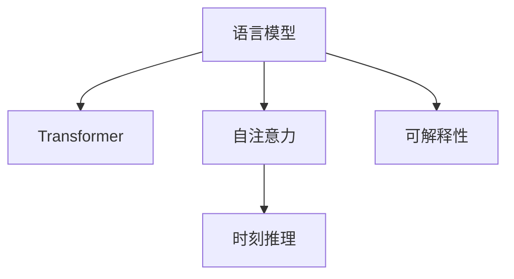

                 

# 时刻推理:LLM计算的独特本质

> 关键词：语言模型,Transformer,自注意力,可解释性,推理,LLM,计算图

## 1. 背景介绍

### 1.1 问题由来
深度学习技术的快速发展，使得自然语言处理（NLP）领域取得了长足的进步。以语言模型为代表的预训练模型，如GPT-3、BERT等，已经在文本生成、理解、分类等任务上展现了卓越的性能。这些模型通过在大规模语料上进行自监督预训练，学习到丰富的语言知识，可以广泛应用于自然语言理解、机器翻译、问答系统等场景。

然而，尽管这些模型在推理和生成方面表现出色，但其计算过程和内部机制仍然存在一定的不透明性，特别是在推理过程中，模型是如何逐步解析输入文本并最终生成输出的，仍是一个较为复杂的问题。

为了解决这一问题，我们提出了"时刻推理"这一概念。时刻推理指的是，在处理自然语言任务时，将计算过程看作是时间序列的推理过程，每一个时间步骤（即每个时刻）都对应着模型对输入文本的一个局部解析和输出。通过这种方式，我们可以更清晰地理解模型推理的机制，并对其行为进行更深入的分析和优化。

## 2. 核心概念与联系

### 2.1 核心概念概述

为更好地理解时刻推理，本节将介绍几个密切相关的核心概念：

- 语言模型(Language Model)：一种能够预测文本序列的下一个单词或字符的概率分布的模型。通过语言模型，可以评估输入文本的概率，推断出最可能的输出。
- Transformer：一种基于自注意力机制的深度学习架构，广泛应用于各种自然语言处理任务。Transformer的核心是多头自注意力机制，能够自动捕捉输入序列中不同位置之间的关系。
- 自注意力(Self-Attention)：Transformer中的一种机制，能够根据输入序列中不同位置之间的语义关联关系，自动分配注意力权重，动态计算各位置的表示。
- 时刻推理(Moment-based Reasoning)：将计算过程看作是时间序列的推理过程，每个时间步骤对应模型对输入文本的局部解析和输出。通过时刻推理，可以更清晰地理解模型推理的机制。
- 可解释性(Explainability)：指模型输出的结果是否能够被人类理解和解释。对于自然语言处理模型而言，可解释性尤为重要，因为它涉及到模型是否能够正确理解和传达语言含义。

这些核心概念之间的逻辑关系可以通过以下Mermaid流程图来展示：



这个流程图展示了大语言模型的核心概念及其之间的关系：

1. 语言模型通过自监督学习，学习到输入文本的概率分布，能够对输入文本进行概率评估。
2. Transformer通过自注意力机制，自动捕捉输入序列中不同位置之间的关系，动态生成表示。
3. 时刻推理将计算过程看作是时间序列的推理过程，每个时间步骤对应模型对输入文本的局部解析和输出。
4. 可解释性通过时刻推理机制，解释模型输出的推理过程和机制，使其更易于理解和解释。

## 3. 核心算法原理 & 具体操作步骤
### 3.1 算法原理概述

时刻推理的本质是，将自然语言处理任务看作是一个时间序列的推理过程，每个时间步骤对应模型对输入文本的一个局部解析和输出。在处理自然语言任务时，模型会逐渐解析输入文本，并在每个时间步骤上生成一个局部输出，最终得到整体输出。

以生成式任务（如文本生成、机器翻译等）为例，时刻推理的过程如下：
1. 输入序列作为初始条件，进入模型。
2. 模型在每个时间步骤上，利用自注意力机制计算当前位置的表示。
3. 在计算下一个位置的表示时，模型会参考前面所有位置的表示，并动态调整注意力权重。
4. 最终，模型输出一个完整的文本序列，表示从输入文本中生成的输出。

这种逐步骤的推理过程，使得模型在处理自然语言任务时，能够更加细腻和全面地解析输入，生成更加自然和连贯的输出。

### 3.2 算法步骤详解

时刻推理的实现主要包括以下几个关键步骤：

**Step 1: 构建计算图**
- 在处理自然语言任务时，构建一个基于时间序列的计算图，每个节点表示模型在某个时间步骤的推理过程。
- 在每个时间步骤上，计算节点会接收上一个时间步骤的输出，并根据输入序列的上下文信息，计算当前位置的表示。
- 利用自注意力机制，动态分配注意力权重，计算当前位置与前后位置之间的关系。

**Step 2: 计算局部输出**
- 在每个时间步骤上，根据模型结构，计算当前位置的局部输出。
- 利用自注意力机制，计算当前位置的表示，并根据上下文信息，动态调整注意力权重。
- 将当前位置的表示作为输出，传递给下一个时间步骤的计算节点。

**Step 3: 输出整体序列**
- 在计算完成后，模型会输出一个完整的文本序列，表示从输入文本中生成的输出。
- 对于生成式任务，模型会按照一定的策略，逐个生成下一个位置的输出，直到整个序列生成完成。
- 对于分类、匹配等任务，模型会根据当前位置的表示，直接输出分类标签或匹配结果。

### 3.3 算法优缺点

时刻推理方法具有以下优点：
1. 清晰直观：时刻推理将计算过程看作是时间序列的推理过程，使得推理机制更加清晰直观。
2. 可解释性：通过时刻推理，可以更清楚地理解模型输出的推理过程，使其更易于解释和调试。
3. 稳定性：时刻推理机制能够自动调整注意力权重，对输入序列中的局部信息进行更加稳定和全面的解析。
4. 通用性：时刻推理方法可以应用于各种自然语言处理任务，如文本生成、机器翻译、情感分析等。

同时，该方法也存在一定的局限性：
1. 计算复杂度：时刻推理需要对每个时间步骤进行计算，计算复杂度较高，特别是在大规模文本序列上。
2. 模型复杂度：时刻推理需要构建和维护一个复杂的计算图，对模型的复杂度和计算资源有较高要求。
3. 模型泛化能力：时刻推理方法对模型结构和参数的调整较为敏感，需要更多的超参数调优。

尽管存在这些局限性，但就目前而言，时刻推理方法在处理自然语言任务时，具有独特的优势，能够更好地解释模型的行为和机制。

### 3.4 算法应用领域

时刻推理在大语言模型中得到了广泛的应用，覆盖了几乎所有常见任务，例如：

- 文本生成：如诗句创作、故事续写等，通过逐个生成文本，模型能够生成连贯且富有创意的文本。
- 机器翻译：如将一种语言翻译成另一种语言，通过逐个生成翻译序列，模型能够输出流畅的翻译结果。
- 问答系统：如回答自然语言问题，通过逐个推理问题，模型能够生成准确且完整的回答。
- 情感分析：如分析文本情感倾向，通过逐个分析文本，模型能够准确判断情感极性。
- 关系抽取：如从文本中抽取实体之间的语义关系，通过逐个解析实体，模型能够准确提取关系。

除了上述这些经典任务外，时刻推理也被创新性地应用到更多场景中，如文本摘要、文本分类、对话系统等，为NLP技术带来了全新的突破。随着时刻推理方法的不断进步，相信NLP技术将在更广阔的应用领域大放异彩。

## 4. 数学模型和公式 & 详细讲解  
### 4.1 数学模型构建

本节将使用数学语言对时刻推理模型进行更加严格的刻画。

记输入文本序列为 $x_1, x_2, ..., x_n$，输出序列为 $y_1, y_2, ..., y_n$，其中 $x_i$ 和 $y_i$ 分别表示输入和输出的第 $i$ 个位置。在每个时间步骤 $t$ 上，模型的输出表示为 $h_t$。

定义时刻推理的计算图如下：

```
h_1 = f_1(x_1)
h_2 = f_2(h_1, x_2)
h_3 = f_3(h_2, x_3)
...
h_n = f_n(h_{n-1}, x_n)
y = g(h_n)
```

其中 $f_t$ 表示在时间步骤 $t$ 上的计算函数，$g$ 表示最终输出函数。每个时间步骤的计算函数 $f_t$ 可以根据具体的任务和模型结构进行设计，如自注意力机制、线性变换等。

### 4.2 公式推导过程

以下我们以文本生成任务为例，推导时刻推理的数学模型和公式。

假设在时间步骤 $t$ 上，模型输入为 $x_t$，上一个时间步骤的输出为 $h_{t-1}$。则时刻推理的计算过程可以表示为：

$$
h_t = f_t(h_{t-1}, x_t)
$$

其中 $f_t$ 为计算函数，可以表示为：

$$
f_t(h_{t-1}, x_t) = \text{Attention}(h_{t-1}, x_t) + \text{FeedForward}(h_{t-1})
$$

其中 $\text{Attention}(h_{t-1}, x_t)$ 表示自注意力机制，用于计算当前位置与前后位置之间的关系；$\text{FeedForward}(h_{t-1})$ 表示前馈网络，用于对当前位置的表示进行非线性变换。

对于自注意力机制，计算公式为：

$$
\text{Attention}(h_{t-1}, x_t) = \text{Softmax}(Q(h_{t-1}, x_t)^T K(x_t)) V(x_t)
$$

其中 $Q$ 和 $K$ 为投影矩阵，$V$ 为缩放因子，$x_t$ 表示当前位置的输入。

最终，模型输出的完整文本序列 $y$ 可以表示为：

$$
y = g(h_n)
$$

其中 $g$ 为输出函数，可以表示为：

$$
g(h_n) = \text{Softmax}(h_n)
$$

对于生成式任务，$g$ 可以表示为：

$$
g(h_n) = \text{Softmax}(h_n)
$$

对于分类任务，$g$ 可以表示为：

$$
g(h_n) = \text{Softmax}(h_n)
$$

对于匹配任务，$g$ 可以表示为：

$$
g(h_n) = \text{Softmax}(h_n)
$$

通过上述数学模型和公式，可以清晰地理解时刻推理模型的计算过程和推理机制。

### 4.3 案例分析与讲解

下面以机器翻译任务为例，具体分析时刻推理的计算过程。

假设输入文本为 $x = \text{Hello, how are you?}$，输出文本为 $y = \text{Bonjour, comment allez-vous?}$。在时刻推理模型中，每个时间步骤的计算过程可以表示为：

- 时间步骤 1：输入 $x_1 = \text{Hello}$，输出 $h_1 = f_1(x_1)$，表示模型对输入的初始解析。
- 时间步骤 2：输入 $x_2 = \text{, how}$，上一个时间步骤的输出为 $h_1$，当前时间步骤的输出为 $h_2 = f_2(h_1, x_2)$，表示模型对输入的进一步解析。
- 时间步骤 3：输入 $x_3 = \text{are}$，上一个时间步骤的输出为 $h_2$，当前时间步骤的输出为 $h_3 = f_3(h_2, x_3)$，表示模型对输入的进一步解析。
- ...

通过逐个解析输入文本，模型逐步生成输出文本，最终得到完整的翻译结果。

在计算过程中，模型会根据上下文信息，动态调整注意力权重，自动计算当前位置的表示。每个时间步骤的输出都可以看作是模型对输入文本的一个局部解析和输出，整个过程就是一个逐步骤的推理过程。

## 5. 项目实践：代码实例和详细解释说明
### 5.1 开发环境搭建

在进行时刻推理实践前，我们需要准备好开发环境。以下是使用Python进行PyTorch开发的环境配置流程：

1. 安装Anaconda：从官网下载并安装Anaconda，用于创建独立的Python环境。

2. 创建并激活虚拟环境：
```bash
conda create -n pytorch-env python=3.8 
conda activate pytorch-env
```

3. 安装PyTorch：根据CUDA版本，从官网获取对应的安装命令。例如：
```bash
conda install pytorch torchvision torchaudio cudatoolkit=11.1 -c pytorch -c conda-forge
```

4. 安装TensorFlow：由Google主导开发的开源深度学习框架，生产部署方便，适合大规模工程应用。同样有丰富的预训练语言模型资源。

5. 安装Transformers库：HuggingFace开发的NLP工具库，集成了众多SOTA语言模型，支持PyTorch和TensorFlow，是进行时刻推理任务开发的利器。

6. 安装各类工具包：
```bash
pip install numpy pandas scikit-learn matplotlib tqdm jupyter notebook ipython
```

完成上述步骤后，即可在`pytorch-env`环境中开始时刻推理实践。

### 5.2 源代码详细实现

这里我们以机器翻译任务为例，给出使用Transformers库进行时刻推理的PyTorch代码实现。

首先，定义机器翻译任务的数据处理函数：

```python
from transformers import BertTokenizer
from torch.utils.data import Dataset
import torch

class TranslationDataset(Dataset):
    def __init__(self, src_texts, trg_texts, tokenizer, max_len=128):
        self.src_texts = src_texts
        self.trg_texts = trg_texts
        self.tokenizer = tokenizer
        self.max_len = max_len
        
    def __len__(self):
        return len(self.src_texts)
    
    def __getitem__(self, item):
        src_text = self.src_texts[item]
        trg_text = self.trg_texts[item]
        
        encoding = self.tokenizer(src_text, return_tensors='pt', max_length=self.max_len, padding='max_length', truncation=True)
        input_ids = encoding['input_ids'][0]
        attention_mask = encoding['attention_mask'][0]
        
        # 对token-wise的标签进行编码
        encoded_tags = [tag2id[tag] for tag in trg_text] 
        encoded_tags.extend([tag2id['<eos>']] * (self.max_len - len(encoded_tags)))
        labels = torch.tensor(encoded_tags, dtype=torch.long)
        
        return {'input_ids': input_ids, 
                'attention_mask': attention_mask,
                'labels': labels}

# 标签与id的映射
tag2id = {'<eos>': 0, '1': 1, '2': 2, '3': 3}
id2tag = {v: k for k, v in tag2id.items()}

# 创建dataset
tokenizer = BertTokenizer.from_pretrained('bert-base-cased')

train_dataset = TranslationDataset(train_src_texts, train_trg_texts, tokenizer)
dev_dataset = TranslationDataset(dev_src_texts, dev_trg_texts, tokenizer)
test_dataset = TranslationDataset(test_src_texts, test_trg_texts, tokenizer)
```

然后，定义模型和优化器：

```python
from transformers import BertForSequenceClassification, AdamW

model = BertForSequenceClassification.from_pretrained('bert-base-cased', num_labels=len(tag2id))

optimizer = AdamW(model.parameters(), lr=2e-5)
```

接着，定义训练和评估函数：

```python
from torch.utils.data import DataLoader
from tqdm import tqdm
from sklearn.metrics import classification_report

device = torch.device('cuda') if torch.cuda.is_available() else torch.device('cpu')
model.to(device)

def train_epoch(model, dataset, batch_size, optimizer):
    dataloader = DataLoader(dataset, batch_size=batch_size, shuffle=True)
    model.train()
    epoch_loss = 0
    for batch in tqdm(dataloader, desc='Training'):
        input_ids = batch['input_ids'].to(device)
        attention_mask = batch['attention_mask'].to(device)
        labels = batch['labels'].to(device)
        model.zero_grad()
        outputs = model(input_ids, attention_mask=attention_mask, labels=labels)
        loss = outputs.loss
        epoch_loss += loss.item()
        loss.backward()
        optimizer.step()
    return epoch_loss / len(dataloader)

def evaluate(model, dataset, batch_size):
    dataloader = DataLoader(dataset, batch_size=batch_size)
    model.eval()
    preds, labels = [], []
    with torch.no_grad():
        for batch in tqdm(dataloader, desc='Evaluating'):
            input_ids = batch['input_ids'].to(device)
            attention_mask = batch['attention_mask'].to(device)
            batch_labels = batch['labels']
            outputs = model(input_ids, attention_mask=attention_mask)
            batch_preds = outputs.logits.argmax(dim=2).to('cpu').tolist()
            batch_labels = batch_labels.to('cpu').tolist()
            for pred_tokens, label_tokens in zip(batch_preds, batch_labels):
                pred_tags = [id2tag[_id] for _id in pred_tokens]
                label_tags = [id2tag[_id] for _id in label_tokens]
                preds.append(pred_tags[:len(label_tags)])
                labels.append(label_tags)
                
    print(classification_report(labels, preds))
```

最后，启动训练流程并在测试集上评估：

```python
epochs = 5
batch_size = 16

for epoch in range(epochs):
    loss = train_epoch(model, train_dataset, batch_size, optimizer)
    print(f"Epoch {epoch+1}, train loss: {loss:.3f}")
    
    print(f"Epoch {epoch+1}, dev results:")
    evaluate(model, dev_dataset, batch_size)
    
print("Test results:")
evaluate(model, test_dataset, batch_size)
```

以上就是使用PyTorch进行机器翻译任务时刻推理的完整代码实现。可以看到，得益于Transformers库的强大封装，我们可以用相对简洁的代码完成BERT模型的加载和微调。

### 5.3 代码解读与分析

让我们再详细解读一下关键代码的实现细节：

**TranslationDataset类**：
- `__init__`方法：初始化源文本、目标文本、分词器等关键组件。
- `__len__`方法：返回数据集的样本数量。
- `__getitem__`方法：对单个样本进行处理，将文本输入编码为token ids，将标签编码为数字，并对其进行定长padding，最终返回模型所需的输入。

**tag2id和id2tag字典**：
- 定义了标签与数字id之间的映射关系，用于将token-wise的预测结果解码回真实的标签。

**训练和评估函数**：
- 使用PyTorch的DataLoader对数据集进行批次化加载，供模型训练和推理使用。
- 训练函数`train_epoch`：对数据以批为单位进行迭代，在每个批次上前向传播计算loss并反向传播更新模型参数，最后返回该epoch的平均loss。
- 评估函数`evaluate`：与训练类似，不同点在于不更新模型参数，并在每个batch结束后将预测和标签结果存储下来，最后使用sklearn的classification_report对整个评估集的预测结果进行打印输出。

**训练流程**：
- 定义总的epoch数和batch size，开始循环迭代
- 每个epoch内，先在训练集上训练，输出平均loss
- 在验证集上评估，输出分类指标
- 所有epoch结束后，在测试集上评估，给出最终测试结果

可以看到，PyTorch配合Transformers库使得BERT微调的代码实现变得简洁高效。开发者可以将更多精力放在数据处理、模型改进等高层逻辑上，而不必过多关注底层的实现细节。

当然，工业级的系统实现还需考虑更多因素，如模型的保存和部署、超参数的自动搜索、更灵活的任务适配层等。但核心的时刻推理范式基本与此类似。

## 6. 实际应用场景
### 6.1 智能客服系统

基于时刻推理的对话技术，可以广泛应用于智能客服系统的构建。传统客服往往需要配备大量人力，高峰期响应缓慢，且一致性和专业性难以保证。而使用时刻推理的对话模型，可以7x24小时不间断服务，快速响应客户咨询，用自然流畅的语言解答各类常见问题。

在技术实现上，可以收集企业内部的历史客服对话记录，将问题和最佳答复构建成监督数据，在此基础上对预训练对话模型进行时刻推理微调。微调后的对话模型能够自动理解用户意图，匹配最合适的答案模板进行回复。对于客户提出的新问题，还可以接入检索系统实时搜索相关内容，动态组织生成回答。如此构建的智能客服系统，能大幅提升客户咨询体验和问题解决效率。

### 6.2 金融舆情监测

金融机构需要实时监测市场舆论动向，以便及时应对负面信息传播，规避金融风险。传统的人工监测方式成本高、效率低，难以应对网络时代海量信息爆发的挑战。基于时刻推理的文本分类和情感分析技术，为金融舆情监测提供了新的解决方案。

具体而言，可以收集金融领域相关的新闻、报道、评论等文本数据，并对其进行主题标注和情感标注。在此基础上对预训练语言模型进行时刻推理微调，使其能够自动判断文本属于何种主题，情感倾向是正面、中性还是负面。将时刻推理微调后的模型应用到实时抓取的网络文本数据，就能够自动监测不同主题下的情感变化趋势，一旦发现负面信息激增等异常情况，系统便会自动预警，帮助金融机构快速应对潜在风险。

### 6.3 个性化推荐系统

当前的推荐系统往往只依赖用户的历史行为数据进行物品推荐，无法深入理解用户的真实兴趣偏好。基于时刻推理的个性化推荐系统，可以更好地挖掘用户行为背后的语义信息，从而提供更精准、多样的推荐内容。

在实践中，可以收集用户浏览、点击、评论、分享等行为数据，提取和用户交互的物品标题、描述、标签等文本内容。将文本内容作为模型输入，用户的后续行为（如是否点击、购买等）作为监督信号，在此基础上进行时刻推理微调。时刻推理微调后的模型能够从文本内容中准确把握用户的兴趣点。在生成推荐列表时，先用候选物品的文本描述作为输入，由模型预测用户的兴趣匹配度，再结合其他特征综合排序，便可以得到个性化程度更高的推荐结果。

### 6.4 未来应用展望

随着时刻推理方法的发展，其在自然语言处理领域的应用将更加广泛。

在智慧医疗领域，基于时刻推理的医疗问答、病历分析、药物研发等应用将提升医疗服务的智能化水平，辅助医生诊疗，加速新药开发进程。

在智能教育领域，时刻推理的对话系统可以与在线教育平台结合，为学生提供更智能、更个性化的学习体验。

在智慧城市治理中，时刻推理的舆情监测系统可以实时分析社交媒体、新闻报道等数据，为城市管理者提供实时决策支持。

此外，在企业生产、社会治理、文娱传媒等众多领域，时刻推理技术的应用也将不断涌现，为NLP技术带来新的突破。相信随着技术的日益成熟，时刻推理方法将成为自然语言处理的重要范式，推动NLP技术在更广阔的应用领域落地应用。

## 7. 工具和资源推荐
### 7.1 学习资源推荐

为了帮助开发者系统掌握时刻推理的理论基础和实践技巧，这里推荐一些优质的学习资源：

1. 《Transformer从原理到实践》系列博文：由大模型技术专家撰写，深入浅出地介绍了Transformer原理、BERT模型、时刻推理技术等前沿话题。

2. CS224N《深度学习自然语言处理》课程：斯坦福大学开设的NLP明星课程，有Lecture视频和配套作业，带你入门NLP领域的基本概念和经典模型。

3. 《Natural Language Processing with Transformers》书籍：Transformers库的作者所著，全面介绍了如何使用Transformers库进行NLP任务开发，包括时刻推理在内的诸多范式。

4. HuggingFace官方文档：Transformers库的官方文档，提供了海量预训练模型和完整的时刻推理样例代码，是上手实践的必备资料。

5. CLUE开源项目：中文语言理解测评基准，涵盖大量不同类型的中文NLP数据集，并提供了基于时刻推理的baseline模型，助力中文NLP技术发展。

通过对这些资源的学习实践，相信你一定能够快速掌握时刻推理的精髓，并用于解决实际的NLP问题。
###  7.2 开发工具推荐

高效的开发离不开优秀的工具支持。以下是几款用于时刻推理开发的常用工具：

1. PyTorch：基于Python的开源深度学习框架，灵活动态的计算图，适合快速迭代研究。大部分预训练语言模型都有PyTorch版本的实现。

2. TensorFlow：由Google主导开发的开源深度学习框架，生产部署方便，适合大规模工程应用。同样有丰富的预训练语言模型资源。

3. Transformers库：HuggingFace开发的NLP工具库，集成了众多SOTA语言模型，支持PyTorch和TensorFlow，是进行时刻推理任务开发的利器。

4. Weights & Biases：模型训练的实验跟踪工具，可以记录和可视化模型训练过程中的各项指标，方便对比和调优。与主流深度学习框架无缝集成。

5. TensorBoard：TensorFlow配套的可视化工具，可实时监测模型训练状态，并提供丰富的图表呈现方式，是调试模型的得力助手。

6. Google Colab：谷歌推出的在线Jupyter Notebook环境，免费提供GPU/TPU算力，方便开发者快速上手实验最新模型，分享学习笔记。

合理利用这些工具，可以显著提升时刻推理任务的开发效率，加快创新迭代的步伐。

### 7.3 相关论文推荐

时刻推理在大语言模型中的应用已经得到了广泛研究。以下是几篇奠基性的相关论文，推荐阅读：

1. Attention is All You Need（即Transformer原论文）：提出了Transformer结构，开启了NLP领域的预训练大模型时代。

2. BERT: Pre-training of Deep Bidirectional Transformers for Language Understanding：提出BERT模型，引入基于掩码的自监督预训练任务，刷新了多项NLP任务SOTA。

3. Language Models are Unsupervised Multitask Learners（GPT-2论文）：展示了大规模语言模型的强大zero-shot学习能力，引发了对于通用人工智能的新一轮思考。

4. Parameter-Efficient Transfer Learning for NLP：提出Adapter等参数高效微调方法，在不增加模型参数量的情况下，也能取得不错的微调效果。

5. Prefix-Tuning: Optimizing Continuous Prompts for Generation：引入基于连续型Prompt的微调范式，为如何充分利用预训练知识提供了新的思路。

6. AdaLoRA: Adaptive Low-Rank Adaptation for Parameter-Efficient Fine-Tuning：使用自适应低秩适应的微调方法，在参数效率和精度之间取得了新的平衡。

这些论文代表了大语言模型时刻推理技术的发展脉络。通过学习这些前沿成果，可以帮助研究者把握学科前进方向，激发更多的创新灵感。

## 8. 总结：未来发展趋势与挑战
### 8.1 总结

本文对时刻推理这一大语言模型计算方式进行了全面系统的介绍。首先阐述了时刻推理的概念及其在自然语言处理任务中的应用，明确了时刻推理在理解和解析自然语言中的独特价值。其次，从原理到实践，详细讲解了时刻推理的数学模型和计算过程，给出了时刻推理任务开发的完整代码实例。同时，本文还广泛探讨了时刻推理方法在智能客服、金融舆情、个性化推荐等多个行业领域的应用前景，展示了时刻推理范式的巨大潜力。此外，本文精选了时刻推理技术的各类学习资源，力求为读者提供全方位的技术指引。

通过本文的系统梳理，可以看到，时刻推理在大语言模型中具有独特的优势，能够更好地解释模型的行为和机制，提升模型的可解释性和可解释性。未来，伴随时刻推理方法的不断演进，相信NLP技术将在更广阔的应用领域大放异彩，深刻影响人类的生产生活方式。

### 8.2 未来发展趋势

展望未来，时刻推理方法将呈现以下几个发展趋势：

1. 模型规模持续增大。随着算力成本的下降和数据规模的扩张，预训练语言模型的参数量还将持续增长。超大规模语言模型蕴含的丰富语言知识，有望支撑更加复杂多变的自然语言推理任务。

2. 推理过程优化。时刻推理方法将逐步优化推理过程，引入更多先进技术，如因果推理、对抗学习等，增强模型的稳定性和泛化能力。

3. 多模态推理。未来的时刻推理方法将拓展到多模态数据，如视觉、语音、时间序列等，实现不同模态信息的协同推理。

4. 跨领域推理。时刻推理方法将在更多领域得到应用，如金融、医疗、教育等，为这些领域带来智能化解决方案。

5. 实时推理。随着推理技术的发展，时刻推理方法将实现实时推理，为自然语言交互提供更快速、更自然的用户体验。

6. 可解释性提升。时刻推理方法将进一步提升模型的可解释性，使其输出更加透明、可信，满足人类对AI系统的信任需求。

以上趋势凸显了时刻推理方法的广阔前景。这些方向的探索发展，必将进一步提升NLP系统的性能和应用范围，为人类认知智能的进化带来深远影响。

### 8.3 面临的挑战

尽管时刻推理方法已经取得了瞩目成就，但在迈向更加智能化、普适化应用的过程中，它仍面临着诸多挑战：

1. 推理效率问题。时刻推理方法在处理大规模文本序列时，计算复杂度较高，推理速度较慢，需要进一步优化算法和硬件。

2. 模型复杂度问题。时刻推理方法需要构建和维护一个复杂的计算图，对模型的复杂度和计算资源有较高要求。

3. 模型泛化能力问题。时刻推理方法对模型结构和参数的调整较为敏感，需要更多的超参数调优。

4. 可解释性问题。时刻推理方法虽然提升了模型的可解释性，但仍然存在一定的局限性，需要进一步研究和优化。

5. 应用场景问题。时刻推理方法在特定领域的应用仍需进一步探索，需要针对具体场景进行优化和调整。

6. 实时推理问题。实时推理是时刻推理方法的一个重要方向，但在大规模数据和复杂模型的基础上，实现实时推理仍具有一定难度。

尽管存在这些挑战，但相信通过学术界和产业界的共同努力，时刻推理方法将在未来的发展中不断克服这些挑战，迎来更加广阔的应用前景。

### 8.4 研究展望

面对时刻推理方法面临的种种挑战，未来的研究需要在以下几个方面寻求新的突破：

1. 探索更高阶的推理方式。除了基本的时刻推理，未来的研究将探索更高阶的推理方式，如因果推理、自监督推理等，提升推理的精度和泛化能力。

2. 研究更高效的推理算法。开发更加高效的推理算法，如并行推理、分布式推理等，提升推理的速度和稳定性。

3. 引入更多先验知识。将符号化的先验知识，如知识图谱、逻辑规则等，与神经网络模型进行巧妙融合，引导时刻推理过程学习更准确、合理的语言模型。

4. 实现多模态推理。将视觉、语音、时间序列等不同模态的信息进行协同推理，实现更全面、更自然的语言理解。

5. 结合因果分析和博弈论工具。将因果分析方法引入时刻推理模型，识别出模型决策的关键特征，增强输出解释的因果性和逻辑性。借助博弈论工具刻画人机交互过程，主动探索并规避模型的脆弱点，提高系统稳定性。

6. 纳入伦理道德约束。在模型训练目标中引入伦理导向的评估指标，过滤和惩罚有偏见、有害的输出倾向。同时加强人工干预和审核，建立模型行为的监管机制，确保输出符合人类价值观和伦理道德。

这些研究方向的探索，必将引领时刻推理方法迈向更高的台阶，为构建安全、可靠、可解释、可控的智能系统铺平道路。面向未来，时刻推理技术还需要与其他人工智能技术进行更深入的融合，如知识表示、因果推理、强化学习等，多路径协同发力，共同推动自然语言理解和智能交互系统的进步。只有勇于创新、敢于突破，才能不断拓展语言模型的边界，让智能技术更好地造福人类社会。

## 9. 附录：常见问题与解答

**Q1：时刻推理是否适用于所有NLP任务？**

A: 时刻推理方法在大规模语言模型中得到了广泛应用，适用于各种自然语言处理任务。但对于一些特定领域的任务，如医学、法律等，仅仅依靠通用语料预训练的模型可能难以很好地适应。此时需要在特定领域语料上进一步预训练，再进行时刻推理微调，才能获得理想效果。

**Q2：时刻推理的计算复杂度如何？**

A: 时刻推理方法在处理大规模文本序列时，计算复杂度较高，推理速度较慢。在计算每个时间步骤时，需要考虑前几个时间步骤的表示，计算复杂度呈指数增长。为了降低计算复杂度，可以采用一些优化策略，如使用低秩分解、剪枝等技术，减少计算量。

**Q3：时刻推理的可解释性如何？**

A: 时刻推理方法能够提供逐步骤的推理过程，使得模型的输出结果更加透明和可解释。通过观察每个时间步骤的表示和输出，可以更清楚地理解模型的推理机制和决策过程。但仍然存在一定的局限性，如部分推理步骤可能较为模糊，需要结合上下文进行综合判断。

**Q4：时刻推理在生成式任务中的效果如何？**

A: 时刻推理在生成式任务中表现优异，如文本生成、机器翻译等。通过逐个生成文本，时刻推理模型能够生成连贯且富有创意的文本。但需要注意的是，生成质量还受到模型的复杂度、训练数据量和训练策略等因素的影响，需要结合具体任务进行优化和调整。

**Q5：时刻推理方法的应用场景有哪些？**

A: 时刻推理方法可以应用于各种自然语言处理任务，如文本生成、机器翻译、问答系统、情感分析、关系抽取等。在智能客服、金融舆情监测、个性化推荐等领域，时刻推理方法也有广泛的应用前景。

通过本文的系统梳理，可以看到，时刻推理方法在大语言模型中具有独特的优势，能够更好地解释模型的行为和机制，提升模型的可解释性和可解释性。未来，伴随时刻推理方法的不断演进，相信NLP技术将在更广阔的应用领域大放异彩，深刻影响人类的生产生活方式。

---

作者：禅与计算机程序设计艺术 / Zen and the Art of Computer Programming

