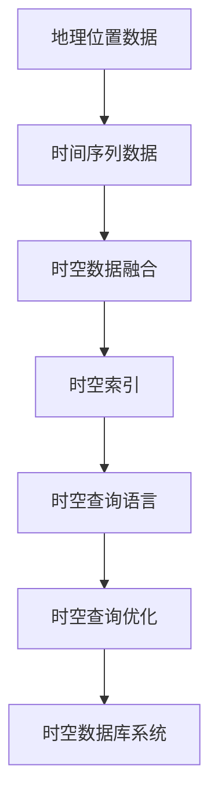

                 

# 时空数据库：管理地理位置和时间数据

> 关键词：时空数据库,地理信息,时间序列,数据建模,查询优化,SQL语言,NoSQL数据库,数据仓库,大数据

## 1. 背景介绍

在现代信息技术飞速发展的背景下，地理位置和时间数据在各领域都扮演着至关重要的角色。无论是城市规划、物流运输、环境监测，还是金融市场、医疗健康、社交媒体，都可以通过这些数据来洞察世界的变化规律，预测未来趋势，优化决策方案。然而，地理位置和时间数据具有时空特性、异构性、复杂性等挑战，使得数据管理和处理变得异常困难。

时空数据库（Spatial-Temporal Database）作为一种专门的数据库系统，旨在解决地理位置和时间数据的复杂管理问题，支持高效、灵活、准确的数据存储和查询。本文将深入探讨时空数据库的核心概念、算法原理、具体操作步骤，以及其应用领域、未来发展趋势与挑战，为读者提供全面、系统的时空数据库知识。

## 2. 核心概念与联系

### 2.1 核心概念概述

时空数据库主要关注以下几个核心概念：

- 地理位置数据（Spatial Data）：包括矢量数据（如点、线、面、多边形等）和栅格数据（如卫星影像、地形图等）。地理位置数据用于描述地表实体的位置关系和形状特征。

- 时间序列数据（Temporal Data）：包括时间戳、时间间隔、时间间隔数据等，用于记录数据在时间维度上的变化趋势和规律。

- 时空数据融合（Spatio-Temporal Data Fusion）：将地理位置和时间数据进行整合，形成时空数据库的核心数据。

- 时空索引（Spatio-Temporal Indexing）：为时空数据构建索引，提高数据查询效率。

- 时空查询语言（Spatio-Temporal Query Language）：支持时空数据的高级查询，如时空关系查询、时空轨迹查询等。

### 2.2 核心概念原理和架构的 Mermaid 流程图



从图中可以看出，时空数据库的构建过程分为三个主要步骤：地理位置数据和时间序列数据的融合、时空索引的构建、以及时空查询语言和查询优化。这些步骤共同构成了时空数据库的核心架构。

## 3. 核心算法原理 & 具体操作步骤

### 3.1 算法原理概述

时空数据库的核心算法原理主要包括以下几个方面：

- 时空数据建模：将地理位置和时间序列数据进行建模，形成时空数据结构。常见的时空数据模型包括：
  - 空间-时间数据模型（Spatial-Temporal Data Model）：用于描述地理位置随时间变化的轨迹。
  - 事件-时间数据模型（Event-Temporal Data Model）：用于描述事件发生的时间序列。

- 时空索引技术：构建时空索引，用于加速时空数据查询。常见的时空索引技术包括：
  - R树索引（R-tree Index）：用于加速空间查询。
  - 时态R树索引（Temporal R-tree Index）：用于加速时空查询。
  - K-D树索引（K-D Tree Index）：用于加速高维空间查询。

- 时空查询优化：针对时空数据的特点，优化查询算法。常见的时空查询优化技术包括：
  - 时空遍历算法：用于加速时空数据的空间查询。
  - 时空索引加速算法：用于加速时空数据的索引构建和查询。
  - 时空查询缓存算法：用于加速时空数据的查询结果缓存。

### 3.2 算法步骤详解

时空数据库的构建过程主要分为以下几个步骤：

**Step 1: 数据采集和预处理**

1. 采集地理位置数据和时间序列数据，包括点、线、面、卫星影像、地形图等。

2. 对数据进行预处理，包括清洗、去重、归一化等，确保数据质量。

**Step 2: 时空数据建模**

1. 将地理位置数据和时间序列数据进行融合，形成时空数据。

2. 选择合适的时空数据模型，如Spatial-Temporal数据模型或Event-Temporal数据模型。

3. 构建时空数据索引，如R树索引、时态R树索引等。

**Step 3: 时空查询优化**

1. 使用时空查询语言，如SQL语言或专门的时空查询语言，进行高级查询。

2. 针对查询结果进行缓存和优化，如使用缓存技术加速查询结果。

**Step 4: 时空查询和分析**

1. 使用时空查询语言，进行时空关系查询、时空轨迹查询等。

2. 分析查询结果，提取时空特征和规律，用于决策和预测。

### 3.3 算法优缺点

时空数据库的主要优点包括：

- 高效性：时空数据库采用时空索引和优化技术，能够快速处理地理位置和时间数据的查询。

- 灵活性：时空数据库支持多种时空数据模型和查询语言，适应不同的应用场景。

- 可扩展性：时空数据库可以处理大规模的时空数据，支持水平和垂直扩展。

- 可维护性：时空数据库具有灵活的数据模型和查询语言，易于维护和升级。

然而，时空数据库也存在一些缺点：

- 复杂性：时空数据库管理的时空数据具有复杂性，需要更高的技术要求和维护成本。

- 存储需求高：时空数据通常具有大体积和高复杂性，需要大量的存储空间。

- 查询复杂度高：时空数据的查询通常需要更复杂的算法和技术支持，查询效率较低。

### 3.4 算法应用领域

时空数据库在多个领域中得到了广泛应用，例如：

- 城市规划和交通管理：通过分析交通流量和路线数据，优化城市交通管理。

- 环境监测和生态保护：通过分析气候和环境数据，评估环境变化和污染程度。

- 医疗健康和疾病监测：通过分析患者和病历数据，预测疾病流行趋势，提高医疗服务水平。

- 金融市场和风险管理：通过分析市场交易和价格数据，预测市场变化和风险，优化投资决策。

- 社交媒体和舆情分析：通过分析用户行为和信息内容，评估舆情变化，提高社会治理水平。

## 4. 数学模型和公式 & 详细讲解 & 举例说明

### 4.1 数学模型构建

时空数据库的数学模型主要包括：

- 时间序列模型（Time Series Model）：用于描述时间数据的变化趋势和规律，如ARIMA模型、季节性ARIMA模型等。

- 空间数据模型（Spatial Data Model）：用于描述地理位置数据的形状和位置关系，如R树索引模型、时态R树索引模型等。

- 时空数据模型（Spatio-Temporal Data Model）：用于描述地理位置随时间变化的轨迹，如时空轨迹模型、时空关系模型等。

### 4.2 公式推导过程

以时空轨迹模型为例，其数学模型可以表示为：

$$
\text{trajectory}(t) = f(\text{location}(t), \text{time}(t))
$$

其中，$location(t)$ 表示地理位置数据，$time(t)$ 表示时间序列数据，$f(\cdot)$ 表示时空融合函数。

### 4.3 案例分析与讲解

假设有一个城市交通流量监测项目，需要管理道路上的车辆和行人的位置信息，并预测未来流量变化。该项目可以使用时空数据库来管理交通流量数据，具体步骤如下：

1. 采集道路上的车辆和行人位置信息，包括时间戳、经纬度等。

2. 将位置信息和时间序列信息进行融合，形成时空数据。

3. 构建时空索引，如R树索引，用于加速位置查询。

4. 使用时空查询语言，如SQL，进行时空关系查询和轨迹查询。

5. 分析查询结果，预测未来交通流量变化，优化城市交通管理。

## 5. 项目实践：代码实例和详细解释说明

### 5.1 开发环境搭建

为了进行时空数据库的实践，我们需要安装并配置好相应的开发环境。以下是一个简单的开发环境搭建步骤：

1. 安装数据库管理系统（如PostgreSQL、MySQL等）。

2. 安装时空数据库相关的库和工具包，如SpatialSQL、GeoServer等。

3. 配置数据库和时空数据库的参数，确保其正常运行。

### 5.2 源代码详细实现

以下是一个使用PostgreSQL进行时空数据管理和查询的示例代码：

```sql
-- 创建时空数据库
CREATE TABLE spatial_temporal_data (
  id SERIAL PRIMARY KEY,
  location GEOMETRY,
  time TIMESTAMP,
  value DOUBLE PRECISION
);

-- 插入时空数据
INSERT INTO spatial_temporal_data (location, time, value)
VALUES ('POINT(10.0 20.0)', '2021-01-01 00:00:00', 10.0);

-- 查询时空数据
SELECT *
FROM spatial_temporal_data
WHERE time BETWEEN '2021-01-01 00:00:00' AND '2021-01-01 06:00:00'
AND location WITHIN ST_GEOGRAPHY_Spheroid('EPSG:4326')((-10.0, -10.0), (10.0, 10.0));
```

### 5.3 代码解读与分析

上述代码实现了时空数据库的基本操作，包括创建时空数据库、插入时空数据和查询时空数据。其中，`location` 和 `time` 分别表示地理位置和时间序列，`value` 表示时空数据的具体值。

在查询操作中，使用了时空查询语言，通过 `ST_GEOGRAPHY_Spheroid` 函数和 `WITHIN` 关键字，实现了时空范围查询。

## 6. 实际应用场景

### 6.1 智能交通

时空数据库在智能交通领域得到了广泛应用，通过分析交通流量和位置信息，优化交通管理，减少拥堵和事故。例如，交通流量监测系统可以通过时空数据库存储和查询交通流量数据，实时监测交通状况，预测交通流量变化，优化交通信号灯控制，提高交通效率。

### 6.2 环境监测

环境监测领域需要使用时空数据库管理气候和环境数据，分析环境变化和污染程度，评估环境质量。例如，空气质量监测系统可以通过时空数据库存储和查询空气质量数据，实时监测空气质量变化，预测污染趋势，优化环保措施。

### 6.3 医疗健康

医疗健康领域需要使用时空数据库管理患者和病历数据，分析疾病流行趋势，提高医疗服务水平。例如，疫情监测系统可以通过时空数据库存储和查询疫情数据，实时监测疫情变化，预测疫情趋势，优化防控措施。

## 7. 工具和资源推荐

### 7.1 学习资源推荐

为了帮助读者系统掌握时空数据库的知识，以下是一些推荐的资源：

1. 《Spatial-Temporal Database Management》书籍：介绍了时空数据库的基本概念、算法原理和应用场景。

2. 《SQL for Spatial and Temporal Data》书籍：详细讲解了如何使用SQL语言进行时空数据的查询和管理。

3. 《Spatio-Temporal Data Mining》课程：介绍了时空数据挖掘和分析的基本方法和技术。

4. 《Spatio-Temporal Data Modeling》论文：介绍了时空数据建模的最新研究成果和应用案例。

### 7.2 开发工具推荐

为了更好地开发时空数据库，以下是一些推荐的工具：

1. PostgreSQL：开源的SQL数据库管理系统，支持时空数据类型和查询语言。

2. GeoServer：开源的空间数据服务器，支持GIS数据的管理和查询。

3. SQL for Spatial and Temporal Data：专门的时空数据查询语言，支持复杂的时空查询。

4. QGIS：开源的GIS工具，支持时空数据的可视化和管理。

### 7.3 相关论文推荐

以下是一些推荐的时空数据库相关的论文：

1. 《Temporal Query Processing for Spatial Databases》：介绍了时空数据库中时间序列数据的查询处理。

2. 《Spatio-Temporal Data Models and Queries》：介绍了时空数据建模和查询的最新研究成果。

3. 《Spatio-Temporal Query Optimization》：介绍了时空查询优化的基本方法和技术。

## 8. 总结：未来发展趋势与挑战

### 8.1 研究成果总结

本文对时空数据库的核心概念、算法原理、操作步骤等进行了详细阐述，探讨了时空数据库在城市规划、交通管理、环境监测、医疗健康等多个领域的应用。时空数据库作为一种高效、灵活的数据库系统，为地理位置和时间数据的复杂管理提供了有力支持。

### 8.2 未来发展趋势

时空数据库的未来发展趋势主要包括以下几个方面：

1. 智能化：引入人工智能和机器学习技术，增强时空数据的分析和预测能力。

2. 自动化：采用自动化技术和工具，简化时空数据库的构建和维护。

3. 分布式：采用分布式数据库技术，支持大规模时空数据的存储和处理。

4. 融合数据：与多种数据源进行融合，增强时空数据的丰富性和多样性。

### 8.3 面临的挑战

尽管时空数据库已经取得了一定的成果，但仍然面临以下挑战：

1. 复杂性：时空数据具有复杂性，需要更高的技术要求和维护成本。

2. 存储需求高：时空数据通常具有大体积和高复杂性，需要大量的存储空间。

3. 查询复杂度高：时空数据的查询通常需要更复杂的算法和技术支持，查询效率较低。

### 8.4 研究展望

未来，时空数据库的研究方向主要包括以下几个方面：

1. 智能时空数据管理：引入人工智能和机器学习技术，增强时空数据的分析和预测能力。

2. 自动化时空数据建模：采用自动化技术和工具，简化时空数据库的构建和维护。

3. 分布式时空数据存储：采用分布式数据库技术，支持大规模时空数据的存储和处理。

4. 融合多源时空数据：与多种数据源进行融合，增强时空数据的丰富性和多样性。

总之，时空数据库在地理位置和时间数据的复杂管理中发挥着至关重要的作用，未来需要更多新技术的引入和实践，才能更好地支持复杂的时空数据管理和应用。

## 9. 附录：常见问题与解答

**Q1: 时空数据库如何处理大规模时空数据？**

A: 时空数据库可以采用分布式存储技术，将大规模时空数据分散存储在多个节点上，提高数据处理能力和查询效率。

**Q2: 时空数据库如何优化时空查询？**

A: 时空数据库可以采用时空查询语言，如SQL for Spatial and Temporal Data，进行复杂的时空查询优化。

**Q3: 时空数据库如何处理位置数据的不确定性？**

A: 时空数据库可以采用模糊查询和近似查询技术，处理位置数据的不确定性和模糊性，提高查询精度和效率。

**Q4: 时空数据库如何处理时间数据的时变性？**

A: 时空数据库可以采用时态数据模型，处理时间数据的时变性和时态关系，支持时间序列分析和预测。

---

作者：禅与计算机程序设计艺术 / Zen and the Art of Computer Programming

