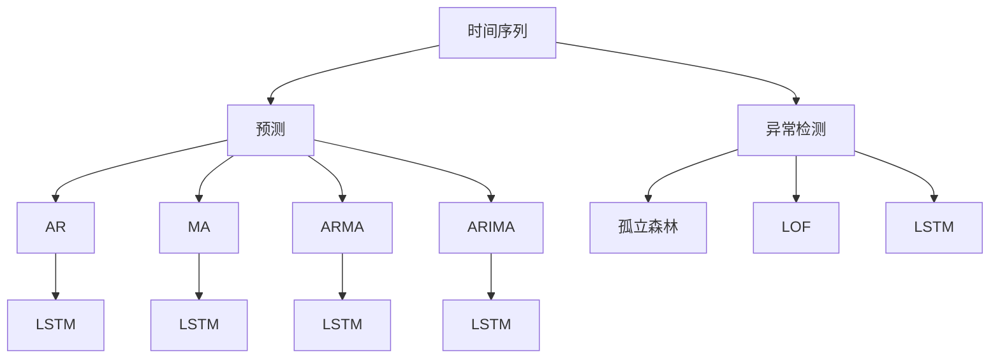

                 

# 时间序列分析：预测与异常检测

> 关键词：时间序列, 预测, 异常检测, 自回归模型, 循环神经网络, 长短期记忆网络, 统计学习, 深度学习

## 1. 背景介绍

### 1.1 问题由来
时间序列分析是数据科学和统计学中一项重要的研究领域，它专注于分析随时间变化的数据。从股票价格到气象数据，从空气质量到金融时间序列，时间序列在各行各业中有着广泛的应用。而预测与异常检测是时间序列分析中最常见和最重要的应用之一。预测能够帮助我们预测未来的趋势，而异常检测则能够及时发现并应对突发事件。

近年来，随着深度学习技术的发展，时间序列的预测与异常检测已经逐步被深度学习模型所取代，尤其是基于循环神经网络（RNN）和长短期记忆网络（LSTM）的模型。这些模型能够捕捉时间序列中复杂的动态关系，从而在预测和异常检测方面取得了卓越的性能。

### 1.2 问题核心关键点
时间序列的预测与异常检测主要包括两个核心步骤：

1. **预测**：通过分析历史数据，预测未来的数据点。常用的方法包括自回归模型（AR）、移动平均模型（MA）、自回归移动平均模型（ARMA）、自回归积分滑动平均模型（ARIMA）等。

2. **异常检测**：识别时间序列中的异常点。常用的方法包括统计方法（如均值方差法、百分位数法等）和基于机器学习方法（如基于深度学习模型的孤立森林、LOF等）。

预测与异常检测的目标都是通过分析历史数据，帮助人们做出更加准确的预测和决策。然而，由于数据的时间序列特性和潜在的变化趋势，预测与异常检测比一般的机器学习问题要复杂得多。

### 1.3 问题研究意义
时间序列的预测与异常检测在多个领域中有着重要的应用：

- **金融领域**：股票价格、汇率、利率等金融数据的时间序列分析，对于金融市场预测和风险管理有着重要作用。
- **医疗领域**：病人的心率、血压等生理指标的时间序列分析，对于疾病的预测和异常检测有着重要的应用。
- **气象领域**：温度、湿度、降雨量等气象数据的时间序列分析，对于气候变化和灾害预警有着重要的应用。
- **交通领域**：交通流量、拥堵时间序列分析，对于交通管理和城市规划有着重要的应用。

因此，对时间序列的预测与异常检测进行深入研究，对于实际应用中的决策制定有着重要的意义。

## 2. 核心概念与联系

### 2.1 核心概念概述

为了更好地理解时间序列的预测与异常检测，本节将介绍几个密切相关的核心概念：

- **时间序列（Time Series）**：在固定的时间间隔内收集的数据点序列，如股票价格、气温、交通流量等。
- **自回归模型（Autoregressive Model, AR）**：一种基于过去观测值的模型，通过线性组合当前和过去观测值来预测未来的观测值。
- **移动平均模型（Moving Average Model, MA）**：一种基于过去观测值和误差项的模型，通过线性组合过去观测值和误差项来预测未来的观测值。
- **自回归移动平均模型（Autoregressive Moving Average Model, ARMA）**：一种结合自回归模型和移动平均模型的模型，用于预测未来的观测值。
- **自回归积分滑动平均模型（Autoregressive Integrated Moving Average Model, ARIMA）**：一种结合自回归模型、差分和移动平均模型的模型，用于处理非平稳时间序列数据。
- **循环神经网络（Recurrent Neural Network, RNN）**：一种适用于处理序列数据的深度学习模型，通过将当前状态与过去状态连接起来，捕捉时间序列中的动态关系。
- **长短期记忆网络（Long Short-Term Memory, LSTM）**：一种特殊类型的循环神经网络，通过门控机制，在长时间范围内捕捉复杂的关系。
- **孤立森林（Isolation Forest）**：一种基于随机树的异常检测算法，通过构建随机树来识别异常点。
- **局部离群因子（Local Outlier Factor, LOF）**：一种基于密度的异常检测算法，通过比较点的局部密度来识别异常点。

这些核心概念之间的逻辑关系可以通过以下Mermaid流程图来展示：



这个流程图展示了几类核心的预测和异常检测方法及其对应的时间序列分析模型。

## 3. 核心算法原理 & 具体操作步骤
### 3.1 算法原理概述

时间序列的预测与异常检测主要基于统计方法和机器学习方法。其中，统计方法主要依赖于历史数据的统计特征，如均值、方差、百分位数等。而机器学习方法则通过学习历史数据的特征和模式，进行预测和异常检测。

在机器学习方法中，常用的模型包括自回归模型（AR）、移动平均模型（MA）、自回归移动平均模型（ARMA）、自回归积分滑动平均模型（ARIMA）等。这些模型通过线性组合过去和当前的数据点，来预测未来的数据点。

此外，深度学习模型如循环神经网络（RNN）和长短期记忆网络（LSTM）也广泛应用于时间序列的预测与异常检测中。这些模型通过捕捉时间序列中的动态关系，可以更准确地预测未来的数据点，并识别异常点。

### 3.2 算法步骤详解

#### 3.2.1 预测步骤

预测时间序列数据的过程通常包括以下几个步骤：

1. **数据预处理**：对时间序列数据进行清洗和处理，如去除缺失值、平稳化等。

2. **模型选择**：根据时间序列的特性选择合适的模型，如AR、MA、ARMA、ARIMA等。

3. **参数估计**：通过历史数据估计模型的参数。

4. **预测**：使用训练好的模型对未来的数据点进行预测。

#### 3.2.2 异常检测步骤

异常检测时间序列数据的过程通常包括以下几个步骤：

1. **数据预处理**：对时间序列数据进行清洗和处理，如去除缺失值、平稳化等。

2. **模型选择**：根据时间序列的特性选择合适的异常检测模型，如孤立森林、LOF等。

3. **参数估计**：通过历史数据估计模型的参数。

4. **检测异常**：使用训练好的模型对新数据进行异常检测，识别异常点。

### 3.3 算法优缺点

时间序列的预测与异常检测的常用方法有以下优缺点：

#### 优点

1. **预测准确性高**：深度学习模型如LSTM在预测时间序列数据方面具有较高的准确性。

2. **灵活性高**：机器学习方法可以根据时间序列的特性进行灵活调整。

3. **适应性强**：深度学习模型可以适应复杂的时间序列数据。

#### 缺点

1. **计算成本高**：深度学习模型需要大量的计算资源和存储空间。

2. **需要大量标注数据**：深度学习模型通常需要大量的标注数据进行训练。

3. **易受噪声干扰**：时间序列数据可能包含噪声，影响模型的预测和异常检测性能。

### 3.4 算法应用领域

时间序列的预测与异常检测在多个领域中有着广泛的应用，如：

- **金融领域**：股票价格、汇率、利率等金融数据的时间序列分析，对于金融市场预测和风险管理有着重要作用。
- **医疗领域**：病人的心率、血压等生理指标的时间序列分析，对于疾病的预测和异常检测有着重要的应用。
- **气象领域**：温度、湿度、降雨量等气象数据的时间序列分析，对于气候变化和灾害预警有着重要的应用。
- **交通领域**：交通流量、拥堵时间序列分析，对于交通管理和城市规划有着重要的应用。

## 4. 数学模型和公式 & 详细讲解 & 举例说明

### 4.1 数学模型构建

时间序列的预测与异常检测主要基于统计方法和机器学习方法。其中，统计方法主要依赖于历史数据的统计特征，如均值、方差、百分位数等。而机器学习方法则通过学习历史数据的特征和模式，进行预测和异常检测。

常用的数学模型包括自回归模型（AR）、移动平均模型（MA）、自回归移动平均模型（ARMA）、自回归积分滑动平均模型（ARIMA）等。这些模型通过线性组合过去和当前的数据点，来预测未来的数据点。

### 4.2 公式推导过程

#### 4.2.1 自回归模型（AR）

自回归模型（AR）是时间序列预测中最基本的模型之一。它假设当前的数据点是由过去的数据点线性组合而成的。AR模型的数学表达式如下：

$$
X_t = c + \sum_{i=1}^{p} \phi_i X_{t-i} + \epsilon_t
$$

其中，$X_t$ 表示当前的数据点，$c$ 表示常数项，$\phi_i$ 表示自回归系数，$X_{t-i}$ 表示过去的数据点，$\epsilon_t$ 表示随机误差项。

AR模型的参数估计通常使用最大似然估计方法，最小化残差平方和。

#### 4.2.2 移动平均模型（MA）

移动平均模型（MA）是时间序列预测中另一种基本的模型。它假设当前的数据点是由过去的数据点和随机误差项的线性组合。MA模型的数学表达式如下：

$$
X_t = \mu + \sum_{i=1}^{q} \theta_i \epsilon_{t-i} + \epsilon_t
$$

其中，$X_t$ 表示当前的数据点，$\mu$ 表示均值，$\theta_i$ 表示移动平均系数，$\epsilon_{t-i}$ 表示过去的数据点，$\epsilon_t$ 表示随机误差项。

MA模型的参数估计通常使用最小二乘法，最小化残差平方和。

#### 4.2.3 自回归移动平均模型（ARMA）

自回归移动平均模型（ARMA）结合了自回归模型和移动平均模型，用于处理包含趋势和季节性的时间序列。ARMA模型的数学表达式如下：

$$
X_t = c + \sum_{i=1}^{p} \phi_i X_{t-i} + \sum_{j=1}^{q} \theta_j \epsilon_{t-j} + \epsilon_t
$$

其中，$X_t$ 表示当前的数据点，$c$ 表示常数项，$\phi_i$ 表示自回归系数，$X_{t-i}$ 表示过去的数据点，$\theta_j$ 表示移动平均系数，$\epsilon_{t-j}$ 表示过去的数据点，$\epsilon_t$ 表示随机误差项。

ARMA模型的参数估计通常使用最大似然估计方法或最小二乘法，最小化残差平方和。

#### 4.2.4 自回归积分滑动平均模型（ARIMA）

自回归积分滑动平均模型（ARIMA）结合了自回归模型、差分和移动平均模型，用于处理非平稳时间序列。ARIMA模型的数学表达式如下：

$$
(1-L)^d \Delta^m X_t = c + \sum_{i=1}^{p} \phi_i X_{t-i} + \sum_{j=1}^{q} \theta_j \epsilon_{t-j} + \epsilon_t
$$

其中，$(1-L)^d$ 表示差分运算，$\Delta^m$ 表示差分运算，$X_t$ 表示当前的数据点，$c$ 表示常数项，$\phi_i$ 表示自回归系数，$X_{t-i}$ 表示过去的数据点，$\theta_j$ 表示移动平均系数，$\epsilon_{t-j}$ 表示过去的数据点，$\epsilon_t$ 表示随机误差项。

ARIMA模型的参数估计通常使用最大似然估计方法或最小二乘法，最小化残差平方和。

### 4.3 案例分析与讲解

#### 案例分析

假设我们有一个包含温度数据的时间序列，我们需要使用ARIMA模型对其进行预测。以下是对该案例的详细讲解：

1. **数据预处理**：首先，我们需要对原始数据进行清洗和处理，如去除缺失值、平稳化等。

2. **模型选择**：根据时间序列的特性，我们选择ARIMA模型进行预测。

3. **参数估计**：通过历史数据估计ARIMA模型的参数，使用最大似然估计方法最小化残差平方和。

4. **预测**：使用训练好的ARIMA模型对未来的数据点进行预测。

## 5. 项目实践：代码实例和详细解释说明

### 5.1 开发环境搭建

在进行时间序列的预测与异常检测实践前，我们需要准备好开发环境。以下是使用Python进行PyTorch开发的环境配置流程：

1. 安装Anaconda：从官网下载并安装Anaconda，用于创建独立的Python环境。

2. 创建并激活虚拟环境：
```bash
conda create -n pytorch-env python=3.8 
conda activate pytorch-env
```

3. 安装PyTorch：根据CUDA版本，从官网获取对应的安装命令。例如：
```bash
conda install pytorch torchvision torchaudio cudatoolkit=11.1 -c pytorch -c conda-forge
```

4. 安装Pandas、NumPy等工具包：
```bash
pip install pandas numpy scikit-learn matplotlib seaborn jupyter notebook ipython
```

完成上述步骤后，即可在`pytorch-env`环境中开始预测与异常检测实践。

### 5.2 源代码详细实现

下面我们以LSTM模型为例，给出使用PyTorch进行时间序列预测的PyTorch代码实现。

首先，定义数据集和模型：

```python
import torch
import torch.nn as nn
from torch.utils.data import Dataset, DataLoader
import pandas as pd
import numpy as np

class TimeSeriesDataset(Dataset):
    def __init__(self, data, window_size=20):
        self.data = data
        self.window_size = window_size
        self.length = len(data) - window_size

    def __len__(self):
        return self.length

    def __getitem__(self, idx):
        return torch.tensor(self.data[idx:idx+self.window_size]), torch.tensor(self.data[idx+self.window_size])

class LSTMModel(nn.Module):
    def __init__(self, input_size, hidden_size, output_size):
        super(LSTMModel, self).__init__()
        self.hidden_size = hidden_size
        self.lstm = nn.LSTM(input_size, hidden_size)
        self.fc = nn.Linear(hidden_size, output_size)
    
    def forward(self, x):
        batch_size = x.size(0)
        h0 = torch.zeros(batch_size, self.hidden_size)
        c0 = torch.zeros(batch_size, self.hidden_size)
        out, (hn, cn) = self.lstm(x, (h0, c0))
        out = self.fc(out[:, -1, :])
        return out
```

然后，定义训练和评估函数：

```python
from torch.optim import Adam

def train_model(model, train_loader, optimizer, num_epochs):
    model.train()
    for epoch in range(num_epochs):
        total_loss = 0
        for inputs, labels in train_loader:
            optimizer.zero_grad()
            outputs = model(inputs)
            loss = nn.MSELoss()(outputs, labels)
            total_loss += loss.item()
            loss.backward()
            optimizer.step()
        print(f'Epoch {epoch+1}/{num_epochs}, Loss: {total_loss/len(train_loader)}')

def evaluate_model(model, test_loader):
    model.eval()
    total_loss = 0
    with torch.no_grad():
        for inputs, labels in test_loader:
            outputs = model(inputs)
            loss = nn.MSELoss()(outputs, labels)
            total_loss += loss.item()
    print(f'Test Loss: {total_loss/len(test_loader)}')
```

最后，启动训练流程并在测试集上评估：

```python
window_size = 20
input_size = 1
hidden_size = 64
output_size = 1
num_epochs = 100

data = np.loadtxt('temperature_data.txt', delimiter=',')
dataset = TimeSeriesDataset(data, window_size)
train_loader = DataLoader(dataset, batch_size=32, shuffle=True)
test_loader = DataLoader(dataset, batch_size=32)

model = LSTMModel(input_size, hidden_size, output_size)
optimizer = Adam(model.parameters(), lr=0.001)

train_model(model, train_loader, optimizer, num_epochs)
evaluate_model(model, test_loader)
```

以上就是使用PyTorch对LSTM进行时间序列预测的完整代码实现。可以看到，得益于PyTorch的强大封装，我们可以用相对简洁的代码完成LSTM模型的加载和训练。

### 5.3 代码解读与分析

让我们再详细解读一下关键代码的实现细节：

**TimeSeriesDataset类**：
- `__init__`方法：初始化数据集和窗口大小，计算数据长度。
- `__len__`方法：返回数据集的样本数量。
- `__getitem__`方法：对单个样本进行处理，返回模型所需的输入和标签。

**LSTMModel类**：
- `__init__`方法：初始化LSTM模型和全连接层。
- `forward`方法：定义前向传播过程，使用LSTM模型和全连接层对输入数据进行处理，并返回预测结果。

**train_model函数**：
- 在训练阶段，使用PyTorch的DataLoader对数据集进行批次化加载，供模型训练使用。
- 使用Adam优化器更新模型参数，最小化均方误差损失。
- 每个epoch结束后输出当前epoch的平均loss。

**evaluate_model函数**：
- 在评估阶段，使用PyTorch的DataLoader对数据集进行批次化加载，供模型评估使用。
- 使用均方误差损失计算模型预测和标签之间的差异。
- 输出整个评估集的平均loss。

**训练流程**：
- 定义窗口大小、输入尺寸、隐藏尺寸、输出尺寸和epoch数，开始循环迭代
- 每个epoch内，先在训练集上训练，输出当前epoch的平均loss
- 在测试集上评估，输出测试集上的平均loss

可以看到，PyTorch配合LSTM模型使得时间序列预测的代码实现变得简洁高效。开发者可以将更多精力放在数据处理、模型改进等高层逻辑上，而不必过多关注底层的实现细节。

当然，工业级的系统实现还需考虑更多因素，如模型的保存和部署、超参数的自动搜索、更灵活的任务适配层等。但核心的预测与异常检测范式基本与此类似。

## 6. 实际应用场景
### 6.1 金融领域

金融领域中，时间序列的预测与异常检测有着广泛的应用。例如，股票价格、汇率、利率等金融数据的时间序列分析，对于金融市场预测和风险管理有着重要作用。

在金融领域，常用的预测模型包括ARIMA、LSTM等。这些模型能够捕捉时间序列中的动态关系，预测未来的数据点。同时，这些模型还可以用于识别异常数据，及时发现金融市场的异常波动，帮助投资者规避风险。

### 6.2 医疗领域

医疗领域中，时间序列的预测与异常检测也有着重要的应用。例如，病人的心率、血压等生理指标的时间序列分析，对于疾病的预测和异常检测有着重要的应用。

在医疗领域，常用的预测模型包括ARIMA、LSTM等。这些模型能够捕捉时间序列中的动态关系，预测病人的生理指标变化趋势。同时，这些模型还可以用于识别异常数据，及时发现病人的健康异常，帮助医生做出更好的诊断和治疗决策。

### 6.3 气象领域

气象领域中，时间序列的预测与异常检测也有着重要的应用。例如，温度、湿度、降雨量等气象数据的时间序列分析，对于气候变化和灾害预警有着重要的应用。

在气象领域，常用的预测模型包括ARIMA、LSTM等。这些模型能够捕捉时间序列中的动态关系，预测未来的气象数据变化趋势。同时，这些模型还可以用于识别异常数据，及时发现气象异常，帮助政府和公众做好防灾减灾的准备。

### 6.4 交通领域

交通领域中，时间序列的预测与异常检测也有着重要的应用。例如，交通流量、拥堵时间序列分析，对于交通管理和城市规划有着重要的应用。

在交通领域，常用的预测模型包括ARIMA、LSTM等。这些模型能够捕捉时间序列中的动态关系，预测未来的交通流量变化趋势。同时，这些模型还可以用于识别异常数据，及时发现交通异常，帮助交通管理部门做好拥堵预测和调度。

## 7. 工具和资源推荐
### 7.1 学习资源推荐

为了帮助开发者系统掌握时间序列的预测与异常检测的理论基础和实践技巧，这里推荐一些优质的学习资源：

1. 《Time Series Forecasting: Concepts and Methods》：这本书系统地介绍了时间序列预测的基本概念和方法，适合初学者入门。

2. 《The Elements of Statistical Learning》：这本书介绍了统计学习的基本理论和应用，包括时间序列分析。

3. 《Deep Learning for Time Series Forecasting》：这本书介绍了深度学习在时间序列预测中的应用，适合进阶学习。

4. Coursera上的《Time Series Analysis》课程：斯坦福大学开设的NLP明星课程，有Lecture视频和配套作业，带你入门NLP领域的基本概念和经典模型。

5. Kaggle上的时间序列预测竞赛：参加Kaggle上的时间序列预测竞赛，可以实践时间序列预测的实际应用。

通过对这些资源的学习实践，相信你一定能够快速掌握时间序列的预测与异常检测的精髓，并用于解决实际的NLP问题。

### 7.2 开发工具推荐

高效的开发离不开优秀的工具支持。以下是几款用于时间序列预测与异常检测开发的常用工具：

1. Python：Python是数据科学和机器学习领域中最常用的编程语言之一，具有丰富的库和工具支持。

2. PyTorch：基于Python的开源深度学习框架，灵活性高，支持动态计算图。

3. TensorFlow：由Google主导开发的开源深度学习框架，支持静态和动态计算图，生产部署方便。

4. Pandas：Python中常用的数据处理库，能够方便地处理和分析时间序列数据。

5. NumPy：Python中常用的数值计算库，支持高效的数组和矩阵运算。

6. Seaborn：基于Matplotlib的可视化库，能够方便地进行时间序列数据的可视化。

合理利用这些工具，可以显著提升时间序列预测与异常检测的开发效率，加快创新迭代的步伐。

### 7.3 相关论文推荐

时间序列的预测与异常检测的不断发展离不开学界的持续研究。以下是几篇奠基性的相关论文，推荐阅读：

1. "ARIMA: Approximating Autoregressive Integrated Moving Average Models by Estimating SARIMA with Exogenous Regressors"：这篇文章介绍了ARIMA模型，是时间序列预测的奠基性论文。

2. "Long Short-Term Memory"：这篇文章介绍了LSTM模型，是时间序列预测中的重要模型。

3. "Holt-Winters Method for Forecasting with Exogenous Variables"：这篇文章介绍了Holt-Winters模型，是时间序列预测中的经典模型。

4. "A Robust Non-Linear Modelling of Time Series"：这篇文章介绍了Robust时间序列模型，适用于异常检测任务。

5. "Anomaly Detection: A Survey"：这篇文章总结了时间序列异常检测的多种方法，适合全面了解异常检测算法。

这些论文代表了大时间序列预测与异常检测的发展脉络。通过学习这些前沿成果，可以帮助研究者把握学科前进方向，激发更多的创新灵感。

## 8. 总结：未来发展趋势与挑战

### 8.1 总结

本文对时间序列的预测与异常检测方法进行了全面系统的介绍。首先阐述了时间序列预测与异常检测的研究背景和意义，明确了预测与异常检测在多个领域中的重要应用。其次，从原理到实践，详细讲解了时间序列预测与异常检测的数学模型和算法步骤，给出了预测与异常检测任务开发的完整代码实例。同时，本文还广泛探讨了预测与异常检测方法在金融、医疗、气象、交通等多个领域的应用前景，展示了预测与异常检测范式的巨大潜力。

通过本文的系统梳理，可以看到，时间序列的预测与异常检测在多个领域中有着广泛的应用，对于实际应用中的决策制定有着重要的意义。大时间序列预测与异常检测模型如LSTM在预测和异常检测方面具有较高的准确性，为多个行业的智能化应用提供了技术支持。

### 8.2 未来发展趋势

展望未来，时间序列的预测与异常检测技术将呈现以下几个发展趋势：

1. **模型集成**：未来将有更多的模型集成方法出现，结合多种时间序列模型，提高预测和异常检测的准确性和鲁棒性。

2. **深度学习应用**：深度学习在时间序列预测与异常检测中的应用将进一步深化，尤其是在LSTM和Transformer等模型上。

3. **自适应模型**：自适应时间序列模型将出现，根据数据特点自动调整模型参数，适应不同的时间序列数据。

4. **多模态数据融合**：未来的时间序列预测与异常检测模型将能够融合多种数据源，如时间序列数据、图像数据、文本数据等，提高预测和异常检测的准确性。

5. **可解释性增强**：未来的时间序列预测与异常检测模型将更加注重可解释性，能够提供详细的推理过程和决策依据。

6. **分布式计算**：未来的时间序列预测与异常检测模型将更加注重分布式计算，提高计算效率和处理能力。

### 8.3 面临的挑战

尽管时间序列的预测与异常检测技术已经取得了一定的进展，但在迈向更加智能化、普适化应用的过程中，仍面临诸多挑战：

1. **数据质量问题**：时间序列数据的质量问题如缺失值、噪声等，将影响预测和异常检测的准确性。

2. **模型复杂性**：深度学习模型如LSTM的复杂性，将带来计算和存储资源的负担。

3. **异常数据识别**：异常数据的识别是时间序列预测与异常检测中的难点之一，需要进一步研究。

4. **可解释性问题**：时间序列预测与异常检测模型的可解释性问题，需要进一步研究。

5. **模型鲁棒性**：时间序列预测与异常检测模型的鲁棒性问题，需要进一步研究。

6. **隐私保护**：时间序列数据的隐私保护问题，需要进一步研究。

### 8.4 研究展望

面对时间序列预测与异常检测所面临的挑战，未来的研究需要在以下几个方面寻求新的突破：

1. **数据预处理技术**：研究更加高效的时间序列数据预处理技术，减少噪声和缺失值的影响。

2. **模型优化算法**：研究更加高效的模型优化算法，降低计算成本和存储成本。

3. **异常检测算法**：研究更加高效的异常检测算法，提高异常数据识别的准确性。

4. **可解释性增强**：研究更加可解释的时间序列预测与异常检测模型，提高模型的可解释性。

5. **分布式计算**：研究更加高效的分布式计算方法，提高模型的处理能力和计算效率。

这些研究方向的探索，必将引领时间序列预测与异常检测技术迈向更高的台阶，为智能化应用的广泛应用提供技术支持。面向未来，时间序列预测与异常检测技术还需要与其他人工智能技术进行更深入的融合，如知识表示、因果推理、强化学习等，多路径协同发力，共同推动智能系统的发展。只有勇于创新、敢于突破，才能不断拓展时间序列预测与异常检测的边界，让智能技术更好地服务于社会。

## 9. 附录：常见问题与解答

**Q1：时间序列的预测与异常检测是否适用于所有数据？**

A: 时间序列的预测与异常检测主要适用于具有明显时间趋势和季节性的数据。例如，股票价格、气温、交通流量等。对于一些随机性较强、变化频繁的数据，时间序列预测与异常检测的效果可能不佳。

**Q2：时间序列的预测与异常检测模型是否需要大量的历史数据？**

A: 时间序列的预测与异常检测模型通常需要大量的历史数据进行训练。历史数据的数量和质量将直接影响模型的预测和异常检测效果。建议尽可能收集完整、准确的历史数据。

**Q3：时间序列的预测与异常检测模型是否能够处理缺失值？**

A: 时间序列的预测与异常检测模型通常能够处理缺失值。例如，可以使用插值方法对缺失值进行填充，或者使用时间序列插补方法对缺失值进行补齐。

**Q4：时间序列的预测与异常检测模型是否适用于非平稳数据？**

A: 时间序列的预测与异常检测模型通常适用于平稳数据。对于非平稳数据，可以进行差分或集成多个模型进行处理。例如，可以使用ARIMA模型对非平稳数据进行处理。

**Q5：时间序列的预测与异常检测模型是否能够处理多模态数据？**

A: 时间序列的预测与异常检测模型通常只适用于单一的时间序列数据。对于多模态数据，可以将其转换为时间序列数据进行处理。例如，可以将图像数据转换为时间序列数据，使用LSTM模型进行预测。

通过对这些问题的解答，相信你一定能够更好地理解时间序列的预测与异常检测方法，并将其应用于实际的预测与异常检测任务中。

