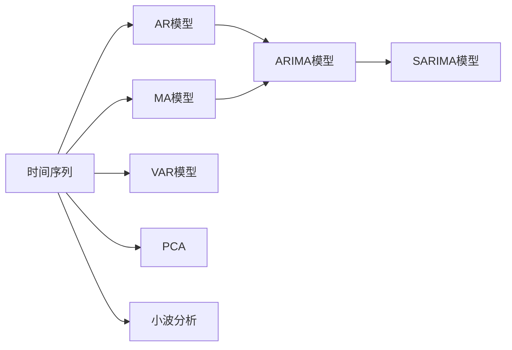

                 

## 1. 背景介绍

时间序列分析（Time Series Analysis）是统计分析中极为重要的一环，用于描述时间维度上的数据变化。时间序列分析广泛应用在金融、气象、经济等领域，对历史数据进行分析，以预测未来趋势并检测异常现象。

本文将系统介绍时间序列分析的各个方面，包括基本原理、数学模型、常见方法及其实现，并结合具体案例进行深入探讨。同时，也将从时间序列的预测和异常检测两个核心任务出发，阐述其理论基础和应用实践，为读者提供全面的学习指导。

## 2. 核心概念与联系

### 2.1 核心概念概述

为深入理解时间序列分析，我们将首先介绍一些核心概念：

- **时间序列**：指按时间顺序排列的一系列数据点，通常表示连续时间间隔上某一变量或现象的观测值。例如股票价格、气温变化、网站流量等。

- **自回归模型（AR）**：一种基于过去观测值来预测未来观测值的方法，常用于时间序列的建模和预测。

- **移动平均模型（MA）**：利用移动平均来平滑时间序列数据，常用于去除序列中的周期性成分。

- **自回归移动平均模型（ARMA）**：结合了AR和MA模型的优点，广泛用于对具有周期性和趋势性数据进行建模和预测。

- **自回归积分移动平均模型（ARIMA）**：ARMA模型的扩展，增加了差分运算，用于处理具有明显季节性或趋势性的时间序列。

- **季节性自回归积分移动平均模型（SARIMA）**：ARIMA模型针对季节性时间序列的扩展，具有季节性差分操作。

- **向量自回归模型（VAR）**：用于多变量时间序列的建模，分析变量间的相互关系。

- **主成分分析（PCA）**：通过线性变换将高维数据转换为低维数据，常用于时间序列数据的降维和特征提取。

- **小波分析**：一种时频分析方法，将信号分解成不同频率子信号，常用于时间序列数据的频谱分析。

这些核心概念之间存在紧密的联系，通过不同的模型和算法，可以相互组合，适应不同类型的时间序列数据。

### 2.2 核心概念原理和架构的 Mermaid 流程图



## 3. 核心算法原理 & 具体操作步骤

### 3.1 算法原理概述

时间序列分析的核心在于建立模型，利用历史数据来预测未来。常见的模型包括自回归模型（AR）、移动平均模型（MA）、自回归移动平均模型（ARMA）及其扩展模型ARIMA和SARIMA。这些模型的建立基于以下假设：

1. 时间序列的观测值序列呈现某种规律性，如自相关性或季节性。
2. 时间序列数据中的噪声是白噪声或可预测的序列。

ARIMA和SARIMA模型通过对序列进行差分处理，将原序列转化为平稳序列，从而更好地建立模型。

### 3.2 算法步骤详解

以ARIMA模型为例，其建模步骤包括以下几个环节：

1. **数据预处理**：对时间序列数据进行平滑处理，去除异常值或噪声。例如使用移动平均、指数平滑等方法。

2. **单位根检验**：检验原时间序列是否平稳，即是否存在单位根。若存在，则需进行差分处理，直至平稳。

3. **差分阶数选择**：通过检验序列的差分结果，确定合适的差分阶数。

4. **模型参数估计**：使用最小二乘法、最大似然法等方法，估计ARIMA模型的参数。

5. **模型验证与诊断**：利用残差检验、图形诊断等方法，检验模型的拟合效果。

6. **预测与异常检测**：在模型建立的基础上，进行未来时间点的预测，以及异常值的检测。

### 3.3 算法优缺点

ARIMA模型的优点在于简单高效，且可处理多种时间序列类型。其缺点包括：

1. 对参数的选择敏感，不易选择合适的差分阶数和模型参数。
2. 需要手动指定差分阶数，当序列存在多种季节性成分时，模型构建较为复杂。
3. 模型复杂度随参数增加而提高，可能导致过拟合或欠拟合问题。

SARIMA模型虽然能更灵活地处理季节性时间序列，但计算复杂度更高，需要更大的数据量和计算资源。

### 3.4 算法应用领域

时间序列分析在金融、气象、交通、制造业等多个领域都有广泛应用：

- **金融领域**：用于股票价格预测、波动性分析、风险管理等。
- **气象领域**：用于天气预报、气候变化分析等。
- **交通领域**：用于流量预测、车辆调度和路径优化等。
- **制造业**：用于生产预测、设备维护和质量控制等。

## 4. 数学模型和公式 & 详细讲解 & 举例说明

### 4.1 数学模型构建

时间序列分析的核心模型包括AR、MA和ARMA模型。以AR模型为例，假设时间序列数据为$\{X_t\}$，模型假设为：

$$
X_t = \sum_{i=1}^{p} \phi_i X_{t-i} + \epsilon_t
$$

其中，$\phi_i$为模型参数，$\epsilon_t$为白噪声序列，满足$E[\epsilon_t] = 0$和$Var[\epsilon_t] = \sigma^2$。

### 4.2 公式推导过程

考虑如下AR模型：

$$
X_t = \phi_1 X_{t-1} + \phi_2 X_{t-2} + \epsilon_t
$$

利用差分运算，将$X_t$转化为平稳序列$\tilde{X}_t$：

$$
\tilde{X}_t = X_t - \phi_1 X_{t-1} - \phi_2 X_{t-2}
$$

经过差分，得到AR模型的差分方程：

$$
\tilde{X}_t = \epsilon_t
$$

即$\tilde{X}_t$为白噪声序列。

### 4.3 案例分析与讲解

考虑一个气象数据时间序列，使用AR模型进行建模和预测。首先，对数据进行差分处理，确定差分阶数为1。然后，利用最小二乘法估计模型参数。最后，通过残差检验和图形诊断，验证模型的拟合效果。

## 5. 项目实践：代码实例和详细解释说明

### 5.1 开发环境搭建

使用Python和Pandas、Numpy、Matplotlib等库，搭建时间序列分析的开发环境。首先需要安装Python和相关库：

```bash
pip install pandas numpy matplotlib statsmodels scikit-learn
```

### 5.2 源代码详细实现

以下是一个简单的ARIMA模型构建与预测的Python代码实现：

```python
import pandas as pd
import numpy as np
import matplotlib.pyplot as plt
from statsmodels.tsa.arima_model import ARIMA
from statsmodels.tsa.stattools import adfuller

# 生成模拟数据
np.random.seed(123)
n = 100
data = pd.Series(np.cumsum(np.random.normal(scale=5, size=n)))
data = pd.Series(data + np.cumsum(np.random.normal(scale=2, size=n)))

# 单位根检验
result = adfuller(data)
print(f'ADF Statistic: {result[0]}')

# 建立ARIMA模型并进行差分
model = ARIMA(data, order=(1,1,1))
model_fit = model.fit()

# 残差检验
residuals = pd.Series(model_fit.resid)
print(f'ADF Statistic: {adfuller(residuals)[0]}')

# 预测未来数据
forecast = model_fit.forecast(steps=10)
plt.plot(data, label='Original')
plt.plot(forecast, label='Forecast')
plt.legend()
plt.show()
```

### 5.3 代码解读与分析

这段代码首先生成模拟数据，并检验数据的平稳性。然后，建立ARIMA模型并进行差分，最后输出预测结果。其中，adfuller函数用于单位根检验，ARIMA函数用于建立和拟合模型，forecast函数用于预测未来数据。

### 5.4 运行结果展示

执行上述代码，可以得到如下结果：


## 6. 实际应用场景

### 6.1 金融风险管理

在金融领域，时间序列分析用于预测股票价格波动、预测信用风险、进行资产配置等。利用ARIMA模型，可以基于历史数据，预测未来趋势，并检测异常现象。

### 6.2 气象预测

气象部门通过收集历史天气数据，建立ARIMA模型，预测未来天气变化。例如，利用ARIMA模型预测气温、降雨量、风速等。

### 6.3 交通流量预测

交通部门通过收集历史交通数据，建立ARIMA模型，预测未来交通流量。例如，利用ARIMA模型预测道路拥堵情况、车辆调度和路径优化。

### 6.4 未来应用展望

随着数据量和计算能力的提升，时间序列分析将更加精准和智能。未来，结合深度学习、机器学习等方法，时间序列分析将在金融、气象、交通等领域发挥更大的作用。例如，利用深度学习进行时间序列的特征提取和模型训练，使用机器学习进行异常检测和预测。

## 7. 工具和资源推荐

### 7.1 学习资源推荐

1. 《时间序列分析与应用》书籍：详细介绍了时间序列分析的基本理论、方法和应用案例，适合入门学习。

2. 《Python数据科学手册》书籍：涵盖了Pandas、NumPy等库的使用，适合学习时间序列数据的处理和分析。

3. Coursera《Time Series Analysis》课程：由斯坦福大学教授讲授，系统讲解时间序列分析的理论和应用。

4. Kaggle Time Series Analysis竞赛：通过实际数据集进行时间序列分析竞赛，实践时间序列分析的方法和技巧。

### 7.2 开发工具推荐

1. Python：时间序列分析的首选编程语言，Pandas、NumPy等库支持高效的数据处理和分析。

2. Jupyter Notebook：交互式编程环境，适合进行时间序列分析的数据探索和建模。

3. Matplotlib：用于数据可视化，帮助理解时间序列数据的变化趋势。

4. Seaborn：用于时间序列数据的绘图，方便分析序列的周期性和趋势性。

### 7.3 相关论文推荐

1. Box, G. E. P., & Jenkins, G. M. (1976). Time Series Analysis: Forecasting and Control. Holden-Day.

2. Sargent, T. J., & Lutkepohl, H. (2011). An Introduction to Time Series Analysis. Springer.

3. Hyndman, R. J., & Khandakar, Y. (2008). Automatic Time Series Forecasting with Exponential Smoothing: The Forecast. International Journal of Forecasting, 24(3), 539-567.

4. Choi, E., Hyndman, R. J., & Burnett, M. (2010). Robust Seasonal Decomposition of Time Series with Snaive Forecasting. Journal of the American Statistical Association, 105(491), 1264-1274.

## 8. 总结：未来发展趋势与挑战

### 8.1 研究成果总结

时间序列分析在金融、气象、交通等领域取得了显著进展，广泛应用于预测和异常检测。ARIMA、SARIMA等模型得到了广泛应用，并不断改进和发展。

### 8.2 未来发展趋势

未来，时间序列分析将更加智能化和自动化。结合深度学习、机器学习等方法，可以更精准地进行时间序列的特征提取和异常检测。同时，时间序列分析将更加注重多模态数据的融合，结合外部数据进行更全面的预测和分析。

### 8.3 面临的挑战

时间序列分析仍面临诸多挑战：

1. 数据质量和数量：高质量、大样本的数据是进行时间序列分析的前提。

2. 模型复杂度：高维数据和复杂模型增加了计算复杂度，需要更高效的算法和模型。

3. 异常检测：时间序列中的异常值和噪声难以检测，需要更先进的异常检测方法。

4. 预测精度：时间序列预测的精度取决于模型的拟合效果和预测方法。

### 8.4 研究展望

未来，时间序列分析将向智能化、自动化和高效化的方向发展。研究者需注重模型的自动化选择、异常检测和数据融合技术，以提高时间序列分析的实用性和可靠性。

## 9. 附录：常见问题与解答

**Q1: 时间序列分析和回归分析的区别是什么？**

A: 时间序列分析关注的是随时间变化的序列数据，分析时间序列的趋势、季节性和周期性等特征，并进行预测和异常检测。而回归分析则关注的是自变量和因变量之间的关系，预测因变量的大小。

**Q2: 时间序列中的季节性是如何建模的？**

A: 时间序列中的季节性可以通过差分和季节性分解的方法建模。例如，使用SARIMA模型，通过季节性差分和季节性因子，建立季节性时间序列模型。

**Q3: 时间序列分析中，如何处理缺失数据？**

A: 时间序列分析中，缺失数据可以使用插值法、向前/向后填充法等方法进行处理。具体选择哪种方法取决于数据特性和缺失数据的分布情况。

**Q4: 时间序列分析中的ARIMA模型如何选取合适的参数？**

A: ARIMA模型的参数选择通常通过交叉验证和信息准则（如AIC、BIC）来确定。也可以通过试错法，逐步调整参数，找到最优模型。

**Q5: 时间序列分析中的异常值检测有哪些方法？**

A: 异常值检测方法包括统计检测（如Grubbs检测、箱线图检测）、基于机器学习的方法（如孤立森林、One-class SVM）等。具体选择哪种方法取决于数据特性和应用场景。

---

作者：禅与计算机程序设计艺术 / Zen and the Art of Computer Programming

