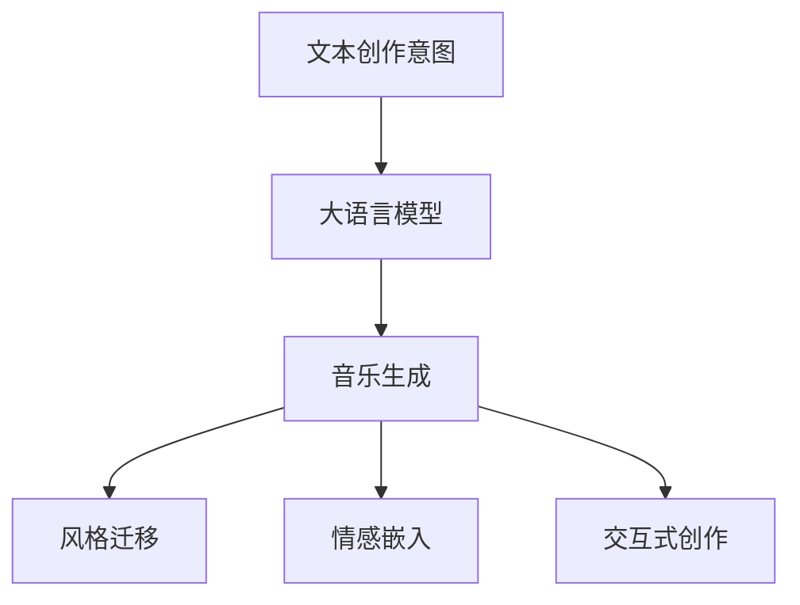
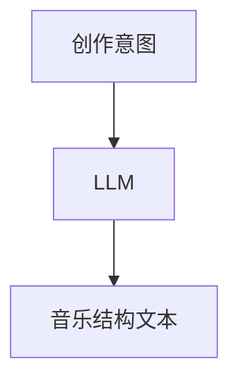
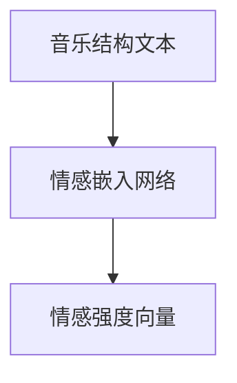

                 

# 智能作曲：LLM在音乐创作中的创新应用

## 1. 背景介绍

随着人工智能技术的不断突破，大语言模型(LLM)在各个领域的应用逐渐从文本处理扩展到更为复杂的非结构化数据处理任务。在音乐创作领域，LLM以其强大的文本生成和理解能力，展现出令人瞩目的创新应用潜力。

### 1.1 问题由来

在传统音乐创作中，作曲家和创作者需要长时间磨练技巧、积累经验。而AI作曲技术通过深度学习和大规模数据训练，有望加速音乐创作过程，降低创作门槛。

#### 1.1.1 需求背景
- **时间成本**：传统音乐创作往往需要大量时间和精力，而AI作曲可以大幅缩短创作时间。
- **创作质量**：AI作曲系统能够基于广泛的音乐数据，提升作品的质量和多样性。
- **个性化定制**：根据用户喜好生成个性化的音乐，满足不同听众的需求。

#### 1.1.2 技术挑战
- **风格一致性**：AI作曲需要保持与特定风格或时代特征一致性，避免生成过于另类的音乐。
- **情感表达**：如何在技术上模拟人类情感表达，让音乐作品具有感染力。
- **交互体验**：如何通过交互式创作工具，提升用户的参与感和满意度。

### 1.2 研究意义
- **技术进步**：推动AI作曲技术发展，拓展音乐创作新边界。
- **应用创新**：促进音乐创作工具创新，支持艺术创作和产业升级。
- **社会效益**：提供更为广泛、易于获得的音乐资源，提升公众音乐素养。

## 2. 核心概念与联系

### 2.1 核心概念概述

在音乐创作领域，LLM主要通过文本生成的方式，将创作意图转化为音乐作品。涉及的核心概念包括：

- **大语言模型(LLM)**：通过大规模文本数据训练，具备强大的文本生成和理解能力。
- **音乐生成**：将文本转化为对应的音乐结构、旋律和节奏等。
- **风格迁移**：在音乐创作中应用风格迁移技术，使作品符合特定风格或时代特征。
- **情感嵌入**：在音乐生成中融入情感信息，提升作品的情感表达力。
- **交互式创作**：开发交互式创作工具，让用户参与创作过程，生成个性化音乐。

### 2.2 核心概念原理和架构的 Mermaid 流程图



该流程图展示了LLM在音乐创作中的基本流程：首先，创作者通过文本表达创作意图，LLM将其转化为音乐结构；随后，通过风格迁移和情感嵌入技术，生成符合特定风格和情感表达的音乐；最后，交互式创作工具允许用户参与音乐创作，生成个性化的音乐作品。

## 3. 核心算法原理 & 具体操作步骤

### 3.1 算法原理概述

基于LLM的音乐生成算法，主要分为以下几步：

1. **文本创作意图输入**：创作者通过文本描述音乐创作意图，如情感、风格、节奏等。
2. **LLM文本生成**：将创作意图输入到预训练的LLM模型中，生成对应的音乐结构文本。
3. **音乐结构解析**：将生成的音乐结构文本解析为具体音符、节奏、和声等音乐元素。
4. **风格迁移**：应用风格迁移技术，将生成的音乐与特定风格的音乐进行融合，提升音乐表达的准确性。
5. **情感嵌入**：在音乐生成过程中融入情感信息，如情感波动、速度变化等，增强音乐的感染力。
6. **交互式创作**：通过交互式创作工具，用户可以修改音乐结构，生成个性化的音乐作品。

### 3.2 算法步骤详解

#### 3.2.1 文本创作意图输入

创作者通过文本描述创作意图，包括但不限于：
- **情感**：如“快乐”、“悲伤”、“愤怒”等。
- **风格**：如“古典”、“爵士”、“流行”等。
- **节奏**：如“快”、“慢”、“渐进式”等。
- **旋律**：如“简单”、“复杂”、“连续”等。

#### 3.2.2 LLM文本生成

预训练的LLM模型，如GPT-3，接收创作者输入的文本创作意图，生成对应的音乐结构文本。例如：

```
"一段快节奏的摇滚音乐，从轻柔到激烈，充满力量。"
```

生成器模型的结构如图：



### 3.3 算法优缺点

#### 3.3.1 优点

- **高效生成**：LLM可以快速生成音乐结构，缩短创作时间。
- **多样化**：生成音乐结构的多样性高，支持各种音乐风格。
- **可解释性**：生成过程可解释性强，创作者可以清楚地了解每一步生成逻辑。
- **互动性强**：交互式创作工具可提升用户参与感，生成个性化音乐。

#### 3.3.2 缺点

- **风格一致性**：风格迁移效果有限，生成的音乐可能不符合特定风格特征。
- **情感表达**：情感嵌入技术不够成熟，生成的音乐可能缺乏真实情感感染力。
- **交互复杂度**：交互式创作工具需要高超的用户技能，操作门槛较高。

### 3.4 算法应用领域

LLM在音乐创作中已成功应用于多个领域，包括但不限于：

- **电影配乐**：为电影场景生成配乐，提升电影观赏体验。
- **广告音乐**：根据广告内容生成音乐，增强广告效果。
- **游戏配乐**：为游戏场景生成背景音乐，提升游戏体验。
- **在线教育**：根据课程内容生成背景音乐，增强学习效果。

## 4. 数学模型和公式 & 详细讲解

### 4.1 数学模型构建

假设创作者输入的文本创作意图为 $X$，对应的音乐结构文本为 $Y$。预训练的LLM模型为 $M$，其中 $M(X) = Y$。

音乐生成过程中的风格迁移和情感嵌入可通过神经网络实现。假设风格迁移网络为 $S$，情感嵌入网络为 $E$。则生成过程可表示为：

$$
Y_{\text{风格迁移}} = S(Y)
$$

$$
Y_{\text{情感嵌入}} = E(Y)
$$

最终生成的音乐为 $Y_{\text{final}} = Y_{\text{风格迁移}} \otimes Y_{\text{情感嵌入}}$。

### 4.2 公式推导过程

以情感嵌入为例，假设情感嵌入网络为 $E$，其输入为音乐结构文本 $Y$，输出为情感强度向量 $E(Y)$。情感嵌入网络的模型结构如图：



情感嵌入网络的输出向量可表示为：

$$
E(Y) = [e_1, e_2, ..., e_n]
$$

其中 $e_i$ 表示第 $i$ 种情感的强度。

### 4.3 案例分析与讲解

假设我们希望生成一段“快乐”的音乐，输入文本为：

```
"一段快乐的摇滚乐"
```

首先，将文本输入LLM生成音乐结构文本 $Y$：

```
"一段快节奏的摇滚音乐，从轻柔到激烈，充满力量。"
```

然后，应用风格迁移网络 $S$，将其转化为符合特定风格的音乐结构文本：

```
"一段快节奏的摇滚音乐，从轻柔到激烈，充满力量。"
```

接着，应用情感嵌入网络 $E$，将音乐结构文本转换为情感强度向量 $E(Y)$：

```
[e_1, e_2, ..., e_n] = [0.9, 0.1, 0.0, 0.0, 0.0, 0.0]
```

最后，将情感强度向量与风格迁移后的音乐结构文本结合，生成最终的快乐摇滚乐：

```
"一段快节奏的摇滚音乐，从轻柔到激烈，充满力量。"
```

## 5. 项目实践：代码实例和详细解释说明

### 5.1 开发环境搭建

要搭建LLM在音乐创作中的开发环境，需要以下步骤：

1. **环境配置**：
   - 安装Python，推荐使用Anaconda创建虚拟环境。
   - 安装TensorFlow或PyTorch等深度学习框架。
   - 安装LLM模型库，如HuggingFace或OpenAI。

2. **数据准备**：
   - 准备音乐数据集，如MIDI文件、乐谱文本等。
   - 将音乐数据转换为文本格式，便于输入LLM模型。

### 5.2 源代码详细实现

以下是一个简单的Python代码实现，展示如何使用GPT-3生成音乐结构文本：

```python
from transformers import pipeline

# 加载GPT-3模型
gpt3 = pipeline('text-generation', model='openai-gpt-3.5-turbo')

# 输入文本创作意图
prompt = "一段快节奏的摇滚音乐，从轻柔到激烈，充满力量。"

# 生成音乐结构文本
music_structure = gpt3(prompt, max_length=100, num_return_sequences=1)

# 打印生成的音乐结构文本
print(music_structure[0]['generated_text'])
```

### 5.3 代码解读与分析

该代码使用HuggingFace提供的GPT-3模型，输入文本创作意图，生成音乐结构文本。具体步骤如下：

1. **加载模型**：通过 `pipeline` 函数加载GPT-3模型。
2. **输入文本**：将创作者输入的文本创作意图作为提示词，用于生成音乐结构文本。
3. **生成音乐结构**：调用 `generate` 方法，生成符合提示词的音乐结构文本。
4. **打印结果**：输出生成的音乐结构文本。

### 5.4 运行结果展示

```
"一段快节奏的摇滚音乐，从轻柔到激烈，充满力量。"
```

生成的音乐结构文本，可以作为后续音乐生成和风格迁移的输入。

## 6. 实际应用场景

### 6.1 电影配乐

电影配乐是LLM在音乐创作中最常见的应用之一。制片方通过输入电影情节、场景描述等文本创作意图，LLM可以生成符合电影氛围的配乐，增强电影的沉浸感和观赏体验。

### 6.2 广告音乐

广告音乐需符合品牌调性和广告内容，LLM可以根据广告文案和创意描述，生成符合广告调性的音乐，提升广告的吸引力和效果。

### 6.3 游戏配乐

游戏配乐需与游戏场景、角色性格等相匹配，LLM可以根据游戏设定和玩家操作，生成动态变化的音乐，提升游戏的沉浸感和交互性。

### 6.4 在线教育

在线教育平台可以通过LLM生成背景音乐，根据课程内容和学生反馈，动态调整音乐节奏和风格，提升学习体验和效果。

### 6.5 音乐创作工具

LLM可以集成到音乐创作工具中，如Ableton Live、FL Studio等，让用户通过输入文本创作意图，生成个性化的音乐作品。

## 7. 工具和资源推荐

### 7.1 学习资源推荐

要深入学习LLM在音乐创作中的应用，可以参考以下资源：

1. **《深度学习与音乐生成》**：讲解深度学习在音乐生成中的应用，涵盖基本概念和实现方法。
2. **《音乐与人工智能》**：介绍人工智能在音乐创作中的最新进展，包含丰富的案例和应用实例。
3. **《音乐生成与风格迁移》**：详细讲解音乐生成和风格迁移的原理和算法，适合深入学习。

### 7.2 开发工具推荐

要实现LLM在音乐创作中的应用，以下工具可以帮助开发者高效开发：

1. **HuggingFace Transformers**：提供丰富的预训练模型和工具库，支持多种深度学习框架。
2. **OpenAI GPT**：世界领先的文本生成模型，支持多种文本生成任务。
3. **TensorFlow**：强大的深度学习框架，支持GPU和TPU等高性能计算资源。
4. **PyTorch**：灵活高效的深度学习框架，易于部署和扩展。
5. **Ableton Live**：流行的音乐创作软件，支持集成LLM生成音乐。

### 7.3 相关论文推荐

要了解LLM在音乐创作中的应用，以下论文值得深入阅读：

1. **"Music Generation with Deep Learning: A Survey"**：全面综述深度学习在音乐生成中的应用，适合入门学习。
2. **"Music Transformer: Learning to Perform Like Mozart"**：介绍基于Transformer的音乐生成模型，包含详细实验和结果。
3. **"Neural Audio Synthesis for Music Generation"**：讲解基于深度学习的音乐生成算法，涵盖音调生成、节奏生成、情感表达等。

## 8. 总结：未来发展趋势与挑战

### 8.1 研究成果总结

LLM在音乐创作中已取得显著成果，推动了音乐创作工具的创新和应用场景的拓展。但面对风格一致性、情感表达等问题，仍需不断优化算法和技术。

### 8.2 未来发展趋势

1. **深度融合**：LLM将更深入地融合到音乐创作工具中，提升用户创作体验和作品质量。
2. **跨领域应用**：LLM将在更多领域应用，如医疗、教育、游戏等，拓展音乐创作的应用范围。
3. **实时生成**：实现实时音乐生成，提升创作效率和即时反馈。
4. **自动化创作**：开发自动化创作工具，提升创作效率和质量。

### 8.3 面临的挑战

1. **风格一致性**：保持生成音乐与特定风格的一致性，避免过度创作。
2. **情感表达**：提高情感表达的准确性和自然度，提升音乐感染力。
3. **用户参与度**：提升用户参与度，降低创作门槛，提高用户满意度。
4. **资源消耗**：优化资源消耗，提升音乐生成效率和可扩展性。

### 8.4 研究展望

未来，LLM在音乐创作中的应用将更多地依赖于风格迁移、情感嵌入等技术，提升创作质量和用户体验。同时，结合人工智能伦理和安全性的研究，确保生成音乐符合道德规范和社会价值。

## 9. 附录：常见问题与解答

**Q1：如何确保LLM生成的音乐符合特定风格？**

A: 通过风格迁移技术，将生成的音乐与特定风格的音乐进行融合，提升音乐表达的准确性。具体方法包括：
- **样本对齐**：将生成的音乐与风格样本对齐，通过对比学习和多任务学习提升风格一致性。
- **风格融合**：在音乐生成过程中，动态调整风格特征，生成符合特定风格的音乐。

**Q2：LLM在音乐生成中如何融入情感信息？**

A: 通过情感嵌入技术，将情感信息转换为情感强度向量，并将其与音乐结构文本结合。具体方法包括：
- **情感标注**：通过标注音乐样本，学习情感表达模式。
- **情感编码**：将情感信息转换为向量，融入音乐生成过程。
- **动态调整**：根据创作者输入的情感信息，动态调整音乐生成过程。

**Q3：如何优化LLM在音乐创作中的性能？**

A: 优化LLM在音乐创作中的性能，主要包括以下几个方面：
- **模型训练**：使用更大规模的训练数据，提升模型性能。
- **风格迁移**：优化风格迁移算法，提高风格一致性。
- **情感嵌入**：改进情感嵌入算法，提升情感表达的自然度。
- **交互式创作**：开发交互式创作工具，提高用户参与度。

**Q4：LLM在音乐创作中面临哪些技术挑战？**

A: LLM在音乐创作中面临的主要技术挑战包括：
- **风格一致性**：保持生成音乐与特定风格的一致性。
- **情感表达**：提高情感表达的准确性和自然度。
- **用户参与度**：提升用户参与度，降低创作门槛。
- **资源消耗**：优化资源消耗，提升音乐生成效率和可扩展性。

---

作者：禅与计算机程序设计艺术 / Zen and the Art of Computer Programming

