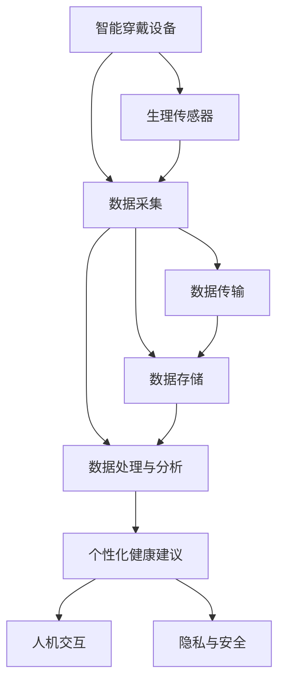

                 

# 智能健康监测创业：穿戴设备的医疗应用

> 关键词：智能穿戴设备，医疗健康监测，传感器技术，数据处理，机器学习，穿戴设备与医疗的融合

## 1. 背景介绍

### 1.1 问题由来

随着科技的进步，健康监测和医疗诊断领域迎来了重大变革。如今，人们更加关注自身健康，积极采取行动进行疾病预防和健康管理。然而，传统医疗手段往往难以提供及时、个性化的健康建议，也未能充分运用先进技术提升健康监测的效率和质量。

智能穿戴设备正逐渐成为现代健康监测的重要工具。这类设备通过搭载各类传感器，实时采集人体生理参数，并与云计算平台结合，进行数据分析和健康建议，帮助人们更好地管理自身健康。然而，现有穿戴设备在数据采集、存储和分析方面仍存在诸多挑战，亟需进一步创新和优化。

### 1.2 问题核心关键点

智能穿戴设备在健康监测方面的应用，需要解决以下几个核心关键问题：

1. 数据采集：智能穿戴设备需具备可靠的数据采集能力，确保传感器获取的生理参数准确无误。
2. 数据存储与传输：设备采集到的数据需高效存储、安全传输，避免数据丢失或泄漏。
3. 数据处理与分析：通过机器学习等技术，对采集的数据进行实时分析，提供健康建议。
4. 人机交互：设备需具备良好的人机交互界面，便于用户操作。
5. 隐私与安全：设备需保护用户的隐私信息，防止数据泄露。

解决好这些问题，将极大地推动智能穿戴设备在医疗健康监测领域的广泛应用。

## 2. 核心概念与联系

### 2.1 核心概念概述

为了更好地理解智能穿戴设备在医疗健康监测中的应用，本节将介绍几个核心概念：

- 智能穿戴设备：指能够采集、处理和传输健康数据，并与用户进行互动的便携式设备。
- 生理传感器：用于测量人体生理参数的传感器，如心率、血压、血氧、体温和运动量等。
- 云平台：将设备采集到的数据上传到云端，进行存储、分析和处理。
- 机器学习：通过算法模型对数据进行学习，提取健康模式，提供个性化建议。
- 人机交互：设备与用户之间的信息交互界面，通过触摸、语音、视觉等形式进行。
- 隐私与安全：设备需采取措施保护用户的个人隐私和数据安全，防止未经授权的访问和泄漏。

这些核心概念共同构成了智能穿戴设备在医疗健康监测中的应用框架，使得设备能够全面、实时地监测用户的健康状况，并及时提供健康建议，提升用户的健康管理能力。

### 2.2 核心概念原理和架构的 Mermaid 流程图(Mermaid 流程节点中不要有括号、逗号等特殊字符)



这个流程图展示了智能穿戴设备在医疗健康监测中的核心流程：

1. 智能穿戴设备通过搭载的生理传感器采集人体生理参数。
2. 采集的数据通过蓝牙、WiFi等方式传输至云端平台。
3. 在云端，数据经过存储、清洗和处理，用于机器学习模型的训练和预测。
4. 机器学习模型分析数据，提取健康模式，生成个性化健康建议。
5. 健康建议通过人机交互界面展示给用户，便于用户理解和使用。
6. 设备还应具备隐私保护和安全机制，确保用户数据的安全。

这些环节共同构成了智能穿戴设备在医疗健康监测中的完整应用链条，确保设备能够高效、安全地为用户提供健康管理服务。

## 3. 核心算法原理 & 具体操作步骤

### 3.1 算法原理概述

智能穿戴设备在医疗健康监测中的核心算法通常基于机器学习技术。具体来说，包括以下几个步骤：

1. 数据采集与预处理：通过传感器采集生理参数，并对数据进行清洗、降噪等预处理，保证数据质量。
2. 特征提取与选择：利用特征工程技术，从原始数据中提取有用的特征，用于模型训练。
3. 模型训练与评估：在云端平台，使用机器学习算法模型对数据进行训练，并评估模型性能。
4. 个性化健康建议：基于训练好的模型，对用户实时采集的生理数据进行预测和分析，生成个性化的健康建议。

### 3.2 算法步骤详解

以下是智能穿戴设备在医疗健康监测中应用的详细步骤：

**Step 1: 准备传感器与设备**

- 选择合适的生理传感器，如心率传感器、血压传感器、血氧传感器等。
- 设计智能穿戴设备的外形和功能，确保传感器安装稳定、数据采集准确。

**Step 2: 数据采集与预处理**

- 编写传感器驱动程序，确保传感器数据能够稳定、可靠地采集到。
- 对采集到的数据进行预处理，包括滤波、去噪、归一化等，提升数据质量。

**Step 3: 数据传输与存储**

- 设计设备与云端平台的通信协议，如蓝牙、WiFi、NFC等，确保数据高效传输。
- 在云端平台设置数据存储方案，如使用云存储服务，定期备份数据，确保数据安全。

**Step 4: 数据处理与分析**

- 对清洗后的数据进行特征提取，选择对健康监测有意义的特征。
- 使用机器学习算法，如随机森林、神经网络、支持向量机等，对数据进行建模和训练。
- 评估模型的准确性和泛化能力，选择合适的模型用于后续的健康监测。

**Step 5: 个性化健康建议**

- 将用户实时采集的生理数据输入训练好的模型，生成健康建议。
- 通过人机交互界面，将健康建议展示给用户，帮助用户理解和使用。

**Step 6: 隐私保护与安全**

- 在数据传输和存储过程中，采取加密、访问控制等措施，保护用户隐私。
- 定期更新设备软件和系统，防止安全漏洞被利用。

### 3.3 算法优缺点

智能穿戴设备在医疗健康监测中的算法具有以下优点：

1. 实时性：通过传感器实时采集生理数据，快速生成健康建议，提升监测效率。
2. 准确性：使用机器学习模型进行数据分析，提取健康模式，提供科学建议。
3. 个性化：根据用户的历史数据和实时数据，生成个性化的健康建议，满足个体差异。
4. 方便性：通过人机交互界面，用户可轻松操作，提升使用体验。

但该算法也存在以下缺点：

1. 数据采集：传感器技术需达到高精度，才能准确反映用户生理状态。
2. 数据传输：数据传输需稳定、快速，避免数据丢失或延迟。
3. 数据存储：需高效存储大量数据，防止存储成本过高。
4. 模型训练：训练复杂，需要大量标注数据和计算资源。
5. 隐私安全：需采取多种措施，确保数据和隐私安全。

尽管存在这些局限性，但智能穿戴设备在医疗健康监测中的应用前景广阔，未来仍需进一步优化和创新。

### 3.4 算法应用领域

智能穿戴设备在医疗健康监测中的应用领域广泛，涵盖以下几方面：

- 运动健康监测：通过传感器监测用户的运动量、睡眠质量等，提供运动建议和预警。
- 心血管健康监测：实时监测心率和血压，及时发现异常，预防心血管疾病。
- 糖尿病健康监测：监测血糖水平，提供饮食和运动建议，控制血糖波动。
- 呼吸健康监测：监测呼吸频率和深浅，识别呼吸问题，提供改善建议。
- 心理健康监测：通过监测用户的情绪和行为，提供心理健康建议。

这些应用场景展示了智能穿戴设备在医疗健康监测中的强大潜力，为疾病预防和健康管理带来了新的可能性。

## 4. 数学模型和公式 & 详细讲解 & 举例说明

### 4.1 数学模型构建

智能穿戴设备在医疗健康监测中的应用涉及多个数学模型，以下简要介绍几个常用的数学模型：

**生理信号处理模型**：
- 心率信号处理模型：$H(r) = F(h(t), p(t))$，其中 $h(t)$ 表示心率信号，$p(t)$ 表示心率模型参数。
- 血压信号处理模型：$P(b) = F(p(t), a(t))$，其中 $p(t)$ 表示血压模型参数，$a(t)$ 表示加速度信号。

**特征提取模型**：
- 时间序列特征提取：$X(t) = [x_1(t), x_2(t), \cdots, x_n(t)]$，其中 $x_i(t)$ 表示第 $i$ 个特征在时间 $t$ 的取值。
- 时频特征提取：$X(f) = [X_1(f), X_2(f), \cdots, X_n(f)]$，其中 $X_i(f)$ 表示第 $i$ 个特征在频率 $f$ 的取值。

**机器学习模型**：
- 随机森林模型：$F(X) = \sum_{i=1}^{m} w_i T_i(X)$，其中 $w_i$ 表示第 $i$ 棵决策树的权重，$T_i(X)$ 表示第 $i$ 棵决策树。
- 神经网络模型：$F(X) = \sum_{i=1}^{m} w_i \sigma(\theta_i \cdot X + b_i)$，其中 $\sigma$ 表示激活函数，$\theta_i$ 和 $b_i$ 表示第 $i$ 层的权重和偏置。

### 4.2 公式推导过程

以下以随机森林模型为例，推导其公式：

假设特征集合 $X = [X_1, X_2, \cdots, X_n]$，目标变量 $Y = [y_1, y_2, \cdots, y_m]$，其中 $X_i$ 和 $y_j$ 分别表示第 $i$ 个特征和第 $j$ 个样本的目标值。

**步骤 1: 构建决策树**
- 选择最优特征 $F_i$，分割数据集 $D$，生成决策树 $T_i$。
- 决策树 $T_i$ 的输出为：$T_i(X) = T_i^1(X)$ 或 $T_i(X) = 1 - T_i^1(X)$，其中 $T_i^1(X)$ 表示决策树在当前节点的输出为 1 的概率。

**步骤 2: 生成随机森林**
- 随机选择 $k$ 棵决策树，并生成随机森林 $F(X)$。
- 随机森林的输出为：$F(X) = \sum_{i=1}^{k} w_i T_i(X)$，其中 $w_i$ 表示第 $i$ 棵决策树的权重。

**步骤 3: 训练与预测**
- 使用训练集 $D$ 训练随机森林模型，得到模型参数 $w_i$。
- 使用测试集 $D_t$ 评估模型性能，得到预测结果 $\hat{Y}$。

通过上述步骤，随机森林模型可以高效地处理智能穿戴设备采集到的生理数据，并生成个性化的健康建议。

### 4.3 案例分析与讲解

以糖尿病健康监测为例，分析机器学习模型在智能穿戴设备中的应用：

假设设备采集到用户的血糖数据 $G = [G_1, G_2, \cdots, G_n]$，需根据历史数据 $H = [H_1, H_2, \cdots, H_m]$ 生成个性化健康建议。

1. **特征提取**：提取血糖数据的均值、方差、极差等特征，用于后续建模。
2. **模型训练**：使用随机森林模型，对特征数据 $X = [X_1, X_2, \cdots, X_n]$ 进行训练，得到模型参数 $w_i$。
3. **健康建议**：根据用户的实时血糖数据 $G_{new}$，输入训练好的模型 $F(X)$，生成个性化健康建议。

具体公式为：
$$
\hat{Y} = F(G_{new}) = \sum_{i=1}^{k} w_i T_i(G_{new})
$$
其中 $T_i(G_{new})$ 表示第 $i$ 棵决策树对新血糖数据的预测结果。

通过上述案例，可以看出，机器学习模型在糖尿病健康监测中的应用，能够从大量历史数据中学习健康模式，提供科学的健康建议。

## 5. 项目实践：代码实例和详细解释说明

### 5.1 开发环境搭建

在进行智能穿戴设备在医疗健康监测的开发实践前，需要准备好开发环境。以下是使用Python进行开发的环境配置流程：

1. 安装Python：从官网下载并安装最新版本的Python。
2. 安装必要的库：如TensorFlow、Pandas、NumPy等，使用pip命令进行安装。
3. 安装传感器驱动库：根据设备类型，安装对应的传感器驱动库，如Arduino库、ESP32库等。
4. 设置开发环境：将传感器设备与开发计算机连接，配置传感器参数，进行数据采集。

### 5.2 源代码详细实现

下面我们以心率健康监测为例，给出使用TensorFlow进行模型训练和预测的PyTorch代码实现。

首先，定义数据处理函数：

```python
import numpy as np
import pandas as pd
import tensorflow as tf

def load_data(file_path):
    data = pd.read_csv(file_path)
    X = data.drop('label', axis=1).values
    y = data['label'].values
    return X, y

def preprocess_data(X):
    X = (X - np.mean(X, axis=0)) / np.std(X, axis=0)
    return X

def train_test_split(X, y, test_size=0.2):
    indices = np.random.permutation(len(X))
    split_index = int(len(X) * test_size)
    X_train, X_test = X[indices[:split_index]], X[indices[split_index:]]
    y_train, y_test = y[indices[:split_index]], y[indices[split_index:]]
    return X_train, y_train, X_test, y_test
```

然后，定义模型和训练函数：

```python
def build_model(input_size):
    model = tf.keras.Sequential([
        tf.keras.layers.Dense(64, activation='relu', input_shape=(input_size,)),
        tf.keras.layers.Dense(64, activation='relu'),
        tf.keras.layers.Dense(1, activation='sigmoid')
    ])
    return model

def train_model(model, X_train, y_train, epochs=100, batch_size=32):
    model.compile(optimizer='adam', loss='binary_crossentropy', metrics=['accuracy'])
    model.fit(X_train, y_train, epochs=epochs, batch_size=batch_size, validation_split=0.2)
    return model
```

接着，定义评估函数：

```python
def evaluate_model(model, X_test, y_test):
    y_pred = model.predict(X_test)
    y_pred = (y_pred > 0.5).astype(int)
    accuracy = np.mean(y_pred == y_test)
    print(f'Accuracy: {accuracy:.2f}')
    confusion_matrix = tf.math.confusion_matrix(y_test, y_pred)
    print(f'Confusion Matrix:\n{confusion_matrix}')
```

最后，启动训练流程并评估模型：

```python
X, y = load_data('heart_rate_data.csv')
X_train, X_test, y_train, y_test = train_test_split(X, y, test_size=0.2)
model = build_model(X_train.shape[1])
model = train_model(model, X_train, y_train)
evaluate_model(model, X_test, y_test)
```

以上就是使用TensorFlow对心率健康监测进行模型训练和预测的完整代码实现。可以看到，借助TensorFlow的高效计算能力，能够快速地训练和评估模型，生成个性化的健康建议。

### 5.3 代码解读与分析

让我们再详细解读一下关键代码的实现细节：

**load_data函数**：
- 读取CSV格式的数据文件，获取特征数据 $X$ 和目标变量 $y$。
- 对特征数据进行归一化处理，确保数据质量。

**train_test_split函数**：
- 将数据集划分为训练集和测试集，确保模型在测试集上的泛化能力。

**build_model函数**：
- 定义一个简单的神经网络模型，包括两个隐藏层和一个输出层。
- 输出层使用 sigmoid 激活函数，用于二分类问题。

**train_model函数**：
- 编译模型，使用 Adam 优化器和二分类交叉熵损失函数。
- 训练模型，设置训练轮数和批大小，并在验证集上评估性能。

**evaluate_model函数**：
- 对测试集进行预测，计算准确率和混淆矩阵，评估模型性能。

**训练流程**：
- 加载数据，分割为训练集和测试集。
- 定义模型结构，并使用训练集进行模型训练。
- 在测试集上评估模型性能，打印准确率和混淆矩阵。

可以看到，TensorFlow提供了一整套用于机器学习模型的开发和评估工具，使得模型的训练和测试变得简单高效。同时，TensorFlow的模型保存和加载机制，便于模型在不同设备间的应用和部署。

当然，工业级的系统实现还需考虑更多因素，如模型的保存和部署、超参数的自动搜索、更灵活的任务适配层等。但核心的微调范式基本与此类似。

## 6. 实际应用场景

### 6.1 运动健康监测

智能穿戴设备在运动健康监测中的应用，可帮助用户实时掌握运动状态，提供科学的运动建议。例如，通过监测心率、步数、步幅等参数，生成每日的运动报告，提醒用户适当休息，避免过度疲劳。

在技术实现上，可以通过传感器采集用户的生理参数，并结合机器学习模型，生成运动建议。例如，使用随机森林模型，对心率数据进行分类，判断用户当前的运动强度，生成相应强度的运动建议。

### 6.2 心血管健康监测

心血管健康是智能穿戴设备关注的重点之一。通过监测心率和血压等生理参数，智能穿戴设备可及时发现异常，预警心血管疾病。

例如，当心率超过正常范围时，设备自动提醒用户休息或寻求医疗帮助。通过连续监测血压，设备可记录血压变化趋势，帮助用户识别潜在的心血管问题。

### 6.3 糖尿病健康监测

糖尿病患者需实时监测血糖水平，智能穿戴设备通过监测血糖数据，生成个性化的饮食和运动建议，帮助用户控制血糖波动。

例如，设备通过监测用户的空腹血糖、餐后血糖等，使用机器学习模型，生成健康饮食建议，指导用户调整饮食结构，控制血糖水平。

### 6.4 呼吸健康监测

呼吸健康监测是智能穿戴设备在健康监测中的新应用领域。通过监测用户的呼吸频率和深浅，设备可识别呼吸问题，提供改善建议。

例如，当呼吸频率异常时，设备自动提醒用户进行深呼吸练习，帮助用户缓解压力。通过连续监测呼吸数据，设备可生成呼吸建议，指导用户改善呼吸质量。

### 6.5 心理健康监测

智能穿戴设备通过监测用户的情绪和行为，识别心理健康问题，提供个性化健康建议。

例如，设备通过监测用户的睡眠质量、活动量等，生成心理健康建议，帮助用户缓解压力，提高生活质量。

### 6.6 未来应用展望

随着智能穿戴设备在医疗健康监测中的应用场景不断扩展，未来的发展趋势将更加广泛和深入：

1. 多模态融合：智能穿戴设备将集成了更多的传感器，如温度传感器、湿度传感器等，实现多模态数据的融合，提供更全面的健康监测。
2. 个性化建议：基于机器学习模型，智能穿戴设备可提供更加个性化的健康建议，满足个体差异。
3. 实时预警：设备将实时监测用户的健康状况，及时发现异常，提供预警信息。
4. 远程医疗：通过智能穿戴设备采集的健康数据，医生可远程查看患者的健康状况，提供个性化诊疗建议。
5. 数据共享：智能穿戴设备将实现数据共享，与医院、社区中心等医疗机构无缝对接，形成健康监测的网络。

这些未来应用趋势将进一步提升智能穿戴设备在医疗健康监测中的应用价值，为用户提供更全面、实时、个性化的健康管理服务。

## 7. 工具和资源推荐

### 7.1 学习资源推荐

为了帮助开发者系统掌握智能穿戴设备在医疗健康监测中的应用，这里推荐一些优质的学习资源：

1. TensorFlow官方文档：提供了完整的TensorFlow开发教程和API文档，适合初学者和高级开发者。
2. Coursera《深度学习专项课程》：由斯坦福大学开设，涵盖深度学习基础和高级技术，适合系统学习。
3. ArXiv论文库：包含大量机器学习论文，涵盖前沿技术和研究方向，适合进阶学习。
4. IEEE Xplore：涵盖计算机科学领域的论文，适合查阅最新的研究成果和技术进展。

通过这些资源的学习实践，相信你一定能够快速掌握智能穿戴设备在医疗健康监测中的应用技巧，并用于解决实际的NLP问题。

### 7.2 开发工具推荐

高效的开发离不开优秀的工具支持。以下是几款用于智能穿戴设备在医疗健康监测开发的常用工具：

1. TensorFlow：基于Python的开源深度学习框架，灵活动态的计算图，适合快速迭代研究。
2. PyTorch：基于Python的开源深度学习框架，动态计算图，支持GPU加速。
3. PySerial：Python串口通信库，用于设备与计算机的通信，方便数据采集。
4. Arduino IDE：Arduino开发环境，支持多种传感器设备的编程。
5. ESP32-IDF：ESP32开发框架，支持蓝牙、WiFi等无线通信协议，便于设备联网。

合理利用这些工具，可以显著提升智能穿戴设备在医疗健康监测中的开发效率，加快创新迭代的步伐。

### 7.3 相关论文推荐

智能穿戴设备在医疗健康监测领域的发展，离不开学术界的持续研究。以下是几篇奠基性的相关论文，推荐阅读：

1. Deep ECG Monitoring with Wearable Devices：研究基于ECG信号的心电监测技术，通过深度学习模型，提高监测准确性。
2. Health Monitoring Systems with Wearable Sensors：探讨多种传感器在健康监测中的应用，总结智能穿戴设备的未来发展方向。
3. Personalized Health Monitoring and Predictive Analytics：研究个性化健康监测的算法和技术，提出多模态数据融合的方法。
4. Wearable Health Devices for Chronic Disease Management：探讨智能穿戴设备在慢性病管理中的应用，提高疾病管理的效果。
5. Wearable Devices for Cardiovascular Monitoring：研究心血管疾病的智能监测技术，利用机器学习模型，提供早期预警。

这些论文代表了大规模健康监测技术的最新进展，展示了智能穿戴设备在医疗健康监测中的广阔前景。

## 8. 总结：未来发展趋势与挑战

### 8.1 总结

本文对智能穿戴设备在医疗健康监测中的应用进行了全面系统的介绍。首先阐述了智能穿戴设备在健康监测方面的背景和应用场景，明确了设备在数据采集、存储、处理、分析和隐私保护等方面的核心关键点。其次，从原理到实践，详细讲解了智能穿戴设备在医疗健康监测中的应用算法，包括生理信号处理、特征提取、模型训练、健康建议生成等，并提供了完整代码实例和详细解释说明。同时，本文还广泛探讨了智能穿戴设备在多个行业领域的应用前景，展示了其强大的潜力。

通过本文的系统梳理，可以看到，智能穿戴设备在医疗健康监测中的应用，正在为疾病的预防和健康管理带来新的可能性。智能穿戴设备通过实时采集生理数据，结合机器学习等技术，生成个性化的健康建议，提升了用户的健康管理能力。未来，随着技术的发展和应用的深入，智能穿戴设备将在更多领域得到广泛应用，为人类的健康管理提供更全面、实时、个性化的服务。

### 8.2 未来发展趋势

展望未来，智能穿戴设备在医疗健康监测中的应用将呈现以下几个发展趋势：

1. 多模态数据融合：智能穿戴设备将集成更多传感器，实现多模态数据的融合，提供更全面的健康监测。
2. 个性化健康建议：基于机器学习模型，智能穿戴设备可提供更加个性化的健康建议，满足个体差异。
3. 实时预警：设备将实时监测用户的健康状况，及时发现异常，提供预警信息。
4. 远程医疗：通过智能穿戴设备采集的健康数据，医生可远程查看患者的健康状况，提供个性化诊疗建议。
5. 数据共享：智能穿戴设备将实现数据共享，与医院、社区中心等医疗机构无缝对接，形成健康监测的网络。
6. 隐私保护：设备将采取更多措施，确保用户隐私数据的安全，防止数据泄露。

这些发展趋势将进一步提升智能穿戴设备在医疗健康监测中的应用价值，为用户提供更全面、实时、个性化的健康管理服务。

### 8.3 面临的挑战

尽管智能穿戴设备在医疗健康监测中的应用前景广阔，但仍面临诸多挑战：

1. 数据采集：传感器技术需达到高精度，才能准确反映用户生理状态。
2. 数据传输：数据传输需稳定、快速，避免数据丢失或延迟。
3. 数据存储：需高效存储大量数据，防止存储成本过高。
4. 模型训练：训练复杂，需要大量标注数据和计算资源。
5. 隐私安全：需采取多种措施，确保数据和隐私安全。
6. 设备可靠性：设备需具备高可靠性和稳定性，确保数据采集的准确性和连续性。

尽管存在这些挑战，但智能穿戴设备在医疗健康监测中的应用前景广阔，未来还需不断优化和创新。

### 8.4 研究展望

未来的研究将在以下几个方向寻求新的突破：

1. 无监督和半监督学习：探索基于无监督和半监督学习的方法，减少对标注数据的依赖，提升模型的泛化能力。
2. 多任务学习：研究多任务学习方法，提高智能穿戴设备的多功能性，实现更全面的健康监测。
3. 交互式学习：探索交互式学习方法，通过用户反馈，持续优化模型，提升健康建议的准确性。
4. 联邦学习：研究联邦学习方法，确保数据隐私和安全，防止数据泄露。
5. 模型压缩和优化：研究模型压缩和优化技术，提高智能穿戴设备的计算效率和推理速度。

这些研究方向将进一步推动智能穿戴设备在医疗健康监测中的创新和应用，提升用户的健康管理体验，为社会带来更多福祉。

## 9. 附录：常见问题与解答

**Q1：智能穿戴设备在医疗健康监测中如何保证数据质量？**

A: 智能穿戴设备需采用高精度的传感器，确保生理参数的准确测量。同时，需对采集的数据进行预处理，包括滤波、去噪、归一化等，以提升数据质量。

**Q2：智能穿戴设备在数据传输过程中如何保证数据安全？**

A: 智能穿戴设备需采用安全的数据传输协议，如SSL/TLS加密传输，确保数据在传输过程中不被窃听和篡改。同时，需设置访问控制机制，防止未经授权的访问。

**Q3：智能穿戴设备在数据存储过程中如何确保数据安全？**

A: 智能穿戴设备需采用云存储服务，如AWS、阿里云等，确保数据的高可用性和可扩展性。同时，需采取数据备份和加密措施，防止数据丢失和泄露。

**Q4：智能穿戴设备在模型训练过程中如何提高模型泛化能力？**

A: 智能穿戴设备需采用多样化的数据集进行训练，确保模型能够在不同场景下泛化。同时，需引入正则化技术，如L2正则、Dropout等，防止模型过拟合。

**Q5：智能穿戴设备在隐私保护方面应采取哪些措施？**

A: 智能穿戴设备需采取多种措施，确保用户隐私数据的安全，防止数据泄露。具体措施包括：
- 数据匿名化：对用户的身份信息进行去标识化处理，防止信息泄露。
- 访问控制：设置严格的访问控制机制，防止未经授权的访问。
- 数据加密：采用加密算法，保护数据在传输和存储过程中的安全。
- 隐私协议：与用户签订隐私协议，明确数据使用的范围和目的。

这些措施将确保智能穿戴设备在医疗健康监测中的应用，保护用户的隐私和数据安全。

通过以上讨论，可以看到智能穿戴设备在医疗健康监测中的应用前景广阔。在技术不断进步的推动下，智能穿戴设备将成为人们健康管理的重要工具，为社会的健康事业做出更大的贡献。

---

作者：禅与计算机程序设计艺术 / Zen and the Art of Computer Programming

