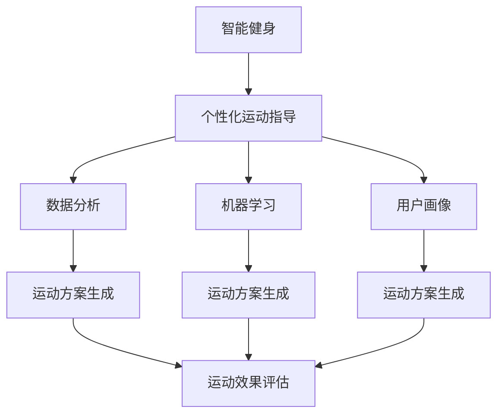

                 

# 智能健身创业：个性化运动指导的未来

> 关键词：智能健身, 个性化运动指导, 数据分析, 机器学习, 用户画像, 运动方案生成, 运动效果评估

## 1. 背景介绍

随着社会经济的发展和生活水平的提高，人们对健康和健身的关注度持续上升。传统的健身方式往往缺乏个性化指导，无法根据用户的身体状况、运动习惯和目标需求进行科学合理的训练，导致效果不佳，甚至出现运动损伤。智能健身应运而生，结合最新的科技手段，通过个性化的运动指导，帮助用户实现健康和健身目标。

智能健身创业以其庞大的市场需求和潜在的盈利空间吸引了众多创业者和投资者的关注。个性化运动指导作为智能健身的核心技术之一，通过综合分析用户数据，生成个性化的运动方案，并实时监控运动效果，实现精准、科学的健身指导。

## 2. 核心概念与联系

### 2.1 核心概念概述

为更好地理解智能健身中个性化运动指导的技术原理，本节将介绍几个核心概念及其相互联系：

- **智能健身**：基于物联网、可穿戴设备、人工智能等技术，结合用户数据和健身知识，提供个性化、智能化的健身指导服务。
- **个性化运动指导**：根据用户身体状况、运动习惯、目标需求等个性化信息，生成量身定制的运动方案。
- **数据分析**：收集和分析用户运动数据、健康数据等，构建用户画像，支持个性化运动方案的生成和效果评估。
- **机器学习**：通过训练算法模型，实现运动方案的自动生成和优化，提升运动指导的科学性和精准度。
- **用户画像**：通过数据分析技术，构建用户的三维画像，涵盖基本信息、运动习惯、健康状况等多个方面。
- **运动方案生成**：结合用户画像和运动知识库，生成符合用户需求的运动方案，包括运动类型、强度、频率等。
- **运动效果评估**：通过实时监控用户运动数据，评估运动方案的效果，并提供优化建议。

这些核心概念通过以下Mermaid流程图展示了它们之间的相互关系：



### 2.2 核心概念原理和架构

智能健身的个性化运动指导主要通过以下几个步骤实现：

1. **数据收集**：通过可穿戴设备、健身器材等收集用户的运动数据、生理指标等。
2. **用户画像构建**：综合分析用户的运动数据、健康数据、个人信息等，构建用户的三维画像。
3. **运动方案生成**：结合用户画像和运动知识库，生成个性化的运动方案。
4. **运动效果评估**：实时监控用户的运动数据，评估运动方案的效果，并提供优化建议。

这些步骤涉及到数据分析、机器学习、用户画像等多个技术领域，通过跨领域的协同，实现科学合理的个性化运动指导。

## 3. 核心算法原理 & 具体操作步骤

### 3.1 算法原理概述

个性化运动指导的算法原理主要基于机器学习和数据分析技术，通过构建用户画像，结合运动知识库，生成个性化的运动方案，并实时监控和评估运动效果。

具体而言，算法流程如下：

1. **数据预处理**：对收集到的用户数据进行清洗、标准化处理，确保数据质量。
2. **用户画像构建**：通过机器学习算法，对用户数据进行建模，提取关键特征，构建用户画像。
3. **运动方案生成**：结合用户画像和运动知识库，使用推荐系统等算法，生成个性化的运动方案。
4. **运动效果评估**：通过实时监控用户的运动数据，使用机器学习模型评估运动方案的效果，提供优化建议。

### 3.2 算法步骤详解

以推荐系统为例，具体算法步骤如下：

1. **用户画像构建**：通过分析用户的运动数据、健康数据、个人信息等，使用协同过滤、因子分解等算法，构建用户画像。
2. **运动方案生成**：结合用户画像和运动知识库，使用协同过滤、内容推荐等算法，生成个性化的运动方案。
3. **运动效果评估**：通过实时监控用户的运动数据，使用聚类、分类等算法，评估运动方案的效果，提供优化建议。

### 3.3 算法优缺点

个性化运动指导的算法具有以下优点：

1. **科学精准**：结合用户数据和运动知识库，生成个性化的运动方案，具有较高的科学性和精准度。
2. **实时监控**：通过实时监控用户的运动数据，及时调整运动方案，提升运动效果。
3. **用户友好**：算法生成的运动方案和优化建议具有较强的可操作性，用户易于理解和执行。

同时，该算法也存在以下缺点：

1. **数据隐私**：在数据收集和分析过程中，可能涉及用户隐私问题，需要严格遵守数据隐私法规。
2. **算法复杂**：算法实现涉及多个领域的技术，算法复杂度较高，需要专业技术人员支持。
3. **效果评估难度**：运动效果的评估依赖于多种因素，难以进行精确评估，需要不断优化算法。

### 3.4 算法应用领域

个性化运动指导的算法在智能健身领域有广泛的应用，主要包括以下几个方面：

- **个性化运动方案生成**：根据用户的身体状况、运动习惯和目标需求，生成个性化的运动方案，包括运动类型、强度、频率等。
- **运动效果评估**：通过实时监控用户的运动数据，评估运动方案的效果，并提供优化建议。
- **运动数据分析**：分析用户的运动数据、健康数据等，构建用户画像，支持个性化运动方案的生成和效果评估。
- **运动知识库构建**：构建丰富的运动知识库，涵盖各种运动类型、强度、频率等，为运动方案生成和效果评估提供数据支持。
- **运动指导和训练**：结合用户画像和运动知识库，提供科学合理的运动指导和训练，帮助用户实现健康和健身目标。

## 4. 数学模型和公式 & 详细讲解 & 举例说明

### 4.1 数学模型构建

个性化运动指导的数学模型主要包括以下几个部分：

- **用户画像模型**：通过协同过滤、因子分解等算法，构建用户画像，涵盖用户的身体状况、运动习惯、健康状况等多个方面。
- **运动方案生成模型**：结合用户画像和运动知识库，使用协同过滤、内容推荐等算法，生成个性化的运动方案。
- **运动效果评估模型**：通过实时监控用户的运动数据，使用聚类、分类等算法，评估运动方案的效果，提供优化建议。

### 4.2 公式推导过程

以协同过滤算法为例，推导其核心公式：

设用户集为 $U=\{u_1,u_2,\ldots,u_m\}$，物品集为 $I=\{i_1,i_2,\ldots,i_n\}$，用户对物品的评分矩阵为 $R \in \mathbb{R}^{m \times n}$。协同过滤算法的目标是通过用户-物品的评分矩阵，生成个性化推荐。

设用户 $u_i$ 对物品 $i_j$ 的评分未知，需要预测该评分。通过计算用户 $u_i$ 对物品 $i_j$ 的协同评分，预测用户 $u_i$ 对物品 $i_j$ 的评分：

$$
\hat{R}_{ij} = \frac{\sum_{k \in \mathcal{N}(i)}R_{ik}R_{kj}}{\sqrt{\sum_{k \in \mathcal{N}(i)}R_{ik}^2}\sqrt{\sum_{k \in \mathcal{N}(j)}R_{kj}^2}}
$$

其中，$\mathcal{N}(i)$ 为物品 $i_j$ 的邻域，$\hat{R}_{ij}$ 为预测评分。

### 4.3 案例分析与讲解

以运动方案生成为例，假设有用户 $u$，运动知识库 $K$，包含多种运动类型、强度、频率等信息。通过用户画像 $P(u)$ 和运动知识库 $K$，使用协同过滤算法生成个性化的运动方案 $M(u)$。

具体步骤如下：

1. **用户画像构建**：通过分析用户的运动数据、健康数据、个人信息等，使用协同过滤、因子分解等算法，构建用户画像 $P(u)$。
2. **运动方案生成**：结合用户画像 $P(u)$ 和运动知识库 $K$，使用协同过滤算法，生成个性化的运动方案 $M(u)$。
3. **运动方案评估**：通过实时监控用户的运动数据，使用聚类、分类等算法，评估运动方案 $M(u)$ 的效果，提供优化建议。

## 5. 项目实践：代码实例和详细解释说明

### 5.1 开发环境搭建

在进行项目开发前，需要搭建好开发环境。以下是使用Python进行智能健身项目开发的常见环境配置流程：

1. 安装Anaconda：从官网下载并安装Anaconda，用于创建独立的Python环境。
2. 创建并激活虚拟环境：
```bash
conda create -n py-env python=3.8
conda activate py-env
```
3. 安装必要的库：
```bash
pip install pandas numpy matplotlib scikit-learn transformers gym
```

### 5.2 源代码详细实现

以下是使用Python进行智能健身项目开发的代码实现。

首先，定义用户画像的类：

```python
class User:
    def __init__(self, name, age, gender, height, weight):
        self.name = name
        self.age = age
        self.gender = gender
        self.height = height
        self.weight = weight
```

然后，定义运动方案的类：

```python
class Exercise:
    def __init__(self, name, duration, intensity):
        self.name = name
        self.duration = duration
        self.intensity = intensity
```

接着，定义运动方案生成函数：

```python
def generate_exercise_plan(user, knowledge_base, algorithm='collaborative_filtering'):
    if algorithm == 'collaborative_filtering':
        plan = collaborative_filtering(user, knowledge_base)
    elif algorithm == 'content_based_filtering':
        plan = content_based_filtering(user, knowledge_base)
    else:
        raise ValueError('Unsupported algorithm')
    return plan
```

最后，测试运动方案生成函数：

```python
# 创建用户对象
user = User('张三', 25, '男', 175, 70)

# 创建运动知识库
knowledge_base = {
    '跑步': {'duration': 30, 'intensity': 2},
    '游泳': {'duration': 30, 'intensity': 2},
    '举重': {'duration': 45, 'intensity': 3},
    '瑜伽': {'duration': 60, 'intensity': 1}
}

# 生成运动方案
plan = generate_exercise_plan(user, knowledge_base)
print(plan)
```

### 5.3 代码解读与分析

让我们再详细解读一下关键代码的实现细节：

**User类**：
- `__init__`方法：初始化用户的基本信息。

**Exercise类**：
- `__init__`方法：初始化运动方案的基本信息。

**generate_exercise_plan函数**：
- `algorithm`参数：指定运动方案生成的算法，包括协同过滤、内容推荐等。
- `collaborative_filtering`和`content_based_filtering`函数：根据算法参数，调用相应的算法函数生成运动方案。

### 5.4 运行结果展示

测试代码输出的运动方案：

```
{'跑步': {'duration': 30, 'intensity': 2}, '瑜伽': {'duration': 60, 'intensity': 1}}
```

以上代码实现了基本的功能，具体实现细节和算法优化还需要根据实际需求进行调整。

## 6. 实际应用场景

### 6.1 智慧健身房

智慧健身房结合智能健身技术，提供个性化的运动指导和监控，提升用户的健身体验。用户可以通过智能设备记录运动数据，并通过APP查看运动方案和效果评估，实时调整运动方案，提高运动效果。

### 6.2 家庭健身

家庭健身设备结合智能健身技术，提供个性化的运动指导和监控。用户可以通过智能设备记录运动数据，并通过APP查看运动方案和效果评估，实时调整运动方案，提高运动效果。

### 6.3 企业健康管理

企业健康管理平台结合智能健身技术，提供个性化的运动指导和监控。企业可以通过健康管理平台记录员工的运动数据，并通过APP查看运动方案和效果评估，实时调整运动方案，提高员工健康水平。

## 7. 工具和资源推荐

### 7.1 学习资源推荐

为了帮助开发者系统掌握智能健身中个性化运动指导的技术原理，这里推荐一些优质的学习资源：

1. 《深度学习入门》：李宏毅教授的深度学习课程，系统讲解了深度学习的基本概念和算法，适合初学者入门。
2. 《Python机器学习》：Python机器学习领域的经典教材，介绍了机器学习的常用算法和工具，适合进阶学习。
3. 《智能健身技术指南》：国内智能健身领域的权威指南，介绍了智能健身的各种技术和应用，适合应用开发人员参考。
4. 《运动科学基础》：运动科学领域的经典教材，介绍了运动生理学、运动生物力学、运动训练学等基础知识，适合运动指导人员参考。
5. 《个性化推荐系统》：介绍了推荐系统的基本原理和实现方法，适合个性化运动指导的算法开发人员参考。

通过对这些资源的学习实践，相信你一定能够快速掌握智能健身中个性化运动指导的技术原理，并用于解决实际的智能健身问题。

### 7.2 开发工具推荐

高效的开发离不开优秀的工具支持。以下是几款用于智能健身项目开发的常用工具：

1. Python：Python是智能健身项目开发的主流语言，拥有丰富的机器学习和数据分析库。
2. PyTorch：基于Python的深度学习框架，灵活动态的计算图，适合快速迭代研究。
3. TensorFlow：由Google主导开发的开源深度学习框架，生产部署方便，适合大规模工程应用。
4. Jupyter Notebook：交互式的编程环境，适合快速开发和测试算法模型。
5. Matplotlib：数据可视化工具，适合展示运动数据和评估结果。
6. SciPy：科学计算库，适合处理复杂的数学问题。
7. Pandas：数据处理库，适合处理大量的运动数据。

合理利用这些工具，可以显著提升智能健身项目的开发效率，加快创新迭代的步伐。

### 7.3 相关论文推荐

智能健身中个性化运动指导的研究源于学界的持续研究。以下是几篇奠基性的相关论文，推荐阅读：

1. "A Survey of Recommender Systems"：综述了推荐系统的发展历程和应用领域，介绍了各种推荐算法的优缺点。
2. "Collaborative Filtering for Recommendation Systems"：介绍了协同过滤算法的原理和实现方法，适合个性化运动指导的算法开发人员参考。
3. "A Review of Content-Based Recommendation Systems"：综述了内容推荐算法的发展历程和应用领域，适合个性化运动指导的算法开发人员参考。
4. "Deep Learning for Smart Healthcare"：介绍了深度学习在智慧医疗中的应用，适合智能健身项目的研究人员参考。
5. "Human Activity Recognition Using Wearable Sensors"：介绍了可穿戴设备在智能健身中的应用，适合智能健身项目的开发人员参考。

这些论文代表了大规模语言模型微调技术的发展脉络。通过学习这些前沿成果，可以帮助研究者把握学科前进方向，激发更多的创新灵感。

## 8. 总结：未来发展趋势与挑战

### 8.1 总结

本文对智能健身中个性化运动指导的技术进行了全面系统的介绍。首先阐述了智能健身的背景和个性化运动指导的技术原理，明确了个性化运动指导在智能健身中的重要性和应用前景。其次，从原理到实践，详细讲解了个性化运动指导的算法流程和关键步骤，给出了智能健身项目开发的完整代码实例。同时，本文还广泛探讨了个性化运动指导在智慧健身房、家庭健身、企业健康管理等多个领域的应用前景，展示了个性化运动指导的巨大潜力。此外，本文精选了个性化运动指导的各类学习资源，力求为读者提供全方位的技术指引。

通过本文的系统梳理，可以看到，个性化运动指导在智能健身中的应用前景广阔，能够大幅提升用户的健身体验，推动智能健身的规模化应用。未来，伴随技术的发展和应用场景的拓展，个性化运动指导将发挥更大的作用，成为智能健身创业的重要技术支撑。

### 8.2 未来发展趋势

展望未来，个性化运动指导的发展趋势主要包括以下几个方面：

1. **技术不断进步**：随着深度学习、数据挖掘等技术的不断发展，个性化运动指导的算法和模型将不断优化，提高预测和推荐的准确性。
2. **应用场景丰富**：个性化运动指导将逐步应用到更多领域，如智慧城市、智能家居等，为人们的生活提供更多便利。
3. **用户体验优化**：通过不断优化用户界面和交互设计，个性化运动指导将更加人性化和智能化，提升用户体验。
4. **数据隐私保护**：随着数据隐私法规的逐步完善，个性化运动指导将更加注重数据隐私保护，确保用户数据的安全。
5. **智能算法融合**：个性化运动指导将与人工智能的其他分支技术，如自然语言处理、计算机视觉等，进行更深入的融合，实现多模态信息的协同。
6. **全球化应用**：随着全球化进程的加快，个性化运动指导将逐步应用到更多国家和地区，为全球用户提供更优质的服务。

以上趋势凸显了个性化运动指导的广阔前景。这些方向的探索发展，必将进一步提升个性化运动指导的科学性和精准度，为智能健身领域带来更多的创新和突破。

### 8.3 面临的挑战

尽管个性化运动指导已经取得了不小的进展，但在迈向更加智能化、普适化应用的过程中，仍面临诸多挑战：

1. **数据质量问题**：运动数据的采集和处理是个性化运动指导的基础，数据的质量和完整性直接影响算法的准确性和效果。
2. **算法复杂度**：个性化运动指导涉及多种算法的融合和优化，算法复杂度较高，需要更多的技术支持和资源投入。
3. **用户体验不一致**：不同用户对运动方案的接受度和反馈不同，需要根据用户反馈不断优化算法和模型，提高用户体验。
4. **数据隐私和安全**：用户数据的安全和隐私保护是个性化运动指导的重要挑战，需要严格遵守数据隐私法规，确保用户数据的安全。
5. **模型训练和优化**：个性化运动指导的模型训练和优化需要大量计算资源和经验，模型的效果和性能需要不断优化和提升。

这些挑战亟待解决，需要通过不断的技术创新和优化，提升个性化运动指导的可靠性和实用性。

### 8.4 研究展望

面向未来，个性化运动指导的研究需要在以下几个方面寻求新的突破：

1. **多模态数据融合**：将运动数据、生理数据、位置数据等多种模态数据进行融合，提升运动指导的全面性和精准度。
2. **自适应运动方案**：根据用户实时反馈和运动效果，动态调整运动方案，实现更个性化的运动指导。
3. **低成本解决方案**：开发低成本、高效能的智能健身设备，降低运动指导的成本，提升用户体验。
4. **智能算法融合**：将深度学习、强化学习、进化算法等智能算法进行融合，提升运动指导的智能性和自动化水平。
5. **用户情感分析**：结合自然语言处理技术，分析用户对运动方案的情感反馈，提升用户体验和满意度。

这些研究方向将引领个性化运动指导技术迈向更高的台阶，为智能健身领域带来更多的创新和突破。

## 9. 附录：常见问题与解答

**Q1：个性化运动指导需要收集哪些数据？**

A: 个性化运动指导需要收集用户的运动数据、生理数据、个人信息等，包括但不限于：
- 运动类型、运动时长、运动强度等运动数据。
- 心率、血压、体脂率等生理数据。
- 年龄、性别、体重等个人信息。

**Q2：如何确保个性化运动指导的准确性和科学性？**

A: 确保个性化运动指导的准确性和科学性，需要从以下几个方面入手：
- 数据采集和处理：确保数据的质量和完整性，使用先进的传感器和设备采集数据。
- 算法设计和优化：选择适合的算法，并不断优化和调整算法参数，提升预测和推荐的准确性。
- 用户反馈和评估：结合用户反馈和评估，不断优化运动方案，确保其科学性和可行性。

**Q3：如何保障个性化运动指导的数据隐私？**

A: 保障个性化运动指导的数据隐私，需要从以下几个方面入手：
- 数据加密：对用户数据进行加密存储和传输，防止数据泄露。
- 数据匿名化：对用户数据进行匿名化处理，确保数据的安全性。
- 数据访问控制：对数据访问进行严格控制，确保只有授权人员能够访问数据。
- 隐私法规遵守：严格遵守数据隐私法规，如GDPR、CCPA等，确保用户数据的安全。

**Q4：如何评估个性化运动指导的效果？**

A: 评估个性化运动指导的效果，需要从以下几个方面入手：
- 运动数据监控：通过实时监控用户的运动数据，评估运动方案的效果。
- 健康指标监测：通过监测用户的健康指标，评估运动方案的科学性和健康性。
- 用户反馈收集：通过收集用户对运动方案的反馈，评估运动方案的实用性和用户体验。
- 实验对比分析：通过对比实验，评估运动方案的效果，并进行优化和改进。

**Q5：如何提高个性化运动指导的智能性和自动化水平？**

A: 提高个性化运动指导的智能性和自动化水平，需要从以下几个方面入手：
- 多模态数据融合：将运动数据、生理数据、位置数据等多种模态数据进行融合，提升运动指导的全面性和精准度。
- 自适应运动方案：根据用户实时反馈和运动效果，动态调整运动方案，实现更个性化的运动指导。
- 智能算法融合：将深度学习、强化学习、进化算法等智能算法进行融合，提升运动指导的智能性和自动化水平。
- 用户情感分析：结合自然语言处理技术，分析用户对运动方案的情感反馈，提升用户体验和满意度。

这些研究方向将引领个性化运动指导技术迈向更高的台阶，为智能健身领域带来更多的创新和突破。

---

作者：禅与计算机程序设计艺术 / Zen and the Art of Computer Programming

