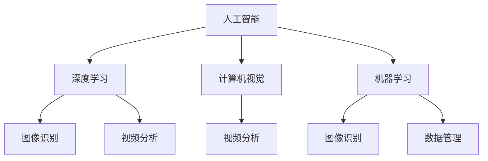

                 

# 智能安防创业：AI驱动的安全解决方案

> 关键词：人工智能，安全管理，图像识别，视频监控，机器学习，深度学习，智能分析

## 1. 背景介绍

### 1.1 问题由来

随着信息技术的飞速发展，智能安防已经成为了现代城市管理和公共安全的重要保障。从商业大厦到住宅小区，从工业园区到机场车站，智能安防系统已经广泛应用于各个领域，为社会稳定运行提供了坚实的保障。然而，传统的智能安防系统仍然存在诸多不足，主要体现在以下几个方面：

1. **效率低下**：传统的安防系统往往需要大量的人工监控和操作，成本高，且容易出现误报和漏报。
2. **响应缓慢**：安防系统在检测到异常情况后，响应速度慢，难以及时应对突发事件。
3. **识别能力有限**：传统安防系统主要依赖规则和特征匹配，识别能力有限，难以适应复杂的场景变化。
4. **数据管理困难**：庞大的数据量和复杂的数据结构使得传统安防系统的数据管理难度大，难以实现实时分析和智能决策。

### 1.2 问题核心关键点

为了解决上述问题，我们需要引入更加智能化、自动化的安防解决方案。AI技术，特别是深度学习和大数据分析技术，已经成为了安防领域的前沿技术，可以显著提升安防系统的效率、准确性和智能化水平。通过AI技术，可以实现以下目标：

1. **实时监控**：利用图像识别和视频分析技术，实现对异常行为的实时监控和报警。
2. **智能识别**：基于深度学习模型，提升对人、车、物等目标的识别能力，减少误报和漏报。
3. **精准响应**：通过自动化决策系统，实现对异常情况的精准响应，提高应急处理能力。
4. **数据管理**：利用大数据分析技术，实现对安防数据的全面管理和智能分析，提升决策支持能力。

### 1.3 问题研究意义

开发基于AI技术的智能安防系统，对于提升城市公共安全水平，构建智慧城市具有重要意义：

1. **降低运营成本**：自动化监控和智能决策可以显著降低人工成本，提高安防系统的效率。
2. **提升响应速度**：智能安防系统能够快速识别和响应异常情况，提高应急处理能力。
3. **增强识别能力**：AI技术可以提升对人、车、物等目标的识别准确度，减少误报和漏报。
4. **优化数据管理**：通过大数据分析，实现对安防数据的全面管理，提升决策支持能力。
5. **推动产业升级**：智能安防技术的普及应用，将推动安防行业的数字化转型，促进产业升级。

## 2. 核心概念与联系

### 2.1 核心概念概述

为更好地理解基于AI技术的智能安防解决方案，本节将介绍几个关键概念及其之间的联系：

1. **人工智能(AI)**：通过模拟人类智能行为，实现信息的自动化处理和决策，包括感知、学习、推理等能力。
2. **深度学习(Deep Learning)**：利用多层神经网络，通过反向传播算法训练模型，实现对复杂非线性关系的拟合。
3. **计算机视觉(Computer Vision)**：通过图像识别和视频分析技术，实现对视觉信息的理解和处理。
4. **机器学习(Machine Learning)**：基于数据训练模型，实现对数据模式的学习和预测。
5. **图像识别(Image Recognition)**：通过训练模型，识别图像中的目标和特征。
6. **视频分析(Video Analytics)**：通过分析视频内容，实现对异常行为的识别和报警。
7. **数据管理(Data Management)**：通过大数据技术，实现对安防数据的全面管理和分析。

这些核心概念之间的逻辑关系可以通过以下Mermaid流程图来展示：



这个流程图展示了人工智能、深度学习、计算机视觉、机器学习、图像识别、视频分析和数据管理之间的关系：

1. **深度学习**：作为AI的核心技术之一，深度学习通过多层神经网络实现了对复杂非线性关系的拟合。
2. **计算机视觉**：利用深度学习模型，计算机视觉技术可以实现对图像和视频内容的理解和处理。
3. **图像识别**：通过计算机视觉技术，可以识别图像中的目标和特征。
4. **视频分析**：通过对视频内容进行分析和理解，可以实现对异常行为的识别和报警。
5. **机器学习**：在深度学习和计算机视觉技术的基础上，机器学习可以进一步提升模型对数据的理解和预测能力。
6. **数据管理**：利用大数据技术，实现对安防数据的全面管理和分析，提升决策支持能力。

## 3. 核心算法原理 & 具体操作步骤
### 3.1 算法原理概述

基于AI技术的智能安防解决方案，核心在于利用深度学习和大数据分析技术，实现对安防数据的智能化处理和决策。其核心算法流程包括数据采集、预处理、特征提取、模型训练、推理分析等步骤。

### 3.2 算法步骤详解

以下是基于AI技术的智能安防解决方案的核心算法步骤：

**Step 1: 数据采集与预处理**

1. **数据采集**：通过摄像头、传感器等设备采集视频、图像、音频等安防数据。
2. **数据预处理**：对采集的数据进行去噪、增强、裁剪、缩放等预处理操作，提升数据质量。

**Step 2: 特征提取**

1. **图像特征提取**：利用卷积神经网络(CNN)等模型，从图像中提取关键特征，如目标的纹理、形状、位置等。
2. **视频特征提取**：利用循环神经网络(RNN)、时空卷积网络(TCNN)等模型，从视频中提取关键帧和关键时刻的特征。

**Step 3: 模型训练**

1. **模型选择**：选择合适的深度学习模型，如CNN、RNN、TCNN等，进行安防数据的训练。
2. **数据标注**：对安防数据进行标注，生成训练样本和验证集。
3. **模型训练**：利用训练集进行模型训练，优化模型参数，提高模型准确度。

**Step 4: 推理分析**

1. **模型推理**：利用训练好的模型，对实时采集的视频和图像进行推理分析。
2. **异常检测**：通过图像识别和视频分析技术，实现对异常行为的检测和报警。
3. **决策支持**：利用大数据分析技术，对安防数据进行综合分析，生成决策支持信息。

### 3.3 算法优缺点

基于AI技术的智能安防解决方案，具有以下优点：

1. **高效率**：利用AI技术，可以实现对安防数据的实时处理和分析，提高响应速度。
2. **高准确度**：深度学习和大数据分析技术可以提升对目标的识别准确度，减少误报和漏报。
3. **智能化决策**：通过智能分析，实现对异常行为的自动识别和报警，提升应急处理能力。
4. **全面管理**：利用大数据技术，实现对安防数据的全面管理和分析，提升决策支持能力。

同时，该方案也存在一些缺点：

1. **数据依赖**：智能安防系统依赖高质量的训练数据，数据质量直接影响系统性能。
2. **计算资源需求高**：深度学习模型需要大量的计算资源，对硬件设备要求较高。
3. **模型复杂**：深度学习模型复杂，训练和推理过程需要专业知识和技术支持。
4. **隐私和安全问题**：智能安防系统涉及大量敏感数据，数据隐私和安全问题需要特别关注。

### 3.4 算法应用领域

基于AI技术的智能安防解决方案，可以应用于以下领域：

1. **商业大厦**：通过视频监控和图像识别技术，实现对内部安全事件的实时监控和报警。
2. **住宅小区**：利用门禁系统和智能摄像头，实现对人员和车辆的智能识别和管理。
3. **工业园区**：通过视频分析和异常检测技术，实现对生产现场的安全监控和预警。
4. **机场车站**：利用人脸识别和行为分析技术，实现对人员和行李的智能筛查和管控。
5. **智慧城市**：通过智能安防系统，实现对城市公共安全事件的全面监控和应对。

## 4. 数学模型和公式 & 详细讲解 & 举例说明

### 4.1 数学模型构建

本节将使用数学语言对基于AI技术的智能安防解决方案进行更加严格的刻画。

设安防系统的输入为 $\mathcal{X}$，输出为 $\mathcal{Y}$。定义数据集为 $D=\{(x_i, y_i)\}_{i=1}^N$，其中 $x_i \in \mathcal{X}$ 为输入，$y_i \in \mathcal{Y}$ 为输出，$N$ 为样本数。

定义模型为 $M_{\theta}(x)$，其中 $\theta$ 为模型参数。设模型在输入 $x$ 上的输出为 $\hat{y}=M_{\theta}(x)$。定义损失函数 $\ell(y, \hat{y})$，用于衡量模型输出与真实标签之间的差异。

**交叉熵损失函数**：

$$
\ell(y, \hat{y}) = -\frac{1}{N}\sum_{i=1}^N \sum_{j=1}^C y_{i,j} \log \hat{y}_{i,j}
$$

其中 $y_{i,j}$ 为第 $i$ 个样本的第 $j$ 个类别的标签，$C$ 为类别数，$\hat{y}_{i,j}$ 为模型预测的概率值。

### 4.2 公式推导过程

以下是基于交叉熵损失函数的模型训练过程的详细推导。

设模型的参数更新策略为随机梯度下降，学习率为 $\eta$。则模型参数的更新公式为：

$$
\theta \leftarrow \theta - \eta \nabla_{\theta} \mathcal{L}(\theta)
$$

其中 $\nabla_{\theta} \mathcal{L}(\theta)$ 为损失函数对模型参数的梯度。利用反向传播算法，可以计算出模型参数的梯度，并更新模型参数。

在训练过程中，模型会不断迭代，更新模型参数，使得损失函数 $\mathcal{L}(\theta)$ 最小化。通过多次迭代，模型会逐渐收敛到最优参数 $\theta^*$，实现对安防数据的准确预测和推理。

### 4.3 案例分析与讲解

以视频异常检测为例，以下是模型训练和推理的具体过程：

1. **数据准备**：收集包含异常事件的视频片段，标注其中的异常行为，生成训练集和验证集。
2. **模型选择**：选择CNN模型进行训练，提取视频帧的关键特征。
3. **模型训练**：利用训练集对模型进行训练，优化模型参数，降低损失函数 $\mathcal{L}(\theta)$。
4. **模型推理**：利用训练好的模型对实时采集的视频进行推理，检测其中的异常行为，并生成报警信息。

## 5. 项目实践：代码实例和详细解释说明
### 5.1 开发环境搭建

在进行智能安防系统的开发前，我们需要准备好开发环境。以下是使用Python进行PyTorch开发的环境配置流程：

1. 安装Anaconda：从官网下载并安装Anaconda，用于创建独立的Python环境。

2. 创建并激活虚拟环境：
```bash
conda create -n pytorch-env python=3.8 
conda activate pytorch-env
```

3. 安装PyTorch：根据CUDA版本，从官网获取对应的安装命令。例如：
```bash
conda install pytorch torchvision torchaudio cudatoolkit=11.1 -c pytorch -c conda-forge
```

4. 安装transformers库：
```bash
pip install transformers
```

5. 安装各类工具包：
```bash
pip install numpy pandas scikit-learn matplotlib tqdm jupyter notebook ipython
```

完成上述步骤后，即可在`pytorch-env`环境中开始开发实践。

### 5.2 源代码详细实现

下面我们以人脸识别系统为例，给出使用Transformers库进行人脸识别的PyTorch代码实现。

首先，定义人脸识别系统的数据处理函数：

```python
from transformers import BertTokenizer
from torch.utils.data import Dataset
import torch

class FaceDataset(Dataset):
    def __init__(self, images, labels, tokenizer, max_len=128):
        self.images = images
        self.labels = labels
        self.tokenizer = tokenizer
        self.max_len = max_len
        
    def __len__(self):
        return len(self.images)
    
    def __getitem__(self, item):
        image = self.images[item]
        label = self.labels[item]
        
        encoding = self.tokenizer(image, return_tensors='pt', max_length=self.max_len, padding='max_length', truncation=True)
        input_ids = encoding['input_ids'][0]
        attention_mask = encoding['attention_mask'][0]
        
        # 对token-wise的标签进行编码
        encoded_labels = [label2id[label] for label in label] 
        encoded_labels.extend([label2id['O']] * (self.max_len - len(encoded_labels)))
        labels = torch.tensor(encoded_labels, dtype=torch.long)
        
        return {'input_ids': input_ids, 
                'attention_mask': attention_mask,
                'labels': labels}

# 标签与id的映射
label2id = {'O': 0, 'person': 1, 'non-person': 2}
id2label = {v: k for k, v in label2id.items()}

# 创建dataset
tokenizer = BertTokenizer.from_pretrained('bert-base-cased')

train_dataset = FaceDataset(train_images, train_labels, tokenizer)
dev_dataset = FaceDataset(dev_images, dev_labels, tokenizer)
test_dataset = FaceDataset(test_images, test_labels, tokenizer)
```

然后，定义模型和优化器：

```python
from transformers import BertForTokenClassification, AdamW

model = BertForTokenClassification.from_pretrained('bert-base-cased', num_labels=len(label2id))

optimizer = AdamW(model.parameters(), lr=2e-5)
```

接着，定义训练和评估函数：

```python
from torch.utils.data import DataLoader
from tqdm import tqdm
from sklearn.metrics import classification_report

device = torch.device('cuda') if torch.cuda.is_available() else torch.device('cpu')
model.to(device)

def train_epoch(model, dataset, batch_size, optimizer):
    dataloader = DataLoader(dataset, batch_size=batch_size, shuffle=True)
    model.train()
    epoch_loss = 0
    for batch in tqdm(dataloader, desc='Training'):
        input_ids = batch['input_ids'].to(device)
        attention_mask = batch['attention_mask'].to(device)
        labels = batch['labels'].to(device)
        model.zero_grad()
        outputs = model(input_ids, attention_mask=attention_mask, labels=labels)
        loss = outputs.loss
        epoch_loss += loss.item()
        loss.backward()
        optimizer.step()
    return epoch_loss / len(dataloader)

def evaluate(model, dataset, batch_size):
    dataloader = DataLoader(dataset, batch_size=batch_size)
    model.eval()
    preds, labels = [], []
    with torch.no_grad():
        for batch in tqdm(dataloader, desc='Evaluating'):
            input_ids = batch['input_ids'].to(device)
            attention_mask = batch['attention_mask'].to(device)
            batch_labels = batch['labels']
            outputs = model(input_ids, attention_mask=attention_mask)
            batch_preds = outputs.logits.argmax(dim=2).to('cpu').tolist()
            batch_labels = batch_labels.to('cpu').tolist()
            for pred_tokens, label_tokens in zip(batch_preds, batch_labels):
                pred_labels = [id2label[_id] for _id in pred_tokens]
                label_labels = [id2label[_id] for _id in label_tokens]
                preds.append(pred_labels[:len(label_labels)])
                labels.append(label_labels)
                
    print(classification_report(labels, preds))
```

最后，启动训练流程并在测试集上评估：

```python
epochs = 5
batch_size = 16

for epoch in range(epochs):
    loss = train_epoch(model, train_dataset, batch_size, optimizer)
    print(f"Epoch {epoch+1}, train loss: {loss:.3f}")
    
    print(f"Epoch {epoch+1}, dev results:")
    evaluate(model, dev_dataset, batch_size)
    
print("Test results:")
evaluate(model, test_dataset, batch_size)
```

以上就是使用PyTorch对BERT进行人脸识别任务微调的完整代码实现。可以看到，得益于Transformers库的强大封装，我们可以用相对简洁的代码完成BERT模型的加载和微调。

### 5.3 代码解读与分析

让我们再详细解读一下关键代码的实现细节：

**FaceDataset类**：
- `__init__`方法：初始化图像、标签、分词器等关键组件。
- `__len__`方法：返回数据集的样本数量。
- `__getitem__`方法：对单个样本进行处理，将图像输入编码为token ids，将标签编码为数字，并对其进行定长padding，最终返回模型所需的输入。

**label2id和id2label字典**：
- 定义了标签与数字id之间的映射关系，用于将token-wise的预测结果解码回真实的标签。

**训练和评估函数**：
- 使用PyTorch的DataLoader对数据集进行批次化加载，供模型训练和推理使用。
- 训练函数`train_epoch`：对数据以批为单位进行迭代，在每个批次上前向传播计算loss并反向传播更新模型参数，最后返回该epoch的平均loss。
- 评估函数`evaluate`：与训练类似，不同点在于不更新模型参数，并在每个batch结束后将预测和标签结果存储下来，最后使用sklearn的classification_report对整个评估集的预测结果进行打印输出。

**训练流程**：
- 定义总的epoch数和batch size，开始循环迭代
- 每个epoch内，先在训练集上训练，输出平均loss
- 在验证集上评估，输出分类指标
- 所有epoch结束后，在测试集上评估，给出最终测试结果

可以看到，PyTorch配合Transformers库使得BERT微调的代码实现变得简洁高效。开发者可以将更多精力放在数据处理、模型改进等高层逻辑上，而不必过多关注底层的实现细节。

当然，工业级的系统实现还需考虑更多因素，如模型的保存和部署、超参数的自动搜索、更灵活的任务适配层等。但核心的微调范式基本与此类似。

## 6. 实际应用场景
### 6.1 智能监控

智能监控是智能安防系统的重要应用场景之一。传统的视频监控系统需要大量人工进行实时监控，容易出现疲劳和误报。而利用AI技术，可以实现对监控视频的实时分析和异常检测，提高监控效率和响应速度。

在技术实现上，可以通过安装摄像头，采集视频流，然后利用深度学习模型进行实时分析和检测。例如，通过目标检测模型，可以识别监控视频中的人、车、物等目标，并通过行为分析模型，检测异常行为，如异常移动、入侵等。一旦检测到异常行为，系统可以自动生成报警信息，通知安保人员及时处理。

### 6.2 门禁系统

门禁系统是智能安防系统的另一重要应用场景。通过人脸识别、指纹识别等技术，可以实现对人员的智能管理和身份验证。

在技术实现上，可以采集人员的面相或指纹信息，并利用人脸识别或指纹识别模型进行识别。一旦识别成功，系统可以自动打开门禁，并进行权限验证。对于未授权人员，系统可以生成报警信息，及时通知安保人员进行处理。

### 6.3 数据中心安全

数据中心是存储和处理大量敏感数据的重要场所，需要严格的安全管控。利用AI技术，可以实现对数据中心的智能安防，提升数据中心的防护能力。

在技术实现上，可以通过监控摄像头、入侵检测等技术，实现对数据中心的实时监控和异常检测。例如，通过行为分析模型，可以检测人员在数据中心内的异常行为，如靠近敏感设备、异常移动等。一旦检测到异常行为，系统可以自动生成报警信息，通知安保人员进行处理。

### 6.4 未来应用展望

随着AI技术的不断进步，基于AI技术的智能安防系统将在更多领域得到应用，为公共安全和社会稳定提供更强大的保障。

在智慧城市领域，智能安防系统可以与智慧城市治理系统深度融合，实现对城市公共安全事件的全面监控和应对。例如，通过智能安防系统，可以实时监控城市的交通、公共场所等场景，检测异常行为，及时生成报警信息，提升城市治理的智能化水平。

在智慧物流领域，智能安防系统可以与物流仓储系统深度融合，实现对仓储物品的智能监控和异常检测。例如，通过智能安防系统，可以实时监控仓库中的物品，检测物品的异常移动和缺失，及时生成报警信息，提升仓储管理的智能化水平。

总之，智能安防技术正在逐步融入智慧城市的各个领域，为公共安全和社会稳定提供更强大的保障。未来，随着AI技术的不断进步和智能安防系统的不断优化，将会有更多领域实现智能化安防，为社会稳定和经济发展提供更强大的支持。

## 7. 工具和资源推荐
### 7.1 学习资源推荐

为了帮助开发者系统掌握智能安防系统的理论基础和实践技巧，这里推荐一些优质的学习资源：

1. 《深度学习入门》系列博文：由大模型技术专家撰写，深入浅出地介绍了深度学习的基本原理和应用案例。

2. 斯坦福大学《CS231n：卷积神经网络》课程：斯坦福大学开设的计算机视觉经典课程，涵盖卷积神经网络、图像识别等核心内容。

3. 《深度学习与计算机视觉》书籍：详细介绍了深度学习在计算机视觉中的应用，包括目标检测、行为分析等技术。

4. 《机器学习实战》书籍：介绍了机器学习的基本原理和实际应用，涵盖分类、回归、聚类等经典算法。

5. PyTorch官方文档：PyTorch的官方文档，提供了丰富的模型库和实践案例，是学习和使用PyTorch的重要参考资料。

通过对这些资源的学习实践，相信你一定能够快速掌握智能安防系统的精髓，并用于解决实际的安防问题。
###  7.2 开发工具推荐

高效的开发离不开优秀的工具支持。以下是几款用于智能安防系统开发的常用工具：

1. PyTorch：基于Python的开源深度学习框架，灵活动态的计算图，适合快速迭代研究。大部分预训练语言模型都有PyTorch版本的实现。

2. TensorFlow：由Google主导开发的开源深度学习框架，生产部署方便，适合大规模工程应用。同样有丰富的预训练语言模型资源。

3. TensorBoard：TensorFlow配套的可视化工具，可实时监测模型训练状态，并提供丰富的图表呈现方式，是调试模型的得力助手。

4. Weights & Biases：模型训练的实验跟踪工具，可以记录和可视化模型训练过程中的各项指标，方便对比和调优。与主流深度学习框架无缝集成。

5. NVIDIA GPU云服务：提供高性能的GPU计算资源，支持大规模深度学习模型的训练和推理，适合大规模工程应用。

合理利用这些工具，可以显著提升智能安防系统的开发效率，加快创新迭代的步伐。

### 7.3 相关论文推荐

智能安防技术的发展源于学界的持续研究。以下是几篇奠基性的相关论文，推荐阅读：

1. AlexNet：提出卷积神经网络，开启深度学习时代。

2. VGGNet：提出VGG网络结构，进一步提升了卷积神经网络的性能。

3. ResNet：提出残差连接，解决了深度神经网络的梯度消失问题，实现了更深的网络结构。

4. R-CNN：提出区域卷积神经网络，实现了目标检测的准确度提升。

5. Fast R-CNN：进一步提升目标检测的准确度和速度。

6. SSD：提出单发多框检测器，进一步提升了目标检测的速度和准确度。

这些论文代表了大规模深度学习模型的发展脉络。通过学习这些前沿成果，可以帮助研究者把握学科前进方向，激发更多的创新灵感。

## 8. 总结：未来发展趋势与挑战

### 8.1 总结

本文对基于AI技术的智能安防系统进行了全面系统的介绍。首先阐述了智能安防系统在城市管理和公共安全中的重要意义，明确了智能安防系统的关键技术。其次，从原理到实践，详细讲解了智能安防系统的核心算法流程，给出了智能安防系统的完整代码实现。同时，本文还探讨了智能安防系统在商业大厦、住宅小区、工业园区等多个领域的应用前景，展示了智能安防系统的广阔发展空间。

通过本文的系统梳理，可以看到，基于AI技术的智能安防系统已经在多个领域取得了成功应用，展示了其强大的性能和潜力。未来，随着AI技术的不断进步和智能安防系统的持续优化，将会有更多领域实现智能化安防，为社会稳定和经济发展提供更强大的支持。

### 8.2 未来发展趋势

展望未来，智能安防系统将呈现以下几个发展趋势：

1. **自动化程度提升**：智能安防系统将更加智能化，自动化程度提升，实现对异常行为的自动识别和报警。
2. **多模态融合**：未来的智能安防系统将实现多模态融合，如将视频、音频、图像等多源数据进行综合分析，提升系统的感知能力和决策能力。
3. **数据隐私保护**：随着数据隐私和安全问题的日益突出，智能安防系统将更加注重数据隐私保护，采用更加安全的加密和匿名化技术。
4. **跨领域应用**：智能安防技术将更加普及，应用于更多领域，如智慧城市、智慧物流等，提升相关领域的智能化水平。
5. **实时性提升**：智能安防系统将实现实时处理和分析，提高对异常行为的响应速度，确保系统的实时性。

### 8.3 面临的挑战

尽管智能安防系统在多个领域取得了成功应用，但在迈向更加智能化、普适化应用的过程中，仍面临以下挑战：

1. **数据隐私和安全问题**：智能安防系统涉及大量敏感数据，数据隐私和安全问题需要特别关注。如何在保护数据隐私的同时，实现对异常行为的自动识别和报警，是未来的重要研究方向。
2. **计算资源需求高**：深度学习模型需要大量的计算资源，对硬件设备要求较高。如何在有限的计算资源下，实现对大规模数据的处理和分析，是未来的重要研究方向。
3. **模型复杂性**：深度学习模型复杂，训练和推理过程需要专业知识和技术支持。如何在提升模型性能的同时，简化模型结构，降低训练和推理的复杂性，是未来的重要研究方向。
4. **模型鲁棒性不足**：智能安防系统面临的多样化、复杂化场景不断增加，模型的鲁棒性需要进一步提升。如何增强模型对多样化和复杂化场景的适应能力，是未来的重要研究方向。
5. **数据标注成本高**：高质量的数据标注成本高，难以大规模获取。如何降低数据标注成本，提升数据标注质量，是未来的重要研究方向。

### 8.4 研究展望

面对智能安防系统所面临的挑战，未来的研究需要在以下几个方面寻求新的突破：

1. **隐私保护技术**：开发更加安全的隐私保护技术，如差分隐私、联邦学习等，保护数据隐私的同时，实现对异常行为的自动识别和报警。
2. **轻量级模型**：开发更加轻量级的模型，降低对计算资源的需求，提升模型的可部署性和实时性。
3. **模型压缩技术**：开发更加高效的模型压缩技术，降低模型参数量，提升模型的推理速度和存储效率。
4. **数据增强技术**：开发更加高效的数据增强技术，提高模型的泛化能力和鲁棒性，适应多样化和复杂化场景。
5. **自动标注技术**：开发自动标注技术，降低数据标注成本，提升数据标注质量，实现大规模数据集的训练。

这些研究方向的探索，必将引领智能安防系统的进一步发展，为城市管理和公共安全提供更强大的保障。相信随着学界和产业界的共同努力，智能安防系统必将迎来新的突破，为社会稳定和经济发展提供更强大的支持。

## 9. 附录：常见问题与解答

**Q1：智能安防系统是否需要大量标注数据？**

A: 是的，智能安防系统通常需要大量高质量的标注数据，用于训练和验证模型。数据标注成本高，获取困难，是智能安防系统的一大瓶颈。未来需要开发更加高效的自动标注技术，降低数据标注成本，提升数据标注质量。

**Q2：智能安防系统的响应速度如何？**

A: 智能安防系统的响应速度受到模型复杂度和硬件设备的影响。深度学习模型复杂，训练和推理速度慢，对硬件资源要求高。未来需要开发更加轻量级的模型，降低对计算资源的需求，提升系统的响应速度。

**Q3：智能安防系统如何保证数据隐私和安全？**

A: 智能安防系统涉及大量敏感数据，数据隐私和安全问题需要特别关注。未来需要开发更加安全的隐私保护技术，如差分隐私、联邦学习等，保护数据隐私的同时，实现对异常行为的自动识别和报警。

**Q4：智能安防系统的识别准确度如何？**

A: 智能安防系统的识别准确度受到模型复杂度和数据质量的影响。深度学习模型复杂，对数据质量和标注要求高，容易过拟合。未来需要开发更加高效的数据增强技术，提高模型的泛化能力和鲁棒性，适应多样化和复杂化场景。

**Q5：智能安防系统的应用场景有哪些？**

A: 智能安防系统可以应用于多个领域，如商业大厦、住宅小区、工业园区、数据中心、智慧城市等。不同应用场景对系统的要求不同，需要在系统设计中进行针对性优化。

---

作者：禅与计算机程序设计艺术 / Zen and the Art of Computer Programming

