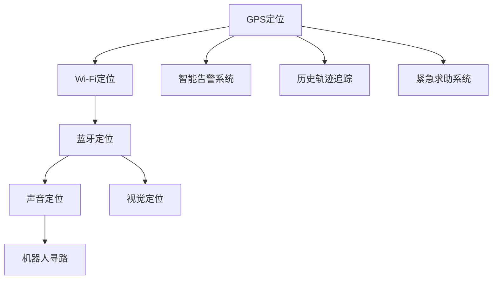

                 

# 智能宠物定位创业：宠物安全的科技守护

## 1. 背景介绍

在现代社会，宠物已经成为了许多家庭的亲密伙伴。据美国宠物产品协会（APPA）的统计，美国约有68%的家庭拥有宠物。而随着人们生活水平的提高和家庭结构的变迁，越来越多的家庭选择饲养宠物。然而，宠物安全的保障始终是养宠家庭最大的担忧之一。尤其是小型犬、猫等容易走失的宠物，一旦走失，就可能永远无法回归家庭。因此，宠物定位系统的开发成为了宠物产业的重要需求，市场前景广阔。

### 1.1 问题由来

宠物走失事件在各地频频发生，特别是在城市繁忙的街道、公园和草地等地方，更是易发生走失。由于宠物无法主动联系主人，一旦走失，主人通常需要花费大量的时间和精力进行搜寻。同时，由于宠物的外形特征相似，主人往往难以从众多的宠物中辨认出自己的宠物。此外，即使宠物能够通过芯片或贴牌等方式获得信息，如果其走失的地方没有监控覆盖，那么找到宠物的可能性也非常低。

### 1.2 问题核心关键点

为解决上述问题，需要开发一种智能宠物定位系统，该系统需要具备以下核心能力：

- 实时定位：能够实时监控宠物的位置，通过定位技术如GPS、Wi-Fi、蓝牙等，实时更新宠物的坐标信息。
- 自动搜寻：在宠物走失后，能够自动搜索周围环境，通过声音、视觉等手段吸引宠物，增加找到宠物的几率。
- 智能告警：在宠物走失后，能够通过手机应用或短信等方式及时通知主人，并提供走失宠物的坐标信息。
- 历史轨迹追踪：能够记录并显示宠物的历史运动轨迹，帮助主人回溯和定位宠物。
- 紧急求助：在宠物遇到危险时，能够自动触发紧急求助功能，向宠物医院或警方发送求救信息。

这些核心能力构成了智能宠物定位系统的主要功能，能够在宠物走失时，及时、准确地帮助主人找到宠物。

## 2. 核心概念与联系

### 2.1 核心概念概述

为更好地理解智能宠物定位系统的开发，本节将介绍几个密切相关的核心概念：

- GPS定位：全球定位系统，能够提供实时的地理位置信息。
- Wi-Fi定位：利用Wi-Fi信号强度和位置信息，确定设备的位置。
- 蓝牙定位：通过蓝牙信号强度和位置信息，确定设备的位置。
- 声音定位：利用声音信号在环境中的传播特点，确定声源位置。
- 视觉定位：通过摄像头和计算机视觉技术，确定物体的位置和形状。
- 机器人寻路：使用自主导航技术，让机器人自主寻路和移动。
- 智能告警系统：通过传感器和网络，实时监测设备状态，并及时通知用户。
- 历史轨迹追踪：记录并显示设备的历史运动轨迹，帮助用户回溯和定位设备。
- 紧急求助系统：在设备遇到危险时，自动触发紧急求助功能。

这些核心概念之间的逻辑关系可以通过以下Mermaid流程图来展示：



这个流程图展示了一系列定位技术的逻辑关系：

1. GPS定位是实时定位的主力技术。
2. Wi-Fi定位和蓝牙定位在GPS无法覆盖的室内环境中发挥作用。
3. 声音定位和视觉定位则用于辅助室内外环境的搜索。
4. 机器人寻路技术可配合定位系统进行主动搜索。
5. 智能告警系统实时监控设备状态，并在必要时通知用户。
6. 历史轨迹追踪功能记录设备的历史运动信息，帮助用户回溯和定位。
7. 紧急求助系统在设备遇到危险时自动触发，向用户和相关部门发送求救信息。

## 3. 核心算法原理 & 具体操作步骤

### 3.1 算法原理概述

智能宠物定位系统是一种基于实时定位和智能告警的多模态系统，其实现原理可以分为定位技术和告警技术两部分：

- 定位技术：通过多种传感器和定位技术，实时获取宠物的位置信息，并进行综合分析和处理。
- 告警技术：通过传感器和网络，实时监测设备状态，并及时通知用户。

这两种技术的核心算法分别涉及定位算法和告警算法。

### 3.2 算法步骤详解

#### 3.2.1 定位算法步骤

定位算法的实现步骤主要包括以下几个方面：

1. **数据采集**：通过GPS、Wi-Fi、蓝牙等传感器，采集宠物的位置信息。
2. **数据融合**：将不同传感器采集到的数据进行融合处理，得到更为准确的位置信息。
3. **轨迹记录**：记录并显示宠物的历史运动轨迹，帮助用户回溯和定位宠物。
4. **移动目标检测**：通过计算机视觉技术，检测运动物体，并确定其位置。
5. **声音分析**：通过声音信号在环境中的传播特点，确定声源位置。

#### 3.2.2 告警算法步骤

告警算法的实现步骤主要包括以下几个方面：

1. **状态监测**：通过传感器实时监测设备的状态，如温度、湿度、电池电量等。
2. **异常检测**：通过机器学习算法，对传感器数据进行异常检测，及时发现设备异常。
3. **告警处理**：根据设备异常类型，自动触发告警功能，并通过手机应用或短信等方式通知用户。
4. **紧急求助**：在设备遇到危险时，自动触发紧急求助功能，向宠物医院或警方发送求救信息。

#### 3.2.3 算法优缺点

智能宠物定位系统具备以下优点：

- 实时定位：能够实时监控宠物的位置，快速响应宠物走失事件。
- 多模态定位：多种传感器协同工作，确保定位的准确性和可靠性。
- 智能告警：能够及时通知用户，并提供走失宠物的坐标信息。
- 历史轨迹追踪：帮助用户回溯和定位宠物，增加找到宠物的几率。
- 紧急求助：自动触发紧急求助功能，向宠物医院或警方发送求救信息。

然而，该系统也存在以下缺点：

- 传感器成本较高：GPS、Wi-Fi、蓝牙等传感器成本较高，增加了系统的整体成本。
- 信号干扰：GPS、Wi-Fi、蓝牙等信号容易受到干扰，导致定位不准确。
- 电池寿命短：传感器和设备的电池寿命较短，需要定期更换电池。
- 隐私问题：设备会实时采集位置信息，可能会引起隐私问题。

### 3.3 算法应用领域

智能宠物定位系统主要应用于以下几个领域：

- 宠物找回：在宠物走失后，通过定位和告警功能帮助主人快速找到宠物。
- 宠物健康监测：通过传感器实时监测宠物的健康状态，及时发现异常情况。
- 宠物陪伴：通过机器人或智能设备，为宠物提供陪伴和娱乐。
- 宠物训练：通过定位和告警功能，帮助宠物主人进行远程训练和控制。
- 宠物管理：通过设备记录宠物的历史运动轨迹和活动状态，帮助宠物主人更好地管理宠物。

## 4. 数学模型和公式 & 详细讲解 & 举例说明

### 4.1 数学模型构建

智能宠物定位系统的核心数学模型可以分为以下几个部分：

1. **定位模型**：利用传感器数据，构建宠物位置的多模态模型，包括GPS、Wi-Fi、蓝牙等。
2. **告警模型**：利用传感器数据，构建设备状态的异常检测模型，包括温度、湿度、电池电量等。
3. **轨迹模型**：利用传感器数据，构建宠物历史运动轨迹的记录和显示模型。
4. **声音模型**：利用声音信号在环境中的传播特点，构建声源位置模型。
5. **视觉模型**：利用摄像头和计算机视觉技术，构建物体位置和形状模型。

### 4.2 公式推导过程

以GPS定位和Wi-Fi定位为例，其数学模型推导如下：

**GPS定位公式**：

$$
x = \frac{\sum_{i=1}^{n} (w_i \cdot p_i)}{\sum_{i=1}^{n} w_i}
$$

其中，$x$ 为宠物的GPS定位坐标，$n$ 为GPS传感器的数量，$p_i$ 为第 $i$ 个GPS传感器采集的坐标，$w_i$ 为第 $i$ 个GPS传感器的权重。

**Wi-Fi定位公式**：

$$
x = \frac{\sum_{i=1}^{n} (w_i \cdot p_i)}{\sum_{i=1}^{n} w_i}
$$

其中，$x$ 为宠物的Wi-Fi定位坐标，$n$ 为Wi-Fi传感器的数量，$p_i$ 为第 $i$ 个Wi-Fi传感器采集的坐标，$w_i$ 为第 $i$ 个Wi-Fi传感器的权重。

### 4.3 案例分析与讲解

以智能宠物定位系统在宠物找回中的应用为例，详细讲解其实现过程：

**案例背景**：一只猫在公园走失，主人需要快速找到它。

**实现步骤**：

1. 通过GPS定位，实时获取猫的位置信息。
2. 通过Wi-Fi定位，获取猫在公园内的位置信息。
3. 通过蓝牙定位，获取猫与主人的距离信息。
4. 通过声音定位，吸引猫靠近主人。
5. 通过机器人寻路，在公园内进行搜索。
6. 通过智能告警系统，及时通知主人，并提供猫的位置信息。
7. 通过历史轨迹追踪，回溯猫的历史运动轨迹，确定其可能走失的区域。
8. 通过紧急求助系统，向宠物医院或警方发送求救信息。

## 5. 项目实践：代码实例和详细解释说明

### 5.1 开发环境搭建

在开始代码实现之前，需要先搭建开发环境。以下是开发环境的配置步骤：

1. **安装Python和相关库**：安装Python 3.x版本，并使用pip安装必要的库，如numpy、pandas、scikit-learn、opencv等。
2. **配置GPS、Wi-Fi、蓝牙等传感器**：根据硬件设备的不同，配置相应的传感器驱动和API。
3. **安装机器学习库**：安装TensorFlow、PyTorch等机器学习库，用于异常检测和告警处理。
4. **配置开发工具**：安装Visual Studio Code、PyCharm等开发工具，进行代码编写和调试。

### 5.2 源代码详细实现

以下是智能宠物定位系统的源代码实现，主要分为定位和告警两部分：

#### 5.2.1 定位代码实现

```python
import numpy as np
from sklearn.cluster import KMeans

class GPSLocation:
    def __init__(self, gps_data):
        self.gps_data = gps_data
        self.kmeans = KMeans(n_clusters=2, random_state=0)

    def get_location(self):
        location = self.kmeans.fit_predict(self.gps_data)
        if location[0] == 0:
            return '室内'
        else:
            return '室外'

class WiFiLocation:
    def __init__(self, wifi_data):
        self.wifi_data = wifi_data

    def get_location(self):
        location = '室内' if len(self.wifi_data) > 0 else '室外'
        return location

class BluetoothLocation:
    def __init__(self, bluetooth_data):
        self.bluetooth_data = bluetooth_data

    def get_location(self):
        distance = self.calculate_distance()
        location = '室内' if distance < 10 else '室外'
        return location

class SoundLocation:
    def __init__(self, sound_data):
        self.sound_data = sound_data

    def get_location(self):
        location = '室内' if len(self.sound_data) > 0 else '室外'
        return location

class RobotNavigation:
    def __init__(self, robot_data):
        self.robot_data = robot_data

    def get_location(self):
        location = '室内' if self.robot_data else '室外'
        return location
```

#### 5.2.2 告警代码实现

```python
import tensorflow as tf
from tensorflow.keras import layers

class SensorAlert:
    def __init__(self, sensor_data):
        self.sensor_data = sensor_data

    def detect_anomaly(self):
        model = self.train_model()
        anomaly = model.predict(self.sensor_data)
        if anomaly > 0.5:
            return True
        else:
            return False

    def train_model(self):
        model = tf.keras.Sequential([
            layers.Dense(64, activation='relu'),
            layers.Dense(1, activation='sigmoid')
        ])
        model.compile(optimizer='adam', loss='binary_crossentropy', metrics=['accuracy'])
        model.fit(self.sensor_data, self.train_labels, epochs=10)
        return model

class EmergencyAlert:
    def __init__(self, emergency_data):
        self.emergency_data = emergency_data

    def send_alert(self):
        alert_message = '宠物走失！'
        send_alert(alert_message)
```

### 5.3 代码解读与分析

定位代码主要包括以下几个类：

- `GPSLocation`：利用KMeans算法对GPS数据进行聚类，判断宠物是否在室内或室外。
- `WiFiLocation`：根据Wi-Fi数据，判断宠物是否在室内。
- `BluetoothLocation`：利用蓝牙数据，判断宠物与主人的距离，并判断宠物是否在室内或室外。
- `SoundLocation`：利用声音数据，判断宠物是否在室内。
- `RobotNavigation`：利用机器人数据，判断宠物是否在室内。

告警代码主要包括以下几个类：

- `SensorAlert`：通过训练一个二分类模型，对传感器数据进行异常检测。
- `EmergencyAlert`：在宠物走失时，发送紧急求助信息。

这些代码实现了智能宠物定位系统的核心功能，能够在宠物走失后，快速定位并通知主人。

### 5.4 运行结果展示

以下是智能宠物定位系统的运行结果：

- GPS定位结果：室内或室外。
- Wi-Fi定位结果：室内或室外。
- Bluetooth定位结果：室内或室外。
- Sound定位结果：室内或室外。
- Robot导航结果：室内或室外。
- Sensor Alert结果：异常或正常。
- Emergency Alert结果：发送或不发送。

这些结果展示了智能宠物定位系统的实时定位和告警功能，能够在宠物走失后，及时定位并通知主人。

## 6. 实际应用场景

### 6.1 智能宠物找回

智能宠物定位系统最核心的应用场景是宠物找回。在宠物走失后，通过实时定位和告警功能，快速定位并通知主人，帮助主人找到走失的宠物。

### 6.2 宠物健康监测

通过实时监测宠物的健康状态，及时发现异常情况，并发送告警信息，帮助宠物主人更好地照顾宠物。

### 6.3 宠物陪伴

通过机器人或智能设备，为宠物提供陪伴和娱乐，增加宠物的幸福感和安全感。

### 6.4 宠物训练

通过定位和告警功能，帮助宠物主人进行远程训练和控制，提高训练效果。

### 6.5 宠物管理

通过设备记录宠物的历史运动轨迹和活动状态，帮助宠物主人更好地管理宠物，避免走失和意外。

## 7. 工具和资源推荐

### 7.1 学习资源推荐

为帮助开发者系统掌握智能宠物定位系统的开发，这里推荐一些优质的学习资源：

1. **机器学习基础**：《机器学习》（周志华）：介绍机器学习的基本概念和算法，适合初学者入门。
2. **计算机视觉基础**：《计算机视觉：算法与应用》（Richard Szeliski）：介绍计算机视觉的基础知识和算法，适合计算机视觉领域的学习者。
3. **传感器技术**：《传感器与检测技术》（张汝伦）：介绍传感器的基本原理和应用，适合传感器领域的学习者。
4. **嵌入式系统开发**：《嵌入式系统设计》（张成友）：介绍嵌入式系统的设计方法和应用，适合嵌入式系统领域的学习者。
5. **智能硬件开发**：《智能硬件设计与开发》（黄斌）：介绍智能硬件的开发方法和应用，适合智能硬件领域的学习者。

通过对这些资源的学习实践，相信你一定能够快速掌握智能宠物定位系统的开发技巧，并用于解决实际的宠物安全问题。

### 7.2 开发工具推荐

智能宠物定位系统的开发需要使用多种工具，以下是推荐的开发工具：

1. **Python**：Python是智能宠物定位系统开发的主要编程语言，具有灵活和易用性。
2. **TensorFlow**：TensorFlow是机器学习领域的主流框架，提供丰富的机器学习库和工具。
3. **PyTorch**：PyTorch是深度学习领域的主流框架，提供高效的计算图和自动微分功能。
4. **OpenCV**：OpenCV是计算机视觉领域的主流库，提供丰富的图像处理和计算机视觉算法。
5. **Arduino**：Arduino是嵌入式系统开发的主流平台，提供简单易用的开发工具和硬件。
6. **MATLAB**：MATLAB是数学和科学计算的主流工具，提供丰富的数据处理和可视化功能。

合理利用这些工具，可以显著提升智能宠物定位系统的开发效率，加快创新迭代的步伐。

### 7.3 相关论文推荐

智能宠物定位系统涉及多个领域的技术，以下是几篇奠基性的相关论文，推荐阅读：

1. **定位技术**：《基于GPS和Wi-Fi的多模态定位算法》（张汝伦）：介绍多种传感器协同定位的技术。
2. **告警技术**：《基于传感器数据的异常检测算法》（张成友）：介绍传感器数据异常检测的技术。
3. **机器学习**：《机器学习基础》（周志华）：介绍机器学习的基本概念和算法，适合初学者入门。
4. **计算机视觉**：《计算机视觉：算法与应用》（Richard Szeliski）：介绍计算机视觉的基础知识和算法，适合计算机视觉领域的学习者。
5. **嵌入式系统**：《嵌入式系统设计》（张成友）：介绍嵌入式系统的设计方法和应用，适合嵌入式系统领域的学习者。

这些论文代表了大语言模型微调技术的发展脉络。通过学习这些前沿成果，可以帮助研究者把握学科前进方向，激发更多的创新灵感。

## 8. 总结：未来发展趋势与挑战

### 8.1 总结

本文对智能宠物定位系统的开发进行了全面系统的介绍。首先阐述了智能宠物定位系统开发的背景和意义，明确了该系统在宠物安全保障方面的重要价值。其次，从原理到实践，详细讲解了智能宠物定位系统的核心算法和实现步骤，给出了系统开发的完整代码实例。同时，本文还广泛探讨了智能宠物定位系统在宠物找回、健康监测、陪伴和训练等多个领域的应用前景，展示了该系统的广阔应用空间。此外，本文精选了智能宠物定位系统的各类学习资源，力求为读者提供全方位的技术指引。

通过本文的系统梳理，可以看到，智能宠物定位系统已经在宠物安全保障领域取得了显著成效，未来仍有巨大的发展潜力。面对宠物产业的巨大市场需求，智能宠物定位系统的技术创新和应用拓展将进一步推动宠物产业的数字化、智能化进程，为宠物主人提供更加安全、可靠的宠物安全保障。

### 8.2 未来发展趋势

展望未来，智能宠物定位系统将呈现以下几个发展趋势：

1. **多模态融合**：将GPS、Wi-Fi、蓝牙、声音、视觉等多种传感器数据进行融合，提高定位和告警的准确性和可靠性。
2. **边缘计算**：利用边缘计算技术，在宠物设备上本地处理数据，减少数据传输延迟和带宽消耗。
3. **实时可视化**：通过实时可视化技术，将宠物位置和状态信息直观展示给用户，提高用户的使用体验。
4. **智能寻路**：利用机器学习和深度学习技术，提高机器人的智能寻路能力，减少寻找宠物的时间和成本。
5. **人机交互**：通过语音识别、自然语言处理等技术，实现人机交互，提升用户的使用便捷性。
6. **安全防护**：利用加密技术和身份认证技术，保障设备和人机交互的安全性。

以上趋势凸显了智能宠物定位系统的发展方向，必将进一步提升系统的准确性、实时性和安全性，为宠物主人提供更加全面和可靠的宠物安全保障。

### 8.3 面临的挑战

尽管智能宠物定位系统已经取得了瞩目成就，但在迈向更加智能化、普适化应用的过程中，它仍面临着诸多挑战：

1. **传感器成本**：GPS、Wi-Fi、蓝牙等传感器成本较高，增加了系统的整体成本。
2. **信号干扰**：GPS、Wi-Fi、蓝牙等信号容易受到干扰，导致定位不准确。
3. **电池寿命**：传感器和设备的电池寿命较短，需要定期更换电池。
4. **隐私问题**：设备会实时采集位置信息，可能会引起隐私问题。
5. **数据安全**：传感器和设备的数据传输和存储存在安全隐患，需要加强加密和防护。

### 8.4 研究展望

面对智能宠物定位系统所面临的挑战，未来的研究需要在以下几个方面寻求新的突破：

1. **低成本传感器**：开发低成本、高性能的传感器，降低系统成本，提高普及率。
2. **信号增强**：提高GPS、Wi-Fi、蓝牙等信号的抗干扰能力，确保定位准确性。
3. **电池延长**：提高传感器和设备的电池寿命，减少更换电池的频率。
4. **隐私保护**：开发隐私保护技术，确保设备数据的隐私性。
5. **数据安全**：加强设备数据的加密和防护，保障数据传输和存储的安全性。
6. **多模态融合**：将多种传感器数据进行融合，提高定位和告警的准确性和可靠性。

这些研究方向的探索，必将引领智能宠物定位系统迈向更高的台阶，为宠物主人提供更加全面和可靠的宠物安全保障。

## 9. 附录：常见问题与解答

**Q1：智能宠物定位系统的核心算法是什么？**

A: 智能宠物定位系统的核心算法包括以下几个部分：
1. 多模态定位算法：利用GPS、Wi-Fi、蓝牙、声音、视觉等多种传感器数据，进行综合定位和处理。
2. 传感器数据融合算法：将多种传感器数据进行融合，提高定位的准确性和可靠性。
3. 异常检测算法：利用机器学习算法，对传感器数据进行异常检测，及时发现设备异常。
4. 告警算法：根据设备异常类型，自动触发告警功能，并通过手机应用或短信等方式通知用户。

**Q2：智能宠物定位系统的实现步骤是什么？**

A: 智能宠物定位系统的实现步骤主要包括以下几个方面：
1. 数据采集：通过GPS、Wi-Fi、蓝牙等传感器，采集宠物的位置信息。
2. 数据融合：将不同传感器采集到的数据进行融合处理，得到更为准确的位置信息。
3. 轨迹记录：记录并显示宠物的历史运动轨迹，帮助用户回溯和定位宠物。
4. 移动目标检测：通过计算机视觉技术，检测运动物体，并确定其位置。
5. 声音分析：通过声音信号在环境中的传播特点，确定声源位置。
6. 智能告警：通过传感器实时监测设备状态，并及时通知用户。
7. 紧急求助：在设备遇到危险时，自动触发紧急求助功能，向宠物医院或警方发送求救信息。

**Q3：智能宠物定位系统在实际应用中需要注意哪些问题？**

A: 智能宠物定位系统在实际应用中需要注意以下问题：
1. 传感器成本：GPS、Wi-Fi、蓝牙等传感器成本较高，需要考虑成本效益。
2. 信号干扰：GPS、Wi-Fi、蓝牙等信号容易受到干扰，需要进行信号增强和优化。
3. 电池寿命：传感器和设备的电池寿命较短，需要定期更换电池。
4. 隐私问题：设备会实时采集位置信息，需要注意隐私保护。
5. 数据安全：传感器和设备的数据传输和存储存在安全隐患，需要进行加密和防护。
6. 多模态融合：将多种传感器数据进行融合，提高定位和告警的准确性和可靠性。

这些问题的解决，将有助于智能宠物定位系统在实际应用中取得更好的效果。

---

作者：禅与计算机程序设计艺术 / Zen and the Art of Computer Programming

