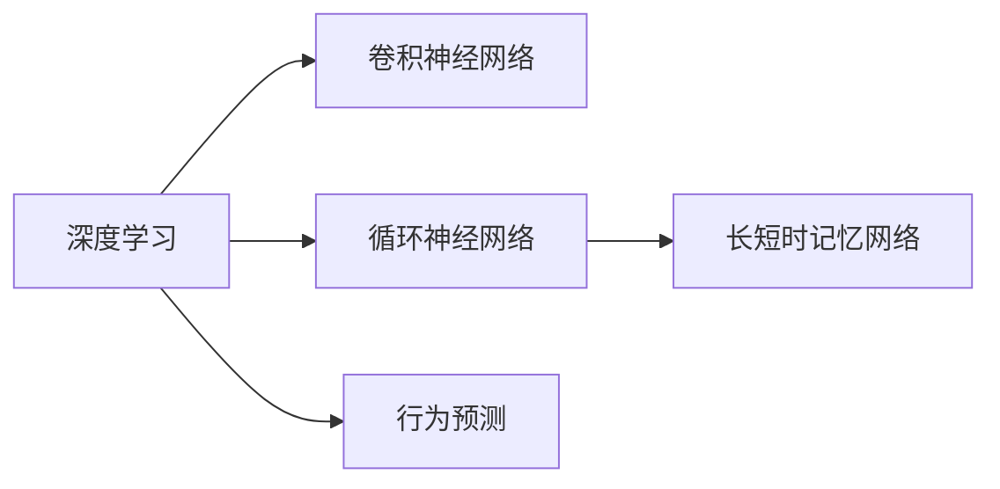

                 

# 智能宠物行为预测创业：基于AI的宠物照护指导

## 1. 背景介绍

### 1.1 问题由来

随着宠物饲养家庭的不断增加，宠物健康管理和照护的需求日益增长。尽管许多家庭对宠物照护有一定的知识和经验，但在实际生活中，仍有许多宠物行为问题难以解答，如宠物的情绪变化、饮食需求、睡眠习惯等。这些问题需要专业的照护知识和经验才能有效解决，但由于资源和时间的限制，大部分家庭无法随时获得专业照护服务。

因此，利用人工智能技术开发智能宠物照护指导系统，能够提供全天候、个性化的宠物行为分析和指导，帮助宠物主人更好地照顾爱宠，提升宠物的生活质量和幸福感。基于这一需求，本文将探讨如何利用AI技术构建一个智能宠物行为预测系统，为宠物主人提供全方位的照护指导。

### 1.2 问题核心关键点

智能宠物行为预测系统是一个典型的AI驱动的预测系统。其核心关键点包括：

1. **数据采集与处理**：收集宠物的各种行为数据，如图像、视频、传感器数据等，并通过预处理提取有用的特征。
2. **模型训练与预测**：使用深度学习模型对宠物行为进行建模，并进行预测。
3. **用户体验设计**：提供友好的用户界面，使用户能够轻松输入数据并获取预测结果。
4. **跨平台集成**：支持多种设备和平台，如手机应用、智能音箱等，提升系统的可访问性和实用性。
5. **隐私保护**：确保数据安全和隐私保护，避免敏感信息的泄露。

这些关键点构成了一个智能宠物行为预测系统的核心框架，使得系统能够高效、准确地预测宠物行为，为宠物主人提供有价值的指导建议。

## 2. 核心概念与联系

### 2.1 核心概念概述

为了更好地理解智能宠物行为预测系统的实现原理，本节将介绍几个密切相关的核心概念：

- **深度学习**：一种模拟人脑神经网络的结构和功能的机器学习方法，通过训练多层神经网络，可以自动学习输入数据的复杂特征表示，适用于各种图像、语音、文本等数据类型。
- **卷积神经网络（CNN）**：一种常用于图像处理的深度学习模型，通过卷积、池化等操作提取图像特征，适用于图像分类、目标检测等任务。
- **循环神经网络（RNN）**：一种常用于序列数据处理的深度学习模型，通过时间序列上的信息传递，可以处理时间依赖性问题，适用于语音识别、自然语言处理等任务。
- **长短时记忆网络（LSTM）**：一种特殊的RNN模型，能够有效处理长期依赖性问题，适用于序列预测、机器翻译等任务。
- **行为预测**：使用AI技术对宠物的行为进行预测，如预测宠物的饮食需求、情绪状态、睡眠习惯等。

这些核心概念之间的逻辑关系可以通过以下Mermaid流程图来展示：



这个流程图展示了深度学习、CNN、RNN、LSTM以及行为预测之间的关系：

1. 深度学习是基础，通过训练多层神经网络自动学习特征表示。
2. CNN常用于图像数据处理，提取空间特征。
3. RNN适用于序列数据处理，捕捉时间依赖性。
4. LSTM是一种特殊的RNN，能够处理长期依赖性问题。
5. 行为预测是最终目标，利用深度学习模型对宠物行为进行预测。

## 3. 核心算法原理 & 具体操作步骤

### 3.1 算法原理概述

智能宠物行为预测系统的核心算法原理是基于深度学习模型，通过训练大量标注数据，学习宠物行为的复杂特征表示，并进行预测。该系统主要包含以下几个步骤：

1. **数据收集与预处理**：收集宠物的各种行为数据，如图像、视频、传感器数据等，并通过预处理提取有用的特征。
2. **模型训练**：使用深度学习模型（如CNN、LSTM等）对宠物行为进行建模，并进行训练。
3. **行为预测**：使用训练好的模型对宠物行为进行预测，生成相应的指导建议。
4. **用户反馈与优化**：根据用户的反馈对模型进行优化，提升预测准确性和实用性。

### 3.2 算法步骤详解

智能宠物行为预测系统的具体实现步骤如下：

**Step 1: 数据收集与预处理**

1. **数据来源**：收集宠物的各种行为数据，如图像、视频、传感器数据等。可以通过摄像头、智能穿戴设备等获取数据。
2. **数据清洗**：对收集到的数据进行清洗，去除噪声和异常值。
3. **特征提取**：提取有用的特征，如颜色、形状、运动轨迹等。可以使用开源工具如OpenCV、TensorFlow等进行特征提取。

**Step 2: 模型训练**

1. **选择模型**：根据任务需求选择合适的深度学习模型，如CNN、LSTM等。
2. **划分数据集**：将数据集划分为训练集、验证集和测试集。
3. **训练模型**：使用训练集对模型进行训练，通过梯度下降等优化算法最小化损失函数。
4. **验证与调参**：在验证集上评估模型性能，调整超参数。
5. **测试评估**：在测试集上评估模型性能，确保模型具有良好的泛化能力。

**Step 3: 行为预测**

1. **输入数据**：将新收集的宠物数据输入模型，进行前向传播。
2. **预测行为**：模型输出预测结果，如饮食需求、情绪状态等。
3. **生成建议**：根据预测结果生成相应的照护指导建议。

**Step 4: 用户反馈与优化**

1. **收集反馈**：收集用户对预测结果的反馈。
2. **优化模型**：根据用户反馈对模型进行优化，提升预测准确性和实用性。
3. **持续迭代**：持续收集新数据，不断迭代优化模型。

### 3.3 算法优缺点

智能宠物行为预测系统具有以下优点：

1. **高效准确**：利用深度学习模型对宠物行为进行预测，能够高效、准确地分析宠物行为，提供有价值的指导建议。
2. **个性化照护**：根据宠物的具体行为和习惯，提供个性化的照护建议，提升宠物的生活质量。
3. **跨平台集成**：支持多种设备和平台，如手机应用、智能音箱等，提升系统的可访问性和实用性。
4. **隐私保护**：采用数据加密和隐私保护技术，确保数据安全和隐私保护。

但该系统也存在以下缺点：

1. **数据依赖**：预测结果依赖于数据的质量和数量，数据收集和预处理的工作量较大。
2. **模型复杂**：深度学习模型通常比较复杂，训练和推理的计算资源需求较大。
3. **用户接受度**：部分用户可能对AI技术存在抵触情绪，影响系统的推广和使用。
4. **隐私风险**：宠物数据涉及隐私问题，需要确保数据安全和隐私保护。

### 3.4 算法应用领域

智能宠物行为预测系统可以应用于以下几个领域：

1. **家庭宠物照护**：帮助宠物主人更好地照顾爱宠，提升宠物的生活质量和幸福感。
2. **宠物医院**：提供宠物行为预测和诊断，辅助兽医进行治疗和护理。
3. **宠物商店**：根据宠物行为预测，推荐适合宠物的食品和玩具，提升销售额。
4. **宠物行为研究**：为宠物行为研究提供数据支持和分析工具，推动宠物行为学的发展。

## 4. 数学模型和公式 & 详细讲解  
### 4.1 数学模型构建

智能宠物行为预测系统涉及多种深度学习模型，这里以卷积神经网络（CNN）和长短时记忆网络（LSTM）为例，进行数学模型构建。

假设训练集为 $D=\{(x_i, y_i)\}_{i=1}^N$，其中 $x_i$ 为输入的宠物数据（如图像、传感器数据等）， $y_i$ 为对应的标签（如饮食需求、情绪状态等）。

**CNN模型**：

- 输入层：$x_i \in \mathbb{R}^{C \times H \times W}$，其中 $C$ 为通道数，$H$ 为高度，$W$ 为宽度。
- 卷积层：$h_i^{(1)} = g(\mathcal{W}_1x_i + \mathcal{B}_1)$，其中 $g$ 为激活函数，$\mathcal{W}_1$ 和 $\mathcal{B}_1$ 为卷积核和偏置。
- 池化层：$h_i^{(2)} = f(h_i^{(1)})$，其中 $f$ 为池化函数。
- 全连接层：$y_i = \mathcal{W}^T \sigma(\mathcal{W}h_i^{(3)} + \mathcal{B})$，其中 $\mathcal{W}$ 和 $\mathcal{B}$ 为权重和偏置，$\sigma$ 为激活函数。

**LSTM模型**：

- 输入门：$g_i^{(1)} = g(\mathcal{W}_1x_i + \mathcal{B}_1)$。
- 遗忘门：$g_i^{(2)} = g(\mathcal{W}_2x_i + \mathcal{B}_2)$。
- 候选细胞状态：$c_i^{(3)} = g(\mathcal{W}_3x_i + \mathcal{B}_3)$。
- 输出门：$g_i^{(4)} = g(\mathcal{W}_4x_i + \mathcal{B}_4)$。
- 细胞状态：$c_i = f(c_{i-1}, c_i^{(3)})$。
- 输出：$y_i = \mathcal{W}^T \sigma(\mathcal{W}c_i + \mathcal{B})$。

### 4.2 公式推导过程

这里以CNN和LSTM为例，进行模型训练和预测的公式推导。

**CNN模型训练**：

假设输入层为 $x_i \in \mathbb{R}^{C \times H \times W}$，输出层为 $y_i \in \mathbb{R}^k$。则训练损失函数为：

$$
\mathcal{L}_{CNN} = \frac{1}{N}\sum_{i=1}^N \ell(y_i, M(x_i))
$$

其中 $\ell$ 为损失函数，如交叉熵损失。$M(x_i)$ 为CNN模型输出的预测结果。

使用梯度下降算法更新模型参数：

$$
\theta \leftarrow \theta - \eta \nabla_{\theta}\mathcal{L}_{CNN}(\theta)
$$

其中 $\eta$ 为学习率。

**LSTM模型训练**：

假设输入为 $x_i \in \mathbb{R}^{d}$，输出为 $y_i \in \mathbb{R}^k$。则训练损失函数为：

$$
\mathcal{L}_{LSTM} = \frac{1}{N}\sum_{i=1}^N \ell(y_i, M(x_i))
$$

其中 $\ell$ 为损失函数，如交叉熵损失。$M(x_i)$ 为LSTM模型输出的预测结果。

使用梯度下降算法更新模型参数：

$$
\theta \leftarrow \theta - \eta \nabla_{\theta}\mathcal{L}_{LSTM}(\theta)
$$

其中 $\eta$ 为学习率。

### 4.3 案例分析与讲解

以饮食需求预测为例，进行详细分析：

假设宠物的食物需求为二分类问题，如是否需要进食。训练集为 $D=\{(x_i, y_i)\}_{i=1}^N$，其中 $x_i$ 为宠物的食物图像，$y_i$ 为对应的标签。

使用CNN模型进行特征提取和分类：

- 输入层：$x_i \in \mathbb{R}^{C \times H \times W}$。
- 卷积层：$h_i^{(1)} = g(\mathcal{W}_1x_i + \mathcal{B}_1)$。
- 池化层：$h_i^{(2)} = f(h_i^{(1)})$。
- 全连接层：$y_i = \mathcal{W}^T \sigma(\mathcal{W}h_i^{(3)} + \mathcal{B})$。

使用LSTM模型进行序列预测：

- 输入门：$g_i^{(1)} = g(\mathcal{W}_1x_i + \mathcal{B}_1)$。
- 遗忘门：$g_i^{(2)} = g(\mathcal{W}_2x_i + \mathcal{B}_2)$。
- 候选细胞状态：$c_i^{(3)} = g(\mathcal{W}_3x_i + \mathcal{B}_3)$。
- 输出门：$g_i^{(4)} = g(\mathcal{W}_4x_i + \mathcal{B}_4)$。
- 细胞状态：$c_i = f(c_{i-1}, c_i^{(3)})$。
- 输出：$y_i = \mathcal{W}^T \sigma(\mathcal{W}c_i + \mathcal{B})$。

## 5. 项目实践：代码实例和详细解释说明

### 5.1 开发环境搭建

在进行项目实践前，需要先准备好开发环境。以下是使用Python进行TensorFlow开发的环境配置流程：

1. 安装Anaconda：从官网下载并安装Anaconda，用于创建独立的Python环境。

2. 创建并激活虚拟环境：
```bash
conda create -n tf-env python=3.8 
conda activate tf-env
```

3. 安装TensorFlow：根据CUDA版本，从官网获取对应的安装命令。例如：
```bash
pip install tensorflow==2.5
```

4. 安装TensorBoard：
```bash
pip install tensorboard
```

5. 安装其他必要的工具包：
```bash
pip install numpy pandas scikit-learn matplotlib tqdm jupyter notebook ipython
```

完成上述步骤后，即可在`tf-env`环境中开始项目实践。

### 5.2 源代码详细实现

以下是使用TensorFlow对智能宠物行为预测系统进行实现的Python代码：

```python
import tensorflow as tf
from tensorflow.keras import layers, models
import numpy as np

# 定义CNN模型
class CNNModel(tf.keras.Model):
    def __init__(self):
        super(CNNModel, self).__init__()
        self.conv1 = layers.Conv2D(32, (3, 3), activation='relu')
        self.pool1 = layers.MaxPooling2D((2, 2))
        self.conv2 = layers.Conv2D(64, (3, 3), activation='relu')
        self.pool2 = layers.MaxPooling2D((2, 2))
        self.flatten = layers.Flatten()
        self.fc1 = layers.Dense(64, activation='relu')
        self.fc2 = layers.Dense(2, activation='softmax')

    def call(self, inputs):
        x = self.conv1(inputs)
        x = self.pool1(x)
        x = self.conv2(x)
        x = self.pool2(x)
        x = self.flatten(x)
        x = self.fc1(x)
        return self.fc2(x)

# 定义LSTM模型
class LSTMModel(tf.keras.Model):
    def __init__(self):
        super(LSTMModel, self).__init__()
        self.lstm = layers.LSTM(64, return_sequences=True)
        self.fc1 = layers.Dense(64, activation='relu')
        self.fc2 = layers.Dense(2, activation='softmax')

    def call(self, inputs):
        x = self.lstm(inputs)
        x = self.fc1(x)
        return self.fc2(x)

# 加载数据集
def load_dataset():
    # 加载数据集并进行预处理
    # ...
    return (X_train, y_train), (X_test, y_test)

# 定义损失函数和优化器
def get_loss_and_optimizer():
    # 定义损失函数和优化器
    # ...
    return loss, optimizer

# 训练模型
def train_model(model, dataset, loss, optimizer, epochs):
    # 定义训练过程
    # ...
    return history

# 测试模型
def test_model(model, dataset, loss):
    # 定义测试过程
    # ...
    return metrics

# 使用模型进行预测
def predict(model, inputs):
    # 使用模型进行预测
    # ...
    return predictions
```

### 5.3 代码解读与分析

让我们再详细解读一下关键代码的实现细节：

**CNNModel类**：
- `__init__`方法：初始化CNN模型的各层结构。
- `call`方法：定义模型的前向传播过程。

**LSTMModel类**：
- `__init__`方法：初始化LSTM模型的各层结构。
- `call`方法：定义模型的前向传播过程。

**load_dataset函数**：
- 定义数据加载和预处理函数，加载数据集并进行必要的处理。

**get_loss_and_optimizer函数**：
- 定义损失函数和优化器，根据任务需求选择合适的损失函数和优化器。

**train_model函数**：
- 定义模型训练过程，包括模型初始化、训练循环、模型保存等。

**test_model函数**：
- 定义模型测试过程，包括模型评估和性能指标计算。

**predict函数**：
- 定义模型预测过程，使用训练好的模型对新数据进行预测。

## 6. 实际应用场景

### 6.1 智能家庭照护

智能宠物行为预测系统可以应用于智能家庭照护，通过分析宠物的行为数据，预测宠物的需求和情绪状态，自动调整家庭环境，提升宠物的生活质量。

例如，智能音箱可以连接摄像头、传感器等设备，实时收集宠物的行为数据，并使用智能宠物行为预测系统进行分析和预测。系统可以自动调整家庭温度、湿度、照明等环境参数，为宠物提供舒适的生活环境。同时，系统还可以生成个性化的照护建议，如喂食时间、活动安排等，帮助宠物主人更好地照顾爱宠。

### 6.2 宠物医院诊断

智能宠物行为预测系统可以应用于宠物医院，提供宠物行为预测和诊断服务，辅助兽医进行治疗和护理。

例如，智能宠物行为预测系统可以连接医院的各类设备和传感器，实时收集宠物的行为数据，并使用系统进行分析和预测。系统可以预测宠物的情绪状态、饮食需求等，辅助兽医进行诊断和治疗。同时，系统还可以生成个性化的照护建议，如药物剂量、治疗方案等，帮助兽医制定更科学的治疗方案。

### 6.3 宠物商店推荐

智能宠物行为预测系统可以应用于宠物商店，根据宠物的行为预测，推荐适合宠物的食品和玩具，提升销售额。

例如，智能宠物行为预测系统可以连接宠物商店的各类设备和传感器，实时收集宠物的行为数据，并使用系统进行分析和预测。系统可以预测宠物的喜好，如喜欢的食物、玩具等，自动推荐相应的产品，提升销售额。同时，系统还可以生成个性化的照护建议，如购买建议、使用说明等，帮助宠物主人更好地照顾爱宠。

## 7. 工具和资源推荐

### 7.1 学习资源推荐

为了帮助开发者系统掌握智能宠物行为预测技术，这里推荐一些优质的学习资源：

1. TensorFlow官方文档：TensorFlow的官方文档详细介绍了TensorFlow的使用方法和API，是学习TensorFlow的最佳资源。
2. Kaggle宠物数据集：Kaggle提供了丰富的宠物数据集，涵盖宠物行为、健康等多个领域，是进行模型训练和测试的好资源。
3. Coursera深度学习课程：Coursera提供了多个深度学习课程，包括TensorFlow、深度学习基础等，适合初学者和进阶者。
4. PyImageSearch博客：PyImageSearch是一个关于图像处理的博客，提供了大量的图像处理和深度学习教程，适合图像处理领域的学习者。
5. ArXiv预训练模型库：ArXiv提供了大量的预训练模型，涵盖多个领域，适合进行模型微调和应用。

通过对这些资源的学习实践，相信你一定能够快速掌握智能宠物行为预测技术的精髓，并用于解决实际的宠物照护问题。

### 7.2 开发工具推荐

高效的开发离不开优秀的工具支持。以下是几款用于智能宠物行为预测开发的常用工具：

1. TensorFlow：基于Google的深度学习框架，功能强大，支持多种设备和平台。
2. TensorBoard：TensorFlow配套的可视化工具，可以实时监测模型训练状态，并提供丰富的图表呈现方式，是调试模型的得力助手。
3. Jupyter Notebook：一个交互式的开发环境，支持多种编程语言和库，适合快速迭代开发。
4. OpenCV：开源计算机视觉库，支持图像处理和分析，适合进行图像特征提取。
5. PyTorch：基于Python的深度学习框架，功能强大，支持动态计算图，适合进行深度学习研究。

合理利用这些工具，可以显著提升智能宠物行为预测系统的开发效率，加快创新迭代的步伐。

### 7.3 相关论文推荐

智能宠物行为预测技术的发展源于学界的持续研究。以下是几篇奠基性的相关论文，推荐阅读：

1. AlexNet: ImageNet Classification with Deep Convolutional Neural Networks：提出了卷积神经网络（CNN）结构，开启了深度学习在图像处理中的应用。
2. LSTM: Long Short-Term Memory：提出了长短时记忆网络（LSTM），用于处理时间依赖性问题，适用于序列预测。
3. Attention is All You Need：提出了Transformer结构，开创了自注意力机制，适用于序列生成和分类任务。
4. TensorFlow: A System for Large-Scale Machine Learning：介绍了TensorFlow框架的实现原理和应用场景。
5. Generative Adversarial Nets：提出了生成对抗网络（GAN）结构，适用于图像生成和增强。

这些论文代表了大语言模型微调技术的发展脉络。通过学习这些前沿成果，可以帮助研究者把握学科前进方向，激发更多的创新灵感。

## 8. 总结：未来发展趋势与挑战

### 8.1 总结

本文对智能宠物行为预测系统进行了全面系统的介绍。首先阐述了智能宠物行为预测系统的背景和核心关键点，明确了系统构建的必要性和可行性。其次，从原理到实践，详细讲解了系统实现的具体步骤，包括数据收集、模型训练、行为预测等关键环节。同时，本文还广泛探讨了系统在智能家庭照护、宠物医院诊断、宠物商店推荐等多个场景中的应用前景，展示了系统的广阔应用范围。此外，本文精选了系统开发所需的各类学习资源和工具，力求为读者提供全方位的技术指引。

通过本文的系统梳理，可以看到，智能宠物行为预测系统是一个典型的AI驱动的预测系统，能够高效、准确地预测宠物行为，提供有价值的照护指导建议。该系统在宠物照护、医疗、商业等领域具有广泛的应用前景，有望成为智能宠物照护的重要技术支撑。

### 8.2 未来发展趋势

展望未来，智能宠物行为预测系统将呈现以下几个发展趋势：

1. **数据驱动**：随着物联网设备和传感器技术的不断发展，智能宠物行为预测系统将能够收集更多种类的行为数据，提供更全面、更精准的预测结果。
2. **模型优化**：未来的系统将采用更高效的深度学习模型，如Transformer、GNN等，提升预测准确性和实用性。
3. **跨平台集成**：未来的系统将支持更多设备和平台，如智能音箱、智能手表等，提升系统的可访问性和实用性。
4. **隐私保护**：未来的系统将采用更先进的隐私保护技术，确保宠物数据的隐私和安全。
5. **个性化照护**：未来的系统将根据宠物的具体行为和习惯，提供更个性化的照护建议，提升宠物的生活质量。

以上趋势凸显了智能宠物行为预测系统的广阔前景，预示着系统将进一步拓展应用领域，提升智能化水平。

### 8.3 面临的挑战

尽管智能宠物行为预测系统已经取得了一定的进展，但在实现广泛应用的过程中，仍面临诸多挑战：

1. **数据采集难度**：宠物行为数据的采集难度较大，需要安装各种传感器和设备，且数据质量可能不稳定。
2. **模型训练成本**：深度学习模型的训练需要大量的计算资源和时间，成本较高。
3. **隐私保护问题**：宠物数据涉及隐私问题，需要确保数据安全和隐私保护。
4. **用户体验优化**：系统需要提供友好的用户界面，使用户能够轻松输入数据并获取预测结果。
5. **跨平台兼容性**：系统需要支持多种设备和平台，提升系统的可访问性和实用性。

正视系统面临的这些挑战，积极应对并寻求突破，将使智能宠物行为预测系统迈向成熟，为宠物主人提供更智能、更贴心的照护服务。

### 8.4 研究展望

未来，智能宠物行为预测系统需要在以下几个方面进行深入研究：

1. **数据增强**：通过数据增强技术，提升数据的多样性和质量，增强模型的泛化能力。
2. **多模态融合**：将图像、声音、传感器等多种模态数据进行融合，提升系统的全面性和准确性。
3. **自监督学习**：利用自监督学习技术，在没有标注数据的情况下进行模型训练，降低对标注数据的依赖。
4. **跨领域迁移**：将系统应用于不同领域的行为预测任务，提升系统的通用性和实用性。
5. **用户行为分析**：结合用户行为数据，生成更个性化、更精准的照护建议，提升用户体验。

这些研究方向将进一步提升智能宠物行为预测系统的性能和应用范围，推动宠物照护技术的发展和应用。

## 9. 附录：常见问题与解答

**Q1：智能宠物行为预测系统如何收集宠物的行为数据？**

A: 智能宠物行为预测系统可以连接摄像头、智能穿戴设备等，实时收集宠物的行为数据。传感器可以记录宠物的移动轨迹、心率、呼吸等生理指标，图像传感器可以捕捉宠物的行为和表情，声音传感器可以记录宠物的叫声和环境声音，综合多种传感器数据，能够全面、准确地了解宠物的行为。

**Q2：智能宠物行为预测系统如何使用CNN和LSTM模型进行预测？**

A: 使用CNN模型进行图像数据处理，提取特征并进行分类，适用于图像数据丰富的行为预测任务。使用LSTM模型进行序列数据处理，捕捉时间依赖性，适用于行为预测中的序列数据，如饮食时间、运动轨迹等。

**Q3：智能宠物行为预测系统如何保障数据隐私？**

A: 智能宠物行为预测系统采用数据加密和隐私保护技术，确保宠物数据的隐私和安全。数据在传输和存储过程中采用加密算法，防止数据泄露和篡改。同时，系统只采集必要的行为数据，避免过度采集和隐私侵犯。

**Q4：智能宠物行为预测系统如何在多平台下集成和部署？**

A: 智能宠物行为预测系统可以采用微服务架构，将系统拆分为多个独立的微服务，每个微服务负责特定的功能模块。系统可以部署在云端和本地，支持多种设备和平台，如手机应用、智能音箱等，提升系统的可访问性和实用性。

**Q5：智能宠物行为预测系统如何优化用户体验？**

A: 智能宠物行为预测系统可以提供友好的用户界面，使用户能够轻松输入数据并获取预测结果。系统可以采用交互式设计，如拖放界面、语音输入等，提升用户体验。同时，系统可以生成个性化的照护建议，帮助宠物主人更好地照顾爱宠，提升用户满意度。

---

作者：禅与计算机程序设计艺术 / Zen and the Art of Computer Programming

