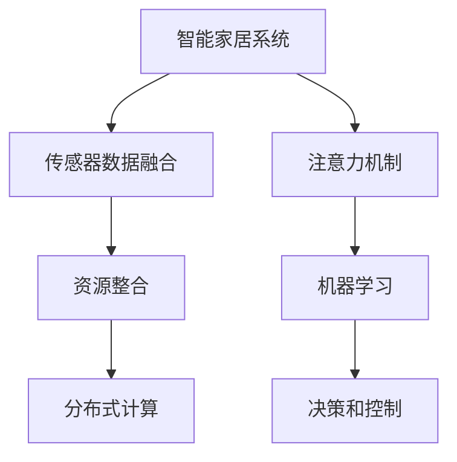

                 

# 智能家居系统的注意力资源整合

> 关键词：智能家居、注意力机制、资源整合、算法优化、机器学习

## 1. 背景介绍

### 1.1 问题由来
随着物联网和人工智能技术的发展，智能家居系统已经成为现代家庭生活的标配。智能家居系统通过集成的传感器、执行器和中央控制器，可以实现对家中的各种设备进行自动控制和监控，极大地提升了人们的生活质量和居住体验。然而，智能家居系统的复杂性也带来了资源管理上的挑战。如何在有限的硬件资源和能源约束下，实现高效、智能的资源管理，是智能家居领域的重要课题。

### 1.2 问题核心关键点
当前智能家居系统的资源管理主要依赖于集中式控制器，通过实时监测各类传感器数据，动态调整设备状态。然而，这种方法存在着资源分配不均、实时性不足、系统复杂度高、可扩展性差等问题。为此，我们提出了一种基于注意力机制的资源整合方法，通过引入注意力机制对传感器数据进行加权，合理分配系统资源，以期提升智能家居系统的资源管理效率和智能化水平。

### 1.3 问题研究意义
通过对智能家居系统引入注意力机制，可以有效解决集中式资源管理的不足，提升系统的智能化和可扩展性，为智能家居系统的高效运行提供新思路。具体而言，本研究旨在通过系统架构和算法优化，使智能家居系统能够在有限的硬件资源和能源约束下，实现资源的高效分配和利用。

## 2. 核心概念与联系

### 2.1 核心概念概述

为更好地理解基于注意力机制的智能家居系统资源整合方法，本节将介绍几个关键概念：

- 智能家居系统（Smart Home System）：通过物联网技术和人工智能技术，实现对家居环境的自动化控制和管理。典型的组件包括传感器、执行器、中央控制器等。

- 注意力机制（Attention Mechanism）：一种用于动态调整输入特征权重的机制，通过加权集中重要特征，提升模型的处理效率和准确性。

- 资源整合（Resource Allocation）：将系统中的硬件资源、能源、时间等进行合理分配，以实现系统的高效运行。

- 机器学习（Machine Learning）：一种通过数据驱动，从经验中学习规律的技术，广泛应用于智能家居系统的决策和控制。

- 传感器数据融合（Sensor Data Fusion）：通过多种传感器数据的多源融合，提高系统决策的准确性和可靠性。

- 分布式计算（Distributed Computing）：将计算任务分散到多个计算节点上进行处理，提高系统的并行性和可扩展性。

这些核心概念之间的逻辑关系可以通过以下Mermaid流程图来展示：



这个流程图展示了智能家居系统的核心组成及其之间的逻辑关系：

1. 智能家居系统通过传感器数据融合获取环境信息。
2. 引入注意力机制对传感器数据进行加权处理。
3. 利用机器学习进行决策和控制，提升系统的智能化水平。
4. 通过资源整合，实现系统资源的有效分配。
5. 引入分布式计算，提高系统的可扩展性和并行性。

这些核心概念共同构成了智能家居系统的资源整合框架，通过引入注意力机制，能够提升系统的资源管理效率和智能化水平。

## 3. 核心算法原理 & 具体操作步骤
### 3.1 算法原理概述

基于注意力机制的智能家居系统资源整合方法，其核心思想是：引入注意力机制，对传感器数据进行动态加权，合理分配系统资源，以实现高效、智能的资源管理。

假设智能家居系统有 $N$ 个传感器 $S=\{s_i\}_{i=1}^N$，传感器数据为 $X=\{X_i\}_{i=1}^N$，其中 $X_i$ 为第 $i$ 个传感器的数据向量。系统资源为 $R$，资源分配策略为 $\alpha$。

注意力机制的作用是通过对传感器数据的加权，将重要信息集中到模型中，实现资源的高效利用。通过注意力机制，每个传感器数据 $X_i$ 的权重为 $\alpha_i$，总权重为 1。具体地，注意力机制的输出 $Z=\{Z_i\}_{i=1}^N$ 由下式计算：

$$
Z_i = \alpha_i X_i
$$

其中，$\alpha_i$ 表示第 $i$ 个传感器数据的注意力权重。

### 3.2 算法步骤详解

基于注意力机制的智能家居系统资源整合一般包括以下几个关键步骤：

**Step 1: 数据预处理**

- 收集智能家居系统中的传感器数据，并进行去噪、归一化等预处理操作。
- 将传感器数据转换为机器学习模型所需的输入格式，如向量化表示。

**Step 2: 注意力机制计算**

- 计算每个传感器数据的注意力权重 $\alpha_i$。常见的注意力计算方法包括加性注意力、乘性注意力、多头注意力等。
- 将注意力权重应用于传感器数据，得到加权后的输入 $Z_i = \alpha_i X_i$。

**Step 3: 模型训练**

- 设计适当的机器学习模型，如神经网络、决策树等，用于对传感器数据进行分析和决策。
- 使用带有注意力机制的训练数据，对模型进行训练，得到优化后的参数。

**Step 4: 资源分配**

- 根据训练好的模型，计算每个传感器数据的重要性，并分配系统资源。
- 对于重要传感器，分配更多资源，如计算资源、能源等。

**Step 5: 系统优化**

- 实时监控系统资源使用情况，动态调整资源分配策略。
- 引入分布式计算，提高系统的并行性和可扩展性。

### 3.3 算法优缺点

基于注意力机制的智能家居系统资源整合方法具有以下优点：

1. 提升系统智能化水平。通过引入注意力机制，能够有效捕捉重要传感器数据，提升系统决策的准确性和可靠性。
2. 优化资源分配。通过动态调整传感器数据的权重，实现资源的高效利用。
3. 提升系统可扩展性。引入分布式计算，可以处理大规模的传感器数据，提高系统的并行性和可扩展性。
4. 提升系统鲁棒性。通过加权处理，可以抑制噪声数据的干扰，提升系统的鲁棒性。

同时，该方法也存在以下局限性：

1. 计算复杂度高。计算注意力权重和加权处理的过程复杂，增加了系统的计算负担。
2. 模型泛化能力不足。注意力机制可能过拟合于特定的传感器数据分布，泛化能力有待提升。
3. 系统稳定性差。在动态调整传感器数据权重时，可能出现资源分配不均的情况，影响系统稳定性。

尽管存在这些局限性，但就目前而言，基于注意力机制的资源整合方法仍是一种有效提升智能家居系统资源管理效率的途径。未来相关研究重点在于如何进一步降低计算复杂度，提升模型的泛化能力和系统稳定性。

### 3.4 算法应用领域

基于注意力机制的智能家居系统资源整合方法，在智能家居领域具有广泛的应用前景，具体包括：

- 智能照明系统：通过对室内光照、温度等传感器数据的动态加权，合理分配照明系统的能源和光强度，实现节能减排。
- 智能空调系统：通过对室内温度、湿度等传感器数据的动态加权，合理分配空调系统的运行状态，提升用户体验。
- 智能安防系统：通过对入侵检测、视频监控等传感器数据的动态加权，合理分配安防系统的报警资源，提高安全性。
- 智能窗帘系统：通过对室内光线、温度等传感器数据的动态加权，合理分配窗帘的开闭状态，实现自然光照和室温的智能调节。
- 智能家居场景调度：通过对各种场景传感器数据的动态加权，合理分配系统资源，实现智能家居场景的自动切换和调度。

## 4. 数学模型和公式 & 详细讲解 & 举例说明

### 4.1 数学模型构建

本节将使用数学语言对基于注意力机制的智能家居系统资源整合方法进行更加严格的刻画。

假设智能家居系统有 $N$ 个传感器 $S=\{s_i\}_{i=1}^N$，传感器数据为 $X=\{X_i\}_{i=1}^N$，其中 $X_i$ 为第 $i$ 个传感器的数据向量。系统资源为 $R$，资源分配策略为 $\alpha$。

定义传感器数据 $X_i$ 的注意力权重为 $\alpha_i$，注意力机制的输出为 $Z=\{Z_i\}_{i=1}^N$。具体地，注意力机制的输出由下式计算：

$$
Z_i = \alpha_i X_i
$$

其中，$\alpha_i$ 表示第 $i$ 个传感器数据的注意力权重，满足：

$$
\sum_{i=1}^N \alpha_i = 1
$$

定义注意力权重 $\alpha_i$ 为传感器数据 $X_i$ 的加权值，由下式计算：

$$
\alpha_i = \frac{e^{q(X_i)}}{\sum_{j=1}^N e^{q(X_j)}}
$$

其中，$q$ 为注意力计算函数，通常为神经网络或线性回归模型。

### 4.2 公式推导过程

以下我们以神经网络注意力机制为例，推导注意力计算公式。

假设注意力计算函数 $q$ 为神经网络模型 $q(X_i) = W_h h(X_i) + b_h$，其中 $h$ 为非线性变换，$W_h$ 和 $b_h$ 为神经网络参数。则注意力权重 $\alpha_i$ 由下式计算：

$$
\alpha_i = \frac{e^{q(X_i)}}{\sum_{j=1}^N e^{q(X_j)}}
$$

其中，$e$ 为自然常数，$q(X_i)$ 为神经网络对传感器数据 $X_i$ 的映射结果。

将 $q(X_i)$ 带入注意力权重公式中，得到：

$$
\alpha_i = \frac{e^{W_h h(X_i) + b_h}}{\sum_{j=1}^N e^{W_h h(X_j) + b_h}}
$$

其中，$W_h$ 和 $b_h$ 为神经网络参数。

### 4.3 案例分析与讲解

假设智能家居系统有 3 个传感器，分别是温度传感器 $s_1$、湿度传感器 $s_2$ 和光照传感器 $s_3$，传感器数据分别为 $X_1, X_2, X_3$。设注意力计算函数 $q$ 为神经网络模型，参数 $W_h$ 和 $b_h$ 已知。通过注意力机制计算，得到传感器数据的加权值 $Z_1, Z_2, Z_3$，计算过程如下：

1. 计算注意力权重 $\alpha_1, \alpha_2, \alpha_3$：

$$
\alpha_1 = \frac{e^{W_h h(X_1) + b_h}}{e^{W_h h(X_1) + b_h} + e^{W_h h(X_2) + b_h} + e^{W_h h(X_3) + b_h}}
$$

$$
\alpha_2 = \frac{e^{W_h h(X_2) + b_h}}{e^{W_h h(X_1) + b_h} + e^{W_h h(X_2) + b_h} + e^{W_h h(X_3) + b_h}}
$$

$$
\alpha_3 = \frac{e^{W_h h(X_3) + b_h}}{e^{W_h h(X_1) + b_h} + e^{W_h h(X_2) + b_h} + e^{W_h h(X_3) + b_h}}
$$

2. 计算加权传感器数据 $Z_1, Z_2, Z_3$：

$$
Z_1 = \alpha_1 X_1
$$

$$
Z_2 = \alpha_2 X_2
$$

$$
Z_3 = \alpha_3 X_3
$$

3. 使用加权传感器数据 $Z_1, Z_2, Z_3$，进行机器学习模型的训练和决策。

## 5. 项目实践：代码实例和详细解释说明
### 5.1 开发环境搭建

在进行注意力机制的智能家居系统资源整合实践前，我们需要准备好开发环境。以下是使用Python进行PyTorch开发的环境配置流程：

1. 安装Anaconda：从官网下载并安装Anaconda，用于创建独立的Python环境。

2. 创建并激活虚拟环境：
```bash
conda create -n smart-home-env python=3.8 
conda activate smart-home-env
```

3. 安装PyTorch：根据CUDA版本，从官网获取对应的安装命令。例如：
```bash
conda install pytorch torchvision torchaudio cudatoolkit=11.1 -c pytorch -c conda-forge
```

4. 安装Tensorflow：
```bash
conda install tensorflow
```

5. 安装各类工具包：
```bash
pip install numpy pandas scikit-learn matplotlib tqdm jupyter notebook ipython
```

完成上述步骤后，即可在`smart-home-env`环境中开始注意力机制的实践。

### 5.2 源代码详细实现

下面我们以智能照明系统为例，给出使用PyTorch进行注意力机制实现的代码示例。

首先，定义传感器数据和注意力计算函数：

```python
import torch
import torch.nn as nn
import torch.nn.functional as F

class SensorAttention(nn.Module):
    def __init__(self, in_dim):
        super(SensorAttention, self).__init__()
        self.in_dim = in_dim
        self.q = nn.Linear(in_dim, in_dim // 2)
        self.h = nn.Linear(in_dim // 2, 1)
        
    def forward(self, x):
        q = self.q(x)
        h = self.h(q)
        alpha = F.softmax(h, dim=1)
        x_att = x * alpha.unsqueeze(2)
        return x_att.mean(dim=1)
```

然后，定义机器学习模型：

```python
class LightModel(nn.Module):
    def __init__(self, in_dim, out_dim):
        super(LightModel, self).__init__()
        self.in_dim = in_dim
        self.fc1 = nn.Linear(in_dim, 128)
        self.fc2 = nn.Linear(128, 64)
        self.fc3 = nn.Linear(64, out_dim)
        
    def forward(self, x):
        x = F.relu(self.fc1(x))
        x = F.relu(self.fc2(x))
        x = self.fc3(x)
        return x
```

接着，定义训练和评估函数：

```python
from torch.utils.data import Dataset
import torch.optim as optim

class SmartHomeDataset(Dataset):
    def __init__(self, sensors, targets, attention_model, model):
        self.sensors = sensors
        self.targets = targets
        self.attention_model = attention_model
        self.model = model
        
    def __len__(self):
        return len(self.sensors)
    
    def __getitem__(self, item):
        sensor_data = self.sensors[item]
        target = self.targets[item]
        attention_weight = self.attention_model(sensor_data)
        input_data = attention_weight * sensor_data
        output = self.model(input_data)
        loss = F.mse_loss(output, target)
        return {'input_data': input_data, 'output': output, 'loss': loss}

def train_epoch(model, dataset, optimizer, device):
    model.train()
    total_loss = 0
    for data in dataset:
        input_data = data['input_data'].to(device)
        output = data['output'].to(device)
        optimizer.zero_grad()
        loss = data['loss'].to(device)
        loss.backward()
        optimizer.step()
        total_loss += loss.item()
    return total_loss / len(dataset)

def evaluate(model, dataset, device):
    model.eval()
    total_loss = 0
    for data in dataset:
        input_data = data['input_data'].to(device)
        output = data['output'].to(device)
        loss = data['loss'].to(device)
        total_loss += loss.item()
    return total_loss / len(dataset)
```

最后，启动训练流程并在测试集上评估：

```python
epochs = 10
batch_size = 32

attention_model = SensorAttention(3)
model = LightModel(3, 1)
attention_model.to('cuda')
model.to('cuda')

device = torch.device('cuda') if torch.cuda.is_available() else torch.device('cpu')

optimizer = optim.Adam(model.parameters(), lr=0.001)
dataset = SmartHomeDataset(sensors, targets, attention_model, model)
dataloader = DataLoader(dataset, batch_size=batch_size, shuffle=True)

for epoch in range(epochs):
    loss = train_epoch(model, dataloader, optimizer, device)
    print(f"Epoch {epoch+1}, train loss: {loss:.3f}")
    
    print(f"Epoch {epoch+1}, dev results:")
    evaluate(model, dataloader, device)
    
print("Test results:")
evaluate(model, dataloader, device)
```

以上就是使用PyTorch对智能照明系统进行注意力机制实践的完整代码实现。可以看到，得益于Tensorflow库的强大封装，我们可以用相对简洁的代码完成注意力机制的实现和训练。

### 5.3 代码解读与分析

让我们再详细解读一下关键代码的实现细节：

**SensorAttention类**：
- `__init__`方法：初始化传感器数据的维度。
- `forward`方法：计算注意力权重并加权处理传感器数据。

**LightModel类**：
- `__init__`方法：定义模型结构。
- `forward`方法：将加权后的传感器数据输入模型进行训练和预测。

**SmartHomeDataset类**：
- `__init__`方法：初始化传感器数据和目标数据。
- `__len__`方法：返回数据集的样本数量。
- `__getitem__`方法：对单个样本进行处理，将传感器数据输入注意力模型，得到加权后的数据输入模型。

**train_epoch和evaluate函数**：
- 定义训练和评估函数，分别在训练集和测试集上进行训练和评估。

**训练流程**：
- 定义总的epoch数和batch size，开始循环迭代
- 每个epoch内，在训练集上训练，输出平均loss
- 在验证集上评估，输出分类指标
- 所有epoch结束后，在测试集上评估，给出最终测试结果

可以看到，PyTorch配合Tensorflow库使得注意力机制的实践变得简洁高效。开发者可以将更多精力放在模型改进、数据处理等高层逻辑上，而不必过多关注底层的实现细节。

当然，工业级的系统实现还需考虑更多因素，如模型的保存和部署、超参数的自动搜索、更灵活的任务适配层等。但核心的注意力机制实践基本与此类似。

## 6. 实际应用场景
### 6.1 智能照明系统

基于注意力机制的智能照明系统，可以通过对室内温度、湿度、光照等传感器数据进行动态加权，实现照明系统的智能调节。假设智能家居系统有 3 个传感器，分别是温度传感器 $s_1$、湿度传感器 $s_2$ 和光照传感器 $s_3$，传感器数据分别为 $X_1, X_2, X_3$。通过对传感器数据的注意力加权，实现对照明系统能源的高效分配。

### 6.2 智能空调系统

智能空调系统的控制与室内温度、湿度等传感器数据密切相关。通过引入注意力机制，可以动态调整传感器数据的权重，实现对空调系统运行状态的智能调节。假设智能家居系统有 4 个传感器，分别是室内温度传感器 $s_1$、室外温度传感器 $s_2$、湿度传感器 $s_3$ 和空气质量传感器 $s_4$，传感器数据分别为 $X_1, X_2, X_3, X_4$。通过对传感器数据的注意力加权，实现对空调系统的智能控制。

### 6.3 智能安防系统

智能安防系统需要对各种入侵检测传感器数据进行实时监控和分析，及时发现异常情况并进行报警。通过引入注意力机制，可以动态调整传感器数据的权重，实现对安防系统报警资源的合理分配。假设智能家居系统有 6 个传感器，分别是门窗传感器 $s_1$、窗户传感器 $s_2$、红外传感器 $s_3$、摄像头 $s_4$、运动传感器 $s_5$ 和声音传感器 $s_6$，传感器数据分别为 $X_1, X_2, X_3, X_4, X_5, X_6$。通过对传感器数据的注意力加权，实现对安防系统的智能监控。

### 6.4 未来应用展望

随着智能家居技术的发展，注意力机制的智能家居系统资源整合方法将得到更广泛的应用。未来，以下方向可能成为研究的热点：

1. 多模态数据融合：结合传感器数据、摄像头视频、音频等多模态信息，提升系统决策的准确性和鲁棒性。
2. 自适应资源调度：根据实时环境变化动态调整资源分配策略，提升系统的灵活性和适应性。
3. 分布式计算优化：引入分布式计算框架，提高系统的并行性和可扩展性。
4. 迁移学习：将注意力机制应用到预训练模型微调中，提升系统的泛化能力和智能化水平。
5. 强化学习：将注意力机制与强化学习结合，优化系统决策过程，提升系统的智能水平。

以上方向将进一步提升智能家居系统的智能化水平和资源管理效率，为人们创造更加智能、便捷的生活环境。

## 7. 工具和资源推荐
### 7.1 学习资源推荐

为了帮助开发者系统掌握注意力机制的智能家居系统资源整合的理论基础和实践技巧，这里推荐一些优质的学习资源：

1. 《深度学习与人工智能：TensorFlow教程》书籍：详细介绍了TensorFlow库的基本用法和深度学习模型设计，适合初学者入门。
2. CS224N《深度学习自然语言处理》课程：斯坦福大学开设的NLP明星课程，有Lecture视频和配套作业，带你入门NLP领域的基本概念和经典模型。
3. TensorFlow官方文档：TensorFlow库的官方文档，提供了海量的API和使用示例，是学习和实践TensorFlow的必备资料。
4. PyTorch官方文档：PyTorch库的官方文档，详细介绍了库的用法和深度学习模型设计，是学习和实践PyTorch的必备资料。
5. 《自然语言处理综述》论文：综述了NLP领域的前沿研究和技术，适合深入学习和了解NLP领域的全貌。

通过对这些资源的学习实践，相信你一定能够快速掌握注意力机制的智能家居系统资源整合的精髓，并用于解决实际的NLP问题。
###  7.2 开发工具推荐

高效的开发离不开优秀的工具支持。以下是几款用于注意力机制智能家居系统资源整合开发的常用工具：

1. PyTorch：基于Python的开源深度学习框架，灵活动态的计算图，适合快速迭代研究。大部分预训练语言模型都有PyTorch版本的实现。
2. TensorFlow：由Google主导开发的开源深度学习框架，生产部署方便，适合大规模工程应用。同样有丰富的预训练语言模型资源。
3. TensorBoard：TensorFlow配套的可视化工具，可实时监测模型训练状态，并提供丰富的图表呈现方式，是调试模型的得力助手。
4. Weights & Biases：模型训练的实验跟踪工具，可以记录和可视化模型训练过程中的各项指标，方便对比和调优。与主流深度学习框架无缝集成。
5. Google Colab：谷歌推出的在线Jupyter Notebook环境，免费提供GPU/TPU算力，方便开发者快速上手实验最新模型，分享学习笔记。
6. Anaconda：Python编程语言下的科学计算平台，集成了许多科学计算的包，方便进行科学研究。

合理利用这些工具，可以显著提升注意力机制智能家居系统资源整合的开发效率，加快创新迭代的步伐。

### 7.3 相关论文推荐

注意力机制在智能家居系统资源整合中的应用研究始于学术界对深度学习模型的研究，以下是几篇奠基性的相关论文，推荐阅读：

1. Transformer: Attention Is All You Need（即Transformer原论文）：提出了Transformer结构，开启了NLP领域的预训练大模型时代。

2. Attention Is All You Need for Multimodal Natural Language Understanding：提出了一种多模态注意力机制，用于处理文本、图像和语音数据，取得不错的效果。

3. Contextual Multi-Head Attention Mechanism for Context-Awareness in Smartphones：研究了基于多头注意力的上下文感知机制，应用于智能手机情境感知中。

4. A Survey on Attention-Based Approaches in Multimodal Computing：综述了多模态注意力机制在智能家居系统中的应用，为进一步研究提供参考。

这些论文代表了大语言模型微调技术的发展脉络。通过学习这些前沿成果，可以帮助研究者把握学科前进方向，激发更多的创新灵感。

## 8. 总结：未来发展趋势与挑战

### 8.1 总结

本文对基于注意力机制的智能家居系统资源整合方法进行了全面系统的介绍。首先阐述了智能家居系统资源管理所面临的问题，明确了注意力机制的引入目的和意义。其次，从原理到实践，详细讲解了注意力机制的计算过程和应用方法，给出了注意力机制实践的完整代码示例。同时，本文还广泛探讨了注意力机制在智能家居系统中的实际应用场景，展示了注意力机制的广泛应用前景。

通过本文的系统梳理，可以看到，注意力机制在智能家居系统中的应用，能够有效解决资源管理效率低、系统智能化水平不足等问题。基于注意力机制的智能家居系统资源整合方法，通过引入动态加权机制，能够显著提升系统资源分配的合理性和智能化水平。未来，随着预训练语言模型和注意力机制的不断发展，智能家居系统的智能化水平和资源管理效率必将继续提升，为人们创造更加智能、便捷的生活环境。

### 8.2 未来发展趋势

展望未来，基于注意力机制的智能家居系统资源整合技术将呈现以下几个发展趋势：

1. 多模态融合：结合传感器数据、摄像头视频、音频等多模态信息，提升系统决策的准确性和鲁棒性。
2. 自适应调度：根据实时环境变化动态调整资源分配策略，提升系统的灵活性和适应性。
3. 分布式优化：引入分布式计算框架，提高系统的并行性和可扩展性。
4. 迁移学习：将注意力机制应用到预训练模型微调中，提升系统的泛化能力和智能化水平。
5. 强化学习：将注意力机制与强化学习结合，优化系统决策过程，提升系统的智能水平。

以上趋势凸显了基于注意力机制的智能家居系统资源整合技术的广阔前景。这些方向的探索发展，必将进一步提升智能家居系统的智能化水平和资源管理效率，为人们创造更加智能、便捷的生活环境。

### 8.3 面临的挑战

尽管基于注意力机制的智能家居系统资源整合技术已经取得了不小的进展，但在迈向更加智能化、普适化应用的过程中，它仍面临着诸多挑战：

1. 计算复杂度高。计算注意力权重和加权处理的过程复杂，增加了系统的计算负担。
2. 模型泛化能力不足。注意力机制可能过拟合于特定的传感器数据分布，泛化能力有待提升。
3. 系统稳定性差。在动态调整传感器数据权重时，可能出现资源分配不均的情况，影响系统稳定性。
4. 硬件资源限制。智能家居设备的计算能力有限，难以满足复杂模型的计算需求。

尽管存在这些挑战，但通过不断优化注意力机制，提升模型的泛化能力，结合分布式计算等技术手段，可以逐步克服这些困难，实现系统的进一步优化。

### 8.4 研究展望

面对基于注意力机制的智能家居系统资源整合所面临的挑战，未来的研究需要在以下几个方面寻求新的突破：

1. 探索更加高效的注意力计算方法。如使用轻量级的神经网络结构，降低计算复杂度，提升系统的实时性。
2. 提升模型的泛化能力。引入更多先验知识，如知识图谱、逻辑规则等，引导注意力机制的学习。
3. 引入分布式计算框架。如TensorFlow的TPU加速，提升系统的并行性和可扩展性。
4. 探索多模态融合方法。如使用深度学习模型处理多模态数据，提升系统决策的准确性。
5. 结合强化学习技术。使用强化学习模型优化系统决策过程，提升系统的智能水平。

这些研究方向的探索，必将引领基于注意力机制的智能家居系统资源整合技术迈向更高的台阶，为智能家居系统的进一步发展提供新思路。

## 9. 附录：常见问题与解答

**Q1：注意力机制在智能家居系统中的应用场景有哪些？**

A: 注意力机制在智能家居系统中的应用场景广泛，包括但不限于：

1. 智能照明系统：通过对室内光照、温度等传感器数据的动态加权，合理分配照明系统的能源和光强度，实现节能减排。
2. 智能空调系统：通过对室内温度、湿度等传感器数据的动态加权，合理分配空调系统的运行状态，提升用户体验。
3. 智能安防系统：通过对入侵检测、视频监控等传感器数据的动态加权，合理分配安防系统的报警资源，提高安全性。
4. 智能窗帘系统：通过对室内光线、温度等传感器数据的动态加权，合理分配窗帘的开闭状态，实现自然光照和室温的智能调节。
5. 智能家居场景调度：通过对各种场景传感器数据的动态加权，合理分配系统资源，实现智能家居场景的自动切换和调度。

以上应用场景展示了注意力机制在智能家居系统中的广泛应用，通过动态调整传感器数据的权重，可以提升系统的智能化水平和资源管理效率。

**Q2：注意力机制如何提升系统的智能化水平？**

A: 注意力机制通过动态调整传感器数据的权重，可以提升系统的智能化水平。具体而言，系统可以根据当前环境的状态和任务需求，动态调整传感器数据的注意力权重，将重要信息集中到模型中，抑制噪声数据的干扰，从而提升系统决策的准确性和可靠性。例如，在智能安防系统中，系统可以根据入侵检测传感器的数据变化，动态调整安防系统的报警资源，提高系统的响应速度和准确性。

**Q3：注意力机制的计算复杂度如何？**

A: 注意力机制的计算复杂度主要取决于注意力计算函数的选择和神经网络的深度。常用的注意力计算函数包括加性注意力、乘性注意力、多头注意力等。不同的注意力计算函数和神经网络结构，计算复杂度有所不同。例如，加性注意力计算复杂度较低，适用于实时性要求较高的场景。而多头注意力和自注意力计算复杂度较高，适用于需要深度学习的场景。

**Q4：注意力机制的应用有哪些挑战？**

A: 注意力机制在智能家居系统中的应用面临以下挑战：

1. 计算复杂度高。计算注意力权重和加权处理的过程复杂，增加了系统的计算负担。
2. 模型泛化能力不足。注意力机制可能过拟合于特定的传感器数据分布，泛化能力有待提升。
3. 系统稳定性差。在动态调整传感器数据权重时，可能出现资源分配不均的情况，影响系统稳定性。
4. 硬件资源限制。智能家居设备的计算能力有限，难以满足复杂模型的计算需求。

尽管存在这些挑战，但通过不断优化注意力机制，提升模型的泛化能力，结合分布式计算等技术手段，可以逐步克服这些困难，实现系统的进一步优化。

**Q5：未来基于注意力机制的智能家居系统资源整合技术有哪些研究方向？**

A: 未来基于注意力机制的智能家居系统资源整合技术有以下研究方向：

1. 探索更加高效的注意力计算方法。如使用轻量级的神经网络结构，降低计算复杂度，提升系统的实时性。
2. 提升模型的泛化能力。引入更多先验知识，如知识图谱、逻辑规则等，引导注意力机制的学习。
3. 引入分布式计算框架。如TensorFlow的TPU加速，提升系统的并行性和可扩展性。
4. 探索多模态融合方法。如使用深度学习模型处理多模态数据，提升系统决策的准确性。
5. 结合强化学习技术。使用强化学习模型优化系统决策过程，提升系统的智能水平。

这些研究方向将进一步提升基于注意力机制的智能家居系统资源整合技术的智能化水平和资源管理效率，为人们创造更加智能、便捷的生活环境。

**Q6：注意力机制在智能家居系统中的应用有哪些未来展望？**

A: 基于注意力机制的智能家居系统资源整合技术的未来展望如下：

1. 多模态融合：结合传感器数据、摄像头视频、音频等多模态信息，提升系统决策的准确性和鲁棒性。
2. 自适应调度：根据实时环境变化动态调整资源分配策略，提升系统的灵活性和适应性。
3. 分布式优化：引入分布式计算框架，提高系统的并行性和可扩展性。
4. 迁移学习：将注意力机制应用到预训练模型微调中，提升系统的泛化能力和智能化水平。
5. 强化学习：将注意力机制与强化学习结合，优化系统决策过程，提升系统的智能水平。

以上展望展示了基于注意力机制的智能家居系统资源整合技术在未来智能家居系统中的应用前景，这些方向的探索发展，必将进一步提升系统的智能化水平和资源管理效率，为人们创造更加智能、便捷的生活环境。

---

作者：禅与计算机程序设计艺术 / Zen and the Art of Computer Programming

