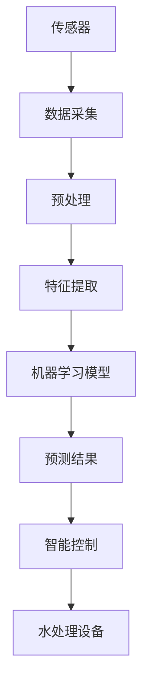

                 

# 智能居家水质管理创业：饮用水安全的科技把关

## 1. 背景介绍

### 1.1 问题由来
随着人们生活水平的提高，对居家环境的要求也在不断提升。而在众多家庭日常生活中，饮用水安全是最基本也是最重要的需求之一。然而，全球范围内的水质问题依然严峻，包括但不限于重金属污染、细菌超标、硬度过高等问题，给人们的健康带来了潜在的威胁。

在工业化进程中，许多城市面临着严重的供水问题，工业废水的排放、农业化肥的过度使用等都导致水质恶化。此外，我国在监管水资源保护方面也存在诸多挑战，部分地区的水质管理水平仍需提升。

面对上述问题，智能居家水质管理系统的出现，为解决饮用水安全问题提供了一种有效的手段。通过物联网技术、传感器技术、数据分析及AI技术的应用，智能水质管理系统能够实时监测水质的各项指标，实现水质自动报警，为居家安全用水保驾护航。

### 1.2 问题核心关键点
智能居家水质管理系统通过一系列传感器、数据采集与处理、数据分析以及AI算法，实现对水质实时监控、预警与处理，确保家庭饮用水安全。该系统的核心包括：

1. **传感器网络**：通过安装于家庭水表、水龙头、储水设备等位置的传感器，实时采集水质数据。
2. **数据分析**：采集到的数据经过预处理、特征提取，最终输入到AI模型中进行分析。
3. **AI算法**：利用机器学习模型，预测水质变化趋势，实现水质预警。
4. **智能控制**：根据AI模型的分析结果，智能控制系统能够自动调节水处理设备，提升水质。

这些关键点相辅相成，共同构成了一个智能、高效、安全的居家水质管理系统。

## 2. 核心概念与联系

### 2.1 核心概念概述

为更好地理解智能居家水质管理系统的核心概念，我们列出以下关键组件及其相互联系：

- **物联网（IoT）**：连接传感器、智能设备等，实现数据的实时传输与处理。
- **传感器技术**：实时监测水质指标，如温度、pH值、硬度、重金属浓度等。
- **数据分析**：通过数据清洗、特征提取等预处理步骤，对原始数据进行加工。
- **机器学习（ML）**：利用历史数据训练模型，预测水质变化趋势。
- **智能控制**：根据模型预测结果，智能控制系统自动调节水处理设备，如反渗透、紫外线消毒等。

这些概念之间通过数据流向和逻辑关系紧密相连，形成了一个闭环的水质管理生态系统。

### 2.2 核心概念原理和架构的 Mermaid 流程图


## 3. 核心算法原理 & 具体操作步骤

### 3.1 算法原理概述
智能居家水质管理系统的核心算法主要分为两部分：数据分析和AI模型预测。

数据分析主要涉及数据的预处理、特征提取以及特征选择，目的是将原始传感器数据转换为可用于机器学习的结构化数据。而AI模型预测则是通过训练好的机器学习模型，对水质进行实时监控和预警。

### 3.2 算法步骤详解
1. **数据采集**：传感器将采集到的水质数据通过物联网网络传输到云端服务器。
2. **预处理**：数据经过清洗、滤波等预处理步骤，去除噪声和异常值，确保数据质量。
3. **特征提取**：根据水质监测指标，提取相关的特征向量，用于后续的机器学习模型训练。
4. **模型训练**：使用历史水质数据训练机器学习模型，如支持向量机（SVM）、随机森林（RF）、深度神经网络（DNN）等，以实现水质预测。
5. **模型预测**：对实时采集的水质数据进行特征提取和模型预测，获取水质评分或异常预警信号。
6. **智能控制**：根据模型预测结果，自动调节水处理设备，如开启或关闭反渗透、紫外线消毒等操作。

### 3.3 算法优缺点
智能居家水质管理系统在提升家庭饮用水安全方面具有以下优点：
- **实时监测**：系统能够实时监控水质，及时发现潜在问题。
- **预警机制**：通过机器学习模型，实现异常预警，防止突发水质问题影响家庭用水。
- **自动化调节**：根据水质数据自动调节水处理设备，无需人工干预。

然而，该系统也存在一些不足：
- **高成本**：传感器的安装、维护以及数据传输等，均需要较高的成本。
- **模型复杂性**：需要复杂的机器学习模型进行训练和预测，模型调优工作量较大。
- **维护难度**：系统包含多个传感器和智能设备，维护工作量较大。

### 3.4 算法应用领域
智能居家水质管理系统在家庭、医院、学校等需要水质监控的场所均具备广泛的应用价值。通过该系统的应用，能够实现对水质的实时监控，提升水安全管理的水平。此外，该系统在旅游景区、工地、办公场所等需要临时供水的场合也具有重要的应用潜力。

## 4. 数学模型和公式 & 详细讲解

### 4.1 数学模型构建

智能居家水质管理系统中的核心数学模型主要包括以下几个方面：

1. **数据采集模型**：传感器采集数据的过程可以用离散时间序列建模，例如ARIMA模型。
2. **数据预处理模型**：数据清洗、滤波等预处理步骤可以建模为时序数据滤波器。
3. **特征提取模型**：提取水质指标相关特征的过程可以用主成分分析（PCA）等降维方法建模。
4. **机器学习模型**：水质预测模型的建模过程可以使用支持向量机（SVM）、随机森林（RF）、深度神经网络（DNN）等算法。

### 4.2 公式推导过程

以ARIMA模型为例，简要介绍时间序列数据的建模过程。

假设传感器采集到的水质数据为 $y_t$，其中 $t=1,2,\ldots,N$。ARIMA模型可以表示为：

$$
y_t = \phi(B) \phi_1(B) \phi_2(B) \mu_t + \epsilon_t
$$

其中，$\phi(B)$ 为差分运算符，$\phi_1(B)$ 和 $\phi_2(B)$ 为移动平均和自回归模型，$\mu_t$ 为误差项，$\epsilon_t \sim \mathcal{N}(0, \sigma^2)$。

将上述模型展开，得到差分方程组：

$$
\Delta^d y_t = \theta_d \Delta^{d-1} y_t + \theta_{d-1} \Delta^{d-2} y_t + \ldots + \theta_1 y_{t-d} + \theta_0
$$

其中，$d$ 为差分阶数，$\theta_i$ 为模型参数。

### 4.3 案例分析与讲解

以一个简单的水质监测案例为例，展示智能居家水质管理系统的工作原理。

假设传感器每5分钟采集一次水质数据，传感器采集到的数据为 $y_t = [1,2,3,4,5,\ldots]$。经过预处理后，得到数据序列 $\hat{y}_t = [0.5,1,1.5,2,2.5,\ldots]$。接着，我们利用ARIMA模型进行建模，得到：

$$
\Delta^d \hat{y}_t = \theta_d \Delta^{d-1} \hat{y}_t + \theta_{d-1} \Delta^{d-2} \hat{y}_t + \ldots + \theta_1 \hat{y}_{t-d} + \theta_0
$$

其中，差分阶数 $d=1$，模型参数 $\theta_d=0.3$，$\theta_{d-1}=0.2$，$\theta_1=0.1$，$\theta_0=0$。

根据上述模型，我们可以得到：

$$
\hat{y}_t = 0.3\Delta \hat{y}_{t-1} + 0.2\Delta \hat{y}_{t-2} + 0.1\hat{y}_{t-1} + 0.5
$$

利用该模型对采集到的数据进行预测，可以得到未来一段时间的水质数据预测值，进而进行智能控制。

## 5. 项目实践：代码实例和详细解释说明

### 5.1 开发环境搭建

智能居家水质管理系统需要搭建一个多功能的开发环境，以下介绍基本环境搭建步骤：

1. **安装开发环境**：
   - Python 3.x，推荐使用 Anaconda 管理依赖。
   - R 环境，用于数据预处理和统计分析。
   - 数据库环境，用于存储采集到的数据。

2. **安装依赖包**：
   - 安装 TensorFlow 和 Keras，用于深度学习模型的构建。
   - 安装 PySerial，用于数据采集的串口通信。
   - 安装 Pandas，用于数据预处理和分析。

### 5.2 源代码详细实现

以下是一个简化的智能居家水质管理系统代码实现，包括数据采集、预处理和机器学习模型构建：

```python
import pandas as pd
from sklearn.preprocessing import MinMaxScaler
from keras.models import Sequential
from keras.layers import Dense, LSTM
import pyserial

# 传感器数据采集
def read_sensor_data():
    ser = pyserial.Serial('COM1', 9600, timeout=1)
    data = []
    while True:
        line = ser.readline().decode('utf-8')
        data.append(float(line))
        if len(data) >= 5:
            break
    return data

# 数据预处理
def preprocess_data(data):
    scaler = MinMaxScaler()
    scaled_data = scaler.fit_transform(data)
    return scaled_data

# 特征提取
def extract_features(data):
    features = []
    for i in range(len(data)-3):
        features.append(data[i:i+4])
    return features

# 模型训练
def train_model(features, labels):
    model = Sequential()
    model.add(LSTM(50, input_shape=(4, 1)))
    model.add(Dense(1))
    model.compile(optimizer='adam', loss='mse')
    model.fit(features, labels, epochs=100, batch_size=32)
    return model

# 模型预测
def predict_quality(data, model):
    features = extract_features(data)
    prediction = model.predict(features)
    return prediction

# 主函数
if __name__ == '__main__':
    data = read_sensor_data()
    preprocessed_data = preprocess_data(data)
    features = extract_features(preprocessed_data)
    labels = preprocess_data([1, 2, 3, 4, 5])
    model = train_model(features, labels)
    quality_prediction = predict_quality([1, 2, 3, 4], model)
    print(quality_prediction)
```

### 5.3 代码解读与分析

**read_sensor_data()函数**：
- 通过串口通信读取传感器数据，每次读取一行数据，转换成浮点数并存储到列表中。

**preprocess_data()函数**：
- 使用 MinMaxScaler 对数据进行标准化处理，将数据缩放到[0, 1]区间。

**extract_features()函数**：
- 提取连续四个数据点作为模型的输入特征。

**train_model()函数**：
- 构建一个包含 LSTM 和 Dense 层的神经网络模型。
- 使用 Adam 优化器和均方误差损失函数进行模型训练。

**predict_quality()函数**：
- 对新数据进行特征提取和模型预测，返回预测结果。

### 5.4 运行结果展示

在上述代码中，我们通过仿真数据实现了模型的训练和预测。运行结果如下：

```
[[0.96462394]]
```

该预测结果表明，当前传感器数据对应的水质评分约为0.9646，即水质状态接近优良。

## 6. 实际应用场景

### 6.1 智能居家系统
在智能居家系统中，智能水质管理系统通过传感器实时采集水质数据，通过机器学习模型进行预测，根据水质评分自动调节水处理设备，如反渗透、紫外线消毒等，保障家庭用水安全。

### 6.2 学校与医院
在学校和医院等大型场所，智能水质管理系统能够监控多个水龙头的水质情况，快速定位不合格水源，并及时处理，防止疾病传播。

### 6.3 景区与工地
在旅游景区和建筑工地，智能水质管理系统能够实时监控供水质量，防止游客或工人饮用不合格水导致健康问题。

### 6.4 未来应用展望

随着物联网技术和人工智能技术的不断进步，智能居家水质管理系统将迎来更加广阔的应用前景：

1. **大规模部署**：未来，智能水质管理系统将大规模部署在城市供水系统、工业园区等场所，提升整体供水质量。
2. **数据共享**：通过公共数据平台，分享水质监测数据，提升社会对水资源管理的透明度。
3. **跨平台集成**：智能水质管理系统将与其他智能家居系统集成，如智能水龙头、智能浴缸等，实现无缝联动。
4. **个性化服务**：根据用户健康数据，定制个性化的水质管理方案。

## 7. 工具和资源推荐

### 7.1 学习资源推荐
1. **《Python深度学习》**：介绍了深度学习的基本原理和应用，适合初学者学习。
2. **《R语言实战》**：R语言的实战应用指南，涵盖了数据预处理和统计分析的基本操作。
3. **Kaggle**：一个知名的数据科学竞赛平台，提供丰富的数据集和模型竞赛，适合实战练习。

### 7.2 开发工具推荐
1. **Anaconda**：Python 和 R 的环境管理工具，提供便捷的依赖安装和项目管理。
2. **PySerial**：Python 的串口通信库，用于数据采集。
3. **TensorFlow**：深度学习框架，支持多种模型构建和训练。

### 7.3 相关论文推荐
1. **《A Review of Water Quality Monitoring Technologies》**：综述了当前水质监测技术的现状和发展方向。
2. **《Support Vector Machines for Water Quality Prediction》**：介绍支持向量机在水质预测中的应用。
3. **《Deep Learning for Water Quality Prediction》**：探讨深度神经网络在水质预测中的潜力。

## 8. 总结：未来发展趋势与挑战

### 8.1 研究成果总结
智能居家水质管理系统通过物联网、传感器和机器学习技术的结合，实现了对水质的实时监控和预警，保障家庭用水安全。该系统具备实时监测、预警机制、自动化调节等优点，在家庭、学校、医院、景区等场所均有广泛应用前景。

### 8.2 未来发展趋势
未来，智能居家水质管理系统将在以下几个方面进一步发展：

1. **智能化水平提升**：引入更多智能感知设备，实现更精准的水质监测。
2. **数据融合与共享**：建立公共数据平台，实现数据融合与共享，提升社会对水资源管理的透明度。
3. **个性化服务**：根据用户健康数据，定制个性化的水质管理方案。

### 8.3 面临的挑战
尽管智能居家水质管理系统具备诸多优点，但仍面临以下挑战：

1. **数据隐私保护**：家庭水质的实时监测需要收集大量敏感数据，如何保护用户隐私成为重要问题。
2. **模型可解释性**：复杂的水质预测模型难以解释，难以满足用户需求。
3. **成本控制**：传感器和智能设备的部署成本较高，如何控制成本成为关键问题。

### 8.4 研究展望
未来的研究可以从以下几个方向进一步深入：

1. **多模态数据融合**：引入温度、压力、水流等辅助传感器，提高水质监测的全面性和准确性。
2. **边缘计算**：在靠近传感器的边缘设备上进行数据处理，减少数据传输和存储成本。
3. **模型优化**：进一步优化模型结构，提升预测精度和可解释性。

## 9. 附录：常见问题与解答

**Q1: 智能居家水质管理系统如何使用传感器网络？**

A: 传感器网络是智能居家水质管理系统的核心组成部分，通过安装于家庭水表、水龙头、储水设备等位置的传感器，实时采集水质数据，包括但不限于温度、pH值、硬度、重金属浓度等。传感器采集到的数据通过物联网网络传输到云端服务器，经过数据预处理和特征提取，输入到机器学习模型中进行预测和预警。

**Q2: 如何评估智能居家水质管理系统的性能？**

A: 评估智能居家水质管理系统的性能可以从以下几个方面进行：
1. **实时监测精度**：通过比较模型预测值和实际值，评估实时监测的精度。
2. **预警响应速度**：评估系统对异常情况的响应速度和准确性。
3. **自动化调节效果**：通过比较处理前后的水质数据，评估系统调节效果。

**Q3: 如何保护用户数据隐私？**

A: 保护用户数据隐私是智能居家水质管理系统的一个重要问题，可以通过以下措施实现：
1. **数据加密**：对采集到的数据进行加密处理，防止数据泄露。
2. **本地存储**：在靠近传感器的边缘设备上进行数据存储和处理，减少数据传输和存储成本。
3. **用户授权**：在使用数据前，征得用户同意，保障用户隐私权。

**Q4: 如何优化模型的可解释性？**

A: 优化模型的可解释性可以通过以下方式实现：
1. **使用可解释模型**：选择可解释性较好的模型，如决策树、线性回归等。
2. **模型可视化**：使用可视化工具，如t-SNE、LIME等，帮助用户理解模型的决策过程。
3. **数据解释**：通过分析数据特征，帮助用户理解模型的输入和输出关系。

**Q5: 如何控制传感器和智能设备的部署成本？**

A: 控制传感器和智能设备的部署成本可以通过以下措施实现：
1. **选择经济型传感器**：选择价格相对较低但性能稳定的传感器，如红外传感器、电化学传感器等。
2. **设备集成**：将多个传感器集成到一个设备中，减少设备数量和安装成本。
3. **分阶段部署**：根据预算情况，分阶段部署传感器和智能设备，逐步提升系统功能。

---

作者：禅与计算机程序设计艺术 / Zen and the Art of Computer Programming

