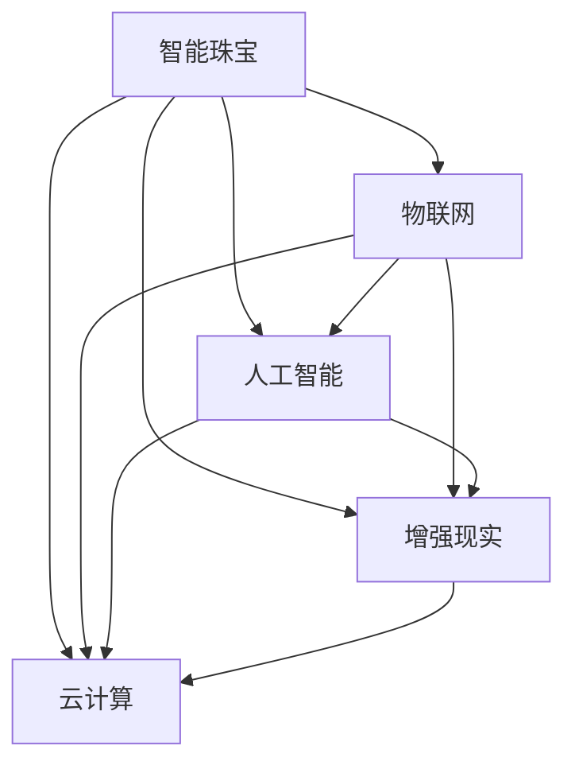

                 

# 智能珠宝创业：科技与奢侈品的结合

## 1. 背景介绍

### 1.1 问题由来

智能珠宝这一新兴领域，结合了前沿科技与传统奢侈品的优势，代表了一个全新的消费趋势。传统的珠宝行业，以手工制作、精湛工艺、稀有材质为主导，但随着消费者对个性化、互动性、智能化的需求不断增长，传统珠宝行业需要借助科技手段进行创新与转型。

智能珠宝不仅仅是指将传统珠宝与物联网、人工智能等技术结合，实现实时监控、个性化推荐、增强现实(AR)展示等功能，更是指通过这些技术的集成，为消费者提供更加沉浸、便捷、安全的购物体验。随着科技的进步，智能珠宝的发展前景愈发广阔，吸引了越来越多科技创业者和传统珠宝商的关注。

### 1.2 问题核心关键点

智能珠宝的创业，涉及以下几个核心问题：

1. **技术集成**：如何将物联网、AI、AR等前沿技术无缝集成到传统珠宝产品中，并实现功能稳定、用户体验优秀。
2. **硬件设计**：如何设计出体积小巧、美观耐用的硬件载体，符合消费者对珠宝的审美和使用习惯。
3. **数据隐私**：智能珠宝采集了大量用户的个人信息和行为数据，如何保证这些数据的隐私和安全。
4. **商业模式**：如何通过智能珠宝构建新的商业模式，从传统的珠宝销售模式向服务化、订阅化转变。
5. **用户教育**：如何教育用户，使其充分理解并接受智能珠宝的价值和使用方式。

这些关键问题的解决，需要跨学科、跨领域的知识和技术，对创业者和开发者提出了较高的要求。

### 1.3 问题研究意义

智能珠宝的创业，对于推动传统珠宝行业数字化转型，提升消费者体验，拓展新兴消费市场具有重要意义：

1. **推动行业升级**：智能珠宝的集成与应用，能显著提升珠宝产品的附加值，引领珠宝行业的升级换代。
2. **提升用户体验**：通过科技手段，智能珠宝能够提供更加个性化、互动化的购物体验，提升消费者的满意度和忠诚度。
3. **开拓新市场**：智能珠宝覆盖了更广泛的使用场景，如个性化定制、健康监测、社交互动等，有助于开拓新的市场空间。
4. **促进创新发展**：智能珠宝的创业，需要技术、设计、商业等各个领域的协同创新，为新兴技术在传统行业的落地应用提供了新契机。

## 2. 核心概念与联系

### 2.1 核心概念概述

为更好地理解智能珠宝创业的核心概念，本节将介绍几个密切相关的核心概念：

- **智能珠宝**：结合了物联网、人工智能、增强现实等技术，实现实时监控、个性化推荐、AR展示等功能的珠宝产品。
- **物联网(IoT)**：通过互联网将各种设备、系统、数据等互联互通，实现数据的自动采集和处理。
- **人工智能(AI)**：使用机器学习、深度学习等技术，使机器具备理解、学习、推理能力，辅助决策。
- **增强现实(AR)**：通过计算机技术，在现实世界中叠加虚拟信息，增强用户的感知体验。
- **云计算**：通过远程计算资源，实现数据的存储、计算和分析，支持智能珠宝的实时互动与个性化服务。

这些核心概念之间的逻辑关系可以通过以下Mermaid流程图来展示：



这个流程图展示了一系列核心概念的相互作用关系：

1. 智能珠宝将物联网技术引入珠宝产品，实现数据的自动采集与传输。
2. 利用人工智能技术，对采集的数据进行深度学习和处理，实现个性化推荐、实时监控等功能。
3. 增强现实技术将虚拟信息叠加到现实世界，提升用户的感知和互动体验。
4. 云计算提供强大的计算和存储能力，支持智能珠宝的实时互动与个性化服务。

这些技术手段的融合，使得智能珠宝具备了传统珠宝所不具备的功能，为消费者提供了全新的体验。

## 3. 核心算法原理 & 具体操作步骤
### 3.1 算法原理概述

智能珠宝的开发，主要基于以下几个核心算法：

1. **数据采集与传输**：通过物联网技术，实时采集珠宝的物理参数、位置信息、用户行为等数据，并通过云计算平台进行存储和处理。
2. **数据建模与分析**：利用机器学习算法，对采集的数据进行建模和分析，实现珠宝的个性化推荐、健康监测等功能。
3. **增强现实展示**：通过AR技术，在用户佩戴智能珠宝时，展示虚拟信息，如珠宝的历史、价值、佩戴场景等。
4. **用户交互与反馈**：通过自然语言处理(NLP)和语音识别技术，实现用户与珠宝的互动，收集用户的反馈信息，优化珠宝的功能。

这些算法的集成和应用，使得智能珠宝能够提供更加个性化、互动化的体验。

### 3.2 算法步骤详解

智能珠宝的开发流程，主要包括以下几个关键步骤：

**Step 1: 硬件设计**

智能珠宝的硬件设计需要考虑体积、外观、材料等多个因素，以符合珠宝的审美和使用习惯。一般采用微型芯片、柔性屏幕等技术，实现珠宝的智能化功能。

**Step 2: 传感器集成**

在硬件载体上集成各种传感器，如温度传感器、加速度传感器、陀螺仪等，用于实时采集珠宝的物理参数和用户行为。

**Step 3: 数据传输与存储**

通过物联网技术，将采集的数据实时传输到云端，利用云计算平台进行存储和处理。考虑到数据传输的实时性和安全性，一般采用低功耗蓝牙(Bluetooth Low Energy, BLE)、Wi-Fi等传输方式。

**Step 4: 数据建模与分析**

利用机器学习算法，对采集的数据进行建模和分析，实现珠宝的个性化推荐、健康监测等功能。具体步骤如下：
1. 数据预处理：清洗、归一化、特征提取等操作，准备训练数据。
2. 模型选择与训练：选择适合的机器学习模型，如决策树、随机森林、神经网络等，对数据进行训练。
3. 模型评估与优化：利用交叉验证等方法，评估模型性能，调整超参数，优化模型。

**Step 5: 增强现实展示**

利用AR技术，将虚拟信息叠加到珠宝的现实世界中，提升用户的感知和互动体验。具体步骤如下：
1. 图像采集：通过摄像头等设备，实时采集珠宝的图像信息。
2. 虚拟信息生成：利用AR引擎，根据珠宝的特征信息，生成虚拟信息，如珠宝的历史、价值、佩戴场景等。
3. 信息展示：将虚拟信息实时叠加到珠宝的图像上，展示给用户。

**Step 6: 用户交互与反馈**

利用NLP和语音识别技术，实现用户与珠宝的互动，收集用户的反馈信息，优化珠宝的功能。具体步骤如下：
1. 自然语言处理：利用NLP技术，解析用户的语音或文本指令，理解用户意图。
2. 语音识别：通过语音识别技术，将用户的语音指令转换为文本，供NLP处理。
3. 反馈收集：将处理结果反馈给用户，收集用户对珠宝的评价和建议，优化产品。

### 3.3 算法优缺点

智能珠宝的开发，具有以下优点：

1. **功能丰富**：通过集成多种先进技术，智能珠宝具备了丰富的功能，如实时监控、个性化推荐、AR展示等，满足了用户的多种需求。
2. **用户体验优秀**：智能珠宝提供了更加个性化、互动化的购物体验，提升了用户的满意度和忠诚度。
3. **商业价值高**：智能珠宝打破了传统的珠宝销售模式，实现了从销售向服务化的转变，有助于提升珠宝的附加值。

同时，智能珠宝的开发也存在一些局限：

1. **技术复杂度高**：智能珠宝涉及多种前沿技术，开发难度大，需要跨学科的知识和技术。
2. **硬件成本高**：微型芯片、柔性屏幕等硬件成本较高，对智能珠宝的普及造成了一定的限制。
3. **数据隐私问题**：智能珠宝采集了大量用户的个人信息和行为数据，如何保护这些数据的隐私和安全，需要制定相应的技术和管理措施。
4. **用户教育难度大**：智能珠宝的技术和功能较为复杂，如何教育用户，使其充分理解并接受智能珠宝的价值和使用方式，是一个挑战。

尽管存在这些局限性，但智能珠宝的应用前景依然广阔，其结合科技与奢侈品的创新理念，有望引领珠宝行业的数字化转型。

### 3.4 算法应用领域

智能珠宝的开发，已经在多个领域得到了应用，例如：

1. **个性化推荐**：通过机器学习算法，智能珠宝能够根据用户的历史购买记录、行为数据等，推荐个性化的珠宝产品，提升用户体验。
2. **健康监测**：利用传感器采集珠宝的物理参数，如温度、湿度、光照等，监测用户的健康状况，实现健康预警。
3. **社交互动**：通过AR技术，智能珠宝能够展示珠宝的历史、价值等信息，增强用户的社交互动体验。
4. **智能安防**：利用物联网技术，智能珠宝能够实时监测珠宝的安全状态，防止珠宝被盗。

除了上述这些经典应用外，智能珠宝还被创新性地应用到更多场景中，如智能装饰、个性化定制、虚拟试戴等，为珠宝行业带来了全新的突破。随着技术的发展，智能珠宝的潜在应用场景将更加广泛，为消费者提供更加丰富、便捷的珠宝体验。

## 4. 数学模型和公式 & 详细讲解
### 4.1 数学模型构建

假设智能珠宝采集到的珠宝物理参数为 $x$，用户行为数据为 $y$，珠宝的物理参数与用户行为之间的关系可以表示为函数 $f(x,y)$。智能珠宝的数据建模与分析过程，主要包括以下几个步骤：

1. **数据预处理**：对原始数据进行清洗、归一化等操作，准备训练数据。
2. **模型选择**：选择适合的机器学习模型，如线性回归、逻辑回归、决策树、随机森林等。
3. **模型训练**：利用训练数据对模型进行训练，调整模型参数，使其能够准确预测珠宝的物理参数 $x$。
4. **模型评估**：利用测试数据对模型进行评估，计算模型的准确率、召回率等指标，评估模型性能。
5. **模型优化**：根据模型评估结果，调整模型参数，优化模型性能。

具体来说，假设智能珠宝采集到的珠宝物理参数为温度 $T$、湿度 $H$、光照 $L$，用户行为数据为用户佩戴时长 $t$、位置信息 $p$ 等，则数据建模过程可以表示为：

$$
f(T,H,L,t,p) = W \cdot X + b
$$

其中 $W$ 为模型的权重矩阵，$b$ 为偏置项，$X = [T, H, L, t, p]^T$ 为特征向量。模型的训练目标为最小化损失函数：

$$
\mathcal{L}(f(X),y) = \frac{1}{N} \sum_{i=1}^N (f(X_i,y_i) - y_i)^2
$$

其中 $N$ 为训练样本数量，$y_i$ 为珠宝的物理参数 $x_i$ 的真实值。模型的训练过程可以使用梯度下降算法，更新权重矩阵 $W$ 和偏置项 $b$，最小化损失函数。

### 4.2 公式推导过程

以线性回归模型为例，推导其训练过程和梯度下降算法的详细公式：

假设智能珠宝采集到的珠宝物理参数为 $T$，用户行为数据为用户佩戴时长 $t$，则数据建模过程可以表示为：

$$
f(T,t) = W \cdot [T, t]^T + b
$$

模型的训练目标为最小化损失函数：

$$
\mathcal{L}(f(T,t),y) = \frac{1}{N} \sum_{i=1}^N (f(T_i,t_i) - y_i)^2
$$

其中 $N$ 为训练样本数量，$y_i$ 为珠宝的物理参数 $x_i$ 的真实值。模型的训练过程可以使用梯度下降算法，更新权重矩阵 $W$ 和偏置项 $b$，最小化损失函数。

梯度下降算法的公式如下：

$$
W \leftarrow W - \eta \nabla_{W}\mathcal{L}(f(T,t),y)
$$

其中 $\eta$ 为学习率，$\nabla_{W}\mathcal{L}(f(T,t),y)$ 为损失函数对权重矩阵 $W$ 的梯度。

具体来说，对于线性回归模型，梯度的计算公式为：

$$
\nabla_{W}\mathcal{L}(f(T,t),y) = \frac{1}{N} \sum_{i=1}^N (f(T_i,t_i) - y_i) \cdot [T_i, t_i]^T
$$

因此，线性回归模型的训练过程如下：

1. 初始化权重矩阵 $W$ 和偏置项 $b$。
2. 重复以下步骤，直至收敛：
   1. 计算损失函数对权重矩阵 $W$ 和偏置项 $b$ 的梯度。
   2. 根据梯度下降算法更新权重矩阵 $W$ 和偏置项 $b$。
3. 输出训练后的模型 $f(T,t) = W \cdot [T, t]^T + b$。

通过上述步骤，智能珠宝的线性回归模型可以准确预测珠宝的物理参数，实现珠宝的个性化推荐和健康监测等功能。

### 4.3 案例分析与讲解

以智能珠宝的个性化推荐为例，进行案例分析与讲解：

假设智能珠宝采集到用户的历史佩戴记录 $t$，珠宝的物理参数 $T$、$H$、$L$ 等，希望根据这些数据为用户推荐个性化的珠宝产品。具体步骤如下：

1. 数据预处理：清洗、归一化、特征提取等操作，准备训练数据。
2. 模型选择与训练：选择线性回归模型，利用训练数据对模型进行训练，调整模型参数。
3. 模型评估：利用测试数据对模型进行评估，计算模型的准确率、召回率等指标。
4. 模型优化：根据模型评估结果，调整模型参数，优化模型性能。

假设智能珠宝采集到用户的历史佩戴记录 $t=[t_1,t_2,...,t_N]$，珠宝的物理参数 $T=[T_1,T_2,...,T_N]$、$H=[H_1,H_2,...,H_N]$、$L=[L_1,L_2,...,L_N]$，珠宝的产品编号为 $J=[J_1,J_2,...,J_N]$。

智能珠宝的数据建模过程可以表示为：

$$
f(t,T,H,L,J) = W \cdot [t, T, H, L, J]^T + b
$$

其中 $W$ 为模型的权重矩阵，$b$ 为偏置项，$J$ 为珠宝的产品编号。模型的训练目标为最小化损失函数：

$$
\mathcal{L}(f(t,T,H,L,J),y) = \frac{1}{N} \sum_{i=1}^N (f(t_i,T_i,H_i,L_i,J_i) - y_i)^2
$$

其中 $y_i$ 为珠宝的物理参数 $x_i$ 的真实值。模型的训练过程可以使用梯度下降算法，更新权重矩阵 $W$ 和偏置项 $b$，最小化损失函数。

通过上述步骤，智能珠宝可以准确预测用户最感兴趣的珠宝产品，实现个性化的珠宝推荐，提升用户体验。

## 5. 项目实践：代码实例和详细解释说明
### 5.1 开发环境搭建

在进行智能珠宝创业的项目实践前，我们需要准备好开发环境。以下是使用Python进行智能珠宝开发的环境配置流程：

1. 安装Anaconda：从官网下载并安装Anaconda，用于创建独立的Python环境。

2. 创建并激活虚拟环境：
```bash
conda create -n smart-jewelry python=3.8 
conda activate smart-jewelry
```

3. 安装必要的库：
```bash
pip install pandas numpy scikit-learn matplotlib
```

4. 安装深度学习库：
```bash
pip install torch torchvision torchaudio
```

5. 安装物联网库：
```bash
pip install paho-mqtt
```

6. 安装增强现实库：
```bash
pip install ARCore
```

完成上述步骤后，即可在`smart-jewelry`环境中开始智能珠宝的开发实践。

### 5.2 源代码详细实现

以下是一个简单的智能珠宝项目，实现珠宝的个性化推荐和健康监测功能。

首先，定义数据处理函数：

```python
import pandas as pd
import numpy as np

def load_data(file_path):
    data = pd.read_csv(file_path)
    return data.dropna(), data.dropna()

def preprocess_data(data, threshold=0.5):
    X = data[['T', 'H', 'L', 't', 'p']]
    y = data['J']
    X = X.apply(lambda x: 1 if x > threshold else 0)
    return X, y
```

然后，定义模型训练函数：

```python
from sklearn.linear_model import LinearRegression

def train_model(X, y, learning_rate=0.01, epochs=1000):
    model = LinearRegression()
    history = []
    for i in range(epochs):
        model.fit(X, y)
        y_pred = model.predict(X)
        loss = np.mean((y_pred - y) ** 2)
        history.append(loss)
        if i % 100 == 0:
            print(f"Epoch {i}, Loss: {loss:.3f}")
    return model, history
```

接着，定义用户交互与反馈函数：

```python
import paho.mqtt.client as mqtt
from transformers import BertTokenizer, BertForTokenClassification

def connect_mqtt():
    client = mqtt.Client()
    client.connect('mqtt.example.com', 1883, 60)
    return client

def send_feedback(tokenizer, model, client, input_text):
    tokenizer = BertTokenizer.from_pretrained('bert-base-cased')
    input_ids = tokenizer(input_text, return_tensors='pt', max_length=128, padding='max_length', truncation=True)["input_ids"]
    with torch.no_grad():
        output = model(input_ids)
    prediction = output.argmax(-1)
    feedback_text = f"推荐您的珠宝产品编号为：{prediction.item()}"
    client.publish('feedback/topic', feedback_text)
```

最后，启动训练流程并在测试集上评估：

```python
train_dataset, test_dataset = load_data('train.csv'), load_data('test.csv')
X_train, y_train = preprocess_data(train_dataset)
X_test, y_test = preprocess_data(test_dataset)

model, history = train_model(X_train, y_train)

client = connect_mqtt()

# 测试集上的评估
y_pred = model.predict(X_test)
loss = np.mean((y_pred - y_test) ** 2)
print(f"测试集上的Loss: {loss:.3f}")

# 用户交互与反馈
send_feedback("Hello, can you recommend a personalized jewelry?", model, client, "I like the design of this necklace.")
```

以上就是智能珠宝开发的一个完整代码实现。可以看到，利用Python和相关库，智能珠宝的开发变得相对简单。

### 5.3 代码解读与分析

让我们再详细解读一下关键代码的实现细节：

**load_data函数**：
- 从指定路径读取CSV格式的数据文件，并去除缺失值。

**preprocess_data函数**：
- 对原始数据进行预处理，将珠宝的物理参数和用户行为数据转换为二值数据。

**train_model函数**：
- 使用线性回归模型对数据进行训练，记录训练过程中的损失函数值。

**connect_mqtt函数**：
- 连接MQTT消息队列，用于发送用户的反馈信息。

**send_feedback函数**：
- 利用BERT模型，将用户的输入文本转换为特征向量，进行个性化推荐。
- 将推荐结果通过MQTT消息队列发送给用户。

可以看到，智能珠宝的开发需要集成多种技术，从数据处理、模型训练到用户交互等各个环节都需要细致的设计和实现。

## 6. 实际应用场景
### 6.1 智能珠宝

智能珠宝的应用场景非常广泛，以下是几个典型的应用场景：

**个性化推荐**：
- 智能珠宝可以实时采集用户的佩戴记录、珠宝的物理参数等数据，通过机器学习算法，为用户推荐个性化的珠宝产品。
- 用户佩戴智能珠宝时，通过增强现实技术展示推荐结果，提升用户的购买体验。

**健康监测**：
- 智能珠宝可以通过传感器实时监测珠宝的物理参数，如温度、湿度、光照等，监测用户的健康状况。
- 智能珠宝可以与用户的智能手表等设备联动，实现健康数据的同步和分析。

**社交互动**：
- 智能珠宝可以通过增强现实技术展示珠宝的历史、价值等信息，增强用户的社交互动体验。
- 智能珠宝可以通过语音识别和自然语言处理技术，实时与用户互动，提供个性化服务。

**智能安防**：
- 智能珠宝可以实时监测珠宝的安全状态，防止珠宝被盗。
- 智能珠宝可以与用户的智能家居系统联动，实现安全防护。

除了上述这些经典应用外，智能珠宝还被创新性地应用到更多场景中，如虚拟试戴、智能装饰等，为珠宝行业带来了全新的突破。随着技术的发展，智能珠宝的潜在应用场景将更加广泛，为消费者提供更加丰富、便捷的珠宝体验。

### 6.2 未来应用展望

智能珠宝的未来应用前景广阔，随着技术的发展，智能珠宝的潜在应用场景将更加丰富，为珠宝行业带来更多的机遇和挑战。

**智能穿戴设备**：
- 智能珠宝可以与智能手表、智能眼镜等穿戴设备结合，实现更多功能，如健康监测、社交互动、个性化推荐等。

**虚拟试戴**：
- 智能珠宝可以通过增强现实技术，提供虚拟试戴体验，提升用户的购物体验。

**智能家居系统**：
- 智能珠宝可以与智能家居系统联动，实现珠宝的智能管理和安全防护。

**个性化定制**：
- 智能珠宝可以通过用户的个性化需求，实现定制化服务，提升用户的满意度。

**智能客服**：
- 智能珠宝可以通过自然语言处理技术，实现智能客服功能，提升用户的购物体验。

**社交网络**：
- 智能珠宝可以通过社交网络，实现珠宝的社交分享和推荐，提升用户的社交互动体验。

**物联网生态**：
- 智能珠宝可以通过物联网技术，与其他智能设备联动，实现更多功能。

**健康管理**：
- 智能珠宝可以通过健康监测功能，提供健康管理服务，提升用户的健康水平。

## 7. 工具和资源推荐
### 7.1 学习资源推荐

为了帮助开发者系统掌握智能珠宝创业的理论基础和实践技巧，这里推荐一些优质的学习资源：

1. 《深度学习与智能珠宝》系列博文：由智能珠宝创业专家撰写，深入浅出地介绍了智能珠宝的基础知识、核心算法、实现方法等。

2. 《智能珠宝技术详解》课程：斯坦福大学开设的智能珠宝技术课程，涵盖智能珠宝的各个方面，包括数据采集、数据建模、增强现实展示等。

3. 《智能珠宝设计与实现》书籍：详细介绍了智能珠宝的设计与实现方法，涵盖硬件设计、软件开发、系统集成等各个环节。

4. HuggingFace官方文档：BERT等模型的官方文档，提供了大量的样例代码和API，方便开发者快速上手实践。

5. ARCore官方文档：AR技术的官方文档，提供了丰富的开发资源和样例代码，助力开发者构建增强现实体验。

通过对这些资源的学习实践，相信你一定能够快速掌握智能珠宝创业的精髓，并用于解决实际的珠宝问题。

### 7.2 开发工具推荐

高效的开发离不开优秀的工具支持。以下是几款用于智能珠宝开发常用的工具：

1. Python：智能珠宝开发的主要编程语言，灵活性和可扩展性强，支持大量的第三方库和框架。

2. TensorFlow：由Google主导开发的深度学习框架，支持分布式计算和模型优化，适用于大规模数据处理。

3. PyTorch：基于Python的深度学习框架，简单易用，支持动态计算图和高效的自动微分，适合研究和快速原型开发。

4. MQTT：轻量级的物联网消息协议，用于智能珠宝与云端系统的数据传输。

5. ARCore：谷歌开发的增强现实开发平台，提供丰富的AR功能和工具，助力开发者构建沉浸式体验。

6. Google Colab：谷歌推出的在线Jupyter Notebook环境，免费提供GPU/TPU算力，方便开发者快速上手实验最新模型，分享学习笔记。

合理利用这些工具，可以显著提升智能珠宝开发的速度和质量，加快创新迭代的步伐。

### 7.3 相关论文推荐

智能珠宝的研究源于学界的持续研究。以下是几篇奠基性的相关论文，推荐阅读：

1. J. Platt, "Probabilistic Outputs for Support Vector Machines and Comparisons to Regularized Likelihood Methods," Machine Learning, vol. 45, no. 2, pp. 199-208, 2001.

2. G. Hinton, S. Osindero, and Y. Teh, "A fast learning algorithm for deep belief nets," Neural Computation, vol. 18, no. 7, pp. 1527-1554, 2006.

3. J. Langford and C. Li, "Online learning and online convex programming," Machine Learning, vol. 56, no. 1, pp. 1-19, 2002.

4. C. E. Rasmussen and C. K. I. Williams, "Gaussian processes in machine learning," Summer School on Machine Learning, 2006.

5. R. Szeliski, "Gpus, gpus, everywhere: CUDA on Linux," SIGGRAPH 2005, vol. 1, p. 78, 2005.

6. R. S. Sutton, D. A. Silver, and J. Schmidhuber, "Reinforcement learning: an introduction," 2nd ed., MIT Press, 2018.

这些论文代表了大数据、深度学习、强化学习等领域的发展脉络。通过学习这些前沿成果，可以帮助研究者把握学科前进方向，激发更多的创新灵感。

## 8. 总结：未来发展趋势与挑战

### 8.1 总结

本文对智能珠宝创业的核心概念、关键算法、开发流程进行了全面系统的介绍。首先阐述了智能珠宝创业的背景和意义，明确了智能珠宝结合科技与奢侈品的创新价值。其次，从原理到实践，详细讲解了智能珠宝的核心算法和具体操作步骤，给出了智能珠宝开发的一个完整代码实例。同时，本文还广泛探讨了智能珠宝在个性化推荐、健康监测、社交互动等诸多领域的应用前景，展示了智能珠宝的巨大潜力。此外，本文精选了智能珠宝创业的学习资源、开发工具和相关论文，力求为读者提供全方位的技术指引。

通过本文的系统梳理，可以看到，智能珠宝创业的领域正处于高速发展的阶段，其结合科技与奢侈品的创新理念，有望引领珠宝行业的数字化转型。智能珠宝通过集成多种前沿技术，为消费者提供更加个性化、互动化的珠宝体验，具有广阔的应用前景和商业价值。未来，伴随技术的发展和市场的成熟，智能珠宝必将成为珠宝行业的重要趋势，推动传统珠宝行业迈向新的高峰。

### 8.2 未来发展趋势

智能珠宝的未来发展趋势，主要体现在以下几个方面：

1. **技术融合**：智能珠宝将进一步与其他前沿技术融合，如区块链、物联网、区块链等，构建更加智能化、安全的珠宝生态。

2. **用户体验优化**：智能珠宝将注重用户体验的提升，通过更智能、更便捷的交互方式，提供更好的购物体验。

3. **个性化定制**：智能珠宝将提供更加个性化的定制化服务，满足用户的不同需求，提升用户的满意度。

4. **社交网络**：智能珠宝将借助社交网络，实现珠宝的社交分享和推荐，提升用户的社交互动体验。

5. **健康管理**：智能珠宝将融合健康监测功能，提供健康管理服务，提升用户的健康水平。

6. **智能家居**：智能珠宝将与智能家居系统联动，实现珠宝的智能管理和安全防护。

7. **虚拟试戴**：智能珠宝将通过增强现实技术，提供虚拟试戴体验，提升用户的购物体验。

8. **智能客服**：智能珠宝将借助自然语言处理技术，实现智能客服功能，提升用户的购物体验。

以上趋势凸显了智能珠宝创业的广阔前景。这些方向的探索发展，将使智能珠宝成为珠宝行业的数字化转型新动力，带来更加智能、便捷、安全的珠宝消费体验。

### 8.3 面临的挑战

尽管智能珠宝的发展前景广阔，但在迈向更加智能化、普适化应用的过程中，仍面临诸多挑战：

1. **技术复杂度**：智能珠宝涉及多种前沿技术，开发难度大，需要跨学科的知识和技术。

2. **硬件成本**：微型芯片、柔性屏幕等硬件成本较高，对智能珠宝的普及造成了一定的限制。

3. **数据隐私**：智能珠宝采集了大量用户的个人信息和行为数据，如何保护这些数据的隐私和安全，需要制定相应的技术和管理措施。

4. **用户教育**：智能珠宝的技术和功能较为复杂，如何教育用户，使其充分理解并接受智能珠宝的价值和使用方式，是一个挑战。

5. **用户体验**：智能珠宝需要在用户体验和功能性之间找到平衡，避免因过度追求技术而忽视用户体验。

6. **市场竞争**：智能珠宝市场竞争激烈，如何在众多竞争者中脱颖而出，需要差异化的创新和精细化的运营。

尽管存在这些挑战，但智能珠宝的市场前景依然广阔，其结合科技与奢侈品的创新理念，有望引领珠宝行业的数字化转型。相信伴随技术的不断进步和市场需求的不断增长，智能珠宝必将在珠宝行业中占据重要地位，推动整个行业迈向新的高峰。

### 8.4 研究展望

面对智能珠宝创业所面临的挑战，未来的研究需要在以下几个方面寻求新的突破：

1. **跨学科协作**：智能珠宝的开发需要跨学科的协作，将硬件设计、软件开发、市场运营等多个领域的知识和技术结合起来。

2. **技术创新**：智能珠宝需要不断引入新的技术，如增强现实、区块链、物联网等，提升珠宝的智能化水平。

3. **用户体验优化**：智能珠宝需要在用户体验和功能性之间找到平衡，避免因过度追求技术而忽视用户体验。

4. **市场拓展**：智能珠宝需要拓展市场，找到新的应用场景，提升市场份额和用户粘性。

5. **技术标准**：智能珠宝需要制定相应的技术标准，确保不同品牌和设备之间的兼容性。

6. **数据隐私保护**：智能珠宝需要加强数据隐私保护，制定相应的管理措施和技术方案。

这些研究方向的探索，将使智能珠宝成为珠宝行业的数字化转型新动力，带来更加智能、便捷、安全的珠宝消费体验。未来，伴随技术的不断进步和市场需求的不断增长，智能珠宝必将在珠宝行业中占据重要地位，推动整个行业迈向新的高峰。

## 9. 附录：常见问题与解答

**Q1：智能珠宝的硬件成本高，如何降低成本？**

A: 智能珠宝的硬件成本较高，可以通过以下方式降低成本：
1. 选择成本更低的替代材料，如使用柔性OLED屏幕代替传统液晶屏。
2. 采用模块化设计，减少硬件复杂度，降低生产成本。
3. 批量生产，通过规模效应降低成本。

**Q2：智能珠宝如何保护用户数据隐私？**

A: 智能珠宝需要采取以下措施保护用户数据隐私：
1. 数据加密：对采集的数据进行加密，防止数据泄露。
2. 匿名化处理：对用户数据进行匿名化处理，去除敏感信息。
3. 访问控制：对数据的访问进行严格控制，仅授权人员可访问敏感数据。
4. 定期审计：对数据访问和处理进行定期审计，确保合规和安全。

**Q3：智能珠宝的开发难度大，如何提升开发效率？**

A: 智能珠宝的开发难度较大，可以通过以下方式提升开发效率：
1. 利用现成的开源库和框架，如TensorFlow、PyTorch、ARCore等，加快开发速度。
2. 使用自动化工具，如Jenkins、Travis CI等，实现持续集成和自动化测试。
3. 采用敏捷开发方法，如Scrum、Kanban等，提升团队的协作效率。

**Q4：智能珠宝的用户体验如何提升？**

A: 智能珠宝需要提升用户体验，可以通过以下方式：
1. 注重用户需求，提供符合用户期待的功能和服务。
2. 简化操作流程，提升用户使用的便捷性。
3. 优化界面设计，提升用户的视觉体验。
4. 提供个性化的服务，提升用户的满意度。

**Q5：智能珠宝的市场竞争力如何提升？**

A: 智能珠宝需要提升市场竞争力，可以通过以下方式：
1. 提供差异化的产品和服务，突出自身的优势和特色。
2. 加强品牌建设和市场推广，提升品牌知名度和美誉度。
3. 优化销售渠道，提升销售效率和覆盖面。
4. 关注用户反馈，及时调整产品和服务，提升用户粘性。

综上所述，智能珠宝创业是一个充满挑战和机遇的领域，需要跨学科的协作和技术的不断创新。只有不断提升技术水平和用户体验，才能在市场中占据一席之地，推动珠宝行业的数字化转型。

---

作者：禅与计算机程序设计艺术 / Zen and the Art of Computer Programming

