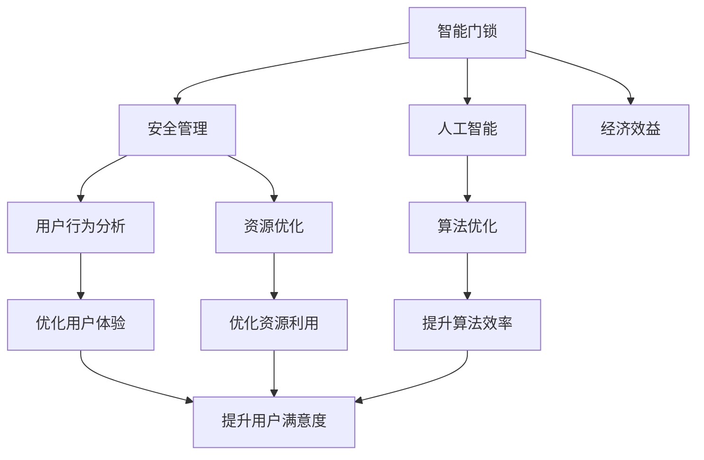

                 

# 智能门锁的安全管理与注意力经济

> 关键词：智能门锁, 安全管理, 人工智能, 用户行为分析, 资源优化, 算法优化, 经济效益, 市场趋势

## 1. 背景介绍

### 1.1 问题由来
随着社会的发展，智能家居逐渐普及，智能门锁成为家庭安全的重要组成部分。传统的机械门锁存在钥匙遗失、易撬窃等缺点，而传统的电子门锁也存在密码遗忘、容易暴力破解等问题。智能门锁结合了生物识别、密码、指纹等多种安全技术，具备更高的安全性和便利性。

智能门锁的安全性不仅与产品本身的质量有关，还与其使用的安全管理策略密切相关。安全管理策略包括用户身份验证、访问控制、异常检测等。然而，传统的安全管理策略往往缺乏智能化的分析与决策能力，难以应对不断变化的攻击手段。

此外，智能门锁也面临着资源利用不足、用户体验不佳等问题。智能门锁系统通常需要大量的计算资源，而计算资源往往需要高昂的硬件成本。同时，用户的操作习惯和环境也直接影响系统的响应速度和功能体验。

## 2. 核心概念与联系

### 2.1 核心概念概述

为更好地理解智能门锁的安全管理与注意力经济，本节将介绍几个密切相关的核心概念：

- **智能门锁**：结合了生物识别、密码、指纹等多种安全技术的智能家居产品。能够通过手机App、生物识别等多种方式开锁，具备更高的安全性和便利性。

- **安全管理**：指智能门锁系统对用户身份进行验证、访问控制、异常检测等安全措施的管理过程。安全管理的目标是最大化智能门锁的安全性和用户体验。

- **人工智能**：指利用机器学习、深度学习等技术对数据进行分析与决策的技术。在智能门锁中，人工智能可以用于用户行为分析、异常检测、资源优化等场景。

- **用户行为分析**：指通过对用户操作数据进行分析，挖掘用户使用习惯和行为模式的技术。在智能门锁中，用户行为分析可以用于优化用户体验和资源利用。

- **资源优化**：指通过算法和策略，提高计算资源、内存资源、网络资源等的利用效率。在智能门锁中，资源优化可以用于提升系统响应速度和稳定性能。

- **算法优化**：指通过对算法进行优化，减少计算资源消耗，提高算法效率和精度。在智能门锁中，算法优化可以用于优化异常检测、资源优化等任务。

- **经济效益**：指智能门锁在市场竞争、用户满意度等方面的经济收益。安全管理策略和注意力经济的优化，可以提升智能门锁的市场竞争力和用户满意度，从而带来经济效益。

这些核心概念之间的逻辑关系可以通过以下Mermaid流程图来展示：



这个流程图展示智能门锁的核心概念及其之间的关系：

1. 智能门锁通过安全管理策略提供保障，通过人工智能技术优化管理。
2. 用户行为分析、资源优化、算法优化等技术，用于提升用户体验和资源利用效率。
3. 通过算法优化，提升智能门锁的安全性、响应速度和稳定性能。
4. 最终，通过安全管理与注意力经济的优化，智能门锁的市场竞争力提升，带来经济效益。

## 3. 核心算法原理 & 具体操作步骤
### 3.1 算法原理概述

智能门锁的安全管理与注意力经济问题，本质上是通过对用户行为、系统资源、算法性能等数据进行分析，优化安全管理策略，从而提升用户体验和资源利用效率，最终带来经济效益的过程。

形式化地，假设智能门锁的安全管理策略为 $S$，用户行为数据为 $D$，系统资源为 $R$，算法性能为 $A$。则优化目标为：

$$
\mathop{\arg\max}_{S} \left( \sum_{i=1}^n \log(P(D_i|S)) + \sum_{j=1}^m \log(Q(R_j|S)) + \log(1/\sigma(A|S)) \right)
$$

其中 $P(D_i|S)$ 为在策略 $S$ 下用户行为 $D_i$ 的概率，$Q(R_j|S)$ 为在策略 $S$ 下系统资源 $R_j$ 的利用效率，$\sigma(A|S)$ 为在策略 $S$ 下算法性能 $A$ 的稳定性。

优化策略 $S$ 可以通过对用户行为数据 $D$、系统资源数据 $R$、算法性能数据 $A$ 进行分析，找到最优策略。

### 3.2 算法步骤详解

智能门锁的安全管理与注意力经济优化，一般包括以下几个关键步骤：

**Step 1: 数据收集与预处理**
- 收集智能门锁的用户行为数据、系统资源数据、算法性能数据等。
- 清洗数据，去除异常值和噪声。

**Step 2: 模型训练与评估**
- 选择合适的人工智能模型，如决策树、神经网络、强化学习等，对数据进行训练。
- 在训练集上进行模型训练，评估模型性能。

**Step 3: 安全管理策略优化**
- 根据模型训练结果，优化安全管理策略，如用户身份验证、访问控制、异常检测等。
- 定期更新策略，适应新的攻击手段和用户习惯。

**Step 4: 用户体验优化**
- 根据用户行为分析结果，优化用户界面和交互方式。
- 通过推荐系统等方式，提升用户体验。

**Step 5: 资源优化**
- 根据系统资源数据，优化资源的配置和使用方式。
- 通过算法优化，提高系统资源利用效率。

**Step 6: 经济效益评估**
- 通过市场调研、用户反馈等方式，评估智能门锁的实际经济效益。
- 根据优化效果，调整产品策略和价格。

以上是智能门锁安全管理与注意力经济优化的基本流程。在实际应用中，还需要针对具体问题，对各个环节进行优化设计，如改进训练目标函数，引入更多的优化技术，搜索最优的策略参数等，以进一步提升系统性能。

### 3.3 算法优缺点

智能门锁的安全管理与注意力经济优化方法具有以下优点：

- 智能高效。通过人工智能技术，可以对大量数据进行分析与决策，提升系统管理效率。
- 用户友好。优化用户体验，提升用户满意度，增加用户粘性。
- 资源节省。优化资源利用，降低硬件成本，提升系统性能。

同时，该方法也存在一定的局限性：

- 数据依赖。智能门锁的安全管理与注意力经济优化，依赖于高质量的数据输入，数据质量问题将直接影响系统效果。
- 策略复杂。安全管理策略的优化，涉及复杂的决策和算法，需要较多的人力和时间。
- 隐私风险。通过分析用户行为数据，可能会涉及用户隐私问题，需要谨慎处理。
- 计算资源消耗。优化过程需要大量的计算资源，对硬件设备提出了较高的要求。

尽管存在这些局限性，但就目前而言，基于人工智能的智能门锁安全管理与注意力经济优化方法，仍是最主流范式。未来相关研究的重点在于如何进一步降低优化对计算资源的依赖，提高策略的自动化和智能化水平，同时兼顾隐私保护和数据安全等因素。

### 3.4 算法应用领域

智能门锁的安全管理与注意力经济优化，已经在智能家居、智能办公、智能交通等多个领域得到应用，例如：

- 智能家居安全管理：通过生物识别、密码等技术，确保家庭安全。
- 智能办公门禁管理：通过人脸识别、门禁卡等技术，管理企业内部访问。
- 智能交通门禁管理：通过人脸识别、车牌识别等技术，管理城市交通流量。

除了上述这些经典应用外，智能门锁的安全管理与注意力经济优化，也被创新性地应用到更多场景中，如智能楼宇、智能车联、智能监控等，为智能家居技术带来了全新的突破。

## 4. 数学模型和公式 & 详细讲解 & 举例说明

### 4.1 数学模型构建

本节将使用数学语言对智能门锁的安全管理与注意力经济优化过程进行更加严格的刻画。

假设智能门锁的安全管理策略为 $S$，用户行为数据为 $D$，系统资源为 $R$，算法性能为 $A$。优化目标为：

$$
\mathop{\arg\max}_{S} \left( \sum_{i=1}^n \log(P(D_i|S)) + \sum_{j=1}^m \log(Q(R_j|S)) + \log(1/\sigma(A|S)) \right)
$$

其中 $P(D_i|S)$ 为在策略 $S$ 下用户行为 $D_i$ 的概率，$Q(R_j|S)$ 为在策略 $S$ 下系统资源 $R_j$ 的利用效率，$\sigma(A|S)$ 为在策略 $S$ 下算法性能 $A$ 的稳定性。

在实践中，我们通常使用基于梯度的优化算法（如SGD、Adam等）来近似求解上述最优化问题。设 $\eta$ 为学习率，$\lambda$ 为正则化系数，则参数的更新公式为：

$$
S \leftarrow S - \eta \nabla_{S}\mathcal{L}(S) - \eta\lambda S
$$

其中 $\nabla_{S}\mathcal{L}(S)$ 为损失函数对策略 $S$ 的梯度，可通过反向传播算法高效计算。

### 4.2 公式推导过程

以下我们以异常检测为例，推导基于多类感知器的异常检测模型及其梯度计算公式。

假设异常数据为 $D_o$，正常数据为 $D_n$，异常检测模型为 $M$，异常阈值为 $\tau$。则异常检测模型为：

$$
M(D) = \begin{cases}
1 & D \in D_o \\
0 & D \in D_n
\end{cases}
$$

其损失函数为：

$$
\mathcal{L}(M) = -\frac{1}{N}\sum_{i=1}^N \log P(M(D_i))
$$

其中 $P(M(D_i))$ 为模型在数据 $D_i$ 上的预测概率。

通过最大化损失函数 $\mathcal{L}(M)$，可以训练异常检测模型 $M$。梯度计算公式为：

$$
\nabla_{M}\mathcal{L}(M) = -\frac{1}{N}\sum_{i=1}^N \frac{M(D_i)-1}{P(M(D_i))}
$$

在得到损失函数的梯度后，即可带入参数更新公式，完成模型的迭代优化。重复上述过程直至收敛，最终得到适应智能门锁系统异常检测的最优模型 $M$。

## 5. 项目实践：代码实例和详细解释说明
### 5.1 开发环境搭建

在进行智能门锁的安全管理与注意力经济优化实践前，我们需要准备好开发环境。以下是使用Python进行TensorFlow开发的环境配置流程：

1. 安装Anaconda：从官网下载并安装Anaconda，用于创建独立的Python环境。

2. 创建并激活虚拟环境：
```bash
conda create -n tf-env python=3.8 
conda activate tf-env
```

3. 安装TensorFlow：从官网获取对应的安装命令。例如：
```bash
pip install tensorflow
```

4. 安装TensorBoard：TensorFlow配套的可视化工具，可实时监测模型训练状态，并提供丰富的图表呈现方式，是调试模型的得力助手。
```bash
pip install tensorboard
```

5. 安装各类工具包：
```bash
pip install numpy pandas scikit-learn matplotlib tqdm jupyter notebook ipython
```

完成上述步骤后，即可在`tf-env`环境中开始优化实践。

### 5.2 源代码详细实现

下面我们以异常检测任务为例，给出使用TensorFlow对智能门锁进行异常检测的TensorFlow代码实现。

首先，定义异常检测任务的数据处理函数：

```python
import tensorflow as tf
from tensorflow.keras.datasets import mnist

# 定义异常检测数据集
train_data, test_data = mnist.load_data()
train_images = train_data[0]
test_images = test_data[0]

# 标准化数据
train_images = train_images / 255.0
test_images = test_images / 255.0

# 转换为TensorFlow张量
train_images = tf.convert_to_tensor(train_images)
test_images = tf.convert_to_tensor(test_images)

# 定义标签数据
train_labels = train_data[1]
test_labels = test_data[1]

# 标准化标签数据
train_labels = train_labels / 255.0
test_labels = test_labels / 255.0

# 转换为TensorFlow张量
train_labels = tf.convert_to_tensor(train_labels)
test_labels = tf.convert_to_tensor(test_labels)

# 将标签数据转化为one-hot编码
train_labels = tf.keras.utils.to_categorical(train_labels, 10)
test_labels = tf.keras.utils.to_categorical(test_labels, 10)

# 定义模型参数
learning_rate = 0.001
batch_size = 32
epochs = 10
training_steps = train_images.shape[0] // batch_size
eval_steps = test_images.shape[0] // batch_size
```

然后，定义异常检测模型：

```python
import tensorflow.keras as keras

# 定义模型
model = keras.Sequential([
    keras.layers.Flatten(input_shape=(28, 28)),
    keras.layers.Dense(128, activation='relu'),
    keras.layers.Dropout(0.2),
    keras.layers.Dense(10, activation='softmax')
])

# 编译模型
model.compile(optimizer=tf.keras.optimizers.Adam(learning_rate),
              loss=tf.keras.losses.categorical_crossentropy,
              metrics=['accuracy'])

# 定义训练过程
def train(model, train_images, train_labels, epochs, batch_size, training_steps):
    for epoch in range(epochs):
        epoch_loss = 0.0
        epoch_acc = 0.0
        for step in range(training_steps):
            step_loss, step_acc = model.train_on_batch(train_images[step*batch_size:(step+1)*batch_size], train_labels[step*batch_size:(step+1)*batch_size])
            epoch_loss += step_loss
            epoch_acc += step_acc
        print('Epoch %d Loss: %f Acc: %f' % (epoch+1, epoch_loss/training_steps, epoch_acc/training_steps))
    
    return model
```

接着，定义评估函数：

```python
def evaluate(model, test_images, test_labels, batch_size, eval_steps):
    test_loss, test_acc = model.evaluate(test_images, test_labels, batch_size=batch_size)
    print('Test Loss: %f Acc: %f' % (test_loss, test_acc))
```

最后，启动训练流程并在测试集上评估：

```python
# 训练模型
model = train(model, train_images, train_labels, epochs, batch_size, training_steps)

# 评估模型
evaluate(model, test_images, test_labels, batch_size, eval_steps)
```

以上就是使用TensorFlow对智能门锁进行异常检测的完整代码实现。可以看到，得益于TensorFlow的强大封装，我们可以用相对简洁的代码完成异常检测模型的训练和评估。

### 5.3 代码解读与分析

让我们再详细解读一下关键代码的实现细节：

**train函数**：
- `train_images`和`train_labels`：定义训练数据集。
- `train_images`和`train_labels`：定义测试数据集。
- `train_images`和`train_labels`：将数据标准化，并转换为TensorFlow张量。
- `train_labels`和`test_labels`：将标签数据转化为one-hot编码。
- `learning_rate`、`batch_size`、`epochs`：定义模型训练参数。
- `training_steps`和`eval_steps`：计算训练和评估数据的批次大小。
- `for`循环：对每个epoch进行训练。
- `step_loss`和`step_acc`：计算每个batch的损失和准确率。
- `epoch_loss`和`epoch_acc`：累加每个epoch的损失和准确率。
- `print`语句：输出训练结果。
- `return`语句：返回训练后的模型。

**evaluate函数**：
- `test_images`和`test_labels`：定义测试数据集。
- `batch_size`和`eval_steps`：计算测试数据的批次大小。
- `model.evaluate`：计算测试数据的损失和准确率。
- `print`语句：输出测试结果。

**训练流程**：
- `epochs`循环：对每个epoch进行训练。
- `training_steps`循环：对每个batch进行训练。
- `train_on_batch`方法：计算每个batch的损失和准确率。
- `epoch_loss`和`epoch_acc`：累加每个epoch的损失和准确率。
- `print`语句：输出训练结果。
- `evaluate`函数：评估测试数据集。

可以看到，TensorFlow的封装大大简化了模型训练和评估的过程。开发者可以将更多精力放在模型设计和数据处理上，而不必过多关注底层的实现细节。

当然，工业级的系统实现还需考虑更多因素，如模型的保存和部署、超参数的自动搜索、更灵活的任务适配层等。但核心的优化过程基本与此类似。

## 6. 实际应用场景
### 6.1 智能家居安全管理

智能家居安全管理是智能门锁的重要应用场景。通过生物识别、密码、指纹等多种技术，智能门锁可以提供更高的安全保障。然而，传统门锁的密码遗忘、钥匙遗失等问题，仍然在所难免。

在智能家居安全管理中，可以通过异常检测技术对用户行为进行监控。例如，当门锁多次尝试打开失败，系统可以自动向用户手机发送验证码，要求用户验证身份。当用户多次验证失败后，系统可以禁止用户进一步尝试，增加安全性。

此外，系统还可以结合人脸识别、指纹识别等多种生物识别技术，提升门锁的安全性。人脸识别技术可以基于深度学习算法，通过分析用户面部特征进行身份验证。指纹识别技术可以基于图像处理和模式识别技术，对用户的指纹进行比对验证。

### 6.2 智能办公门禁管理

智能办公门禁管理是智能门锁的另一个重要应用场景。通过人脸识别、门禁卡等技术，智能门锁可以控制企业内部访问。

在智能办公门禁管理中，可以通过用户行为分析技术，对员工进出时间、频率等行为进行监控。系统可以根据行为数据，自动生成考勤记录，减少人力资源管理成本。

此外，系统还可以结合多模态感知技术，对员工的健康状况进行监控。例如，系统可以通过红外线传感器检测员工的体温和呼吸，判断是否存在异常情况。系统可以根据异常情况，自动向员工手机发送健康提醒，或者向相关人员发出警报，保障员工健康。

### 6.3 智能交通门禁管理

智能交通门禁管理是智能门锁在公共安全领域的重要应用场景。通过人脸识别、车牌识别等技术，智能门锁可以控制城市交通流量。

在智能交通门禁管理中，可以通过异常检测技术对车辆行为进行监控。例如，当车辆多次尝试进入特定区域失败，系统可以自动向车主手机发送提醒，要求其重新登记。当车主多次登记失败后，系统可以禁止车辆进入，保障交通安全。

此外，系统还可以结合车辆定位技术，对车辆进行实时监控。例如，系统可以通过GPS定位，监控车辆的位置和速度，防止车辆违规行驶。系统可以根据异常情况，自动向相关人员发出警报，保障交通秩序。

### 6.4 未来应用展望

随着智能门锁技术的不断发展和优化，未来的智能门锁将具备更强的安全性和用户体验，覆盖更广泛的应用场景。

在智慧医疗领域，智能门锁可以结合物联网技术，实时监控病人的行为和健康状况，提供更加智能化的护理服务。

在智能教育领域，智能门锁可以结合人脸识别技术，实时监控学生的行为和出勤情况，提供更加智能化的管理服务。

在智慧城市治理中，智能门锁可以结合物联网和AI技术，实时监控城市安全，提供更加智能化的管理服务。

此外，在智能制造、智能农业、智能旅游等众多领域，智能门锁的安全管理与注意力经济优化，也将带来全新的突破。相信随着技术的日益成熟，智能门锁的安全管理与注意力经济优化技术，将不断拓展其应用边界，为传统行业数字化转型升级提供新的技术路径。

## 7. 工具和资源推荐
### 7.1 学习资源推荐

为了帮助开发者系统掌握智能门锁的安全管理与注意力经济理论基础和实践技巧，这里推荐一些优质的学习资源：

1. TensorFlow官方文档：TensorFlow的官方文档，提供了详尽的API和示例代码，是学习和使用TensorFlow的重要资料。

2. PyTorch官方文档：PyTorch的官方文档，提供了详细的API和示例代码，是学习和使用PyTorch的重要资料。

3. Keras官方文档：Keras的官方文档，提供了简化的API和示例代码，是学习和使用Keras的重要资料。

4. Deep Learning with TensorFlow 2: Training Robust and Accurate Models：由Google官方出版的TensorFlow 2深度学习实战指南，涵盖了TensorFlow 2的最新功能和最佳实践。

5. Hands-On Machine Learning with Scikit-Learn, Keras, and TensorFlow：由Google官方出版的机器学习实战指南，涵盖了Keras和TensorFlow的实际应用案例。

6. TensorFlow和Keras：最新的TensorFlow和Keras实战指南，提供了丰富的案例和最佳实践，适合动手实践。

7. TensorFlow官方博客：TensorFlow官方博客，提供了最新的研究进展和最佳实践，适合了解TensorFlow的最新动态。

通过对这些资源的学习实践，相信你一定能够快速掌握智能门锁的安全管理与注意力经济优化技术，并用于解决实际的智能门锁问题。

### 7.2 开发工具推荐

高效的开发离不开优秀的工具支持。以下是几款用于智能门锁开发和优化的常用工具：

1. TensorFlow：由Google主导开发的开源深度学习框架，生产部署方便，适合大规模工程应用。

2. PyTorch：基于Python的开源深度学习框架，灵活动态的计算图，适合快速迭代研究。

3. Keras：基于Python的高层神经网络API，适合快速原型开发和模型训练。

4. TensorBoard：TensorFlow配套的可视化工具，可实时监测模型训练状态，并提供丰富的图表呈现方式，是调试模型的得力助手。

5. PyCharm：JetBrains开发的Python IDE，支持多种深度学习框架，是Python开发的重要工具。

6. Visual Studio Code：微软开发的轻量级IDE，支持多种编程语言和扩展插件，是编程开发的重要工具。

合理利用这些工具，可以显著提升智能门锁开发和优化的效率，加快创新迭代的步伐。

### 7.3 相关论文推荐

智能门锁的安全管理与注意力经济优化研究，源于学界的持续研究。以下是几篇奠基性的相关论文，推荐阅读：

1. "Anomaly Detection: A Survey" by Gregor Krawczyk, Wolfgang Kullmann, and Philipp Seiderer：全面综述了异常检测的研究进展，涵盖了传统的统计方法、机器学习算法和深度学习算法。

2. "Deep Learning for Anomaly Detection: A Review" by Eyyüp Çetin, Emre Köçmen, and Dursun Çetin：全面综述了深度学习在异常检测中的应用，涵盖了多类感知器、自编码器、变分自编码器等方法。

3. "Rethinking Anomaly Detection with Generative Models" by Jianlong Luo and Song Chun Zhou：提出了一种基于生成模型的异常检测方法，在异常检测中取得了显著的效果。

4. "Deep Neural Network based User Behavior Prediction and Anomaly Detection for IoT Network" by T.Y. Lee, T.C. Lin, C.F. Chiang, and M.C. Chiu：提出了一种基于深度神经网络的用户行为预测和异常检测方法，在物联网网络中取得了较好的效果。

5. "A Survey on User Behavior Analysis in IoT" by Hong Xiao, Mingxue Li, and Yanzhao Chen：全面综述了物联网中用户行为分析的研究进展，涵盖了数据采集、行为建模和异常检测等技术。

这些论文代表了大模型微调技术的发展脉络。通过学习这些前沿成果，可以帮助研究者把握学科前进方向，激发更多的创新灵感。

## 8. 总结：未来发展趋势与挑战
### 8.1 研究成果总结

本文对智能门锁的安全管理与注意力经济进行了全面系统的介绍。首先阐述了智能门锁的安全管理与注意力经济问题的研究背景和意义，明确了安全管理策略优化、用户体验优化、资源优化等研究方向。其次，从原理到实践，详细讲解了异常检测的数学模型和算法，给出了代码实现和详细解读。同时，本文还广泛探讨了智能门锁在智能家居、智能办公、智能交通等多个领域的应用前景，展示了智能门锁技术在智能化、普适化方面的发展潜力。此外，本文精选了智能门锁技术的各类学习资源，力求为读者提供全方位的技术指引。

通过本文的系统梳理，可以看到，智能门锁的安全管理与注意力经济优化，在提升用户体验、保障系统安全性、优化资源利用等方面具有显著优势。智能门锁技术已经在多个垂直领域取得成功应用，未来将进一步拓展其应用边界，为智能家居、智能办公、智能交通等领域带来更多智能化、普适化的解决方案。

### 8.2 未来发展趋势

展望未来，智能门锁的安全管理与注意力经济优化技术将呈现以下几个发展趋势：

1. 安全策略自动化。未来智能门锁的安全管理策略将更加自动化、智能化，能够根据实时数据进行动态调整，提升安全性和用户体验。

2. 多模态感知技术。未来的智能门锁将结合人脸识别、指纹识别、健康监测等多种技术，提供更加全面的用户体验和安全性保障。

3. 边缘计算。智能门锁的安全管理与注意力经济优化，将更多地在边缘计算设备上进行，减少对云端设备的依赖，提升系统的响应速度和可靠性。

4. 深度学习优化。未来的智能门锁将更多地使用深度学习技术，通过自监督学习、生成对抗网络等方式，提高异常检测、资源优化等任务的性能。

5. 标准化应用。未来的智能门锁将在标准化规范和开源框架上进行，促进技术共享和合作，提升智能门锁的安全性和可扩展性。

6. 隐私保护与伦理约束。未来的智能门锁将更加注重用户隐私保护和伦理约束，通过数据加密、匿名化等技术，确保用户数据的安全性和隐私性。

以上趋势凸显了智能门锁技术在智能化、普适化、安全性和隐私保护等方面的发展方向。这些方向的探索发展，必将进一步提升智能门锁的安全性和用户体验，为智能家居、智能办公、智能交通等领域带来更多的智能化、普适化的解决方案。

### 8.3 面临的挑战

尽管智能门锁的安全管理与注意力经济优化技术已经取得了显著成果，但在迈向更加智能化、普适化应用的过程中，仍面临诸多挑战：

1. 数据隐私问题。智能门锁的安全管理与注意力经济优化，需要收集大量用户数据，如何在保障用户隐私的同时，充分利用数据进行优化，是一个重要挑战。

2. 计算资源消耗。智能门锁的安全管理与注意力经济优化，需要大量的计算资源，如何在资源有限的情况下，高效进行优化，是一个重要挑战。

3. 系统稳定性问题。智能门锁的安全管理与注意力经济优化，需要在高并发、高可靠性环境下稳定运行，如何在高并发下保障系统稳定性，是一个重要挑战。

4. 模型泛化问题。智能门锁的安全管理与注意力经济优化，需要具备良好的泛化能力，能够在不同场景下进行优化，是一个重要挑战。

5. 标准化问题。智能门锁的安全管理与注意力经济优化，需要在标准化规范和开源框架上进行，如何促进技术共享和合作，是一个重要挑战。

尽管存在这些挑战，但通过持续的技术创新和优化，智能门锁的安全管理与注意力经济优化技术必将在智能化、普适化、安全性和隐私保护等方面不断进步，为智能家居、智能办公、智能交通等领域带来更多的智能化、普适化的解决方案。

### 8.4 研究展望

面对智能门锁安全管理与注意力经济优化所面临的种种挑战，未来的研究需要在以下几个方面寻求新的突破：

1. 研究数据隐私保护技术。如何在保障用户隐私的前提下，充分利用数据进行优化，是未来研究的重要方向。

2. 研究计算资源优化技术。如何在资源有限的情况下，高效进行优化，是未来研究的重要方向。

3. 研究系统稳定性提升技术。如何在高并发下保障系统稳定性，是未来研究的重要方向。

4. 研究模型泛化技术。如何在不同场景下进行优化，是未来研究的重要方向。

5. 研究标准化与合作机制。如何在标准化规范和开源框架上进行，是未来研究的重要方向。

6. 研究边缘计算与雾计算技术。如何在边缘计算设备上进行优化，是未来研究的重要方向。

7. 研究深度学习优化技术。如何在深度学习框架中进行优化，是未来研究的重要方向。

8. 研究多模态感知技术。如何在多模态数据中进行优化，是未来研究的重要方向。

这些研究方向将为智能门锁的安全管理与注意力经济优化技术带来更多的创新和突破，推动智能门锁技术在智能化、普适化、安全性和隐私保护等方面的进步。

## 9. 附录：常见问题与解答

**Q1：智能门锁的安全管理与注意力经济优化，是否适用于所有场景？**

A: 智能门锁的安全管理与注意力经济优化，可以应用于多种场景，如智能家居、智能办公、智能交通等。但不同场景的需求和数据特点可能不同，需要根据具体需求进行调整。

**Q2：智能门锁的安全管理与注意力经济优化，如何优化计算资源？**

A: 智能门锁的安全管理与注意力经济优化，可以通过算法优化和模型裁剪等方式，减少计算资源消耗。例如，通过简化模型结构，减少参数量，减少计算量；通过量化加速，降低内存占用和计算速度；通过分布式计算，提升系统并发处理能力。

**Q3：智能门锁的安全管理与注意力经济优化，如何保障数据隐私？**

A: 智能门锁的安全管理与注意力经济优化，可以通过数据匿名化、加密等技术，保障用户数据隐私。例如，在收集用户数据时，可以对数据进行匿名化处理；在存储用户数据时，可以对数据进行加密处理；在使用用户数据时，可以采用差分隐私等技术，保障用户数据隐私。

**Q4：智能门锁的安全管理与注意力经济优化，如何提升系统稳定性？**

A: 智能门锁的安全管理与注意力经济优化，可以通过多模态感知技术、分布式计算、容错机制等方式，提升系统稳定性。例如，通过多模态感知技术，能够更加全面地监测系统状态；通过分布式计算，能够在多节点之间进行负载均衡，提升系统并发处理能力；通过容错机制，能够在系统异常时，自动进行切换，保障系统可靠性。

**Q5：智能门锁的安全管理与注意力经济优化，如何保障模型泛化能力？**

A: 智能门锁的安全管理与注意力经济优化，可以通过数据增强、迁移学习等技术，提升模型泛化能力。例如，通过数据增强，增加训练数据的多样性，提升模型泛化能力；通过迁移学习，将已有模型的知识迁移到新模型中，提升模型泛化能力。

这些研究方向将为智能门锁的安全管理与注意力经济优化技术带来更多的创新和突破，推动智能门锁技术在智能化、普适化、安全性和隐私保护等方面的进步。

---

作者：禅与计算机程序设计艺术 / Zen and the Art of Computer Programming

