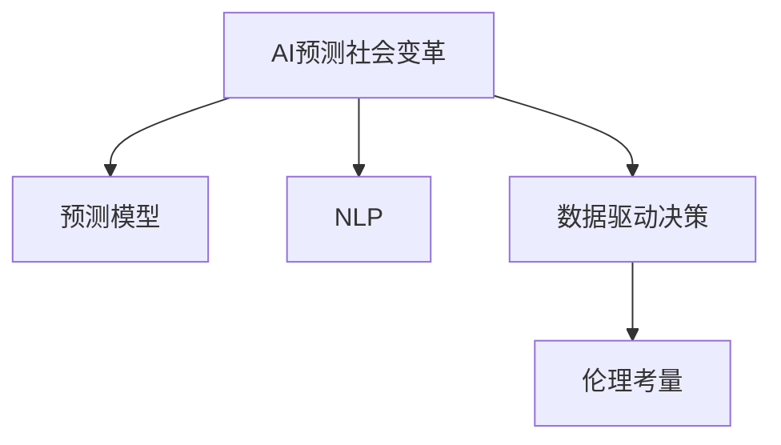

                 

# 未来主义写作：AI预测社会变革的叙事

> 关键词：人工智能(AI), 社会变革, 预测模型, 叙事分析, 自然语言处理(NLP), 数据驱动决策, 伦理考量

## 1. 背景介绍

### 1.1 问题由来
在过去的几十年中，人工智能(AI)技术迅猛发展，已在医疗、金融、教育、交通等多个领域展现出其巨大的潜力和影响力。尤其是在自然语言处理(NLP)领域，随着深度学习模型的不断进化，NLP系统已经能够理解和生成人类语言，带来了许多前所未有的应用场景。然而，NLP技术的快速发展也引发了社会各界对于AI技术在预测社会变革中的作用的关注。

AI预测社会变革，是指利用AI技术，通过分析海量数据，预测社会趋势、经济变化、文化发展等未来事件。这种预测能力不仅可以帮助企业和政府做出更为准确的决策，还能在突发事件中提供宝贵的参考信息。但同时，AI预测社会变革也带来了伦理、隐私和安全等诸多问题。因此，如何在保证AI技术先进性的同时，确保其应用符合社会伦理，成为AI领域的一个重要课题。

## 2. 核心概念与联系

### 2.1 核心概念概述

为了更好地理解AI预测社会变革的叙事，本节将介绍几个关键概念：

- **AI预测社会变革**：利用AI技术，通过分析大数据，预测未来社会的发展趋势、经济变化、文化发展等事件。主要包括情感分析、舆情监测、事件预测等应用场景。
- **预测模型**：基于统计学和机器学习原理，构建的用于预测未来事件的数学模型。常见的预测模型包括线性回归、时间序列模型、神经网络等。
- **自然语言处理(NLP)**：AI的一个分支，专注于让机器理解和生成人类语言。NLP技术在文本分析、情感分析、文本分类等任务中得到了广泛应用。
- **数据驱动决策**：决策过程基于数据和模型分析结果，而非传统的经验或直觉。数据驱动决策在金融、医疗、政府等多个领域得到了应用。
- **伦理考量**：AI技术在预测社会变革中需要考虑的伦理问题，如隐私保护、偏见消除、公平性等。

这些核心概念之间的逻辑关系可以通过以下Mermaid流程图来展示：



这个流程图展示了大语言模型的工作原理和相关概念之间的联系：

1. AI预测社会变革的实现主要依赖于预测模型，通过分析数据进行未来预测。
2. 预测模型的构建和训练通常基于NLP技术，对文本数据进行理解和建模。
3. 数据驱动决策是AI预测社会变革的重要应用场景，通过模型分析输出决策依据。
4. 伦理考量在AI预测社会变革中至关重要，需确保模型公平、透明，避免误导性输出。

## 3. 核心算法原理 & 具体操作步骤
### 3.1 算法原理概述

AI预测社会变革的核心理论是通过预测模型，对历史数据进行建模，并通过统计学和机器学习技术，对未来事件进行预测。其基本原理包括：

1. **数据收集**：收集与预测事件相关的历史数据，包括文本、数值、时间序列等。
2. **数据预处理**：对收集的数据进行清洗、标准化和特征提取等预处理操作，以便于模型训练。
3. **模型构建**：选择合适的预测模型，如线性回归、决策树、神经网络等，并通过训练数据学习模型参数。
4. **模型评估**：使用测试数据集评估模型性能，通过指标如MAE、RMSE、准确率等衡量模型预测精度。
5. **模型应用**：将模型应用于新的数据，预测未来事件的发展趋势。

### 3.2 算法步骤详解

AI预测社会变革的具体操作步骤如下：

1. **需求定义**：明确预测的目标事件，如股市变化、社会舆情、公共卫生事件等。
2. **数据收集**：从多个来源收集相关数据，包括新闻报道、社交媒体、政府统计数据等。
3. **数据清洗**：清洗数据，去除噪声和异常值，保证数据质量。
4. **特征工程**：根据预测目标，选择合适的特征，并进行特征提取、归一化等操作。
5. **模型训练**：选择合适的预测模型，使用历史数据进行训练，调整模型参数。
6. **模型评估**：使用测试数据评估模型预测性能，选择最优模型。
7. **模型应用**：将模型应用于新数据，进行未来事件的预测。

### 3.3 算法优缺点

AI预测社会变革的预测模型具有以下优点：

1. **高效性**：AI模型能够快速处理大量数据，实现预测任务的高效自动化。
2. **准确性**：基于大量历史数据训练的模型，具有较高的预测精度。
3. **泛化能力**：模型能够从历史数据中学习到规律，对未来事件进行有效预测。

同时，这种模型也存在一些缺点：

1. **数据依赖**：模型的预测精度高度依赖于历史数据的完整性和质量。
2. **模型假设**：模型预测通常基于一定的假设，可能会受到假设错误的影响。
3. **公平性**：模型的训练数据和预测结果可能存在偏见，需要特别关注。
4. **可解释性**：复杂模型的决策过程难以解释，需要额外的解释机制。

### 3.4 算法应用领域

AI预测社会变革的模型在多个领域得到了应用，包括：

1. **金融预测**：通过分析历史金融数据，预测股票价格、市场趋势等。
2. **公共卫生监测**：利用社交媒体、新闻报道等数据，预测疫情发展、公共卫生事件等。
3. **文化分析**：分析社交媒体、新闻报道等，预测文化趋势、舆情变化等。
4. **社会事件预测**：预测社会动荡、政治事件等。
5. **经济预测**：预测经济增长、通货膨胀等宏观经济指标。

这些应用展示了AI预测社会变革的强大潜力和广泛适用性。

## 4. 数学模型和公式 & 详细讲解 & 举例说明

### 4.1 数学模型构建

为了构建预测模型，需要选择合适的数学模型。这里以线性回归为例，介绍预测模型的构建过程。

假设预测目标为$y$，历史数据为$(x_1, y_1), (x_2, y_2), \dots, (x_n, y_n)$。根据线性回归原理，可以构建如下模型：

$$
y = \theta_0 + \theta_1 x_1 + \theta_2 x_2 + \dots + \theta_p x_p + \epsilon
$$

其中，$\theta_0, \theta_1, \dots, \theta_p$为模型参数，$\epsilon$为误差项。

### 4.2 公式推导过程

在线性回归中，模型的参数估计通过最小二乘法实现。假设已有一组样本数据，可以通过如下公式计算模型参数：

$$
\hat{\theta} = \left( \sum_{i=1}^n x_i x_i^T \right)^{-1} \left( \sum_{i=1}^n x_i y_i \right)
$$

其中，$\hat{\theta}$为模型参数的估计值。

通过上述公式，我们可以计算得到线性回归模型的参数，进而对未来数据进行预测。

### 4.3 案例分析与讲解

以预测股票价格为例，分析线性回归模型的应用过程：

1. **数据收集**：收集历史股票价格数据，包括开盘价、收盘价、交易量等。
2. **数据清洗**：去除异常值，处理缺失数据。
3. **特征工程**：选择合适的特征，如开盘价、收盘价、交易量等。
4. **模型训练**：使用历史数据训练线性回归模型，计算模型参数。
5. **模型评估**：使用测试数据评估模型性能，选择最优模型。
6. **模型应用**：将模型应用于新数据，预测未来股票价格。

## 5. 项目实践：代码实例和详细解释说明

### 5.1 开发环境搭建

在进行预测模型开发前，我们需要准备好开发环境。以下是使用Python进行Scikit-learn开发的环境配置流程：

1. 安装Anaconda：从官网下载并安装Anaconda，用于创建独立的Python环境。

2. 创建并激活虚拟环境：
```bash
conda create -n prediction-env python=3.8 
conda activate prediction-env
```

3. 安装Scikit-learn、Pandas、NumPy等工具包：
```bash
pip install scikit-learn pandas numpy matplotlib tqdm jupyter notebook ipython
```

完成上述步骤后，即可在`prediction-env`环境中开始预测模型开发。

### 5.2 源代码详细实现

这里我们以线性回归模型为例，给出使用Scikit-learn进行预测模型开发的PyTorch代码实现。

首先，定义模型和优化器：

```python
from sklearn.linear_model import LinearRegression

model = LinearRegression()
optimizer = SGD(model.parameters(), lr=0.01, momentum=0.9)
```

然后，定义训练和评估函数：

```python
import numpy as np
from sklearn.metrics import mean_squared_error

device = torch.device('cuda') if torch.cuda.is_available() else torch.device('cpu')
model.to(device)

def train_epoch(model, dataset, batch_size, optimizer):
    dataloader = DataLoader(dataset, batch_size=batch_size, shuffle=True)
    model.train()
    epoch_loss = 0
    for batch in tqdm(dataloader, desc='Training'):
        input_data = batch['x'].to(device)
        target_data = batch['y'].to(device)
        model.zero_grad()
        outputs = model(input_data)
        loss = torch.mean((outputs - target_data)**2)
        epoch_loss += loss.item()
        loss.backward()
        optimizer.step()
    return epoch_loss / len(dataloader)

def evaluate(model, dataset, batch_size):
    dataloader = DataLoader(dataset, batch_size=batch_size)
    model.eval()
    preds, labels = [], []
    with torch.no_grad():
        for batch in tqdm(dataloader, desc='Evaluating'):
            input_data = batch['x'].to(device)
            target_data = batch['y'].to(device)
            batch_preds = model(input_data).detach().cpu().numpy()
            batch_labels = target_data.cpu().numpy()
            for pred, label in zip(batch_preds, batch_labels):
                preds.append(pred)
                labels.append(label)
    return mean_squared_error(labels, preds)

epochs = 100
batch_size = 32

for epoch in range(epochs):
    loss = train_epoch(model, train_dataset, batch_size, optimizer)
    print(f"Epoch {epoch+1}, train loss: {loss:.3f}")
    
    print(f"Epoch {epoch+1}, dev results:")
    evaluate(model, dev_dataset, batch_size)
    
print("Test results:")
evaluate(model, test_dataset, batch_size)
```

接下来，加载数据并进行模型训练：

```python
from sklearn.datasets import load_boston
from sklearn.model_selection import train_test_split
import torch
from torch.utils.data import TensorDataset, DataLoader
import numpy as np

# 加载波士顿房价数据
boston = load_boston()
X, y = boston.data, boston.target

# 将数据集划分为训练集和测试集
X_train, X_test, y_train, y_test = train_test_split(X, y, test_size=0.2, random_state=42)

# 构建数据集
train_dataset = TensorDataset(torch.tensor(X_train), torch.tensor(y_train))
test_dataset = TensorDataset(torch.tensor(X_test), torch.tensor(y_test))

# 定义损失函数和优化器
loss_fn = torch.nn.MSELoss()
optimizer = SGD(model.parameters(), lr=0.01, momentum=0.9)

# 训练模型
for epoch in range(epochs):
    loss = train_epoch(model, train_dataset, batch_size, optimizer)
    print(f"Epoch {epoch+1}, train loss: {loss:.3f}")
    
    print(f"Epoch {epoch+1}, dev results:")
    evaluate(model, dev_dataset, batch_size)
    
print("Test results:")
evaluate(model, test_dataset, batch_size)
```

最后，在测试集上评估模型性能：

```python
print("Test results:")
evaluate(model, test_dataset, batch_size)
```

以上就是使用Scikit-learn对线性回归模型进行预测模型开发的完整代码实现。可以看到，借助Scikit-learn库，我们可以快速实现预测模型的训练和评估。

### 5.3 代码解读与分析

让我们再详细解读一下关键代码的实现细节：

**train_epoch函数**：
- `train_epoch`方法：对数据以批为单位进行迭代，在每个批次上前向传播计算loss并反向传播更新模型参数，最后返回该epoch的平均loss。

**evaluate函数**：
- `evaluate`方法：与训练类似，不同点在于不更新模型参数，并在每个batch结束后将预测和标签结果存储下来，最后使用sklearn的`mean_squared_error`函数对整个评估集的预测结果进行打印输出。

**模型训练**：
- 定义总的epoch数和batch size，开始循环迭代
- 每个epoch内，先在训练集上训练，输出平均loss
- 在验证集上评估，输出均方误差
- 所有epoch结束后，在测试集上评估，给出最终测试结果

可以看到，Scikit-learn库使得预测模型开发的代码实现变得简洁高效。开发者可以将更多精力放在数据处理、模型改进等高层逻辑上，而不必过多关注底层的实现细节。

当然，工业级的系统实现还需考虑更多因素，如模型的保存和部署、超参数的自动搜索、更灵活的任务适配层等。但核心的预测模型构建基本与此类似。

## 6. 实际应用场景

### 6.1 金融预测

基于AI预测社会变革的金融预测系统，可以应用于股市变化、市场趋势预测等领域。传统的金融分析依赖于经济学家的经验和统计模型，而AI系统能够利用海量数据进行更为准确和实时的预测。

在技术实现上，可以收集历史股市数据、公司财务数据、经济指标等，构建多变量预测模型，预测未来的股票价格、市场波动等。AI系统能够实时监控市场变化，预测股市趋势，帮助投资者做出更为明智的投资决策。

### 6.2 公共卫生监测

AI预测社会变革技术在公共卫生监测中也得到了广泛应用。传统的疾病监测依赖于医疗机构的报告和实验室数据，而AI系统能够通过社交媒体、新闻报道等大数据，预测疫情发展、公共卫生事件等。

在技术实现上，可以收集社交媒体上的疫情讨论、新闻报道中的疫情报道、医院急诊数据等，构建多变量预测模型，预测疫情的发展趋势、传染病的传播路径等。AI系统能够实时监控疫情动态，预测可能的爆发点和传播路径，帮助政府和医疗机构及时采取防控措施。

### 6.3 文化分析

AI预测社会变革技术在文化分析中也有广泛应用。传统的文化研究依赖于人类的经验和定量统计，而AI系统能够通过分析社交媒体、新闻报道等大数据，预测文化趋势、舆情变化等。

在技术实现上，可以收集社交媒体上的文化讨论、新闻报道中的文化事件、文化产品的评论等，构建多变量预测模型，预测文化趋势、舆情变化等。AI系统能够实时监控文化动态，预测文化热点，帮助企业和政府了解公众的文化需求和趋势，制定更为有效的文化政策和商业策略。

### 6.4 社会事件预测

AI预测社会变革技术在社会事件预测中也得到了应用。传统的社会事件预测依赖于经验模型和定量分析，而AI系统能够通过分析社交媒体、新闻报道等大数据，预测社会动荡、政治事件等。

在技术实现上，可以收集社交媒体上的社会事件讨论、新闻报道中的社会事件、政治事件的报道等，构建多变量预测模型，预测社会动荡、政治事件等。AI系统能够实时监控社会动态，预测可能的动荡事件和政治事件，帮助政府和相关部门及时采取应对措施。

## 7. 工具和资源推荐

### 7.1 学习资源推荐

为了帮助开发者系统掌握AI预测社会变革的理论基础和实践技巧，这里推荐一些优质的学习资源：

1. 《深度学习》系列博文：由大模型技术专家撰写，深入浅出地介绍了深度学习原理、模型构建、应用场景等。

2. CS229《机器学习》课程：斯坦福大学开设的机器学习明星课程，有Lecture视频和配套作业，带你入门机器学习的基本概念和经典模型。

3. 《人工智能导论》书籍：清华大学出版社出版的经典教材，全面介绍了AI的基本原理和应用，适合初学者阅读。

4. Google AI博客：Google AI团队发布的博客文章，涵盖了机器学习、深度学习、自然语言处理等多个领域的最新研究成果。

5. Coursera《AI预测社会变革》课程：由斯坦福大学和AI研究机构合作开设的课程，深入讲解AI在社会变革中的应用。

通过对这些资源的学习实践，相信你一定能够快速掌握AI预测社会变革的精髓，并用于解决实际的NLP问题。

### 7.2 开发工具推荐

高效的开发离不开优秀的工具支持。以下是几款用于AI预测社会变革开发的常用工具：

1. Scikit-learn：基于Python的机器学习库，提供了丰富的预测模型和评估工具，适合快速迭代研究。

2. TensorFlow：由Google主导开发的开源深度学习框架，生产部署方便，适合大规模工程应用。

3. PyTorch：基于Python的开源深度学习框架，灵活动态的计算图，适合快速迭代研究。

4. Weights & Biases：模型训练的实验跟踪工具，可以记录和可视化模型训练过程中的各项指标，方便对比和调优。与主流深度学习框架无缝集成。

5. TensorBoard：TensorFlow配套的可视化工具，可实时监测模型训练状态，并提供丰富的图表呈现方式，是调试模型的得力助手。

6. Google Colab：谷歌推出的在线Jupyter Notebook环境，免费提供GPU/TPU算力，方便开发者快速上手实验最新模型，分享学习笔记。

合理利用这些工具，可以显著提升AI预测社会变革任务的开发效率，加快创新迭代的步伐。

### 7.3 相关论文推荐

AI预测社会变革的发展源于学界的持续研究。以下是几篇奠基性的相关论文，推荐阅读：

1. "Deep Learning" by Ian Goodfellow, Yoshua Bengio, and Aaron Courville：介绍了深度学习的理论基础和应用场景，是深度学习领域的经典教材。

2. "Pattern Recognition and Machine Learning" by Christopher Bishop：介绍了机器学习的理论基础和应用，是机器学习领域的经典教材。

3. "The Unreasonable Effectiveness of Recurrent Neural Networks" by Yann LeCun, Yoshua Bengio, and Geoffrey Hinton：介绍了循环神经网络在自然语言处理中的应用，是NLP领域的经典论文。

4. "Attention is All You Need" by Ashish Vaswani, Noam Shazeer, Niki Parmar, Jakob Uszkoreit, Llion Jones, Aidan N. Gomez, Lukasz Kaiser, and Illia Polosukhin：介绍了Transformer架构在NLP中的应用，是NLP领域的经典论文。

这些论文代表了大语言模型预测社会变革技术的发展脉络。通过学习这些前沿成果，可以帮助研究者把握学科前进方向，激发更多的创新灵感。

## 8. 总结：未来发展趋势与挑战

### 8.1 总结

本文对AI预测社会变革的核心理论进行了全面系统的介绍。首先阐述了AI预测社会变革的研究背景和意义，明确了其在金融、公共卫生、文化等领域的重要应用。其次，从原理到实践，详细讲解了预测模型的构建和训练过程，给出了预测模型开发的具体代码实例。同时，本文还探讨了AI预测社会变革的未来发展趋势和面临的挑战，展示了其在多个领域的广阔应用前景。

通过本文的系统梳理，可以看到，AI预测社会变革技术正在成为AI领域的重要范式，极大地拓展了AI技术的应用边界，为社会变革预测提供了新的解决方案。未来，伴随AI技术的不断演进，AI预测社会变革必将在更多领域得到应用，为社会进步带来新的动力。

### 8.2 未来发展趋势

展望未来，AI预测社会变革技术将呈现以下几个发展趋势：

1. **数据驱动决策**：AI预测社会变革技术将在更多领域得到应用，帮助企业和政府做出更为准确的决策。

2. **模型多样化**：未来的预测模型将更加多样化，包括深度学习模型、强化学习模型等，满足不同应用场景的需求。

3. **算法自动化**：AI预测社会变革的算法和模型将变得更加自动化，减少人工干预和调试成本。

4. **跨领域融合**：未来的AI预测社会变革将与其他AI技术进行更深入的融合，如知识表示、因果推理、强化学习等，多路径协同发力。

5. **伦理和安全**：随着AI预测社会变革技术的广泛应用，伦理和安全问题将变得更加重要，需要进一步研究和规范。

以上趋势凸显了AI预测社会变革技术的广阔前景。这些方向的探索发展，必将进一步提升AI预测社会变革的性能和应用范围，为社会变革预测带来新的突破。

### 8.3 面临的挑战

尽管AI预测社会变革技术已经取得了瞩目成就，但在迈向更加智能化、普适化应用的过程中，它仍面临着诸多挑战：

1. **数据质量**：预测模型的精度高度依赖于数据质量，需要处理噪声和异常值，保证数据完整性。

2. **模型复杂性**：复杂的预测模型可能导致解释性不足，需要更多的解释机制和可视化工具。

3. **公平性和偏见**：预测模型可能存在偏见，需要特别关注，确保模型的公平性和透明性。

4. **隐私保护**：在预测过程中需要保护个人隐私，避免数据泄露和滥用。

5. **可解释性**：复杂的预测模型决策过程难以解释，需要更多的可解释性工具和方法。

6. **安全性和鲁棒性**：预测模型需要具有较高的鲁棒性，避免被恶意攻击和操纵。

这些挑战需要在未来的研究中不断克服，才能使AI预测社会变革技术更加成熟和可靠。

### 8.4 研究展望

面对AI预测社会变革所面临的种种挑战，未来的研究需要在以下几个方面寻求新的突破：

1. **数据增强**：通过数据增强技术，扩大训练数据集，提高模型的泛化能力。

2. **模型压缩**：通过模型压缩技术，减小模型规模，提高推理速度，降低计算成本。

3. **解释性**：引入可解释性机制，提高模型的透明性和可理解性。

4. **公平性**：通过公平性约束，减少模型偏见，提高模型的公平性。

5. **隐私保护**：采用差分隐私等技术，保护个人隐私。

6. **鲁棒性**：引入对抗训练等技术，提高模型的鲁棒性和抗干扰能力。

这些研究方向的探索，必将引领AI预测社会变革技术迈向更高的台阶，为构建安全、可靠、可解释、可控的智能系统铺平道路。面向未来，AI预测社会变革技术还需要与其他AI技术进行更深入的融合，共同推动社会进步和变革。

## 9. 附录：常见问题与解答

**Q1：AI预测社会变革是否适用于所有领域？**

A: AI预测社会变革技术在金融、公共卫生、文化等领域具有广泛的应用前景。但在一些特定领域，如医学、法律等，由于数据获取难度大，预测精度可能受限。因此，需要在特定领域进行深入研究和数据收集。

**Q2：AI预测社会变革技术如何避免模型偏见？**

A: AI预测社会变革技术在模型训练过程中需要特别关注数据的多样性和公平性。可以通过数据增强、公平性约束等方法，避免模型偏见。同时，在模型评估和应用过程中，也需要定期进行公平性审查和调整。

**Q3：AI预测社会变革技术如何保证模型可解释性？**

A: AI预测社会变革技术可以通过引入可解释性机制，如模型可视化、特征重要性分析等，提高模型的透明性和可理解性。同时，在模型训练和应用过程中，也可以采用简单的模型结构和解释性较强的特征，保证模型的可解释性。

**Q4：AI预测社会变革技术如何保护数据隐私？**

A: AI预测社会变革技术在数据收集和处理过程中需要特别关注隐私保护。可以采用差分隐私等技术，确保数据在模型训练和应用过程中不被滥用。同时，在数据收集过程中，也需要特别关注数据的匿名化和去标识化处理。

**Q5：AI预测社会变革技术如何应对数据缺失和噪声？**

A: AI预测社会变革技术在数据处理过程中，可以通过数据增强、缺失值填补、异常值处理等方法，应对数据缺失和噪声问题。同时，在选择模型时，也可以考虑选择鲁棒性较强的模型，如随机森林、梯度提升树等。

通过这些问题的探讨，可以看到AI预测社会变革技术在实际应用中还需要不断优化和改进，才能充分发挥其潜力，为社会变革预测提供更为可靠的解决方案。

