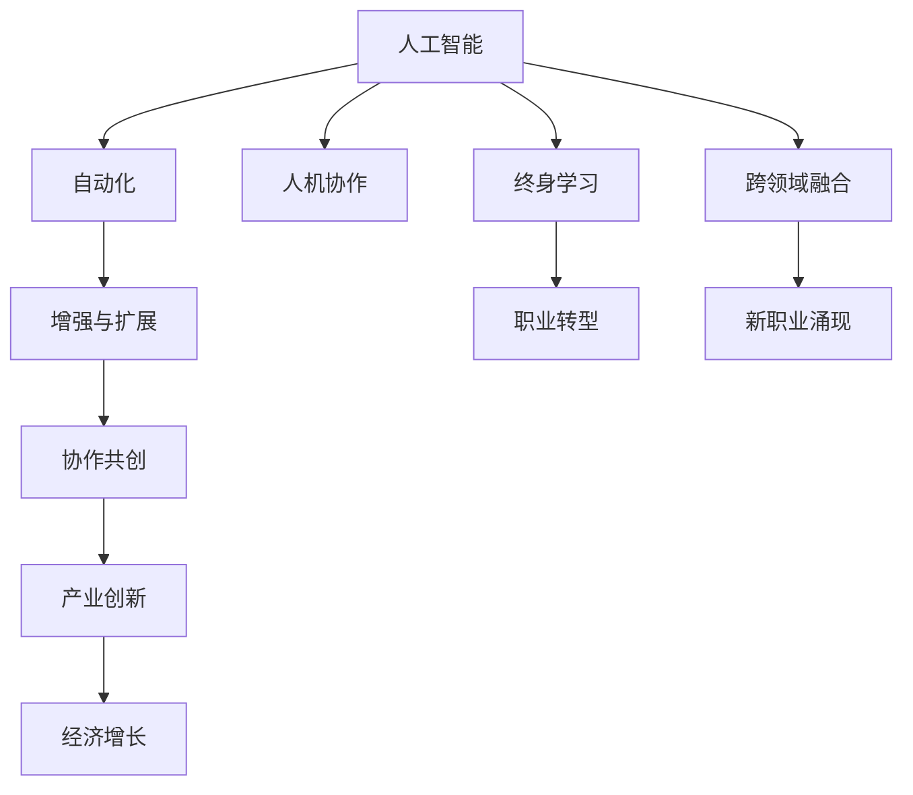

                 

# 未来工作：人机协作，重塑职业未来蓝图

> 关键词：人机协作, 自动化, 职业发展, 人工智能, 大数据, 数字劳动力

## 1. 背景介绍

### 1.1 问题由来

在21世纪的数字化浪潮中，人工智能(AI)和大数据技术的飞速发展正在重塑各个行业的业务模式和工作方式。从制造业到金融业，从医疗到教育，AI技术的渗透速度和影响深度前所未有。然而，技术的进步也引发了一系列关于职业未来和就业市场的深刻思考：AI会取代哪些工作岗位？人类如何与AI协同共事？未来的工作将面临怎样的变革？

这些问题不仅仅是学术讨论，更是现实社会的迫切挑战。应对AI技术的冲击，重塑职业未来，成为各国政府、企业和社会各界亟需解决的重要课题。

### 1.2 问题核心关键点

本节将详细阐述人机协作的未来蓝图，分析AI技术对职业未来的深远影响，探讨人类与AI如何共融共进，共同开创新的工作生态。

1. **自动化与职业替代**：AI和机器学习算法的普及导致大量重复性、规律性工作被自动化取代，比如数据分析、图像识别、文本处理等。这些工作通常被看作是可被AI替代的。
2. **增强与扩展**：AI不仅替代工作，更能够增强人类的工作能力，扩展职业的边界。例如，在医疗、教育、艺术等领域，AI可以提供辅助诊断、个性化教学、创意支持等功能。
3. **协作共创**：未来的工作模式将更加注重人机协作共创，利用AI提供的洞察和决策支持，人类能够专注于更具有创造性和情感价值的工作。
4. **终身学习与职业转型**：AI技术的快速发展要求劳动者不断学习新技能，适应新的职业需求，推动终身学习文化。
5. **跨领域融合与创新**：AI技术的跨领域应用将促进新产业和新职位的涌现，推动产业创新和经济增长。

## 2. 核心概念与联系

### 2.1 核心概念概述

为更好地理解未来工作模式，本节将介绍几个关键概念：

- **人工智能(AI)**：通过计算机算法使机器具备类人智能的技术，包括机器学习、深度学习、自然语言处理等。
- **自动化**：通过机器人、软件系统等技术，自动完成某些任务，以提高效率和减少人工成本。
- **增强与扩展**：利用AI技术，增强人类在认知、决策、执行等方面的能力，扩展职业的可能性。
- **人机协作**：人类与AI系统之间的协同工作模式，既包括AI辅助人类，也包括人类指导AI。
- **终身学习**：不断更新和提升自身技能，适应技术变化和新职业需求的过程。
- **跨领域融合**：不同技术、不同行业之间的融合与创新，推动新产业和新职位的形成。

这些核心概念之间相互关联，共同构成了未来工作的重要框架。通过理解这些概念，我们可以更好地把握AI技术对职业未来的影响，制定相应的发展策略。

### 2.2 核心概念原理和架构的 Mermaid 流程图



这个流程图展示了核心概念之间的逻辑关系：

1. AI技术的自动化能力，使许多重复性工作可以被机器人替代。
2. AI技术增强和扩展了人类的工作能力，使其能够完成更复杂、创造性的任务。
3. 人机协作模式，让AI辅助人类进行更高效的工作。
4. 终身学习文化，推动劳动者不断学习新技能，适应职业变化。
5. 跨领域融合，推动新产业和新职位的形成，促进产业创新和经济增长。

## 3. 核心算法原理 & 具体操作步骤
### 3.1 算法原理概述

未来工作模式的核心算法原理，主要涉及AI与人类工作的协同优化。基于此，我们将从以下几个方面进行探讨：

1. **自动化算法**：用于描述自动化任务的算法，如机器学习算法、规则引擎等，用于处理重复性、规律性任务。
2. **增强与扩展算法**：描述AI如何辅助人类进行任务，如决策支持、知识增强等算法。
3. **协作共创算法**：描述人机协作的具体方式，如任务分配、协同决策等算法。
4. **终身学习算法**：用于推动劳动者学习新技能，适应新职业要求的算法。
5. **跨领域融合算法**：描述不同技术、不同行业之间的融合与创新算法。

### 3.2 算法步骤详解

**自动化算法步骤**：

1. **数据收集与预处理**：收集业务数据，进行清洗和标准化处理。
2. **模型训练与优化**：基于收集的数据，训练自动化模型，如决策树、神经网络等，并进行参数优化。
3. **部署与应用**：将训练好的模型部署到自动化系统中，应用到实际业务场景中，进行数据处理、任务执行等自动化操作。
4. **反馈与改进**：收集自动化系统的运行反馈，进行模型优化和改进，提高自动化效果。

**增强与扩展算法步骤**：

1. **任务分析与需求识别**：分析任务的复杂性和需求，确定AI能够增强和扩展的具体方面。
2. **AI技术选型**：根据任务需求，选择适合的AI技术，如自然语言处理、图像识别、语音识别等。
3. **集成与优化**：将AI技术与现有系统集成，进行参数调优和系统优化，确保AI技术的有效性。
4. **评估与反馈**：评估AI技术的使用效果，收集用户反馈，进行持续改进。

**协作共创算法步骤**：

1. **任务分解与角色分配**：将任务分解为多个子任务，明确各子任务的责任和角色。
2. **协同决策机制设计**：设计协同决策的机制，如投票、共识、专家咨询等，确保决策的合理性和公正性。
3. **协作工具与平台建设**：建设协作工具和平台，支持实时沟通、协作编辑等功能，提高协作效率。
4. **评估与优化**：评估协作效果，收集协作过程中的反馈，持续优化协作模式。

**终身学习算法步骤**：

1. **学习需求分析**：分析工作任务对新技能的需求，确定学习的方向和内容。
2. **学习资源准备**：准备学习所需的资源，如在线课程、书籍、培训等。
3. **学习计划制定**：制定学习计划，设定学习目标和时间表，确保学习的系统性和有效性。
4. **学习效果评估**：评估学习效果，通过考试、项目实践等方式检验学习成果。
5. **学习反馈与改进**：收集学习过程中的反馈，改进学习方法和资源，持续提升学习效果。

**跨领域融合算法步骤**：

1. **领域识别与分析**：识别跨领域融合的潜在领域，进行需求和目标分析。
2. **技术选型与集成**：选择适合的跨领域融合技术，如大数据、区块链、物联网等，进行技术集成。
3. **应用场景设计**：设计跨领域融合的应用场景，明确技术应用的目标和价值。
4. **效果评估与反馈**：评估跨领域融合的效果，收集应用过程中的反馈，进行持续改进。

### 3.3 算法优缺点

未来工作模式的算法设计需要综合考虑多方面的因素，以下是其优缺点分析：

**优点**：

1. **效率提升**：自动化算法能够大幅提升任务的执行效率，减少人工错误，提高工作质量。
2. **决策辅助**：增强与扩展算法能够提供决策支持，帮助人类做出更科学、合理的决策。
3. **协作共创**：协作共创算法能够实现高效、协同的工作模式，提升整体工作效率。
4. **技能提升**：终身学习算法能够帮助劳动者不断提升自身技能，适应职业变化。
5. **创新驱动**：跨领域融合算法能够促进技术创新，推动新产业和新职位的形成。

**缺点**：

1. **初始投资高**：自动化和AI技术的应用，需要较高的初始投资和系统建设成本。
2. **技术复杂度高**：涉及多领域的融合与创新，技术复杂度较高，需要专业的技术团队支持。
3. **数据隐私问题**：在处理数据过程中，需要严格保护用户隐私，避免数据泄露。
4. **技能缺口**：AI技术的普及需要大量掌握新技能的人才，可能面临人才短缺的问题。
5. **伦理与法律风险**：AI技术的广泛应用可能引发伦理和法律问题，需要慎重考虑和规范。

### 3.4 算法应用领域

未来工作模式的应用领域非常广泛，主要涉及以下几个方面：

1. **制造业**：自动化生产线、智能仓储、质量检测等。
2. **金融业**：风险管理、投资分析、客户服务等。
3. **医疗健康**：诊断辅助、个性化治疗、健康监测等。
4. **教育培训**：智能教学、在线辅导、学习分析等。
5. **文化艺术**：内容创作、情感分析、用户互动等。
6. **政府与公共服务**：智能政务、公共安全、城市管理等。
7. **企业运营**：业务分析、客户关系管理、供应链优化等。

这些应用领域涵盖了各行业的主要业务流程，展现了AI技术对未来工作的深远影响。

## 4. 数学模型和公式 & 详细讲解 & 举例说明

### 4.1 数学模型构建

未来工作模式的设计，涉及多种数学模型和算法，以下将以自动化算法为例，进行详细介绍。

假设自动化任务为数据处理，输入为原始数据集 $D$，输出为处理后的数据集 $D'$。则自动化算法可以表示为：

$$
D' = f(D; \theta)
$$

其中 $f$ 为自动化模型，$\theta$ 为模型参数。

**优化目标**：

$$
\min_{\theta} \mathcal{L}(D'; D', D')
$$

其中 $\mathcal{L}$ 为损失函数，用于衡量处理后的数据与原始数据之间的差异。

**优化算法**：

$$
\theta \leftarrow \theta - \eta \nabla_{\theta}\mathcal{L}(D'; D', D')
$$

其中 $\eta$ 为学习率，$\nabla_{\theta}\mathcal{L}(D'; D', D')$ 为损失函数对模型参数的梯度。

### 4.2 公式推导过程

**数据处理算法**：

假设原始数据集 $D$ 包含 $N$ 个样本，每个样本包含 $d$ 个特征。定义自动化算法 $f$ 为线性映射：

$$
f(x_i) = Wx_i + b
$$

其中 $W$ 为权重矩阵，$b$ 为偏置向量，$x_i$ 为第 $i$ 个样本的特征向量。

定义损失函数 $\mathcal{L}$ 为均方误差损失：

$$
\mathcal{L}(D'; D', D') = \frac{1}{N} \sum_{i=1}^N ||D_i - f(D_i')||^2
$$

其中 $D_i$ 为第 $i$ 个样本的原始数据，$D_i'$ 为第 $i$ 个样本的处理数据。

通过链式法则，损失函数对权重矩阵 $W$ 的梯度为：

$$
\frac{\partial \mathcal{L}}{\partial W} = \frac{2}{N} \sum_{i=1}^N (D_i - f(D_i'))D_i'
$$

通过优化算法更新权重矩阵 $W$：

$$
W \leftarrow W - \eta \frac{\partial \mathcal{L}}{\partial W}
$$

通过上述公式，我们能够实现自动化算法的优化过程，从而提升数据处理的效率和质量。

### 4.3 案例分析与讲解

**案例1：自动化报表生成**

某公司希望通过自动化算法生成月度销售报表，减少人工工作量。原始数据包括销售额、产品类别、时间等特征。通过自动化算法，将原始数据进行处理和分析，生成新的报表数据。具体实现步骤如下：

1. 数据预处理：清洗原始数据，删除缺失值，标准化特征。
2. 特征选择与提取：选择相关性高的特征，提取数值型和分类型的特征。
3. 模型训练与优化：基于选定的特征，训练线性回归模型，进行参数优化。
4. 报表生成与分析：根据训练好的模型，生成新的报表数据，并进行数据分析和可视化。

**案例2：自动化客户服务**

某客服中心希望通过自动化算法优化客户服务流程，提高客户满意度。原始数据包括客户来电记录、客服对话记录、客户反馈等。通过自动化算法，实现自动分派、自动回复等功能。具体实现步骤如下：

1. 数据预处理：清洗原始数据，标注客户情感和意图。
2. 特征选择与提取：选择情感、意图等特征，提取文本特征。
3. 模型训练与优化：基于选定的特征，训练情感分析模型，进行参数优化。
4. 服务优化与评估：根据训练好的模型，实现自动分派和自动回复，并进行服务效果评估。

这些案例展示了自动化算法在实际业务场景中的应用，进一步说明未来工作模式的多样性和重要性。

## 5. 项目实践：代码实例和详细解释说明

### 5.1 开发环境搭建

在进行未来工作模式的实践前，我们需要准备好开发环境。以下是使用Python进行TensorFlow开发的环境配置流程：

1. 安装Anaconda：从官网下载并安装Anaconda，用于创建独立的Python环境。

2. 创建并激活虚拟环境：
```bash
conda create -n tf-env python=3.8 
conda activate tf-env
```

3. 安装TensorFlow：根据CUDA版本，从官网获取对应的安装命令。例如：
```bash
pip install tensorflow
```

4. 安装Pandas、Numpy、Matplotlib等工具包：
```bash
pip install pandas numpy matplotlib scikit-learn matplotlib tqdm jupyter notebook ipython
```

完成上述步骤后，即可在`tf-env`环境中开始实践。

### 5.2 源代码详细实现

下面以自动化报表生成为例，给出使用TensorFlow进行自动化数据处理的PyTorch代码实现。

首先，定义自动化任务的数据处理函数：

```python
import tensorflow as tf
import pandas as pd
import numpy as np

def preprocess_data(data):
    # 数据清洗和标准化处理
    data = data.dropna()
    data['销售额'] = (data['销售额'] - data['销售额'].mean()) / data['销售额'].std()
    data['产品类别'] = pd.get_dummies(data['产品类别'], drop_first=True)
    data = data[~data['时间'].isnull()]
    
    # 特征选择与提取
    features = ['销售额', '产品类别']
    X = data[features].values
    y = data['销售额'].values
    
    return X, y
```

然后，定义模型和优化器：

```python
from tensorflow.keras.models import Sequential
from tensorflow.keras.layers import Dense

model = Sequential()
model.add(Dense(64, input_dim=X.shape[1], activation='relu'))
model.add(Dense(1))
model.compile(loss='mse', optimizer='adam')
```

接着，定义训练和评估函数：

```python
def train_model(model, X, y, batch_size=32, epochs=100):
    model.fit(X, y, batch_size=batch_size, epochs=epochs, validation_split=0.2)
    
def evaluate_model(model, X, y, batch_size=32):
    mse = model.evaluate(X, y, batch_size=batch_size)
    return mse
```

最后，启动训练流程并在测试集上评估：

```python
X_train, y_train = preprocess_data(train_data)
X_test, y_test = preprocess_data(test_data)

train_model(model, X_train, y_train)
mse = evaluate_model(model, X_test, y_test)
print(f'Test MSE: {mse:.4f}')
```

以上就是使用TensorFlow进行自动化报表生成的完整代码实现。可以看到，通过TensorFlow提供的高级API，自动化算法的实现变得简洁高效。

### 5.3 代码解读与分析

让我们再详细解读一下关键代码的实现细节：

**preprocess_data函数**：
- 数据清洗：删除缺失值，标准化数值特征。
- 特征选择：选择销售额和产品类别作为特征。
- 数据转换：将分类特征进行独热编码，并去除不必要的第一列。

**model定义**：
- 定义了简单的线性回归模型，包含两个全连接层。
- 使用均方误差损失和Adam优化器进行训练。

**train_model函数**：
- 使用训练集数据进行模型训练，设置批次大小和迭代轮数。
- 在每个epoch结束时，在验证集上评估模型性能。

**evaluate_model函数**：
- 使用测试集数据评估模型性能，返回均方误差。

**训练流程**：
- 先对训练数据进行预处理，再训练模型，并输出测试误差。

可以看到，TensorFlow提供了丰富的API和工具，使得自动化算法的实现变得简单易懂。通过合理的API调用，可以快速构建和训练自动化模型，解决实际业务问题。

当然，工业级的系统实现还需考虑更多因素，如模型的保存和部署、超参数的自动搜索、更灵活的任务适配层等。但核心的自动化算法基本与此类似。

## 6. 实际应用场景
### 6.1 智能客服系统

智能客服系统通过自动化算法优化客户服务流程，显著提升客户满意度。具体应用包括：

1. **自动分派**：基于客户来电记录和客服对话，自动匹配合适的客服代表，减少客户等待时间。
2. **自动回复**：通过分析客户情感和意图，自动生成个性化的回复内容，提高客户互动质量。
3. **服务评价**：对客户服务进行自动评价，发现服务问题并及时改进。

通过自动化算法，智能客服系统实现了高效、智能的服务模式，帮助企业提升客户体验和运营效率。

### 6.2 金融舆情监测

金融舆情监测通过自动化算法分析网络舆情，及时发现市场动态，辅助金融决策。具体应用包括：

1. **舆情分析**：对新闻、评论、社交媒体等文本数据进行情感分析，判断市场情绪。
2. **趋势预测**：基于历史数据和实时舆情，预测市场趋势，提供决策支持。
3. **风险预警**：监测舆情变化，及时发现市场异常，预警潜在风险。

通过自动化算法，金融舆情监测系统能够实时监控市场动态，辅助金融机构做出更加精准的决策。

### 6.3 个性化推荐系统

个性化推荐系统通过自动化算法优化推荐策略，提升用户体验和推荐效果。具体应用包括：

1. **用户画像生成**：基于用户行为数据，生成用户画像，理解用户偏好。
2. **推荐策略优化**：根据用户画像和实时数据，优化推荐策略，提高推荐准确性。
3. **效果评估**：对推荐结果进行评估，发现和改进推荐算法。

通过自动化算法，个性化推荐系统能够提供精准、个性化的推荐服务，提升用户满意度和留存率。

### 6.4 未来应用展望

随着自动化技术的不断进步，未来工作模式将展现出更加多样化和高效化的趋势：

1. **自动化程度提升**：自动化算法将在更多领域得到应用，如智能制造、智慧农业、智能交通等，推动各行业的智能化转型。
2. **人机协作深化**：通过更智能的自动化算法，人机协作将更加高效、智能，实现更加精准的任务分配和协同决策。
3. **新职位涌现**：自动化和AI技术将催生新的职业岗位，如数据分析师、机器人维护工程师、AI产品经理等，推动就业结构的多元化。
4. **终身学习普及**：AI技术的快速发展要求劳动者不断学习新技能，终身学习文化将成为未来工作的重要特征。
5. **跨领域创新爆发**：AI技术的跨领域融合将带来新的产业和应用，推动经济社会的创新和发展。

这些趋势展示了未来工作模式广阔的应用前景，为各行业的数字化转型提供了新的方向和思路。

## 7. 工具和资源推荐
### 7.1 学习资源推荐

为了帮助开发者系统掌握未来工作模式的理论基础和实践技巧，这里推荐一些优质的学习资源：

1. **《人工智能：一种现代方法》（Artificial Intelligence: A Modern Approach）**：详细介绍了人工智能的基本原理和应用，适合全面理解AI技术的理论基础。
2. **Coursera的《机器学习》课程**：由斯坦福大学Andrew Ng教授主讲的经典机器学习课程，涵盖了机器学习算法和实际应用。
3. **《深度学习入门：基于Python的理论与实现》**：一本深入浅出介绍深度学习技术的书籍，包含丰富的代码实例和实践指导。
4. **TensorFlow官方文档**：提供全面的TensorFlow使用指南和API文档，适合快速上手学习和实践。
5. **Kaggle平台**：提供丰富的数据集和竞赛项目，适合实践AI算法的开发和优化。

通过这些资源的学习，相信你一定能够系统掌握未来工作模式的精髓，并用于解决实际的业务问题。

### 7.2 开发工具推荐

高效的开发离不开优秀的工具支持。以下是几款用于未来工作模式开发的常用工具：

1. **Python**：简洁易用的编程语言，拥有丰富的第三方库和工具支持，非常适合AI算法开发。
2. **TensorFlow**：开源深度学习框架，支持大规模分布式训练和部署，适合复杂AI任务的开发。
3. **PyTorch**：动态图计算框架，灵活高效，适合研究和原型开发。
4. **Jupyter Notebook**：基于Python的交互式笔记本，支持代码编写、数据处理、可视化等多种功能，适合快速开发和实验。
5. **Git和GitHub**：版本控制和代码托管平台，适合团队协作和代码版本管理。

合理利用这些工具，可以显著提升未来工作模式的开发效率，加速AI技术的应用落地。

### 7.3 相关论文推荐

未来工作模式的研究涉及多学科交叉，以下是几篇具有代表性的相关论文，推荐阅读：

1. **《自动化与人工智能：未来工作模式研究》**：系统分析了自动化和AI技术对未来工作模式的影响，提出了多角度的研究框架。
2. **《人机协作：未来工作的新范式》**：探讨了人机协作的未来趋势和应用场景，提出了新型协作模式和决策算法。
3. **《跨领域融合：AI技术的创新应用》**：分析了跨领域融合的挑战和机遇，提出多种融合策略和创新思路。
4. **《终身学习：技能提升与职业转型》**：研究了终身学习在AI时代的重要性，提出了终身学习体系的构建方法。
5. **《未来职业展望：AI时代的职业发展》**：预测了AI时代职业发展的方向和趋势，提出了职业转型的策略和方法。

这些论文代表了大数据和AI技术对未来工作模式的研究进展，为未来的技术应用提供了宝贵的理论支持和实践指导。

## 8. 总结：未来发展趋势与挑战
### 8.1 总结

本文对未来工作模式的原理、操作步骤、优缺点、应用领域等方面进行了详细阐述。通过系统梳理，我们能够更好地理解人机协作在未来的重要性和应用前景。

未来工作模式的核心在于充分利用AI技术，实现自动化和增强与扩展，推动人类与AI的协同共创。通过合理设计算法和模型，能够显著提升各行业的效率和质量，促进就业结构的优化和经济社会的创新发展。

### 8.2 未来发展趋势

展望未来，未来工作模式将展现出以下几个发展趋势：

1. **自动化与智能化并行**：自动化算法将更加智能、高效，能够更好地辅助人类进行任务执行。
2. **人机协作深化**：人机协作将更加紧密、智能，实现更加精准的任务分配和协同决策。
3. **跨领域融合广泛**：AI技术的跨领域融合将推动新产业和新职位的形成，促进经济社会的全面创新。
4. **终身学习普及**：终身学习文化将成为未来工作的重要特征，推动劳动者不断提升自身技能，适应职业变化。
5. **伦理与法律重视**：AI技术的广泛应用需要关注伦理与法律问题，确保技术的安全和可靠性。

这些趋势展示了未来工作模式广阔的发展前景，为各行业的数字化转型提供了新的方向和思路。

### 8.3 面临的挑战

尽管未来工作模式的应用前景广阔，但在实际应用中也面临诸多挑战：

1. **技术复杂度高**：AI技术的跨领域应用涉及多学科知识，技术复杂度较高，需要专业的技术团队支持。
2. **数据隐私问题**：在处理数据过程中，需要严格保护用户隐私，避免数据泄露。
3. **技能缺口**：AI技术的普及需要大量掌握新技能的人才，可能面临人才短缺的问题。
4. **伦理与法律风险**：AI技术的广泛应用可能引发伦理和法律问题，需要慎重考虑和规范。

### 8.4 研究展望

未来的研究需要在以下几个方面寻求新的突破：

1. **自动化算法优化**：开发更加高效、智能的自动化算法，提升自动化任务的执行效率和质量。
2. **人机协作模式探索**：探索更加高效、智能的人机协作模式，提高协同决策的精准度和效率。
3. **跨领域融合创新**：推动AI技术的跨领域融合，促进新产业和新职位的形成，推动经济社会的创新发展。
4. **终身学习体系构建**：构建终身学习体系，推动劳动者不断提升自身技能，适应职业变化。
5. **伦理与法律规范**：研究AI技术的伦理与法律问题，确保技术的安全和可靠性。

这些研究方向的探索，必将引领未来工作模式迈向更高的台阶，为构建安全、可靠、高效的工作生态提供新思路。

## 9. 附录：常见问题与解答

**Q1：未来工作模式将取代所有传统工作岗位吗？**

A: 未来工作模式将改变许多传统工作岗位，但也将创造许多新的职业岗位。AI技术的自动化能力将取代重复性、规律性工作，但同时也将提升工作质量，创造新的智能服务岗位。

**Q2：未来工作模式的实现是否需要大量数据支持？**

A: 是的，自动化和AI技术的应用需要大量的数据支持。数据的质量和多样性直接影响自动化算法的精度和效果。

**Q3：未来工作模式是否会增加企业成本？**

A: 初期实现未来工作模式可能增加一定的技术投入，但长期来看，自动化和AI技术将大幅提升工作效率和质量，降低运营成本，提高企业竞争力。

**Q4：未来工作模式如何保护数据隐私？**

A: 数据隐私保护是未来工作模式的重要考虑因素。企业需要制定严格的数据隐私保护策略，如数据匿名化、访问控制等，确保数据安全。

**Q5：未来工作模式对员工技能的要求会更高吗？**

A: 是的，未来工作模式要求员工掌握更多新技能，如编程、数据分析、机器学习等。企业需要提供培训和支持，帮助员工适应新岗位要求。

通过本文的系统梳理，我们可以看到未来工作模式具有广阔的应用前景和深远的社会影响。尽管面临一些挑战，但通过技术创新和伦理规范，相信未来工作模式将引领各行业数字化转型，推动经济社会的全面创新。

