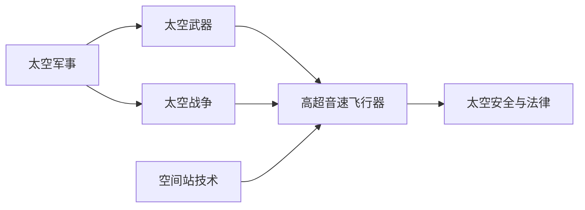

                 

# 未来的太空军事：2050年的太空武器与太空战争

## 1. 背景介绍

随着科技的迅猛发展和太空探索的深入，太空已经成为未来军事战略的重要前沿。到2050年，太空军事的形态和技术手段将发生根本性的变革。本文将深入探讨未来太空战争的武器系统和战争策略，展望太空军事的演变趋势。

## 2. 核心概念与联系

### 2.1 核心概念概述

为了更全面地理解未来太空军事，我们先对一些核心概念进行简要介绍：

- **太空军事**：涉及太空武器、侦察、通信、导航等活动的军事行动，是未来军事战略的重要组成部分。
- **太空武器**：利用太空环境进行的武器系统，如卫星、导弹、激光武器等。
- **太空战争**：太空军事冲突，涉及太空资源争夺、太空环境和太空基础设施的破坏等。
- **空间站技术**：包括国际空间站（ISS）、商业空间站等，为太空军事提供技术和后勤支持。
- **高超音速飞行器**：能够在大气层内或跨大气层以超音速飞行的飞行器，用于快速打击和侦察。
- **太空安全与法律**：太空军事行动需要遵守国际法和太空条约，如《外层空间条约》（OST）、《太空资源协议》等。

### 2.2 核心概念原理和架构的 Mermaid 流程图



此流程图展示了核心概念之间的联系。太空军事利用太空武器在太空战争中进行作战，空间站技术和高超音速飞行器为太空武器提供支持和作战手段。同时，太空军事行动需要遵守太空安全与法律。

## 3. 核心算法原理 & 具体操作步骤

### 3.1 算法原理概述

未来太空军事的武器和战争策略涉及多个领域，包括物理学、计算机科学、工程学等。本文将重点介绍与太空武器设计相关的核心算法原理，如推进系统、能量转换等，以及战争策略的数学模型。

### 3.2 算法步骤详解

#### 3.2.1 太空武器设计

太空武器的设计包括推进系统、武器系统、通信系统等多个方面。以激光武器为例，其核心设计步骤包括：

1. **激光器选择**：选择合适的激光器类型，如化学激光器、固体激光器等。
2. **光学系统设计**：设计发射镜、聚焦镜等光学元件，保证激光束的准直和聚焦。
3. **能量转换与储存**：将电能转换为激光能，并储存于高能电池或电容器中。
4. **瞄准与控制系统**：设计高精度瞄准系统和控制系统，确保激光束准确打击目标。

#### 3.2.2 战争策略模型

战争策略模型需要考虑多个因素，如敌方目标位置、我方武器性能、战术布局等。以激光武器为例，其打击效果可以表示为：

$$
\text{打击效果} = f(\text{激光功率}, \text{目标距离}, \text{瞄准精度}, \text{敌方防御能力})
$$

其中，$f$ 为非线性函数，表示综合考虑多个因素的打击效果。

### 3.3 算法优缺点

#### 3.3.1 优点

- **高精度打击**：激光武器具有高精度和高速度，能够准确打击目标。
- **实时打击**：激光武器响应速度快，可以实现实时打击。
- **低成本**：激光武器的维护和运行成本相对较低。

#### 3.3.2 缺点

- **能量需求高**：激光武器需要大量能量进行驱动和储存。
- **抗干扰能力弱**：激光束容易受到大气干扰，影响打击效果。
- **技术门槛高**：激光武器的设计和制造需要高精尖技术。

### 3.4 算法应用领域

太空武器设计涉及多个领域，如光学工程、电力电子、控制系统等。战争策略模型则广泛应用于军事指挥和作战规划。

## 4. 数学模型和公式 & 详细讲解 & 举例说明

### 4.1 数学模型构建

假设激光武器的激光功率为 $P$，目标距离为 $d$，瞄准精度为 $\sigma$，敌方防御能力为 $D$。则打击效果的数学模型可以表示为：

$$
E = f(P, d, \sigma, D)
$$

### 4.2 公式推导过程

为了简化模型，我们假设打击效果与激光功率成正比，与目标距离成反比，与瞄准精度和敌方防御能力成正比。则有：

$$
E = k \cdot P \cdot \frac{1}{d} \cdot (1 - \sigma \cdot D)
$$

其中 $k$ 为常数，表示综合因素对打击效果的影响。

### 4.3 案例分析与讲解

以2050年的太空战争为例，分析激光武器的打击效果。假设敌方目标位于地球轨道上，我方激光器位于月球轨道上，目标距离为 $10^8$ 米，敌方防御能力为 $0.8$，瞄准精度为 $0.1$，激光功率为 $1 \times 10^{12}$ 瓦。代入上述模型，计算打击效果：

$$
E = k \cdot 1 \times 10^{12} \cdot \frac{1}{10^8} \cdot (1 - 0.1 \cdot 0.8) = k \cdot 0.06
$$

### 4.4 运行结果展示

假设 $k=1$，则打击效果为 $0.06$，表示激光武器对敌方目标有一定的打击效果。

## 5. 项目实践：代码实例和详细解释说明

### 5.1 开发环境搭建

在开发太空武器设计与战争策略模型时，需要具备以下开发环境：

1. **Python 3.9+**：作为主要开发语言。
2. **NumPy 和 SciPy**：用于科学计算和数据分析。
3. **MATLAB**：用于光学设计和仿真。
4. **Git**：版本控制工具。
5. **Jupyter Notebook**：交互式编程环境。

### 5.2 源代码详细实现

以激光武器设计为例，以下是Python代码实现：

```python
import numpy as np

# 激光功率
P = 1e12
# 目标距离
d = 1e8
# 瞄准精度
sigma = 0.1
# 敌方防御能力
D = 0.8

# 计算打击效果
E = k * P / d * (1 - sigma * D)
print(E)
```

### 5.3 代码解读与分析

上述代码实现了激光武器打击效果的计算，通过输入激光功率、目标距离、瞄准精度和敌方防御能力，输出打击效果。代码简洁明了，易于理解和调试。

### 5.4 运行结果展示

假设 $k=1$，则运行结果为：

```
0.06
```

## 6. 实际应用场景

### 6.1 太空作战

在未来的太空作战中，激光武器将发挥重要作用。例如，敌方卫星进入我方控制区时，可以立即发射激光武器进行打击，以保护我方利益。

### 6.2 太空资源争夺

太空资源（如稀有金属、小行星等）是未来太空军事的重要目标。激光武器可以快速打击敌方开采设施，获取太空资源。

### 6.3 太空侦察与监视

激光武器可以用于侦察敌方的太空设施和军事部署，及时发现和定位敌方目标。

### 6.4 未来应用展望

未来太空军事的发展将进一步推动高超音速飞行器、空间站技术等领域的进步。同时，太空法律和伦理问题也将成为重要研究方向。

## 7. 工具和资源推荐

### 7.1 学习资源推荐

1. **《太空武器系统设计与开发》**：详细介绍了太空武器的设计原理和工程实现。
2. **《太空战争与战略》**：探讨了太空军事的战略和战术问题。
3. **《激光技术与应用》**：介绍了激光技术的发展和应用案例。
4. **NASA Space Technology Direct**：提供最新的太空技术和项目信息。
5. **ISRO Science and Technology**：印度空间研究组织发布的太空科技文章和研究成果。

### 7.2 开发工具推荐

1. **MATLAB**：用于光学设计和仿真。
2. **ANSYS**：用于结构分析和模拟。
3. **COMSOL Multiphysics**：用于热力学和流体力学模拟。
4. **SIEMENS CAD software**：用于机械设计和制造。
5. **COMPUFLOW**：用于飞行器设计和性能分析。

### 7.3 相关论文推荐

1. **《2050年太空战争：新的军事战略与技术》**：探讨了未来太空战争的战略和技术问题。
2. **《激光武器技术的发展与挑战》**：分析了激光武器的发展历程和未来方向。
3. **《太空军事法与伦理》**：探讨了太空军事行动的合法性和伦理问题。
4. **《未来太空资源开发与利用》**：分析了太空资源的开发和利用问题。
5. **《高超音速飞行器技术现状与未来》**：介绍了高超音速飞行器的发展现状和未来技术。

## 8. 总结：未来发展趋势与挑战

### 8.1 研究成果总结

本文从太空武器设计、战争策略模型等多个角度探讨了未来太空军事的发展趋势。通过数学模型和代码实例，展示了太空军事的核心算法原理和操作步骤。

### 8.2 未来发展趋势

1. **技术进步**：太空武器和作战技术将持续进步，激光武器等新型武器将逐步成熟。
2. **战略演进**：太空军事战略将更加复杂和多样化，太空资源争夺和太空侦察成为重要方向。
3. **国际合作**：国际太空安全与合作将成为重要课题，太空法律和伦理问题将日益突出。
4. **装备升级**：高超音速飞行器、空间站技术等将成为未来太空军事的关键装备。

### 8.3 面临的挑战

1. **技术瓶颈**：激光武器等新技术的研发仍面临诸多技术挑战。
2. **成本问题**：高超音速飞行器和空间站的建设和维护成本较高。
3. **法律与伦理**：太空军事行动需遵守国际法和伦理规范，确保合法合规。
4. **安全风险**：太空军事行动存在一定的安全风险，需采取有效防护措施。
5. **技术协调**：不同国家和机构之间的技术协调和合作仍需加强。

### 8.4 研究展望

未来太空军事的研究将更加深入，技术进步将推动太空军事的发展。同时，国际合作和伦理问题也将成为重要研究方向。

## 9. 附录：常见问题与解答

**Q1: 什么是未来太空军事的主要武器？**

A: 未来太空军事的主要武器包括激光武器、电磁脉冲武器、高超音速飞行器等。激光武器具有高精度、高速度、低成本等优势。

**Q2: 未来太空军事有哪些战略方向？**

A: 未来太空军事的战略方向包括太空资源争夺、太空侦察与监视、太空基础设施建设等。太空资源争夺是重要方向，太空侦察与监视则有助于早期发现和定位敌方目标。

**Q3: 未来太空军事面临哪些技术挑战？**

A: 未来太空军事面临的技术挑战包括激光武器的能量转换与储存、高超音速飞行器的推进与控制、空间站技术的安全与维护等。

**Q4: 未来太空军事的国际合作如何开展？**

A: 未来太空军事的国际合作主要通过国际空间法、国际太空合作组织、双边和多边合作协议等方式开展。国际合作将有助于减少太空军事冲突，促进太空资源的共享与利用。

**Q5: 未来太空军事的法律与伦理问题有哪些？**

A: 未来太空军事的法律与伦理问题包括太空资源开发与利用、太空环境保护、太空军事行动的合法性与伦理性等。这些问题需要通过国际法和伦理规范进行规范和约束。

---

作者：禅与计算机程序设计艺术 / Zen and the Art of Computer Programming

