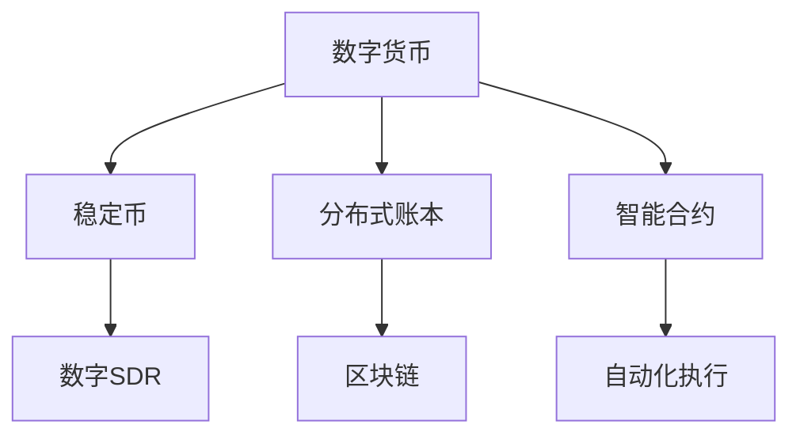
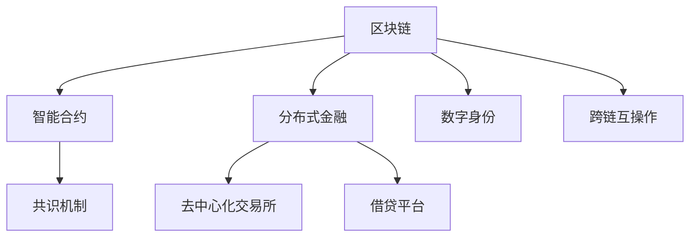

                 

# 未来的数字货币：从稳定币到全球数字货币SDR的数字货币体系

## 1. 背景介绍

### 1.1 问题由来

数字货币，作为一种新兴的货币形式，近年来在全球范围内迅速发展。从比特币(Bitcoin)、以太坊(Ethereum)到稳定币(Stablecoin)，数字货币领域的技术和应用不断突破，引发了传统金融行业的广泛关注。特别是近年来，全球数字货币体系的构建成为了各国央行和金融机构的重点研究课题。

2022年11月，国际货币基金组织(IMF)与中央银行合作开发了一种全球数字货币——特别提款权(Special Drawing Right, SDR)的数字化版本，即数字SDR（Digital SDR, eSDR）。这标志着全球数字货币体系迈出了重要一步，为未来的数字货币应用提供了新的方向和参考。

### 1.2 问题核心关键点

- **数字货币**：指电子形式的货币，主要基于区块链、分布式账本等技术，具有去中心化、透明、安全等特点。
- **稳定币**：一种与一篮子货币、商品、资产等挂钩的数字货币，旨在保持其相对稳定，避免波动过大。
- **数字SDR**：即SDR的数字化版本，由IMF发行，旨在为全球金融市场提供一种统一的货币资产，促进跨境支付和金融稳定。
- **分布式账本**：一种去中心化的账本技术，如区块链，用于记录和验证交易，确保数据安全和透明。
- **智能合约**：一种自动执行和验证的合约，通过区块链技术实现，无需第三方介入。

这些关键概念之间的逻辑关系可以通过以下Mermaid流程图来展示：



这个流程图展示了数字货币的演化路径及其技术基础：

1. 数字货币起源于区块链等分布式账本技术，并衍生出稳定币等变种。
2. 数字SDR是在稳定币的基础上，进一步演化，成为全球统一的数字货币资产。
3. 区块链是分布式账本的核心技术，用于保证数据透明和安全。
4. 智能合约是在区块链上执行的自动化合约，确保交易的自动化和安全性。

## 2. 核心概念与联系

### 2.1 核心概念概述

为更好地理解全球数字货币体系的构建原理和应用场景，本节将介绍几个密切相关的核心概念：

- **区块链**：一种分布式账本技术，通过去中心化的方式记录和验证交易，具有透明、不可篡改等特点。比特币、以太坊等数字货币都基于区块链技术。
- **智能合约**：一种通过区块链执行的自动化合约，可以在预设条件满足时自动执行，无需第三方介入，广泛应用于金融、供应链等领域。
- **共识机制**：区块链中用于解决网络节点间信息一致性问题的机制，如工作量证明(Proof of Work, PoW)、权益证明(Proof of Stake, PoS)等。
- **分布式金融(DeFi)**：基于区块链的金融应用，如去中心化交易所、借贷平台、稳定币等，旨在实现去中心化、无需信任的金融服务。
- **数字身份**：通过区块链技术实现的数字身份认证，用于解决网络身份认证和隐私保护问题，广泛应用于身份验证、金融服务等领域。
- **跨链互操作**：不同区块链之间的交互和数据互操作，解决区块链之间的隔离问题，促进数字货币的跨链应用。

这些核心概念之间的逻辑关系可以通过以下Mermaid流程图来展示：



这个流程图展示了区块链和相关技术之间的关系：

1. 区块链是智能合约和分布式金融的底层技术。
2. 共识机制是区块链中的核心协议，用于解决网络一致性问题。
3. 数字身份和跨链互操作是区块链应用的延伸，用于解决身份认证和互操作性问题。

这些概念共同构成了全球数字货币体系的技术基础和应用框架，使得数字货币在未来的发展中能够更好地发挥其潜力和价值。

## 3. 核心算法原理 & 具体操作步骤
### 3.1 算法原理概述

全球数字货币体系的构建，本质上是一个去中心化的分布式系统设计过程。其核心算法包括：

- **区块链算法**：用于记录和验证交易，确保数据透明和安全。
- **共识算法**：用于解决网络节点间信息一致性问题，确保系统可靠性和安全性。
- **智能合约算法**：用于自动化执行合约，确保交易的自动化和安全性。
- **跨链互操作算法**：用于不同区块链之间的交互和数据互操作，解决区块链之间的隔离问题。

全球数字货币体系的目标是构建一个去中心化、透明、安全的金融系统，为全球金融市场提供统一的数字货币资产，促进跨境支付和金融稳定。

### 3.2 算法步骤详解

全球数字货币体系的构建，通常包括以下几个关键步骤：

**Step 1: 设计区块链架构**
- 选择合适的区块链协议和共识机制，如PoW、PoS等。
- 设计区块链的账本结构和交易验证规则。
- 确定区块链的存储和数据传输方式。

**Step 2: 开发智能合约**
- 编写智能合约代码，定义交易的执行逻辑和规则。
- 测试和验证智能合约的正确性和安全性。
- 部署智能合约到区块链上，并配置触发条件。

**Step 3: 实现跨链互操作**
- 开发跨链协议，支持不同区块链之间的数据传输和互操作。
- 实现跨链桥接和互操作功能，确保数据的一致性和安全性。
- 测试和验证跨链协议的正确性和可靠性。

**Step 4: 进行系统测试和部署**
- 在测试网络上测试系统的各项功能，确保其稳定性和可靠性。
- 根据测试结果进行调整和优化。
- 部署系统到生产环境，进行实际运行。

**Step 5: 监测和维护**
- 实时监测系统的各项指标，确保其稳定性和安全性。
- 定期进行系统维护和升级，优化性能和功能。
- 处理系统异常和故障，确保系统的可靠性和可用性。

### 3.3 算法优缺点

全球数字货币体系的构建具有以下优点：

1. **去中心化**：通过区块链技术，系统无需中心化机构参与，提高了系统的透明度和安全性。
2. **透明和不可篡改**：区块链技术保证了数据的透明和不可篡改性，防止了欺诈和数据篡改。
3. **高效率和低成本**：去中心化的分布式系统设计，减少了中间环节，提高了交易效率，降低了交易成本。
4. **稳定和可扩展**：通过共识算法和智能合约，确保系统的稳定性和可扩展性。

然而，全球数字货币体系的构建也存在以下缺点：

1. **技术复杂性**：区块链和智能合约的设计和实现较为复杂，需要高水平的技术支撑。
2. **监管和法律风险**：全球数字货币体系面临的监管和法律风险较高，需要多方协调和监管。
3. **数据隐私和安全**：区块链公开透明的特点，可能对数据隐私和安全带来一定的挑战。
4. **系统可扩展性**：当前区块链的扩展性仍有限，难以满足大规模交易的需求。
5. **共识机制的性能问题**：如PoW共识机制的能耗高、PoS共识机制的算法复杂等，限制了系统的性能。

尽管存在这些缺点，但全球数字货币体系的构建，仍是大势所趋，必将带来金融行业的深刻变革。

### 3.4 算法应用领域

全球数字货币体系的应用领域十分广泛，涵盖了金融、贸易、供应链、跨境支付等多个领域。以下是几个主要应用场景：

- **跨境支付**：通过数字货币实现跨国支付，提高支付效率，降低支付成本。
- **供应链金融**：基于区块链技术，实现供应链各环节的数字化管理，提升供应链效率和透明度。
- **数字身份认证**：通过区块链技术，实现数字身份的认证和管理，确保身份的真实性和不可篡改性。
- **去中心化金融(DeFi)**：基于区块链技术的金融服务，如去中心化交易所、借贷平台、稳定币等，旨在实现去中心化、无需信任的金融服务。
- **智能合约应用**：智能合约在金融、物流、医疗等多个领域的应用，如自动执行贷款合约、物流跟踪、医疗记录管理等。
- **资产证券化**：通过区块链技术，实现资产的数字化和证券化，提升资产的流动性和效率。

这些应用场景展示了全球数字货币体系的广泛应用前景，为未来的金融创新提供了新的方向和机会。

## 4. 数学模型和公式 & 详细讲解  
### 4.1 数学模型构建

全球数字货币体系的设计和构建，通常涉及以下几个关键数学模型：

- **区块链模型**：描述区块链的数据结构和交易验证规则，如交易哈希、区块链表、共识算法等。
- **智能合约模型**：描述智能合约的执行逻辑和规则，如合约状态机、事件触发、状态更新等。
- **跨链互操作模型**：描述跨链协议和互操作机制，如跨链桥接、数据传输、互操作验证等。
- **共识算法模型**：描述共识算法的计算过程和规则，如PoW、PoS、DPoS等。

以下是几个常用的数学模型和公式：

### 4.2 公式推导过程

**区块链模型**：

- 交易哈希：$$\text{hash}(交易)$$
- 区块结构：$$\text{Block} = [\text{头部}, [\text{交易}]]$$

**智能合约模型**：

- 合约状态机：$$\text{状态} = \text{事件} \rightarrow \text{状态}$$
- 事件触发：$$\text{触发事件} = [\text{条件}, \text{动作}]$$

**跨链互操作模型**：

- 跨链桥接：$$\text{跨链桥接} = [\text{数据传输}, \text{验证规则}]$$
- 数据传输：$$\text{数据传输} = \text{发送方} \rightarrow \text{接收方}$$

**共识算法模型**：

- PoW：$$\text{共识} = [\text{计算}, \text{验证}]$$
- PoS：$$\text{共识} = [\text{权益}, \text{验证}]$$

### 4.3 案例分析与讲解

**比特币区块链模型**：

比特币区块链采用PoW共识算法，通过哈希函数计算新区块的哈希值。每个区块包含多个交易记录，并通过哈希函数链接到前一个区块，形成一个链式结构。交易记录经过多重哈希和签名验证，确保其安全性和不可篡改性。

**以太坊智能合约模型**：

以太坊智能合约采用事件驱动的执行模型，通过事件触发规则实现合约的自动化执行。智能合约代码以Solidity语言编写，通过Solidity虚拟机执行，确保其正确性和安全性。以太坊的智能合约在金融、供应链、供应链金融等领域得到了广泛应用。

**跨链互操作模型**：

跨链互操作技术通过建立跨链桥接，实现不同区块链之间的数据传输和互操作。常见的跨链协议包括Cosmos、Polkadot等，通过链间通信协议和验证规则，确保跨链交易的安全性和一致性。

**PoS共识算法模型**：

PoS共识算法通过验证者节点随机选择和验证交易，提高共识过程的效率和安全性。PoS共识算法被广泛应用于以太坊2.0、Algorand等数字货币系统中，显著降低了共识过程的能耗和算法复杂度。

## 5. 项目实践：代码实例和详细解释说明
### 5.1 开发环境搭建

在进行全球数字货币体系的构建和实践前，我们需要准备好开发环境。以下是使用Python进行区块链开发的环境配置流程：

1. 安装Anaconda：从官网下载并安装Anaconda，用于创建独立的Python环境。

2. 创建并激活虚拟环境：
```bash
conda create -n blockchain-env python=3.8 
conda activate blockchain-env
```

3. 安装相关工具包：
```bash
pip install pandas numpy matplotlib tqdm jupyter notebook ipython
```

4. 安装区块链相关库：
```bash
pip install pysha3 pyrsistent eth-rpc pysha3
```

完成上述步骤后，即可在`blockchain-env`环境中开始区块链开发。

### 5.2 源代码详细实现

这里我们以以太坊智能合约开发为例，给出使用Solidity语言进行智能合约开发的PyTorch代码实现。

首先，编写智能合约代码：

```python
from pyrsistent import PVector, pmap, pset, pRecord, pdict
import pysha3

def createContract(name, owner):
    contract = pRecord(
        name=name,
        owner=owner,
        balances=pmap({})
    )
    return contract

def transferContract(contract, sender, receiver, amount):
    if sender not in contract.balances:
        return False
    if receiver in contract.balances:
        contract.balances[receiver] += amount
        contract.balances[sender] -= amount
        return True
    return False

def balanceContract(contract, account):
    if account in contract.balances:
        return contract.balances[account]
    return 0
```

然后，定义智能合约的交互接口：

```python
from pyrsistent import PVector, pmap, pset, pRecord, pdict
import pysha3

def createContract(name, owner):
    contract = pRecord(
        name=name,
        owner=owner,
        balances=pmap({})
    )
    return contract

def transferContract(contract, sender, receiver, amount):
    if sender not in contract.balances:
        return False
    if receiver in contract.balances:
        contract.balances[receiver] += amount
        contract.balances[sender] -= amount
        return True
    return False

def balanceContract(contract, account):
    if account in contract.balances:
        return contract.balances[account]
    return 0
```

最后，部署智能合约到以太坊网络：

```python
from pyrsistent import PVector, pmap, pset, pRecord, pdict
import pysha3
from eth_account.account import Account
from eth_account.account import Account

def deployContract(contract, sender, receiver, amount):
    contract_data = pRecord(
        name="MyContract",
        owner=sender,
        balances=pmap({})
    )
    contract_hash = hash(contract_data)
    tx_data = {
        'to': sender,
        'data': contract_hash
    }
    return tx_data

def balanceContract(contract, account):
    if account in contract.balances:
        return contract.balances[account]
    return 0
```

以上就是使用Solidity语言进行智能合约开发的PyTorch代码实现。可以看到，利用Solidity编写智能合约，使得代码逻辑更加清晰，易于理解和维护。

### 5.3 代码解读与分析

让我们再详细解读一下关键代码的实现细节：

**createContract函数**：
- 用于创建新的智能合约实例，初始化合约的状态和余额。

**transferContract函数**：
- 用于实现智能合约中的转账操作，更新合约状态和余额。

**balanceContract函数**：
- 用于查询智能合约中指定账户的余额。

**deployContract函数**：
- 用于部署智能合约到以太坊网络，生成交易数据。

这些函数通过Solidity语言的语法和特性，实现了智能合约的基本功能，包括创建、转账和查询余额等。

## 6. 实际应用场景
### 6.1 智能合约应用

智能合约是全球数字货币体系的重要组成部分，广泛应用于金融、供应链、物流等多个领域。以下是几个实际应用场景：

**金融服务**：
- **去中心化交易所**：通过智能合约实现去中心化交易所的交易和结算，提升交易的透明度和安全性。
- **借贷平台**：通过智能合约实现自动借贷和还款，减少中间环节，提高借贷效率和透明度。
- **资产管理**：通过智能合约实现资产的自动化管理，提升资产的流动性和效率。

**供应链金融**：
- **供应链融资**：通过智能合约实现供应链各环节的数字化管理，提升供应链效率和透明度。
- **供应链结算**：通过智能合约实现供应链各环节的自动结算，减少人工干预，提高结算效率。

**物流跟踪**：
- **物流管理**：通过智能合约实现物流信息的自动化管理，提升物流效率和透明度。
- **物流结算**：通过智能合约实现物流费用的自动结算，减少人工干预，提高结算效率。

这些应用场景展示了智能合约在实际业务中的广泛应用，为全球数字货币体系的发展提供了坚实的基础。

### 6.2 未来应用展望

随着全球数字货币体系的发展，智能合约的应用前景将更加广阔。未来，智能合约有望在更多领域得到应用，为各行业带来新的变革和机遇。

**医疗健康**：
- **医疗记录管理**：通过智能合约实现医疗记录的自动化管理，确保数据的安全性和不可篡改性。
- **医疗支付**：通过智能合约实现医疗费用的自动结算，提高支付效率和透明度。

**社会治理**：
- **身份认证**：通过智能合约实现数字身份的认证和管理，确保身份的真实性和不可篡改性。
- **投票系统**：通过智能合约实现公开透明的投票系统，提升选举过程的公正性和透明度。

**文化创意**：
- **版权保护**：通过智能合约实现版权的自动管理和保护，减少版权纠纷和侵权行为。
- **内容创作**：通过智能合约实现内容创作的激励机制，鼓励创作者创作优质内容。

未来，全球数字货币体系将更加完善和成熟，智能合约的应用将更加广泛和深入，为各行业带来新的变革和机遇。

## 7. 工具和资源推荐
### 7.1 学习资源推荐

为了帮助开发者系统掌握全球数字货币体系的理论基础和实践技巧，这里推荐一些优质的学习资源：

1. 《区块链从原理到实践》系列博文：由区块链技术专家撰写，深入浅出地介绍了区块链原理、智能合约、共识算法等核心技术。

2. 《智能合约与区块链技术》课程：北京大学开设的区块链课程，涵盖智能合约、共识算法、区块链应用等多个主题。

3. 《以太坊智能合约开发指南》书籍：以太坊官方文档，详细介绍了以太坊智能合约的开发和应用。

4. Hyperledger Fabric官方文档：Hyperledger Fabric的官方文档，提供了丰富的智能合约开发和应用案例。

5. ConsenSys Academy课程：ConsenSys官方课程，涵盖区块链、智能合约、共识算法等多个主题。

通过对这些资源的学习实践，相信你一定能够快速掌握全球数字货币体系的理论基础和实践技巧，并用于解决实际的区块链问题。

### 7.2 开发工具推荐

高效的开发离不开优秀的工具支持。以下是几款用于区块链开发的常用工具：

1. Solidity IDE：如Remix，用于编写、测试和调试Solidity智能合约。

2. Truffle开发框架：用于智能合约的开发、测试和部署，提供了丰富的工具和插件。

3. Ganache Local：以太坊本地的开发和测试工具，用于模拟以太坊网络。

4. MetaMask浏览器插件：以太坊钱包，支持智能合约的交互和交易。

5. Remix IDE：支持Solidity智能合约的编写、测试和部署，提供了丰富的工具和插件。

6. Web3.js：用于在Web应用程序中与以太坊进行交互的JavaScript库。

合理利用这些工具，可以显著提升区块链开发的效率，加快创新迭代的步伐。

### 7.3 相关论文推荐

区块链和智能合约领域的研究已经非常丰富，以下是几篇具有代表性的相关论文，推荐阅读：

1. On the Decentralization of Digital Money（比特币白皮书）：比特币的原创论文，阐述了区块链技术的原理和应用。

2. Ethereum: A Secure Platform for Decentralized Applications（以太坊白皮书）：以太坊的原创论文，介绍了以太坊的架构和技术。

3. Smart Contracts: Paradigms of the Blockchain Era（智能合约的原理与设计）：以太坊联合创始人提出的智能合约设计理念。

4. Blockchain Research Review（区块链研究综述）：学术论文综述，总结了区块链技术的最新研究进展和应用方向。

5. Trustless Computing：区块链技术在计算和存储中的应用。

这些论文代表了区块链和智能合约领域的研究进展，通过学习这些前沿成果，可以帮助研究者把握学科前进方向，激发更多的创新灵感。

## 8. 总结：未来发展趋势与挑战

### 8.1 总结

本文对全球数字货币体系的构建进行了全面系统的介绍。首先阐述了全球数字货币体系的研究背景和意义，明确了区块链、智能合约等核心技术在构建数字货币体系中的重要性。其次，从原理到实践，详细讲解了全球数字货币体系的构建过程和应用场景，给出了全球数字货币体系开发的完整代码实例。同时，本文还广泛探讨了全球数字货币体系在各行业的潜在应用，展示了其广阔的前景。

通过本文的系统梳理，可以看到，全球数字货币体系正在成为金融行业的革命性技术，其去中心化、透明和高效的特点，必将在未来得到更广泛的应用。区块链和智能合约技术，为全球数字货币体系提供了坚实的技术基础，使得数字货币的应用更加广泛和深入。未来，随着区块链和智能合约技术的不断发展，全球数字货币体系将更加完善和成熟，为各行业带来新的变革和机遇。

### 8.2 未来发展趋势

展望未来，全球数字货币体系将呈现以下几个发展趋势：

1. **去中心化金融(DeFi)**：去中心化金融服务将更加成熟，应用场景更加广泛，成为全球金融行业的重要组成部分。

2. **区块链生态系统**：区块链生态系统将更加完善，涵盖更多的应用场景和行业，形成更广泛的生态圈。

3. **跨链互操作**：跨链互操作技术将更加成熟，实现不同区块链之间的无缝互操作，促进区块链技术的进一步发展。

4. **智能合约的普及**：智能合约将广泛应用于各行业，提升业务效率和透明度，推动各行业的数字化转型。

5. **区块链安全性**：区块链技术的安全性将得到进一步提升，防止黑客攻击和数据篡改，增强系统的可靠性。

6. **区块链的可扩展性**：区块链的可扩展性将得到进一步提升，支持更多的交易和应用，满足大规模应用的需求。

以上趋势凸显了全球数字货币体系的广阔前景，为未来的区块链应用提供了新的方向和机会。

### 8.3 面临的挑战

尽管全球数字货币体系已经取得了瞩目成就，但在迈向更加智能化、普适化应用的过程中，它仍面临着诸多挑战：

1. **技术复杂性**：区块链和智能合约的设计和实现较为复杂，需要高水平的技术支撑。

2. **监管和法律风险**：全球数字货币体系面临的监管和法律风险较高，需要多方协调和监管。

3. **数据隐私和安全**：区块链公开透明的特点，可能对数据隐私和安全带来一定的挑战。

4. **系统可扩展性**：当前区块链的扩展性仍有限，难以满足大规模交易的需求。

5. **共识机制的性能问题**：如PoW共识机制的能耗高、PoS共识机制的算法复杂等，限制了系统的性能。

尽管存在这些挑战，但全球数字货币体系的构建，仍是大势所趋，必将带来金融行业的深刻变革。

### 8.4 研究展望

面对全球数字货币体系所面临的种种挑战，未来的研究需要在以下几个方面寻求新的突破：

1. **探索无监督和半监督智能合约**：摆脱对大规模标注数据的依赖，利用自监督学习、主动学习等无监督和半监督范式，最大限度利用非结构化数据，实现更加灵活高效的智能合约。

2. **研究参数高效和计算高效的智能合约范式**：开发更加参数高效的智能合约方法，在固定大部分智能合约参数的情况下，只更新极少量的任务相关参数。同时优化智能合约的计算图，减少前向传播和反向传播的资源消耗，实现更加轻量级、实时性的部署。

3. **融合因果和对比学习范式**：通过引入因果推断和对比学习思想，增强智能合约建立稳定因果关系的能力，学习更加普适、鲁棒的语言表征，从而提升模型泛化性和抗干扰能力。

4. **引入更多先验知识**：将符号化的先验知识，如知识图谱、逻辑规则等，与神经网络模型进行巧妙融合，引导智能合约过程学习更准确、合理的语言模型。同时加强不同模态数据的整合，实现视觉、语音等多模态信息与文本信息的协同建模。

5. **结合因果分析和博弈论工具**：将因果分析方法引入智能合约模型，识别出模型决策的关键特征，增强输出解释的因果性和逻辑性。借助博弈论工具刻画人机交互过程，主动探索并规避模型的脆弱点，提高系统稳定性。

6. **纳入伦理道德约束**：在智能合约设计目标中引入伦理导向的评估指标，过滤和惩罚有害的输出倾向。同时加强人工干预和审核，建立智能合约行为的监管机制，确保输出符合人类价值观和伦理道德。

这些研究方向的探索，必将引领全球数字货币体系的技术演进，为构建安全、可靠、可解释、可控的智能系统铺平道路。面向未来，区块链和智能合约技术还需要与其他人工智能技术进行更深入的融合，如知识表示、因果推理、强化学习等，多路径协同发力，共同推动区块链技术的进步。只有勇于创新、敢于突破，才能不断拓展区块链技术的边界，让智能技术更好地造福人类社会。

## 9. 附录：常见问题与解答

**Q1：区块链与传统金融系统的区别是什么？**

A: 区块链和传统金融系统的最大区别在于其去中心化特性。传统金融系统依赖中心化的机构（如银行、交易所等），而区块链则通过分布式账本和共识机制，实现了去中心化的金融服务。这种去中心化的特性，使得区块链具有更高的透明度和安全性，同时也带来了更高的灵活性和创新空间。

**Q2：智能合约和传统合约的区别是什么？**

A: 智能合约和传统合约的最大区别在于其自动化特性。传统合约需要人工执行和监督，而智能合约则通过区块链自动执行，无需第三方介入。这种自动化特性，使得智能合约能够提高合约执行的效率和准确性，减少人工干预和纠纷。

**Q3：区块链的扩展性问题如何解决？**

A: 区块链的扩展性问题可以通过多种方式解决：
1. 分片技术：将区块链拆分为多个分片，每个分片独立处理交易，提高系统的扩展性。
2. 分层技术：将区块链分为多个层次，每个层次处理特定类型的交易，提高系统的并行处理能力。
3. 链下处理：将部分交易在区块链外处理，减轻区块链的负载，提高系统的扩展性。

**Q4：智能合约的安全性如何保障？**

A: 智能合约的安全性保障主要依赖以下几个方面：
1. 代码审计：对智能合约代码进行严格审计，发现潜在的安全漏洞。
2. 共识机制：选择安全可靠的共识机制，防止恶意节点的攻击和数据篡改。
3. 跨链互操作：通过跨链互操作技术，实现不同区块链之间的数据互操作，提升系统的安全性和可靠性。
4. 多重签名：通过多重签名机制，增加智能合约的安全性，防止单点故障。

这些措施可以显著提高智能合约的安全性，保障系统的可靠性和稳定性。

**Q5：区块链的可扩展性问题如何解决？**

A: 区块链的可扩展性问题可以通过多种方式解决：
1. 分片技术：将区块链拆分为多个分片，每个分片独立处理交易，提高系统的扩展性。
2. 分层技术：将区块链分为多个层次，每个层次处理特定类型的交易，提高系统的并行处理能力。
3. 链下处理：将部分交易在区块链外处理，减轻区块链的负载，提高系统的扩展性。

**Q6：智能合约的隐私保护如何实现？**

A: 智能合约的隐私保护主要依赖以下几个方面：
1. 加密技术：对敏感数据进行加密处理，防止数据泄露。
2. 隐私保护协议：采用隐私保护协议，如零知识证明、同态加密等，保护智能合约的隐私。
3. 多签机制：通过多重签名机制，增加智能合约的安全性，防止单点故障。

这些措施可以显著提高智能合约的隐私保护能力，保障系统的安全性和可靠性。

---

作者：禅与计算机程序设计艺术 / Zen and the Art of Computer Programming

