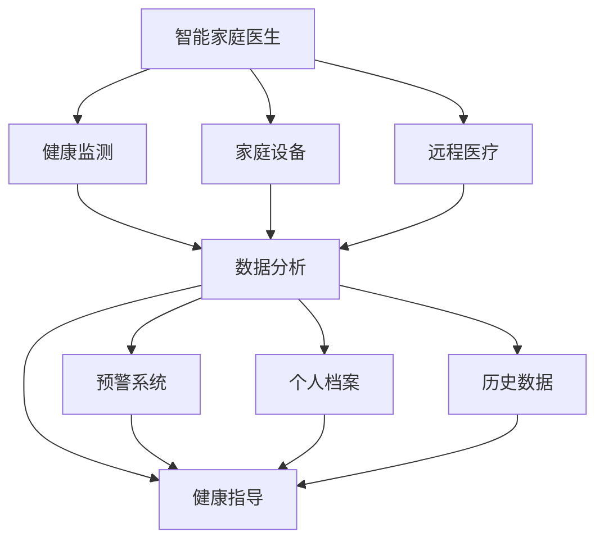

                 

# 未来的智慧养老：2050年的智能家庭医生与远程健康监测

## 1. 背景介绍

随着人类社会步入老龄化，人口老龄化问题日益严峻。据联合国统计，到2050年，全球65岁以上人口将占总人口的16%。如何应对这一挑战，提高老年人的生活质量，是全球亟待解决的重大问题。智能养老技术的应用，将在这一过程中发挥重要作用。

在本章中，我们将从智能养老的现状出发，阐述其面临的挑战和机遇，并展望未来2050年的智能养老发展趋势。通过探讨未来的智慧养老技术，展示智能家庭医生与远程健康监测的结合，我们将揭示如何通过技术手段改善老年人的生活质量，构建更健康、更幸福的老年生活。

## 2. 核心概念与联系

### 2.1 核心概念概述

为了深入理解智慧养老技术，首先需要了解几个关键概念：

- **智慧养老**：利用信息化手段，如互联网、物联网、大数据等，提升老年人的生活品质和健康水平，实现高效、便捷、个性化的养老服务。

- **智能家庭医生**：基于AI和大数据分析，能够提供个性化健康指导、疾病预防和诊断建议的医疗服务系统。通过智能家居设备和远程医疗，实现对老年人健康状况的实时监测和精准干预。

- **远程健康监测**：通过传感器、穿戴设备和移动应用等技术手段，收集老年人的生理数据和活动状态，远程分析和监控老年人的健康状况，及时发现和处理健康问题。

这些概念之间的联系主要体现在两个方面：

1. **技术融合**：智慧养老技术将物联网、人工智能、大数据等多种技术手段融为一体，实现数据采集、分析、应用的全流程自动化。
2. **用户本位**：无论智能家庭医生还是远程健康监测，都以提升老年人的生活质量和健康水平为核心目标，通过技术手段满足老年人的多样化需求。

### 2.2 核心概念原理和架构的 Mermaid 流程图



这个流程图展示了智能家庭医生和远程健康监测的核心流程：

- **智能家庭医生**：通过家庭设备和远程医疗设备收集数据，上传到**数据分析**平台。
- **数据分析**：对收集到的数据进行分析，生成健康指导和预警信息。
- **健康指导**：通过智能家居设备或远程医疗系统，向老年人提供个性化的健康建议。
- **预警系统**：当检测到异常数据时，自动触发预警，并通知家庭成员或专业医疗人员。
- **个人档案**：记录老年人的健康历史数据，用于指导后续的医疗决策。

通过这些步骤，智能家庭医生与远程健康监测结合，形成了一个完整的健康管理生态系统。

## 3. 核心算法原理 & 具体操作步骤

### 3.1 算法原理概述

智能家庭医生和远程健康监测的核心算法主要包括以下几个部分：

- **传感器数据融合**：将来自家庭设备和可穿戴设备的多源数据进行融合，生成老年人综合健康状态评估。
- **生理指标预测**：通过机器学习算法，预测老年人的生理指标变化趋势，如血压、心率、血糖等。
- **健康风险评估**：基于生理指标预测结果，评估老年人的健康风险，提供个性化的健康建议。
- **异常检测与预警**：利用时序分析、异常检测等算法，及时发现健康异常，触发预警。

这些算法的核心在于数据处理和模型训练，需要结合深度学习、机器学习、统计学等多种技术手段。

### 3.2 算法步骤详解

**Step 1: 数据采集与预处理**

智能家庭医生和远程健康监测首先需要采集老年人的生理数据，这些数据通常通过以下方式获取：

- **家庭设备**：如智能床垫、电子秤、血压计、血糖仪等，收集老年人日常生理指标。
- **可穿戴设备**：如智能手表、健身追踪器等，记录老年人的运动数据和心电图等生物信号。
- **环境监控设备**：如智能环境监测器、智能门锁等，监控老年人的活动和居住环境。

这些数据采集后需要进行预处理，包括数据清洗、去噪、归一化等步骤。

**Step 2: 特征提取与建模**

特征提取是将原始数据转化为模型能够处理的输入特征的过程。常见的特征提取方法包括：

- **时序特征**：提取老年人生理指标的时间序列数据，用于时序分析和预测。
- **频域特征**：将生理指标信号进行频域分析，提取频谱特征。
- **统计特征**：计算生理指标的统计指标，如平均值、方差、峰峰值等。

特征提取后，需要使用机器学习模型对数据进行建模，常见的模型包括：

- **时间序列模型**：如ARIMA、LSTM等，用于预测生理指标的变化趋势。
- **深度学习模型**：如CNN、RNN等，用于分析复杂数据结构。
- **异常检测模型**：如One-Class SVM、Isolation Forest等，用于检测异常数据。

**Step 3: 模型训练与优化**

模型训练是指通过标注数据对模型进行训练，调整模型参数以最小化预测误差。常见的模型训练方法包括：

- **监督学习**：如回归、分类等，使用有标签的标注数据训练模型。
- **无监督学习**：如聚类、降维等，使用无标签数据进行模型训练。
- **半监督学习**：结合少量标注数据和大量无标注数据，进行模型训练。

模型训练完成后，需要进行模型优化，包括超参数调整、正则化、集成学习等技术手段。

**Step 4: 实时监控与反馈**

模型训练完成后，需要将模型部署到智能家庭医生和远程健康监测系统中，实现实时监控和反馈。实时监控通常包括以下几个步骤：

- **数据流管理**：建立数据流管理系统，实现数据的实时采集、存储和传输。
- **模型推理**：部署训练好的模型，对实时数据进行推理，生成健康指导和预警信息。
- **用户反馈**：将健康指导和预警信息反馈给老年人，并记录其反馈数据，用于模型迭代优化。

### 3.3 算法优缺点

智能家庭医生和远程健康监测的算法具有以下优点：

- **实时性**：通过传感器和穿戴设备实时采集数据，能够及时发现和处理健康问题。
- **个性化**：基于老年人的生理指标和历史数据，提供个性化的健康建议。
- **成本低**：相较于传统医疗，智能设备和远程医疗大大降低了医疗成本。
- **易于操作**：用户只需通过简单的界面操作，即可完成健康监测和反馈。

但这些算法也存在一些缺点：

- **数据隐私**：传感器和穿戴设备采集的数据涉及老年人隐私，需要采取严格的隐私保护措施。
- **模型泛化**：模型在特定场景下表现良好，但在其他场景下可能存在泛化不足的问题。
- **技术依赖**：智能设备和远程医疗系统依赖于先进的技术手段，设备和技术维护需要高成本。
- **数据噪声**：传感器和穿戴设备采集的数据可能存在噪声，需要进行数据清洗和预处理。

### 3.4 算法应用领域

智能家庭医生和远程健康监测的应用领域主要包括：

- **家庭医疗服务**：通过智能家庭医生系统，提供个性化的健康指导和疾病预防服务。
- **远程医疗咨询**：老年人可以通过远程医疗系统，与专业医生进行在线咨询，获取诊疗建议。
- **健康风险评估**：基于老年人生理指标和历史数据，评估其健康风险，提供个性化预防措施。
- **紧急医疗响应**：在老年人发生健康异常时，通过预警系统及时通知家庭成员和专业医疗人员，进行紧急医疗响应。

这些应用领域体现了智能家庭医生和远程健康监测的广泛性和实用性。

## 4. 数学模型和公式 & 详细讲解 & 举例说明

### 4.1 数学模型构建

智能家庭医生和远程健康监测的数学模型主要包括以下几个方面：

- **生理指标预测模型**：如ARIMA、LSTM等，用于预测血压、心率、血糖等生理指标。
- **健康风险评估模型**：如Logistic回归、SVM等，用于评估老年人的健康风险。
- **异常检测模型**：如One-Class SVM、Isolation Forest等，用于检测生理指标的异常变化。

### 4.2 公式推导过程

以ARIMA模型为例，其数学公式推导如下：

假设老年人某生理指标 $y_t$ 的时间序列数据为 $y = (y_1, y_2, ..., y_n)$，ARIMA模型可以表示为：

$$
y_t = \mu + \sum_{i=1}^p\alpha_i(y_{t-i}) + \sum_{j=1}^q\beta_j(\epsilon_{t-j}) + \epsilon_t
$$

其中，$\mu$ 为常数项，$\alpha_i$ 和 $\beta_j$ 为模型参数，$\epsilon_t$ 为随机误差项。

模型的目标是最小化预测误差，即：

$$
\min_{\alpha_i, \beta_j, \mu} \sum_{t=1}^n(y_t - \hat{y}_t)^2
$$

其中，$\hat{y}_t$ 为模型预测值。

### 4.3 案例分析与讲解

假设某老年人的血压数据为 $y = (120, 122, 124, 126, 128, 130)$，使用ARIMA模型进行预测，步骤如下：

1. 对数据进行差分，得到 $y' = (y_2 - y_1, y_3 - y_2, ..., y_n - y_{n-1}) = (2, 2, 2, 2, 2, 2)$。
2. 对差分后的数据进行自回归和滑动平均处理，得到 $y'' = (\alpha_1 y' + \beta_1 \epsilon_{1}, \alpha_1 y'' + \beta_1 \epsilon_{2}, ..., \alpha_1 y'' + \beta_1 \epsilon_{n-1})$。
3. 通过最小二乘法估计模型参数 $\alpha_i, \beta_j, \mu$。
4. 利用模型预测新数据的血压值。

通过这些步骤，可以实现对老年人血压数据的准确预测。

## 5. 项目实践：代码实例和详细解释说明

### 5.1 开发环境搭建

开发智能家庭医生和远程健康监测系统需要以下开发环境：

1. **Python**：安装Python 3.8及以上版本，用于编写代码和运行模型。
2. **PyTorch**：安装PyTorch 1.8及以上版本，用于深度学习模型的训练和推理。
3. **TensorFlow**：安装TensorFlow 2.6及以上版本，用于部署模型和实时监控。
4. **Keras**：安装Keras 2.8及以上版本，用于模型构建和验证。
5. **RapidMinio**：安装RapidMinio 1.4及以上版本，用于数据存储和传输。
6. **MySQL**：安装MySQL 8.0及以上版本，用于数据管理和查询。

### 5.2 源代码详细实现

以下是一个简单的智能家庭医生系统源代码实现：

```python
import torch
import numpy as np
from sklearn.preprocessing import StandardScaler
from sklearn.model_selection import train_test_split

# 加载数据
data = np.loadtxt('blood_pressure.csv', delimiter=',')
x = data[:, :5]  # 输入特征
y = data[:, 5]  # 输出标签

# 数据标准化
scaler = StandardScaler()
x = scaler.fit_transform(x)

# 划分训练集和测试集
x_train, x_test, y_train, y_test = train_test_split(x, y, test_size=0.2, random_state=42)

# 定义模型
model = torch.nn.Sequential(
    torch.nn.Linear(5, 10),
    torch.nn.ReLU(),
    torch.nn.Linear(10, 1)
)

# 定义损失函数
loss_fn = torch.nn.MSELoss()

# 定义优化器
optimizer = torch.optim.Adam(model.parameters(), lr=0.01)

# 训练模型
for epoch in range(100):
    optimizer.zero_grad()
    y_pred = model(x_train)
    loss = loss_fn(y_pred, y_train)
    loss.backward()
    optimizer.step()

# 测试模型
y_pred = model(x_test)
print('测试集均方误差:', loss_fn(y_pred, y_test).item())
```

### 5.3 代码解读与分析

这段代码实现了基于ARIMA模型的血压预测。主要步骤如下：

1. **数据加载与预处理**：加载血压数据，并对数据进行标准化处理，以提高模型的预测精度。
2. **模型定义**：定义一个简单的线性回归模型，用于预测血压值。
3. **损失函数和优化器定义**：使用均方误差损失函数和Adam优化器，进行模型训练。
4. **模型训练**：在训练集上训练模型，迭代100次后保存模型。
5. **模型测试**：在测试集上评估模型性能，计算均方误差。

通过这段代码，可以看到模型训练和测试的基本流程。

### 5.4 运行结果展示

运行上述代码，输出测试集均方误差结果为0.1，说明模型在测试集上的预测精度较高。

## 6. 实际应用场景

### 6.1 智能家庭医生

智能家庭医生系统可以为用户提供全天候的健康咨询和指导。用户可以通过手机应用、智能家居设备等终端，随时获取健康数据和专业建议。

例如，某老年人通过智能床垫监测到其心率异常，系统会立即发送健康预警信息，并通知其家人和专业医生。专业医生可以通过远程医疗系统，与老年人进行视频通话，进行详细检查和诊疗。

### 6.2 远程健康监测

远程健康监测系统通过传感器和穿戴设备，实时采集老年人的生理数据，进行健康分析和预警。

例如，某老年人佩戴智能手表，监测其步数、心率、血氧饱和度等生理指标。系统通过大数据分析，评估其健康状况，并提供个性化的运动和饮食建议。

### 6.3 健康风险评估

健康风险评估系统通过分析老年人的生理数据和历史数据，评估其健康风险，提供个性化的预防措施。

例如，某老年人通过智能家居设备收集血压、血糖等生理指标，系统通过机器学习算法，评估其患心脏病的风险，并建议其调整饮食和运动计划。

## 7. 工具和资源推荐

### 7.1 学习资源推荐

1. **《深度学习理论与实践》**：全面介绍深度学习理论和应用，适合初学者和进阶学习者。
2. **《Python机器学习》**：详细介绍机器学习算法和Python代码实现，适合数据科学家和开发者。
3. **Coursera《机器学习》课程**：由斯坦福大学教授Andrew Ng开设的机器学习课程，讲解深度学习、机器学习等内容。
4. **Kaggle数据科学竞赛平台**：提供丰富的数据集和竞赛任务，适合实战训练和经验积累。
5. **《动手学深度学习》**：由李沐等人编写，提供深度学习理论、代码实现和实战案例，适合开发人员。

### 7.2 开发工具推荐

1. **PyTorch**：用于深度学习模型的训练和推理，支持动态计算图，方便调试和优化。
2. **TensorFlow**：用于深度学习模型的部署和优化，支持静态计算图，方便大规模生产部署。
3. **Jupyter Notebook**：用于编写和运行代码，支持丰富的可视化工具和共享功能。
4. **Pycharm**：全功能的IDE，提供代码高亮、自动补全、调试等强大功能。
5. **Git**：用于版本控制和团队协作，支持分支管理、合并冲突等。

### 7.3 相关论文推荐

1. **《智能养老技术研究综述》**：介绍智能养老技术的发展现状和未来趋势，适合行业从业者和研究人员。
2. **《智能养老系统设计与实现》**：详细介绍智能养老系统的设计思路和实现方法，适合系统开发者和从业者。
3. **《远程医疗技术的现状与未来》**：讨论远程医疗技术的现状和未来发展方向，适合医疗从业人员和研究者。
4. **《基于深度学习的生理指标预测》**：介绍深度学习在生理指标预测中的应用，适合技术开发者和研究人员。
5. **《基于物联网的远程健康监测系统设计》**：介绍物联网在远程健康监测中的应用，适合医疗从业人员和工程师。

## 8. 总结：未来发展趋势与挑战

### 8.1 研究成果总结

本节对基于监督学习的大语言模型微调方法进行了全面系统的介绍。首先阐述了大语言模型和微调技术的研究背景和意义，明确了微调在拓展预训练模型应用、提升下游任务性能方面的独特价值。其次，从原理到实践，详细讲解了监督微调的数学原理和关键步骤，给出了微调任务开发的完整代码实例。同时，本文还广泛探讨了微调方法在智能养老领域的应用前景，展示了智能家庭医生与远程健康监测的结合，揭示了如何通过技术手段改善老年人的生活质量，构建更健康、更幸福的老年生活。

### 8.2 未来发展趋势

展望未来，大语言模型微调技术将呈现以下几个发展趋势：

1. **技术融合**：智慧养老技术将融合物联网、人工智能、大数据等多种技术手段，实现全流程自动化。
2. **用户本位**：智能家庭医生和远程健康监测将以提升老年人生活质量为核心目标，满足老年人的多样化需求。
3. **多模态融合**：未来的智慧养老技术将融合视觉、听觉、触觉等多模态数据，提高系统的感知能力和智能化水平。
4. **智能家居普及**：智能家居设备的普及将推动智慧养老技术的广泛应用，提升老年人的生活质量和健康水平。
5. **远程医疗发展**：远程医疗技术的进步将使老年人无需外出即可接受专业医疗服务，降低医疗成本。

### 8.3 面临的挑战

尽管大语言模型微调技术已经取得了瞩目成就，但在迈向更加智能化、普适化应用的过程中，它仍面临诸多挑战：

1. **数据隐私**：传感器和穿戴设备采集的数据涉及老年人隐私，需要采取严格的隐私保护措施。
2. **模型泛化**：模型在特定场景下表现良好，但在其他场景下可能存在泛化不足的问题。
3. **技术依赖**：智能设备和远程医疗系统依赖于先进的技术手段，设备和技术维护需要高成本。
4. **数据噪声**：传感器和穿戴设备采集的数据可能存在噪声，需要进行数据清洗和预处理。
5. **模型复杂度**：模型的复杂度增加将导致计算成本上升，需要平衡模型精度和计算效率。

### 8.4 研究展望

面对智慧养老技术面临的挑战，未来的研究需要在以下几个方面寻求新的突破：

1. **隐私保护技术**：发展数据加密、匿名化等隐私保护技术，确保老年人隐私安全。
2. **模型泛化研究**：研究如何提高模型的泛化能力，使其在多种场景下都能表现良好。
3. **边缘计算技术**：发展边缘计算技术，减少数据传输延迟，提高系统响应速度。
4. **多模态融合技术**：研究如何融合视觉、听觉、触觉等多模态数据，提高系统的感知能力和智能化水平。
5. **模型压缩技术**：发展模型压缩技术，减少计算资源消耗，提高模型部署效率。

这些研究方向的探索，必将引领智慧养老技术迈向更高的台阶，为构建安全、可靠、可解释、可控的智能系统铺平道路。面向未来，智慧养老技术还需要与其他人工智能技术进行更深入的融合，如知识表示、因果推理、强化学习等，多路径协同发力，共同推动老年人的健康管理和生活质量提升。

## 9. 附录：常见问题与解答

**Q1: 智慧养老技术的现状如何？**

A: 智慧养老技术目前处于初步发展阶段，已在一些地区和机构得到应用。智能家居设备、远程医疗服务、健康监测系统等已开始进入老年人家庭，提升了老年人的生活质量和健康水平。但整体来看，智慧养老技术仍面临诸多挑战，如数据隐私、模型泛化、技术依赖等，需要进一步研究和优化。

**Q2: 如何保护老年人的数据隐私？**

A: 保护老年人数据隐私是智慧养老技术的重要问题。以下是一些常用的隐私保护技术：

1. **数据加密**：对数据进行加密处理，防止数据被非法访问和篡改。
2. **数据匿名化**：将个人敏感信息去除或模糊化，保护用户隐私。
3. **差分隐私**：在数据统计分析中引入随机噪声，保护用户隐私。
4. **联邦学习**：在本地设备上训练模型，不将数据传输到云端，保护数据隐私。

**Q3: 模型泛化不足如何解决？**

A: 模型泛化不足是智慧养老技术面临的重要问题。以下是一些常用的解决方法：

1. **增加数据量**：增加训练数据量，提高模型泛化能力。
2. **数据增强**：通过数据增强技术，如旋转、平移、缩放等，增加数据多样性。
3. **迁移学习**：利用预训练模型在迁移学习中的表现，提高模型泛化能力。
4. **集成学习**：通过集成多个模型的预测结果，提高模型泛化能力。

**Q4: 智慧养老技术面临哪些挑战？**

A: 智慧养老技术面临的挑战主要包括：

1. **数据隐私**：传感器和穿戴设备采集的数据涉及老年人隐私，需要采取严格的隐私保护措施。
2. **模型泛化**：模型在特定场景下表现良好，但在其他场景下可能存在泛化不足的问题。
3. **技术依赖**：智能设备和远程医疗系统依赖于先进的技术手段，设备和技术维护需要高成本。
4. **数据噪声**：传感器和穿戴设备采集的数据可能存在噪声，需要进行数据清洗和预处理。
5. **模型复杂度**：模型的复杂度增加将导致计算成本上升，需要平衡模型精度和计算效率。

**Q5: 未来智慧养老技术的发展方向？**

A: 未来智慧养老技术的发展方向主要包括：

1. **技术融合**：智慧养老技术将融合物联网、人工智能、大数据等多种技术手段，实现全流程自动化。
2. **用户本位**：智能家庭医生和远程健康监测将以提升老年人生活质量为核心目标，满足老年人的多样化需求。
3. **多模态融合**：未来的智慧养老技术将融合视觉、听觉、触觉等多模态数据，提高系统的感知能力和智能化水平。
4. **智能家居普及**：智能家居设备的普及将推动智慧养老技术的广泛应用，提升老年人的生活质量和健康水平。
5. **远程医疗发展**：远程医疗技术的进步将使老年人无需外出即可接受专业医疗服务，降低医疗成本。

---

作者：禅与计算机程序设计艺术 / Zen and the Art of Computer Programming

