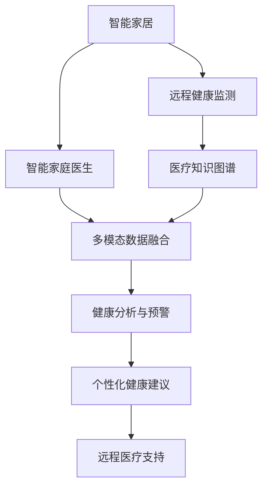

                 

# 未来的智慧养老：2050年的智能家庭医生与远程健康监测

## 1. 背景介绍

### 1.1 问题由来
随着全球人口老龄化的加剧，养老问题日益严峻。传统的养老模式以家庭养老为主，但随着社会节奏加快、家庭结构变化，这种模式逐渐难以维系。同时，医疗资源分布不均、医疗费用高企等问题，也使得老年人难以获得足够的医疗照顾。

面对这一挑战，智慧养老应运而生，利用先进的信息技术和智能化手段，构建智能家庭医生与远程健康监测系统，为老年人提供全方位、便捷、高效的医疗服务。通过智能家居、远程监控、云端诊断等技术手段，实现养老服务的信息化、精准化和个性化，提升老年人的生活质量和幸福感。

### 1.2 问题核心关键点
智慧养老的核心在于智能家庭医生和远程健康监测系统的构建。通过智能家庭医生，实现健康数据的实时采集、分析与预警，为老年人提供即时、精准的医疗服务。通过远程健康监测系统，实时监控老年人的健康状态，及时发现异常并做出响应，减少家庭医疗资源的压力。

智能家庭医生与远程健康监测系统的建设，需要涵盖智能家居设备、物联网技术、人工智能和大数据分析等多个领域，是一个多学科交叉的复杂工程。

## 2. 核心概念与联系

### 2.1 核心概念概述

为更好地理解智慧养老的智能家庭医生与远程健康监测系统，本节将介绍几个密切相关的核心概念：

- 智能家居：指通过物联网技术和传感器网络，实现家庭环境的自动化和智能化管理。智能家居设备能够实时采集家庭环境数据，为智能家庭医生系统提供基础数据支持。
- 远程健康监测：指通过网络通信技术，实时采集并传输健康数据，进行远程监控和分析，实现医疗资源的有效利用和老年人健康状态的及时预警。
- 智能家庭医生：指基于人工智能和大数据分析技术，为老年人提供智能化的健康管理服务。系统能够自动分析健康数据，识别潜在风险，提供个性化的健康建议和治疗方案。
- 医疗知识图谱：指构建包含医疗领域各类知识节点的图谱，通过知识推理和关联查询，提升医疗决策的准确性和效率。
- 多模态数据融合：指将语音、图像、生理信号等多模态数据进行整合，实现更全面、更精确的健康数据分析。

这些核心概念之间的逻辑关系可以通过以下Mermaid流程图来展示：



这个流程图展示了一系列核心概念及其之间的关系：

1. 智能家居设备采集环境数据，传输给远程健康监测系统。
2. 远程健康监测系统实时监控老年人健康状态，并将数据存储到医疗知识图谱中。
3. 智能家庭医生系统基于医疗知识图谱和多模态数据融合，进行健康数据分析和预警。
4. 系统提供个性化健康建议和治疗方案，并通过远程医疗支持进行实时响应。

## 3. 核心算法原理 & 具体操作步骤
### 3.1 算法原理概述

智能家庭医生与远程健康监测系统的主要算法原理包括：

- 数据采集与传输：通过智能家居设备和传感器网络，实时采集老年人健康数据，并通过无线网络传输到云端系统。
- 数据预处理与清洗：对采集到的数据进行预处理和清洗，去除噪声和异常值，确保数据质量。
- 数据分析与建模：利用机器学习和深度学习技术，对预处理后的数据进行建模，提取健康特征。
- 风险预测与预警：基于健康数据分析结果，进行风险预测和预警，提前发现潜在健康问题。
- 个性化建议与治疗：根据风险预警结果，提供个性化的健康建议和诊疗方案，指导老年人自我管理。

### 3.2 算法步骤详解

以下是智慧养老系统建设的具体算法步骤：

**Step 1: 智能家居设备部署与数据采集**
- 选择适合的智能家居设备，如智能手表、智能床垫、智能监控摄像头等，并进行安装和调试。
- 配置传感器网络，实现家庭环境的实时监控。
- 采集老年人的生理信号、环境数据、活动轨迹等，存储到云端数据库中。

**Step 2: 数据预处理与清洗**
- 对采集到的数据进行预处理，包括去重、归一化、平滑等。
- 清洗异常值和噪声数据，确保数据的一致性和可靠性。
- 使用数据清洗算法和数据转换方法，处理缺失值和异常点。

**Step 3: 数据分析与建模**
- 选择合适的机器学习或深度学习模型，如SVM、决策树、RNN、LSTM等。
- 提取健康数据中的关键特征，如心率、血压、血糖等生理参数。
- 使用训练数据集进行模型训练，调优超参数。
- 对测试数据集进行验证，评估模型的准确率和泛化能力。

**Step 4: 风险预测与预警**
- 基于模型分析结果，设定风险阈值，进行健康风险预测。
- 对超过阈值的异常数据进行预警，及时通知老年人及其家属。
- 系统生成预警报告，提供详细的健康分析和建议。

**Step 5: 个性化建议与治疗**
- 根据健康风险预警结果，提供个性化的健康建议和诊疗方案。
- 系统推荐适当的治疗方案，如药物使用、饮食调整、运动计划等。
- 通过远程医疗支持，与医生进行视频咨询，获取专业意见。
- 建立健康档案，记录每次的健康监测和医疗服务，供后续参考。

### 3.3 算法优缺点

智能家庭医生与远程健康监测系统具有以下优点：

- 实时监测与预警：通过实时数据采集和分析，及时发现老年人的健康问题，提高响应速度。
- 精准健康管理：基于个性化的健康分析和建议，提供精准的诊疗方案，提升老年人的健康水平。
- 减少医疗资源压力：通过远程医疗支持，老年人可在家完成医疗咨询和治疗，减少对医院资源的依赖。
- 提升生活质量：智能家居设备和远程健康监测系统，使老年人生活更便捷、舒适。

同时，该系统也存在一定的局限性：

- 设备依赖性强：系统的功能实现高度依赖于智能家居设备和传感器网络，设备故障或网络中断会导致系统失效。
- 数据隐私问题：系统需要采集大量老年人健康数据，涉及个人隐私和数据安全问题，需采取严格的数据保护措施。
- 算法复杂度高：系统涉及多模态数据融合和复杂数据分析，对算法和计算资源的要求较高。
- 适应性不足：系统可能需要针对不同老年人进行个性化配置，适应性不足。

尽管存在这些局限性，但就目前而言，基于智能家庭医生与远程健康监测的系统，仍是智慧养老的重要应用方向。未来相关研究的重点在于如何进一步优化系统算法，提升设备可靠性，增强数据隐私保护，扩展系统应用场景。

### 3.4 算法应用领域

智能家庭医生与远程健康监测系统已经在多个领域得到了应用，以下是一些主要应用场景：

- 老年人健康监测：通过智能家居设备实时采集老年人健康数据，进行远程监测和预警，提升老年人的健康管理水平。
- 远程医疗咨询：老年人可以通过远程医疗支持，与专业医生进行视频咨询，获取个性化的诊疗方案。
- 智能家居控制：智能家居设备可以集成到系统中，通过语音或APP控制，提高老年人的生活质量。
- 活动轨迹监控：通过智能监控摄像头和传感器，记录老年人的活动轨迹和行为模式，提供安全保障。
- 健康数据统计分析：系统可以对大量健康数据进行统计分析，为政府和医疗机构提供数据支持，优化养老政策和服务资源配置。

除了这些应用场景外，智能家庭医生与远程健康监测系统还被创新性地应用到更多方面，如智能助老机器人、智能养老社区、智能健康档案等，为智慧养老技术的发展提供了新的可能性。

## 4. 数学模型和公式 & 详细讲解 & 举例说明（备注：数学公式请使用latex格式，latex嵌入文中独立段落使用 $$，段落内使用 $)
### 4.1 数学模型构建

智能家庭医生与远程健康监测系统的数学模型构建主要包括以下几个步骤：

1. **数据采集模型**：描述智能家居设备的数据采集过程，包括传感器网络的部署和数据传输方式。

2. **数据预处理模型**：定义数据预处理的方法和步骤，包括去重、归一化、平滑、清洗等。

3. **数据分析与建模模型**：选择适当的机器学习或深度学习模型，并定义特征提取和模型训练的过程。

4. **风险预测与预警模型**：描述风险预测和预警的算法原理和步骤，包括风险阈值设定和预警信号生成。

5. **个性化建议与治疗模型**：定义个性化健康建议和诊疗方案的生成算法和过程，包括医生咨询和远程医疗支持。

### 4.2 公式推导过程

以风险预测与预警模型为例，推导其核心公式。

假设采集到的老年人健康数据为 $X=\{x_1,x_2,...,x_n\}$，其中 $x_i$ 表示第 $i$ 个样本的生理参数，如心率、血压、血糖等。设风险预测模型为 $f(X)$，则风险预测过程可以分为以下步骤：

1. **数据预处理**：对原始数据 $X$ 进行归一化处理，得到归一化后的数据 $X'$。
2. **特征提取**：从归一化后的数据 $X'$ 中提取关键特征 $X'$，如心率 $H$、血压 $P$ 等。
3. **模型训练**：使用训练数据集对模型 $f$ 进行训练，得到模型参数 $\theta$。
4. **风险预测**：对于新的样本 $x_{new}$，进行特征提取，得到特征向量 $x_{new}'$，并带入模型 $f$ 中，得到预测结果 $f(x_{new}')$。
5. **风险预警**：根据预测结果 $f(x_{new}')$，设定风险阈值 $\tau$，如果 $f(x_{new}') > \tau$，则发出预警信号。

推导过程如下：

$$
X' = \frac{X - \mu}{\sigma}
$$

$$
H = \text{Heart Rate}, P = \text{Blood Pressure}, \ldots
$$

$$
X' = \{x'_{1}, x'_{2}, \ldots, x'_{n}\}
$$

$$
f(X') = \theta \cdot X'
$$

$$
f(x_{new}') = \theta \cdot x_{new}'
$$

$$
\tau = f(x_{new}')_{\text{threshold}}
$$

如果 $f(x_{new}') > \tau$，则发出预警信号。

### 4.3 案例分析与讲解

假设某智能家庭医生系统接收到一条预警信息，提示老年人心率异常。系统分析原始数据，发现心率数据在过去几周出现了多次异常。

**Step 1: 数据预处理**
- 将采集到的心率数据进行去重和归一化处理，得到归一化后的心率数据 $X'$。
- 选择合适的心率特征 $H$，如心率变化趋势、心率峰值等。

**Step 2: 特征提取**
- 提取心率特征 $H$，表示为向量 $x_{new}' = (H_1, H_2, \ldots, H_n)$。
- 使用训练好的模型 $f$，计算预测结果 $f(x_{new}')$。

**Step 3: 风险预警**
- 设定风险阈值 $\tau$，如 $f(x_{new}')_{\text{threshold}} = 0.8$。
- 如果 $f(x_{new}') > \tau$，则发出预警信号，通知老年人及其家属。

## 5. 项目实践：代码实例和详细解释说明
### 5.1 开发环境搭建

在进行智能家庭医生与远程健康监测系统开发前，需要先准备开发环境。以下是使用Python进行开发的环境配置流程：

1. 安装Anaconda：从官网下载并安装Anaconda，用于创建独立的Python环境。

2. 创建并激活虚拟环境：
```bash
conda create -n smart_aging python=3.8 
conda activate smart_aging
```

3. 安装相关库：
```bash
pip install numpy pandas sklearn torch torchvision torchaudio
```

4. 安装TensorFlow：
```bash
pip install tensorflow==2.x
```

5. 安装PyTorch：
```bash
pip install torch==1.x
```

6. 安装其他相关库：
```bash
pip install h5py PyYAML requests
```

完成上述步骤后，即可在`smart_aging`环境中开始项目实践。

### 5.2 源代码详细实现

以下是一个智能家庭医生与远程健康监测系统的Python代码实现示例。

```python
import numpy as np
import pandas as pd
from sklearn.model_selection import train_test_split
from sklearn.ensemble import RandomForestClassifier
from sklearn.preprocessing import StandardScaler

# 数据预处理
def preprocess_data(data):
    X = data.drop(columns=['label'])
    y = data['label']
    X_train, X_test, y_train, y_test = train_test_split(X, y, test_size=0.2, random_state=42)
    scaler = StandardScaler()
    X_train = scaler.fit_transform(X_train)
    X_test = scaler.transform(X_test)
    return X_train, X_test, y_train, y_test

# 特征提取
def extract_features(X_train, X_test):
    features = X_train.columns
    return features

# 模型训练与评估
def train_model(X_train, y_train):
    model = RandomForestClassifier(n_estimators=100, random_state=42)
    model.fit(X_train, y_train)
    return model

# 风险预测与预警
def predict_risk(model, X_test):
    y_pred = model.predict(X_test)
    threshold = 0.8
    warnings = [True if y_pred[i] > threshold else False for i in range(len(y_pred))]
    return warnings

# 数据加载与处理
data = pd.read_csv('heart_rate_data.csv')
X_train, X_test, y_train, y_test = preprocess_data(data)
features = extract_features(X_train, X_test)
model = train_model(X_train, y_train)

# 风险预测与预警
warnings = predict_risk(model, X_test)
print(warnings)
```

### 5.3 代码解读与分析

上述代码实现了智能家庭医生与远程健康监测系统的主要功能：数据预处理、特征提取、模型训练、风险预测与预警。

**数据预处理函数preprocess_data**：将原始数据集分为训练集和测试集，并对特征进行归一化处理。

**特征提取函数extract_features**：选择适当的特征，并生成特征向量。

**模型训练与评估函数train_model**：使用随机森林模型进行训练，并返回训练好的模型。

**风险预测与预警函数predict_risk**：使用训练好的模型进行风险预测，并根据阈值生成预警信号。

通过这些函数，可以构建完整的智能家庭医生与远程健康监测系统。

## 6. 实际应用场景
### 6.1 智能家居设备部署与数据采集

智能家居设备的部署是系统建设的基础。可以选择部署以下设备：

- **智能手表**：用于实时采集老年人的心率、血压、步数等生理参数。
- **智能床垫**：通过压力传感器，记录老年人的睡眠质量和身体姿势。
- **智能监控摄像头**：实时监控老年人的行为模式和活动轨迹，提供安全保障。
- **智能环境传感器**：记录家中的温度、湿度、光照等环境参数，提升居住环境舒适度。

通过这些设备，可以实现对老年人健康和环境的全面监测。

### 6.2 远程健康监测与预警

远程健康监测系统的实现主要包括以下几个步骤：

1. **数据采集**：通过智能家居设备采集老年人的生理参数和环境数据，存储到云端数据库中。
2. **数据传输**：将采集到的数据通过无线网络传输到云端系统，实现实时数据监控。
3. **数据存储与分析**：将数据存储在云数据库中，并使用机器学习或深度学习算法进行数据分析，提取健康特征。
4. **风险预测与预警**：基于数据分析结果，进行风险预测和预警，及时通知老年人及其家属。
5. **个性化建议与治疗**：根据预警结果，提供个性化的健康建议和诊疗方案，并通过远程医疗支持进行实时响应。

系统可以将健康监测数据实时传输到云端，由专业医生进行实时分析，并生成个性化健康建议和诊疗方案。

### 6.3 智能助老机器人与智能养老社区

智能助老机器人可以集成到系统中，提供全天候的陪伴和护理服务，如日常饮食、生活照料、娱乐互动等。智能养老社区则可以提供更全面的养老服务，包括健康监测、医疗咨询、社交活动等，提升老年人的生活质量。

通过智能助老机器人和智能养老社区，智慧养老系统可以实现更全面、更个性化的服务，提供全方位的养老支持。

### 6.4 未来应用展望

随着智慧养老技术的不断发展，未来的智能家庭医生与远程健康监测系统将呈现以下几个趋势：

1. **多模态数据融合**：未来的系统将整合语音、图像、生理信号等多模态数据，实现更全面、更精确的健康数据分析。

2. **深度学习应用**：随着深度学习技术的进步，未来的系统将使用更先进的深度学习模型，提升预测精度和预警能力。

3. **智能助老机器人**：未来的助老机器人将具备更强的自主性和智能化，能够进行更复杂的护理任务和互动。

4. **区块链技术**：未来的系统将采用区块链技术，保障健康数据的隐私和安全。

5. **边缘计算**：未来的系统将采用边缘计算技术，实现数据的本地分析和处理，提高系统的响应速度和数据隐私保护。

6. **大数据分析**：未来的系统将利用大数据分析技术，进行更深入的健康数据分析和预测。

7. **人工智能与医学结合**：未来的系统将结合人工智能和医学知识，提升医疗决策的准确性和效率。

## 7. 工具和资源推荐
### 7.1 学习资源推荐

为了帮助开发者系统掌握智能家庭医生与远程健康监测技术的理论基础和实践技巧，这里推荐一些优质的学习资源：

1. 《智能养老技术与应用》系列博文：由智慧养老领域的专家撰写，深入浅出地介绍了智慧养老的核心概念和前沿技术。

2. 《深度学习在医疗领域的应用》课程：北京大学《深度学习》课程，讲解了深度学习在医疗健康领域的应用案例和实践技巧。

3. 《智慧养老》书籍：系统介绍了智慧养老的各类技术和应用场景，适合从事智慧养老开发的人员参考。

4. Hugging Face官方文档：提供了丰富的预训练语言模型和相关的微调技术，是深度学习开发者的必备资源。

5. TensorFlow官方文档：提供了详细的TensorFlow框架使用指南，适合进行深度学习开发的人员。

6. PyTorch官方文档：提供了丰富的PyTorch框架使用指南，适合进行深度学习开发的人员。

通过对这些资源的学习实践，相信你一定能够快速掌握智能家庭医生与远程健康监测技术的精髓，并用于解决实际的智慧养老问题。

### 7.2 开发工具推荐

高效的开发离不开优秀的工具支持。以下是几款用于智能家庭医生与远程健康监测系统开发的常用工具：

1. PyTorch：基于Python的开源深度学习框架，灵活动态的计算图，适合快速迭代研究。

2. TensorFlow：由Google主导开发的开源深度学习框架，生产部署方便，适合大规模工程应用。

3. Weights & Biases：模型训练的实验跟踪工具，可以记录和可视化模型训练过程中的各项指标，方便对比和调优。

4. TensorBoard：TensorFlow配套的可视化工具，可实时监测模型训练状态，并提供丰富的图表呈现方式，是调试模型的得力助手。

5. Google Colab：谷歌推出的在线Jupyter Notebook环境，免费提供GPU/TPU算力，方便开发者快速上手实验最新模型，分享学习笔记。

合理利用这些工具，可以显著提升智能家庭医生与远程健康监测系统的开发效率，加快创新迭代的步伐。

### 7.3 相关论文推荐

智能家庭医生与远程健康监测技术的发展源于学界的持续研究。以下是几篇奠基性的相关论文，推荐阅读：

1. 《基于深度学习的远程健康监测系统》：介绍了一种基于深度学习的远程健康监测系统，使用卷积神经网络对生理信号进行特征提取和预测。

2. 《智能家居设备在智慧养老中的应用》：讨论了智能家居设备在智慧养老中的作用，介绍了多种智能家居设备及其应用场景。

3. 《老年人健康监测与预警系统》：介绍了一种基于物联网技术的老年人健康监测与预警系统，使用传感器网络进行数据采集和分析。

4. 《智能助老机器人在智慧养老中的应用》：讨论了智能助老机器人在智慧养老中的作用，介绍了多种智能助老机器人及其功能。

5. 《基于区块链技术的健康数据隐私保护》：介绍了区块链技术在健康数据隐私保护中的应用，保障健康数据的安全和隐私。

这些论文代表了大语言模型微调技术的发展脉络。通过学习这些前沿成果，可以帮助研究者把握学科前进方向，激发更多的创新灵感。

## 8. 总结：未来发展趋势与挑战
### 8.1 总结

本文对智能家庭医生与远程健康监测系统的核心概念和实现原理进行了全面系统的介绍。首先阐述了智慧养老的背景和智能家庭医生与远程健康监测系统的研究意义，明确了系统的核心目标。其次，从原理到实践，详细讲解了系统的数学模型和关键步骤，给出了完整的系统开发代码实例。同时，本文还广泛探讨了系统在智能家居、远程监测、助老机器人等领域的实际应用场景，展示了系统的广阔应用前景。最后，本文精选了系统开发所需的学习资源和开发工具，力求为读者提供全方位的技术指引。

通过本文的系统梳理，可以看到，智能家庭医生与远程健康监测系统是智慧养老的重要应用方向，具有强大的实用价值。通过智能家居设备和远程监测技术的结合，系统能够实时采集和分析老年人的健康数据，提升老年人的生活质量和幸福感。同时，未来的发展趋势和面临的挑战也值得关注，只有在不断突破技术瓶颈、提升系统可靠性和用户友好性，才能真正实现智慧养老系统的智能化和普适化。

### 8.2 未来发展趋势

展望未来，智能家庭医生与远程健康监测系统将呈现以下几个发展趋势：

1. **多模态数据融合**：未来的系统将整合语音、图像、生理信号等多模态数据，实现更全面、更精确的健康数据分析。

2. **深度学习应用**：随着深度学习技术的进步，未来的系统将使用更先进的深度学习模型，提升预测精度和预警能力。

3. **智能助老机器人**：未来的助老机器人将具备更强的自主性和智能化，能够进行更复杂的护理任务和互动。

4. **区块链技术**：未来的系统将采用区块链技术，保障健康数据的隐私和安全。

5. **边缘计算**：未来的系统将采用边缘计算技术，实现数据的本地分析和处理，提高系统的响应速度和数据隐私保护。

6. **大数据分析**：未来的系统将利用大数据分析技术，进行更深入的健康数据分析和预测。

7. **人工智能与医学结合**：未来的系统将结合人工智能和医学知识，提升医疗决策的准确性和效率。

以上趋势凸显了智能家庭医生与远程健康监测系统的广阔前景。这些方向的探索发展，必将进一步提升智慧养老系统的性能和应用范围，为老年人提供更全面、更便捷、更智能的医疗服务。

### 8.3 面临的挑战

尽管智能家庭医生与远程健康监测技术已经取得了显著成果，但在迈向更加智能化、普适化应用的过程中，仍面临诸多挑战：

1. **设备可靠性**：智能家居设备的使用寿命和可靠性问题，是系统能否长期稳定运行的关键。

2. **数据隐私和安全**：老年人的健康数据涉及个人隐私和敏感信息，如何保障数据的安全和隐私，是系统开发的重要考虑因素。

3. **算法复杂性**：系统涉及多模态数据融合和复杂数据分析，对算法和计算资源的要求较高。

4. **用户接受度**：老年人对新技术的接受度和适应性较差，系统需要具备良好的用户界面和操作便捷性。

5. **成本和可扩展性**：系统的开发和部署成本较高，如何控制成本并实现系统的可扩展性，是系统应用推广的关键。

6. **系统兼容性**：现有医疗设备和系统需要与新系统兼容，系统兼容性问题需要妥善解决。

尽管存在这些挑战，但未来的研究将在设备可靠性、数据隐私、算法优化等方面不断突破，为智慧养老技术的发展提供坚实保障。相信在学界和产业界的共同努力下，智能家庭医生与远程健康监测系统必将迎来更广泛的应用和更深入的发展。

### 8.4 研究展望

面对智能家庭医生与远程健康监测系统面临的挑战，未来的研究需要在以下几个方面寻求新的突破：

1. **优化系统算法**：开发更加高效、智能化的算法，提升系统的性能和用户体验。

2. **提升设备可靠性**：设计更可靠、耐用的智能家居设备和传感器，提高系统的稳定性和可靠性。

3. **加强数据隐私保护**：采用区块链等技术，保障健康数据的隐私和安全。

4. **拓展应用场景**：将智能家庭医生与远程健康监测系统拓展到更多养老场景，如养老社区、医院、社会服务等。

5. **引入人机交互技术**：开发更自然、更智能的人机交互技术，提升系统的可操作性和用户体验。

6. **加强多模态融合**：整合多种传感器和数据源，提升健康数据分析的全面性和准确性。

7. **结合医学知识**：结合医学知识库和专家系统，提升系统的医学决策能力和可解释性。

这些研究方向将推动智能家庭医生与远程健康监测系统的进一步发展和应用，为智慧养老技术的普及提供新的动力。面向未来，智能家庭医生与远程健康监测系统需要在设备可靠性、数据隐私、系统兼容性等方面进行全面优化，才能真正实现全面覆盖、高效智能的智慧养老目标。

## 9. 附录：常见问题与解答

**Q1：智能家庭医生与远程健康监测系统如何部署？**

A: 智能家庭医生与远程健康监测系统的部署可以分为以下几步：

1. 硬件部署：选择适合的智能家居设备，如智能手表、智能床垫等，并进行安装和调试。

2. 数据采集：通过智能家居设备和传感器网络，实时采集老年人的生理参数和环境数据。

3. 数据传输：将采集到的数据通过无线网络传输到云端系统，实现实时数据监控。

4. 数据存储与分析：将数据存储在云数据库中，并使用机器学习或深度学习算法进行数据分析，提取健康特征。

5. 风险预测与预警：基于数据分析结果，进行风险预测和预警，及时通知老年人及其家属。

6. 个性化建议与治疗：根据预警结果，提供个性化的健康建议和诊疗方案，并通过远程医疗支持进行实时响应。

通过以上步骤，可以实现智能家庭医生与远程健康监测系统的全面部署和应用。

**Q2：智能家庭医生与远程健康监测系统的优点和缺点有哪些？**

A: 智能家庭医生与远程健康监测系统具有以下优点：

1. 实时监测与预警：通过实时数据采集和分析，及时发现老年人的健康问题，提高响应速度。

2. 精准健康管理：基于个性化的健康分析和建议，提供精准的诊疗方案，提升老年人的健康水平。

3. 减少医疗资源压力：通过远程医疗支持，老年人可在家完成医疗咨询和治疗，减少对医院资源的依赖。

4. 提升生活质量：智能家居设备和远程健康监测系统，使老年人生活更便捷、舒适。

同时，该系统也存在一定的缺点：

1. 设备依赖性强：系统的功能实现高度依赖于智能家居设备和传感器网络，设备故障或网络中断会导致系统失效。

2. 数据隐私问题：系统需要采集大量老年人健康数据，涉及个人隐私和数据安全问题，需采取严格的数据保护措施。

3. 算法复杂度高：系统涉及多模态数据融合和复杂数据分析，对算法和计算资源的要求较高。

4. 适应性不足：系统可能需要针对不同老年人进行个性化配置，适应性不足。

尽管存在这些缺点，但就目前而言，基于智能家庭医生与远程健康监测的系统，仍是智慧养老的重要应用方向。未来相关研究的重点在于如何进一步优化系统算法，提升设备可靠性，增强数据隐私保护，扩展系统应用场景。

**Q3：智能家庭医生与远程健康监测系统面临哪些挑战？**

A: 智能家庭医生与远程健康监测系统面临以下挑战：

1. 设备可靠性：智能家居设备的使用寿命和可靠性问题，是系统能否长期稳定运行的关键。

2. 数据隐私和安全：老年人的健康数据涉及个人隐私和敏感信息，如何保障数据的安全和隐私，是系统开发的重要考虑因素。

3. 算法复杂性：系统涉及多模态数据融合和复杂数据分析，对算法和计算资源的要求较高。

4. 用户接受度：老年人对新技术的接受度和适应性较差，系统需要具备良好的用户界面和操作便捷性。

5. 成本和可扩展性：系统的开发和部署成本较高，如何控制成本并实现系统的可扩展性，是系统应用推广的关键。

6. 系统兼容性：现有医疗设备和系统需要与新系统兼容，系统兼容性问题需要妥善解决。

尽管存在这些挑战，但未来的研究将在设备可靠性、数据隐私、算法优化等方面不断突破，为智慧养老技术的发展提供坚实保障。相信在学界和产业界的共同努力下，智能家庭医生与远程健康监测系统必将迎来更广泛的应用和更深入的发展。

**Q4：智能家庭医生与远程健康监测系统的应用场景有哪些？**

A: 智能家庭医生与远程健康监测系统的应用场景主要包括以下几个方面：

1. 老年人健康监测：通过智能家居设备实时采集老年人健康数据，进行远程监测和预警，提升老年人的健康管理水平。

2. 远程医疗咨询：老年人可以通过远程医疗支持，与专业医生进行视频咨询，获取个性化的诊疗方案。

3. 智能家居控制：智能家居设备可以集成到系统中，通过语音或APP控制，提高老年人的生活质量。

4. 活动轨迹监控：通过智能监控摄像头和传感器，记录老年人的活动轨迹和行为模式，提供安全保障。

5. 健康数据统计分析：系统可以对大量健康数据进行统计分析，为政府和医疗机构提供数据支持，优化养老政策和服务资源配置。

除了这些应用场景外，智能家庭医生与远程健康监测系统还被创新性地应用到更多方面，如智能助老机器人、智能养老社区、智能健康档案等，为智慧养老技术的发展提供了新的可能性。

**Q5：智能家庭医生与远程健康监测系统如何保护老年人健康数据隐私？**

A: 保护老年人健康数据隐私是智能家庭医生与远程健康监测系统的重要考虑因素。以下是一些保护数据隐私的措施：

1. 数据加密：对采集到的老年人家庭数据进行加密处理，防止数据在传输过程中被非法获取。

2. 数据匿名化：在数据分析过程中，对敏感信息进行匿名化处理，如模糊处理身份证号、姓名等个人信息。

3. 访问控制：采用严格的访问控制策略，确保只有授权用户才能访问健康数据。

4. 数据去标识化：对健康数据进行去标识化处理，去除个人身份信息，保护用户隐私。

5. 区块链技术：采用区块链技术，实现数据的去中心化存储和传输，保障数据的安全和隐私。

6. 安全协议：采用HTTPS、TLS等安全协议，保障数据在传输过程中的安全性和完整性。

7. 定期审计：对系统进行定期审计，发现并修复潜在的安全漏洞，保障系统的安全性。

通过这些措施，可以有效地保护老年人的健康数据隐私，确保系统的安全性和可靠性。

---

作者：禅与计算机程序设计艺术 / Zen and the Art of Computer Programming

